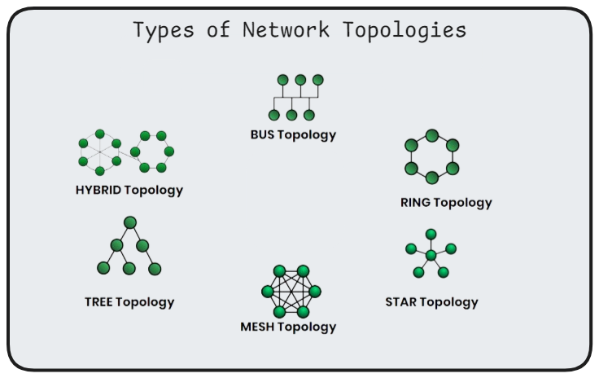
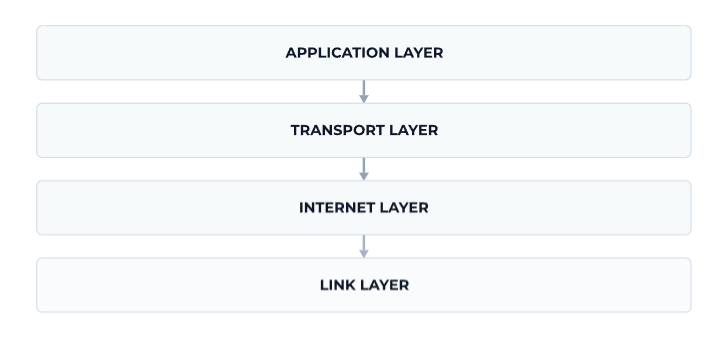
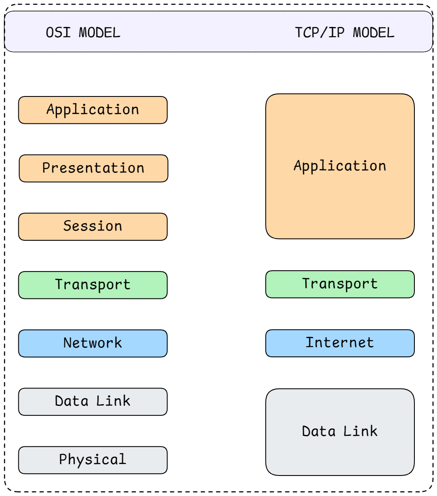

<h1 align="center">Computer Networking</h1>

A **computer network** is a system of interconnected devices (computers, servers, IoT devices, etc.) that communicate and share resources such as *files*, *printers*, *storage*, and *internet connections*. Devices can be connected using **wired** (Ethernet, fiber) or **wireless** (Wi-Fi, Bluetooth, cellular) communication channels.

Networking involves **hardware**, **software**, and **protocols** that define how data is transmitted, routed, and received between devices.

---

## 🧩 Types of Networks

- **LAN (Local Area Network)**: Small area network, such as a home, school, or office. Typically offers high-speed connections and is owned by a single organization.

- **WAN (Wide Area Network)**: Covers large geographical areas. The **Internet** is the largest WAN. Organizations often lease WAN connections from service providers.

- **MAN (Metropolitan Area Network)**: Connects multiple LANs within a city or large campus.

- **PAN (Personal Area Network)**: Very small network around a single person (e.g., Bluetooth, hotspot).

---

## 🔗 Network Topologies

Topology defines the **layout** or **structure** of how devices (nodes) are connected (physical and logical arrangement of devices in a network).

- **Bus Topology**: All devices share a single communication line (backbone). Cheap & simple but prone to data collisions. If the main cable fails, the entire network goes down.

- **Star Topology**: Each device connects to a central hub/switch. Easy to troubleshoot and add devices, reliable, but the hub is a single point of failure.

- **Ring Topology**: Devices connected in a loop; data travels in one direction (or both in dual-ring). Failure of a single device can disrupt the entire network.

- **Mesh Topology**: Every device connects to every other device. High redundancy, expensive to scale and complex.

- **Hybrid Topology**: Combination of two or more topologies (common in modern networks).

---

## 🌐 Network Protocols

Protocols are **rules and standards** that define how data is transmitted and received.

| Protocol | Description | Use Case |
|-----------|--------------|----------|
| **TCP/IP** | Foundational protocol suite for the internet | General communication |
| **TCP (Transmission Control Protocol)** | Reliable, connection-oriented, ordered delivery | Web browsing, email |
| **UDP (User Datagram Protocol)** | Fast, connectionless, unreliable | Gaming, streaming |
| **HTTP/HTTPS** | Transfers web content (HTTPS uses TLS for encryption) | Web communication |
| **FTP/SFTP** | File transfer between client and server | File sharing |
| **SMTP, POP3, IMAP** | Email sending and retrieval protocols | Email systems |
| **DNS** | Converts domain names to IP addresses | Website access |
| **DHCP** | Dynamically assigns IP addresses | Network configuration |
| **ICMP/ARP** | Diagnostics and address resolution | `ping`, `traceroute` |

### 🚄 Core Transport Protocols

- **TCP (Transmission Control Protocol)**:
  - Connection-oriented protocol ensuring reliable, ordered delivery of data
  - Establishes a connection before data transfer (three-way handshake)
  - Includes error checking and retransmission of lost packets
  - Used when data integrity is critical: web browsing, email, file transfers
  - Slower due to overhead but guarantees delivery

- **TCP**: Ensures reliable, ordered delivery of data.
- **IP**: Handles addressing and routing of packets.

- **UDP (User Datagram Protocol)**: 
  - Connection-less protocol that sends data without establishing a connection
  - No guarantee of delivery, order, or error checking
  - Faster and has lower latency than TCP
  - Used when speed is more important than reliability: video streaming, online gaming, VoIP, DNS queries
  - Lower overhead makes it suitable for real-time applications

### Application Layer Protocols

- **HTTP (Hypertext Transfer Protocol)**: 
  - Protocol for transmitting web pages and data over the internet
  - Stateless protocol (each request is independent)
  - Uses port 80 by default
  - Methods include GET, POST, PUT, DELETE, PATCH

- **HTTPS (HTTP Secure)**: 
  - HTTP with encryption using SSL/TLS
  - Encrypts data in transit to prevent eavesdropping
  - Uses port 443 by default
  - Essential for secure communication (login pages, payment transactions)

- **FTP (File Transfer Protocol)**: 
  - Used for transferring files between client and server
  - Supports authentication with username/password
  - Uses two channels: control (port 21) and data (port 20)
  - SFTP and FTPS are secure variants

- **DNS (Domain Name System)**: 
  - Translates human-readable domain names (www.example.com) into IP addresses (192.0.2.1)
  - Distributed hierarchical database
  - Uses UDP for queries (port 53) due to speed requirements
  - Critical for internet functionality

- **SMTP (Simple Mail Transfer Protocol)**: 
  - Protocol for sending emails between servers
  - Uses port 25 (or 587 for submission)
  - Push protocol (sends mail to server)

- **POP3/IMAP (Post Office Protocol/Internet Message Access Protocol)**:
  - POP3: Downloads emails from server to local device and typically deletes from server
  - IMAP: Syncs emails across multiple devices, keeps messages on server
  - IMAP is more common in modern applications

- **DHCP (Dynamic Host Configuration Protocol)**:
  - Automatically assigns IP addresses to devices on a network
  - Also provides subnet mask, default gateway, and DNS server information
  - Simplifies network administration

---

## 🧱 OSI Model (Open Systems Interconnection)

<!-- TODO : Add OSI model image -->

A **7-layer conceptual model** for understanding how networking systems communicate. Helps in troubleshooting and understanding how different protocols interact.

| Layer | Function | Examples |
|--------|-----------|-----------|
| 7. Application | Interfaces with applications | HTTP, FTP, SMTP |
| 6. Presentation | Data translation, encryption, compression | SSL/TLS |
| 5. Session | Manages sessions and connections | APIs, sockets |
| 4. Transport | Reliable data transfer | TCP, UDP |
| 3. Network | Routing and addressing | IP, ICMP |
| 2. Data Link | Node-to-node transfer | Ethernet, MAC |
| 1. Physical | Transmission media and hardware | Cables, hubs |

1. **Physical Layer**: 
   - Handles the physical connection between devices
   - Deals with transmission of raw bits over cables, fiber optics, or wireless signals
   - Examples: Ethernet cables, USB, Wi-Fi radio frequencies

2. **Data Link Layer**: 
   - Manages node-to-node data transfer and error detection/correction
   - Handles MAC (Media Access Control) addresses
   - Divided into two sublayers: LLC (Logical Link Control) and MAC
   - Examples: Ethernet, Wi-Fi (802.11), switches, bridges

3. **Network Layer**: 
   - Handles routing and forwarding of data packets across networks
   - Manages logical addressing (IP addresses)
   - Determines the best path for data transmission
   - Examples: IP, routers, ICMP

4. **Transport Layer**: 
   - Ensures reliable data transfer between end systems
   - Handles segmentation, flow control, and error recovery
   - Examples: TCP, UDP

5. **Session Layer**: 
   - Manages sessions or connections between applications
   - Establishes, maintains, and terminates connections
   - Handles synchronization and dialog control

6. **Presentation Layer**: 
   - Translates data between application and network formats
   - Handles data encryption, decryption, compression, and encoding
   - Ensures data is in a usable format for the application layer
   - Examples: SSL/TLS, JPEG, ASCII

7. **Application Layer**: 
   - Interfaces directly with application software
   - Provides network services to end-user applications
   - Examples: HTTP, FTP, SMTP, DNS

---

## 🧭 TCP/IP Model

A **practical 4-layer model** used on the Internet:

| Layer | Function | Example Protocols |
|--------|-----------|------------------|
| **Link Layer** | Physical connection and MAC addressing | Ethernet, Wi-Fi |
| **Internet Layer** | Routing and IP addressing | IP, ICMP, ARP |
| **Transport Layer** | End-to-end communication | TCP, UDP |
| **Application Layer** | User-level communication | HTTP, DNS, FTP, SMTP |

### 1. Link Layer (Network Interface Layer)

- Responsible for physical transmission of data over network hardware
- Handles communication with the physical medium (cable or wireless)
- Combines OSI's Physical and Data Link layers
- Examples: Ethernet, Wi-Fi, PPP, Bluetooth

### 2. Internet Layer

- Responsible for routing packets across networks to reach the destination
- Handles logical addressing and path determination
- **Key Protocols**:
  - **IP (Internet Protocol)**: Core protocol for addressing and routing
  - **ICMP (Internet Control Message Protocol)**: Used for diagnostics and error reporting (`ping`, `traceroute`)
  - **ARP (Address Resolution Protocol)**: Maps IP addresses to MAC addresses
  - **IGMP (Internet Group Management Protocol)**: Manages multicast group memberships

### 3. Transport Layer

- Provides end-to-end communication and data transfer reliability
- Breaks data into packets, sends them, and reassembles at destination
- **Key Protocols**:
  - **TCP**: Reliable, connection-oriented
  - **UDP**: Fast, connection-less
  - **SCTP (Stream Control Transmission Protocol)**: Message-oriented, reliable, used in telephony
  - **RTP (Real-time Transport Protocol)**: For audio/video streaming

### 4. Application Layer

- Top layer where user applications operate
- Combines OSI's Session, Presentation, and Application layers
- **Major Protocols**: HTTP/HTTPS, FTP, SMTP, POP3, IMAP, DNS, DHCP, SSH, Telnet, SNMP

---

## 💡 IP Addressing

An **IP address** uniquely identifies each device on a network.

- **IPv4**: 32-bit address (4 bytes). Provides approximately 4.3 billion unique addresses. Most commonly used but address space is exhausted. (e.g., `192.168.1.1`; Four octets separated by dots)  

- **IPv6**: 128-bit address (16 bytes). Designed to replace IPv4 and includes built-in security features. (e.g., `2001:0db8:85a3::8a2e:0370:7334`; Eight groups of four hexadecimal digits)

### Types of IP

- **Public IP** – Globally unique, used on the Internet. Assigned by Internet Service Providers (ISPs) and routable on the internet. Required for servers and services accessible from anywhere.

- **Private IP** – Used within local networks. Not routable on the internet. Multiple devices can use the same private IP in different networks. It also has reserved ranges

- **Static IP** – Manually assigned, doesn’t change.

- **Dynamic IP** – Assigned automatically by DHCP.

**IP Classes (IPv4)**:
| Class | Range | Use |
|--------|--------|-----|
| A | 1.0.0.0 – 126.255.255.255 | Large networks |
| B | 128.0.0.0 – 191.255.255.255 | Medium networks |
| C | 192.0.0.0 – 223.255.255.255 | Small networks |
| D | 224.0.0.0 – 239.255.255.255 | Multicasting |
| E | 240.0.0.0 – 255.255.255.255 | Experimental |

### NAT (Network Address Translation)

- Translates private IP addresses to public IP addresses
- Allows multiple devices on a private network to share a single public IP
- Provides an additional layer of security by hiding internal IP addresses
- Common in home routers and corporate networks

### Subnetting and Subnet Masking

Subnetting divides a large IP network into smaller sub-networks for efficient routing and management.

- **Subnet Mask**: Determines which portion of an IP address is the network portion and which is the host portion

- **Example**: `255.255.255.0` (or `/24` in CIDR notation) means first 24 bits are network, last 8 bits are host

- **Benefits**: Improves security, reduces network congestion, optimizes performance

- **CIDR (Classless Inter-Domain Routing)**: Modern method for allocating IP addresses and routing

---

## 🛣️ Routing

The process of selecting the best path for data packets to travel from source to destination across networks.

### Types of Routing

- **Static Routing**: 
  - Routes are manually configured by network administrators
  - Routes don't change unless manually updated
  - Simple, uses minimal resources, but not scalable
  - Suitable for small, stable networks

- **Dynamic Routing**: 
  - Routes are automatically adjusted based on current network conditions
  - Routers share information and adapt to topology changes
  - More complex but scalable and resilient
  - **Common Dynamic Routing Protocols**:
    - **RIP (Routing Information Protocol)**: Distance-vector protocol, simple but limited
    - **OSPF (Open Shortest Path First)**: Link-state protocol, efficient for large networks
    - **BGP (Border Gateway Protocol)**: Path-vector protocol, used for routing between autonomous systems on the internet
    - **EIGRP (Enhanced Interior Gateway Routing Protocol)**: Cisco proprietary, hybrid protocol

**Default Gateway**: The router that connects a local network to the internet.

### Routing Tables

- Database maintained by routers containing information about network paths
- Includes destination networks, next hop, and metrics
- Used to make forwarding decisions for incoming packets

---

## 🔄 Switching

Switching determines how data is forwarded within a network.

- **Circuit Switching**: Dedicated path between devices for the duration of communication. Predictable performance but inefficient resource use. (e.g., phone calls).

- **Packet Switching**: Data split into packets; each may take different routes and arrive out of order. Efficient resource utilization, more resilient to failures. Types (**Datagram**: Each packet routed independently (IP networks); **Virtual Circuit**: Path established before transmission (MPLS)). (used in the Internet)

- **Message Switching**: Entire message sent as one unit, stored-and-forwarded.

---

##  Ports and Sockets

### Ports

- Logical endpoints for communication on a device
- 16-bit numbers ranging from 0 to 65535
- **Well-Known Ports** (0-1023): Reserved for standard services
  - HTTP: 80, HTTPS: 443, FTP: 21, SSH: 22, SMTP: 25, DNS: 53
- **Registered Ports** (1024-49151): Used by applications
- **Dynamic/Private Ports** (49152-65535): Temporary ports for client connections

### Sockets
- Combination of the **transport protocol** (like TCP or UDP), the **IP address** of the host, and the **port number**. Endpoint for sending and receiving data in network communication. (e.g., `192.168.1.1:8080`)
- Enable **Inter-Process Communication** (IPC), allowing programs on the same machine or different machines across a network to exchange information.
- TCP uses sockets to establish connections

## Network Performance Metrics

### Bandwidth
- Maximum rate of data transfer across a network path
- Measured in bits per second (`bps`, `Mbps`, `Gbps`)
- Represents the capacity of the network

### Latency
- Time delay for data to travel from source to destination
- Measured in milliseconds (`ms`)
- Affected by distance, routing, and processing time
- Critical for real-time applications like gaming and video calls

### Throughput
- Actual rate of successful data transfer
- Always less than or equal to bandwidth
- Affected by network congestion, errors, and protocol overhead

### Jitter
- Variation in packet arrival time
- Important for streaming and VoIP
- High jitter causes choppy audio/video

### Packet Loss
- Percentage of packets that fail to reach their destination
- Caused by network congestion, errors, or hardware failures
- TCP handles packet loss through retransmission

- **SSID**: Network name identifier.

## 🔒 Network Security

Security protects the integrity, confidentiality, and availability of network data.

| Concept | Description |
|----------|--------------|
| **Firewall** | Filters traffic based on security rules |
| **VPN (Virtual Private Network)** | Secure encrypted tunnel over public network |
| **Encryption** | Protects data in transit (e.g., SSL/TLS, AES) |
| **Authentication** | Verifies identity (passwords, tokens, biometrics) |
| **IDS/IPS** | Intrusion detection and prevention systems |
| **Proxy Servers** | Hide client identity, control access |

**Common Threats**: DDoS attacks, Man-in-the-Middle (MITM), phishing, spoofing, malware.

### Firewalls
- Hardware or software that monitors and controls network traffic
- Uses predefined security rules to allow or block traffic
- Types:
  - **Packet-filtering**: Examines packet headers
  - **Stateful**: Tracks connection state
  - **Application-level**: Inspects application data
  - **Next-generation**: Combines multiple techniques with deep packet inspection

### VPN (Virtual Private Network)
- Creates an encrypted tunnel over a public network (usually the internet)
- Enables secure remote access to private networks
- Masks user's IP address and location
- Common protocols: OpenVPN, IPSec, WireGuard, L2TP
- Used for remote work, accessing geo-restricted content, privacy

### Encryption
- Process of encoding data to prevent unauthorized access
- **Symmetric Encryption**: Same key for encryption and decryption (AES)
- **Asymmetric Encryption**: Public-private key pair (RSA)
- **SSL/TLS**: Protocols for securing internet communications (HTTPS)
- **End-to-End Encryption**: Only sender and recipient can decrypt messages

### Authentication and Authorization
- **Authentication**: Verifying identity of users or devices
  - *Methods*: Passwords, biometrics, two-factor authentication (2FA), certificates
- **Authorization**: Determining what authenticated users can access
- **AAA Model**: Authentication, Authorization, Accounting

### Common Security Threats
- **DDoS (Distributed Denial of Service)**: Overwhelming a system with traffic
- **Man-in-the-Middle**: Intercepting communication between two parties
- **Phishing**: Fraudulent attempts to obtain sensitive information
- **Malware**: Viruses, worms, trojans, ransomware
- **Zero-Day Exploits**: Attacks on previously unknown vulnerabilities

---

## 📡 Wireless Networking

### Wi-Fi
- Technology for wireless local area networking based on `IEEE 802.11` standards
- **Common Standards**:
  - **802.11ac (Wi-Fi 5)**: Up to 3.5 Gbps, 5 GHz
  - **802.11ax (Wi-Fi 6/6E)**: Up to 9.6 Gbps, 2.4/5/6 GHz, better efficiency
- **Frequency Bands**:
  - 2.4 GHz: Longer range, more interference
  - 5 GHz: Shorter range, less interference, higher speeds
  - 6 GHz: Newest, least interference, highest speeds

### Bluetooth
- Standard for short-range wireless communication (typically 10-100 meters)
- Low power consumption and used for connecting peripherals: headphones, keyboards, IoT devices

### Cellular Networks
- **4G/LTE**: Fourth generation, speeds up to `100 Mbps`
- **5G**: Fifth generation, speeds up to `10 Gbps`, ultra-low latency
  - Uses higher frequencies (mmWave) for faster speeds but shorter range

---

## 🧰 Common Network Devices

| Device | Function |
|--------|-----------|
| **Router** | Connects different networks, routes packets |
| **Switch** | Connects devices within same LAN using MAC addresses |
| **Hub** | Broadcasts data to all ports (inefficient) |
| **Access Point** | Provides Wi-Fi access |
| **Modem** | Converts digital to analog (and vice versa) signals for ISP |
| **Gateway** | Acts as an entry/exit point to another network |
| **Repeater** | Regenerates weak signals to extend range |

### Router
- Routes data packets between different networks
- Makes decisions based on IP addresses
- Connects your local network to the internet
- Operates at **Network Layer** (Layer 3)

### Switch
- Connects devices within the same network
- Forwards data based on **MAC addresses**
- Creates separate collision domains for each port
- More intelligent than hubs
- Operates at Data Link Layer (Layer 2)

### Hub
- Basic device that connects multiple devices in a network
- Broadcasts data to all connected devices (inefficient)
- Creates a single collision domain
- Largely obsolete, replaced by switches
- Operates at Physical Layer (Layer 1)

### Access Point
- Allows wireless devices to connect to a wired network
- Extends wireless coverage
- Can support multiple devices simultaneously

### Modem
- Modulates and demodulates signals for communication
- Converts digital signals to analog (and vice versa) for transmission
- Types: DSL, cable, fiber optic modems
- Often combined with router functionality in home networks

### Gateway
- Connects networks using different protocols
- Translates between different network architectures
- Often refers to router connecting LAN to internet

### Bridge
- Connects two or more network segments
- Filters traffic based on MAC addresses
- Reduces network congestion by dividing collision domains

---

## 🧪 Network Troubleshooting

| Tool | Purpose |
|-------|----------|
| `ping` | Tests network connectivity (Measures round-trip time for packets; `ping google.com`) |
| `traceroute` / `tracert` | Shows the path packets take, Helps identify where network failures occur (`traceroute google.com`) |
| `ipconfig` / `ifconfig` | Shows IP and network configurations |
| `netstat` | Displays network connections and listening ports (`netstat -an`) |
| **Wireshark** | Packet analysis tool |
| **nslookup / dig** | DNS lookup tools (Look up IP addresses for domain names, `nslookup google.com`) |
| **Curl/Wget** | Command-line tools for transferring data with URLs (Test API endpoints and download files) |

**Common Issues**:
- IP conflict
- DNS resolution failure
- Packet loss
- High latency or jitter

---

## API's and Web services

### REST (Representational State Transfer)

- Architectural style for building web services
- Uses standard **HTTP methods** (`GET`, `POST`, `PUT`, `DELETE`, `PATCH`)
- **HTTP Methods**:
  - `GET`: Retrieve data  
  - `POST`: Send data 
  - `PUT/PATCH`: Update data  
  - `DELETE`: Remove data  
- **HTTP Status Codes**:  
  `200 OK`, `201 Created`, `400 Bad Request`, `404 Not Found`, `500 Server Error`
- **Stateless**: Each request contains all necessary information
- Resources identified by **URLs**
- Responses typically in `JSON` or `XML` format

### API Authentication
- **API Keys**: Simple token-based authentication
- **OAuth**: Industry-standard protocol for authorization
- **JWT (JSON Web Tokens)**: Self-contained tokens for secure transmission
- **Basic Auth**: Username/password in request headers (less secure)

### Web sockets

WebSockets are a protocol (**RFC 6455**) that provides full-duplex (bi-directional), persistent communication channels over a single TCP connection. It is designed specifically for web applications to enable real-time and low latency data transfer. (streaming predictions)

- Starts with standard `HTTP` handshake (**Upgrade** request) and then upgrade TCP connection to webSocket protocol.

> **Sockets** are used in real-time ML applications (e.g., chatbot, live predictions).

### CORS (Cross-Origin Resource Sharing)

- Determines if a browser can access API responses from another domain
- Provides a controlled way to relax the browser's default **Same-Origin Policy** (SOP)

### Load balancing

- Distributes network traffic across multiple servers
- Improves availability, scalability, and reliability

- **Algorithms**:
  - `Round Robin`: Requests distributed sequentially
  - `Least Connections`: Routes to server with fewest active connections
  - `IP Hash`: Routes based on client IP address
  - `Weighted`: Distributes based on server capacity

- **Types**:
  - `Hardware load balancers`: Dedicated physical devices
  - `Software load balancers`: Applications (`Nginx`, `HAProxy`)
  - `Cloud load balancers`: Managed services (`AWS ELB`, `Azure Load Balancer`)

### Content Delivery Networks (CDN)

- Distributed network of servers that deliver content to users
- Caches content at edge locations close to users
- Reduces latency, improves load times, reduces server load
- Examples: Cloudflare, Akamai, AWS CloudFront
- Critical for serving large files, videos, and global applications

### Latency Optimization

- The process of minimizing latency across a network or system
- Latency is often broken down into various components like;
  - **Propagation Delay**: The time data takes to travel the physical distance.
  - **Transmission Delay**: The time required to push the data's bits onto the link.
  - **Processing Delay**: The time a device (like a router or server) takes to process the packet header.
  - **Queuing Delay**: The time a data packet spends waiting to be processed at any network point due to congestion.
- Optimization techniques are typically applied across three main layers;
  - **Network and Infrastructure Optimization** : Using CDN and load balancers, edge computing, upgrading network protocols
  - **Server and Backend Optimization** : Techniques like Caching, Data compression, DB indexing and efficient querying, Async processing
  - **Client and Frontend Optimization** : DNS prefetching and preconnection, Lazy loading, optimizing images and other media

### Virtual Private Cloud (VPC)

- Isolated virtual network in cloud environments
- Control over IP address range, subnets, routing tables
- Examples: AWS VPC, Google Cloud VPC, Azure Virtual Network

### Security Groups and Network ACLs

- **Security Groups**: Virtual firewalls for cloud instances
- **Network ACLs**: Stateless firewall for subnets
- Control inbound and outbound traffic with rules

### Regions and Availability Zones

- **Regions**: Geographic areas with multiple data centers
- **Availability Zones**: Isolated data centers within regions
- Important for high availability and disaster recovery

### Data Transfer Considerations

- **Ingress**: Data transferred into cloud (often free)
- **Egress**: Data transferred out of cloud (usually charged)
- Important when training models or serving predictions at scale

### Inter-Service Communication

- **Service Mesh**: Infrastructure layer for service-to-service communication (Istio, Linkerd)
- **API Gateways**: Entry point for API requests (Kong, AWS API Gateway)
- Important in microservices architectures common in ML deployments

---

## 🚀 Emerging Trends

### SDN (Software-Defined Networking)

- Separates network control plane from data plane
- Centralized control through software controllers
- Programmable, flexible, and easier to manage
- Enables dynamic network configuration

### NFV (Network Functions Virtualization)

- Virtualizes network services traditionally run on dedicated hardware
- Runs on standard servers using VMs or containers
- Reduces costs and improves scalability
- Examples: Virtual routers, firewalls, load balancers

### Edge Computing
- Processing data closer to source rather than in centralized cloud
- Reduces latency and bandwidth usage
- Important for IoT, autonomous vehicles, real-time ML inference

### Network Automation

- Using scripts and tools to automate network configuration and management
- Infrastructure as Code (IaC): Terraform, Ansible
- Reduces human error and improves consistency
