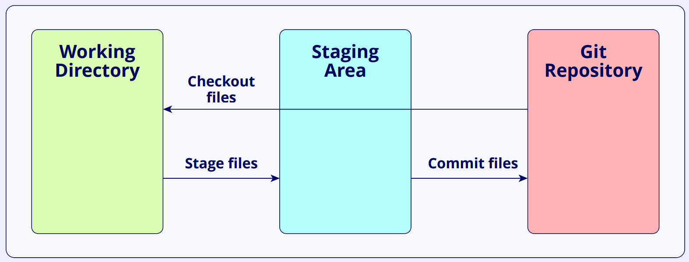

<h1 align="center">Linux & Git - Quick Reference</h1>

---

## 🌿 Introduction

As a **data scientist or ML engineer**, you’ll frequently use **Linux** for development and deployment, and **Git** for version control and collaboration.

---

## 🐧 Linux Essentials

- **[Linux command line for beginners](https://ubuntu.com/tutorials/command-line-for-beginners#1-overview)**

- **[Top 50 essential Linux commands](https://www.digitalocean.com/community/tutorials/linux-commands)**

### Commonly Used Linux Commands

| Category | Command | Description |
|-----------|----------|-------------|
| Navigation | `pwd`, `cd`, `ls -la` | Show current dir, change dir, list contents |
| File Ops | `cp`, `mv`, `rm`, `mkdir`, `rmdir`, `touch` | Copy, move, delete, create files/folders |
| Viewing | `cat`, `head`, `tail`, `less`, `more` | Display file contents |
| Search | `grep`, `find`, `locate` | Search text or files |
| System Info | `uname -a`, `top`, `htop`, `df -h`, `du -sh *` | View system/process info |
| Permissions | `chmod`, `chown` | Change file permissions or ownership |
| Networking | `ping`, `curl`, `wget`, `ifconfig`, `netstat -tulnp` | Test network connections |
| Package Management | `apt`, `yum`, `dnf`, `pip` | Install/update packages |
| Disk/Processes | `kill`, `ps aux`, `free -h` | Manage processes and memory |

**Tip:**  
Always chain commands efficiently using pipes `|` and redirections `>` or `>>`. 

Example:
```bash
ps aux | grep python > process_list.txt
```

Excellent — your base note is already structured and accurate. However, it can be improved for **clarity**, **interview relevance**, and **completeness** (especially for **data science and ML roles**, where Git and Linux are used for collaboration, MLOps, and deployment).

Below is a **refined and complete version** of your Markdown note.
I’ve improved the **language**, **added missing concepts (merge conflicts, stash, rebase, GitHub workflow, SSH, Linux essentials, etc.)**, and **highlighted best practices** and **interview tips**.

---

## 🧭 Git Overview

Git is a **distributed version control system (VCS)** used to track changes in source code and collaborate efficiently.

With platforms like **GitHub**, **GitLab**, or **Bitbucket**, multiple developers can manage projects, track models, and maintain reproducibility.

---

## 🔹 Basic Terminology

| Term                       | Meaning                                                                       |
| -------------------------- | ----------------------------------------------------------------------------- |
| **Repository (Repo)**      | A folder containing your project files and full version history.              |
| **Branch**                 | A separate version of your code to work independently without affecting main. |
| **Commit**                 | A saved snapshot of your changes with a descriptive message.                  |
| **Staging Area**           | Intermediate space before committing changes.                                 |
| **Checkout**               | Switching between branches or commits.                                        |
| **Commit Hash**            | Unique ID for every  commit.                                                   |
| **Tag**                    | Named snapshot, often used for releases (e.g., `v1.0`).                       |
| **HEAD**                   | Pointer to the current branch’s latest commit.                                |
| **Reflog**                 | History of HEAD and branch movements.                                         |
| **Remote Tracking Branch** | Local copy of a branch from a remote repository.                              |



---

## ⚙️ Git Setup

Install Git on your OS and configure user details:

```bash
git config --global user.name "Your Name"
git config --global user.email "your_email@example.com"
git config --global core.editor "code --wait"  # optional
```

Optionally edit `~/.gitconfig`:

```bash
[user]
    name = Your Name
    email = your_email@example.com

[credential]
    helper = cache --timeout=3600

[alias]
    co = checkout
    ci = commit
    st = status
    br = branch
    hist = log --pretty=format:"%h %ad | %s%d [%an]" --graph --date=short

[color]
    ui = auto
```

---

## 📦 Creating and Cloning Repositories

```bash
# Create new repo
mkdir project
cd project
git init

# Clone from remote
git clone <repo-url>
```

---

## ✍️ Adding and Committing Changes

```bash
git add <file>         # stage specific file
git add .              # stage all modified files
git commit -m "Add initial project setup"
```

**Modify last commit (carefully):**

```bash
git commit --amend
```

---

## 🚀 Pushing and Pulling Changes

```bash
git push origin main
git pull origin main
```

**Set upstream once:**

```bash
git push -u origin main
```

**Force push (use with caution):**

```bash
git push --force-with-lease
```

---

## 🌿 Branching and Merging

```bash
git branch <branch-name>       # create branch
git checkout <branch-name>     # switch branch
git merge <branch-name>        # merge into current branch
git branch -d <branch-name>    # delete branch
```

**View all branches:**

```bash
git branch -a
```

**Resolve merge conflicts:**

When Git detects changes to the same lines in both branches, it inserts conflict markers (`<<<<`, `====`, `>>>>`).
Fix manually, then:

```bash
git add <file>
git commit
```

---

## 🔄 Rebasing (Advanced)

Rebase moves or “replays” your commits on top of another branch, keeping history linear.

```bash
git checkout feature
git rebase main
```

If conflicts occur, resolve them and continue:

```bash
git rebase --continue
```

**Difference between merge and rebase:**

* **Merge** → Preserves full history (creates merge commits).
* **Rebase** → Creates a cleaner, linear history (but rewrites commit history).

---

## 💾 Stashing Temporary Changes

When you want to switch branches but keep current modifications:

```bash
git stash            # save changes
git stash list       # view stashes
git stash apply      # reapply last stash
git stash drop       # remove last stash
```

---

## 🔍 Viewing Info

```bash
git status           # show current changes
git diff             # show unstaged changes
git log --oneline    # concise commit history
git show <hash>      # show details of a commit
git remote -v        # view remotes
git config --list    # show configs
```

**Visual log:**

```bash
git log --graph --decorate --oneline --all
```

---

## 🧠 GitHub Workflow (for Collaboration)

1. **Fork** the repository (if not yours).
2. **Clone** your fork locally.
3. **Create a new branch** for your feature:

   ```bash
   git checkout -b feature/data-cleaning
   ```
4. **Commit** your work:

   ```bash
   git add .
   git commit -m "Add data cleaning script"
   ```
5. **Push** your branch:

   ```bash
   git push origin feature/data-cleaning
   ```
6. **Open a Pull Request (PR)** on GitHub.
7. **Review → Merge → Sync** your local repo.

---

## 🔐 SSH Authentication with GitHub

Faster and secure alternative to HTTPS authentication.

```bash
ssh-keygen -t rsa -b 4096 -C "your_email@example.com"
cat ~/.ssh/id_rsa.pub
```

Copy the public key to **GitHub → Settings → SSH and GPG keys → New SSH key**

Then test:

```bash
ssh -T git@github.com
```

---

## 🧩 Common Git Interview Questions

| Question                                            | Key Point                                           |
| --------------------------------------------------- | --------------------------------------------------- |
| Difference between Git and GitHub                   | Git = tool; GitHub = hosting platform               |
| What is a commit hash?                              | Unique SHA-1 identifier for a commit                |
| What does `git pull` do?                            | `git fetch` + `git merge`                           |
| What’s the difference between `merge` and `rebase`? | Merge keeps history; rebase rewrites it             |
| What is the staging area?                           | A buffer to review and group changes before commit  |
| How do you undo the last commit?                    | `git reset --soft HEAD~1`                           |
| How to remove untracked files?                      | `git clean -f`                                      |
| What is `.gitignore` used for?                      | Exclude files/folders from version control          |
| How to revert a commit safely?                      | `git revert <commit-hash>`                          |
| What’s a detached HEAD state?                       | When HEAD points to a specific commit, not a branch |

---

## 🧰 Useful Git Patterns for Data Science Projects

* Track large data files with **Git LFS (Large File Storage)**:

  ```bash
  git lfs install
  git lfs track "*.csv"
  ```
* Use **.gitignore** to skip generated files, datasets, or model outputs:

  ```bash
  __pycache__/
  *.pkl
  *.csv
  *.h5
  models/
  notebooks/.ipynb_checkpoints/
  ```
* Always write **meaningful commit messages**:

  * ✅ `Add preprocessing for missing values`
  * ❌ `fix stuff`

---

## 📚 References

* [Pro Git Book (Free)](https://git-scm.com/book/en/v2)
* [Git Cheatsheet (GitHub)](https://education.github.com/git-cheat-sheet-education.pdf)
* [Git LFS Docs](https://git-lfs.github.com/)
* [Linux Command Line Tutorial](https://ubuntu.com/tutorials/command-line-for-beginners)
