<h1 align="center" > Operating System </h1>

An Operating System (OS) is system software that manages computer hardware and software resources. It provides an environment for users to execute programs efficiently by abstracting hardware complexities and acting as a resource manager. Without an OS, a computer is just a collection of electronic components that cannot perform useful tasks.

<div align="center">

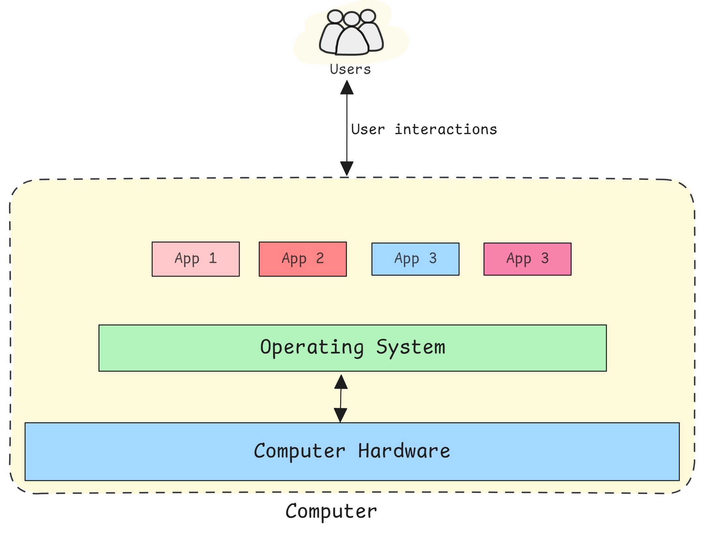

</div>

---

## Core services of operating system

An operating system primarily provides three fundamental services:

- **Abstraction**  
Hides hardware complexity behind clean interfaces. (*files*: abstract storage devices, *processes/threads*: abstract CPU execution, *virtual memory*: abstract physical memory, *sockets*: abstract network communication).

- **Protection & Security**  
Ensures system integrity and data safety. (*User/kernel modes*: Privilege separation, *memory isolation*: Prevent processes from accessing each other's memory, *access control*: File permission and user authentication, *System call validation*: Verify user requests).

- **Resource Management**  
  Efficiently allocates and manages system resources. (*CPU scheduling*: which processes run when, *memory management*: allocates and tracks memory usage, *I/O and disk management*: handles device communication, *process/thread lifecycle*: creation execution and termination).

### Key OS Functions

1. **Program Execution** – Load, start, schedule, and terminate programs; handle **CPU scheduling**, **deadlock**, **starvation**.

2. **I/O Management** – Device drivers, buffering, caching, and spooling; interrupt/DMA-based I/O.

3. **Process Management** – Create, schedule, synchronize, and destroy processes.

4. **Memory Management** – Address translation, paging/segmentation, virtual memory.

5. **File System Management** – Files, directories, permissions, caching, journaling.

6. **Security & Isolation** – User/kernel separation, ACLs/capabilities, sandboxing.

7. **User Interfaces** – CLI shells, GUIs, system utilities.

---

## Types of Operating System:

Operating systems can be classified based on their usage and architecture:

### 1. Single-tasking (Single-process) OS

Runs one program at a time alongside the OS. Simple but inefficient.

*Example: MS-DOS.*

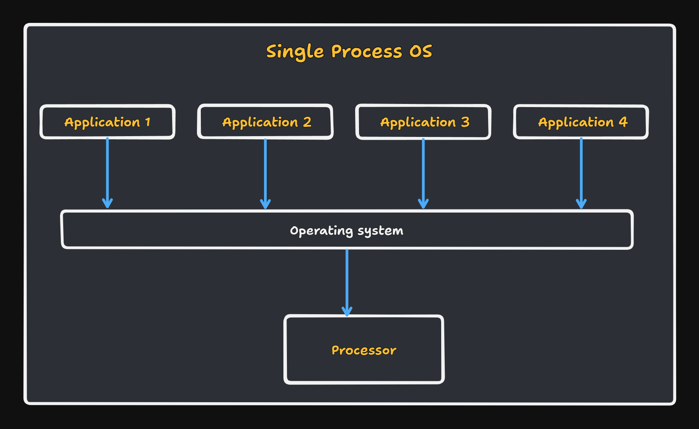

### 2. Batch OS

Processes jobs in batches without user interaction. Good for repetitive tasks.

*Example: Early mainframe systems (e.g., Unisys MCP).*

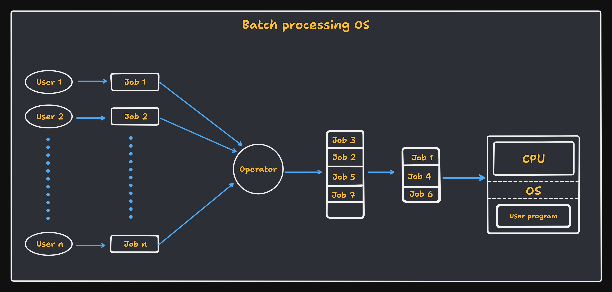

### 3. Multiprogramming OS

Multiple programs (**ready** processes) loaded in memory simultaneously. CPU switches between programs (**context switching**) when one waits for I/O. Improves CPU utilization.

> EG. Early versions of UNIX. 


### 4. Multitasking (Time-Sharing) OS

Extension of multiprogramming with **preemption** and **time slices (quanta)**.

*Modern desktop/server OSs are time-sharing.*

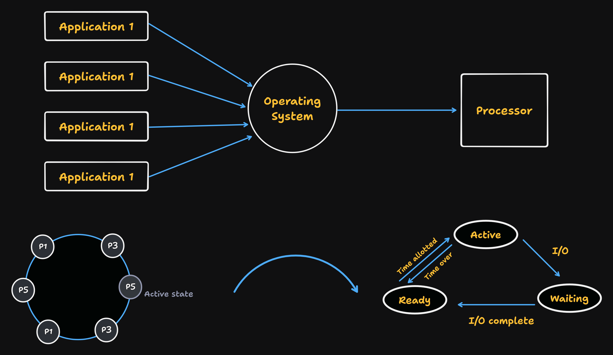

### 5. Multiprocessing OS

Uses **multiple CPUs/cores** simultaneously. Offers true parallel execution of processes.

- **SMP (Symmetric Multiprocessing)**: all CPUs share the same memory

- **NUMA (Non-Uniform Memory Access)** - CPUs have local memory with shared access

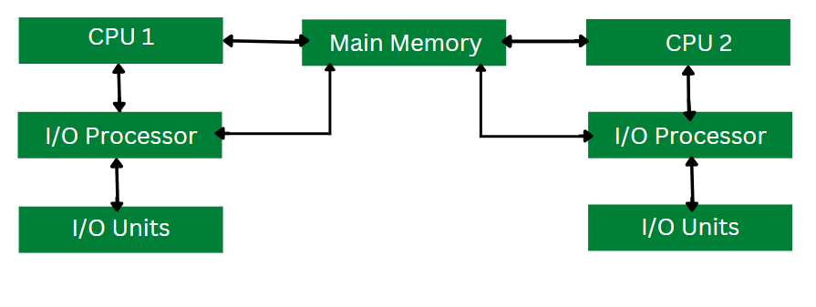

### 6. Distributed OS

Manages multiple networked computers as one system. Transparent resource sharing across network.

> EG: Plan 9, Amoeba

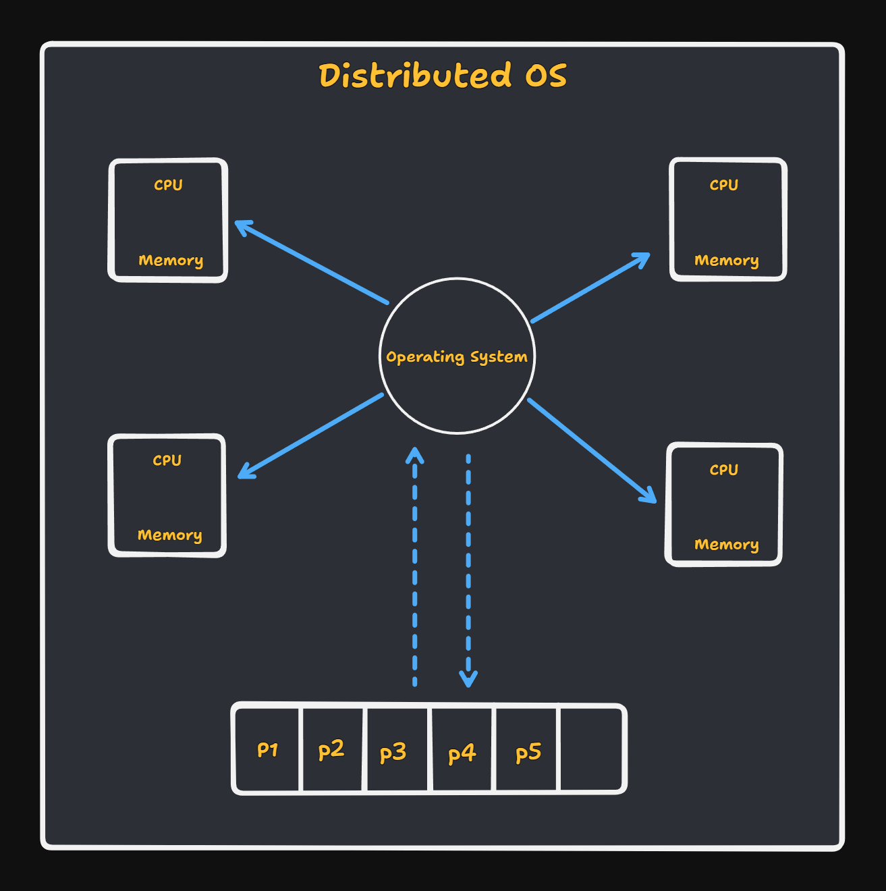

### 7. Real-time OS (RTOS)

Used in time-critical systems like flight control or medical systems, where timely and deterministic responses are essential. Guarantees response within specific time constraints

- **Hard RT**: missing a deadline is a failure (e.g., pacemakers, avionics).

- **Soft RT**: occasional misses tolerable (e.g., multimedia).

---

## Process

A **program** is code on disk. A **process** is an **active program in execution**. A process consists of;

- **Program code** (text section)

- **Program counter** - address of next instruction

- **CPU registers** - current state

- **Stack** - function calls and local variables

- **Data section** - global variables

- **Heap** - dynamically allocated memory

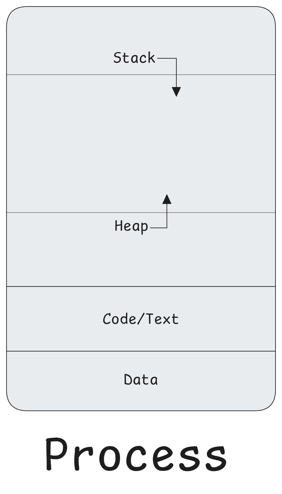

- **Program Counter (PC/IP)**: address of next instruction. 

- **CPU–I/O Burst Cycle**: processes alternate between CPU bursts and I/O waits.

- **Context Switch**: save current process context; load another’s context. 

- **PCB (Process Control Block)**: kernel data structure with process metadata.

### Process State Models

**5-State Model**: `new → ready ↔ running → waiting → terminated` 

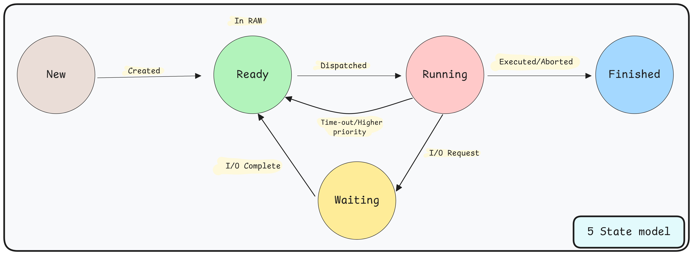

**7-State Model (with suspension)** adds: `suspended-ready`, `suspended-waiting`

> Suspended processes are swapped to secondary storage (Linux: **swap space**; Windows: **pagefile**).

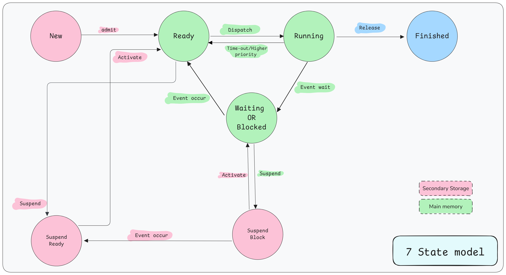

### Process Control Block (PCB)

A Process Control Block (PCB) is a data structure used by the operating system to manage information about a process.

It holds (not exhaustive):

- **Process ID (PID)** (An integer value that is unique for each process), **Parent PID**, **Credentials**

- **Process State** (Current state of the process (e.g., running, waiting, ready, suspended)), **Priority**, **Scheduling info**

- **Program Counter (PC)** (Address of the next instruction to be executed), **CPU registers**, **stack pointers**

- **CPU Registers**: Values of CPU registers at the time of process suspension. One such register is `program counter` which stores the address of the next instruction to be executed.

- **Memory info** (page tables, segments)

- **Open files / file descriptors**, **I/O status** 

- **Accounting** (CPU time, faults) and **signals/handlers**

PCB is stored in protected kernel memory; essential for scheduling and context switching.

---

## Threads

A **thread** is the smallest schedulable unit of execution within a process. Threads within a process share:

- **process address space** (_code_, _data_, _heap_), file descriptors and signal handlers

Each thread has its own:
- **program counter**, **register set**, and **stack**

### Benefits of Threading

- **Responsiveness:** UI remains interactive while background tasks run

- **Resource Sharing:** Threads share memory, reducing overhead

- **Parallelism:** True concurrency on multi-core systems

- **Fast Context Switching:** No address space switching needed

### Types of Threads

- **User-level threads (ULTs)**: managed in user space by user-space thread library. They are faster to create/switch but, a blocking `syscall` may block entire process. 

- **Kernel-level threads (KLTs)**: managed by the OS kernel (true parallelism on multi-core), but slower due to kernel overhead. 

- **Hybrid models**: 
  - many-to-one: map many ULTs onto one KLT.
 
  - many-to-many: Multiple ULTs mapped to multiple KLTs.

  - One-to-One: Each ULT mapped to one KLT

---

## CPU Scheduling

CPU scheduling is the process by which the OS decides which process or thread should run next. Since a CPU can run only one process (or a few, in multi-core systems) at a time, scheduling ensures efficient CPU utilization, fairness, and responsiveness.

### Types of Scheduling

Scheduling decisions occur at different points in process execution. Based on this, scheduling is divided into three main types:

- **Long-term (Job) scheduling**: Decides which processes are admitted to the ready queue (controls degree of multiprogramming i.e., how many processes are in memory).

- **Medium-term scheduler**: Temporarily removes (swaps out) processes from memory to reduce load(suspension) and later swap them back in for execution. 

- **Short-term (CPU) scheduling**: Decides which ready process will execute next.

### Dispatcher

It performs the actual context switching.

### Goals and metrics of Scheduling

- **CPU Utilization:** Percentage of time CPU is busy.

$$\text{CPU Utilization (\%)} = \frac{\text{Total CPU Time}}{\text{Elapsed Time}} \cdot 100$$

- **Throughput:** Number of processes completed per time unit

- **Turnaround Time:** Total time from submission to completion

- **Throughput** (jobs/time), **CPU utilization**, **Turnaround time** (finish − arrival),

- **Waiting Time:** Time spent in ready queue

- **Response Time:** Time from submission to first response

### Scheduling Algorithms

- **Preemption:** OS can forcibly remove running process

- **Time Quantum:** Fixed time slice for round-robin scheduling

- **Aging:** Gradually increase priority to prevent starvation

- **CPU Burst:** Time process uses CPU before I/O operation

| Algorithm | Type | Description | Pros | Cons | Good For |
|---|---|---|---|---|---|
| **FCFS** (First Come First Served) | Non-preemptive | Processes are scheduled in the order they arrive. | Simple, fair in arrival order | Convoy effect(slow process delays others); poor avg wait/response time | Batch systems |
| **SJF** (Shortest Job First) | Non-preemptive | Process with the shortest CPU burst runs first. | Minimizes average waiting time. | Requires knowing burst time; risk of starvation for long jobs | Batch jobs with predictable bursts |
| **SRTF** (Shortest Remaining Time First) | Preemptive SJF | Process with the shortest remaining burst time gets CPU. | Lower average waiting/turnaround time than SJF | High overhead (many preemptions);; starvation possibility | Mixed workloads when burst estimates exist |
| **Round-Robin (RR)** | Preemptive | Each process gets a fixed time slice (quantum) in turn. | Good response time, fair to all | Too small q → overhead; too large q → becomes FCFS | Time-sharing systems |
| **Priority Scheduling** | Both (commonly preemptive)| Highest-priority process runs first. | Flexible (priority classes, deadlines) | Starvation of low-priority jobs (fix via _aging_) | Real-time & systems with priority classes |
| **MLQ** (Multilevel Queue) | Both (commonly preemptive) | Processes assigned to fixed queues; each queue has its own scheduling policy. | Simple to separate classes | Inflexible; starvation possible between queues | Systems with strict process classes (e.g., foreground vs. background) |
| **MLFQ** (Multi level feedback queue) | Preemptive | Like MLQ, but processes can move between queues based on behavior/history. | Approximates SJF; favors interactive processes | Complex to tune (quantum, queue rules) | General-purpose OS (interactive + batch) |
| **Multicore/CPU Affinity** | — | Keeps a process on the same CPU to reuse cache and reduce migration | Better cache performance; less overhead from migrations | Trade-off between load balancing and locality | SMP/NUMA multiprocessors|

The OS selects a scheduling algorithm to optimize: CPU utilization (keeping the CPU as busy as possible), Throughput, Turnaround time, Waiting time, Response time and fairness. 

---

## Process Synchronization

Process synchronization is the mechanism that coordinates the execution of multiple processes accessing shared resources to prevent issues like `race condition`, `data corruption`, and `deadlocks`. This is typically achieved using synchronization primitives such as `semaphores`, `monitors`, `mutexes`, and `critical section`.

### Critical Section

A segment of code where a process accesses shared resources. if multiple processes accessing shared data are not coordinated, it can lead to critical section problem (race condition and data inconsistency).

#### Requirements for solution of Critical Section Problem

1. **Mutual Exclusion**: At any given time only one process/thread can be inside its critical section.

2. **Progress**: If no process is currently in the critical section and some processes are waiting to enter, the decision of which process gets to enter next must not be delayed indefinitely. A selection must be made in a finite amount of time, and only from the processes that are actively trying to enter. It ensures that the system doesn't get stuck.

3. **Bounded waiting**: It guarantees that once a process requests to enter its critical section, there is a limit on the number of times other processes are allowed to enter their critical sections before the requesting process is granted access. In other words, a process won't have to wait forever (prevents starvation).

#### Synchronization tools or Primitives

##### 1. Hardware-based Solutions

- **Atomic Instructions**: 
  - `test-and-set`: Atomically read and set a value
  
  - `compare-and-swap (CAS)`: Compare a value and replace it if it matches
  
  - `fetch-and-add`: Atomically increment/decrement a counter.
  
  - `Memory Barriers`: Prevent the CPU/compiler from reordering instructions.

##### 2. Software Solutions

1. **Mutex (Mutual Exclusion)**: Binary lock protecting critical sections.

- `Lock()` → acquire access.

- `Unlock()` → release access.

2. **Semaphores**: Integer variable controlled by atomic operations.

- Binary Semaphore → behaves like a mutex (0/1).

- Counting Semaphore → controls access to multiple instances of a resource.

  **Operations**:

  `Wait(P)` → decrement (may block if < 0).

  `Signal(V)` → increment (may wake up a process).

3. **Monitors**: High-level construct combining data + procedures + mutual exclusion.

- Uses condition variables:
  - `Wait()` → suspend until signaled.

  - `Signal()` → wake a waiting process.
- Can include barriers for phase synchronization.

> Peterson’s Algorithm illustrates software-only mutual exclusion, but works only under strict assumptions and not on weak memory models without fences.

### Classic Synchronization Problems

#### Producer-Consumer Problem (Bounded Buffer)

- A Producer generates data items and places them into a bounded buffer (finite size).

- A Consumer removes items from the buffer and processes them.

- Constraint: Producer cannot add to a full buffer, Consumer cannot remove from an empty buffer.

**Goal**: Ensure mutual exclusion and proper synchronization to avoid:

- Race conditions (producer/consumer accessing buffer at the same time).

- Overflows (adding to a full buffer).

- Underflows (removing from an empty buffer).

Use **mutex** (lock; Ensures only one process modifies the buffer at a time) + **two semaphores** (counting semaphores); `empty` (Number of empty slots in the buffer (initialized to buffer size)) and `full` (Number of filled slots (initialized to 0)).

```c
// Shared variables
semaphore mutex = 1;   // Binary lock for buffer
semaphore empty = N;   // Buffer size (slots available)
semaphore full = 0;    // Filled slots

Producer() {
  while (true) {
    item = produce_item();

    wait(empty);        // Wait if buffer is full
    wait(mutex);        // Enter critical section

    insert_item(item);  // Put item in buffer

    signal(mutex);      // Leave critical section
    signal(full);       // One more full slot
  }
}

Consumer() {
  while (true) {
    wait(full);         // Wait if buffer is empty
    wait(mutex);        // Enter critical section

    item = remove_item(); // Take item from buffer

    signal(mutex);      // Leave critical section
    signal(empty);      // One more empty slot

    consume_item(item);
  }
}
```

- If we have an unbounded buffer (infinite buffer); only the consumer needs to wait if the buffer is the empty.

#### Readers–Writers 

- Multiple reader processes want to read a shared resource (e.g., a database).

- Multiple writer processes want to write to the resource.

**Constraints**

- Multiple readers can read at the same time (no conflict).

- Writers need exclusive access → no other reader/writer can use the resource while writing.

This problem is all about allowing maximum concurrency (many readers at once), while ensuring data consistency (writers get exclusive access).

Use mutex lock (protects shared counters) + semaphores (RW mutex + mutex (Protects read_count variable (tracks number of active readers)))

```c
// Shared variables
semaphore rw_mutex = 1;  // Controls access to resource
semaphore mutex = 1;     // Protects read_count
int read_count = 0;

Reader() {
  while (true) {
    wait(mutex);
    read_count++;
    if (read_count == 1)
        wait(rw_mutex);  // First reader locks resource
    signal(mutex);

    // --- Critical Section ---
    read_data();

    wait(mutex);
    read_count--;
    if (read_count == 0)
        signal(rw_mutex);  // Last reader unlocks resource
    signal(mutex);
  }
}

Writer() {
  while (true) {
    wait(rw_mutex);       // Exclusive access
    // --- Critical Section ---
    write_data();
    signal(rw_mutex);
  }
}
```

**Variants**

- First Readers–Writers Problem (Reader Priority)
  
  - No reader waits if the resource is free.
  
  - Writers may starve (if readers keep coming).

- Second Readers–Writers Problem (Writer Priority)

  - Once a writer is waiting, no new reader is allowed to start.

  - Prevents writer starvation but may starve readers.

- Third Version (Fairness / No Starvation)

  - Readers and writers are served in arrival order (like a queue).

| Variant             | Priority | Pros                           | Cons                        |
| ------------------- | -------- | ------------------------------ | --------------------------- |
| **Reader Priority** | Readers  | Fast reading, high concurrency | Writers may starve          |
| **Writer Priority** | Writers  | Writers guaranteed progress    | Readers may starve          |
| **Fairness (3rd)**  | None     | No starvation                  | More complex implementation |


- The Readers–Writers problem models real-world DB access (e.g., many users read, few update). It highlights trade-offs between concurrency and fairness, solved using mutexes, semaphores, and counters.

#### Dining Philosophers Problem

Five philosophers sit around a circular table, alternating between thinking and eating from a central bowl of spaghetti, with each philosopher having one chopstick placed between themselves and their neighbors. To eat, a philosopher must simultaneously hold both the left and right chopsticks, but they can only pick up one chopstick at a time. Since chopsticks are shared resources, a philosopher cannot use a chopstick already held by a neighbor.

This problem is a classic metaphor for resource allocation where multiple processes need exclusive access to several resources to proceed. The main challenges are to avoid **deadlock** (where everyone waits forever) and **starvation** (where one philosopher never gets to eat).

- we can model each chopstick as a semaphore

```c
// Shared variables
semaphore chopstick[5] = {1, 1, 1, 1, 1}; // One semaphore per chopstick

Philosopher(int i) {
  while (true) {
    // --- THINKING ---

    // The naive (and flawed) approach:
    wait(chopstick[i]);                 // Pick up left chopstick
    wait(chopstick[(i + 1) % 5]);       // Pick up right chopstick

    // --- CRITICAL SECTION (EATING) ---
    eat_spaghetti();

    signal(chopstick[i]);                 // Put down left chopstick
    signal(chopstick[(i + 1) % 5]);       // Put down right chopstick
  }
}
```
- Problems with the naive approach are : 
  - **Deadlock :** If all five philosophers decide to eat at the same time, they might each pick up their left chopstick simultaneously. Now, every philosopher is waiting for their right chopstick, which is held by their neighbor. Since no one can get their second chopstick, they all wait forever in a circular chain. This is a classic deadlock situation.

  - **Starvation :** Even in a deadlock-free system, a philosopher might be unlucky. For example, their two neighbors might alternate eating in such a way that the philosopher in the middle never finds both chopsticks available at the same time.

- There are several ways to solve the problem, each with its own trade-offs.
  - **Arbitrator (Waiter)**: Introduce a "waiter" or a single master mutex. A philosopher must ask the waiter for permission before picking up any chopsticks. Since the waiter only gives permission to one philosopher at a time, this approach completely prevents the circular wait, thus avoiding deadlock.

  - **Resource Hierarchy (Asymmetric Solution)**: Impose an order on picking up chopsticks. For instance, all philosophers pick up their "lower-numbered" chopstick first (e.g., `chopstick[i]` before `chopstick[i+1]`), except for the last philosopher who picks them up in the reverse order. This breaks the circular dependency.

  - **Limit the Diners**: Allow only four out of the five philosophers to sit at the table at any one time. With five chopsticks and only four philosophers, there will always be at least one philosopher who can acquire both chopsticks.

| Solution            | Strategy                                             | Pros                                      | Cons                                      |
|---------------------|------------------------------------------------------|-------------------------------------------|-------------------------------------------|
| Arbitrator (Mutex)  | A single lock must be acquired before picking up.    | Simple to implement, prevents deadlock.   | Low concurrency, central bottleneck.      |
| Asymmetric          | One philosopher picks up right chopstick first.      | High concurrency, no central lock.        | More complex logic, starvation possible.  |
| Limit the Diners    | Allow only N−1 philosophers at the table.            | Simple, guarantees progress.              | Reduces maximum concurrency.              |

- The *Dining Philosophers* problem is a fundamental exercise in computer science used to illustrate synchronization issues and the conditions that lead to deadlock. It models scenarios where a process needs to lock multiple resources to do its work (e.g., a database transaction needing to lock several rows).

### Starvation & Aging

- **Starvation**: a thread waits indefinitely (e.g., low priority).  

- **Aging**: gradually increase priority of waiting threads to ensure progress.

---

## Deadlock

A set of processes is deadlocked when each process is waiting for a resource held by another process in the set.

### Necessary Conditions (Coffman Conditions)
All four must be present simultaneously:

1. **Mutual Exclusion:** Resources cannot be shared

2. **Hold and Wait:** Processes hold resources while requesting others

3. **No Preemption:** Resources cannot be forcibly removed

4. **Circular Wait:** Circular chain of resource dependencies

### Handling strategies

#### 1. Deadlock Prevention

Break one of the necessary conditions:
- **Mutual Exclusion:** Make resources shareable (not always possible)

- **Hold and Wait:** Request all resources at once

- **No Preemption:** Allow resource preemption

- **Circular Wait:** Order resources and request in order

#### 2. Deadlock Avoidance 

Avoid unsafe states using algorithms like:
- **Banker's Algorithm:** Check if resource allocation leaves system in safe state

- **Resource Allocation Graph:** Detect potential cycles

#### 3. Deadlock Detection and Recovery

- **Detection:** Periodically check for deadlock cycles
- **Recovery:** Terminate processes or preempt resources

#### 4. Ignore (Ostrich Algorithm)

- Ignore the problem (used when deadlocks are rare)

- Restart system if deadlock occurs

---

## Memory Management

Memory management is the process by which an operating system manages the computer's primary memory (RAM). It keeps track of each and every memory location, decides which processes get memory and when, and updates this status as processes are allocated and freed. The core goal is to allow multiple programs to run concurrently, sharing this finite resource safely and efficiently.

### Logical Address vs Physical Address

- **Logical Address (virtual address)** : This is the address generated by the CPU from the perspective of a program. Each process gets its own private logical address space, starting from 0. This gives the process the illusion that it has the entire memory to itself.

- **Physical Address** : This is the actual address in the physical RAM hardware. It's the address that the memory controller sees and uses to access a memory cell.

- **Memory Management Unit (MMU)** : A hardware component that acts as a translator, converting logical addresses into physical addresses on the fly.

> A logical address is like an apartment number, e.g., "`Apartment #5B`". The physical address is the actual location, like "`3rd floor, 2nd door on the left`". The MMU is the building's directory in the lobby that maps "`5B`" to its real location.

- Logical addresses provide **abstraction** and **process isolation**. It's a critical security feature that prevents a buggy browser tab from crashing your entire operating system. 

- Facilitates features like virtual memory, paging, and swapping.

### Address Binding

Address binding is the process of mapping a logical address to a physical address. This can happen at three different stages:

- **Compile time:**  If the exact location of the program in memory is known beforehand, the compiler can generate absolute code. This is inflexible; if the starting location changes, you must recompile. Used in simple, old systems.

- **Load time:** If the memory location isn't known at compile time, the compiler generates relocatable code. The final binding is delayed until the program is loaded into memory. If the starting address changes, you only need to reload the program.

- **Execution time:** The binding is delayed until the program is actually running. This is the most flexible approach and is used by modern operating systems. It allows the OS to move a process's memory location during its execution. This requires hardware support (the MMU).

- It is a trade-off between **flexibility** and **overhead**. Compile-time is fastest but completely rigid. Execution-time is the most flexible (enabling things like swapping and dynamic libraries) but requires hardware and incurs a runtime translation cost for every memory access.

### Memory Allocation and Fragmentation

- **Contiguous Memory Allocation** : The simplest allocation method. Each process is contained in a single, contiguous block of physical memory.

  - **First-Fit**: Allocate the first hole that is big enough. Fast.

  - **Best-Fit**: Allocate the smallest hole that is big enough. Tries to save large holes for large processes, but produces the most leftover, unusable fragments.

  - **Worst-Fit**: Allocate the largest hole. The idea is that the leftover hole will be big enough to be useful.

This strategy leads to a major problem: **Fragmentation**.

Fragmentation refers to wasted memory space that cannot be effectively allocated.

- **Internal Fragmentation**: Occurs when a process is allocated more memory than it needs. The unused space within the allocated block is wasted.

- **External Fragmentation**: Occurs when there is enough total free memory to satisfy a request, but it is not in a single, continuous block. The free space is broken into many small pieces.

- Compaction (shuffling memory contents to place all free memory together) is a solution to external fragmentation, but it is extremely slow and impractical.

### Paging

Paging is the modern solution to the external fragmentation problem. It breaks the "contiguous" rul and divide logical memory into fixed-size blocks called **pages** and divide physical memory into blocks of the same size called **frames**.

- An OS-managed page table (**Page Table** maps virtual page → physical frame) for each process keeps track of which page is in which frame. This allows the pages of a single process to be scattered non-contiguously throughout physical memory.

#### Address translation in paging

A logical address is split into two parts:

  1. **Page Number (p)**: An index into the page table.

  2. **Page Offset (d)**: The location within the page.

The translation process is:

- The MMU extracts the page number `p`.

- It looks up `p` in the process's page table to find the corresponding frame number (`f`).

- The physical address is constructed by combining the frame number `f` with the original offset `d`.

$$\text{Physical Address = (Frame Number × Page Size) + Offset}$$

#### TLB (Translation Look-aside Buffer)

Accessing the page table in RAM for every logical address translation is slow (it doubles memory access time). The TLB is a small, fast hardware cache that stores recent page-to-frame translations. It acts as an associative memory. If a page number is found in the TLB (a TLB hit), the frame number is retrieved instantly. If not (TLB miss), the page table is consulted, and the new translation is added to the TLB.

> Paging was the modern solution to external fragmentation, but it had a major drawback; the performance cost of the extra memory access to the page table. TLB was introduced as the hardware solution to that performance problem.

### Segmentation

Segmentation is an alternative memory-division scheme. Instead of dividing memory into fixed-size physical blocks (like paging), it divides it into logical, variable-sized segments (code, data, stack). Where each segment can grow independently.

- **Programmer's View**: A program is a collection of logical units like a main function, other functions, global variables, a stack, etc. Segmentation treats each of these as a separate segment. Hence it is more intuitive from a programmer's perspective and simplifies protection and sharing (e.g., you can mark a "code" segment as read-only or share a "library" segment between processes).

> Paging is invisible to the programmer and divides memory based on a fixed size. Segmentation is visible to the programmer and divides memory based on logical content. Modern systems often combine both (e.g., segmented paging).

### Virtual Memory

Virtual memory is an operating system (OS) memory management technique that creates the illusion of having more physical memory (RAM) than is actually available by using a portion of secondary storage, like a hard drive or SSD, as an extension of RAM. This allows the system to run larger programs, or more programs simultaneously, by swapping less-used data between RAM and the secondary storage.


- It uses Demand Paging. Instead of loading the entire program into RAM at once, pages are only loaded from secondary storage (like an SSD) when they are actually needed (demanded).

- **Page Fault**: When a program tries to access a page that is not currently in a physical frame, the MMU triggers a trap to the OS. This is called a page fault.

#### Handling page fault

1. The OS checks if the memory access was valid.

1. If valid, it finds the required page on the disk.

1. It finds a free frame in RAM. If no frames are free, it runs a page replacement algorithm to evict a victim page.

1. The OS loads the required page from disk into the newly freed frame.

1. It updates the page table to reflect the new mapping.

1. The instruction that caused the fault is restarted.

#### Page Replacement Algorithms

When you need to bring a new page in and memory is full, you must choose a "victim" page to evict.

**Optimal (MIN)**
- Replace page that will be used farthest in future
- Theoretical best, used for comparison

**FIFO (First-In-First-Out)**
- Replace oldest page in memory
- Simple but may cause *Belady's anomaly*

**LRU (Least Recently Used)**  
- Replace page not used for longest time
- Good performance but expensive to implement

**Clock Algorithm (Second Chance)**
- Circular buffer with reference bits
- Approximates LRU with lower overhead

**LFU (Least Frequently Used)**
- Replace page with lowest access count
- May retain old pages too long

| Algorithm               | Strategy                                                      | Pros                          | Cons                                                                 |
|-------------------------|---------------------------------------------------------------|-------------------------------|----------------------------------------------------------------------|
| Optimal (OPT/MIN)       | Replace the page that won't be used for the longest time.     | The theoretical best.         | Impossible to implement (requires clairvoyance).                     |
| FIFO (First-In-First-Out)| Replace the oldest page.                                      | Simple to implement.          | Ignores usage; can evict important pages. Suffers from Belady's Anomaly. |
| LRU (Least Recently Used)| Replace the page that hasn't been used in the longest time.   | Excellent performance.         | Hard to implement efficiently in hardware.                           |
| Clock (Second Chance)   | A FIFO-like circular buffer with a "reference bit."           | A good approximation of LRU.  | More complex than FIFO, less optimal than true LRU.                 |

#### Thrashing
Thrashing is a state where the system is crippled by excessive page swapping. The CPU spends more time moving pages between RAM and disk than doing actual productive work.

- **Symptom** : High page fault rate and very low CPU utilization.

- **Cause** : The combined memory demand of the running processes (working set) exceeds the available physical RAM.

- **Solutions:** Reduce multiprogramming, increase memory, working set model

> Imagine a chef in a tiny kitchen with only enough counter space for two ingredients. To cook a recipe with ten ingredients, they spend all their time swapping ingredients back and forth from the pantry instead of actually cooking. That's thrashing.

---

## File Systems

A file system is how an operating system (OS) organizes, stores, and manages data on a storage device, like a hard drive or USB drive, allowing users to easily find and access files. Different operating systems use various file systems, such as `NTFS` for Windows, `APFS` for macOS, and `ext4` for Linux, each with unique features for data organization and access. 

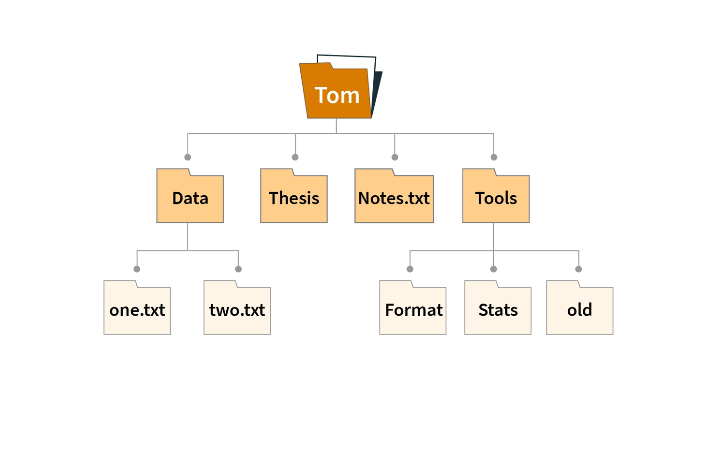

- A **file** is a named collection of related information stored on secondary storage.

- **VFS (Virtual File System)**: common API over many concrete FS types.

### File attributes

- **Name:** Human-readable identifier

- **Type:** Indicates file format

- **Size:** Current file size in bytes

- **Timestamps:** Creation, modification, access times

- **Protection:** Access permissions

- **Location:** Physical location on storage device

### File Operations

- **Open:** Prepare file for access

- **Read/Write:** Transfer data

- **Seek:** Change current position

- **Close:** Release file resources

- **Delete:** Remove file and free space

### Directory Structure

An operating system's directory structure provides a hierarchical organization for files and folders, using a root directory and subdirectories to group related data for efficient management and access

#### Single-Level Directory

- All files in one directory

- Simple but causes naming conflicts

#### Two-Level Directory 

- Separate directory for each user

- Solves naming conflicts

#### Tree-Structured Directory

- Hierarchical organization

- Supports subdirectories

- **Absolute Path:** From root directory

- **Relative Path:** From current directory

### File Allocation Methods

File allocation methods are ways an operating system manages disk blocks to store files, with the three main types being **Contiguous Allocation (adjacent blocks)**, **Linked Allocation (pointers within blocks)**, and **Indexed Allocation (an index block with pointers)**.


#### Contiguous Allocation

- File occupies consecutive blocks

- **Pros:** Simple, fast access

- **Cons:** External fragmentation, difficult expansion

#### Linked Allocation

- File blocks linked together

- **Pros:** No external fragmentation

- **Cons:** Random access slow, pointer overhead

#### Indexed Allocation

- Index block contains pointers to data blocks

- **UNIX i-nodes:** Direct and indirect pointers

- **Pros:** Fast random access, no external fragmentation

### Free Space Management

- **Bit Vector:** Each bit represents one block

- **Linked List:** Free blocks linked together

- **Grouping:** Store addresses of free blocks in first free block

### File System Reliability

- **Backup:** Regular copies to prevent data loss 

- **Journaling:** Log changes before applying them

- **RAID:** Redundant storage for fault tolerance

- **Checksums:** Detect data corruption

---

## I/O Systems & Storage

The operating system manages Input/Output (I/O) and storage to enable communication between the CPU and peripheral devices, as well as to persistently manage data.

- **I/O management** is the OS function that controls and coordinates the use of hardware devices (like keyboards, monitors, disks, and network cards). Since I/O devices are significantly slower than the CPU, the OS uses specialized techniques to ensure efficiency and non-interference.

### Hardware Components

- **I/O Devices:** Input/output hardware
- **Device Controllers:** Hardware interface between device and system
- **Device Drivers:** Software interface to device controllers

### I/O Methods

**Methods of I/O communication** includes; **Polling**, **Interrupts**, **Direct Memory Access(DMA)**.

#### Programmed I/O (Polling)

- CPU continuously checks device status
- Simple but wastes CPU time

#### Interrupt-Driven I/O

- Device sends interrupt when ready
- More efficient than polling

#### Direct Memory Access (DMA)

- Uses specialized hardware called **DMA controller**
- Device transfers data directly to/from memory
- CPU only involved at beginning and end
- Most efficient for large transfers

### I/O Software Layers

1. **Interrupt Handlers:** Handle device interrupts
2. **Device Drivers:** Device-specific code
3. **Device-Independent I/O:** Common interface
4. **User-Space I/O:** System calls and libraries

### Disk Scheduling

Minimizes seek time on traditional hard drives (HDD):

- **FCFS:** Process requests in order
- **SSTF:** Shortest Seek Time First
- **SCAN (Elevator):** Move in one direction, then reverse  
- **C-SCAN:** Circular scan in one direction
- **LOOK/C-LOOK:** Like SCAN/C-SCAN but reverse at last request

> **SSDs** have near-uniform access; scheduling cares more about queue depth, wear leveling, TRIM.

### RAID (Redundant Array of Independent Disks)
- **RAID 0:** Striping (performance, no redundancy)
- **RAID 1:** Mirroring (100% redundancy)
- **RAID 5:** Distributed parity (efficiency + redundancy)
- **RAID 6:** Dual parity (tolerates two disk failures)
- **RAID 10:** Mirrored stripes (combines RAID 1 + 0)

---

## System Calls and OS Structure

The System Call is the fundamental mechanism by which a user-level computer program requests a service from the operating system's kernel. Because the kernel runs in a highly privileged state (kernel mode) and has direct access to hardware and protected resources, user programs (which run in user mode) must use system calls to perform actions like file management, process control, or device I/O.

### System Calls

Interface between user programs and kernel services.

#### Categories

- **Process Control:** fork(), exec(), wait(), exit()
- **File Management:** open(), read(), write(), close()
- **Device Management:** ioctl(), read(), write()
- **Information:** getpid(), alarm(), sleep()
- **Communication:** pipe(), socket(), shmget()

#### When a system call is made:

- The user program executes a special instruction (often a software interrupt or "trap").

- The CPU switches from user mode to kernel mode.

- The operating system's kernel identifies the requested service and kernel validates parameters.

- The kernel executes the service on behalf of the user program.

- The CPU switches back to user mode, and the program continues execution.

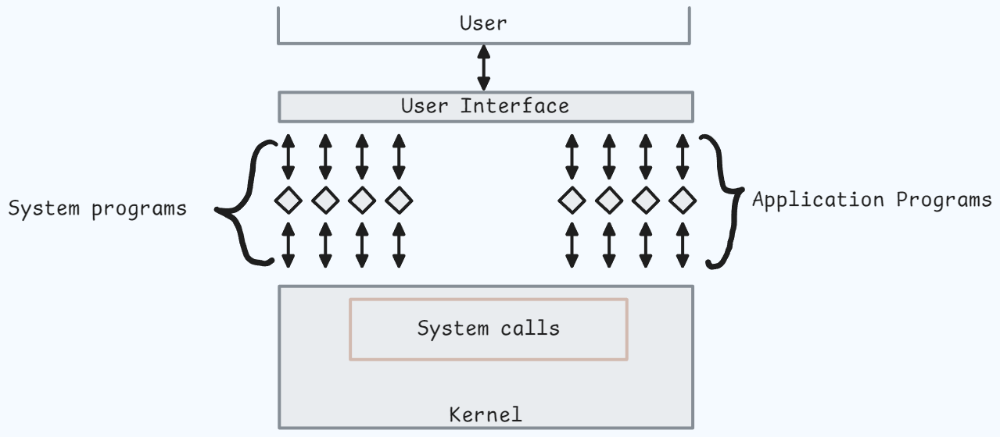

### Kernel Space vs User Space

- **User Space**: applications, libraries; isolated from kernel.  
- **Kernel Space**: privileged; manages hardware and resources.

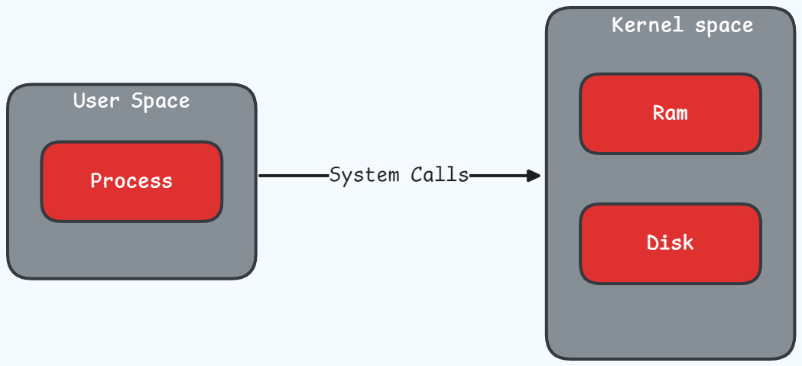

### Kernel Architectures

#### Monolithic Kernel

- All OS services in single address space
- **Pros:** Fast, efficient communication
- **Cons:** Large, complex, less reliable
- **Examples:** Linux, UNIX

#### Micro-kernel

- Minimal kernel with basic services only
- Other services run as user-space processes
- **Pros:** Modular, reliable, secure
- **Cons:** Performance overhead from IPC
- **Examples:** Minix, QNX

#### Hybrid Kernel

- Combines monolithic and microkernel approaches
- **Examples:** Windows NT, macOS

### Boot Overview

- **Firmware (BIOS/UEFI)** → **Bootloader** (e.g., GRUB) → **Kernel** → **init/systemd** → user services.

---

## Inter-Process Communication (IPC)

### Shared Memory

- Processes share memory region
- **Pros:** Fast communication
- **Cons:** Requires synchronization

### Message Passing

- Processes communicate through messages
- **Direct:** Explicitly name sender/receiver
- **Indirect:** Use mailboxes or ports
- **Synchronous:** Blocking send/receive
- **Asynchronous:** Non-blocking operations

### Pipes

- **Ordinary Pipes:** Parent-child communication
- **Named Pipes (FIFOs):** Unrelated processes can communicate

### Sockets

- Communication endpoint
- **Network Sockets:** TCP/UDP communication
- **Unix Domain Sockets:** Local inter-process communication

### Others

- **Signals / Events** – simple notifications; limited payload.  
- **Futexes** (Linux) – fast user-space locking with kernel assist.

### When to choose what

- Same machine, high throughput → **shared memory + locks**.  
- Parent–child simple stream → **pipes**.  
- Across hosts → **sockets**.  
- Priority messaging → **message queues**.

---

## Virtualization and Containers

### Hypervisor Types

- **Type 1 (Bare-metal):** Runs directly on hardware
  - Examples: VMware ESXi, Microsoft Hyper-V

- **Type 2 (Hosted):** Runs on host operating system
  - Examples: VMware Workstation, VirtualBox

### Virtualization Techniques

- **Full Virtualization:** Complete hardware abstraction
- **Para-virtualization:** Guest OS modified for efficiency
- **Hardware-assisted:** CPU support (Intel VT-x, AMD-V)

### Containers

- **OS-level virtualization:** Share host kernel
- Isolation via **namespaces** and **cgroups**
- **Benefits:** Lightweight, fast startup, efficient resource use
- **Examples:** Docker, LXC, Kubernetes

- **VMs vs Containers**: VMs isolate entire OS; containers are lighter, faster startup, but share kernel.

---

## Security & Protection

- **User/Kernel Mode**, **Privilege rings**.  
- **Discretionary Access Control (DAC)**, **Mandatory Access Control (MAC)**, **Role-Based Access Control (RBAC)**.  
- **ACLs vs Capabilities**.  
- Sandboxing (seccomp), **SELinux/AppArmor** policies.  
- **Signals** (UNIX): `SIGINT`, `SIGTERM`, `SIGKILL` (cannot be caught), `SIGHUP`, `SIGSEGV`.

---

## Performance Monitoring and Troubleshooting

### Common Performance Metrics
- **CPU Usage:** Percentage of time CPU is busy
- **Memory Usage:** Physical and virtual memory consumption
- **Disk I/O:** Read/write operations per second
- **Network I/O:** Data transfer rates

### Linux Tools
- **Process Monitoring:** ps, top, htop, pstree
- **Memory Analysis:** free, vmstat, pmap
- **I/O Analysis:** iostat, iotop
- **Network Analysis:** netstat, ss, tcpdump
- **System Calls:** strace, ltrace

### Performance Tuning
- **CPU:** Process priorities, CPU affinity
- **Memory:** Swappiness, huge pages
- **I/O:** I/O schedulers, file system options
- **Network:** Buffer sizes, congestion control
