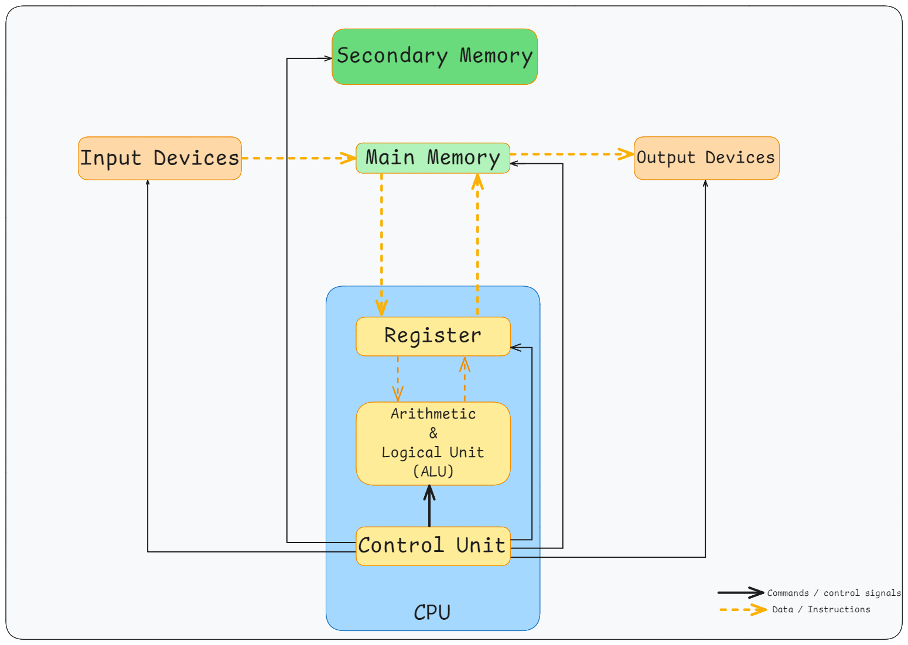
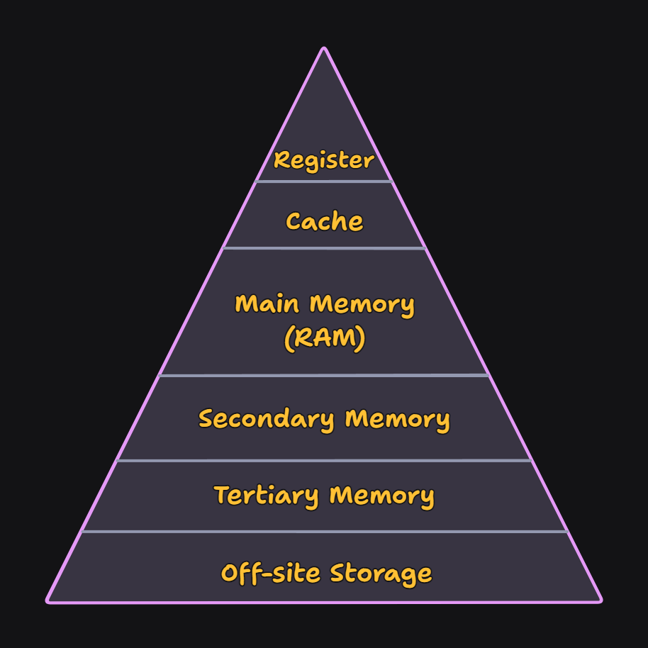
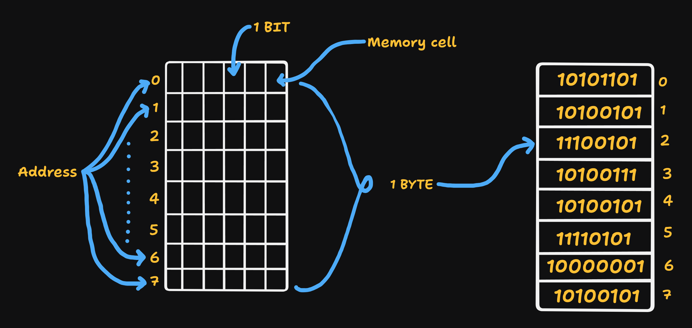
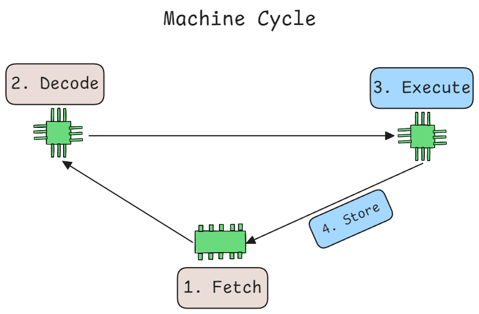
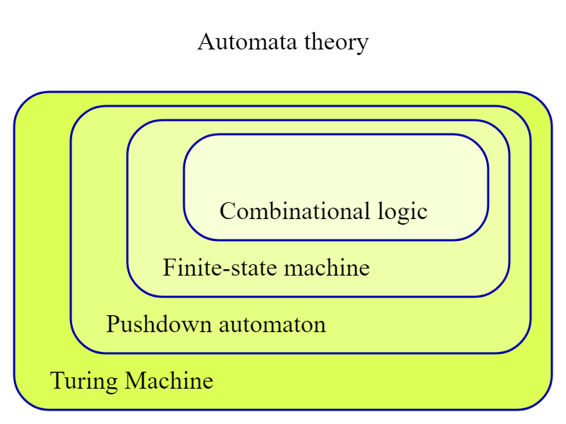
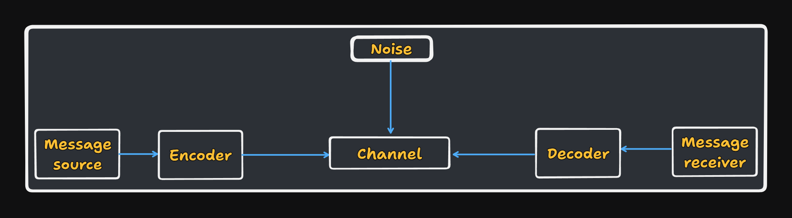
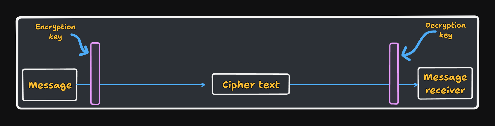

<h1 align="center"> Computer Science Fundamentals </h1>

**Computer Science** is the study of computers and computational systems. It is a broad discipline covering everything from the _algorithms_ that form _software_ to the ways in which software interacts with _hardware_.

At the deepest level, every computer is built on a simple idea: **electricity can represent information**.

- If current flows, we treat it as **1**.

- If it does not, we treat it as **0**.

To control these **1s** and **0s**, we rely on **semiconductors**, which allow us to build **transistors**—tiny electrical switches that turn signals on or off. When transistors are combined in specific patterns, they form **logic gates** such as `AND`, `OR`, and `NOT`. These gates implement rules of Boolean algebra, the mathematics of true/false operations.

By combining gates, we build larger digital components:

- **Adders** (arithmetic)

- **Multiplexers** (signal routing)

- **Flip-flops** and **registers** (temporary storage)

- **ALUs** (arithmetic and logic operations)

- **Control** units (coordination and sequencing)

Billions of these components fit onto a single microprocessor. This is the basis on which higher-level computing is built—automation, logic, programming, software, and ultimately the complex systems we use today.

## Boolean Logic

Boolean logic deals with values that are either true or false, implemented as **1** and **0** in hardware. The core operations are:

**AND** – True only if both inputs are true

**OR** – True if at least one input is true

**NOT** – Inverts the input

**XOR** – True if inputs differ

**NAND** – True unless both inputs are true

**NOR** – True only if both inputs are false

**XNOR** – True if inputs are the same

These operations form the foundation of digital circuits and computation.

## Computer Architecture

A computer system is organized around three major subsystems:

- **CPU (Central Processing Unit)**

Executes instructions, performs calculations, and controls the flow of data.

- **Memory**

Stores instructions and data.

- **RAM** (primary memory) 

Fast, volatile working storage

**Secondary storage**

Persistent but slower (SSD/HDD)

- **Input/Output (I/O)**

Interfaces for communication with the outside world—keyboards, displays, storage devices, and networks.

### CPU (Central Processing Unit)

A CPU is an integrated circuit containing several tightly coordinated units:

- Control Unit (CU) – Directs the execution of instructions

- Arithmetic Logic Unit (ALU) – Performs arithmetic and logical operations

- Registers – Extremely fast storage used during execution

Modern CPUs extend this with specialized units:

- Floating-Point Unit (FPU)

- Instruction decoder and micro-op schedulers

- Out-of-order execution engines

- Branch predictors

- Cache memory (L1, L2, L3)

- Memory controller

- Integrated graphics (in some processors)

> *A labeled die shot of Intel’s 13th Gen Core i9 (Raptor Lake) processor with 24 cores and 32 threads.* 

#### CPU Cores

Modern chips contain multiple cores, each capable of executing instructions independently. This provides parallelism. Many cores also support multithreading (e.g., Hyper-Threading) to keep execution units active even when one thread is waiting.

Each core includes:

- Execution units (integer, floating-point)

- Register files

- Instruction decoders

- Level-1 caches

- Pipelines for scheduling, speculation, and retirement

At scale, these cores and caches operate through high-speed interconnects, forming the processor’s internal communication fabric.

### Memory

All digital information is represented in bits (0 or 1).

8 bits = 1 byte, representing numbers from 0–255 or one text character.

#### Memory Hierarchy

Different levels of memory balance speed, size, and cost:

- Registers – Fastest, inside the CPU

- Cache (L1 / L2 / L3) – Very fast but small

- RAM – Larger, moderately fast

- Storage (SSD/HDD) – Very large, much slower

#### Memory Organization

Memory is arranged as a long sequence of addressable cells, typically one byte each. Binary values have:

- MSB (Most Significant Bit) – Leftmost, highest weight

- LSB (Least Significant Bit) – Rightmost, lowest weight

Example:
10110010 → MSB = 1, LSB = 0

### The Machine Cycle

Every CPU instruction goes through these steps:

- **Fetch** – Get the instruction from memory

- **Decode** – Convert it into micro-operations

- **Execute** – Perform the operation

- **Store** – Write the results to a register or memory

This cycle repeats billions of times per second.

---

## Theoretical Computer Science

Theoretical computer science explores the limits and principles of computation. It tells us what computers can do, what they cannot do, and how efficiently tasks can be performed.

### Turing Machines

Alan Turing introduced a simple abstract machine with:

- An infinite tape storing symbols

- A head that reads/writes and moves

- A state register

- A finite set of rules

Despite its simplicity, it captures the essence of computation. Anything that can be computed by a real machine can be expressed with a Turing machine.

### Computability Theory

Computability theory studies which problems are solvable at all:

- **Decidable problems**: Always produce a yes/no answer

- **Undecidable problems**: No algorithm exists to solve all cases

Example: Halting Problem

**Turing completeness**: A system can express any computation a Turing machine can perform

Most modern programming languages are Turing complete.

### Automata Theory & Formal Languages

Automata theory models computation using different types of abstract machines:

- **Finite Automata** – Recognize regular languages

- **Pushdown Automata** – Recognize context-free languages

- **Linear Bounded Automata** – Recognize context-sensitive languages

- **Turing Machines** – Recognize recursively enumerable languages

These map onto the **Chomsky hierarchy**, which classifies languages and grammars by expressive power. Automata form the basis of compilers, parsers, protocol analyzers, and many verification tools.

## Computational Complexity Theory

Complexity theory asks how much time or memory is required to solve a problem.

**Asymptotic notation** describes growth:

- O(n) – worst-case upper bound

- Θ(n) – tight bound

- Ω(n) – lower bound

### Key complexity classes:

- **P** – Solvable in polynomial time

- **NP** – Verifiable in polynomial time

- **NP-complete** – Hardest problems in NP

- **NP-hard** – At least as hard as NP-complete

The P vs NP problem asks whether every efficiently verifiable problem can also be efficiently solved. It remains unsolved.

## Information Theory

Information theory, founded by Claude Shannon, studies how to measure, compress, and transmit information.

### Key concepts

- **Entropy** – Amount of uncertainty or information

- **Lossless compression** – Removing redundancy (e.g., Huffman coding)

- **Channel capacity** – Maximum transmission rate with low error

These principles underpin modern communication systems, coding theory, and data compression.

## Cryptography

Cryptography ensures secure communication in the presence of adversaries.

**Core goals**

- **Confidentiality** – Only intended parties can read the data

- **Integrity** – Data cannot be modified undetected

- **Authentication** – Verifying identity

- **Non-repudiation** – Actions cannot be denied later

Modern cryptography draws on number theory, complexity theory, and information theory. Important methods include:

- Symmetric-key algorithms (AES)

- Public-key cryptography (RSA, ECC)

- Hash functions

- Digital signatures

## Graph Theory

Graph theory studies networks of nodes (vertices) and connections (edges). Graphs model relationships and constraints in many domains:

- Computer networks

- Social networks

- Shortest routes and pathfinding

- Scheduling, matching, and optimization problems

- Numerous NP-complete problems (e.g., Vertex Cover, Graph Coloring)

Graphs offer a universal way to model structured information in computing.

---

### Related Topics

- [Operating Systems](./Operating_System.md)

- [Computer Networks](./Computer_Networks.md)

- [Linux & Git](./Linux_GIT.md)
