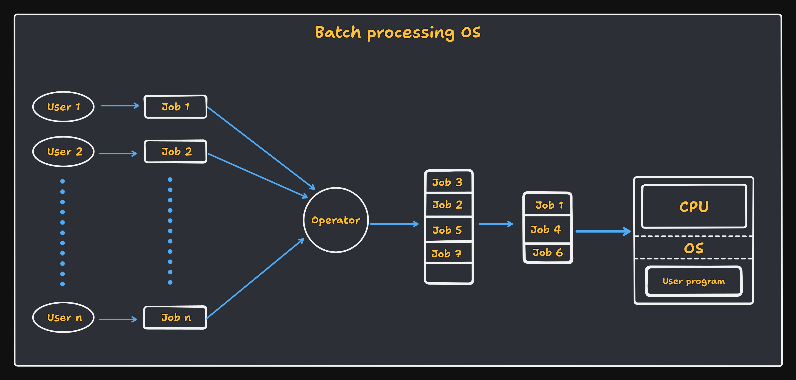

<h1 align="center" > Operating System </h1>

An Operating system is a software that manages and handle the hardware and software resources of a computer system and provides an environment in which the user can execute programs in a convenient and efficient manner by hiding underlying complexities of hardware and acting as a resource manager.

### Functions of Operating System:

1. **Process Management**: It is a function of the operating system that handles the creation, deletion, and scheduling of `processes`.

2. **Memory Management**: OS handles the allocation and de-allocation of memory space.

3. **File Management**: OS handles the creation, deletion, and modification of files.

4. **Security & Isolation**: OS handles the security of the computer system and provides isolation between processes.

5. **User Interface**: OS acts as the interface between the user and the computer system.

### Types of Operating System:

1. **Single process OS**: Does one process at a time. 

> EG. MS-DOS

2. **Batch processing OS**: Multiple processes at a time. 

> EG. UNIX

3. **Multi programming OS**: Multiple processes at a time. It uses `context switching` to switch between processes, where we maintain a `ready queue` of processes and CPU switches between them. Before switching, CPU saves the state of the current process in `PCB` (Process Control Block). Multi-programming OS has better CPU utilization, less process starvation and supports high priority processes. _It has only a single CPU_.

>EG. Windows. 

4. **Multi-tasking OS**: An extension of multi-programming OS. Along with context switching, it also uses `time sharing`. In time sharing, CPU divides its time among multiple processes and thus improving the overall performance of the system. It has better response time and supports interactive processes.  

5. **Multi-processing OS**: In multiprocessing OS, there are multiple CPUs. Each CPU has its own memory and I/O channels.

6. **Distributed OS**: Multiple CPUs are connected to each other via a network. Each CPU has its own memory and I/O channels. Each CPU executes its own process.

7. **Real-time OS**: It is used in real-time systems where the response time is very critical. It is used in systems like flight control systems, medical systems, etc.

## Process vs Thread

### Process

- A program in execution. Has its own memory space and resources. Processes are independent of each other. Context switching happens between processes.

### Thread

- A lightweight process. It does independent work within a process. Threads within a process share the same memory space and resources. It doe not provide isolation and memory protection between threads like processes.

### Thread Scheduling

Threads are scheduled for execution based on their priority.

## Components of Operating System

The main components of the operating system are:

1. **Kernel**: It is the core of the operating system. It provides the most basic level of control over all of the computer's hardware devices. It is responsible for managing memory, processes, and tasks.

2. **User Space**: It is the area of memory where user applications run. It is isolated from the kernel and other system processes.

## Common Questions on Operating System:

1. Difference between Multitasking and Multithreading ?

- Multitasking is the ability to execute more than one task at the same time. It would have multiple processes running at the same time. It does support isolation and memory protection between processes.

- Multithreading is the ability to execute more than one thread at the same time. It would only have one process running at the same time but that process would have multiple threads running at the same time. It does not support isolation and memory protection between threads.

| Multitasking | Multithreading |
|--------------|----------------|
| Execution of multiple tasks at the same time | A process is divided into several different sub tasks, which has its own path of execution. In short; Execution of multiple threads at the same time |
| Multiple processes | Multiple threads |
| More than one process being context-switched | Threads are not context-switched |
| Isolation and memory protection between processes | No isolation and memory protection between threads |
| 1 CPU | Number of CPU >= 1 |

2. Difference between process context switching and thread context switching ?

- In process context switching, the CPU saves the state of the current process in PCB (Process Control Block) before switching to another process. It is a costly operation.

- In thread context switching, the CPU saves the state of the current thread in TCB (Thread Control Block) before switching to another thread. It is a less costly operation.

| Process Context Switching | Thread Context Switching |
|---------------------------|---------------------------|
| Switches the memory space | Switches the thread within the same memory space. But switches the Program counter, registers and stack |
| Costly operation | Less costly operation |
| CPU Cache state is Flushed | CPU Cache state is preserved |