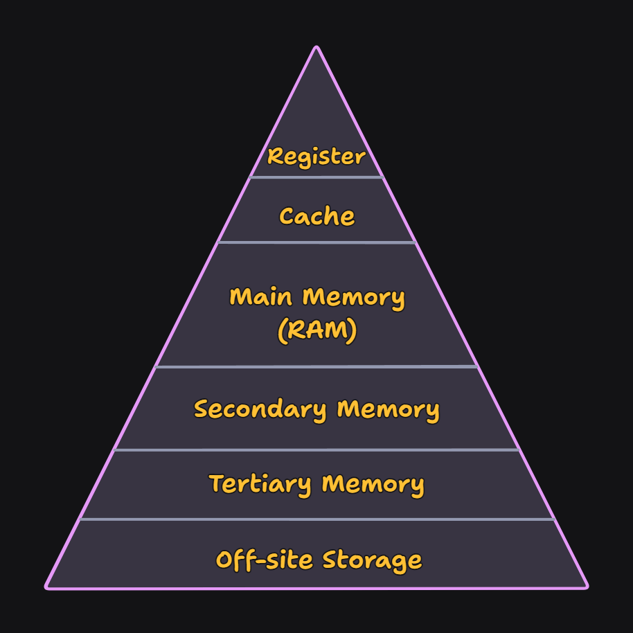
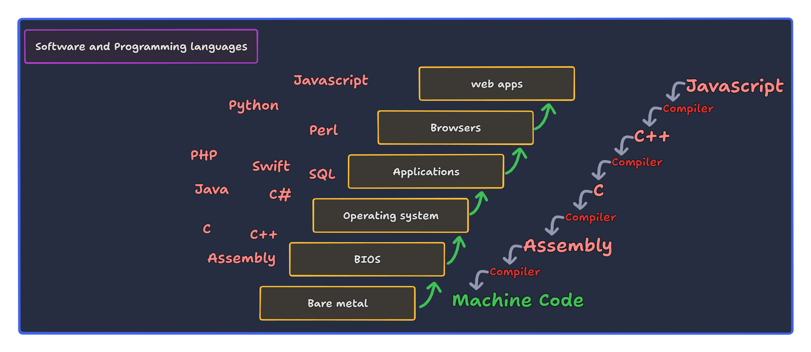

<h1 align="center" > Introduction to Computer Science </h1>

    

Computer science is the study of algorithms, computational systems, and the principles underlying the design of computer hardware and software.

## Theoretical computer science

It is a branch of computer science and mathematics that deals with what problems can be solved on a model of computation, using an algorithm and how efficiently they can be solved or to what degree. It has 3 major subfields:

### Computability Theory

Studies the general properties of computation, including decidability, computability, and Turing completeness. **In short, it studies what problems can be solved or to what extend solvable on a computer.**

- **Turing Machines**: Introduced by Alan Turing in the 1936, Turing machines are abstract mathematical models of computation. It provide a formal way to describe algorithms and computable functions.

**More on [computability theory](https://en.wikipedia.org/wiki/Computability_theory)**

### Automata Theory and Formal Language Theory

Automata theory is the study of abstract machines (also known as `automata`) and the computational problems that can be solved using these machines. It is closely related to formal language theory, which studies the properties of formal languages and their relation to automata.

**More on [Automata Theory](https://en.wikipedia.org/wiki/Automata_theory) and [Formal Language Theory](https://en.wikipedia.org/wiki/Formal_language)**

### Computational complexity theory

It studies how efficiently a problem can be solved. It helps us to compute the resources required to solve a problem, such as time, memory, and other resources.

- **Time and space complexity**: Measures the amount of time and space/memory required to solve a problem as a function of the input size. We use asymptotic notation, such as `O(n)`, `Ω(n)`, and `Θ(n)`, to describe the complexity of algorithms.

    - **Big O notation (O)**: It provides an upper bound on the growth rate of a function. It describes the worst-case scenario of an algorithm.
    
    - **Big Omega notation (Ω)**: It provides a lower bound on the growth rate of a function. It describes the best-case scenario of an algorithm.
    
    - **Big Theta notation (Θ)**: It provides both upper and lower bounds on the growth rate of a function. It describes the average-case scenario of an algorithm.

- **Classes of problems**: Computational complexity theory classifies problems into various complexity classes based on their inherent difficulty. Some of the key classes include:

    - **P (polynomial time)**: Problems that can be solved in polynomial time.
    
    - **NP (nondeterministic polynomial time)**: Problems for which a solution can be verified in polynomial time. 

    > If someone claims to have a solution to an NP problem, we can quickly verify whether the solution is correct or not in polynomial time. However, finding the solution itself might be computationally difficult.
    >
    > Eg. _Boolean satisfiability problem (SAT)_, _The traveling salesman problem (TSP)_, and _The vertex cover problem_.
    
    - **NP-complete**: If a problem is NP-complete, it means that it is as hard as the hardest problems in NP. The hardest problems in NP, to which all other problems in NP can be reduced in polynomial time. *If a polynomial-time algorithm exists for any NP-complete problem, then polynomial-time algorithms exist for all problems in NP, implying that P = NP.* 

    - **NP-hard**: Problems that are at least as hard as the hardest problems in NP but may not be in NP themselves. They are not necessarily verifiable in polynomial time.

    > In summary, P represents problems solvable in polynomial time, NP represents problems verifiable in polynomial time, NP-complete represents the hardest problems in NP, and NP-hard represents problems at least as hard as NP-complete problems.

### Information theory

Studies the properties of information and how it can be stored, measured, and communicated. Read more about **[Information Theory article on Wikipedia](https://en.wikipedia.org/wiki/Information_theory)**.

### Cryptography 

Studies the techniques for secure communication and data protection. It involves the design and analysis of cryptographic algorithms and protocols to ensure the confidentiality, integrity, and authenticity of data. It is closely related to information theory.

### Graph theory 

Studies the properties and applications of graphs, which are mathematical structures used to model pairwise relations between objects. It is extensively used in computer science for modeling networks, social relationships, and optimization problems.

### Computational geometry 

Studies algorithms and data structures for solving geometric problems. It has applications in computer graphics, geographic information systems, and robotics.

### Quantum computation 

Studies the use of quantum-mechanical phenomena, such as superposition and entanglement, to perform computation. It has the potential to solve certain problems more efficiently than classical computers. 

## Computer Engineering

It deals with the design and construction of computer systems and hardware. 

A computer understands and processes information in the form of digital signals, which are represented as 0s and 1s. We use programming languages to write code (human readable form), which is then translated into machine code (0s and 1s) that the computer can understand and execute.

A typical computer architecture would look something like this:

- A central processing unit.

- Memory (Different levels of cache memory, RAM, secondary storage, etc).

- GPU's, TPU's, or other specialized hardware for specific tasks.

### Memory and Information representation

Information is represented in computers as 0s and 1s, known as `bits`. These bits can be used to represent numbers, letters, pictures, sounds, and more. The smallest unit of information is a bit, and a group of `8 bits` is called a `byte`. A byte can represent 256 different values `(2^8)`. A byte can also represent a single character in the ASCII character set. 

Computers memory is divided into small units called **cells**. Typically each cell holding a **byte**. 

While there's no physical left or right orientation, we often visualize memory cells as linear, with the high-order end on the left and the low-order end on the right. The high-order bit, or most significant bit, is the leftmost bit, and the low-order bit, or least significant bit, is the rightmost bit.

- We use `boolean operations` to manipulate bits. Boolean operations are logical operations that operate on one or more bits and produce a bit as a result. The most common boolean operations are `AND`, `OR`, and `NOT`. These gates can be combined to create more complex arithmetic and logical operations.

- A gate is a device that generates the output of a Boolean operation based on its input values. In modern computers, gates are typically made as small electronic circuits where 0s and 1s are represented by different voltage levels. They serve as the fundamental components upon which computers are built.

### CPU (Central Processing Unit)

It is responsible for executing instructions and performing calculations. 

- **CPU Cores**: Modern CPUs have multiple cores, each capable of executing instructions independently. This allows for parallel processing and improved performance.

- **Cache Systems**: Cache is a small, fast memory unit that stores frequently accessed data and instructions to speed up the access.  Modern CPUs typically have a multi-level cache system, usually referred to as L1, L2, and L3 caches. L1 is the smallest and fastest, located closest to the CPU cores.

- **Instruction Pipeline**: CPUs use instruction pipelines to execute multiple instructions simultaneously. Each stage of the pipeline performs a specific task, such as fetching instructions, decoding them, and executing them. This doesn’t reduce the time it takes to complete an individual instruction; instead, it increases the number of instructions that can be processed simultaneously. This leads to a significant increase in overall CPU throughput

- Main memory, often termed random access memory (RAM), allows independent access to cells, unlike mass storage systems (hard disk, SSD, etc) that handle data in large blocks.

The following diagram illustrates the memory hierarchy in a typical computer system.

    

### Programming Languages

Programming languages are formal languages used to communicate instructions to a computer. They allow us to write code that can be executed by a computer to perform specific tasks. Programming languages can be classified into several categories based on their design and intended use.

High level overview of programming languages would look like this:

> We have detailed discussion on our programming language of choice, **Python** in the next section.

- **Low-level languages**: These languages are close to the hardware and provide direct control over the computer's resources. They are difficult to read and write but offer high performance and efficiency. Examples include assembly language and machine code.

- **High-level languages**: These languages are designed to be easy to read and write, making them more accessible to programmers. They are further divided into several categories:

    - **Procedural languages**: These languages focus on procedures or functions that perform specific tasks. Examples include C, Pascal, and Fortran.
    
    - **Object-oriented languages**: These languages organize code into objects that interact with each other. Examples include Java, C++, and Python.
    
    - **Functional languages**: These languages treat computation as the evaluation of mathematical functions and avoid changing state or mutable data. Examples include Haskell, Lisp, and ML.
    
    - **Scripting languages**: These languages are designed for automating tasks and are often used for web development, system administration, and data analysis. Examples include JavaScript, Python, and Ruby.

- **Domain-specific languages (DSL's)**: These languages are designed for specific domains or tasks, such as SQL for database queries, HTML for web development, and MATLAB for scientific computing.

- **Compiled vs. interpreted languages**: Programming languages can be compiled or interpreted. Compiled languages are translated into machine code before execution, while interpreted languages are translated into machine code during execution. Then there are languages that use a combination of both techniques. Both compiled and interpreted languages have their advantages and disadvantages and the way they are executed are pretty complex.

- **Syntax and semantics**: Programming languages have syntax and semantics that define the rules for writing valid code and the meaning of that code. Syntax refers to the structure of the code, while semantics refer to its meaning. Syntax errors occur when the code violates the language's rules, while semantic errors occur when the code does not behave as expected.

- **Paradigms**: Programming languages are based on different programming paradigms, such as `imperative`, `declarative`, `functional`, and `object-oriented`. Each paradigm has its own set of concepts and principles for writing code.

Core computer science topics we are going to focus on are;

- [Data structures and algorithms](../../02.%20Data%20Structures%20and%20Algorithms/Readme.md)

- [Operating Systems](./Operating_System.md)

- [Computer Networks](./Computer_Networks.md)

- [Databases](../../04.%20DBMS%20&%20Database%20Technologies/Readme.md)
