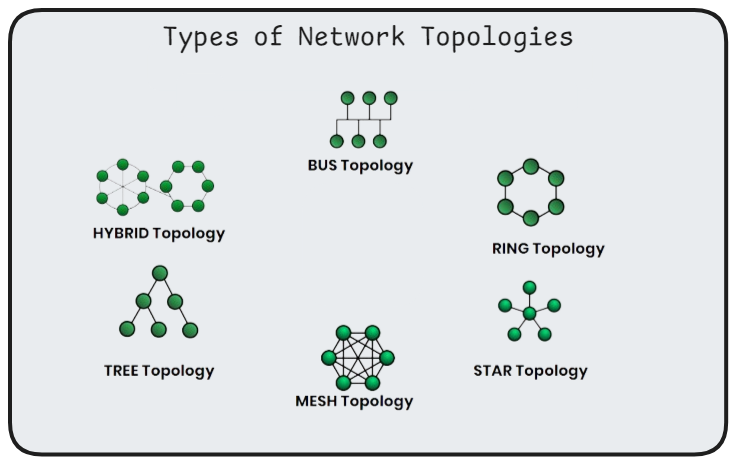
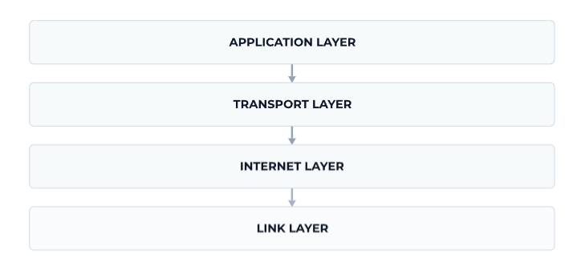

<h1 align="center" > Computer Network </h1>

Computer network consists of two or more computers that are linked together in order to share resources (Printers, CD's, Exchange files, electronic communication). The computers on a network may be linked through cables, telephone lines, radio waves, satellites, or infrared light beams. Computer networking includes the physical devices, software, and protocols that allow the devices to communicate with each other. 

## Types of Networks

- **LAN (Local Area Network)**: Covers a small geographic area, like a home or office.

- **WAN (Wide Area Network)**: Covers a large geographic area, such as a country or continent. The internet is the largest WAN.

- **MAN (Metropolitan Area Network)**: Covers a city or a large campus.

- **PAN (Personal Area Network)**: Covers a very small area, typically around an 
individual (e.g., Bluetooth connections).

## Network Topologies

Topologies refer to the physical and logical arrangement of devices in a network. 

- **Bus Topology**: All devices share a single communication line. It’s simple but can lead to collisions.

- **Star Topology**: Devices are connected to a central hub. If the hub fails, the entire network goes down.

- **Ring Topology**: Devices are connected in a circular fashion. Data travels in one direction.

- **Mesh Topology**: Every device is connected to every other device. It provides high redundancy.

- **Hybrid Topology**: A combination of two or more topologies.

## Network Protocols

- **TCP/IP (Transmission Control Protocol/Internet Protocol)**: The foundational, connection-oriented protocol suite for the internet.  It is used for applications where data integrity is critical, like web browsing and email.
    - **TCP**: Ensures reliable, ordered delivery of data.
   
    - **IP**: Handles addressing and routing of packets.

- **UDP (User Datagram Protocol)**: A connection-less protocol that allows data to be sent without establishing a connection. It is used for applications where speed is more important than reliability, like streaming and gaming.

- **HTTP/HTTPS (Hypertext Transfer Protocol/Secure)**: Used for transmitting web pages over the internet.

- **FTP (File Transfer Protocol)**: Used for transferring files between a client and server.

- **DNS (Domain Name System)**: Translates domain names into IP addresses.

### OSI Model (Open Systems Interconnection Model)

A conceptual framework used to understand network interactions in seven layers:

1. **Physical Layer**: Deals with the physical connection between devices (e.g., cables, switches).

2. **Data Link Layer**: Manages node-to-node data transfer and error detection (e.g., Ethernet, MAC addresses).

3. **Network Layer**: Handles routing and forwarding of data (e.g., IP addresses, routers).

4. **Transport Layer**: Ensures reliable data transfer (e.g., TCP, UDP).

5. **Session Layer**: Manages sessions or connections between applications.

6. **Presentation Layer**: Translates data between the application layer and the network (e.g., encryption, compression).

7. **Application Layer**: Interfaces with the application software (e.g., HTTP, FTP).

### TCP/IP Model

A simplified model thats widely used in practice, with four layers:

#### Link Layer

Responsible for sending data over a physical medium, such as a cable or a wireless connection.

Some examples of Link layer protocols are Ethernet, Wi-Fi, and Bluetooth.

#### Internet Layer

Responsible for routing data across different networks to get it to the right destination.

Fundamental protocol in this layer is the IP (Internet Protocol). It also has other protocols like ICMP(Internet Control Message Protocol) used by programs like `ping` to test connectivity and ARP(Address Resolution Protocol) to map IP addresses to MAC addresses.

#### Transport Layer 

Responsible for providing reliable data transfer between two devices. It does this by breaking data into packets, sending them, and then reassembling them at the destination.

Most commonly used transport layer protocols are TCP(Transmission Control Protocol) and UDP(User Datagram Protocol). 

Other protocols like SCTP(Stream Control Transmission Protocol), RUDP(Real-time Transport Protocol) are also used.

#### Application Layer

It is the top most layer where most of the applications that we use live. It relies protocols from the lower layers to send and receive data.

Major application layer protocols are HTTP, FTP, SMTP, POP3, IMAP, DNS, DHCP, etc.

### IP Addressing

An IP (Internet Protocol) address is a unique identifier assigned to each device on a network. It allows devices to locate and communicate with each other. There are two types of IP addresses: IPv4 (e.g.,`192.168.1.1`); 32-bit address scheme  and IPv6; 28-bit address scheme (e.g., `2001:0db8:85a3:0000:0000:8a2e:0370:7334`).

- **Public vs. Private IPs**: Public IPs are used on the internet, while private IPs are used within private networks.

- **Subnetting/subnet masking**: Divides an IP network into smaller sub-networks. It helps determine which portion of an IP address is the network address and which part is the host address.

### Routing
- **Definition**: The process of selecting paths in a network to send data packets.

- **Types of Routing**:
    - **Static Routing**: Manual configuration of routing paths.
    
    - **Dynamic Routing**: Automatic adjustment of paths based on current network conditions (e.g., OSPF, BGP).

### Switching
   - **Circuit Switching**: A dedicated communication path between two devices (e.g., traditional telephone networks).
   
   - **Packet Switching**: Data is broken into packets and each packet may take a different path to the destination (e.g., the internet).

### Network Security

   - **Firewalls**: Devices or software that monitor and control incoming and outgoing network traffic based on predefined security rules.
   
   - **VPN (Virtual Private Network)**: Extends a private network across a public network, enabling secure remote access.
   
   - **Encryption**: The process of encoding data to prevent unauthorized access (e.g., SSL/TLS).
   
   - **Authentication**: Verifying the identity of users or devices (e.g., passwords, biometrics).

### Wireless Networking
   
   - **Wi-Fi**: A technology for wireless local area networking.
   
   - **Bluetooth**: A standard for short-range wireless communication.
   
   - **Mobile Networks**: Cellular networks like 4G, 5G for wide-area wireless communication.

### Network Devices
   
   - **Router**: Routes data between different networks.
   
   - **Switch**: Connects devices within the same network and uses MAC addresses to forward data.
   
   - **Hub**: A basic device that connects multiple devices in a network but broadcasts data to all connected devices.
   
   - **Access Point**: Allows wireless devices to connect to a wired network.
   
   - **Modem**: Modulates and demodulates signals for communication over telephone lines or cable.

### Network Troubleshooting
   
   - **Ping**: A command to test the reachability of a device on a network.
   
   - **Traceroute**: A command to trace the path that packets take from the source to the destination.
   
   - **Network Analyzers**: Tools that capture and analyze network traffic (e.g., Wireshark).

### Emerging Trends

   - **SDN (Software-Defined Networking)**: An approach to networking that uses software-based controllers to manage hardware.

   - **NFV (Network Functions Virtualization)**: Decouples network functions from hardware to improve scalability.

#### [Read more](https://github.com/kannanjayachandran/Full-Stack-Development/blob/main/1_Fundamentals/Introduction.md)
