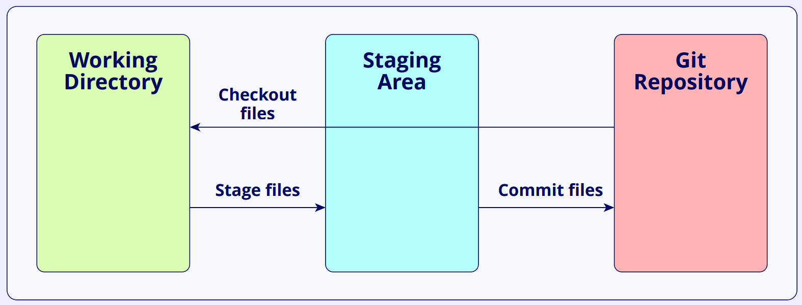

<h1 align="center" >Linux - GIT</h1>

- **[Linux command line for beginners](https://ubuntu.com/tutorials/command-line-for-beginners#1-overview)**

- **[Top 50 essential linux commands](https://www.digitalocean.com/community/tutorials/linux-commands)**

## GIT

Git is a popular version control system. Version control systems are software tools that allows multiple people to work on the same project simultaneously and helps them track changes in the code. Git along with a central repository like GitHub, GitLab, or Bitbucket, allows multiple developers to work on the same project at the same time.

### Basic Terminology

- **Repository/Repo** : A folder that contains all the project files and the version history.

- **Branch** : A separate version of the project. The original version is usually called main or master.

- **Commit** : A snapshot of changes made in the repository with a message describing what was changed at the given time.

- **Staging area** : The staging area is where files ready to be committed go before they are committed to the Git repository. It helps to review the changes made and create meaningful commits.

- **Check out** : This means switching to a different branch or commit in a project and making it available in the working directory.



**Commit hash** : It is a unique ID (a long string of letters and numbers) that Git generates for each commit made to the project.

**Reference** : Also known as a ref, it is a label that Git uses to keep track of important points in your project’s history.

**Tag** : It is a reference that cannot be changed later to point elsewhere. It’s commonly used to denote releases, versions, or significant milestones in a project’s development.

**HEAD** : It is a reference that points to the latest change (commit) in the branch being worked on.

**Reference logs** : They track all updates to branches and pointers (like HEAD), including lost commits, merges, resets, and other changes.

**Logs** : They only track the history of commits in a branch.

**Remote** -tracking branches: They are branch references in the local Git repository that track the currently known state of branches in a remote repository. They keep the local repository in sync with the remote repository.

## Setting up Git

Install git for your OS and get an account on GitHub. The following are my git configs. Open the `.gitconfig` file in your home directory and add the following lines:

```bash
[user]
    name = {Your Name}
    email = {Your Email}

[credential]
    helper = cache --timeout=3600

[alias]
    co = checkout
    ci = commit
    st = status
    br = branch
    hist = log --pretty=format:\"%h %ad | %s%d [%an]\" --graph --date=short

[color]
    diff = auto
    interactive = auto
    status = auto

[color "branch"]
    current = yellow reverse
    local = yellow
    remote = green
```

## Creating a Repository

```bash
mkdir {repo-name}
cd {repo-name}
git init
```

## Cloning a Repository

```bash
git clone {repo-url}
```

## Adding Files

```bash
git add {file-name}
```

## Committing Changes

```bash
git commit -m "{commit-message}"
```

**We can use `git commit --amend` to change the last commit, without creating a new one.**

## Pushing Changes

```bash
git push
```

- **We can use `git push -u origin {branch-name}` to set the default remote branch.**

- **We can use `git push --force` to force push.(Be careful with this one and you don't want to use this most of the time)**

- **We can use `git push --force-with-lease` to force push, but only if the remote branch is the same as the local branch. Use this when we rebase or amend commits.**

## Pulling Changes

```bash
git pull
```

## Branching

```bash
git branch {branch-name}
git checkout {branch-name}
```

## Merging Branches

```bash
git checkout {branch-name}
git merge {branch-name}
```
## Viewing History

```bash
git log
```

## Viewing Changes

```bash
git diff
```

## Viewing Status

```bash
git status
```

## Viewing Branches

```bash
git branch
```

## Deleting Branches

```bash
git branch -d {branch-name}
```

## Viewing Remotes

```bash
git remote -v
```

## Viewing Configs

```bash
git config --list
```

## [GIT Online Documentation](https://git-scm.com/book/en/v2)
