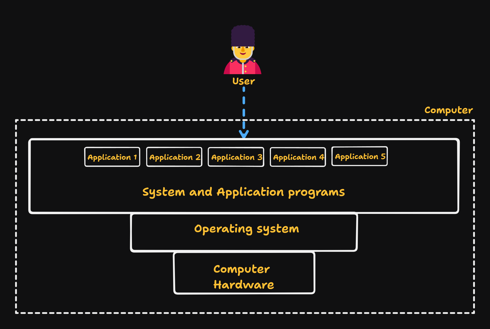
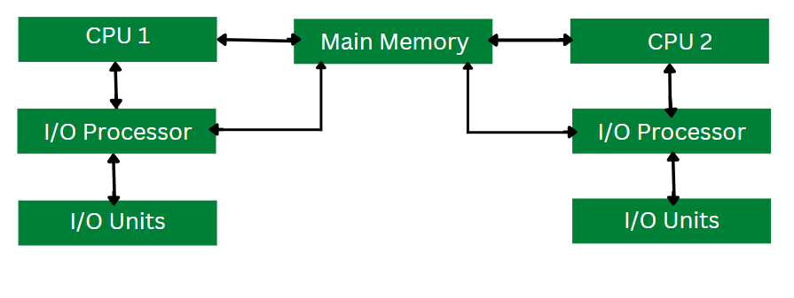
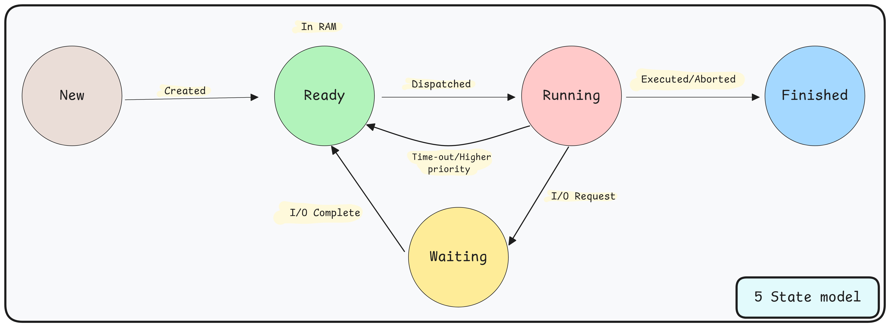
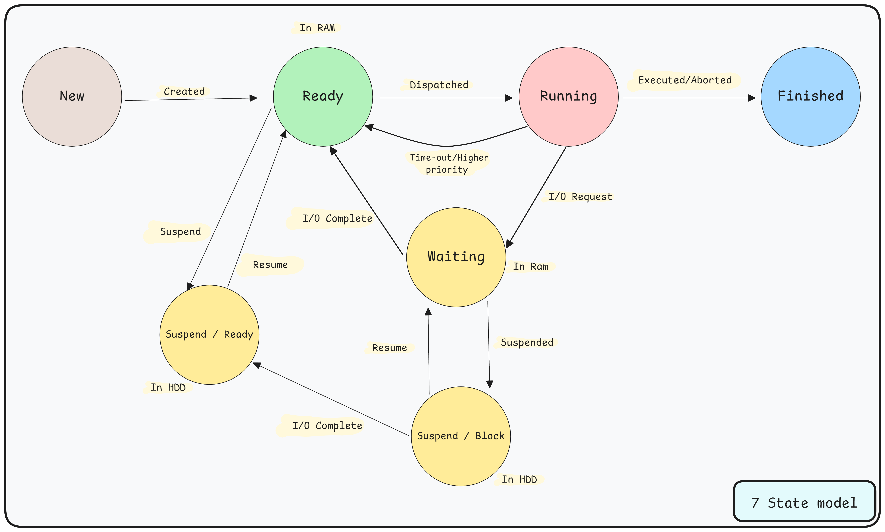

<h1 align="center" > Operating System </h1>

An Operating System (OS) is system software that manages computer hardware and software resources. It provides an environment for users to execute programs efficiently by abstracting hardware complexities and acting as a resource manager. Without an OS, a computer is just a collection of electronic components that cannot perform useful tasks.

---

## Core services of operating system

An operating system primarily provides three fundamental services:

- **Abstraction**  
Hides hardware complexity behind clean interfaces. (*files*: abstract storage devices, *processes/threads*: abstract CPU execution, *virtual memory*: abstract physical memory, *sockets*: abstract network communication).

- **Protection & Security**  
Ensures system integrity and data safety. (*User/kernel modes*: Privilege separation, *memory isolation*: Prevent processes from accessing each other's memory, *access control*: File permission and user authentication, *System call validation*: Verify user requests).

- **Resource Management**  
  Efficiently allocates and manages system resources. (*CPU scheduling*: which processes run when, *memory management*: allocates and tracks memory usage, *I/O and disk management*: handles device communication, *process/thread lifecycle*: creation execution and termination).

### Key OS Functions

1. **Program Execution** – Load, start, schedule, and terminate programs; handle **CPU scheduling**, **deadlock**, **starvation**.

2. **I/O Management** – Device drivers, buffering, caching, and spooling; interrupt/DMA-based I/O.

3. **Process Management** – Create, schedule, synchronize, and destroy processes.

4. **Memory Management** – Address translation, paging/segmentation, virtual memory.

5. **File System Management** – Files, directories, permissions, caching, journaling.

6. **Security & Isolation** – User/kernel separation, ACLs/capabilities, sandboxing.

7. **User Interfaces** – CLI shells, GUIs, system utilities.

---

## Types of Operating System:

Operating systems can be classified based on their usage and architecture:

### 1. Single-tasking (Single-process) OS

Runs one program at a time alongside the OS. Simple but inefficient.

*Example: MS-DOS.*

### 2. Batch OS

Processes jobs in batches without user interaction. Good for repetitive tasks.

*Example: Early mainframe systems (e.g., Unisys MCP).*

### 3. Multiprogramming OS

Multiple programs (**ready** processes) loaded in memory simultaneously. CPU switches between programs (**context switching**) when one waits for I/O. Improves CPU utilization.

> EG. Early versions of UNIX. 

### 4. Multitasking (Time-Sharing) OS

Extension of multiprogramming with **preemption** and **time slices (quanta)**.

*Modern desktop/server OSs are time-sharing.*

### 5. Multiprocessing OS

Uses **multiple CPUs/cores** simultaneously. Offers true parallel execution of processes.

- **SMP (Symmetric Multiprocessing)**: all CPUs share the same memory

- **NUMA (Non-Uniform Memory Access)** - CPUs have local memory with shared access

### 6. Distributed OS

Manages multiple networked computers as one system. Transparent resource sharing across network.

> EG: Plan 9, Amoeba

### 7. Real-time OS (RTOS)

Used in time-critical systems like flight control or medical systems, where timely and deterministic responses are essential. Guarantees response within specific time constraints

- **Hard RT**: missing a deadline is a failure (e.g., pacemakers, avionics).

- **Soft RT**: occasional misses tolerable (e.g., multimedia).

---

## Process

A **program** is code on disk. A **process** is an **active program in execution**. A process consists of;

- **Program code** (text section)

- **Program counter** - address of next instruction

- **CPU registers** - current state

- **Stack** - function calls and local variables

- **Data section** - global variables

- **Heap** - dynamically allocated memory

- **Program Counter (PC/IP)**: address of next instruction. 

- **CPU–I/O Burst Cycle**: processes alternate between CPU bursts and I/O waits.

- **Context Switch**: save current process context; load another’s context. 

- **PCB (Process Control Block)**: kernel data structure with process metadata.

### Process State Models

**5-State Model**: `new → ready ↔ running → waiting → terminated` 

**7-State Model (with suspension)** adds: `suspended-ready`, `suspended-waiting`

> Suspended processes are swapped to secondary storage (Linux: **swap space**; Windows: **pagefile**).

### Process Control Block (PCB)

A Process Control Block (PCB) is a data structure used by the operating system to manage information about a process.

It holds (not exhaustive):

- **Process ID (PID)** (An integer value that is unique for each process), **Parent PID**, **Credentials**

- **Process State** (Current state of the process (e.g., running, waiting, ready, suspended)), **Priority**, **Scheduling info**

- **Program Counter (PC)** (Address of the next instruction to be executed), **CPU registers**, **stack pointers**

- **CPU Registers**: Values of CPU registers at the time of process suspension. One such register is `program counter` which stores the address of the next instruction to be executed.

- **Memory info** (page tables, segments)

- **Open files / file descriptors**, **I/O status** 

- **Accounting** (CPU time, faults) and **signals/handlers**

PCB is stored in protected kernel memory; essential for scheduling and context switching.

---

## Threads

A **thread** is the smallest schedulable unit of execution within a process. Threads share the **process address space** but have their own **program counter**, **registers**, and **stack space**.  

- Benefits of threads are concurrency, responsiveness, and resource sharing

- Context switching between threads are faster than processes

- There is no memory isolation between threads, so we need to do synchronize them

### Types of Threads

- **User-level threads (ULTs)**: managed in user space (fast create/switch; a blocking `syscall` may block entire process). 

- **Kernel-level threads (KLTs)**: managed by kernel (true parallelism on multi-core; slightly heavier). 

- **M:N models**: map many ULTs onto fewer KLTs.
