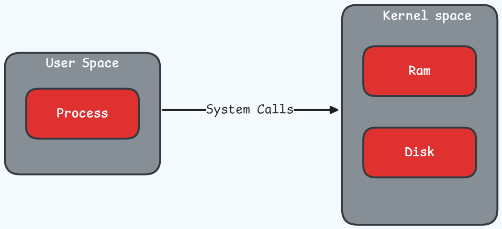
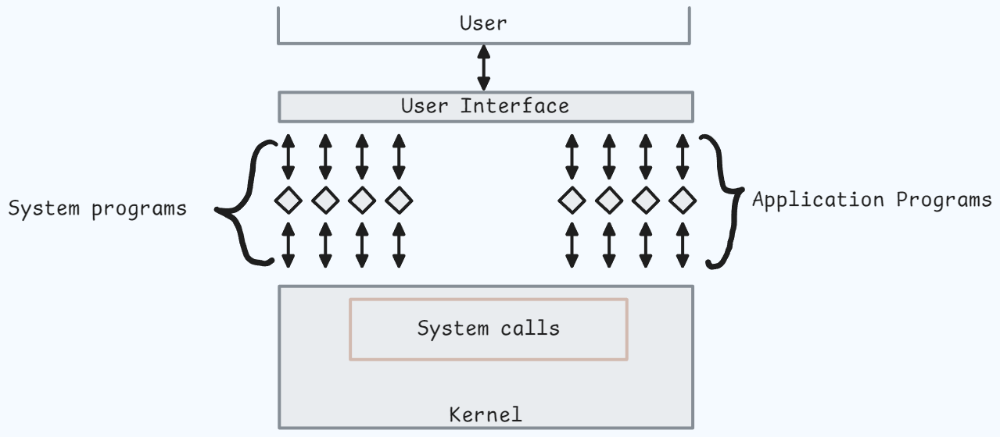

<h1 align="center" > Operating System </h1>

An Operating system is a software that manages and handle the hardware and software resources of a computer system and provides an environment in which the user can execute programs in a convenient and efficient manner by hiding underlying complexities of hardware and acting as a resource manager.

## Operating System Services:

1. **Program Execution**: OS manages how a program is going to be executed. The order in which the program gets executed depends upon the CPU scheduling algorithm (FCFS, SJF, etc.). When the program is in execution it also handles deadlock and starvation.

2. **I/O Operations**: OS handles the input and output operations by establishing communication between the user and the device drivers.

3. **Process Management**: It is a function of the operating system that handles the creation, deletion, and scheduling of `processes`.

4. **Memory Management**: OS handles the allocation and de-allocation of memory space.

5. **File Management**: OS handles the creation, deletion, and modification of files.

6. **Security & Isolation**: OS handles the security of the computer system and provides isolation between processes.

7. **User Interface**: OS acts as the interface between the user and the computer system.

## Types of Operating System:

### 1. Single process OS

Does one process at a time. EG. MS-DOS

### 2. Batch processing OS

Multiple processes at a time. EG. UNIX

### 3. Multi programming OS

Multiple processes at a time. It uses `context switching` to switch between processes, where we maintain a `ready queue` of processes and CPU switches between them. Before switching, CPU saves the state of the current process in `PCB` (Process Control Block). Multi-programming OS has better CPU utilization, less process starvation and supports high priority processes. _It has only a single CPU_. EG. Windows. 

### 4. Multi-tasking OS

An extension of multi-programming OS. Along with context switching, it also uses `time sharing`. In time sharing, CPU divides its time among multiple processes and thus improving the overall performance of the system. It has better response time and supports interactive processes.  

### 5. Multi-processing OS

In multiprocessing OS, there are multiple CPUs. Each CPU has its own memory and I/O channels.

### 6. Distributed OS

Multiple CPUs are connected to each other via a network. Each CPU has its own memory and I/O channels. Each CPU executes its own process.

### 7. Real-time OS

It is used in real-time systems where the response time is very critical. It is used in systems like flight control systems, medical systems, etc.

## Components of Operating System

### User Space

User space is the area of memory where user applications run. It is isolated from the kernel and other system processes. It is where most of the user applications run, such as web browsers, text editors, and media players. GUI, CLI, and other user interfaces are also part of the user space. User space applications interact with the kernel through system calls.

### System Calls

System calls are the fundamental mechanisms that allow applications to interact with the underlying operating system kernel. They provide a standardized interface, enabling programs to request services from the kernel without directly accessing privileged hardware resources. This separation of concerns enhances system security and efficiency.

When a program executes a system call, it transitions from user mode to kernel mode, which is a higher privileged mode. The transition is typically initiated by invoking a specific function or interrupting instruction provided by the programming language or the operating system.

Once in kernel mode, the system call is handled by the operating system. The kernel performs the requested operation on behalf of the program and returns the result. Afterward, control is returned to the user-level program, which continues its execution.

- **Hypervisor**: Also known as virtualization based kernel, is an operating system structure that enables the execution of multiple operating systems concurrently on the same hardware. It provides virtualized environments for guest operating systems and manages their interactions with the underlying hardware.

### Kernel Space

The kernel is the core component of an operating system (OS) that manages hardware resources and provides services to applications. It operates in privileged mode, with direct access to the system's hardware.

## Threads

A thread is a lightweight process and forms the basic unit of CPU utilization. A process can perform more than one task at the same time by including multiple threads. A thread has its own program counter, register set, and stack space. Threads within a process share the same memory space and resources and do not provide isolation and memory protection between threads like processes. 

There are two types of threads: user-level threads and kernel-level threads.

### User-level threads

- Threads implemented by user. 

- OS does not know about these threads.

- Implementation is easy and takes less time for context switching.

- One thread blocking will block the entire process.

### Kernel-level threads

- Threads implemented by the OS.

- Implementation is complicated and require hardware support for context switching.

- One thread blocking will not block the entire process.

## Process

A program in execution. They are independent of each other and has its own memory space and resources. Context switching happens between processes. OS is responsible for starting, stopping and scheduling processes. It also takes care of preventing deadlock, facilitating inter-process communication and synchronization. The value of program counter (PC) indicates the address of the next instruction of the process being executed. Each process is represented by a Process Control Block (PCB).

### CPU Scheduling

CPU scheduling refers to a technique that permits one process to utilize the CPU while keeping the other programs waiting or put on hold. (FCFS, SJF, Round Robin, Priority Scheduling, etc.)

`Round robin` is a preemptive first come first serve scheduling algorithm. It assigns a fixed time unit per process. If the process is not completed in the given time, it is moved to the end of the queue.

### Critical Section Problem

The critical section problem in operating systems arises when multiple processes or threads need to access a shared resource simultaneously. If not handled properly, this can lead to race conditions and inconsistent results.

Critical section is the section of code that accesses a shared resource. Race condition is a situation where the outcome of a program depends on the timing of events. 

To solve the critical section problem, we must ensure that:

1. **Mutual Exclusion**: Only one process can access the critical section at a time.

2. **Progress**: If no process is executing in its critical section and there are processes that wish to enter their critical sections, then one of these processes must be allowed to enter its critical section within a finite amount of time.

3. Bounded waiting: There exists a bound, or limit, on the number of times that other processes are allowed to enter their critical sections after a process has made a request to enter its critical section and before that request is granted.

### Synchronization Tools

A semaphore is a synchronization tool that allows multiple processes to access a shared resource. It is an integer variable that can be accessed and modified only through two standard atomic operations: `wait (P)` and `signal (V)`. Semaphores are of two types:

1. **Counting semaphore**: An integer variable whose value can range over an unrestricted domain.

2. **Mutex**: A mutex provides mutual exclusion, either producer or consumer can have the key (mutex) and proceed with their work. As long as the buffer is filled by producer, the consumer needs to wait, and vice versa. At any point of time, only one thread can work with the entire buffer.

### Starvation

Occurs when high-priority processes constantly use resources, preventing low-priority processes from getting resources. Starvation can be overcome by using aging, which gradually increases the priority of waiting processes.

### Deadlock

Occurs when two or more processes are waiting for each other to release resources, creating a cycle where no processes can execute. Deadlock can be avoided by preventing the conditions that cause it, such as circular wait, no preemption, hold and wait, and mutual exclusion.

### Inter-process Communication

IPC is an operating system technique that facilitates data sharing, synchronization, and communication between processes.

### Process Control Block (PCB)

The operating system uses a data structure called a Process Control Block (PCB) to store and handle process-related data. The PCB contains information such as the process ID, state, priority, program counter, and memory allocation.

## Common Questions on Operating System:

1. Difference between Multitasking and Multithreading ?

- Multitasking is the ability to execute more than one task at the same time. It would have multiple processes running at the same time. It does support isolation and memory protection between processes.

- Multithreading is the ability to execute more than one thread at the same time. It would only have one process running at the same time but that process would have multiple threads running at the same time. It does not support isolation and memory protection between threads.

| Multitasking | Multithreading |
|--------------|----------------|
| Execution of multiple tasks at the same time | A process is divided into several different sub tasks, which has its own path of execution. In short; Execution of multiple threads at the same time |
| Multiple processes | Multiple threads |
| More than one process being context-switched | Threads are not context-switched |
| Isolation and memory protection between processes | No isolation and memory protection between threads |
| 1 CPU | Number of CPU >= 1 |

2. Difference between process context switching and thread context switching ?

- In process context switching, the CPU saves the state of the current process in PCB (Process Control Block) before switching to another process. It is a costly operation.

- In thread context switching, the CPU saves the state of the current thread in TCB (Thread Control Block) before switching to another thread. It is a less costly operation.

| Process Context Switching | Thread Context Switching |
|---------------------------|---------------------------|
| Switches the memory space | Switches the thread within the same memory space. But switches the Program counter, registers and stack |
| Costly operation | Less costly operation |
| CPU Cache state is Flushed | CPU Cache state is preserved |