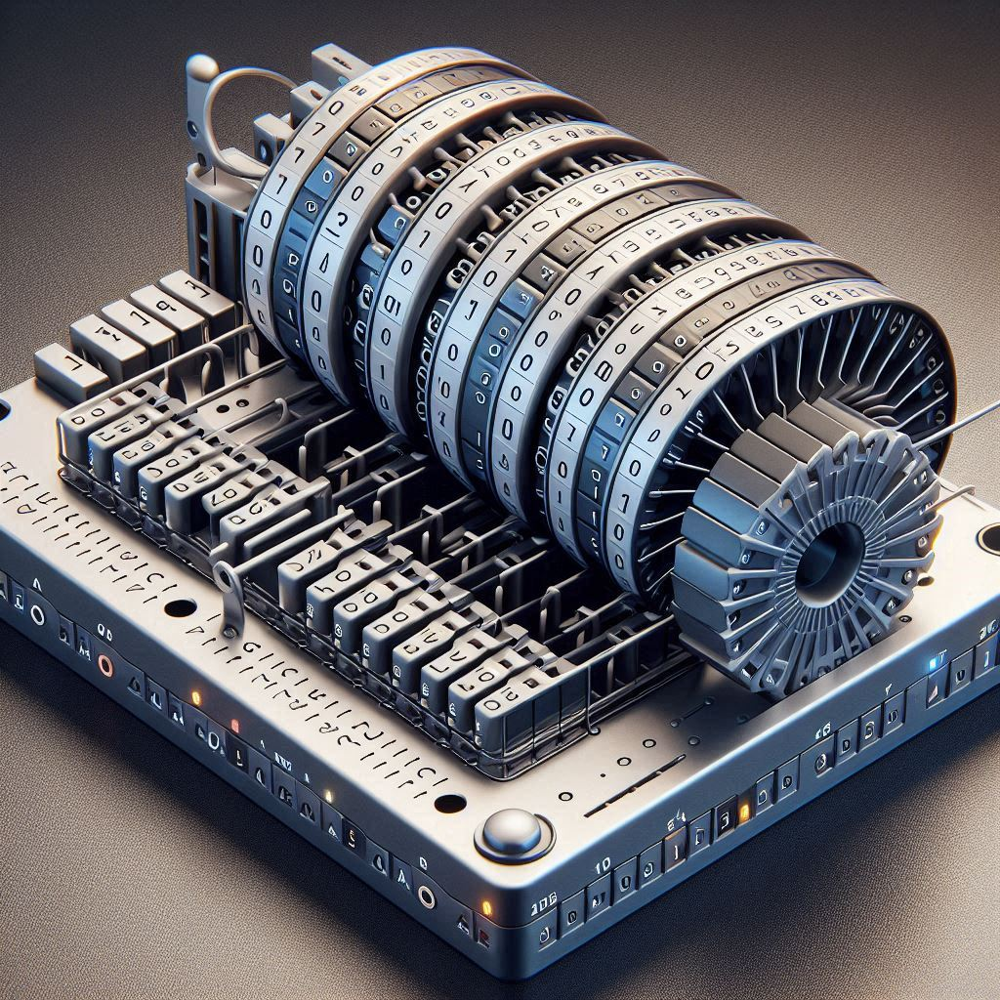
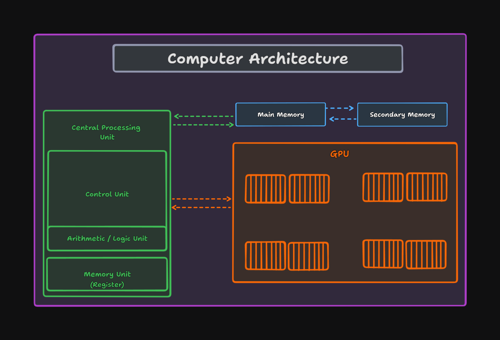
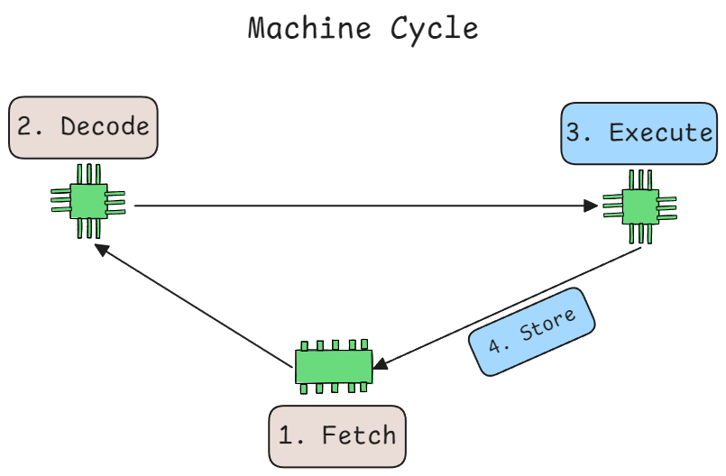

<h1 align="center" > Introduction to Computer Science </h1>

<p align="center">
    <a href="#theoretical-computer-science"></a>
</p>

---

**Computer science** is the study of computers and computational systems. It is a broad field which includes everything from the _algorithms_ that make up _software_ to how software interacts with _hardware_ to how well software is developed and designed. **Computer scientists** use various mathematical algorithms, coding procedures, and their expert programming skills to study computer processes and develop new software and systems.

We also have **Computer Engineering** which is concerned with the design of computer hardware and of computer-based devices or software interacting tightly with the hardware for embedded systems and computer-based devices.

**Information systems** as a field has to do with applying today’s information technology to solve today’s problems, typically in the area of businesses and other enterprises.

## Historical Context

Originally, computers were built to solve arithmetic problems, but they have since evolved to run the internet, play video games, create artificial brains, and simulate the universe. At the core, all computations boil down to manipulating 0s and 1s.

Alan Turing is considered the father of computer science. He formalized the concept of a **Turing machine**, which is a simple description of a general-purpose computer. A Turing machine consists of an infinitely long tape divided into cells containing symbols, a head that can read and write symbols, a state register that stores the head's state, and a list of possible instructions. This forms the basis of modern computers.
<p align="center"></p>

> AI generated image; Not an actual Turing machine

## Theoretical Computer Science

Theoretical computer science examines the problems that can be solved using computational models and algorithms, focusing on their efficiency and solvability.

**Computability Theory** : It studies the general properties of computation, including decidability, computability, and Turing completeness. It addresses what problems can be solved on a computer. **More on [computability theory](https://en.wikipedia.org/wiki/Computability_theory)**

**Automata Theory and Formal Language Theory** : Automata theory studies abstract machines (automata) and the computational problems they can solve. It is closely linked to formal language theory, which examines the properties of formal languages and their relationship to automata. **More on [Automata Theory](https://en.wikipedia.org/wiki/Automata_theory) and [Formal Language Theory](https://en.wikipedia.org/wiki/Formal_language)**


**Computational complexity theory** : This field examines how efficiently problems can be solved, considering resources like time and memory.

1. **Time and space complexity**: Measures the time and memory required to solve a problem as a function of input size, using asymptotic notation such as `O(n)`, `Ω(n)`, and `Θ(n)`.

2. **Classes of problems**: Problems are classified into complexity classes based on their difficulty.

    - **P (polynomial time)**: Problems that can be solved in polynomial time.
    
    - **NP (nondeterministic polynomial time)**: Problems for which a solution can be verified in polynomial time. Examples include the Boolean satisfiability problem (SAT), the traveling salesman problem (TSP), and the vertex cover problem.
    
    - **NP-complete**: The hardest problems in NP, to which all other NP problems can be reduced in polynomial time. A polynomial-time algorithm for any NP-complete problem implies P = NP.

    - **NP-hard**: Problems at least as hard as the hardest NP problems but not necessarily in NP.

### Information theory

This field studies the properties of information and how it can be stored, measured, and communicated. Read more about **[Information Theory article on Wikipedia](https://en.wikipedia.org/wiki/Information_theory)**.


### Cryptography 

Cryptography involves techniques for secure communication and data protection, designing and analyzing cryptographic algorithms and protocols to ensure data confidentiality, integrity, and authenticity.


### Graph theory 

Graph theory examines the properties and applications of graphs, which model pairwise relationships between objects. It is used in modeling networks, social relationships, and optimization problems.

## Computer Architecture

A typical computer system's architecture would look like this:



It will have;

- **Central Processing Unit (CPU)**: Responsible for executing instructions and performing calculations.

- **Memory**: RAM (Random Access Memory) Stores data and instructions that the CPU needs to access quickly. Then we have secondary storage devices like hard drives and SSDs that store data more permanently.

- **Input/Output (I/O) devices**: These devices allow the computer to interact with the outside world, such as keyboard, mouse, monitors, network card, etc.

### CPU (Central Processing Unit)

Inside the CPU; we find an integrated circuit or Die (or chip) that contains Processor cores, a memory controller, a graphics processor and many other components. The following is a labelled die shot of a 13-th gen Intel Core i9 processor (Raptor Lake) with 24 cores.


> Image link: [Wikipedia](https://upload.wikimedia.org/wikipedia/commons/a/a4/Intel_Core_i9-13900K_Labelled_Die_Shot.jpg)

> For ease of reference; we will will be using the above diagram to explain the components of a CPU.

**CPU Cores**: Modern CPUs have multiple cores, each capable of executing instructions independently. They might also have something called hyper-threading, which allows each core to execute multiple threads simultaneously. The number of threads can be twice the number of cores in CPUs with hyper-threading. Not all cores might have similar performance to efficiency ratios; some cores might be optimized for performance while others might be optimized for efficiency (P-Cores and E-Cores).

The following are the components typically found inside a modern CPU Core:

- **Floating Point Unit (FPU)**: A specialized unit for performing floating-point arithmetic operations, such as addition, subtraction, multiplication, and division.

- **Integer Execution Units**: These units perform integer arithmetic operations, such as addition, subtraction, multiplication, and division. It is a critical part of the CPU for general purpose computing.

- **Out of order scheduler and Retirement unit**: This unit allows the CPU to execute instructions out of the order they appear in the program. This increases efficiency by making better use of CPU resources. After instructions are executed out-of-order, the retirement unit ensures they are retired (completed) in the correct order, maintaining the program's logical flow.

- **Decode Unit**: This unit decodes instructions fetched from memory into micro-operations that can be executed by the CPU's execution units.

- **Registers (Integer and Floating Point)**: Registers are small, fast storage locations within the CPU used to store data temporarily during processing. They are used to hold operands, intermediate results, and memory addresses.

- **Cache (L1, L2, L3)**: Small, fast memory unit that stores frequently accessed data and instructions to speed up access. Modern CPUs typically have a multi-level cache system, usually referred to as L1, L2, and L3 caches. L1 is the smallest and fastest, located closest to the CPU cores.

- **Branch Prediction Unit**: This unit predicts the outcome of conditional branches in the program to minimize the performance impact of branch mis-predictions.

Additionally we have many other complex components also. Essentially inside every CPU Core in our current processor we will find a layout of around 44000 transistors physically execute 32-bit instructions. The processor in the diagram has around 26 Million transistors. 

With transistors we can build logic gates and by combining logic gates in a certain way we can build complex circuits that can perform calculations according to boolean algebra.

**An Example**: Let's see what happens when we run a python program that adds two numbers.

```python
a, b = 5, 3
c = a + b
print(c)
```

**PHASE 1: Python Source Code Execution**

1. We run the program in the terminal. `python3 add.py`

2. The Python interpreter reads the source code and breaks it down into tokens (keywords, operators, identifiers) {Lexical Analysis}.

3. The tokens are parsed to form an Abstract Syntax Tree (AST), representing the structure of the code.

4. The AST is compiled into Python bytecode, an intermediate representation that is platform-independent.

5. The Python Virtual Machine (PVM) executes the bytecode. For each bytecode instruction:
    - Fetches the instruction.

    - Decodes the instruction.

    - Executes the instruction using a stack-based virtual machine.

**PHASE 2: CPU Execution**

1. The CPU fetches the next instruction (bytecode) from memory.

2. The decode unit translates the instruction into micro-operations (`μOps`) that the CPU can execute.

3. Instructions are sent to the out-of-order execution unit, allowing the CPU to execute instructions as resources become available rather than strictly sequentially.

4. Integer and floating-point values (e.g., `a` and `b`) are loaded into CPU registers.

5. The integer execution unit performs the addition of `a` and `b`.

6. The CPU may access L1/L2 caches to fetch operands and store results, minimizing latency compared to accessing main memory.

7. The result of the addition (`c`) is stored back in the memory.

8. Instructions are retired in order, ensuring the program's logical flow is maintained.

9. The result (`8`) is sent to the output device (console) via system calls, which involve interaction with the operating system.


The CPU performs a machine cycle, which includes accessing data, performing operations, and storing results back in memory. Modern CPUs can execute billions of machine cycles per second, synchronized by the clock generator. The speed of the clock is measured in GHz (Gigahertz), where 1 GHz equals 1 billion cycles per second.

<p align="center"></p>

---

## Information Representation in Computers

**Binary Data** : Information in computers is represented as binary data, a sequence of 0s and 1s known as bits. A group of 8 bits forms a byte, which can have 256 different combinations, allowing it to represent numbers, characters, and other data types.

A typical computer system features a hierarchy of memory levels, each with different speed, capacity, and cost characteristics. This hierarchy helps balance the trade-offs between fast, small, and expensive memory (like CPU cache) and slow, large, and cheaper memory (like secondary storage).


Computer memory is divided into small units called cells, typically each holding a **byte**. Although there's no physical orientation, memory cells are often visualized linearly, with the high-order end on the left and the low-order end on the right. The high-order bit (most significant bit) is the leftmost bit, and the low-order bit (least significant bit) is the rightmost bit.


While there's no physical left or right orientation, we often visualize memory cells as linear, with the high-order end on the left and the low-order end on the right. The high-order bit, or most significant bit, is the leftmost bit, and the low-order bit, or least significant bit, is the rightmost bit.


## Programming Languages

Programming languages are formal languages used to communicate instructions to a computer, enabling the execution of specific tasks. They can be classified based on various criteria, including their level of abstraction, execution method, design paradigm, and domain-specific applications.

### Level of Abstraction

- **Low-level languages**: Low-level languages are close to the hardware and provide direct control over the computer's resources. They are difficult to read and write but offer high performance and efficiency. (Assembly language, Machine code)

- **High-level languages**: High-level languages are designed to be easy to read and write, making them more accessible to programmers. They can be further categorized into:

    - **Procedural Languages**: Focus on procedures or functions that perform specific tasks. Examples: C, Pascal, Fortran.

    - **Object-Oriented Languages**: Organize code into objects that interact with each other. Examples: Java, C++, Python.

    - **Functional Languages**: Treat computation as the evaluation of mathematical functions and avoid changing state or mutable data. Examples: Haskell, Lisp.

    - **Scripting Languages**: Designed for automating tasks and often used for web development, system administration, and data analysis. Examples: JavaScript, Python, Ruby.

- **Domain-Specific Languages (DSLs)**: Domain-specific languages are designed for specific domains or tasks, such as:

    - `SQL` for database queries.
    - `HTML` for web development.
    - `MATLAB` for scientific computing.
    - `VHDL` for hardware description.

### Execution Method
- **Compiled Languages**: Compiled languages are translated into machine code before execution, providing faster runtime performance. Examples include:
    - C, C++, Rust, Go.

- **Interpreted Languages**: Interpreted languages are translated into machine code during execution, allowing for more flexibility and easier debugging. Examples include:
    - Python, Ruby, JavaScript.

- Some languages use a combination of both techniques, providing a balance between performance and flexibility. Examples include:

    - Java (compiled to bytecode, then interpreted or JIT-compiled at runtime)
    - C# (compiled to intermediate language, then JIT-compiled)

In fact we cannot say a language is purely compiled or interpreted. For example, Java is compiled to bytecode and then interpreted or Just-In-Time compiled at runtime. Python is compiled to bytecode and then interpreted by the Python Virtual Machine (PVM).

### Language Syntax and Semantics

**Syntax**: The set of rules that define the structure of valid code. Syntax errors occur when the code violates these rules.

**Semantics**: The meaning of the code, defining how it behaves. Semantic errors occur when the code does not behave as expected.

### Programming Paradigms

Programming languages are based on different paradigms, each with its own set of concepts and principles:

**Imperative Paradigm**: Focuses on how to perform tasks using statements that change a program's state. Examples: C, Java.

**Declarative Paradigm**: Focuses on what the program should accomplish without specifying how. Examples: SQL, HTML.

**Functional Paradigm**: Treats computation as the evaluation of mathematical functions and avoids mutable state. Examples: Haskell, Lisp.

**Object-Oriented Paradigm**: Organizes code into objects that encapsulate data and behavior. Examples: Java, C++, Python.

Other Core CS Concepts are covered in the following sections:

- [Data structures and algorithms](../03.%20Data%20Structures%20and%20Algorithms/Readme.md)

- [Operating Systems](./Operating_System.md)

- [Computer Networks](./Computer_Networks.md)

- [Databases](../04.%20Database%20Systems%20and%20Technologies/Readme.md)
