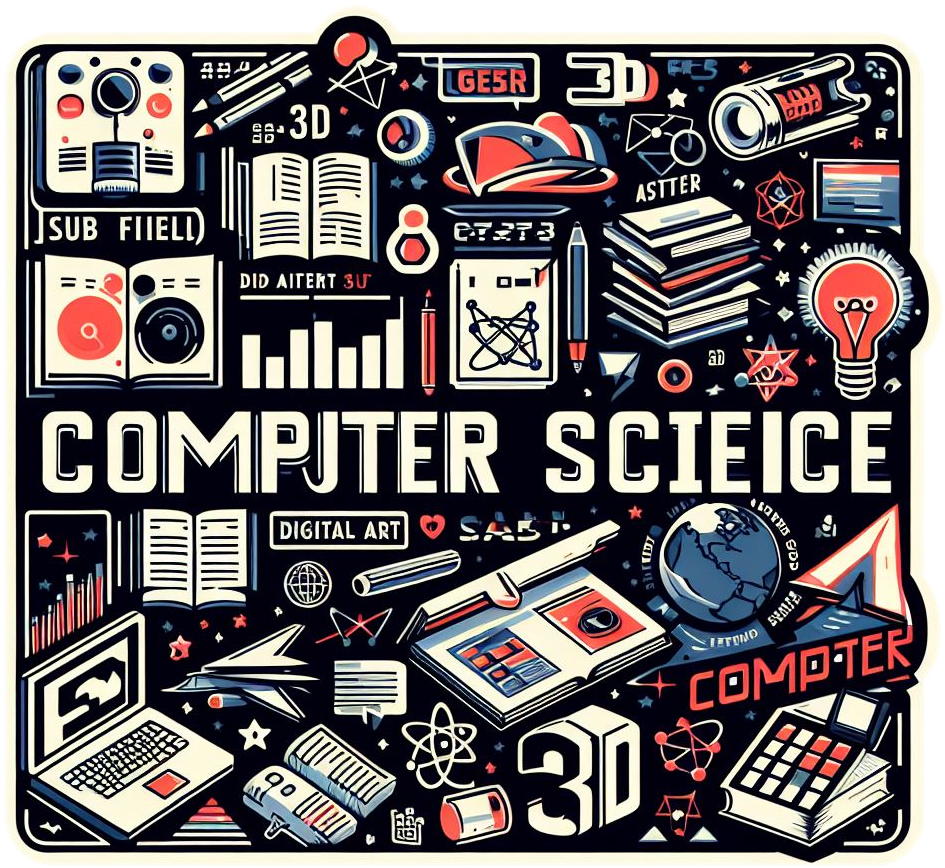
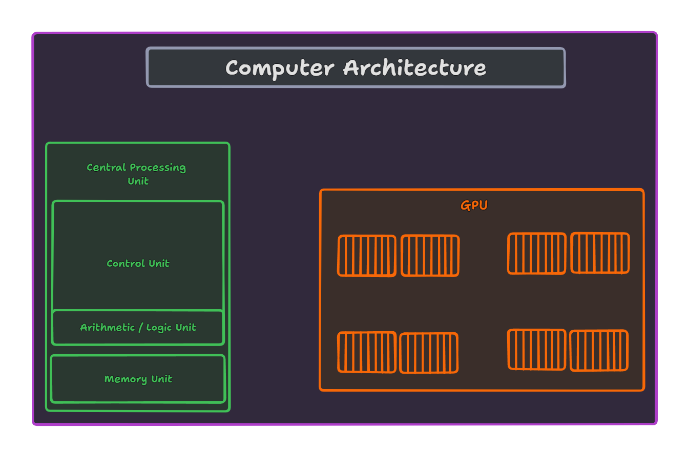

<h1 align="center" style="color: orange"> Computer Science </h1>

**Computer science** is a broad and interdisciplinary field that encompasses the study of computation, algorithms, data structures, programming languages, software engineering, artificial intelligence, computer architecture, and many other areas. It deals with the theory, design, implementation, and application of computer systems and software.

## Theoretical computer science

It is a branch of computer science that deals with the formal study of algorithms, computational models, and computational problems. *It focuses on understanding the fundamental principles underlying computation and exploring the theoretical limits of what can be computed efficiently.*

- **Theory of computation** : Studies the general properties of computation, including decidability, computability, and Turing completeness. It basically studies what problems can be solved algorithmically.

    - **Turing Machines**: Introduced by Alan Turing in the 1930s, Turing machines are abstract mathematical models of computation. They consist of a tape divided into cells, a head that can read and write symbols on the tape, and a set of states that determine the machine's behavior. Turing machines provide a formal way to describe algorithms and computable functions.

- **Computational complexity theory**: Studies the resources required to solve computational problems, such as time, space, and other resources. It classifies problems based on their inherent difficulty and explores the relationships between different classes of problems.

    - **Time and space complexity**: Measures the amount of time and space required to solve a problem as a function of the input size. It provides a way to compare the efficiency of different algorithms.

    - **Classes of problems**: Computational complexity theory classifies problems into various complexity classes based on their inherent difficulty. These classes include P, NP, NP-complete, NP-hard, and many others. 
        - **P (polynomial time)**: Problems that can be solved in polynomial time.
        
        - **NP (nondeterministic polynomial time)**: Problems for which a solution can be verified in polynomial time. *In other words, if someone claims to have a solution to an NP problem, we can quickly verify whether the solution is correct using polynomial time. However, finding the solution itself might be computationally difficult.* Eg. Boolean satisfiability problem (SAT), the traveling salesman problem (TSP), and the vertex cover problem.
        
        - **NP-complete**: The hardest problems in NP, to which all other problems in NP can be reduced in polynomial time. In simpler terms if a problem is NP-complete, it means that it is as hard as the hardest problems in NP. *If a polynomial-time algorithm exists for any NP-complete problem, then polynomial-time algorithms exist for all problems in NP, implying that P = NP.* 

        - **NP-hard**: Problems that are at least as hard as the hardest problems in NP. They may or may not be in NP.
    
    > In summary, P represents problems solvable in polynomial time, NP represents problems verifiable in polynomial time, NP-complete represents the hardest problems in NP, and NP-hard represents problems at least as hard as NP-complete problems.

- **Information theory**: Studies the properties of information and how it can be stored, measured, and communicated. It provides a mathematical framework for understanding the fundamental limits of data compression, error correction, and data transmission.

- **Cryptography**: Studies the techniques for secure communication and data protection. It involves the design and analysis of cryptographic algorithms and protocols to ensure the confidentiality, integrity, and authenticity of data. It is highly related to information theory.

- **Automata theory**: Studies abstract machines and computational models, such as finite automata, pushdown automata, and Turing machines. It provides a theoretical foundation for understanding the capabilities and limitations of computational systems.

- **Graph theory**: Studies the properties and applications of graphs, which are mathematical structures used to model pairwise relations between objects. It has applications in diverse fields such as computer networking, social network analysis, and operations research.

- **Logic**: Studies the principles of valid reasoning and inference. It provides the foundation for formal methods of verification and validation in computer science.

- **Computational geometry**: Studies algorithms and data structures for solving geometric problems, such as finding the closest pair of points, computing convex hulls, etc. It has applications in computer graphics, geographic information systems, and robotics.

- **Quantum computation**: Studies the use of quantum-mechanical phenomena, such as superposition and entanglement, to perform computation. It has the potential to solve certain problems more efficiently than classical computers.

- **Parallel programming**: Studies the techniques for developing programs that can execute multiple tasks simultaneously. It is essential for exploiting the full potential of modern multi-core and distributed computing systems.

- **Formal methods**: Studies the use of mathematical techniques for specifying, designing, and verifying software and hardware systems. It provides rigorous methods for ensuring the correctness and reliability of complex systems.

- **Data structures and algorithms**: Studies the design and analysis of efficient data structures and algorithms for solving computational problems. It is a fundamental area of study in computer science and is essential for writing efficient software. 

## Computer Engineering

It is the branch of computer science that deals with the design and construction of computer systems and hardware. A computer understands and processes information in the form of digital signals, which are represented as 0s and 1s. We use programming languages to write code, which is then translated into machine code (0s and 1s) that the computer can understand and execute.

High level overview of computer architecture would like this:

> **Note**: Only the processing units are shown. There are many other components like I/O devices, memory, etc. that are not shown in the diagram.

Computers store information in memory. Memory is divided into small units called cells. typically each holding 8 bits, known as a byte. While there's no physical left or right orientation within a computer, we often visualize memory cells as linear, with the high-order end on the left and the low-order end on the right. The high-order bit, or most significant bit, holds significant value in numerical interpretation, while the low-order bit, or least significant bit, holds less weight.

- Main memory, often termed random access memory (RAM), allows independent access to cells, unlike mass storage systems (hard disk, SSD, etc) that handle data in large blocks. Modern RAM technologies, such as Dynamic RAM (DRAM) or Synchronous DRAM (SDRAM), utilize techniques like refreshing to maintain data integrity. The following diagram illustrates the memory hierarchy in a typical computer system.

High level overview of the software and programming languages would look like this:

### Information representation and Boolean operations

Every computational device work by manipulating information. Information is represented in computers as 0s and 1s, known as bits. These bits can be used to represent numbers, letters, pictures, sounds, and more. The smallest unit of information is a bit, and a group of 8 bits is called a byte. A byte can represent 256 different values (2^8). A byte can also represent a single character in the ASCII character set. 

- Bits represented as 0s and 1s, signify false and true values. Boolean operations are used to manipulate bits, which are the building blocks of digital information.

- A gate is a device that generates the output of a Boolean operation based on its input values. In modern computers, gates are typically made as small electronic circuits where 0s and 1s are represented by different voltage levels. They serve as the fundamental components upon which computers are built.

- The most common gates are AND, OR, and NOT. These gates can be combined to create more complex operations. For example, an XOR gate outputs true if the number of true inputs is odd.
