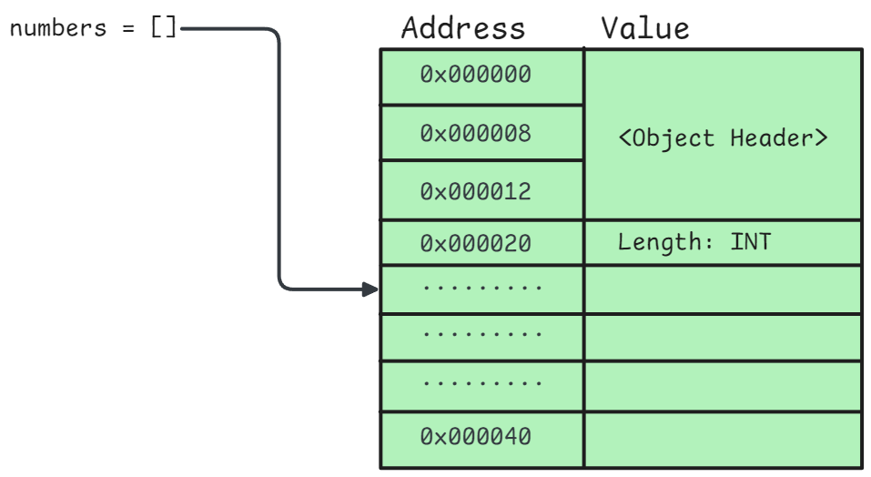

<h1 align="center" > Python Programming - I </h1>

**Python** is an **open-source**, **high-level** and **general-purpose** programming language. It is **dynamically type-checked** (type safety of a program is verified at runtime) and **garbage-collected**.

> Note: We are using Python 3

## Table of Contents

1. **Python Fundamentals**
    - [Python Syntax and Indentation](#Python-Syntax)
    - [Variables and Data types](#variables-and-data-types)
    - [Type conversion and Casting](#type-conversion-and-casting)
    - [Basic Input/Output](#basic-inputoutput)
    - [Operators](#operators)

2. **Control Flow**
    - [Conditional Statements](#conditional-statements)
    - [Looping](#loops)
    - [Loop control statements](#loop-control-statements)

3. **Functions**
    - [Defining and Calling functions](#defining-and-calling-functions)
    - [Key Points about Python Functions](#key-points-about-python-functions)
    - [Lambda functions](#lambda-functions)
    - [Scope and namespace](#scope-and-namespace)

4. **Python Memory Model and Variable Behavior**
    - [Variables and Object References](#variables-and-object-references)
    - [Memory Optimization and Object Reuse](#memory-optimization-and-object-reuse)
    - [Automatic Memory Management and Garbage Collection](#automatic-memory-management-and-garbage-collection)
    - [Python’s Argument Passing Model](#pythons-argument-passing-model)
    - [Boxing and Unboxing](#boxing-and-unboxing)
    - [Integer Caching Optimization](#integer-caching-optimization)
    - [Handling Large Integers (No Overflow!)](#handling-large-integers-no-overflow)
    - [Cython: Bypassing Python’s Overhead](#cython-bypassing-pythons-overhead)

4. **Built-in Data Structures**
    - [Strings](#string)
    - [Lists](#list)
    - [Tuples](#tuple) 
    - [Sets](#set)
    - [Dictionaries](#dictionary)

5. **File Handling**
    - [Common File Modes](#common-file-modes)
    - [Reading and Writing Text Files](#reading-and-writing-text-files)
    - [Working with Binary Files](#working-with-binary-files)
    - [Using Context Managers for file handling](#using-context-managers-with-open)
    - [Working with File Paths](#working-with-file-paths)
    - [File Iteration and Buffering](#file-iteration-and-buffering)
    - [Advanced File Operations](#advanced-file-operations)
    - [Performance Optimization](#performance-optimization)
    - [Exception Handling in File Operations](#exception-handling-in-file-operations)

6. **Error Handling**
    - [Error vs Exception](#errors-vs-exceptions)
    - [Types of Errors](#types-of-errors)
    -[Exception Handling](#basic-exception-handling-try-except-else-finally)
    -[Handling multiple exceptions](#handling-multiple-exceptions)
    -[Built-in exceptions](#common-built-in-exceptions)
    - [Nested and re-raised exceptions](#nested-and-re-raised-exceptions)
    - [Custom exceptions](#custom-exceptions)
    - [Exception chaining](#exception-chaining-from-keyword)
    - [Exception logging](#logging-exceptions)

7. **Modules and Packages**
    - [Modules](#modules)
    - [Importing modules](#importing-modules)
    - [Module search path](#module-search-path-syspath)
    - [Packages](#packages)
    - [Importing from packages](#importing-from-packages)
    - [Standard Library](#standard-library)
    
--- 

## Python Syntax

Python emphasizes code readability and relies on indentation to define code blocks instead of using braces `{}` like many other programming languages.

```python
print("Hello, World!")

if 5 > 2:
    print("Five is greater than two!")
```

We can write a single line comment using `#` and multi-line comments using triple quotes `'''` or `"""`.

```python
# This is a comment

'''
This is a multi-line comment
'''

"""
This is also a multi-line comment
"""
```

---

## Variables and Data types

Variables are containers for storing data values. Python is dynamically typed, meaning you don’t need to declare a variable’s type; it is determined automatically based on the value assigned.

```python
x = 5
y = "Hello, World!"
```

Python provides a variety of built-in data types, categorized as follows:

- **Text Type**: 
    - `str`

- **Numeric Types**: 
    - `int`
    - `float`
    - `complex`

- **Sequence Types**: 
    - `list`  (mutable sequence of items) 
    - `tuple` (immutable sequence of items)
    - `range` (sequence of numbers generated on demand)

- **Mapping Type**: 
    - `dict` (key-value pairs)

- **Set Types**: 
    - `set` (unordered collection of unique items)
    - `frozenset` (immutable version of `set`)

- **Boolean Type**: 
    - `bool` (represents `True` or `False`)

- **Binary Types**: 
    - `bytes`  (immutable sequence of bytes)
    - `bytearray` (mutable sequence of bytes)
    - `memoryview` (views over memory buffers)

- **None Type**:
    - `None` (represents the absence of a value)

---

## Type Conversion and Casting

Type conversion, also known as type casting, involves changing the data type of a value. In Python, this can occur implicitly or explicitly

### Implicit Type Conversion (Coercion)

Python automatically converts one data type to another without the programmer's intervention. This usually happens when performing operations between different data types, ensuring no data loss occurs. For instance, when adding an integer and a float, Python will convert the integer to a float before performing the addition.

```python
num_int = 123
num_float = 1.23
num_new = num_int + num_float
print("datatype of num_int:",type(num_int))
print("datatype of num_float:",type(num_float))
print("Value of num_new:",num_new)
print("datatype of num_new:",type(num_new))
```

### Explicit Type Conversion (Casting)

Programmers manually convert the data type using built-in functions. This is necessary when specific data types are required for certain operations or when data loss is acceptable.

- `int()`: Converts to an integer.

- `float()`: Converts to a floating-point number.

- `str()`: Converts to a string.

- `list()`, `tuple()`, `set()`: Converts to list, tuple and set, respectively.

```python
x = 5
y = float(x)
z = str(x)
```

### `type()` function

Python provides the `type()` function to check the type of an object.

```python
x = 5
print(type(x))
# Output: <class 'int'>
```

---

## Basic Input/Output

We can use the `input()` function to take user inputs and use `print()` function to display text, variables and expressions on the console. By default `input` function takes user input as string.

```py
name = input("Enter your name: ")
print("Hello ", name)

x, y, z = input("Enter the x-y-z coordinates: ").split()
```

> There are other ways to get input like `stdin` and `stdout` in `sys` module.

---

## Operators

Python provides a wide range of operators to perform various operations. These are categorized as follows:

### Arithmetic Operators

Used to perform basic mathematical operations.

| Operator | Description | Example | Output |
| --- | --- | --- | --- |
| `+` | Addition | 5 + 3 | 8 |
| `-` | Subtraction | 5 - 3 | 2 |
| `*` | Multiplication | 5 * 3 | 15 |
| `/` | Division | 10 / 2 | 5 |
| `%` | Modulus | 10 % 3 | 1 |
| `//` | Floor Division | 10 // 3 | 3 |
| `**` | Exponentiation | 5 ** 3 | 125 |

### Comparison (Relational) Operators

Used to compare values and return a Boolean (`True` or `False`).

| Operator | Description | Example | Output |
| --- | --- | --- | --- |
| `==` | Equal to | `5 == 3` | `False` |
| `!=` | Not Equal to | `5 != 3` | `True` |
| `>` | Greater Than | `5 > 3` | `True` |
| `<` | Less Than | `5 < 3` | `False` |
| `>=` | Greater Than or Equal To | `5 >= 3` | `True` |
| `<=` | Less Than or Equal To | `5 <= 3` | `False` |

### Assignment Operators

Used to assign values to variables and perform shorthand operations.

| Operator | Description | Example | Equivalent |
| --- | --- | --- | --- |
| `=` | Assign | `x = 5` | `x = 5` |
| `+=` | Add and Assign | `x += 3` | `x = x + 3` |
| `-=` | Subtract and Assign | `x -= 3` | `x = x - 3` |
| `*=` | Multiply and Assign | `x *= 3` | `x = x * 3` |
| `/=` | Divide and Assign | `x /= 3` | `x = x / 3` |
| `%=` | Modulus and Assign | `x %= 3` | `x = x % 3` |
| `//=` | Floor Division and Assign | `x //= 3` | `x = x // 3` |
| `**=` | Exponentiation and Assign | `x **= 3` | `x = x ** 3` |

### Logical Operators

Used to combine conditional statements.

| Operator | Description | Example | Output |
| --- | --- | --- | --- |
| `and` | Logical AND | `True and False` | `False` |
| `or` | Logical OR | `True or False` | `True` |
| `not` | Logical NOT | `not True` | `False` |

### Bitwise Operators

Operate on binary representations of integers.

| Operator | Description | Example | Output |
| --- | --- | --- | --- |
| `&` | Bitwise AND | `5 & 3` | `1` |
| `\|` | Bitwise OR | `5 \| 3` | `7` |
| `^` | Bitwise XOR | `5 ^ 3` | `6` |
| `~` | Bitwise NOT | `~5` | `-6` |
| `<<` | Left Shift | `5 << 1` | `10` |
| `>>` | Right Shift | `5 >> 1` | `2` |

- Bitwise XOR (`^`) operator returns true if the bits are different, otherwise returns false.

- Bitwise NOT operator flips the bits of the number. It can also change the sign of the number.

    - In most programming languages negative numbers are represented using the 2's complement system. To find the decimal value of a 2's complement binary number:
        * If the leading bit is zero; The number is positive and you can directly convert the binary to decimal.
        * If the leading bit is one; The number is negative. To find its magnitude:
            1. Invert all bits.
            2. Add one to the result.
            3. The decimal value is the negative of this result.

- Left shift operator shifts the bits to the left by the specified number of positions, filling the rightmost bits with zeros. Mathematically, this is equivalent to multiplying the number by 2 raised to the power of the number of positions shifted.

- Right shift operator shifts the bits to the right by the specified number of positions, discarding the rightmost bits. Mathematically, this is equivalent to dividing the number by 2 raised to the power of the number of positions shifted.

### Membership Operators

Used to check if a value is part of a sequence (e.g., string, list, tuple, etc.).

| Operator | Description | Example | Output |
| --- | --- | --- | --- |
| `in` | Present in | `5 in [1, 2, 3, 4, 5]` | `True` |
| `not in` | Not Present in | `5 not in [1, 2, 3, 4, 5]` | `False` |

### Identity Operators

Used to compare the memory locations of two objects.

| Operator | Description | Example | Output |
| --- | --- | --- | --- |
| `is` | Same Object | `x is y` | `True` |
| `is not` | Different Object | `x is not y` | `False` |

---

## Conditional Statements

Conditional statements in Python are used to execute specific blocks of code based on logical conditions. Python supports the following conditional statements:

### `if` statement

Executes a block of code if the condition evaluates to `True`.

```python
x = 10
if x > 5:
    print("x is greater than 5")
# Output: x is greater than 5
```

### `elif` Statement

Allows checking multiple conditions. It is short for "else if."

```python
x = 10
if x > 15:
    print("x is greater than 15")
elif x > 5:
    print("x is greater than 5 but less than or equal to 15")
# Output: x is greater than 5 but less than or equal to 15
```

### `else` Statement

Executes a block of code if none of the preceding conditions are `True`.

```python
x = 2
if x > 5:
    print("x is greater than 5")
else:
    print("x is 5 or less")
# Output: x is 5 or less
```

### Nested `if` Statement

Allows placing an if statement inside another if statement to check multiple conditions hierarchically.

```python
x = 10
if x > 5:
    if x % 2 == 0:
        print("x is greater than 5 and even")
    else:
        print("x is greater than 5 and odd")

# Output: x is greater than 5 and even
```

### Ternary Operator

```python
result = a if condition else b
```

> If condition is True, the value of `a` is assigned to result. Otherwise, the value of `b` is assigned.

```python
x = 10
y = 20
max_value = x if x > y else y
print(max_value)  # Output: 20
```

---

## Loops

Loops in Python are used to execute a block of code repeatedly as long as a condition is met or for each item in a sequence. Python supports the following loop constructs:

### while loops

A while loop runs as long as its condition evaluates to True.

````python
i = 1
while i <= 5:
    print(i)
    i += 1
# Output: 
# 1
# 2
# 3
# 4
# 5
````

### for loops

A `for` loop iterates over a sequence (like a list, tuple, string, or range).

````python
for i in range(1, 6):
    print(i)
# Output: 
# 1
# 2
# 3
# 4
# 5
````
## Loop control statements

We can use the `break` statement to stop the loop before it has looped through all the items, and the `continue` statement to stop the current iteration of the loop, and continue with the next.

Python loops also have something like $for → else$ and $while → else$ which is executed when the loop is finished without a `break` statement.

````python
# for else
for i in range(1, 6):
    if i == 7:
        break
else:
    print("Loop completed without a break")
# Output: Loop completed without a break

# while else
i = 1
while i <= 5:
    i += 1
    if i == 2:
        continue
    print(i)
else:
    print("Loop completed without a break")
# 3
# 4
# 5
# 6
# Loop completed without a break
````

- [Pattern Printing notebook](./Notebooks/Pattern_printing.ipynb)

---

## Functions

A function is a reusable block of code designed to perform a specific task. Functions allow modularity, code reuse, and better organization of programs. In Python, functions are defined using the `def` keyword.

### Defining and Calling functions

The syntax for defining a function:

````python
def function_name(parameters):
    # Function body
    return value

def greet(name):
    return f"Hello, {name}"
````

The syntax for calling a function is:

```py
function_name(arguments)

print(greet("Doe"))
```

> `Parameters` are what the function expects to receive (the variables listed inside the parentheses in the function definition). `Arguments` are what you actually give to the function (the actual values that are passed to the function when you call it).

```python
def add(a, b):  # 'a' and 'b' are parameters
    return a + b

print(add(5, 10))  # '5' and '10' are arguments
```

### Key Points about Python Functions

1. **Multiple Return Values**:

Python functions can return multiple values as a tuple.

````python
def calculate(a, b):
    return a + b, a - b

sum_result, diff_result = calculate(10, 5)
print(sum_result)  # Output: 15
print(diff_result) # Output: 5
````

2. **Default Parameters**:

Functions can have default values for parameters.

```python
def greet(name="Guest"):
    return f"Hello, {name}!"

print(greet())          # Output: Hello, Guest!
print(greet("Alice"))   # Output: Hello, Alice!
```

3. **Variable-length Arguments**:

- ***args**: Allows passing a variable number of positional arguments.

- ****kwargs**: Allows passing a variable number of keyword arguments.

```python
def sum_numbers(*args):
    return sum(args)

print(sum_numbers(1, 2, 3, 4))  # Output: 10

def display_info(**kwargs):
    for key, value in kwargs.items():
        print(f"{key}: {value}")

display_info(name="Alice", age=25)
# Output:
# name: Alice
# age: 25
```

4. **Stack and Heap Memory**:

Stack and Heap here refers to two memory allocation concepts. Stack is used for static memory allocation; for storing function calls and local variables, while heap is used for dynamic memory allocation; storing objects and data that persist beyond a single function call.

```py
def example_function(arg1, arg2, *args, kw_only_arg, **kwargs):
    print(f"arg1: {arg1}")
    print(f"arg2: {arg2}")
    print(f"args: {args}")
    print(f"kw_only_arg: {kw_only_arg}")
    print(f"kwargs: {kwargs}")

# Calling the function
example_function(1, 2, 3, 4, 5, kw_only_arg="hello", name="Alice", age=30)
```

### Lambda Functions

Lambda functions are small, anonymous functions defined using the `lambda` keyword. They are limited to a single expression and are often used for short-term tasks.

```python
lambda arguments: expression
```
- Lambda functions are particularly useful with higher-order functions like `map()`, `filter()`, and `reduce()`.

```python
nums = [1, 2, 3, 4]
squared = list(map(lambda x: x ** 2, nums))
print(squared)  # Output: [1, 4, 9, 16]
```

### Scope and Namespace

Namespace and scope are fundamental concepts in every programming languages. In python they govern how variables and names are organized and accessed within a program.

- A `namespace` is a system that ensures all names in a program are unique and avoids naming conflicts. It's a collection of names (identifiers) mapped to their corresponding objects. Namespaces are implemented as dictionaries in Python.

- `Scope` refers to the region of a program where a particular namespace is directly accessible. It determines the visibility and lifetime of names within that region.

**Python has several scopes**:

- **Local (Function)**: Variables defined inside a function have local scope. They are only accessible within that function.

- **Enclosing (Nonlocal)**: If a function is defined inside another function (nested function), the inner function can access variables from the outer function's scope. This is the enclosing scope.

- **Global (Module)**: Variables defined at the top level of a module (outside any function or class) have global scope. They can be accessed from anywhere within the module.

- **Built-in**: This scope contains pre-defined functions and constants that are always available in Python.

### LEGB Rule

When you refer to a name in your Python code, the interpreter searches for that name in a specific order through different scopes. This order is known as the LEGB rule:

- L: Local: Search the local scope first.

- E: Enclosing: If the name is not found locally, search the enclosing function's scope.

- G: Global: If not found in the enclosing scope, search the global scope.

- B: Built-in: Finally, if the name is not found in any of the previous scopes, search the built-in scope.

> If a name is not found in any of these scopes, Python raises a `NameError`.

### Global and Nonlocal

- **`global`**: Declares a variable inside a function as referring to the global scope.

- **`nonlocal`**: Used in nested functions to refer to variables in the enclosing (non-global) scope.

```python
x = 10  # global

def outer():
    y = 5  # enclosing
    def inner():
        nonlocal y
        global x
        y += 1
        x += 1
        print("Inner y:", y, "Global x:", x)
    inner()
    print("Outer y:", y)

outer()
print("Final x:", x)
```

[Function Notebook](./Notebooks/Functions.ipynb)

---

## Python Memory Model and Variable Behavior

In Python, everything is an **object** — from integers and strings to lists and functions. Variables act as **references** (**bindings**) to these objects, not as direct storage locations for data.

### Variables and Object References

When you assign a value to a variable, Python creates an object in memory and binds the variable name to it.

```py
n = 300
```

Here:

- An **integer object** with value **300** is created.

- The variable `n` references this object

Every Python object has a unique identifier, typically its memory address, which can be checked using `id()`.

```py
n = 300
print(id(n))
```

When you reassign a variable, it simply points to a new object.

```py
n = 300
n = "foo"
```

Now, `n` no longer refers to the integer `300`; it refers to the string "`foo`".

<p align="center"></p>

### Memory Optimization and Object Reuse

Python optimizes memory usage by reusing immutable objects with the same value.

```py
a = 10
b = 10
print(a is b)  # True (same object)
```

Both `a` and `b` reference the same integer object in memory.

- Always use `is` to compare **object identity** (same object in memory), and `==` for **value equality**.

<p align="center"></p>

---

### Automatic Memory Management and Garbage Collection

Python’s memory manager handles:

1. **Object allocation** on the heap

1. **Reference counting**

1. **Garbage collection** for unreferenced objects

Each object keeps track of how many variables reference it. When the reference count drops to zero, Python automatically frees that memory. You can manually delete a reference using `del`:

```py
x = [1, 2, 3]
del x  # reduces reference count
```

Garbage collection is handled by Python’s built-in **gc module**, which also removes cyclic references (e.g., objects referencing each other).

- Understand reference counting is crucial for debugging memory leaks

- Use tools like `sys.getrefcount()` and the gc module to analyze **memory usage**.

---

### Python’s Argument Passing Model

A common confusion in Python:

> “Is Python **pass-by-value** or **pass-by-reference**?”

The answer is **neither**.

Python uses **Parameter passing mechanism** or (**Pass by Object Reference** (or **Pass by Assignment**)).

This means:

- The function receives a reference to the object, not the object itself.

- The behavior depends on mutability of the object.

#### Immutable Objects (Pass-by-Value-like Behavior)

When you pass an immutable object (int, str, tuple), reassigning it inside a function creates a new object.

```py
def modify_value(x):
    x += 10
    print("Inside function:", x)

a = 5
modify_value(a)
print("Outside function:", a)

# Inside function: 15
# Outside function: 5
```

- The original variable `a` remains unchanged.

#### Mutable Objects (Pass-by-Reference-like Behavior)

When you pass a **mutable object** (list, dict, set), modifications inside the function affect the original.

```py
def modify_list(lst):
    lst.append(10)
    print("Inside function:", lst)

nums = [1, 2, 3]
modify_list(nums)
print("Outside function:", nums)

# Inside function: [1, 2, 3, 10]
# Outside function: [1, 2, 3, 10]
```

- The function directly modifies the list object referenced by `nums`.

---

### Boxing and Unboxing

Since everything in Python is an object, even primitive-looking types (like `int` and `float`) are actually **boxed objects**.

- **Boxing** : Wrapping a raw value inside an object

- **Unboxing** : Extracting the underlying value from an object for operations

```py
a = 10
b = 20
c = a + b
```

Behind the scenes:

1. Python verifies the operand types (`int`).

1. Calls the appropriate magic method (`__add__`).

1. Unboxes the integer values (`10`, `20`).

1. Performs the addition.

1. Boxes the result (`30`) back into a new integer object.

Although flexible, this process adds overhead, making Python slower than low-level languages like **C**.

---

### Integer Caching Optimization

For performance, Python preallocates and caches small integers in the range [**-5, 256**].

```py
a = 100
b = 100
print(a is b)  # True (cached)

x = 1000
y = 1000
print(x is y)  # False (new objects)
```

This optimization reduces object creation overhead, as these values are frequently used in most programs.

---

### Handling Large Integers (No Overflow!)

Unlike many languages, Python’s integers are arbitrary-precision. They can grow as large as memory allows — no overflow errors.

```py
huge = 10**100
print(huge)
```

Internally, Python dynamically allocates additional memory to store large numbers, using a variable-length representation.

---

### Cython: Bypassing Python’s Overhead

**Cython** is an *optimizing static compiler* that allows users to write `C` extensions for Python. It is a superset of the Python language, meaning it includes all Python functionality and adds the ability to integrate C-level features.

```py
cpdef int add(int x, int y):
    cdef int result
    result = x + y
    return result
```

By declaring types, **Cython** avoids Python’s dynamic type checks and boxing/unboxing overhead, leading to **significant performance gains**.

---

## Built-in Data Structures

### String

A string is an immutable sequence of Unicode characters enclosed in single quotes (`'`), double quotes (`"`), or triple quotes (`''' """`). 

- Strings are immutable (cannot be modified once created). Any operation that alters a string creates a new string object.

- Strings are ordered, indexed (starting at `0` and also support negative indexing), iterable and can contain duplicate elements.

- Strings can be sliced (`[start : stop : step]`) and supports membership operations.

#### String Operations

- Concatenation: `+` operator

- Repetition: `*` operator

- Membership Testing: `in`, `not in`

- Comparison: Lexicographic (based on Unicode code points)

```py
a, b = "Hello", "World"
print(a + " " + b)   # Hello World
print(a * 3)         # HelloHelloHello
print("H" in a)      # True
print("hello" < "world")  # True (lexicographic order)
```

#### Common String Methods

1. **Case Conversion** 
    - `.upper()`, `.lower()`, `.capitalize()`, `.title()`, `.swapcase()`

2. **Searching and Checking**
    - `.find()`, `.rfind()`, `.index()`, `.startswith()`, `.endswith()`

    - `.count()`, `.isalnum()`, `.isalpha()`, `.isdigit()`, `.isspace()`, `.istitle()`

3. **Modification**
    - `.replace()`, `.strip()`, `.lstrip()`, `.rstrip()`

    - `.center()`, `.ljust()`, `.rjust()`

    - `.zfill()`

4. **Splitting and Joining**
    - `.split()`, `.rsplit()`, `.splitlines()`

    - `.join(iterable)`

5. **Unicode Encodings**
    - `ord(char)` → Returns Unicode code point of a character

    - `chr(code)` → Returns character for a Unicode code point

    - `encode()` → Converts string to bytes

    - `decode()` → Converts bytes to string

    ```py
    print(ord("A"))     # 65
    print(chr(65))      # A

    s = "Python 🐍"
    encoded = s.encode("utf-8")
    decoded = encoded.decode("utf-8")
    print(encoded)  # b'Python \xf0\x9f\x90\x8d'
    print(decoded)  # Python 🐍
    ```

#### f-Strings

> Python 3.6+

Efficient and easier way to do string formatting.

```py
print(f"Name: {name}, Age: {age}")
print(f"Next year: {age + 1}")
```

#### Performance Considerations

- String concatenation with `+` inside loops is inefficient (creates new objects each time). Use `str.join()` or `io.StringIO` instead.

```py
# Inefficient
res = ""
for i in range(1000):
    res += str(i)

# Efficient
res = "".join(str(i) for i in range(1000))
```

- Time complexity of string operations
    - Indexing : $O(1)$
    - Slicing : $O(k)$ where `k` is the length of the slice
    - Concatenation : $O(n)$ for strings of length `n`

- Python caches small strings, commonly short identifiers, called string interning.

```py
a = "hello"
b = "hello"
print(a is b)  # True (due to interning)

a = "Strings in Python are powerful and versatile."
b = "Strings in Python are powerful and versatile."
print(a is b)  # False
```

- **[String Notebook](./Notebooks/String.ipynb)**

---

### List

Python lists are **ordered, mutable collections** of objects. They can store heterogenous types.

- Lists are indexed, dynamic and allows duplicate elements. 

- Defined using square brackets `[]` or the `list()` constructor.



```python
nums = [1, 2, 3, 4]
mixed = [1, "hello", 3.14, [5, 6]]

print(nums[0])     # 1
print(nums[-1])    # 4
print(nums[1:3])   # [2, 3]
```

**Array Internal Representation**


#### List Operations

- Concatenation: `+`

- Repetition: `*`

- Membership Testing: `in`, `not in`

- Unpacking: Direct assignment of elements

```py
a = [1, 2, 3]
b = [4, 5]
print(a + b)     # [1, 2, 3, 4, 5]
print(a * 2)     # [1, 2, 3, 1, 2, 3]

x, y, z = a
print(x, y, z)   # 1 2 3
```

#### Common List Methods

- **Adding / Removing Elements**

    - `.append(x)` → Add element at end

    - `.extend(iterable)` → Add all elements from iterable

    - `.insert(i, x)` → Insert at position i

    - `.remove(x)` → Remove first occurrence

    - `.pop([i])` → Remove and return element at index i (last by default)

    - `.clear()`→ Remove all elements

- **Searching and Counting**

    - `.index(x, [start], [end])` → Find index of first occurrence

    - `.count(x)` → Count occurrences

- **Sorting and Reversing**

    - `.sort(key=None, reverse=False)` → In-place sort

    - `sorted(iterable, key=None, reverse=False)` → Returns a new sorted list

    - `.reverse()` → Reverse in-place

    - `reversed(list)` → Returns an iterator

- **Copying**

    - `.copy()` or `[:]` or `list()` : Shallow copy (It creates a new list container but simply copies the references to the items within the original list. Both lists therefore point to the same internal objects.) Therefore modifying a mutable object within the shallow-copied list will also change the original list

    - `copy.deepcopy()` : A deep copy creates a completely independent new list. It recursively duplicates all objects it encounters, from the list itself to all the objects contained within it, and all the objects within those objects, and so on. Changes made to the deep-copied list will not affect the original list, and vice versa.

    ```py
    import copy
    a = [[1, 2], [3, 4]]
    b = a.copy()
    c = copy.deepcopy(a)

    a[0][0] = 99
    print(b)  # [[99, 2], [3, 4]]  (affected)
    print(c)  # [[1, 2], [3, 4]]   (independent)
    ```

#### List comprehension

```py
squares = [x**2 for x in range(5)]
print(squares)  # [0, 1, 4, 9, 16]

evens = [x for x in range(10) if x % 2 == 0]
print(evens)    # [0, 2, 4, 6, 8]
```

#### Nested List

```py
matrix = [[1, 2], [3, 4], [5, 6]]
print(matrix[1][0])  # 3
```

#### Useful functions with lists

- `enumerate(list)` → Returns index + value pairs

- `zip(list1, list2)` → Combines lists element-wise

- `*args` unpacking in function calls

#### Performance considerations

Lists are implemented as dynamic arrays in CPython. Common time complexities are;

| Operation                     | Complexity                      |
| ----------------------------- | ------------------------------- |
| Indexing                      | `O(1)`                          |
| Append                        | `O(1)` (amortized)              |
| Pop (end)                     | `O(1)`                          |
| Insert / Pop (anywhere else)  | `O(n)`                          |
| Membership test (`x in list`) | `O(n)`                          |
| Slicing                       | `O(k)` where `k` = slice length |
| Sort                          | `O(n log n)`                    |

- For large numeric arrays, prefer `array.array` or `numpy.ndarray` for efficiency.

- **[List Notebook](./Notebooks/List.ipynb)**

---

### Tuple

Tuples are an immutable, ordered sequence type in Python. They are widely used for grouping related data, ensuring data integrity, and improving performance when immutability is desirable.

- They can be defined using parenthesis (**(** **)**) or built-in **tuple()** constructor.

- They allow duplicate elements and can store heterogenous data types.

```py
# Creating tuples
t1 = (1, 2, 3)
t2 = ("apple", "banana", "cherry")
t3 = (1, "hello", 3.14, True)

# Single element tuple (needs trailing comma!)
t_single = (5,)  # not (5)
```

#### Tuple Operations

- Indexing and slicing are same as lists

```py
t = (10, 20, 30, 40, 50)
print(t[0])    # 10
print(t[-1])   # 50
print(t[1:4])  # (20, 30, 40)
```

- Concatenation and repetition

```py
a = (1, 2)
b = (3, 4)
print(a + b)   # (1, 2, 3, 4)
print(a * 3)   # (1, 2, 1, 2, 1, 2)
```

- Membership test

```py
print(2 in a)   # True
print(5 not in b)  # True
```

#### Tuple methods

- Tuples support only two built-in methods (since they are immutable):
    1. `.count(value)` : Returns occurrences of a value
    2. `.index(value)` : Returns first index of the value

    ```py
    t = (1, 2, 2, 3, 4)
    print(t.count(2))   # 2
    print(t.index(3))   # 3
    ```

#### Packing and Unpacking

- **Tuple Packing**: Assign multiple values at once.

- **Tuple Unpacking**: Extract values into variables.

```py
# Packing
point = (3, 4)

# Unpacking
x, y = point
print(x, y)  # 3 4

# Extended unpacking
a, *b, c = (1, 2, 3, 4, 5)
print(a, b, c)  # 1 [2, 3, 4] 5
```

#### Tuple immutability in detail

Tuples can contain other tuples or even mutable objects. Therefore the tuples itself are immutable, but if they hold mutable object, that object can still be changed. If a given tuple only contains immutable data, they would be hashable and hence can be used as dictionary keys.

```py
coords = {}
coords[(10, 20)] = "A"
coords[(15, 25)] = "B"
print(coords)  # {(10, 20): 'A', (15, 25): 'B'}
```

#### Named Tuples (Collections)

`Collections` module provide a factory function called `namedtuple`, that creates tuple subclasses with named fields. It offers a way to combine the *immutability* and *memory efficiency* of regular tuples with enhanced readability of accessing elements by name instead of numerical index.

```py
from collections import namedtuple

# Define a named tuple type for a Point
Point = namedtuple('Point', ['x', 'y'])

# Create an instance of the Point named tuple
p = Point(10, 20)

# Access elements by name
print(f"X coordinate: {p.x}")
print(f"Y coordinate: {p.y}")

# Access elements by index (still works)
print(f"First element by index: {p[0]}")
```

#### Performance notes

- **Memory efficient** : Tuples uses less memory than lists

- **Faster Iteration** : Due to their immutability, Python can optimize their usage.

- **Tuple Interning** : Small immutable tuples may be cached by python, similar to *string interning*

- **[Tuple Notebook](./Notebooks/Tuple.ipynb)**

---

### Set

A set is an unordered, mutable, and un-indexed collection of unique elements in Python. Sets are useful for membership testing, removing duplicates, and performing mathematical set operations and allows faster insertion, deletion and searching. They are implemented using hash tables.

- Elements of set must be hashable (immutable).

```py
# Creating sets
s1 = {1, 2, 3, 4}
s2 = set([3, 4, 5, 6])  # converting list to set

print(s1)   # {1, 2, 3, 4}
print(s2)   # {3, 4, 5, 6}

# Empty set
empty = set()   # not {}
```

#### Set Operations

- **Membership Test** (Very fast, O(1) average time)

```py
s = {10, 20, 30}
print(10 in s)   # True
print(40 not in s)  # True
```

- **Union**

```py
a = {1, 2, 3}
b = {3, 4, 5}
print(a | b)       # {1, 2, 3, 4, 5}
print(a.union(b))  # {1, 2, 3, 4, 5}
```

- **Intersection**

```py
print(a & b)                # {3}
print(a.intersection(b))    # {3}
```

- **Difference**

```py
print(a - b)  # {1, 2}
print(b - a)  # {4, 5}
```

- Symmetric Difference

```py
print(a ^ b)  # {1, 2, 4, 5}
```

#### Set Methods

- **Adding / Removing elements**

```py
s = {1, 2}
s.add(3)         # {1, 2, 3}
s.update([4, 5]) # {1, 2, 3, 4, 5}

s.remove(2)      # removes element, raises KeyError if not present
s.discard(10)    # safe remove (no error if not found)
s.pop()          # removes a random element
s.clear()        # empties the set
```

- **Copy**

```py
s1 = {1, 2, 3}
s2 = s1.copy()
```

#### Frozen set (Immutable set)

It is the immutable version of set. Since frozen set itself is hashable, it can be used as dictionary keys or elements of another set.

```py
fs = frozenset([1, 2, 3])
print(fs)          # frozenset({1, 2, 3})
# fs.add(4)           # Error: 'frozenset' object has no attribute 'add'
```

#### Advanced usage

- **Set Comprehension**

```py
s = {x**2 for x in range(5)}
print(s)  # {0, 1, 4, 9, 16, 25}
```

- **Subset / Superset checks**

```py
a = {1, 2}
b = {1, 2, 3}
print(a.issubset(b))    # True
print(b.issuperset(a))  # True
```

- Suitable for **large-scale lookups** and **deduplication**.

- Sets are extremely helpful in situations like doing a membership test for blacklist/whitelist or deduplicating user ID's/logs. 

- We use sets for tracking visited nodes in graph algorithms.

- **[Set Notebook](./Notebooks/Set.ipynb)**

---

### Dictionary

A dictionary is an *unordered* (From Python 3.7 onwards, Dictionaries are officially insertion ordered), **mutable**, and **key-value pair** data structure in Python. It allows for fast lookups, insertions, and deletions, with average O(1) time complexity.

- Defined using curly braces `{}` or the `dict()` constructor.

- Keys must be unique and immutable (e.g., strings, numbers, tuples).

- Values can be any object (mutable or immutable).

```py
# Creating dictionaries
person = {"name": "Alice", "age": 25, "city": "London"}

# Using dict() constructor
info = dict(language="Python", version=3.12)

# Empty dictionary
empty = {}
```

#### Accessing and Modifying Values

```py
person = {"name": "Alice", "age": 25, "city": "London"}

# Accessing values
print(person["name"])       # Alice
print(person.get("age"))    # 25
print(person.get("salary", "Not Found"))  # Default value

# Modifying values
person["age"] = 26
person["country"] = "UK"   # Adding new key-value pair
print(person)
```

- `get()` is preferred for safe access to avoid KeyError.

#### Dictionary Operations

- **Membership tests**

```py
print("name" in person)      # True
print("Alice" in person)     # False
```

- **Deleting entries**

```py
del person["city"]        # Removes key
removed = person.pop("age")   # Removes key and returns its value
person.clear()             # Empties dictionary
```

#### Dictionary methods

| Method                      | Description                                   | Example                        |
| --------------------------- | --------------------------------------------- | ------------------------------ |
| `.keys()`                   | Returns view of keys                          | `dict.keys()`                  |
| `.values()`                 | Returns view of values                        | `dict.values()`                |
| `.items()`                  | Returns key-value pairs as tuples             | `dict.items()`                 |
| `.update(other)`            | Merges another dictionary                     | `d1.update(d2)`                |
| `.popitem()`                | Removes and returns last inserted pair        | `d.popitem()`                  |
| `.copy()`                   | Returns a shallow copy                        | `d2 = d.copy()`                |
| `.setdefault(key, default)` | Inserts key with default value if not present | `d.setdefault('role', 'user')` |

```py
student = {"name": "Bob", "grade": "A"}

# Using items()
for key, value in student.items():
    print(f"{key}: {value}")
```

#### Dictionary Comprehensions

It is similar to list comprehension, but produce key-value pairs.

```py
squares = {x: x**2 for x in range(5)}
print(squares)  # {0: 0, 1: 1, 2: 4, 3: 9, 4: 16}

# filtering example 
nums = {x: x**2 for x in range(10) if x % 2 == 0}
print(nums)  # {0: 0, 2: 4, 4: 16, 6: 36, 8: 64}
```

#### Nested Dictionaries

Dictionaries can hold other dictionaries as values, allowing for hierarchical data representation.

```py
employees = {
    "E001": {"name": "Alice", "dept": "HR"},
    "E002": {"name": "Bob", "dept": "IT"}
}

print(employees["E002"]["name"])  # Bob
```

#### Merging Dictionaries (Python 3.9+)

```py
d1 = {"a": 1, "b": 2}
d2 = {"b": 3, "c": 4}
merged = d1 | d2   # {'a': 1, 'b': 3, 'c': 4}
```

#### Dictionary Unpacking

```py
d3 = {**d1, **d2}
```

#### Defaultdict (from collections)

```py
from collections import defaultdict

grades = defaultdict(list)
grades["Alice"].append(90)
grades["Bob"].append(85)
print(grades)  # defaultdict(<class 'list'>, {'Alice': [90], 'Bob': [85]})
```

- Dictionaries are implemented using hash tables, average complexity is $O(1)$ for lookup, insertion and deletion and $O(n)$ for iteration.

- **[Dictionary Notebook](./Notebooks/Dictionary.ipynb)**

---

## File Handling

File handling allows Python programs to interact with files stored on disk — reading, writing, and manipulating data persistently.

In Python, files are opened using the built-in `open()` function:

```python
file = open("example.txt", "r")  # 'r' = read mode
content = file.read()
print(content)
file.close()
```

### Common File Modes

| Mode   | Description        | Notes                                  |
| ------ | ------------------ | -------------------------------------- |
| `'r'`  | Read (default)     | File must exist                        |
| `'w'`  | Write              | Overwrites existing content            |
| `'a'`  | Append             | Adds new data at the end               |
| `'x'`  | Exclusive creation | Fails if file exists                   |
| `'r+'` | Read and write     | File must exist                        |
| `'w+'` | Write and read     | Overwrites file                        |
| `'a+'` | Append and read    | Creates file if missing                |
| `'b'`  | Binary mode        | Used with other modes (`'rb'`, `'wb'`) |

### Reading and Writing Text Files

- **Reading a File**

```py
with open("notes.txt", "r") as f:
    data = f.read()  # Reads entire file
    print(data)

# other read methods
f.readline()   # Reads one line
f.readlines()  # Reads all lines as a list
```

- **Writing to a file**

```py
with open("output.txt", "w") as f:
    f.write("Hello, World!\n")
    f.write("This overwrites existing content.")
```

- **Appending to a file**

```py
with open("output.txt", "a") as f:
    f.write("\nNew line appended.")
```

### Working with Binary Files

Binary files (e.g., images, audio, executables) require reading/writing in binary mode ('`b`').

```py
# Copying an image file
with open("photo.jpg", "rb") as src:
    data = src.read()

with open("photo_copy.jpg", "wb") as dest:
    dest.write(data)
```

- Python does not interpret binary data — it simply reads and writes bytes (`b'\x...'`).

### Using Context Managers (`with open(...)`)

Using `with` ensures that files are automatically closed after the code block is executed, even if an exception occurs.

> **Context managers** in Python are objects that define a runtime context for use with the `with` statement. They provide a mechanism for **automatically managing resources**, ensuring that setup and cleanup operations are performed correctly, even if errors occur within the code block. Once we cover OOP, we will come back to Context managers in depth.


### Working with File Paths

Python provides two main modules for handling file paths:

- **Using `os` module**

```py
import os

print(os.getcwd())           # Get current directory
print(os.listdir("."))       # List files
print(os.path.exists("file.txt"))  # Check if file exists
print(os.path.join("folder", "file.txt"))  # Join paths safely
```

- **Using `pathlib` (Modern Way)**

```py
from pathlib import Path

p = Path("example.txt")
if p.exists():
    print(p.read_text())   # Directly read file content
p.write_text("This is new text")  # Write to file

# Directory operations
folder = Path("data")
folder.mkdir(exist_ok=True)
```

- `pathlib` is **object-oriented**, more readable, and recommended for new Python code.

### File Iteration and Buffering

When working with large files, reading the entire content into memory (`read()`) is inefficient.

- **Line-by-line Iteration**

```py
with open("bigfile.txt", "r") as f:
    for line in f:
        print(line.strip())
```

- This approach reads one line at a time, conserving memory.

- **Buffered Reading (Binary Data)**

```py
with open("video.mp4", "rb") as f:
    chunk_size = 4096
    while chunk := f.read(chunk_size):
        process(chunk)
```

- This pattern is common in **data streaming** or **network applications**.

### Advanced File Operations

- **File Positioning**

You can control the read/write pointer using `seek()` and `tell()`:

```py
f = open("sample.txt", "r")
print(f.tell())      # Current position
f.seek(0)            # Move to start
print(f.readline())  # Read first line
f.close()
```

- **File Metadata**

```py
import os
info = os.stat("sample.txt")
print(f"Size: {info.st_size} bytes")
print(f"Modified: {info.st_mtime}")
```

- **File Deletion and Renaming**

```py
import os
os.rename("old.txt", "new.txt")
os.remove("new.txt")
```

### Performance Optimization

- Use **Buffered I/O** (`io.BufferedReader`, `io.BufferedWriter`) for large data streams.

- Prefer **context managers** over manual `open()`/`close()` for safety.

- Avoid frequent small writes — instead, accumulate data and write in chunks.

- Use binary mode for non-text data to prevent encoding overhead.

- Use memory mapping (`mmap`) for high-speed file access:

```py
import mmap

with open("largefile.txt", "r+") as f:
    with mmap.mmap(f.fileno(), 0) as mm:
        print(mm.readline().decode())
```

- Memory mapping treats file content as a **byte array** in memory — ideal for large file manipulation.

### Exception Handling in File Operations

Always handle exceptions — file operations are prone to runtime errors (missing file, permissions, I/O failures).

```py
try:
    with open("config.yaml", "r") as file:
        data = file.read()
except FileNotFoundError:
    print("File not found.")
except PermissionError:
    print("Permission denied.")
except Exception as e:
    print(f"Unexpected error: {e}")
```

- **[File Handling Notebook](./Notebooks/File_Handling_in_Python.ipynb)**

---

## Error Handling

Error handling in Python allows developers to gracefully detect, respond to, and recover from unexpected events that occur during program execution.

### Errors vs Exceptions

- An **error** is an issue in a program that causes abnormal termination. 

- An **exception** is a special event raised during execution when an error occurs. We can **catch** and **handle** these exceptions dynamically.

### Types of Errors

| Type | Description | Example |
|------|--------------|----------|
| **Syntax Errors** | Detected during parsing (before execution). | `if True print("Hi")` |
| **Runtime Errors (Exceptions)** | Detected during execution; can be caught and handled. | `1 / 0` (ZeroDivisionError) |

### Basic Exception Handling (`try`, `except`, `else`, `finally`)

The `try` statement allows testing a block of code for errors, while `except` handles them.

```python
try:
    x = int(input("Enter a number: "))
    result = 10 / x
except ZeroDivisionError:
    print("❌ Cannot divide by zero.")
except ValueError:
    print("❌ Please enter a valid number.")
else:
    print("✅ Division successful:", result)
finally:
    print("🧹 Execution completed.")
```

- `try` : code that might raise an exception
- `exception` : Code that runs if an exception occurs
- `else` : Code that runs only if no exception occurs
- `finally` : Code that always runs (cleanup, closing files, releasing resources)

### Handling Multiple Exceptions

We can catch multiple exceptions in one block using a tuple:

```py
try:
    val = int("abc")
except (ValueError, TypeError) as e:
    print(f"Error occurred: {e}")
```

### Common Built-in Exceptions

| Exception           | Description                                                                          |
| ------------------- | ------------------------------------------------------------------------------------ |
| **ValueError**        | Raised when an operation receives an argument of right type but inappropriate value. |
| **TypeError**         | Raised when an operation or function is applied to an object of inappropriate type.  |
| **KeyError**          | Raised when a dictionary key is not found.                                           |
| **IndexError**        | Raised when accessing an invalid list or tuple index.                                |
| **ZeroDivisionError** | Raised when dividing by zero.                                                        |
| **FileNotFoundError** | Raised when a file or directory is missing.                                          |
| **AttributeError**    | Raised when an invalid attribute reference occurs.                                   |
| **ImportError**       | Raised when an import fails.                                                         |
| **RuntimeError**      | Raised for generic runtime errors.                                                   |
| **ArithmeticError** | Raised when an error occurs in numeric calculations |
| **AssertionError** | Raised when an `assert` statement fails |
| **Exception** | Base class for all exceptions |
| **EOFError** | Raised when the `input()` method hits an "end of file" condition (EOF) |
| **FloatingPointError** | Raised when a floating-point calculation fails |
| **GeneratorExit** | Raised when a generator is closed (with the `close()` method) |
| **IndentationError** | Raised when indentation is not correct |
| **KeyboardInterrupt** | Raised when the user presses Ctrl+c, Ctrl+z or Delete |
| **LookupError** | Raised when errors raised can't be found |
| **MemoryError** | Raised when a program runs out of memory |
| **NameError** | Raised when a variable does not exist |
| **NotImplementedError** | Raised when an abstract method requires an inherited class to override the method |
| **OSError** | Raised when a system related operation causes an error |
| **OverflowError** | Raised when the result of a numeric calculation is too large |
| **ReferenceError** | Raised when a weak reference object does not exist |
| **StopIteration** | Raised when the `next()` method of an iterator has no further values |
| **SyntaxError** | Raised when a syntax error occurs |
| **TabError** | Raised when indentation consists of tabs or spaces |
| **SystemError** | Raised when a system error occurs |
| **SystemExit** | Raised when the `sys.exit()` function is called |
| **UnboundLocalError** | Raised when a local variable is referenced before assignment |
| **UnicodeError** | Raised when a unicode problem occurs |
| **UnicodeEncodeError** | Raised when a unicode encoding problem occurs |
| **UnicodeDecodeError** | Raised when a unicode decoding problem occurs |
| **UnicodeTranslateError** | Raised when a unicode translation problem occurs |

### Nested and Re-raised Exceptions

You can handle exceptions at multiple levels or re-raise them for higher-level handling.


```py
def divide(a, b):
    try:
        return a / b
    except ZeroDivisionError as e:
        print("Caught inside function:", e)
        raise  # Re-raise exception

try:
    divide(10, 0)
except ZeroDivisionError:
    print("Handled again at caller level.")
```

### Custom Exceptions

Custom exceptions are user-defined classes derived from Python’s `Exception` base class.

```py
class NegativeValueError(Exception):
    """Raised when input is negative."""
    pass

def square_root(x):
    if x < 0:
        raise NegativeValueError("Negative value not allowed.")
    return x ** 0.5

try:
    print(square_root(-9))
except NegativeValueError as e:
    print(f"Custom Exception: {e}")
```

- Always inherit from `Exception`, not from `BaseException`, to avoid interfering with system-level exceptions like `KeyboardInterrupt`.

### Exception Chaining (from Keyword)

Python allows linking related exceptions using `raise ...` `from ....`

```py
try:
    int("abc")
except ValueError as e:
    raise RuntimeError("Conversion failed.") from e
```

- This helps preserve traceback context across multiple layers of failure.

### Cleanup and Resource Management

Use the `finally` block or **context managers** (`with` statement) for safe cleanup.

```py
try:
    f = open("data.txt")
    data = f.read()
finally:
    f.close()  # Ensures closure even on exception

# Pythonic code 
with open("data.txt") as f:
    data = f.read()
```

- `with` automatically closes the resource using `__enter__` and `__exit__` methods, ensuring no resource leaks.

### Logging Exceptions

Instead of printing, log exceptions.

```py
import logging

logging.basicConfig(level=logging.ERROR)

try:
    1 / 0
except ZeroDivisionError as e:
    logging.exception("An error occurred")
```

- This records stack traces with timestamps — crucial for debugging in deployed systems.

### Performance and Memory Insights

| Aspect                    | Details                                                                            |
| ------------------------- | ---------------------------------------------------------------------------------- |
| **Raising Exceptions**    | Slightly expensive due to stack unwinding; avoid in performance-critical loops.    |
| **Control Flow**          | Don’t use exceptions for regular control logic — prefer condition checks.          |
| **Garbage Collection**    | Exception tracebacks hold references to frames; large exception logs can delay GC. |
| **Optimized Alternative** | For repeated validation, use `if` checks instead of raising exceptions repeatedly. |

- Use `try` blocks only around risky code segments, not entire functions.
- When debugging, inspect the exception object with `repr(e)` or `traceback` module.
- Use contextlib.suppress to ignore specific exceptions intentionally:

```py
from contextlib import suppress

with suppress(FileNotFoundError):
    os.remove("nonexistent.txt")
```

- **[Error Handling Notebook]()**
<!-- TODO: Update error handling notebook -->

---

## Modules and Packages

Python’s modular architecture allows code to be divided into **modules** (single files) and **packages** (collections of modules). This promotes reusability, organization, and maintainability.

### Modules

A **module** is simply a Python file (`.py`) containing variables, functions, or classes that can be imported into other programs.

```py
# math_utils.py
def add(a, b):
    return a + b

def multiply(a, b):
    return a * b
```

```py
import math_utils

print(math_utils.add(5, 3))
print(math_utils.multiply(4, 2))
```

#### Importing modules

- **Basic import**

```py
import math
print(math.sqrt(16))
```

- **Import with Alias**

```py
import numpy as np
np.array([1, 2, 3])
```

- **Import Specific Items**

```py
from math import sqrt, pi
print(sqrt(25), pi)
```

- **Import All** (⚠️ Not Recommended)

```py
from math import *
```

- Avoid `import *` to prevent namespace pollution and ambiguity.

#### Module Search Path (`sys.path`)

When importing, Python searches modules in a specific order defined by `sys.path`.

```py
import sys
print(sys.path)
```

Typical search order:

1. Current directory.

1. `PYTHONPATH` environment variable.

1. Standard library directories.

1. Installed site-packages.

You can add custom paths dynamically:

```py
import sys
sys.path.append("/path/to/your/modules")
```

### Packages

A package is a directory containing a special file named `__init__.py`, which marks it as a package.

- **Example structure**

```sh
project/
│
├── main.py
└── mypackage/
    ├── __init__.py
    ├── module1.py
    └── module2.py
```

```py
# mypackage/module1.py
def greet():
    print("Hello from module1!")
```

```py
# main.py
from mypackage import module1
module1.greet()
```

- The `__init__.py` file can also include initialization code and can controls imports when using `from package import *`.

```py
# mypackage/__init__.py
from .module1 import greet
```

```py
# now we can directly do 
from mypackage import greet
greet()
```

#### Importing from Packages

You can import deeply nested modules using dot notation.

```py
from mypackage.subpackage.module import function
```

Or import the entire package and access modules hierarchically.

```py
import mypackage.subpackage.module
mypackage.subpackage.module.function()
```

#### Reloading a Module

If you modify a module during runtime, use `importlib.reload()` to reload it.

```py
import importlib, mymodule
importlib.reload(mymodule)
```

#### Relative vs Absolute Imports

```py
# Absolute path
from mypackage.module1 import greet
```

```py
# Relative import
from .module1 import greet
from ..subpackage.module2 import func
```
> Relative imports only work in packages, not standalone scripts.

#### Packaging for Distribution

You can distribute Python packages using `setuptools`.

```py
from setuptools import setup, find_packages

setup(
    name="mypackage",
    version="1.0.0",
    packages=find_packages(),
)
```

Build and install

```sh
python setup.py sdist bdist_wheel
pip install .
```

### Standard Library

Python comes with a rich **standard library** covering file handling, math, system operations, networking, and more.

| Module        | Common Uses                                   |
| ------------- | --------------------------------------------- |
| `os`          | Interacting with operating system, file paths |
| `sys`         | System-specific parameters and environment    |
| `math`        | Mathematical operations                       |
| `random`      | Random number generation                      |
| `datetime`    | Working with dates and times                  |
| `json`        | Parsing and serializing JSON data             |
| `re`          | Regular expressions                           |
| `collections` | Specialized container datatypes               |
| `itertools`   | Efficient looping utilities                   |

### Performance and Design Notes

- Python caches imported modules in `sys.modules`. Re-importing uses the cache for performance (import caching).
- For heavy modules, consider on-demand imports to optimize **startup time** (Lazy loading).
- Circular import occur when two modules depend on each other; can be fixed by restructuring or local imports.

---

[Remaining python sections starting from OOP](./Python%20II.md)
