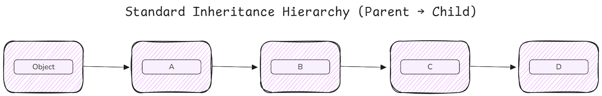
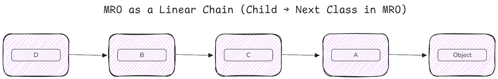

# Python - II

8. Object-Oriented Programming (OOP)

* Classes and Objects
* `__init__`, `__str__`, `__repr__`
* Instance vs Class vs Static methods
* Inheritance and method overriding
* Encapsulation and abstraction
* Magic/Dunder methods (e.g., `__add__`, `__len__`, `__eq__`, `__getitem__`)
* `@property` decorator

9. Advanced OOP

* MRO (Method Resolution Order) and `super()`
* Abstract Base Classes (`abc` module)
* Multiple inheritance
* Metaclasses and dynamic class creation

10. Functional Programming Concepts 
<!-- Move to separate file -->

* Higher-order functions
* `map()`, `filter()`, `reduce()`
* `zip()`, `enumerate()`
* Generator functions and expressions
* Iterators and the `__iter__`, `__next__` protocol
* Decorators (function decorators, class decorators)
* Closures

11. Asynchronous Programming

* `async` and `await`
* `asyncio` module
* Event loop, tasks, coroutines
* Async generators and context managers

12. Python-Specific Features

* Type hinting and annotations (`PEP 484`, `mypy`)
* `dataclasses`
* `NamedTuple`, `TypedDict`
* Context managers (`__enter__`, `__exit__`)
* Descriptors
* `__slots__`
* Dynamic code execution (`eval`, `exec`)
* Introspection and Reflection (`getattr`, `hasattr`, `dir`, `vars`)

13. Performance and Optimization

* Profiling tools (`cProfile`, `timeit`, `line_profiler`)
* Caching (`functools.lru_cache`)
* Memory optimization tips (`__slots__`, generators)
* Multithreading vs Multiprocessing (`threading`, `multiprocessing`, `concurrent.futures`)
* GIL (Global Interpreter Lock)

14. Development Tools & Practices

* Working with virtual environments (`venv`, `conda`, `pipenv`)
* Package management (`pip`, `conda`, `requirements.txt`)
* Writing testable code
* Unit Testing (`unittest`, `pytest`)
* Debugging (`pdb`, `breakpoint()`)
* Structuring Python projects
* `setup.py`, `pyproject.toml`
* Creating your own packages
* Publishing to PyPI

15. Web Development Tools

* Flask or FastAPI basics
* REST API creation and deployment
* Data science APIs with FastAPI + Swagger docs
* Streamlit

---


## Object-Oriented Programming (OOP) in Python

Object-Oriented Programming (OOP) is a programming paradigm based on the concept of *objects*, which encapsulate data (attributes) and behavior (methods).

In Python, **everything is an object** — this includes integers, strings, functions, classes, and even modules. Each object is an instance of a class and has:

- **Identity**: Unique ID (obtained via `id()`)
- Type: The class it belongs to (obtained via `type()`)
- Value: The data it holds

```py
x = 42
print(type(x))      # <class 'int'>
print(isinstance(x, object))    # True

def my_func():
    pass

print(type(my_func))     # <class 'function'>
print(isinstance(my_func, object))  # True

# Even classes are objects (instances of 'type')
class MyClass:
    pass

print(type(MyClass))     # <class 'type'>
print(isinstance(MyClass, object))  # True
```

### Core OOP Principles

- **Encapsulation**: Bundling data and methods that operate on that data within a single unit (class)
- **Abstraction**: Hiding complex implementation details and exposing only essential features
- **Inheritance**: Creating new classes from existing ones to promote code reuse
- **Polymorphism**: Ability to use a common interface for different underlying data types

### Class and Object

- **Class:** A blueprint or template that defines the structure and behavior of objects.
- **Object:** An instance of a class containing real data.

```python
class Dog:
    """A simple Dog class demonstrating basic OOP concepts"""
    
    # Class attribute (shared by all instances)
    species = "Canis familiaris"
    
    def __init__(self, name, age):
        """Instance initializer (constructor)"""
        # Instance attributes (unique to each instance)
        self.name = name
        self.age = age
    
    def bark(self):
        """Instance method"""
        return f"{self.name} says Woof!"

# Creating objects (instances)
dog1 = Dog("Buddy", 3)
dog2 = Dog("Lucy", 5)

print(dog1.name)          # Buddy
print(dog1.species)       # Canis familiaris
print(dog1.bark())        # Buddy says Woof!

# Class attributes are shared
print(dog1.species is dog2.species)  # True (same object in memory)
```

#### Instance vs Class Attributes

- Class attributes are shared across all instances
- Instance attributes are unique to each object
- Accessing a class attribute through an instance creates a lookup chain: `instance → class`
- Assigning to an attribute through an instance creates an instance attribute (doesn't modify class attribute)

Functions defined inside a class are known as **methods**. 

- *classes* in Python are **callable objects** that return instances.

### Methods

Methods are Functions defined inside a class. They can access and modify the data associated with the object.

#### Types of Methods in Python OOP

- **Instance Methods**

Operate on instance data and have access to instance data (`self`).

```py
class BankAccount:
    def __init__(self, owner, balance=0):
        self.owner = owner
        self.balance = balance
    
    def deposit(self, amount):
        """Instance method - modifies instance state"""
        if amount > 0:
            self.balance += amount
            return f"Deposited ${amount}. New balance: ${self.balance}"
        return "Invalid amount"
    
    def withdraw(self, amount):
        """Instance method with validation"""
        if 0 < amount <= self.balance:
            self.balance -= amount
            return f"Withdrew ${amount}. New balance: ${self.balance}"
        return "Insufficient funds or invalid amount"

account = BankAccount("Alice", 1000)
print(account.deposit(500))   # Deposited $500. New balance: $1500
print(account.withdraw(200))  # Withdrew $200. New balance: $1300
```

- Instance method can acutally access class data via `self.__class__`

- **Class Methods**

Operate on the class data, not instances. Use the `@classmethod` decorator and `cls` as the first parameter. Often used as **factory methods** to create objects in alternative ways, or to access and modify class variables.

```py
class Employee:
    company = "TechCorp"
    employee_count = 0
    
    def __init__(self, name, salary):
        self.name = name
        self.salary = salary
        Employee.employee_count += 1
    
    @classmethod
    def get_employee_count(cls):
        """Class method - accesses class attributes"""
        return f"{cls.company} has {cls.employee_count} employees"
    
    @classmethod
    def from_string(cls, emp_string):
        """Alternative constructor pattern"""
        name, salary = emp_string.split('-')
        return cls(name, int(salary))
    
    @classmethod
    def set_company_name(cls, name):
        """Modify class attribute"""
        cls.company = name

# Using class methods
emp1 = Employee("Alice", 50000)
emp2 = Employee("Bob", 60000)

print(Employee.get_employee_count())  # TechCorp has 2 employees

# Alternative constructor
emp3 = Employee.from_string("Charlie-55000")
print(emp3.name)  # Charlie

# Modifying class attribute
Employee.set_company_name("NewTech")
print(Employee.company)  # NewTech
```

- **Static Methods**

Behave like normal functions but belong to the class’s namespace. Defined with `@staticmethod`.

```py
class MathOperations:
    """Collection of mathematical utilities"""
    
    @staticmethod
    def add(x, y):
        """Static method - no access to instance or class"""
        return x + y
    
    @staticmethod
    def is_even(num):
        """Pure utility function"""
        return num % 2 == 0
    
    @staticmethod
    def validate_positive(value):
        """Validation helper"""
        if value <= 0:
            raise ValueError("Value must be positive")
        return True

# Using static methods (no instance needed)
print(MathOperations.add(5, 3))        # 8
print(MathOperations.is_even(10))      # True

# Can also call through instance (but not recommended)
math = MathOperations()
print(math.add(2, 3))                  # 5
```

- Use **class methods for factory patterns** and **static methods for utility/helper functions**.

### Magic Methods or Special Methods

Magic Methods or Special Methods or Dunder Methods have predefined meanings and are invoked implicitly by Python in specific situations.

- **`__init__`** :  It is called immediately after object creation. It's used to initialize instance attributes
    - `__init__` is not a constructor, it's an initializer
    - `self` refers to the instance being initialized
    - `__new__` is the constructor and its rarely overridden

```py
class Person:
    def __init__(self, name, age=0):
        """Initialize person with validation"""
        if not isinstance(name, str):
            raise TypeError("Name must be a string")
        if age < 0:
            raise ValueError("Age cannot be negative")
        
        self.name = name
        self.age = age

# Valid initialization
person1 = Person("Alice", 30)

# Using default argument
person2 = Person("Bob")

# Invalid initialization
try:
    person3 = Person(123)  # TypeError
except TypeError as e:
    print(f"Error: {e}")
```


- **`__str__`** and **`__repr__`** (String representations) : `__str__` is the human-readable representation for end users, while, `__repr__` is the unambiguous representation for developers (ideally, evaluating it should recreate the object)
    - Always implement `__repr__`; implement `__str__` only if a different user-facing representation is needed
    - Use `!r` in f-strings within `__repr__` to get `repr()` of attributes

```py
class Book:
    def __init__(self, title, author, year):
        self.title = title
        self.author = author
        self.year = year
    
    def __str__(self):
        """User-friendly string representation"""
        return f'"{self.title}" by {self.author}'
    
    def __repr__(self):
        """Developer-friendly representation (should be unambiguous)"""
        return f'Book(title={self.title!r}, author={self.author!r}, year={self.year})'

book = Book("1984", "George Orwell", 1949)

# __str__ is called by print() and str()
print(str(book))          # "1984" by George Orwell
print(book)               # "1984" by George Orwell

# __repr__ is called by repr() and in interactive shell
print(repr(book))         # Book(title='1984', author='George Orwell', year=1949)

# If __str__ is not defined, __repr__ is used as fallback
```

- Python doesn't support traditional **constructor overloading**, but provides alternatives:

```py
class Rectangle:
    def __init__(self, width=None, height=None, square_side=None):
        """Flexible initialization"""
        if square_side is not None:
            self.width = self.height = square_side
        elif width is not None and height is not None:
            self.width = width
            self.height = height
        else:
            raise ValueError("Provide either width and height, or square_side")
    
    @classmethod
    def from_square(cls, side):
        """Alternative constructor for squares"""
        return cls(width=side, height=side)
    
    @classmethod
    def from_dimensions(cls, dimensions):
        """Create from tuple or list"""
        width, height = dimensions
        return cls(width=width, height=height)
    
    def area(self):
        return self.width * self.height

# Different ways to create rectangles
rect1 = Rectangle(10, 20)
rect2 = Rectangle(square_side=15)
rect3 = Rectangle.from_square(15)
rect4 = Rectangle.from_dimensions((10, 20))

print(rect1.area())  # 200
print(rect2.area())  # 225
```

- Use `@classmethod` for alternative constructors
- Provides clear, named entry points for different initialization scenarios

### Inheritance and Method Overriding

Inheritance allows a class (child) to acquire properties and methods of another class (parent).

```py
class Animal:
    """Base class"""
    
    def __init__(self, name, species):
        self.name = name
        self.species = species
    
    def make_sound(self):
        """Method to be overridden"""
        return "Some generic sound"
    
    def info(self):
        """Inherited method"""
        return f"{self.name} is a {self.species}"

class Dog(Animal):
    """Derived class"""
    
    def __init__(self, name, breed):
        # Call parent constructor
        super().__init__(name, species="Dog")
        self.breed = breed
    
    def make_sound(self):
        """Method overriding"""
        return "Woof!"
    
    def fetch(self):
        """New method specific to Dog"""
        return f"{self.name} is fetching the ball"

class Cat(Animal):
    """Another derived class"""
    
    def __init__(self, name, indoor=True):
        super().__init__(name, species="Cat")
        self.indoor = indoor
    
    def make_sound(self):
        """Method overriding"""
        return "Meow!"

# Using inheritance
dog = Dog("Buddy", "Golden Retriever")
cat = Cat("Whiskers", indoor=True)

print(dog.info())         # Buddy is a Dog (inherited method)
print(dog.make_sound())   # Woof! (overridden method)
print(dog.fetch())        # Buddy is fetching the ball (new method)

print(cat.info())         # Whiskers is a Cat
print(cat.make_sound())   # Meow!

# Type checking
print(isinstance(dog, Dog))     # True
print(isinstance(dog, Animal))  # True (Dog is subclass of Animal)
print(isinstance(dog, Cat))     # False
print(issubclass(Dog, Animal))  # True
```

#### Method overriding rules

```py
class Parent:
    def method(self):
        return "Parent method"
    
    def another_method(self):
        return "Parent another_method"

class Child(Parent):
    def method(self):
        """Complete override"""
        return "Child method"
    
    def another_method(self):
        """Extending parent behavior"""
        parent_result = super().another_method()
        return f"{parent_result} + Child extension"

child = Child()
print(child.method())          # Child method
print(child.another_method())  # Parent another_method + Child extension
```

#### `super()` function

`super()` provides access to methods in parent classes, respecting the Method Resolution Order (MRO).

```py
class Shape:
    def __init__(self, color):
        self.color = color
        print(f"Shape.__init__ called with color={color}")
    
    def area(self):
        raise NotImplementedError("Subclass must implement area()")

class Rectangle(Shape):
    def __init__(self, color, width, height):
        print(f"Rectangle.__init__ called")
        super().__init__(color)  # Call parent initializer
        self.width = width
        self.height = height
    
    def area(self):
        return self.width * self.height

class Square(Rectangle):
    def __init__(self, color, side):
        print(f"Square.__init__ called")
        super().__init__(color, side, side)  # Call Rectangle's initializer

# Tracing initialization chain
square = Square("red", 5)
# Output:
# Square.__init__ called
# Rectangle.__init__ called
# Shape.__init__ called with color=red

print(square.area())  # 25
```

- In **Python 3**, `super()` without arguments is equivalent to `super(CurrentClass, self)`
- Follows **MRO**, not just immediate parent
- Essential for **cooperative multiple inheritance**
- Can be called anywhere in a method, not just at the beginning
- Python does not support traditional *overloading*, but provides alternatives:

```py
class Calculator:
    def add(self, a, b=None, c=None):
        """Using default arguments"""
        if b is None:
            return a
        if c is None:
            return a + b
        return a + b + c
    
    def multiply(self, *args):
        """Using variable arguments"""
        result = 1
        for num in args:
            result *= num
        return result
    
    def process(self, data):
        """Using type checking (discouraged in Python)"""
        if isinstance(data, int):
            return data * 2
        elif isinstance(data, str):
            return data.upper()
        elif isinstance(data, list):
            return sum(data)
        else:
            raise TypeError(f"Unsupported type: {type(data)}")

calc = Calculator()
print(calc.add(5))           # 5
print(calc.add(5, 3))        # 8
print(calc.add(5, 3, 2))     # 10

print(calc.multiply(2, 3, 4))     # 24
print(calc.process(5))            # 10
print(calc.process("hello"))      # HELLO
print(calc.process([1, 2, 3]))    # 6
```

- **Pythonic Alternatives**:
    - Default arguments
    - Variable-length arguments (`*args`, `**kwargs`)
    - Single dispatch (from `functools.singledispatch` for function-based approach)
    - Duck typing (accept any object with required methods)

#### Multiple Inheritance

Multiple inheritance allows a class to inherit from more than one parent class.

```py
class Flyable:
    """Mixin for flying capability"""
    
    def fly(self):
        return f"{self.name} is flying"

class Swimmable:
    """Mixin for swimming capability"""
    
    def swim(self):
        return f"{self.name} is swimming"

class Animal:
    """Base animal class"""
    
    def __init__(self, name):
        self.name = name
    
    def eat(self):
        return f"{self.name} is eating"

class Duck(Animal, Flyable, Swimmable):
    """Duck inherits from three classes"""
    
    def __init__(self, name):
        super().__init__(name)
    
    def quack(self):
        return f"{self.name} says Quack!"

# Using multiple inheritance
duck = Duck("Donald")
print(duck.eat())     # Donald is eating (from Animal)
print(duck.fly())     # Donald is flying (from Flyable)
print(duck.swim())    # Donald is swimming (from Swimmable)
print(duck.quack())   # Donald says Quack! (from Duck)
```

### Method Resolution Order (MRO)

MRO defines the order in which Python searches for methods in the inheritance hierarchy. Python uses **C3 Linearization** algorithm to compute MRO.

```py
class A:
    def process(self):
        return "A"

class B(A):
    def process(self):
        return "B"

class C(A):
    def process(self):
        return "C"

class D(B, C):
    """D inherits from both B and C"""
    pass

# Checking MRO
print(D.__mro__)
# (<class 'D'>, <class 'B'>, <class 'C'>, <class 'A'>, <class 'object'>)

print(D.mro())  # Same as above, but as a list
# [<class 'D'>, <class 'B'>, <class 'C'>, <class 'A'>, <class 'object'>]

# Method resolution follows MRO
d = D()
print(d.process())  # "B" (found in B first, not C)
```

- **MRO Visualization**:





#### Diamond Problem

The diamond problem occurs when a class inherits from two classes that share a common ancestor.

```py
class Animal:
    def __init__(self):
        print("Animal.__init__")
        self.animal_initialized = True

class Mammal(Animal):
    def __init__(self):
        print("Mammal.__init__")
        super().__init__()  # Calls next in MRO
        self.mammal_initialized = True

class Bird(Animal):
    def __init__(self):
        print("Bird.__init__")
        super().__init__()  # Calls next in MRO
        self.bird_initialized = True

class Bat(Mammal, Bird):
    """Diamond inheritance: Bat -> Mammal -> Animal
                             Bat -> Bird -> Animal"""
    def __init__(self):
        print("Bat.__init__")
        super().__init__()  # Follows MRO
        self.bat_initialized = True

# Creating a Bat
bat = Bat()
# Output:
# Bat.__init__
# Mammal.__init__
# Bird.__init__
# Animal.__init__

# Check MRO
print(Bat.__mro__)
# (<class 'Bat'>, <class 'Mammal'>, <class 'Bird'>, <class 'Animal'>, <class 'object'>)

# Animal.__init__ is called only once (no duplicate initialization)
print(hasattr(bat, 'animal_initialized'))  # True
print(hasattr(bat, 'mammal_initialized'))  # True
print(hasattr(bat, 'bird_initialized'))    # True
print(hasattr(bat, 'bat_initialized'))     # True
```

- **C3 Linearization** ensures each class appears only once in MRO
- `super()` calls the next class in MRO, not necessarily the parent
- Common ancestor (Animal) is initialized only once
- All `__init__` methods should call `super().__init__()` for cooperative multiple inheritance

#### Cooperative Multiple Inheritance

```py
class LoggingMixin:
    """Mixin that adds logging capability"""
    
    def __init__(self, *args, **kwargs):
        print(f"LoggingMixin.__init__ called")
        super().__init__(*args, **kwargs)  # Pass along to next in MRO
        self.logs = []
    
    def log(self, message):
        self.logs.append(message)

class ValidationMixin:
    """Mixin that adds validation"""
    
    def __init__(self, *args, **kwargs):
        print(f"ValidationMixin.__init__ called")
        super().__init__(*args, **kwargs)
        self.validated = True
    
    def validate(self):
        return self.validated

class DataModel:
    """Base data model"""
    
    def __init__(self, data):
        print(f"DataModel.__init__ called with data={data}")
        self.data = data

class EnhancedModel(LoggingMixin, ValidationMixin, DataModel):
    """Model with logging and validation"""
    
    def __init__(self, data):
        print(f"EnhancedModel.__init__ called")
        super().__init__(data)
        self.log("Model created")

# Creating enhanced model
model = EnhancedModel({"key": "value"})
# Output:
# EnhancedModel.__init__ called
# LoggingMixin.__init__ called
# ValidationMixin.__init__ called
# DataModel.__init__ called with data={'key': 'value'}

print(EnhancedModel.__mro__)
# (<class 'EnhancedModel'>, <class 'LoggingMixin'>, 
#  <class 'ValidationMixin'>, <class 'DataModel'>, <class 'object'>)

# All capabilities available
print(model.data)           # {'key': 'value'}
print(model.validate())     # True
print(model.logs)           # ['Model created']
```

- lways use `super()` for cooperative inheritance
- Pass `*args`, `**kwargs` through `super().__init__()` calls
- Use **mixins** for composable functionality (single-purpose classes)
- Avoid **state** in mixins when possible
- Document MRO for complex hierarchies
- Check MRO with `ClassName.__mro__` or `ClassName.mro()`

#### Mixins

Mixins are small, reusable classes designed to add specific functionality to other classes.

```py
class JSONMixin:
    """Mixin to add JSON serialization"""
    
    def to_json(self):
        import json
        return json.dumps(self.__dict__)
    
    @classmethod
    def from_json(cls, json_string):
        import json
        data = json.loads(json_string)
        return cls(**data)

class ComparableMixin:
    """Mixin for comparison based on 'value' attribute"""
    
    def __eq__(self, other):
        return self.value == other.value
    
    def __lt__(self, other):
        return self.value < other.value
    
    def __le__(self, other):
        return self.value <= other.value

class Product(JSONMixin, ComparableMixin):
    """Product with JSON and comparison capabilities"""
    
    def __init__(self, name, value):
        self.name = name
        self.value = value
    
    def __repr__(self):
        return f"Product({self.name}, ${self.value})"

# Using mixins
p1 = Product("Laptop", 1000)
p2 = Product("Mouse", 50)

# JSON serialization (from JSONMixin)
json_str = p1.to_json()
print(json_str)  # {"name": "Laptop", "value": 1000}

p3 = Product.from_json(json_str)
print(p3)  # Product(Laptop, $1000)

# Comparison (from ComparableMixin)
print(p1 > p2)  # True
print(p1 == p3)  # True
print(sorted([p1, p2]))  # [Product(Mouse, $50), Product(Laptop, $1000)]
```

### Encapsulation

Encapsulation is the process of bundling data and methods together. Python uses naming conventions rather than true access modifiers (like `private` in Java/C++).

- `_single_underscore` → **protected** (convention only)

- `__double_underscore` → name mangling for **private** attributes

```py
class Account:
    def __init__(self, owner, balance):
        self.owner = owner           # Public attribute
        self._balance = balance      # Protected (convention: internal use)
        self.__pin = "1234"          # Private (name mangling applied)
    
    def get_balance(self):
        """Public method to access protected attribute"""
        return self._balance
    
    def __validate_pin(self, pin):
        """Private method (name mangling)"""
        return pin == self.__pin
    
    def withdraw(self, amount, pin):
        """Public method using private validation"""
        if self.__validate_pin(pin):
            if amount <= self._balance:
                self._balance -= amount
                return f"Withdrew ${amount}"
            return "Insufficient funds"
        return "Invalid PIN"

account = Account("Alice", 1000)

# Public access
print(account.owner)  # Alice

# Protected access (nothing prevents it, just convention)
print(account._balance)  # 1000 (not recommended, but possible)

# Private access (name mangling)
try:
    print(account.__pin)  # AttributeError
except AttributeError as e:
    print(f"Error: {e}")

# Private attributes are mangled to _ClassName__attribute
print(account._Account__pin)  # 1234 (not truly private, but obfuscated)

# Using public interface
print(account.withdraw(200, "1234"))  # Withdrew $200
print(account.get_balance())           # 800
```

- **Naming Conventions Summary**

```py
class Example:
    def __init__(self):
        self.public = "I'm public"
        self._protected = "I'm protected by convention"
        self.__private = "I'm name-mangled"
    
    def public_method(self):
        return "Anyone can call me"
    
    def _protected_method(self):
        return "Internal use suggested"
    
    def __private_method(self):
        return "Name mangled method"
    
    def access_private(self):
        """Public interface to private members"""
        return self.__private_method()

obj = Example()

# All are technically accessible
print(obj.public)                    # Works
print(obj._protected)                # Works (not recommended)
print(obj._Example__private)         # Works (name mangling exposed)

# Methods
print(obj.public_method())           # Works
print(obj._protected_method())       # Works (not recommended)
print(obj.access_private())          # Works (proper way)
```

- **Best Practices for Encapsulation**

```py
class BankAccount:
    """Demonstrating proper encapsulation"""
    
    def __init__(self, account_number, initial_balance):
        self.__account_number = account_number  # Private
        self.__balance = initial_balance        # Private
        self._transaction_history = []          # Protected
    
    @property
    def account_number(self):
        """Read-only access to account number"""
        return f"****{self.__account_number[-4:]}"  # Masked
    
    @property
    def balance(self):
        """Read-only access to balance"""
        return self.__balance
    
    def deposit(self, amount):
        """Public method with validation"""
        if amount > 0:
            self.__balance += amount
            self._transaction_history.append(f"Deposit: +${amount}")
            return True
        raise ValueError("Deposit amount must be positive")
    
    def withdraw(self, amount):
        """Public method with business logic"""
        if amount > 0 and amount <= self.__balance:
            self.__balance -= amount
            self._transaction_history.append(f"Withdrawal: -${amount}")
            return True
        raise ValueError("Invalid withdrawal amount")
    
    def _calculate_interest(self, rate):
        """Protected helper method"""
        return self.__balance * rate
    
    def __str__(self):
        return f"Account {self.account_number}: ${self.balance}"

# Usage
account = BankAccount("123456789", 1000)
print(account)                    # Account ****6789: $1000
account.deposit(500)
print(account.balance)            # 1500

# Cannot directly modify balance
# account.balance = 5000  # AttributeError (if using @property without setter)
```

#### Properties and Descriptors

- **`@property` Decorator**

Properties provide a Pythonic way to implement **getters**, **setters**, and **deleters** while maintaining attribute-like syntax.

```py
class Temperature:
    def __init__(self, celsius):
        self._celsius = celsius  # Private attribute
    
    @property
    def celsius(self):
        """Getter for celsius"""
        print("Getting celsius")
        return self._celsius
    
    @celsius.setter
    def celsius(self, value):
        """Setter with validation"""
        print(f"Setting celsius to {value}")
        if value < -273.15:
            raise ValueError("Temperature below absolute zero!")
        self._celsius = value
    
    @celsius.deleter
    def celsius(self):
        """Deleter"""
        print("Deleting celsius")
        del self._celsius
    
    @property
    def fahrenheit(self):
        """Computed property (read-only)"""
        return (self.celsius * 9/5) + 32
    
    @fahrenheit.setter
    def fahrenheit(self, value):
        """Setting fahrenheit updates celsius"""
        self.celsius = (value - 32) * 5/9

# Using properties
temp = Temperature(25)
print(temp.celsius)        # Getting celsius → 25
print(temp.fahrenheit)     # Getting celsius → 77.0

temp.celsius = 30          # Setting celsius to 30
print(temp.celsius)        # Getting celsius → 30

temp.fahrenheit = 86       # Setting celsius to 30.0 (via fahrenheit setter)
print(temp.celsius)        # Getting celsius → 30.0

# Validation works
try:
    temp.celsius = -300    # ValueError
except ValueError as e:
    print(e)

# Deletion
del temp.celsius           # Deleting celsius
```

- **Property vs Direct Attribute Access**

```py
# Without property (not recommended for complex logic)
class CircleBasic:
    def __init__(self, radius):
        self.radius = radius
        self.diameter = radius * 2  # Problem: can become inconsistent
    
    def area(self):
        return 3.14159 * self.radius ** 2

circle1 = CircleBasic(5)
print(circle1.diameter)  # 10
circle1.radius = 10      # Changing radius
print(circle1.diameter)  # Still 10 (inconsistent!)

# With property (recommended)
class CircleProperty:
    def __init__(self, radius):
        self._radius = radius
    
    @property
    def radius(self):
        return self._radius
    
    @radius.setter
    def radius(self, value):
        if value <= 0:
            raise ValueError("Radius must be positive")
        self._radius = value
    
    @property
    def diameter(self):
        """Computed property - always consistent"""
        return self._radius * 2
    
    @diameter.setter
    def diameter(self, value):
        self._radius = value / 2
    
    @property
    def area(self):
        """Read-only computed property"""
        return 3.14159 * self._radius ** 2

circle2 = CircleProperty(5)
print(circle2.diameter)  # 10
circle2.radius = 10      # Changing radius
print(circle2.diameter)  # 20 (consistent!)
print(circle2.area)      # 314.159

circle2.diameter = 30    # Setting via diameter
print(circle2.radius)    # 15.0
```

- **Custom Descriptors**

Descriptors are the mechanism behind properties. They allow you to customize attribute access across multiple classes.

```py
class ValidatedString:
    """Descriptor for validated string attributes"""
    
    def __init__(self, minlen=0, maxlen=100):
        self.minlen = minlen
        self.maxlen = maxlen
    
    def __set_name__(self, owner, name):
        """Called when descriptor is assigned to a class attribute"""
        self.name = f"_{name}"
    
    def __get__(self, instance, owner):
        """Called when attribute is accessed"""
        if instance is None:
            return self  # Accessing from class, not instance
        return getattr(instance, self.name, None)
    
    def __set__(self, instance, value):
        """Called when attribute is set"""
        if not isinstance(value, str):
            raise TypeError(f"{self.name} must be a string")
        if len(value) < self.minlen:
            raise ValueError(f"{self.name} must be at least {self.minlen} characters")
        if len(value) > self.maxlen:
            raise ValueError(f"{self.name} must be at most {self.maxlen} characters")
        setattr(instance, self.name, value)

class PositiveNumber:
    """Descriptor for positive numbers"""
    
    def __set_name__(self, owner, name):
        self.name = f"_{name}"
    
    def __get__(self, instance, owner):
        if instance is None:
            return self
        return getattr(instance, self.name, 0)
    
    def __set__(self, instance, value):
        if not isinstance(value, (int, float)):
            raise TypeError(f"{self.name} must be a number")
        if value <= 0:
            raise ValueError(f"{self.name} must be positive")
        setattr(instance, self.name, value)

class Product:
    """Using descriptors for validation"""
    name = ValidatedString(minlen=3, maxlen=50)
    price = PositiveNumber()
    
    def __init__(self, name, price):
        self.name = name    # Calls ValidatedString.__set__
        self.price = price  # Calls PositiveNumber.__set__

# Using the descriptor-based class
product = Product("Laptop", 999.99)
print(product.name)   # Laptop
print(product.price)  # 999.99

# Validation works automatically
try:
    product.name = "AB"  # Too short
except ValueError as e:
    print(e)

try:
    product.price = -10  # Negative
except ValueError as e:
    print(e)

try:
    product.price = "expensive"  # Wrong type
except TypeError as e:
    print(e)
```

- **When to use descriptors**:
    - Reusable validation logic across multiple classes
    - Complex attribute management (caching, type checking, etc.)
    - Framework/library development
    - Note: For simple cases, @property is usually sufficient

#### Benefits of Encapsulation

- **Data validation**: Control how attributes are modified
- **Internal representation freedom**: Change implementation without affecting external code
- **Prevents accidental modification**: Reduces bugs from unintended state changes
- **Clear interface**: Public methods define how objects should be used

### Abstact Base Classes

Abstract Base Classes (ABCs) define a contract that subclasses must implement. They cannot be instantiated directly.

```py
from abc import ABC, abstractmethod

class Shape(ABC):
    """Abstract base class for shapes"""
    
    @abstractmethod
    def area(self):
        """Calculate area - must be implemented by subclasses"""
        pass
    
    @abstractmethod
    def perimeter(self):
        """Calculate perimeter - must be implemented by subclasses"""
        pass
    
    def describe(self):
        """Concrete method - can be inherited as-is"""
        return f"This shape has area {self.area()} and perimeter {self.perimeter()}"

# Cannot instantiate abstract class
try:
    shape = Shape()
except TypeError as e:
    print(e)  # Can't instantiate abstract class Shape with abstract methods area, perimeter

# Concrete implementation
class Rectangle(Shape):
    def __init__(self, width, height):
        self.width = width
        self.height = height
    
    def area(self):
        return self.width * self.height
    
    def perimeter(self):
        return 2 * (self.width + self.height)

# Now we can instantiate
rect = Rectangle(5, 10)
print(rect.area())        # 50
print(rect.perimeter())   # 30
print(rect.describe())    # This shape has area 50 and perimeter 30

# Incomplete implementation raises error
class IncompleteShape(Shape):
    def area(self):
        return 0
    # Missing perimeter() implementation!

try:
    incomplete = IncompleteShape()
except TypeError as e:
    print(e)  # Can't instantiate abstract class IncompleteShape with abstract methods perimeter
```

#### Abstract Properties

```py
from abc import ABC, abstractmethod

class Vehicle(ABC):
    """Abstract vehicle with abstract properties"""
    
    @property
    @abstractmethod
    def max_speed(self):
        """Maximum speed - must be defined in subclasses"""
        pass
    
    @property
    @abstractmethod
    def capacity(self):
        """Passenger capacity"""
        pass
    
    @abstractmethod
    def start_engine(self):
        """Abstract method"""
        pass

class Car(Vehicle):
    def __init__(self, model, speed, seats):
        self.model = model
        self._max_speed = speed
        self._capacity = seats
    
    @property
    def max_speed(self):
        return self._max_speed
```

#### Abstract Class Methods and Static Methods

```py
from abc import ABC, abstractmethod

class DataParser(ABC):
    """Abstract parser for different data formats"""
    
    @abstractmethod
    def parse(self, data):
        """Instance method - parse data"""
        pass
    
    @classmethod
    @abstractmethod
    def from_file(cls, filename):
        """Abstract class method - create parser from file"""
        pass
    
    @staticmethod
    @abstractmethod
    def validate_format(data):
        """Abstract static method - validate data format"""
        pass

class JSONParser(DataParser):
    def __init__(self, data):
        self.data = data
    
    def parse(self):
        import json
        return json.loads(self.data)
    
    @classmethod
    def from_file(cls, filename):
        with open(filename, 'r') as f:
            return cls(f.read())
    
    @staticmethod
    def validate_format(data):
        import json
        try:
            json.loads(data)
            return True
        except json.JSONDecodeError:
            return False

# Using the concrete implementation
parser = JSONParser('{"key": "value"}')
print(parser.parse())  # {'key': 'value'}
print(JSONParser.validate_format('{"valid": true}'))  # True
print(JSONParser.validate_format('invalid'))  # False
```

#### Duck Typing vs ABCs

```py
from abc import ABC, abstractmethod

class Readable(ABC):
    """Explicit interface definition"""
    
    @abstractmethod
    def read(self):
        pass

class FileReader(Readable):
    def __init__(self, filename):
        self.filename = filename
    
    def read(self):
        with open(self.filename, 'r') as f:
            return f.read()

class DatabaseReader(Readable):
    def __init__(self, query):
        self.query = query
    
    def read(self):
        # Simulate database read
        return f"Data from query: {self.query}"

def process_readable(readable: Readable):
    """Type hint indicates expected interface"""
    if not isinstance(readable, Readable):
        raise TypeError("Object must implement Readable interface")
    return readable.read()

# Both work
file_reader = FileReader('test.txt')
db_reader = DatabaseReader('SELECT * FROM users')

print(process_readable(file_reader))
print(process_readable(db_reader))
```

- **Duck typing approach**

```py
# Duck typing approach (Pythonic)
def process_file(file_obj):
    """Accepts any object with read() method"""
    content = file_obj.read()
    return content.upper()

# Works with file
with open('test.txt', 'w') as f:
    f.write('hello world')

with open('test.txt', 'r') as f:
    print(process_file(f))

# Works with StringIO (duck typing)
from io import StringIO
string_file = StringIO('hello from stringio')
print(process_file(string_file))

# Works with any custom class with read()
class CustomReader:
    def read(self):
        return "custom content"

print(process_file(CustomReader()))
```

- When to use each:
    - Duck Typing is the default or pythonic way for flexibility
    - Use ABCs when you need explicit contracts, framework development, or type safety


<!-- ### Abstraction

Hiding complex implementation details and exposing only necessary interfaces.

 -->


[OOPS Notebook](./Notebooks/9_Object_Oriented_Programming.ipynb)

---
