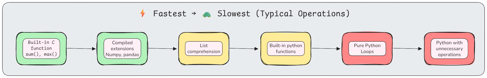
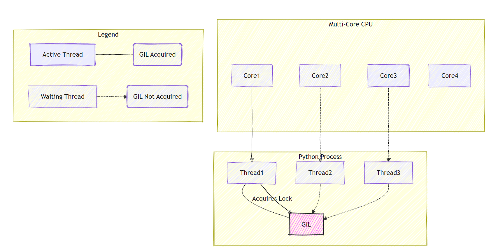

<h1 align="center" > Python Programming - III </h1>

---

## Table of Contents

1. **Asynchronous and Concurrent Programming in Python**
    - [Multithreading](#multi-threading)
    - [Multiprocessing](#multi-processing)
    - [async and await - asyncio module](#asynchronous-programming-with-asyncio)
    - [Async generators and context managers](#async-generators-and-context-managers)

2. **Performance and Optimization in Python**
     - [Profiling](#profiling-and-measuring-performance)
     - [Caching](#caching-strategies)
     - [Memory Optimization](#memory-optimization)
     - [Code level optimization](#code-level-optimizations)
     - [`concurrent.futures` Module](#concurrentfutures-module)
     - [CPython](#the-python-interpreter-and-cpython-implementation)
     - [GIL](#global-interpreter-lock-gil)

3. **Python-Specific Features for Data Science and ML Engineering**
    - [Type Hinting and Annotations](#type-hinting-and-annotations)
    - [`dataclasses`](#dataclasses)
    - [`NamedTuple`](#namedtuple---lightweight-immutable-records)
    - [`TypedDict`](#typeddict---typed-dictionaries)
    - [Context Managers](#context-managers)
    - [`__slots__`](#memory-optimization-with-__slots__)
    - [`getattr`, `hasattr`, `dir`, `vars`](#introspection-and-reflection-getattr-hasattr-dir-vars)
    - [Dynamic Code Execution](#dynamic-code-execution)
    - [Common Patterns](#common-patterns)

4. **Development Tools & Practices for Data Science and ML**
    - [Virtual Environment - `venv`, `Conda`, `pipenv`, `UV`](#virtual-environments)
    - [Python Package Installer - PIP](#pip---python-package-installer)
    - [Testing `pytest`, `unittest`](#pytest---recommended-framework)
    - [Debugging - `pdb`, `breakpoint()`, `ipdb`](#pdb---python-debugger)
    - [Creating and publishing packages](#creating-and-publishing-packages)

---

## Asynchronous and Concurrent Programming in Python

Python provides several models to achieve **concurrency** and **parallelism** — essential for improving performance in I/O-bound and CPU-bound applications.

The three major approaches are:
1. **Multithreading**
2. **Asynchronous Programming (`asyncio`)**
3. **Multiprocessing**

---

### Multi threading

| Term        | Description                                                                           |
| ----------- | ------------------------------------------------------------------------------------- |
| **Program** | A file containing instructions stored on disk.                                        |
| **Process** | A running instance of a program with its own memory space.                            |
| **Thread**  | The smallest unit of execution within a process; threads share the same memory space. |

**Concurrency vs Parallelism**:

| Aspect | Concurrency | Parallelism |
|--------|-------------|-------------|
| **Definition** | Multiple tasks *start, run, and complete* in overlapping time periods; tasks make progress together (interleaved) | Multiple tasks executing simultaneously on multiple CPU cores |
| **Execution** | One at a time, switching rapidly | Truly simultaneous on multiple cores |
| **Hardware** | Can work on single core | Requires multiple cores |
| **Use case** | I/O-bound tasks | CPU-bound tasks |
| **Python approach** | Threading, asyncio | Multiprocessing |
| **Example** | Handling many web requests concurrently using asyncio. | Running several data processing tasks on different CPU cores. |

#### Using `threading` module


```python
import threading
import time

# CPU-bound task (limited by GIL)
def cpu_intensive(n):
    """GIL prevents true parallelism"""
    count = 0
    for i in range(n):
        count += i ** 2
    return count

# I/O-bound task (GIL released during I/O)
def io_intensive(url):
    """GIL released during network I/O"""
    import requests
    response = requests.get(url)
    return len(response.content)

# Threading for I/O: Good (GIL released)
# Threading for CPU: Bad (GIL bottleneck)
```

#### Creating - Running Threads

```python
import threading
import time

def worker(name, delay):
    """Simple worker function"""
    print(f"{name} starting")
    time.sleep(delay)  # I/O operation (GIL released)
    print(f"{name} finished")

# Creating threads
thread1 = threading.Thread(target=worker, args=("Thread-1", 2))
thread2 = threading.Thread(target=worker, args=("Thread-2", 1))

# Starting threads
thread1.start()
thread2.start()

# Wait for completion
thread1.join()
thread2.join()

print("All threads completed")
```

#### Thread Synchronization

Thread synchronization is a mechanism to control access to shared resources by multiple threads in a concurrent environment to prevent data inconsistency and race conditions.

```python
import threading

# Shared resource problem
counter = 0
lock = threading.Lock()

def increment_unsafe():
    """Race condition possible"""
    global counter
    for _ in range(100000):
        counter += 1  # Not atomic!

def increment_safe():
    """Thread-safe with lock"""
    global counter
    for _ in range(100000):
        with lock:  # Acquire lock
            counter += 1  # Now safe

# Without lock: Race condition (incorrect result)
# With lock: Thread-safe (correct result)
```

**Synchronization Primitives:**

| Primitive | Purpose | Use Case |
|-----------|---------|----------|
| `Lock` | Mutual exclusion | Protect shared resource |
| `RLock` | Reentrant lock | Same thread can acquire multiple times |
| `Semaphore` | Limit concurrent access | Connection pool |
| `Event` | Signal between threads | Wait for condition |
| `Condition` | Complex synchronization | Producer-consumer |
| `Barrier` | Wait for N threads | Parallel phases |

#### Threading Use Cases

```python
import threading
import queue
import time

# Producer-Consumer Pattern
task_queue = queue.Queue()

def producer(queue, items):
    """Add items to queue"""
    for item in items:
        print(f"Producing {item}")
        queue.put(item)
        time.sleep(0.1)
    queue.put(None)  # Sentinel

def consumer(queue):
    """Process items from queue"""
    while True:
        item = queue.get()
        if item is None:
            break
        print(f"Consuming {item}")
        time.sleep(0.2)
        queue.task_done()

# Run producer-consumer
producer_thread = threading.Thread(target=producer, args=(task_queue, range(5)))
consumer_thread = threading.Thread(target=consumer, args=(task_queue,))

producer_thread.start()
consumer_thread.start()

producer_thread.join()
consumer_thread.join()
```

**When to Use Threading:**
- I/O-bound tasks (network, file operations)
- Multiple I/O operations concurrently
- Waiting for external resources

**When to not use Threading:**
- CPU-bound computations (use multiprocessing)

### Multi-Processing

Multiprocessing runs multiple **processes**, each with its own Python interpreter and memory space, enabling **true parallelism** on multiple CPU cores.
- Overcomes the GIL limitation.
- Ideal for CPU-bound tasks (e.g., data processing, ML model training).

**Trade-offs:**
- Higher memory overhead (separate memory)
- Inter-process communication (IPC) needed
- Process creation slower than thread creation
- More complex data sharing

#### Threading vs Multiprocessing

| Feature          | Threading                    | Multiprocessing                |
| ---------------- | ---------------------------- | ------------------------------ |
| Memory Space     | Shared                       | Separate                       |
| True Parallelism | No (GIL-limited)             | Yes                            |
| Best For         | I/O-bound tasks              | CPU-bound tasks                |
| Overhead         | Low                          | High                           |
| Data Sharing     | Easy                         | Requires IPC mechanisms        |
| Example          | File downloads, API requests | Image processing, ML workloads |

```python
import multiprocessing
import time

def cpu_bound_task(n):
    """CPU-intensive computation"""
    result = 0
    for i in range(n):
        result += i ** 2
    return result

if __name__ == '__main__':
    # Sequential execution
    start = time.time()
    results = [cpu_bound_task(10**7) for _ in range(4)]
    print(f"Sequential: {time.time() - start:.2f}s")
    
    # Parallel execution
    start = time.time()
    with multiprocessing.Pool(processes=4) as pool:
        results = pool.map(cpu_bound_task, [10**7] * 4)
    print(f"Parallel: {time.time() - start:.2f}s")
    
    # Parallel is ~4x faster on 4 cores!
```

#### Process Communication

```python
from multiprocessing import Process, Queue, Pipe, Value, Array
import time

# 1. Queue (FIFO, thread/process safe)
def worker_queue(queue):
    queue.put("Result from worker")

q = Queue()
p = Process(target=worker_queue, args=(q,))
p.start()
print(q.get())  # "Result from worker"
p.join()
```

```py
# 2. Pipe (two-way communication)
def worker_pipe(conn):
    conn.send("Hello from child")
    msg = conn.recv()
    conn.close()

parent_conn, child_conn = Pipe()
p = Process(target=worker_pipe, args=(child_conn,))
p.start()
print(parent_conn.recv())  # "Hello from child"
parent_conn.send("Hello from parent")
p.join()
```

```py
# 3. Shared Memory (Value and Array)
def worker_shared(shared_value, shared_array):
    shared_value.value += 1
    for i in range(len(shared_array)):
        shared_array[i] *= 2

num = Value('i', 0)  # Shared integer
arr = Array('i', [1, 2, 3, 4, 5])  # Shared array

p = Process(target=worker_shared, args=(num, arr))
p.start()
p.join()

print(num.value)  # 1
print(list(arr))  # [2, 4, 6, 8, 10]
```

#### Process Pool Pattern

```python
from multiprocessing import Pool
import time

def process_item(x):
    """Simulate expensive computation"""
    time.sleep(0.1)
    return x ** 2

if __name__ == '__main__':
    data = range(20)
    
    # Process pool with 4 workers
    with Pool(processes=4) as pool:
        # map: blocks until all done
        results = pool.map(process_item, data)
        
        # imap: returns iterator (lazy)
        results = pool.imap(process_item, data)
        for r in results:
            print(r)
        
        # imap_unordered: results as completed
        results = pool.imap_unordered(process_item, data)
        
        # starmap: multiple arguments
        results = pool.starmap(pow, [(2, 3), (3, 4), (4, 5)])
        # [8, 81, 1024]
```

**When to use multiprocessing:**
- CPU-bound computations
- Heavy number crunching
- Independent parallel tasks
- When you have multiple cores available

**When not to use Multiprocessing:**
- I/O-bound tasks (use threading/asyncio)
- Tasks requiring shared state (complex IPC)

### Asynchronous Programming with `asyncio`

Asynchronous programming enables **non-blocking I/O** — ideal for tasks like web requests, file operations, and database queries where the CPU would otherwise sit idle waiting for `I/O` completion.

#### Key Terms

| Term | Description |
|------|--------------|
| **Coroutine** | A special function defined with `async def` that can be paused and resumed. |
| **Event Loop** | The scheduler that manages and executes asynchronous tasks. |
| **Task** | A wrapper around a coroutine that allows it to be scheduled concurrently. |
| **Await** | Suspends the execution of a coroutine until the awaited task completes. |

`asyncio` is a built-in python library to write concurrent code using the `async/await` syntax. It has a **single threaded event loop** and supports **cooperative multitasking**.

```python
# Threading: OS decides when to switch
def task_threading():
    # Can be interrupted at ANY point
    x = 1
    y = 2  # OS might switch here
    z = x + y
    return z

# Asyncio: Task decides when to yield
async def task_asyncio():
    # Only yields at await points
    x = 1
    y = 2  # No switch here
    await some_io()  # Yields here explicitly
    z = x + y
    return z
```

#### Event Loop Fundamentals

The **event loop** is the core of `asyncio`:
- Manages and executes **coroutines**
- Tracks task states (ready, waiting, running)
- Schedules task execution
- Handles I/O operations

```python
import asyncio

# Event loop lifecycle
async def main():
    print("Task running")
    await asyncio.sleep(1)  # Yield to event loop
    print("Task resumed")

# Run event loop
asyncio.run(main())

# Behind the scenes:
# 1. Create event loop
# 2. Schedule main() coroutine
# 3. Run loop until main() completes
# 4. Close loop
```

#### async/await Syntax

```python
import asyncio

# Define coroutine
async def fetch_data(url):
    """Coroutine function"""
    print(f"Fetching {url}")
    await asyncio.sleep(1)  # Simulate I/O
    return f"Data from {url}"

# Calling coroutine creates coroutine object
coro = fetch_data("https://api.example.com")
print(type(coro))  # <class 'coroutine'>

# Must await or schedule on event loop
result = asyncio.run(fetch_data("https://api.example.com"))
```

`await` can only be used inside async functions. It:
- Pauses coroutine execution
- Yields control to event loop
- Resumes when awaited operation completes

```python
async def task1():
    print("Task 1 start")
    await asyncio.sleep(2)
    print("Task 1 end")
    return "Result 1"

async def task2():
    print("Task 2 start")
    await asyncio.sleep(1)
    print("Task 2 end")
    return "Result 2"

async def main():
    # Sequential (3 seconds total)
    result1 = await task1()  # Wait 2s
    result2 = await task2()  # Wait 1s
    
    # Concurrent (2 seconds total)
    results = await asyncio.gather(task1(), task2())
    # Both run concurrently, wait for slowest

asyncio.run(main())
```

#### Common Patterns

```python
import asyncio
import aiohttp  # Async HTTP library

# Pattern 1: Gathering multiple tasks
async def fetch_all(urls):
    """Fetch multiple URLs concurrently"""
    async with aiohttp.ClientSession() as session:
        tasks = [fetch_one(session, url) for url in urls]
        return await asyncio.gather(*tasks)

async def fetch_one(session, url):
    async with session.get(url) as response:
        return await response.text()

# Pattern 2: Timeout
async def with_timeout():
    try:
        result = await asyncio.wait_for(slow_operation(), timeout=5.0)
    except asyncio.TimeoutError:
        print("Operation timed out")

# Pattern 3: Running in background
async def main():
    task = asyncio.create_task(background_task())
    # Continue without waiting
    await do_other_things()
    # Later, wait for background task
    await task

# Pattern 4: As completed (process as they finish)
async def process_as_completed(urls):
    tasks = [fetch_one(session, url) for url in urls]
    for coro in asyncio.as_completed(tasks):
        result = await coro
        process(result)  # Process immediately
```

#### Event Loop Deep Dive

```python
import asyncio

# Manual event loop management
loop = asyncio.new_event_loop()
asyncio.set_event_loop(loop)

try:
    # Schedule coroutine
    loop.run_until_complete(my_coroutine())
    
    # Run forever (for servers)
    # loop.run_forever()
finally:
    loop.close()

# Simpler: asyncio.run() handles all this
asyncio.run(my_coroutine())
```

#### Tasks vs Coroutines

**Coroutine**: Blueprint for async operation  
**Task**: Scheduled coroutine running on event loop

```python
import asyncio

async def my_coro():
    await asyncio.sleep(1)
    return "Done"

async def main():
    # Create task (schedules on loop immediately)
    task = asyncio.create_task(my_coro())
    
    # Task runs in background
    print("Task created, doing other work...")
    await asyncio.sleep(0.5)
    
    # Wait for task to complete
    result = await task
    print(result)

# Task methods
# task.cancel()  # Cancel task
# task.cancelled()  # Check if cancelled
# task.done()  # Check if completed
# task.result()  # Get result (blocks if not done)
```

#### Concurrent Task Management

```python
import asyncio

async def worker(name, delay):
    print(f"{name} starting")
    await asyncio.sleep(delay)
    print(f"{name} finished")
    return f"{name} result"

async def main():
    # Method 1: gather (wait for all)
    results = await asyncio.gather(
        worker("A", 2),
        worker("B", 1),
        worker("C", 3)
    )
    # Returns: ['A result', 'B result', 'C result']
    
    # Method 2: wait (more control)
    tasks = [
        asyncio.create_task(worker("A", 2)),
        asyncio.create_task(worker("B", 1)),
        asyncio.create_task(worker("C", 3))
    ]
    
    # Wait for first to complete
    done, pending = await asyncio.wait(
        tasks, 
        return_when=asyncio.FIRST_COMPLETED
    )
    
    # Wait for all to complete
    done, pending = await asyncio.wait(tasks)
    
    # Method 3: as_completed (process as they finish)
    for coro in asyncio.as_completed([worker("A", 2), worker("B", 1)]):
        result = await coro
        print(f"Got: {result}")

asyncio.run(main())
```

### Async Generators and Context Managers

**Async Generators** are used when you want to yield values asynchronously (e.g., streaming data from an API).

```python
import asyncio

async def async_range(start, stop):
    """Async generator"""
    for i in range(start, stop):
        await asyncio.sleep(0.1)  # Simulate async operation
        yield i

async def main():
    # Async iteration
    async for num in async_range(0, 5):
        print(num)
    
    # Async comprehension
    squares = [x**2 async for x in async_range(0, 5)]
    print(squares)

asyncio.run(main())
```

**Practical Example:**

```python
async def fetch_pages(urls):
    """Async generator for paginated data"""
    async with aiohttp.ClientSession() as session:
        for url in urls:
            async with session.get(url) as response:
                data = await response.json()
                yield data

async def process_all():
    async for page in fetch_pages(['url1', 'url2', 'url3']):
        process(page)  # Process each page as it arrives
```

#### Async Context Managers

Manages asynchronous setup and teardown operations (like acquiring network connections).

```python
class AsyncDatabaseConnection:
    """Async context manager"""
    
    async def __aenter__(self):
        """Called on 'async with' entry"""
        print("Connecting to database...")
        await asyncio.sleep(0.5)  # Simulate connection
        self.connection = "DB Connection"
        return self
    
    async def __aexit__(self, exc_type, exc_val, exc_tb):
        """Called on exit"""
        print("Closing database connection...")
        await asyncio.sleep(0.5)  # Simulate cleanup
        self.connection = None

async def main():
    async with AsyncDatabaseConnection() as db:
        print(f"Using {db.connection}")
        # Connection automatically closed after block

asyncio.run(main())
```

**Using `@asynccontextmanager`:**

```python
from contextlib import asynccontextmanager

@asynccontextmanager
async def get_connection():
    """Simpler async context manager"""
    conn = await connect_to_db()
    try:
        yield conn
    finally:
        await conn.close()

async def main():
    async with get_connection() as conn:
        await conn.execute("SELECT * FROM users")
```

#### Threading vs. `Asyncio`

| Feature           | Threading                           | Asyncio                                  |
| ----------------- | ----------------------------------- | ---------------------------------------- |
| Switching Type    | **Pre-emptive** (OS decides)        | **Cooperative** (program decides)        |
| Context Switching | OS-initiated                        | Task-initiated via `await`               |
| Ideal For         | I/O-bound with blocking functions   | I/O-bound with async libraries           |
| Example           | Downloading files with blocking I/O | Downloading files using non-blocking I/O |
| Overhead          | Higher (threads managed by OS)      | Lower (tasks managed by event loop)      |

### Choosing the Right Approach

| Workload Type | Best Approach | Reason |
|---------------|---------------|---------|
| I/O-bound (network, files) | `asyncio` | Efficient, no GIL issues, lightweight |
| CPU-bound (computation) | `multiprocessing` | True parallelism, bypasses GIL |
| Mixed I/O + light CPU | `asyncio` | Good balance, minimal overhead |
| Heavy I/O with blocking libs | `threading` | Works with non-async libraries |
| Thousands of concurrent connections | `asyncio` | Minimal memory per task |

```python
# Scenario 1: Web scraping (I/O-bound) → asyncio
async def scrape_websites(urls):
    async with aiohttp.ClientSession() as session:
        tasks = [fetch(session, url) for url in urls]
        return await asyncio.gather(*tasks)
```

```py
# Scenario 2: Image processing (CPU-bound) → multiprocessing
from multiprocessing import Pool

def process_images(image_files):
    with Pool() as pool:
        return pool.map(process_image, image_files)
```

```py
# Scenario 3: Database queries (I/O with blocking) → threading
import threading
import sqlite3

def query_databases(queries):
    threads = [threading.Thread(target=execute_query, args=(q,)) for q in queries]
    for t in threads:
        t.start()
    for t in threads:
        t.join()
```

### Combining Approaches

```python
import asyncio
from concurrent.futures import ProcessPoolExecutor

def cpu_intensive(x):
    """Heavy computation"""
    return sum(i * i for i in range(x))

async def main():
    """Async coordinator with CPU workers"""
    loop = asyncio.get_event_loop()
    executor = ProcessPoolExecutor(max_workers=4)
    
    # Run CPU tasks in process pool from async code
    tasks = [
        loop.run_in_executor(executor, cpu_intensive, 10**7)
        for _ in range(4)
    ]
    
    results = await asyncio.gather(*tasks)
    return results

# Best of both worlds: async coordination + parallel CPU work
```

### Performance and Memory Considerations

#### Memory Usage Comparison

| Approach | Memory per Unit | Overhead | Max Concurrent |
|----------|-----------------|----------|----------------|
| Asyncio (coroutine) | ~1-2 KB | Minimal | 100,000+ |
| Threading (thread) | ~8 MB (stack) | Moderate | 1,000-10,000 |
| Multiprocessing (process) | ~10-50 MB | High | Limited by cores/RAM |

### Common Pitfalls

```python
# ❌ Blocking in async code
async def bad():
    time.sleep(1)  # Blocks entire event loop!

# ✅ Use async version
async def good():
    await asyncio.sleep(1)  # Yields to loop

# ❌ Forgetting await
async def bad():
    fetch_data()  # Returns coroutine, doesn't execute!

# ✅ Await coroutines
async def good():
    await fetch_data()

# ❌ Race condition in threading
counter = 0
def increment():
    global counter
    counter += 1  # Not atomic!

# ✅ Use lock
lock = threading.Lock()
def increment():
    with lock:
        global counter
        counter += 1
```

### Quick Comparison Table

| Feature | Threading | Asyncio | Multiprocessing |
|---------|-----------|---------|-----------------|
| Model | Preemptive | Cooperative | Parallel |
| Overhead | Moderate | Minimal | High |
| GIL Impact | Yes (CPU) | N/A (single thread) | No (separate) |
| Best For | Blocking I/O | Async I/O | CPU-bound |
| Memory | ~8MB/thread | ~1KB/task | ~50MB/process |
| Max Concurrent | ~1000s | ~100,000s | ~cores |
| Shared State | Easy (careful) | Easy (safe) | Complex (IPC) |

---

## Performance and Optimization in Python

> "***Premature optimization is the root of all evil***" - **Donald Knuth**

Optimizing performance in Python often involves understanding *how Python executes code under the hood*, *using profiling tools to identify bottlenecks*, and *applying the right concurrency model for the task* (**threads**, **processes**, or **async**).

The advantages of Python like:
- Rapid development
- Readable, maintainable code
- Rich ecosystem
- Cross-platform

Comes with prices like:
- Interpreted execution (vs compiled)
- Dynamic typing overhead
- Global Interpreter Lock (GIL)
- Memory management overhead

### Performance Hierarchy



### Profiling and Measuring Performance

Before optimizing, you must measure. **Profiling** is the process of analyzing a program's space or time complexity. Python provides several built-in and third-party tools for this purpose.

#### `timeit` Module

A simple tool for measuring the execution time of small code snippets. It runs the code multiple times to get a statistically significant measurement, avoiding common pitfalls like caching. It is best for micro-benchmarking specific functions or expressions.

```python
import timeit

# Method 1: String execution
time = timeit.timeit('sum(range(100))', number=10000)
print(f"Time: {time:.6f} seconds")

# Method 2: Callable
def my_function():
    return sum(range(100))

time = timeit.timeit(my_function, number=10000)

# Method 3: Setup code
setup = "data = list(range(1000))"
stmt = "sum(data)"
time = timeit.timeit(stmt, setup=setup, number=10000)

# Command line usage:
# python -m timeit "sum(range(100))"
```

#### Manual Timing

```python
import time

# Simple timing
start = time.perf_counter()
result = expensive_operation()
elapsed = time.perf_counter() - start
print(f"Elapsed: {elapsed:.4f}s")

# Context manager for timing
from contextlib import contextmanager

@contextmanager
def timer(name):
    start = time.perf_counter()
    yield
    elapsed = time.perf_counter() - start
    print(f"{name}: {elapsed:.4f}s")

with timer("Operation"):
    expensive_operation()
```

#### `cProfile` Module - Function-Level Profiling

A deterministic profiler that provides a detailed breakdown of function call counts and execution times. It's built-in and suitable for identifying performance bottlenecks in larger applications. It is best for getting a high-level overview of where is spend across your entire application.

```python
import cProfile
import pstats

def slow_function():
    total = 0
    for i in range(1000000):
        total += i ** 2
    return total

def fast_function():
    return sum(i ** 2 for i in range(1000000))

def main():
    slow_function()
    fast_function()

# Method 1: Direct profiling
cProfile.run('main()')

# Method 2: Programmatic profiling
profiler = cProfile.Profile()
profiler.enable()
main()
profiler.disable()

# Analyze results
stats = pstats.Stats(profiler)
stats.strip_dirs()
stats.sort_stats('cumulative')
stats.print_stats(10)  # Top 10 functions

# Output shows:
# ncalls: number of calls
# tottime: total time in function (excluding subcalls)
# cumtime: cumulative time (including subcalls)
# percall: average time per call
```

#### `line_profiler` Module - Line-by-Line Profiling

A line-by-line profiler that provides insights into the time spent on each line of code within a function. Great when you want to drill down into a specific, already-identified bottleneck function to see which lines are the most expensive (requires installation: `pip install line_profiler`).

```python
# Install: pip install line_profiler

# Add @profile decorator
@profile
def process_data(data):
    result = []
    for item in data:
        if item % 2 == 0:
            result.append(item ** 2)
    return result

# Run with: kernprof -l -v script.py

# Output shows time per line:
# Line #  Hits  Time    Per Hit  % Time  Line Contents
# ===================================================
#      2     1   10.0     10.0     5.0   result = []
#      3  1000  150.0      0.2    75.0   for item in data:
#      4   500   30.0      0.1    15.0       if item % 2 == 0:
#      5   250   10.0      0.0     5.0           result.append(item ** 2)
```

#### Memory Profiling

```python
import tracemalloc

# Start tracking
tracemalloc.start()

# Code to profile
data = [i ** 2 for i in range(100000)]

# Get memory usage
current, peak = tracemalloc.get_traced_memory()
print(f"Current: {current / 1024:.2f} KB")
print(f"Peak: {peak / 1024:.2f} KB")

# Top memory consumers
snapshot = tracemalloc.take_snapshot()
top_stats = snapshot.statistics('lineno')

for stat in top_stats[:5]:
    print(stat)

tracemalloc.stop()
```

#### `memory_profiler` Module - Memory Usage

Track memory consumption line-by-line:

```python
# Install: pip install memory_profiler

from memory_profiler import profile

@profile
def memory_intensive():
    large_list = [i for i in range(1000000)]
    large_dict = {i: i**2 for i in range(1000000)}
    return large_list, large_dict

# Run: python -m memory_profiler script.py

# Output shows memory delta per line
```

#### py-spy - Sampling Profiler

Non-invasive profiler for running processes:

```bash
# Install: pip install py-spy

# Profile running process
py-spy top --pid <PID>

# Generate flame graph
py-spy record -o profile.svg -- python script.py
```

**Optimization principle**: 20% of code consumes 80% of runtime. **Always profile before optimizing!**

### Caching Strategies

Caching strategies are methods used to store frequently accessed data or computationally expensive results in a temporary location for faster retrieval.

#### `functools.lru_cache`

Least Recently Used cache - memoizes function results:

```python
from functools import lru_cache
import time

# Without cache
def fibonacci_slow(n):
    if n < 2:
        return n
    return fibonacci_slow(n-1) + fibonacci_slow(n-2)

# With cache
@lru_cache(maxsize=128)
def fibonacci_fast(n):
    if n < 2:
        return n
    return fibonacci_fast(n-1) + fibonacci_fast(n-2)

# Performance comparison
start = time.time()
print(fibonacci_slow(30))  # ~0.3 seconds
print(f"Slow: {time.time() - start:.4f}s")

start = time.time()
print(fibonacci_fast(30))  # ~0.00001 seconds
print(f"Fast: {time.time() - start:.4f}s")

# Cache statistics
print(fibonacci_fast.cache_info())
# CacheInfo(hits=28, misses=31, maxsize=128, currsize=31)

# Clear cache
fibonacci_fast.cache_clear()
```

**LRU Cache Parameters:**

```python
# maxsize=None: Unlimited cache (memory risk)
@lru_cache(maxsize=None)
def unlimited_cache(x):
    return x ** 2

# maxsize=128: Default, good balance
@lru_cache(maxsize=128)
def default_cache(x):
    return x ** 2

# typed=True: Cache different types separately
@lru_cache(typed=True)
def typed_cache(x):
    return x ** 2

# cached(1) != cached(1.0) with typed=True
```

#### `functools.cache` (Python **3.9**+)

**Simpler unbounded cache:**

```python
from functools import cache

@cache
def expensive_computation(x, y):
    time.sleep(1)  # Simulate expensive operation
    return x ** y

# First call: 1 second
print(expensive_computation(2, 10))

# Cached call: instant
print(expensive_computation(2, 10))
```

#### Custom Caching

```python
# Simple manual cache
def memoize(func):
    cache = {}
    def wrapper(*args):
        if args not in cache:
            cache[args] = func(*args)
        return cache[args]
    return wrapper

@memoize
def factorial(n):
    if n <= 1:
        return 1
    return n * factorial(n-1)
```

**Class-based cache with expiration:**

```py
import time

class TimedCache:
    def __init__(self, ttl=60):
        self.cache = {}
        self.ttl = ttl
    
    def get(self, key):
        if key in self.cache:
            value, timestamp = self.cache[key]
            if time.time() - timestamp < self.ttl:
                return value
            del self.cache[key]
        return None
    
    def set(self, key, value):
        self.cache[key] = (value, time.time())

# Usage
cache = TimedCache(ttl=10)
cache.set('key', 'value')
```

**When to use Caching:**
- Pure functions (same input → same output)
- Expensive computations called frequently
- Recursive algorithms (fibonacci, dynamic programming)

**When not to use Caching:**
- Functions with side effects
- Rarely called functions
- Large or infinite input space

### Memory Optimization

#### `__slots__` - Reduce Instance Memory

By default, instances use `__dict__` for attributes. `__slots__` uses fixed array instead:

```python
import sys

# Without __slots__
class RegularPoint:
    def __init__(self, x, y):
        self.x = x
        self.y = y

# With __slots__
class OptimizedPoint:
    __slots__ = ['x', 'y']
    
    def __init__(self, x, y):
        self.x = x
        self.y = y

# Memory comparison
regular = RegularPoint(1, 2)
optimized = OptimizedPoint(1, 2)

print(f"Regular: {sys.getsizeof(regular.__dict__)} bytes")  # ~120 bytes
print(f"Optimized: {sys.getsizeof(optimized)} bytes")       # ~64 bytes

# 40-50% memory reduction!

# Create many instances
import timeit

def create_regular():
    return [RegularPoint(i, i) for i in range(10000)]

def create_optimized():
    return [OptimizedPoint(i, i) for i in range(10000)]

# __slots__ is also faster
```

**`__slots__` Trade-offs:**

```python
class SlottedClass:
    __slots__ = ['x', 'y']
    
    def __init__(self, x, y):
        self.x = x
        self.y = y

obj = SlottedClass(1, 2)

# ❌ Can't add new attributes
# obj.z = 3  # AttributeError

# ❌ No __dict__
# print(obj.__dict__)  # AttributeError

# ❌ Weak references need explicit slot
# import weakref
# weakref.ref(obj)  # TypeError

# ✅ Fix: Add __weakref__ slot
class SlottedWithWeakref:
    __slots__ = ['x', 'y', '__weakref__']
```

#### Memory-Efficient Data Structures

```python
# array module - typed arrays (more memory efficient than lists)
from array import array

# List of integers
int_list = [1, 2, 3, 4, 5] * 1000
int_array = array('i', [1, 2, 3, 4, 5] * 1000)

print(f"List: {sys.getsizeof(int_list):,} bytes")
print(f"Array: {sys.getsizeof(int_array):,} bytes")
# Array uses ~50% less memory
```

```py
# collections.deque - efficient for queues
from collections import deque

# List: O(n) for insert/delete at start
my_list = list(range(10000))

# deque: O(1) for both ends
my_deque = deque(range(10000))

# deque is faster for queue operations
```


### Code-Level Optimizations

- Learn DSA, using appropriate data structures does the job most of the time
- Use built-in functions whenever possible; they are C-optimized
- Use list comprehension (C-optimized) over loops whenever possible (List comprehensions build the entire new list in memory at once)
- For string concatenation, using `.join()` (single allocation) is faster than using `+` (creates new string each time)
- Local variables are faster than global ones
- Avoid dot lookups in loops

```python
import math

# Slow: Repeated attribute lookup
def slow_sqrt():
    result = []
    for i in range(10000):
        result.append(math.sqrt(i))

# Fast: Cache lookup
def fast_sqrt():
    result = []
    sqrt = math.sqrt  # Cache reference
    for i in range(10000):
        result.append(sqrt(i))

```

### `concurrent.futures` Module

The `concurrent.futures` module provides a high-level interface for **asynchronously** executing callables, simplifying the process of managing threads and processes for concurrent programming. Key components include:

- **Executors:**
    - `ThreadPoolExecutor`: Manages a pool of threads to execute tasks concurrently. It is suitable for I/O-bound tasks
    - `ProcessPoolExecutor`: Manages a pool of separate processes to execute tasks in parallel. This is ideal for CPU-bound tasks
    - `InterpreterPoolExecutor`: (Python **3.14**+) A `ThreadPoolExecutor` subclass where each worker has its own interpreter, allowing **true multi-core parallelism** by circumventing the **GIL** for each worker
- **Future:**
    - A `Future` object represents the **result of an asynchronously executed callable**. When a task is submitted to an **Executor**, it returns a `Future` object immediately
    - This `Future` acts as a placeholder for the eventual result, which can be retrieved later using methods like `result()`
    - `result()` blocks until the task is complete and its result is available
    - `add_done_callback()` allows registering a function to be called when the future completes


```python
from concurrent.futures import ThreadPoolExecutor, ProcessPoolExecutor
import time

def task(n):
    time.sleep(0.1)
    return n ** 2

# ThreadPoolExecutor for I/O
with ThreadPoolExecutor(max_workers=4) as executor:
    results = executor.map(task, range(10))
    print(list(results))

# ProcessPoolExecutor for CPU
def cpu_task(n):
    return sum(i ** 2 for i in range(n))

with ProcessPoolExecutor(max_workers=4) as executor:
    results = executor.map(cpu_task, [10**6] * 4)
    print(list(results))

# Executor methods:
# - map(): Apply function to iterable
# - submit(): Schedule single task, returns Future
# - shutdown(): Wait for completion
```

```py
import concurrent.futures
import time

def task(name):
    print(f"Starting task {name}")
    time.sleep(2) # Simulate some work
    print(f"Finished task {name}")
    return f"Result from {name}"

with concurrent.futures.ThreadPoolExecutor(max_workers=3) as executor:
    # Submit multiple tasks
    future1 = executor.submit(task, "A")
    future2 = executor.submit(task, "B")
    future3 = executor.submit(task, "C")

    # Get results as they become available
    for future in concurrent.futures.as_completed([future1, future2, future3]):
        print(f"Received: {future.result()}")
```

### When to Use Each Approach

| Task Type | Best Approach | Reason |
|-----------|---------------|--------|
| I/O-bound | `asyncio` or ThreadPool | GIL released during I/O |
| CPU-bound | ProcessPool | Bypasses GIL, true parallelism |
| Mixed | ProcessPool + `asyncio` | Combine benefits |

### The Python Interpreter and `CPython` Implementation

**CPython** is the default and most widely used reference implementation of Python. It is both:

- A **compiler** that converts Python source code (`.py`) into **bytecode** (`.pyc`)
- A **virtual machine** that executes that bytecode
- It also includes a **standard library** and a **C API** for extensions

#### Components of CPython

- **Parser** → Converts source code into an Abstract Syntax Tree (AST)  
- **Compiler** → Translates AST into bytecode  
- **Interpreter / Virtual Machine** → Executes bytecode on the CPython runtime stack  
- **Standard Library** → Modules and built-ins that form Python’s ecosystem  

**Characteristics:**
- Written in C
- Has GIL (limits CPU parallelism in threads)
- CPython operates as a **stack-based virtual machine**:
    - Each frame stores local variables and execution state.
    - The stack is used for expression evaluation and function calls.
    - Each opcode manipulates values on this stack.

### PyPy - JIT Compiler

**PyPy** uses Just-In-Time compilation for significant speedups:

- Can be faster for CPU-bound code
- Compatible with most pure Python code
- Some C extensions not supported
- Higher memory usage (mostly)

| Interpreter | Advantage | Use Case |
|-------------|-----------|----------|
| **Cython** | Compile to C | Performance-critical code |
| **Numba** | JIT for NumPy | Scientific computing |
| **Jython** | Runs on JVM | Java integration |
| **IronPython** | Runs on .NET | C# integration |

### Global Interpreter Lock (GIL)

The **GIL** is a *mutex* in `CPython` that protects access to Python objects, preventing multiple native threads from executing Python bytecode simultaneously within a single process.

This means that even on a multi-core processor, only one thread can be executing Python code at any given moment.



#### Why GIL exists

The primary reason for the GIL is **thread-safe memory management**. CPython uses a memory management technique called **reference counting**. Every Python object has a counter that tracks how many variables are pointing to it. When this count drops to zero, the object's memory is deallocated.

If multiple threads were allowed to modify this reference count simultaneously without a lock, it could lead to *race conditions*, **causing memory leaks** (counts never reaching zero) or premature deallocation of objects (**crashes**). The GIL is a simple, single lock that solves this problem by ensuring only one thread can modify Python objects at a time.

#### Impact on Concurrency

- **CPU-Bound Tasks**: For CPU-bound tasks (e.g., matrix multiplication, data processing), the GIL becomes a significant performance bottleneck. **Multithreading** provides no performance benefit and can even introduce overhead, as threads compete for the lock

- **I/O-Bound Tasks**: For I/O-bound tasks (e.g., network requests, disk reads/writes), the GIL is less of an issue. The **CPython** interpreter releases the GIL when a thread performs an I/O operation, allowing another thread to run. Therefore, threading is highly effective for I/O-bound workloads.

**Key Facts about GIL:**
- Only one thread executes Python code at a time
- Multiple threads can still perform I/O operations concurrently (GIL is released during I/O).
- Context switching between threads is possible
- Performance bottleneck for **CPU-bound** tasks only

---

## Python-Specific Features for Data Science and ML Engineering

Understanding Python’s unique language features helps write **cleaner**, **safer**, and more efficient code — especially for large-scale ML pipelines, data preprocessing, or model deployment systems.

### Type Hinting and Annotations

**Type hinting** provides optional type checking, improving readability and maintainability of code.

> `PEP 484` formalized Python’s type hinting system.

Common type constructs include:

- `List`, `Dict`, `Tuple`, `Optional`, `Union`, `Any`
- `Callable` for function types
- `TypedDict` and `NamedTuple` for structured data

```python
from typing import List, Dict, Tuple, Optional, Union, Any

# Primitive types
def process_value(x: int) -> float:
    return x * 1.5

# Collections
def analyze_data(
    features: List[float],
    labels: List[int],
    metadata: Dict[str, Any]
) -> Tuple[float, float]:
    accuracy = sum(1 for f, l in zip(features, labels) if f > 0.5)
    return accuracy, len(features)

# Optional (can be None)
def load_model(path: Optional[str] = None) -> Any:
    if path is None:
        return default_model()
    return load_from_disk(path)

# Union (multiple types)
def normalize(data: Union[List[float], np.ndarray]) -> np.ndarray:
    return np.array(data) / np.max(data)
```

```python
import numpy as np
import pandas as pd
from typing import Callable, Iterator

# NumPy arrays
def transform_features(X: np.ndarray) -> np.ndarray:
    return X ** 2

# Pandas DataFrames
def clean_data(df: pd.DataFrame) -> pd.DataFrame:
    return df.dropna()

# Callable (functions as arguments)
def apply_transformation(
    data: np.ndarray,
    transform: Callable[[np.ndarray], np.ndarray]
) -> np.ndarray:
    return transform(data)

# Generator types
def batch_generator(
    data: np.ndarray,
    batch_size: int
) -> Iterator[np.ndarray]:
    for i in range(0, len(data), batch_size):
        yield data[i:i + batch_size]
```

```python
from typing import TypeVar, Generic, Protocol

# Generic types
T = TypeVar('T')

class DataLoader(Generic[T]):
    def load(self) -> List[T]:
        pass

# Protocol (structural typing)
class Trainable(Protocol):
    def fit(self, X: np.ndarray, y: np.ndarray) -> None: ...
    def predict(self, X: np.ndarray) -> np.ndarray: ...

def train_model(model: Trainable, X: np.ndarray, y: np.ndarray):
    model.fit(X, y)
    return model.predict(X)

# Works with any class implementing fit/predict
# (sklearn models, custom models, etc.)
```

#### Type Checking with mypy

```python
# Install: pip install mypy
# Run: mypy your_script.py

def process_numbers(data: List[int]) -> int:
    return sum(data)

# mypy catches errors:
result = process_numbers([1, 2, "3"])  # Error: List item 2 has incompatible type "str"
result = process_numbers(5)  # Error: Argument has incompatible type "int"
```

**mypy Configuration** (`mypy.ini`):
```ini
[mypy]
python_version = 3.9
warn_return_any = True
warn_unused_configs = True
disallow_untyped_defs = True

# Ignore third-party libraries without stubs
[mypy-numpy.*]
ignore_missing_imports = True
```

#### Type Aliases for Readability

```python
from typing import NewType, TypeAlias

# Type alias
Features: TypeAlias = np.ndarray
Labels: TypeAlias = np.ndarray
ModelConfig: TypeAlias = Dict[str, Union[int, float, str]]

def train(X: Features, y: Labels, config: ModelConfig) -> float:
    pass

# NewType (stricter - creates distinct type)
UserId = NewType('UserId', int)
DatasetId = NewType('DatasetId', int)

def load_user_data(user_id: UserId) -> pd.DataFrame:
    pass

# Type safety enforced
user = UserId(123)
dataset = DatasetId(456)
load_user_data(user)  # OK
# load_user_data(dataset)  # mypy error
```

### `dataclasses`

Introduced in **Python 3.7** (`PEP 557`), `dataclasses` simplify creating classes used mainly to store data — common in ML configuration, hyperparameters, or datasets.

```python
from dataclasses import dataclass, field
from typing import List, Optional

@dataclass
class ModelConfig:
    """Configuration for ML model"""
    learning_rate: float
    batch_size: int
    epochs: int = 100  # Default value
    hidden_layers: List[int] = field(default_factory=list)
    verbose: bool = True

# Auto-generated __init__, __repr__, __eq__
config = ModelConfig(
    learning_rate=0.001,
    batch_size=32,
    hidden_layers=[128, 64]
)

print(config)
# ModelConfig(learning_rate=0.001, batch_size=32, epochs=100, ...)

# Equality comparison works
config2 = ModelConfig(0.001, 32, hidden_layers=[128, 64])
print(config == config2)  # True
```

#### `Dataclass` Features

```python
from dataclasses import dataclass, field, asdict, astuple

@dataclass(frozen=True)  # Immutable
class Experiment:
    name: str
    accuracy: float
    timestamp: str = field(default_factory=lambda: str(datetime.now()))

@dataclass(order=True)  # Enables comparison
class ModelResult:
    accuracy: float
    model_name: str = field(compare=False)  # Exclude from comparison

results = [
    ModelResult(0.85, "LogReg"),
    ModelResult(0.92, "RandomForest"),
    ModelResult(0.88, "SVM")
]

print(sorted(results))  # Sorted by accuracy

# Convert to dict/tuple
config = ModelConfig(0.001, 32)
print(asdict(config))  # {'learning_rate': 0.001, 'batch_size': 32, ...}
print(astuple(config))  # (0.001, 32, 100, [], True)
```

### NamedTuple - Lightweight Immutable Records

```python
from typing import NamedTuple

class DataSample(NamedTuple):
    features: np.ndarray
    label: int
    sample_id: str

# Immutable, memory-efficient
sample = DataSample(
    features=np.array([1.0, 2.0, 3.0]),
    label=1,
    sample_id="sample_001"
)

# Access by attribute or index
print(sample.features)  # By name
print(sample[0])        # By index

# Unpacking
features, label, sid = sample

# Memory efficient
# samples = [DataSample(...) for _ in range(1_000_000)]
```

### TypedDict - Typed Dictionaries

```python
from typing import TypedDict

class TrainingMetrics(TypedDict):
    loss: float
    accuracy: float
    val_loss: float
    val_accuracy: float
    epoch: int

def log_metrics(metrics: TrainingMetrics) -> None:
    print(f"Epoch {metrics['epoch']}: "
          f"Loss={metrics['loss']:.4f}, "
          f"Acc={metrics['accuracy']:.4f}")

# Type-checked by mypy
metrics: TrainingMetrics = {
    'loss': 0.25,
    'accuracy': 0.92,
    'val_loss': 0.30,
    'val_accuracy': 0.89,
    'epoch': 10
}

log_metrics(metrics)

# mypy catches missing/extra keys
# bad_metrics: TrainingMetrics = {'loss': 0.25}  # Error: missing keys
```

### Comparison: dataclass vs NamedTuple vs TypedDict

| Feature | dataclass | NamedTuple | TypedDict |
|---------|-----------|------------|-----------|
| **Mutability** | Mutable (default) | Immutable | Mutable |
| **Memory** | Moderate | Efficient | N/A (dict) |
| **Methods** | Can add | Can add | No custom methods |
| **Inheritance** | Yes | Limited | Yes |
| **Default values** | Yes | Yes | No |
| **Use case** | Complex models | Simple immutable | JSON/config |

### Context Managers

Context managers simplify resource management — e.g., file handles, database connections, or temporary model sessions.

```py
with open("data.csv", "r") as f:
    data = f.read()
```

#### Basic Context Manager

```python
class Timer:
    """Context manager for timing code blocks"""
    
    def __enter__(self):
        self.start = time.time()
        return self
    
    def __exit__(self, exc_type, exc_val, exc_tb):
        self.elapsed = time.time() - self.start
        print(f"Elapsed: {self.elapsed:.4f}s")
        return False  # Don't suppress exceptions

# Usage
with Timer():
    # Train model
    model.fit(X_train, y_train)

# Elapsed: 12.3456s
```

#### contextlib.contextmanager Decorator

```python
from contextlib import contextmanager
import numpy as np

@contextmanager
def temporary_seed(seed: int):
    """Temporarily set random seed"""
    state = np.random.get_state()  # Save current state
    np.random.seed(seed)
    try:
        yield
    finally:
        np.random.set_state(state)  # Restore state

# Usage
print(np.random.rand())  # Random value

with temporary_seed(42):
    print(np.random.rand())  # 0.3745401188473625 (reproducible)

print(np.random.rand())  # Back to unpredictable
```

#### Practical ML Context Managers

```python
@contextmanager
def gpu_memory_context():
    """Manage GPU memory in PyTorch"""
    import torch
    torch.cuda.empty_cache()  # Clear cache before
    try:
        yield
    finally:
        torch.cuda.empty_cache()  # Clear after

@contextmanager
def evaluation_mode(model):
    """Temporarily set model to eval mode"""
    training = model.training
    model.eval()
    try:
        yield model
    finally:
        if training:
            model.train()

# Usage
with evaluation_mode(model):
    predictions = model(test_data)
# Model automatically back to training mode

@contextmanager
def suppress_warnings():
    """Suppress sklearn warnings"""
    import warnings
    with warnings.catch_warnings():
        warnings.simplefilter("ignore")
        yield

with suppress_warnings():
    model.fit(X, y)  # No convergence warnings
```

#### Multiple Context Managers

```python
# Stack multiple contexts
with open('data.csv') as f, Timer(), suppress_warnings():
    data = pd.read_csv(f)
    process(data)

# Python 3.10+: Parenthesized syntax
with (
    open('data.csv') as f,
    Timer(),
    suppress_warnings()
):
    data = pd.read_csv(f)
```

### Memory Optimization with `__slots__`

By default, Python stores attributes in a dictionary (`__dict__`), which uses extra memory.
`__slots__` restricts allowed attributes and removes that overhead.

#### When `__slots__` Matters in ML

Use when creating thousands/millions of objects:
- Custom data samples
- Graph nodes
- Feature engineering pipelines
- Real-time processing systems

```python
import sys

class DataPointRegular:
    """Without __slots__: ~440 bytes per instance"""
    def __init__(self, x, y, label):
        self.x = x
        self.y = y
        self.label = label

class DataPointOptimized:
    """With __slots__: ~240 bytes per instance"""
    __slots__ = ['x', 'y', 'label']
    
    def __init__(self, x, y, label):
        self.x = x
        self.y = y
        self.label = label

# Memory comparison
regular = DataPointRegular(1.0, 2.0, 'A')
optimized = DataPointOptimized(1.0, 2.0, 'A')

print(f"Regular: {sys.getsizeof(regular) + sys.getsizeof(regular.__dict__)} bytes")
print(f"Optimized: {sys.getsizeof(optimized)} bytes")

# For 1 million instances: ~200MB saved
```

#### `__slots__` with Inheritance

```python
class BaseNode:
    __slots__ = ['id', 'value']
    
    def __init__(self, id, value):
        self.id = id
        self.value = value

class ExtendedNode(BaseNode):
    __slots__ = ['weight']  # Only new attributes
    
    def __init__(self, id, value, weight):
        super().__init__(id, value)
        self.weight = weight

# Total slots: ['id', 'value', 'weight']
```

#### Trade-offs

```python
class OptimizedClass:
    __slots__ = ['x', 'y']

obj = OptimizedClass()
obj.x = 10

# ❌ Can't add new attributes
# obj.z = 20  # AttributeError

# ❌ No __dict__
# print(obj.__dict__)  # AttributeError

# ❌ Weak references need explicit slot
# import weakref
# ref = weakref.ref(obj)  # TypeError

# ✅ Solution: Add __weakref__
class OptimizedWithWeakref:
    __slots__ = ['x', 'y', '__weakref__']
```

**When to use `__slots__`:**
- Creating 10,000+ instances
- Memory constrained environments
- Fixed set of attributes

**When not to use `__slots__`:**
- Dynamic attribute assignment needed
- Small number of instances (<1000)


### Introspection and Reflection (`getattr`, `hasattr`, `dir`, `vars`)

Python provides built-in tools to inspect and manipulate objects at runtime — critical for debugging and building dynamic ML systems.

Introspection enables:
- **Auto-discovery** of models/transformers
- **Dynamic configuration**
- **Pipeline validation**
- **Debugging** and **logging**

```python
import numpy as np
import pandas as pd

# dir() - List attributes/methods
print(dir(pd.DataFrame))  # All DataFrame methods

# hasattr() - Check if attribute exists
if hasattr(model, 'feature_importances_'):
    print(model.feature_importances_)

# getattr() - Get attribute dynamically
metric_name = 'accuracy'
score = getattr(model, f'{metric_name}_score', None)

# setattr() - Set attribute dynamically
setattr(model, 'custom_param', 42)

# vars() - Get __dict__ of object
config = ModelConfig(lr=0.001, batch_size=32)
print(vars(config))  # {'lr': 0.001, 'batch_size': 32}
```

#### Practical ML Examples

```python
# Auto-discover sklearn metrics
from sklearn import metrics

def get_all_metrics():
    """Get all sklearn metric functions"""
    return {
        name: getattr(metrics, name)
        for name in dir(metrics)
        if name.endswith('_score') and callable(getattr(metrics, name))
    }

available_metrics = get_all_metrics()
print(list(available_metrics.keys())[:5])
# ['accuracy_score', 'f1_score', 'precision_score', ...]

# Dynamic model selection
MODEL_REGISTRY = {
    'logistic': LogisticRegression,
    'random_forest': RandomForestClassifier,
    'svm': SVC
}

def create_model(model_type: str, **kwargs):
    """Factory pattern with introspection"""
    model_class = MODEL_REGISTRY.get(model_type)
    if model_class is None:
        raise ValueError(f"Unknown model: {model_type}")
    return model_class(**kwargs)

model = create_model('random_forest', n_estimators=100)
```

#### Type and Instance Checking

```python
import inspect

# type() - Get type
print(type(model))  # <class 'RandomForestClassifier'>

# isinstance() - Check type
if isinstance(data, pd.DataFrame):
    data = data.values

if isinstance(data, (list, np.ndarray)):
    data = np.array(data)

# inspect module - Advanced introspection
print(inspect.signature(model.fit))  # Function signature
print(inspect.getmembers(model, inspect.ismethod))  # All methods

# Check if callable
if callable(transform_func):
    data = transform_func(data)
```

#### Attribute Validation

```python
class MLPipeline:
    """Pipeline with validation"""
    
    REQUIRED_METHODS = ['fit', 'transform']
    
    def add_transformer(self, transformer):
        """Validate transformer has required methods"""
        for method in self.REQUIRED_METHODS:
            if not hasattr(transformer, method):
                raise ValueError(
                    f"Transformer must have '{method}' method"
                )
        self.transformers.append(transformer)

# Dynamic parameter extraction
def extract_model_params(model):
    """Extract all model parameters"""
    return {
        key: value
        for key, value in vars(model).items()
        if not key.startswith('_') and not callable(value)
    }
```

| Function               | Purpose                        |
| ---------------------- | ------------------------------ |
| `dir(obj)`             | List attributes and methods    |
| `vars(obj)`            | Return `__dict__` of an object |
| `getattr(obj, name)`   | Get attribute dynamically      |
| `hasattr(obj, name)`   | Check if attribute exists      |
| `type(obj)`            | Return the object’s type       |
| `isinstance(obj, cls)` | Check class membership         |
| `callable(obj)`        | Check if callable              |

### Dynamic Code Execution

Python allows you to execute code stored as a string. Before exploring the methods for dynamic execution, it's essential to understand the security implications, as improper use can easily introduce severe vulnerabilities.

**Valid Use Cases:**
- Configuration from strings
- Expression evaluation in notebooks
- Dynamic metric computation
- REPL/interactive tools

**Avoid:**
- User input (security risk)
- Production code
- Performance-critical paths

#### eval() - Evaluate Expressions

```python
# Safe: Mathematical expressions
expression = "2 ** 10 + 5"
result = eval(expression)  # 1029

# Use case: Dynamic metric calculation
metric_expr = "accuracy * 0.7 + f1_score * 0.3"
locals_dict = {'accuracy': 0.92, 'f1_score': 0.88}
score = eval(metric_expr, {"__builtins__": {}}, locals_dict)
print(score)  # 0.908
```

#### exec() - Execute Statements

```python
# Execute code block
code = """
def train_model(X, y):
    model = RandomForestClassifier()
    model.fit(X, y)
    return model
"""

namespace = {}
exec(code, namespace)
train_func = namespace['train_model']

# Use case: Dynamic class creation
class_code = f"""
class GeneratedTransformer:
    def __init__(self):
        self.name = 'auto_generated'
    
    def transform(self, X):
        return X * 2
"""

exec(class_code)
transformer = GeneratedTransformer()
```

#### Safe Alternatives

```python
# Use ast.literal_eval for data
import ast

config_str = "{'learning_rate': 0.001, 'batch_size': 32}"
config = ast.literal_eval(config_str)  # Safe: only literals

# Use operator module for dynamic operations
import operator

ops = {
    '+': operator.add,
    '-': operator.sub,
    '*': operator.mul,
    '/': operator.truediv
}

def safe_calculate(a, op, b):
    if op not in ops:
        raise ValueError(f"Invalid operator: {op}")
    return ops[op](a, b)

# Use lambda for simple expressions
transformations = {
    'square': lambda x: x ** 2,
    'log': lambda x: np.log(x),
    'normalize': lambda x: x / x.max()
}

def apply_transform(data, transform_name):
    return transformations[transform_name](data)
```

### Common Patterns

```python
# Pattern 1: Typed configuration
@dataclass
class ExperimentConfig:
    model_type: str
    learning_rate: float
    batch_size: int
    epochs: int = 100

# Pattern 2: Context for reproducibility
@contextmanager
def reproducible_context(seed: int):
    np.random.seed(seed)
    torch.manual_seed(seed)
    yield
    # Reset handled by new seed next time

# Pattern 3: Dynamic model registry
MODELS = {}

def register_model(name: str):
    def decorator(cls):
        MODELS[name] = cls
        return cls
    return decorator

@register_model('rf')
class RFModel:
    pass

# Pattern 4: Type-safe data samples
class Sample(NamedTuple):
    features: np.ndarray
    label: int
    metadata: Dict[str, Any]

# Pattern 5: Memory-efficient nodes
class GraphNode:
    __slots__ = ['id', 'neighbors', 'features']
```

---

## Development Tools & Practices for Data Science and ML

Building reliable, reproducible, and maintainable Python projects is as important as writing correct models or algorithms.

### Virtual Environments

A **virtual environment** isolates dependencies for each project. This prevents version conflicts between libraries (e.g., TensorFlow 2.x vs 1.x). It also provides the following benefits:

- Reproducibility across teams/environments
- Isolate production from development
- Test different package versions

#### `venv` (Built-in)

```bash
# Create virtual environment
python -m venv myenv

# Activate
source venv/bin/activate        # macOS / Linux
venv\Scripts\activate           # Windows

# Install packages
pip install numpy pandas scikit-learn

# Deactivate
deactivate

# Remove environment
rm -rf myenv
```

**Pros**: Built-in, lightweight, simple 
**Cons**: No package management, Python version tied to system

#### conda - Data Science Standard

Used in Data Science for managing both Python and non-Python dependencies

```bash
# Create environment with specific Python version
conda create -n ml_project python=3.12

# Activate
conda activate ml_project

# Install packages (conda or pip)
conda install numpy pandas scikit-learn
pip install tensorflow

# Export environment
conda env export > environment.yml

# Create from file
conda env create -f environment.yml

# List environments
conda env list

# Remove environment
conda env remove -n ml_project

# Update conda
conda update conda

# Install from conda-forge (recommended for DS)
conda install -c conda-forge xgboost

# Install multiple packages
conda install numpy pandas matplotlib

# Update package
conda update numpy

# Update all packages
conda update --all

# List installed packages
conda list

# Search for package
conda search pytorch

# Remove package
conda remove numpy

# Clean cache
conda clean --all
```

**`environment.yml`**

```yaml
name: ml_project
channels:
  - conda-forge
  - defaults
dependencies:
  - python=3.10
  - numpy=1.24
  - pandas=2.0
  - scikit-learn=1.3
  - pip
  - pip:
    - tensorflow==2.13.0
    - mlflow==2.8.0
```

**Pros**: Cross-language packages (CUDA, C libraries), better dependency resolution  
**Cons**: Slower, larger disk usage

#### `pipenv`

Manages virtual environments + dependency resolution automatically.

```bash
# Install pipenv
pip install pipenv

# Create environment + install packages
pipenv install numpy pandas scikit-learn

# Install dev dependencies
pipenv install --dev pytest black flake8

# Activate shell
pipenv shell

# Run command without activation
pipenv run python train.py

# Generate requirements.txt
pipenv requirements > requirements.txt

# Lock dependencies
pipenv lock
```

**Pipfile example:**

```toml
[[source]]
url = "https://pypi.org/simple"
verify_ssl = true
name = "pypi"

[packages]
numpy = ">=1.24"
pandas = "~=2.0"
scikit-learn = "*"

[dev-packages]
pytest = "*"
black = "*"

[requires]
python_version = "3.10"
```

#### UV - Modern approach

**UV** is a next-generation Python package and environment manager developed by [Astral](https://astral.sh). It’s designed as a **drop-in replacement** for tools like `pip`, `pipenv`, and `poetry`, but with a major focus on **speed, reproducibility, and simplicity**.

**Installation:**

```sh
pip install uv

# or directly via shell script (recommended for system-wide use)
curl -LsSf https://astral.sh/uv/install.sh | sh

# Once installed, verify:
uv --version
```

**Environment creation and Dependency resolution:**

```sh
# Create a new virtual environment
uv venv .venv

# Activate environment (Unix/Mac)
source .venv/bin/activate

# Activate environment (Windows)
.venv\Scripts\activate

# Add dependencies
uv add numpy pandas scikit-learn

# Add dev dependencies
uv add pytest black --dev
```

> Unlike `pip` or `conda`, `UV` automatically tracks versions in `uv.lock` for deterministic builds, ensuring consistent environments across systems.

**Reproducibility and Dependency Resolution:**

```sh
# Export requirements.txt for CI/CD use
uv export > requirements.txt

# Sync environment from lockfile (clean install)
uv sync
```

> UV uses a lockfile-based system ensuring byte-for-byte reproducibility

**Building and Publishing Packages with UV:**

```sh
# UV supports building and publishing Python packages to PyPI directly

# Build the package
uv build

# Publish to PyPI
uv publish --token <your_pypi_token>
```

> Use **conda** for complex projects with C dependencies (CUDA, PyTorch) where you need to build certain binaries on your own, for everything else use **UV**

### `pip` - Python Package Installer

```bash
# Install package
pip install numpy

# Install specific version
pip install numpy==1.24.0

# Install minimum version
pip install "numpy>=1.20"

# Install from requirements.txt
pip install -r requirements.txt

# Install in editable mode (development)
pip install -e .

# Upgrade package
pip install --upgrade numpy

# Uninstall
pip uninstall numpy

# List installed packages
pip list

# Show package details
pip show numpy

# Search PyPI
pip search "machine learning"
```

#### requirements.txt Best Practices

```txt
# requirements.txt - pinned versions for reproducibility
numpy==1.24.3
pandas==2.0.3
scikit-learn==1.3.0
tensorflow==2.13.0

# With comments and organization
# Core data processing
numpy==1.24.3
pandas==2.0.3

# ML frameworks
scikit-learn==1.3.0
tensorflow==2.13.0

# Utilities
mlflow==2.8.0
pyyaml==6.0

# requirements-dev.txt - development dependencies
pytest==7.4.0
black==23.7.0
flake8==6.1.0
jupyter==1.0.0
```

#### Generating Requirements

```bash
# Freeze current environment
pip freeze > requirements.txt

# Better: pipreqs (scans imports)
pip install pipreqs
pipreqs . --force

# Result includes only used packages

# pip-tools for dependency management
pip install pip-tools

# requirements.in (high-level)
# numpy
# pandas
# scikit-learn

# Compile to requirements.txt (with dependencies)
pip-compile requirements.in
```

### `pytest` - Recommended Framework

```python
# Install
# pip install pytest

# test_preprocessing.py
import pytest
import numpy as np
import pandas as pd

def normalize_features(X):
    """Normalize features to [0, 1]"""
    return (X - X.min()) / (X.max() - X.min())

# Test function naming: test_*
def test_normalize_features():
    """Test normalization function"""
    X = np.array([1, 2, 3, 4, 5])
    result = normalize_features(X)
    
    assert result.min() == 0
    assert result.max() == 1
    assert len(result) == len(X)

def test_normalize_handles_single_value():
    """Test edge case"""
    X = np.array([5, 5, 5])
    result = normalize_features(X)
    # Should handle division by zero
    assert np.all(np.isnan(result)) or np.all(result == 0)

# Test with fixtures
@pytest.fixture
def sample_dataframe():
    """Reusable test data"""
    return pd.DataFrame({
        'feature1': [1, 2, 3, 4, 5],
        'feature2': [10, 20, 30, 40, 50],
        'target': [0, 1, 0, 1, 0]
    })

def test_data_cleaning(sample_dataframe):
    """Test with fixture"""
    df = sample_dataframe
    assert len(df) == 5
    assert df['target'].nunique() == 2

# Parametrized tests
@pytest.mark.parametrize("input_val,expected", [
    (0, 0),
    (1, 1),
    (0.5, 0.25),
    (-1, 1),
])
def test_square_function(input_val, expected):
    assert input_val ** 2 == expected
```

**Running Tests**

```bash
# Run all tests
pytest

# Run specific file
pytest test_preprocessing.py

# Run specific test
pytest test_preprocessing.py::test_normalize_features

# Verbose output
pytest -v

# Show print statements
pytest -s

# Stop at first failure
pytest -x

# Run only failed tests
pytest --lf

# Coverage report
pip install pytest-cov
pytest --cov=mypackage --cov-report=html
```

#### Testing ML Components

```python
# test_model_utils.py
import numpy as np
from sklearn.metrics import accuracy_score

def test_accuracy_perfect():
    """Test accuracy with perfect predictions"""
    y_true = [0, 1, 0, 1]
    y_pred = [0, 1, 0, 1]
    assert accuracy_score(y_true, y_pred) == 1.0

def test_model_output_shape():
    """Test model produces correct output shape"""
    from sklearn.linear_model import LogisticRegression
    
    X = np.random.rand(100, 10)
    y = np.random.randint(0, 2, 100)
    
    model = LogisticRegression()
    model.fit(X, y)
    predictions = model.predict(X)
    
    assert predictions.shape == (100,)
    assert all(p in [0, 1] for p in predictions)

def test_feature_engineering():
    """Test feature creation"""
    df = pd.DataFrame({
        'price': [100, 200, 300],
        'quantity': [2, 3, 4]
    })
    
    df['revenue'] = df['price'] * df['quantity']
    
    assert 'revenue' in df.columns
    assert df['revenue'].tolist() == [200, 600, 1200]

# Test data validation
def test_no_missing_values():
    """Ensure cleaned data has no NaNs"""
    df = load_and_clean_data('data.csv')
    assert df.isnull().sum().sum() == 0

def test_feature_ranges():
    """Test features are in expected range"""
    X = load_features()
    assert X.min() >= 0
    assert X.max() <= 1
```

#### pytest Configuration

```ini
# pytest.ini
[tool:pytest]
testpaths = tests
python_files = test_*.py
python_classes = Test*
python_functions = test_*
addopts = 
    -v
    --strict-markers
    --cov=mypackage
    --cov-report=term-missing

markers =
    slow: marks tests as slow
    integration: integration tests
```

### `unittest` - Standard Library

```python
import unittest
import numpy as np

class TestPreprocessing(unittest.TestCase):
    """Test case for preprocessing functions"""
    
    def setUp(self):
        """Run before each test"""
        self.data = np.array([1, 2, 3, 4, 5])
    
    def tearDown(self):
        """Run after each test"""
        pass
    
    def test_normalize(self):
        """Test normalization"""
        result = normalize_features(self.data)
        self.assertEqual(result.min(), 0)
        self.assertEqual(result.max(), 1)
    
    def test_raises_exception(self):
        """Test exception handling"""
        with self.assertRaises(ValueError):
            normalize_features(None)

if __name__ == '__main__':
    unittest.main()
```

**pytest vs unittest**: pytest is more concise, better fixtures, parametrization. Recommended for new projects.

### `pdb` - Python Debugger

```python
import pdb

def train_model(X, y):
    # Set breakpoint
    pdb.set_trace()  # Execution pauses here
    
    model = RandomForestClassifier()
    model.fit(X, y)
    return model

# Run script - execution pauses at breakpoint
# Debugger commands:
# n - next line
# s - step into function
# c - continue execution
# p variable - print variable
# l - show current location
# q - quit debugger
```

### `breakpoint()` - **Python 3.7+**

```python
def complex_function(data):
    processed = preprocess(data)
    
    breakpoint()  # Modern way - same as pdb.set_trace()
    
    result = model.predict(processed)
    return result

# Advantages:
# - Shorter syntax
# - Can be disabled via PYTHONBREAKPOINT=0
# - Respects debugging environment variables
```

### Post-Mortem Debugging

```python
import pdb

def buggy_function():
    data = load_data()
    result = process(data)
    return result

try:
    buggy_function()
except Exception:
    pdb.post_mortem()  # Start debugger at exception point
```

### `ipdb` - Enhanced Debugger for IPython

```python
# Install: pip install ipdb

import ipdb

def train_model(X, y):
    ipdb.set_trace()  # Better syntax highlighting
    model.fit(X, y)
    return model

# Or use magic command in Jupyter
# %debug  # After exception
```

### Debugging Strategies

```python
# 1. Print debugging (simple but effective)
def process_data(df):
    print(f"Input shape: {df.shape}")
    df_clean = df.dropna()
    print(f"After dropna: {df_clean.shape}")
    return df_clean

# 2. Logging (better for production)
import logging

logging.basicConfig(level=logging.DEBUG)
logger = logging.getLogger(__name__)

def train_model(X, y):
    logger.debug(f"Training with {len(X)} samples")
    model.fit(X, y)
    logger.info("Training completed")
    return model

# 3. Assertions for validation
def preprocess(X):
    assert X.shape[1] == 10, f"Expected 10 features, got {X.shape[1]}"
    assert not np.isnan(X).any(), "Found NaN values"
    return X

# 4. Conditional breakpoints
def process_batch(batch):
    if len(batch) == 0:
        breakpoint()  # Only break on edge case
    return batch
```

### Standard ML Project Layout

```sh
ml_project/
│
├── data/
│   ├── raw/                  # Original data
│   ├── processed/            # Cleaned data
│   └── external/             # Third-party data
│
├── notebooks/                # Jupyter notebooks
│   ├── 01_exploration.ipynb
│   ├── 02_preprocessing.ipynb
│   └── 03_modeling.ipynb
│
├── src/                      # Source code
│   ├── __init__.py
│   ├── data/
│   │   ├── __init__.py
│   │   └── preprocessing.py
│   ├── features/
│   │   ├── __init__.py
│   │   └── engineering.py
│   ├── models/
│   │   ├── __init__.py
│   │   ├── train.py
│   │   └── predict.py
│   └── utils/
│       ├── __init__.py
│       └── helpers.py
│
├── tests/                    # Test files
│   ├── __init__.py
│   ├── test_preprocessing.py
│   └── test_models.py
│
├── configs/                  # Configuration files
│   ├── config.yaml
│   └── model_config.json
│
├── models/                   # Trained models
│   └── model_v1.pkl
│
├── scripts/                  # Executable scripts
│   ├── train.py
│   └── evaluate.py
│
├── requirements.txt          # Dependencies
├── setup.py                  # Package setup
├── README.md                 # Project documentation
├── .gitignore               # Git ignore rules
└── LICENSE                  # License file
```

### Creating and Publishing Packages

#### setup.py - Traditional Approach

```python
# setup.py
from setuptools import setup, find_packages

with open("README.md", "r") as fh:
    long_description = fh.read()

setup(
    name="ml-toolkit",
    version="0.1.0",
    author="Your Name",
    author_email="your.email@example.com",
    description="Machine learning utilities",
    long_description=long_description,
    long_description_content_type="text/markdown",
    url="https://github.com/yourusername/ml-toolkit",
    packages=find_packages(where="src"),
    package_dir={"": "src"},
    classifiers=[
        "Programming Language :: Python :: 3",
        "License :: OSI Approved :: MIT License",
        "Operating System :: OS Independent",
    ],
    python_requires=">=3.8",
    install_requires=[
        "numpy>=1.20",
        "pandas>=1.3",
        "scikit-learn>=1.0",
    ],
    extras_require={
        "dev": ["pytest>=7.0", "black>=22.0"],
    },
)
```

#### pyproject.toml - Modern Approach

```toml
# pyproject.toml
[build-system]
requires = ["setuptools>=45", "wheel"]
build-backend = "setuptools.build_meta"

[project]
name = "ml-toolkit"
version = "0.1.0"
description = "Machine learning utilities"
readme = "README.md"
requires-python = ">=3.8"
license = {text = "MIT"}
authors = [
    {name = "Your Name", email = "your.email@example.com"}
]
keywords = ["machine learning", "data science"]
classifiers = [
    "Programming Language :: Python :: 3",
    "License :: OSI Approved :: MIT License",
]

dependencies = [
    "numpy>=1.20",
    "pandas>=1.3",
    "scikit-learn>=1.0",
]

[project.optional-dependencies]
dev = ["pytest>=7.0", "black>=22.0", "flake8>=6.0"]

[project.urls]
Homepage = "https://github.com/yourusername/ml-toolkit"
Documentation = "https://ml-toolkit.readthedocs.io"

[tool.black]
line-length = 88
target-version = ['py38']

[tool.pytest.ini_options]
testpaths = ["tests"]
```

#### Building Package

```bash
# Install build tools
pip install build twine

# Build distribution
python -m build

# Creates:
# dist/ml-toolkit-0.1.0.tar.gz  (source)
# dist/ml-toolkit-0.1.0-py3-none-any.whl  (wheel)
```

#### Publishing to PyPI

```bash
# Test PyPI (practice)
python -m twine upload --repository testpypi dist/*

# Install from TestPyPI
pip install --index-url https://test.pypi.org/simple/ ml-toolkit

# Production PyPI
python -m twine upload dist/*

# Users can now install
pip install ml-toolkit
```

**Package Structure Example**

```sh
ml-toolkit/
├── src/
│   └── ml_toolkit/
│       ├── __init__.py
│       ├── preprocessing.py
│       ├── models.py
│       └── utils.py
├── tests/
│   └── test_preprocessing.py
├── docs/
│   └── index.md
├── README.md
├── LICENSE
├── setup.py  # or pyproject.toml
└── MANIFEST.in
```

**src/ml_toolkit/__init__.py:**
```python
"""ML Toolkit - Machine Learning Utilities"""

__version__ = "0.1.0"

from .preprocessing import normalize_features
from .models import train_classifier

__all__ = ["normalize_features", "train_classifier"]
```
---
