<!-- 
    Author : Kannan Jayachandran
    File : Readme.md (Matplotlib & Seaborn)
    Section : Python for DSML
 -->

<h1 align="center"> Data Visualization in Python (Matplotlib + Seaborn) </h1>

> Learn to tell stories with your data — not just show numbers.

## Table of Contents

* [Introduction](#data-visualization)
    -  [Data Exploration](#1-exploration-exploratory-data-analysis---eda)
    -  [Data Presentation ~ Communication](#2-communication-visual-storytellingpresenting-insights)
    -  [Principles of Visual Storytelling](#principles-of-visual-storytelling)
* [Choosing the Right Visualization](#choosing-the-right-visualization)
    - [Decision Framework](#decision-framework)
* [Core Plotting Libraries](#core-plotting-libraries)
    - [Matplotlib](#matplotlib---the-foundation)
    - [Seaborn](#seaborn-statistical-plotting-made-easy)
* [Exploratory Visualization](#exploratory-visualizations)
    - [Line Plot](#1-line-plot)
    - [Histogram](#2-histogram)
    - [Scatter Plot](#3-scatter-plot)
    - [Box Plot](#4-box-plot)
* [Statistical & Analytical Visualization](#statistical--analytical-visualization)
    - [Violin Plot](#5-violin-plot)
    - [Pair Plot](#6-pair-plot)
    - [Heatmap (Correlation Matrix)](#7-heatmap-correlation-matrix)
* [ML-Specific Visualizations](#ml-specific-visualizations)
    - [Confusion Matrix (Classification Evaluation)](#8-confusion-matrix-classification-evaluation)
    - [ROC Curve & AUC (Binary Classification)](#9-roc-curve---auc-binary-classification)
    - [Feature Importance](#10-feature-importance)
    - [Learning Curves (Bias-Variance Diagnosis)](#11-learning-curves-bias-variance-diagnosis)
    - [Residual Plots (Regression Diagnostics)](#12-residual-plots-regression-diagnostics)
    - [Validation Curves (Hyperparameter Tuning)](#13-validation-curves-hyperparameter-tuning)
    -[Class Distribution Plot](#14-class-distribution-imbalance-check)
* [Temporal Data Visualization](#temporal-data-visualizations)
    - [Time Series Plot](#15-time-series-plots-with-moving-averages)
    - [Training Metrics Over Time](#16-training-metrics-over-time-deep-learning)
* [Interactive Visualization](#interactive-visualization)
    - [Interactive Plots with Plotly](#17-interactive-plots-with-plotly-for-dashboards)
    - [Multi-Class ROC Curves](#18-multi-class-roc-curves)
    - [Calibration Curves](#19-calibration-curves-probability-calibration)
    - [Decision Boundaries](#20-decision-boundaries-2d-visualization)
    - [Geospatial Visualization](#21-geospatial-visualization)
* [Design & Communication Principles](#design--communication-principles)
* [Some Data Visualization Scenarios](#data-visualization-scenarios)

---

## Data Visualization

Data visualization in Data Science and Machine learning serves two primary purposes:

### 1. **Exploration** (Exploratory Data Analysis - EDA)

- Identify patterns, outliers, distributions
- Detect missing values and data quality issues
- Understand feature relationships and correlations
- Guide feature engineering decisions
- **Audience:** You and your team
- **Tools:** Jupyter notebooks, quick plots
- It is often quick, numerous, and disposable

### 2. **Communication** (Visual Storytelling/Presenting Insights)
- Tell a data story to stakeholders
- Justify model choices and performance
- Present business insights clearly
- **Audience:** Non-technical stakeholders, clients
- **Tools:** Polished charts, dashboards, reports

### Principles of Visual Storytelling

1. Effective visualization isn’t about decoration — it’s about narrative clarity. Every chart should answer one or more of these questions:
- What’s the **trend**?
- What’s the **relationship**?
- What’s the **distribution**?
- What’s the **composition**?
- What’s the **outlier or pattern**?

2. **Focus on the message:** Start with “What do I want the viewer to learn?”

```python
x = np.linspace(0, 10, 100)
y = np.sin(x)

plt.figure(figsize=(7,4))
plt.plot(x, y, color='tomato', linewidth=2)
plt.title("Sine Wave — Example of Clear Storytelling")
plt.xlabel("X-axis (radians)")
plt.ylabel("Amplitude")
plt.grid(True, linestyle='--', alpha=0.5)
plt.show()
```

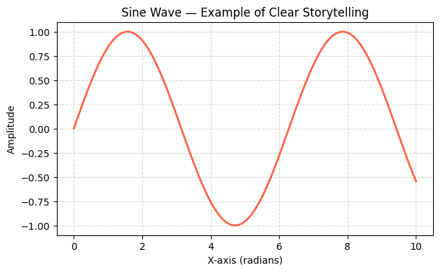

---

## Choosing the Right Visualization

Choosing the right visualization depends on:

- **Data type**: numerical, categorical, temporal, or spatial
- **Number of variables**: univariate, bi-variate, multivariate
- **Analytical goal**: distribution, comparison, correlation, composition, or trend

### Decision Framework

**Before plotting, ask:**
1. **What question am I answering?** (e.g., "Is feature X correlated with target?")
2. **What's my data type?** (continuous, categorical, time-series, multivariate)
3. **Who's my audience?** (yourself, team, stakeholders)
4. **What action will this enable?** (feature selection, model choice, business decision)
5. **Is this the simplest chart that works?** (simpler is almost always better)

#### Analytical goal -> Visualization

| **Analytical Goal**                      | **Data Type**                | **Recommended Visualizations**                       | **Preferred Library**      | **Notes / Real-World Relevance**                                               |
| ---------------------------------------- | ---------------------------- | ---------------------------------------------------- | -------------------------- | ------------------------------------------------------------------------------ |
| **Distribution**                         | Numeric                      | Histogram, KDE plot, Box plot, Violin plot           | **Seaborn**                | Understand feature spread, skewness, and variability. Common in EDA.           |
| **Comparison (Numeric vs. Numeric)**     | Two numeric features         | Scatter plot, Line plot                              | **Matplotlib**             | Compare variables or actual vs. predicted values. Core to regression analysis. |
| **Comparison (Categorical vs. Numeric)** | Categorical + Continuous     | Bar plot, Strip plot, Box plot                       | **Seaborn**                | Analyze performance or averages across categories (e.g., class-wise metrics).  |
| **Composition**                          | Categorical / Parts of Whole | Pie chart *(use sparingly)*, Stacked bar chart       | **Matplotlib**             | Show relative proportions (e.g., label counts, contribution by segment).       |
| **Trend over Time**                      | Time series                  | Line plot, Area plot                                 | **Matplotlib**             | Analyze temporal patterns such as price evolution or training loss.            |
| **Relationships (Multivariate)**         | Multiple features            | Pair plot, Heatmap                                   | **Seaborn**                | Explore inter-feature correlations and redundancy.                             |
| **Geospatial**                           | Latitude / Longitude         | Choropleth, Scatter map                              | **Matplotlib + GeoPandas** | Map geographic patterns, customer density, regional KPIs.                      |
| **Model Results / Evaluation**           | ML metrics                   | Confusion matrix, ROC curve, Feature importance plot | **Matplotlib / Seaborn**   | Visualize classification results, model interpretability, or feature ranking.  |

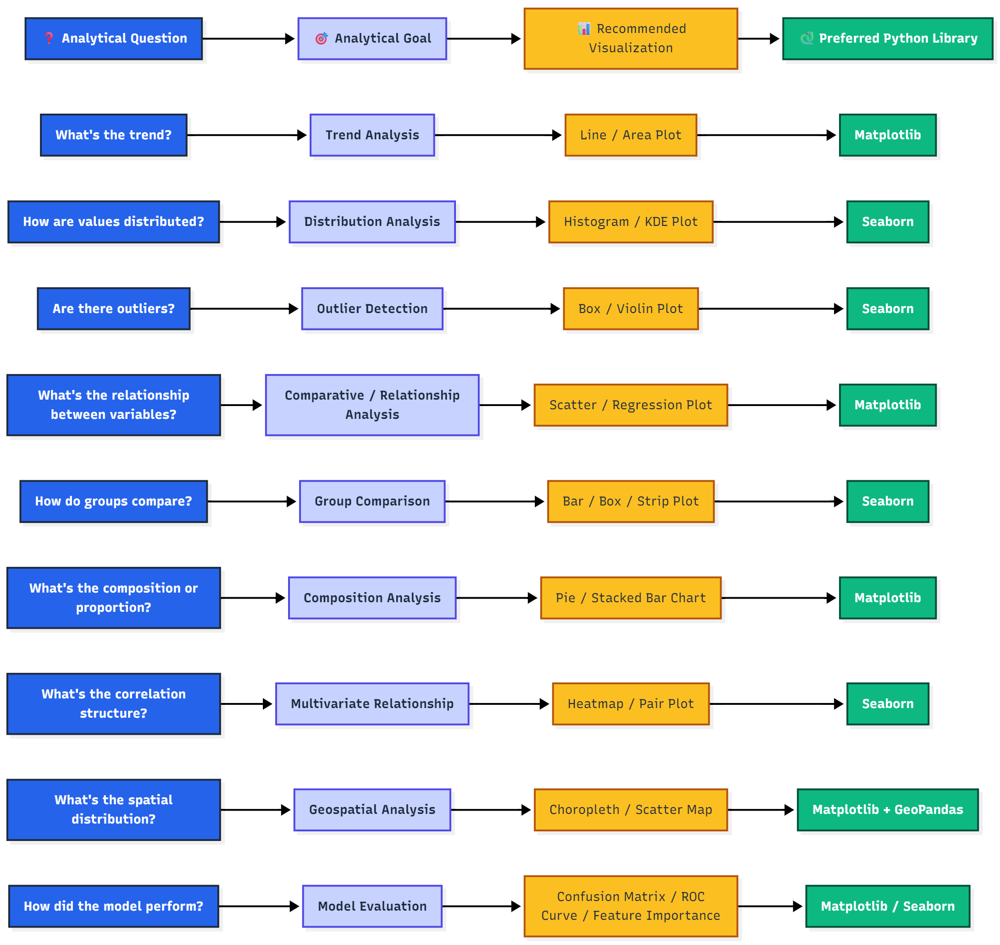

#### Question-Driven Visualization Guide

| **Analytical Question**                        | **Data Type**            | **Best Visualization**                   | **Typical Use Cases**                                | **Interpretation Goal**                           |
| ---------------------------------------------- | ------------------------ | ---------------------------------------- | ---------------------------------------------------- | ------------------------------------------------- |
| **What's the trend?**                          | Time series              | Line plot, Area plot                     | Stock prices, loss/accuracy across epochs            | Observe progression and temporal patterns.        |
| **How are values distributed?**                | Single continuous        | Histogram, KDE                           | Feature distribution, residual spread                | Assess central tendency and variance.             |
| **Are there outliers?**                        | Continuous               | Box plot, Violin plot                    | Data quality check, anomaly detection                | Detect unusual observations and data imbalance.   |
| **What's the relationship between variables?** | Two continuous           | Scatter plot, Regression plot            | Feature correlation, regression fit                  | Identify linear/non-linear relationships.         |
| **How do groups compare?**                     | Categorical + Continuous | Bar chart, Box plot, Strip plot          | Compare model accuracy per category, sales by region | Contrast performance or means between categories. |
| **What's the composition or proportion?**      | Parts of whole           | Pie chart, Stacked bar, 100% stacked bar | Class distribution, feature contribution             | Understand percentage breakdown of components.    |
| **What's the correlation structure?**          | Multiple features        | Heatmap, Pair plot                       | Feature engineering, redundancy checks               | Identify multicollinearity and feature clusters.  |



- *Table 1* → **Technical and goal-oriented**: “Given a data type and analytical goal, what should I use and why?”

- *Table 2* → **Intuitive and question-driven**: “What am I trying to understand, and which chart answers it best?”

---

## Core Plotting Libraries

Here we will primarily discuss Matplotlib and Seaborn.

### Matplotlib - The Foundation

Python library for creating static, animated, and interactive visualizations in 2D and 3D. It has seamless interop with NumPy and SciPy. 

**`matplotlib.pyplot`** is an api (a state based interface of matplotlib) that provides a MATLAB-like plotting framework. Further we use the object oriented API (**`matplotlib.pyplot.subplots`**), which returns a tuple;

- A **Figure** object (the entire canvas or window).
- One or more **Axes** objects (the individual plots/graphs drawn on the figure).

```python
import matplotlib.pyplot as plt
import numpy as np

# Core anatomy of a matplotlib plot
fig, ax = plt.subplots(figsize=(8, 6))  # Figure and axes objects
ax.plot(x, y, label='Data')              # Plot data
ax.set_xlabel('X Label')                 # Configure axes
ax.set_ylabel('Y Label')
ax.set_title('Title')
ax.legend()                               # Add legend
ax.grid(alpha=0.3)                        # Styling
plt.tight_layout()                        # Prevent label cutoff
plt.show()                                # Display
```

**When to use Matplotlib:**
- Fine-grained control over every element
- Custom plots not available in Seaborn
- Publication-quality figures
- Subplots and complex layouts

### Seaborn: Statistical Plotting Made Easy

Python data visualization library based on matplotlib. It provides a high-level interface for drawing attractive and informative statistical graphics. Compared to matplotlib, seaborn is easy to work with and it has a lot of built-in functions for different types of plots.

```python
import seaborn as sns

# Set aesthetic style
sns.set_style('whitegrid')
sns.set_palette('husl')

# Seaborn automatically handles DataFrames and hue encoding
sns.scatterplot(data=df, x='feature1', y='feature2', hue='target', alpha=0.6)
plt.title('Feature Relationship by Class')
```

**When to use Seaborn:**
- Quick exploratory analysis
- Statistical relationships (regression, distributions)
- Working with pandas DataFrames
- Beautiful defaults with minimal code

---

## Exploratory Visualizations

### 1. Line Plot

A line plot is a graph that displays data points connected by lines to show changes or relationships between variables over a continuous progression, often time.

```python
# Use case: Training loss over epochs
epochs = np.arange(1, 51)
train_loss = np.exp(-epochs/10) + np.random.normal(0, 0.02, 50)
val_loss = np.exp(-epochs/10) + np.random.normal(0, 0.03, 50) + 0.05

plt.figure(figsize=(10, 6))
plt.plot(epochs, train_loss, label='Training Loss', linewidth=2)
plt.plot(epochs, val_loss, label='Validation Loss', linewidth=2)
plt.xlabel('Epoch', fontsize=14)
plt.ylabel('Loss', fontsize=14)
plt.title('Model Learning Curves', fontsize=16, fontweight='bold')
plt.legend()
plt.grid(alpha=0.3)
plt.tight_layout()
```

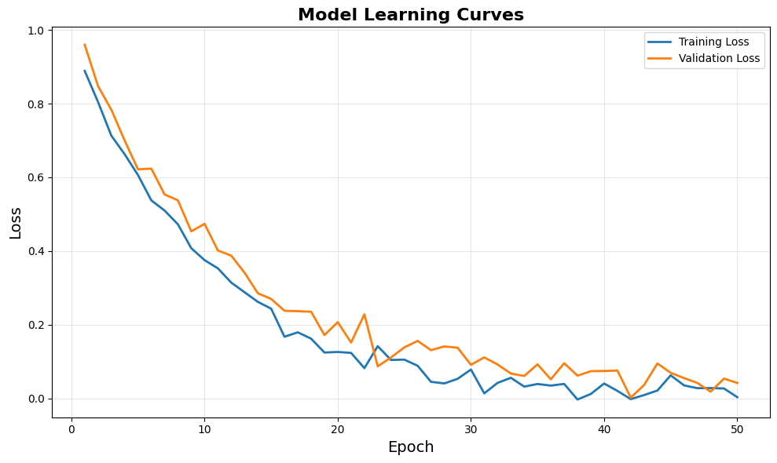

**Q**: When would you use a **line plot** vs. a **bar chart**?

**A**: Line plots show continuous trends (time series, learning curves). Bar charts compare discrete categories. If connecting the dots makes sense conceptually, use a line plot.

### 2. Histogram

A histogram is a graphical representation of a numeric variable's frequency distribution, displayed as a series of adjacent rectangles (**bars**). The bars represent a range of values (called **bins**), and their height indicates the frequency or number of data points that fall within that range.

```python
# Use case: Check if feature is normally distributed
data = np.random.gamma(2, 2, 1000)  # Right-skewed data

fig, axes = plt.subplots(1, 2, figsize=(12, 5))

# Matplotlib histogram
axes[0].hist(data, bins=30, edgecolor='black', alpha=0.7)
axes[0].set_title('Matplotlib Histogram', fontsize=16, fontweight='bold')
axes[0].set_xlabel('Value', fontsize=14)
axes[0].set_ylabel('Frequency', fontsize=14)

# Seaborn histogram with KDE overlay
sns.histplot(data, bins=30, kde=True, ax=axes[1])
axes[1].set_title('Seaborn Histogram + KDE', fontsize=16, fontweight='bold')
axes[1].set_xlabel('Value', fontsize=14)
axes[1].set_ylabel('Frequency', fontsize=14)
plt.tight_layout()
```

**Key Insight:** Always plot distributions before modeling. Many algorithms (linear regression, LDA) assume normality.

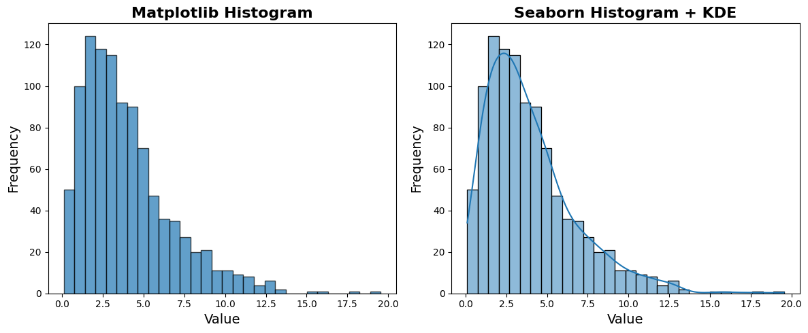

**Q:** How do you choose the number of bins?  
**A:** Use **Sturges' rule**: `bins = int(np.log2(n) + 1)` or **Freedman-Diaconis**: `bins = 2 * IQR * n^(-1/3)`.

> In practice, try 20-50 bins and adjust visually

### 3. Scatter Plot

A scatter plot is a graph that uses dots to represent the relationship between two different variables, with one variable on the horizontal (X) axis and the other on the vertical (Y) axis. It is used to identify patterns, trends, and potential correlations between the variables, such as positive, negative, or no correlation at all.

```python
# Use case: Feature correlation with target
from sklearn.datasets import load_diabetes

data = load_diabetes(as_frame=True)
df = data.frame

fig, axes = plt.subplots(1, 2, figsize=(14, 6))

# Simple scatter
axes[0].scatter(df['bmi'], df['target'], c='darkcyan', alpha=0.5, edgecolor='k', linewidth=0.5)
axes[0].set_xlabel('BMI', fontsize=12)
axes[0].set_ylabel('Disease Progression', fontsize=12)
axes[0].set_title('BMI vs Disease Progression', fontsize=16, fontweight='bold')
axes[0].grid(alpha=0.3)

# Enhanced with regression line
sns.regplot(x='bmi', y='target', data=df, scatter_kws={'alpha':0.3, 'color': 'blue'}, line_kws={'color': 'red', 'linewidth': 3})
axes[1].set_title('BMI vs Disease Progression (with trend)', fontsize=16, fontweight='bold')
axes[1].set_xlabel('BMI', fontsize=12)
axes[1].set_ylabel('Disease Progression', fontsize=12)
axes[1].grid(alpha=0.3)

plt.tight_layout()
```

**Performance:** For >10k points, use `alpha=0.3` or **hexbin** plots to avoid overplotting.

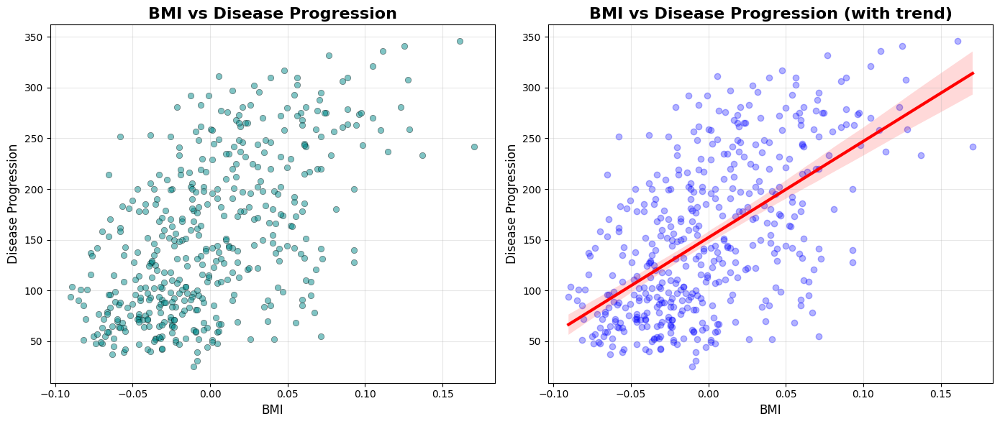

**Q:** When interpreting a scatter plot, what are the three key aspects you look for to describe the relationship between the two variables?

**A:** You look for the **Direction**, **Form**, and **Strength** of the relationship.

* **Direction:** Is the association **positive** (as one variable increases, the other tends to increase) or **negative**?
* **Form:** Is the relationship **linear** (points generally follow a straight line) or **non-linear** (e.g., curved, exponential, or no pattern)?
* **Strength:** How closely do the points follow the form? Is it **strong**, **moderate**, or **weak**? (A strong relationship means the points cluster very tightly around the form/line.)

> You also look for **outliers** (individual points that deviate from the pattern) and **clusters** (distinct groupings of points).

### 4. Box Plot

```python
# Use case: Compare feature distributions across classes
from sklearn.datasets import load_iris

iris = load_iris(as_frame=True)
df = iris.frame
df['species'] = iris.target_names[iris.target]

plt.figure(figsize=(10, 6))
sns.boxplot(data=df, x='species', y='petal length (cm)', hue='species', palette='Set2')
plt.title('Petal Length Distribution by Species', fontsize=14, fontweight='bold')
plt.ylabel('Petal Length (cm)', fontsize=12)
plt.xlabel('Species', fontsize=12)

plt.tight_layout()
```

**Boxplot Anatomy:**
- **Box:** IQR (25th to 75th percentile)
- **Line in box:** Median
- **Whiskers:** 1.5 × IQR from quartiles
- **Points beyond whiskers:** Outliers

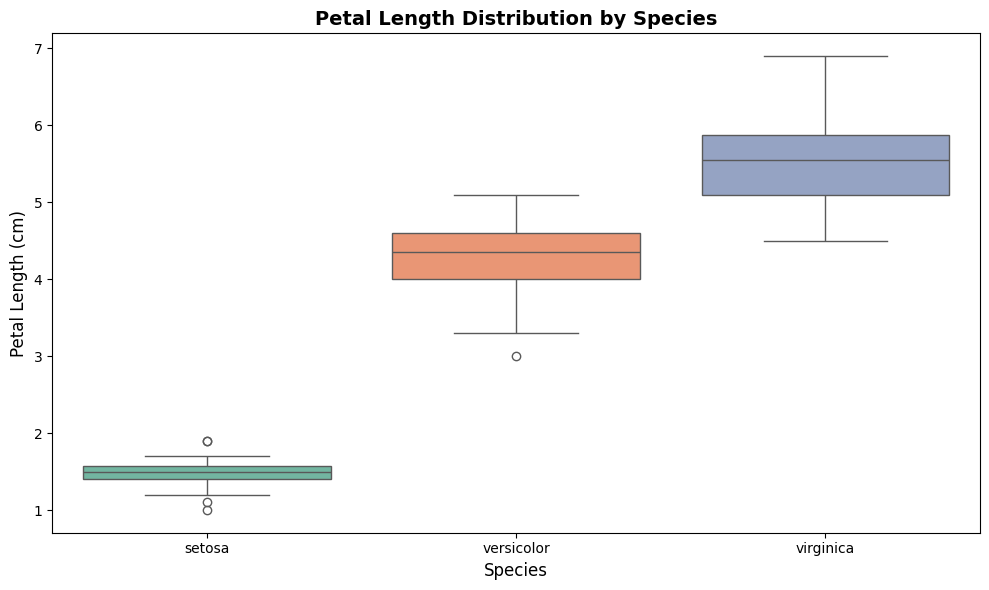

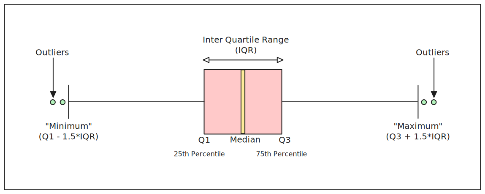

**Q:** How do you decide if outliers should be removed?  
**A:** Never remove outliers blindly. Investigate: (**1**) Are they data errors? → Remove. (**2**) Are they rare but valid? → Keep or use robust methods. (**3**) Use domain knowledge.

---

## Statistical & Analytical Visualization

### 5. Violin Plot

Violin plot (also known as a **bean plot**) is a statistical graphic for comparing probability distributions. It is similar to a box plot, but has enhanced information with the addition of a rotated kernel density plot on each side.

```python
# Use case: Compare distributions with full density information
plt.figure(figsize=(10, 6))
sns.violinplot(data=df, x='species', y='petal width (cm)', hue='species', palette='muted')
plt.title('Petal Width Distributions (Violin Plot)', fontsize=14, fontweight='semibold')
plt.ylabel('Petal Length (cm)', fontsize=12)
plt.xlabel('Species', fontsize=12)

plt.tight_layout()
```

**Violin vs. Box:** Violin plots show full distribution shape (bimodal, skewed), while boxplots focus on quartiles and outliers.

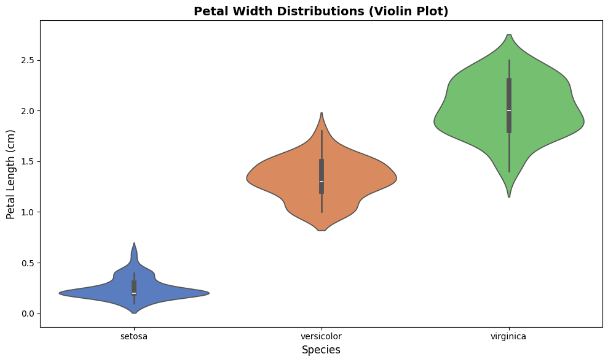

**Q:** What is the primary advantage of using a Violin Plot over a standard Box Plot, and what specific feature allows it to convey this extra information?

**A:** The primary advantage is that a Violin Plot reveals the **full distribution shape** of the data, while a box plot only shows summary statistics.

* The specific feature is the **Kernel Density Estimate (KDE)**, which forms the "violin" shape.
* The **width** of the violin at any given point shows the **density** (concentration) of data points at that value. This is crucial for identifying **multimodal** (multiple peaks) or complex skewed distributions that a box plot would completely hide.

> In practice, use a violin plot when comparing the detailed shape of a numerical distribution across several categories, not just the median and quartiles.

**Q:** When would you use a violin plot instead of a box plot?

**A:** When you need to visualize both the distribution density and quartiles simultaneously.

### 6. Pair Plot

```python
# Use case: Quick overview of all feature relationships
sns.set_context("notebook", font_scale=1.5) # set font size to 1.5 times of normal
sns.pairplot(df, hue='species', palette='deep', markers=["o", "s", "D"], diag_kind='kde', corner=True)
plt.suptitle('Iris Dataset Pair Plot', y=1.02)
```

**Complexity:** For $n$ features, generates $n^2$ plots. Use only for ≤10 features.

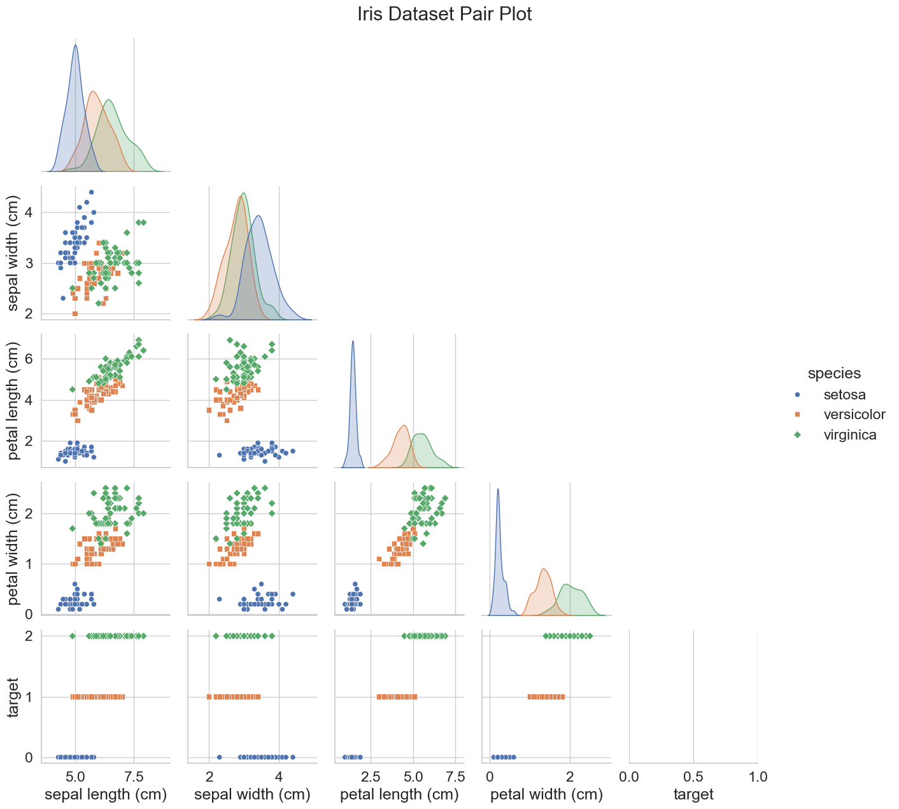

> The upper triangle is a mirror image of the lower triangle, and the diagonal is handled by `diag_kind`.

**Q:** What do you do when you have 50+ features?  
**A:** (**1**) Plot correlation heatmap first. (**2**) Select top features by importance. (**3**) Use dimensionality reduction (PCA) and plot first 2-3 components.

### 7. Heatmap (Correlation Matrix)

A heatmap is a data visualization technique that uses a grid of colored cells to represent the values in a **matrix**. By using color intensity or hue to show magnitude, heatmaps make it easier to identify patterns, trends, and correlations at a glance.

```python
# Use case: Detect multicollinearity
plt.figure(figsize=(10, 8))
corr_matrix = df.select_dtypes(include=[np.number]).corr()

sns.heatmap(corr_matrix, annot=True, fmt='.2f', cmap='coolwarm', 
            center=0, square=True, linewidths=1, cbar_kws={"shrink": 0.8})
plt.title('Feature Correlation Heatmap', fontsize=16, fontweight='bold')
plt.tight_layout()
```

**Interpretation:**
- **|corr| > 0.8:** High correlation → potential multi-collinearity
- **corr close to 0:** Features are independent
- **corr with target:** Indicates predictive power

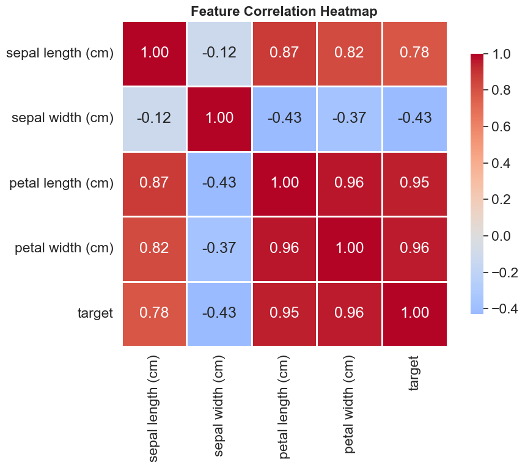

**Q:** What do you do if two features have 0.95 correlation?  
**A:** Consider dropping one (keep the more interpretable), use PCA, or use regularization (Ridge/Lasso) which handles multi-collinearity.

**Q:** Why is correlation heatmap important in data science?
**A:** It helps identify multi-collinearity, redundant features, and relationships crucial for feature engineering.

---

## ML-Specific Visualizations

### 8. Confusion Matrix (Classification Evaluation)

A confusion matrix is a table used to evaluate the performance of a classification model, comparing its predictions to the actual outcomes. It breaks down correct and incorrect predictions into four categories: true positives, true negatives, false positives, and false negatives, which helps in identifying model errors and calculating other performance metrics like accuracy, precision, and recall.

```python
from sklearn.metrics import confusion_matrix, ConfusionMatrixDisplay
from sklearn.model_selection import train_test_split
from sklearn.ensemble import RandomForestClassifier
from sklearn.datasets import load_iris

# Train a classifier
iris = load_iris()
X_train, X_test, y_train, y_test = train_test_split(
    iris.data, iris.target, test_size=0.3, random_state=42
)
clf = RandomForestClassifier(random_state=42)
clf.fit(X_train, y_train)
y_pred = clf.predict(X_test)

# Plot confusion matrix
fig, axes = plt.subplots(1, 2, figsize=(14, 6))

# Method 1: Using sklearn's ConfusionMatrixDisplay
cm_display = ConfusionMatrixDisplay.from_predictions(
    y_test, y_pred, display_labels=iris.target_names, 
    cmap='Blues', ax=axes[0]
)
axes[0].set_title('Confusion Matrix (Counts)', fontsize=16, fontweight='semibold')

# Method 2: Normalized confusion matrix with Seaborn
cm = confusion_matrix(y_test, y_pred, normalize='true')
sns.heatmap(cm, annot=True, fmt='.2%', cmap='Blues', 
            xticklabels=iris.target_names, 
            yticklabels=iris.target_names, ax=axes[1])
axes[1].set_title('Confusion Matrix (Normalized)', fontsize=16, fontweight='semibold')
axes[1].set_ylabel('True Label')
axes[1].set_xlabel('Predicted Label')
plt.tight_layout()
```

**Reading a Confusion Matrix:**

- **True Positive (TP)**: The model correctly predicted a positive outcome (e.g., correctly identified a malware site as malicious). 
- **True Negative (TN)**: The model correctly predicted a negative outcome (e.g., correctly identified a legitimate site as clean). 
- **False Positive (FP)**: The model incorrectly predicted a positive outcome when the actual outcome was negative. Also known as a Type I error (e.g., a legitimate site flagged as malware). 
- **False Negative (FN)**: The model incorrectly predicted a negative outcome when the actual outcome was positive. Also known as a Type II error (e.g., a malware site missed and flagged as clean). 

- **Diagonal:** Correct predictions
- **Off-diagonal:** Misclassifications
- **Row-wise normalization:** Shows recall per class
- **Column-wise normalization:** Shows precision per class

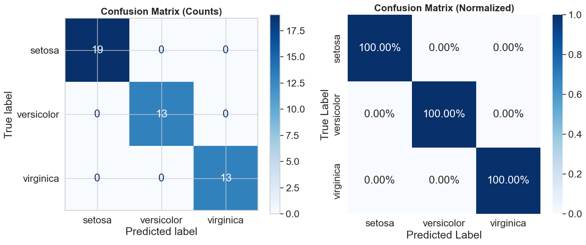

**Q:** Your model has 95% accuracy but stakeholders are unhappy. What visualization would you show?  
**A:** Confusion matrix. High accuracy can hide class imbalance. If the model predicts the majority class 95% of the time, accuracy is misleading. Show per-class precision/recall.

**Common Pitfall:** Never evaluate imbalanced classification with accuracy alone.

### 9. ROC Curve & AUC (Binary Classification)

An AUC-ROC (Area Under Curve (AUC); Receiver Operating Characteristic (ROC) curve) curve is a performance metric for binary classification models that plots the True Positive Rate (TPR) against the False Positive Rate (FPR) at various threshold settings. The area under this curve (AUC) is a single number that summarizes the model's ability to distinguish between positive and negative classes across all possible thresholds. A higher AUC value indicates better performance, with **1.0** being a perfect classifier and **0.5** representing a model that performs no better than random chance

```python
from sklearn.metrics import roc_curve, auc
from sklearn.datasets import make_classification
from sklearn.linear_model import LogisticRegression
from sklearn.model_selection import train_test_split


# Generate binary classification data
X, y = make_classification(n_samples=1000, n_features=20, n_informative=15,
                           n_redundant=5, random_state=42)
X_train, X_test, y_train, y_test = train_test_split(X, y, test_size=0.3, random_state=42)

# Train model and get probability predictions
lr = LogisticRegression(max_iter=1000)
lr.fit(X_train, y_train)
y_proba = lr.predict_proba(X_test)[:, 1]

# Plot ROC curve
fpr, tpr, _ = roc_curve(y_test, y_proba)
roc_auc = auc(fpr, tpr)

plt.figure(figsize=(10, 6))
plt.plot(fpr, tpr, color='darkorange', lw=2, 
         label=f'ROC curve (AUC = {roc_auc:.2f})')
plt.plot([0, 1], [0, 1], color='navy', lw=2, linestyle='--', label='Random Classifier')
plt.xlim([0.0, 1.0])
plt.ylim([0.0, 1.05])
plt.xlabel('False Positive Rate', fontsize=14)
plt.ylabel('True Positive Rate', fontsize=14)
plt.title('Receiver Operating Characteristic (ROC) Curve', fontsize=16, fontweight='bold')
plt.legend(loc="lower right")
plt.grid(alpha=0.3)

plt.tight_layout()
```

**Interpreting AUC:**
- **AUC = 1.0:** Perfect classifier
- **AUC = 0.5:** Random guessing (diagonal line)
- **AUC < 0.5:** Worse than random (predictions inverted)
- **AUC > 0.8:** Generally considered good

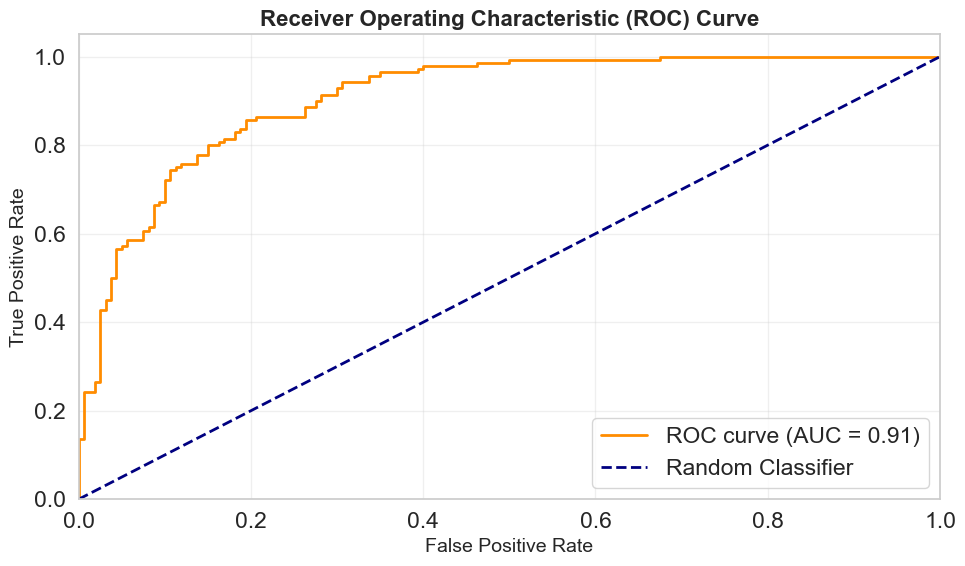

**Q:** When would you use Precision-Recall curve instead of ROC?  
**A:** For highly imbalanced datasets. ROC can be overly optimistic because TN (true negatives) dominate. PR curves focus on the positive class.

In precision - Recall curve we plot precesion on the y-axis against recall on the x-axis for various probability thresholds. This curve helps to visualize the trade-off between precision and recall and is particularly useful for imbalanced datasets.

```python
# Precision-Recall Curve for Imbalanced Data
from sklearn.metrics import precision_recall_curve, average_precision_score

precision, recall, _ = precision_recall_curve(y_test, y_proba)
avg_precision = average_precision_score(y_test, y_proba)

plt.figure(figsize=(10, 6))
plt.plot(recall, precision, color='navy', lw=2,
         label=f'PR curve (AP = {avg_precision:.2f})')
plt.xlabel('Recall', fontsize=14)
plt.ylabel('Precision', fontsize=14)
plt.title('Precision-Recall Curve', fontsize=16, fontweight='bold')
plt.legend(loc="lower left")
plt.grid(alpha=0.3)

plt.tight_layout()
```

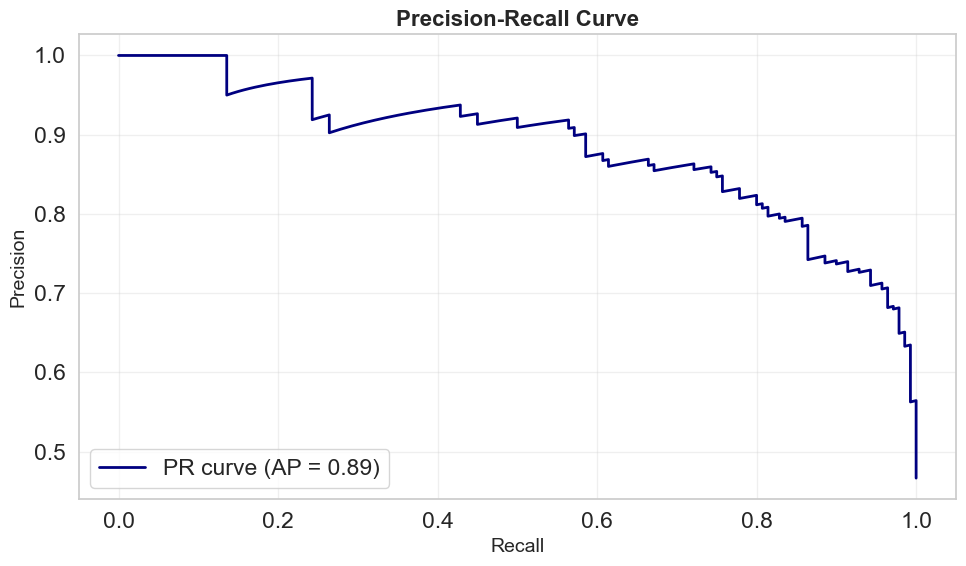

**Q:** Why is the PR curve often preferred over the ROC (Receiver Operating Characteristic) curve, particularly in a real-world scenario like fraud detection or rare disease diagnosis?

**A:** It is preferred over the ROC curve in highly imbalanced datasets, because the ROC curve can provide an overly optimistic view of performance when there is a massive imbalance, a bias the PR curve avoids. A better model will have a curve that remains closer to the top-right corner of the plot (high precision and high recall simultaneously). The Area Under the Curve (AUC-PR or Average Precision, AP) summarizes model performance, with a value closer to 1.0 being better.

### 10. Feature Importance

Techniques that assign a score to input features in a machine learning model to show how useful each feature is in predicting a target variable.

- Using `barh` plot

```python
from sklearn.ensemble import RandomForestClassifier

# Train models
rf = RandomForestClassifier(n_estimators=100, random_state=42)
rf.fit(X_train, y_train)

# Extract feature importance
feature_names = [f'Feature_{i}' for i in range(X.shape[1])]
importances = rf.feature_importances_
indices = np.argsort(importances)[::-1][:10]  # Top 10

# Plot feature importance
plt.figure(figsize=(10, 6))
plt.barh(range(len(indices)), importances[indices], align='center', color=('green', 0.5))
plt.yticks(range(len(indices)), [feature_names[i] for i in indices])
plt.xlabel('Importance Score', fontsize=14)
plt.title('Top 10 Feature Importances (Random Forest)', fontsize=16, fontweight='bold')
plt.gca().invert_yaxis()  # Highest at top
plt.tight_layout()
```

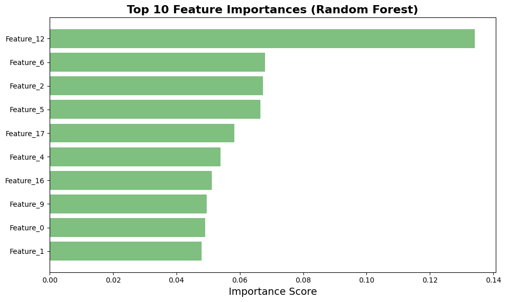

**Advanced: SHAP Values (Better than Feature Importance)**

**SHapley Additive exPlanations**, is a game theory-based method used to explain the output of any machine learning model by assigning an importance value to each feature for a specific prediction.

```python
import shap
from sklearn.ensemble import RandomForestClassifier
from sklearn.datasets import make_classification
from sklearn.model_selection import train_test_split

# Generate data
X, y = make_classification(n_samples=1000, n_features=20, n_informative=15,
                           n_redundant=5, random_state=42)
X_train, X_test, y_train, y_test = train_test_split(X, y, test_size=0.3, random_state=42)

# Train model
rf = RandomForestClassifier(n_estimators=100, random_state=42)
rf.fit(X_train, y_train)

# Feature names
feature_names = [f'Feature_{i}' for i in range(X.shape[1])]

# SHAP explanation
explainer = shap.TreeExplainer(rf)
shap_values = explainer.shap_values(X_test)

# For binary classification with shape (n_samples, n_features, n_classes)
# Select class 1 (positive class)
shap_values_class1 = shap_values[:, :, 1]

# customize the plot
plt.style.use('seaborn-v0_8-darkgrid')

shap.summary_plot(
    shap_values_class1, 
    X_test, 
    feature_names=feature_names,
    max_display=20,
    plot_type="dot", # or "violin", "bar",
    show=False,
    alpha=0.7,
    plot_size=(14, 10)  
)

plt.xlabel('SHAP value (impact on model output)', fontsize=14, labelpad=20)
plt.tick_params(axis='both', which='major', labelsize=14)
plt.title('SHAP Summary Plot', fontsize=16, fontweight='bold', pad=20)
```

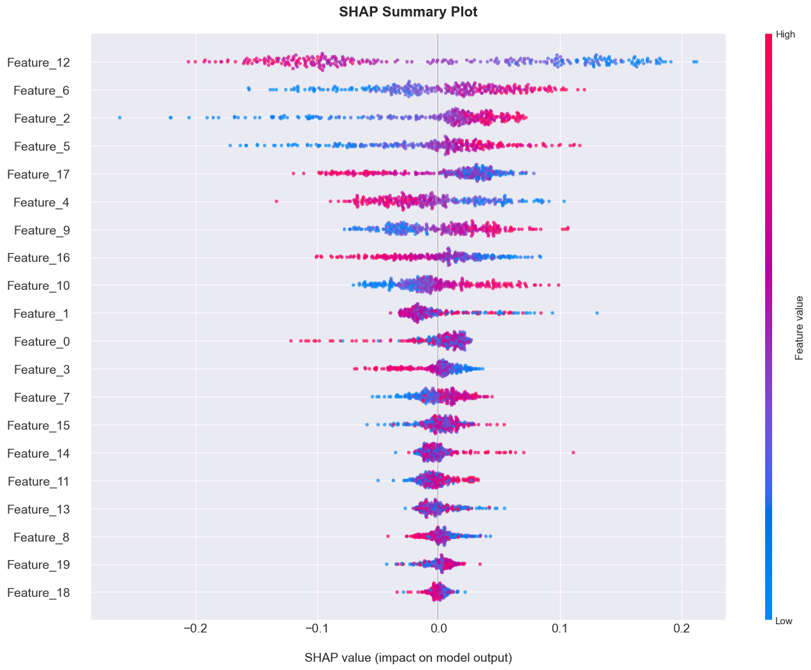

**Q:** What's the difference between feature importance and coefficients in logistic regression?  
**A:** 
- **Coefficients:** Direct effect size; interpretable only if features are standardized
- **Feature importance (tree-based):** Based on split quality; measures predictive power but not direction
- **SHAP values:** Show both magnitude and direction of feature impact on predictions

### 11. Learning Curves (Bias-Variance Diagnosis)

A learning curve is a graphical representation showing how proficiency improves over time with experience, typically with performance on the y-axis and experience on the x-axis. It illustrates that initial learning is often rapid, but the rate of improvement eventually slows and may plateau.

```python
from sklearn.model_selection import learning_curve

# Generate learning curves
train_sizes, train_scores, val_scores = learning_curve(
    RandomForestClassifier(random_state=42), X, y, 
    train_sizes=np.linspace(0.1, 1.0, 10),
    cv=5, scoring='accuracy', n_jobs=-1
)

train_mean = np.mean(train_scores, axis=1)
train_std = np.std(train_scores, axis=1)
val_mean = np.mean(val_scores, axis=1)
val_std = np.std(val_scores, axis=1)

plt.figure(figsize=(10, 6))
plt.plot(train_sizes, train_mean, label='Training score', linewidth=2, color='blue')
plt.fill_between(train_sizes, train_mean - train_std, train_mean + train_std, alpha=0.2, color='blue')
plt.plot(train_sizes, val_mean, label='Cross-validation score', linewidth=2, color='orange')
plt.fill_between(train_sizes, val_mean - val_std, val_mean + val_std, alpha=0.2, color='orange')
plt.xlabel('Training Examples', fontsize=12)
plt.ylabel('Accuracy Score', fontsize=12)
plt.title('Learning Curves', fontsize=14, fontweight='bold')
plt.legend(loc='lower right')
plt.grid(alpha=0.3)
plt.tight_layout()
```

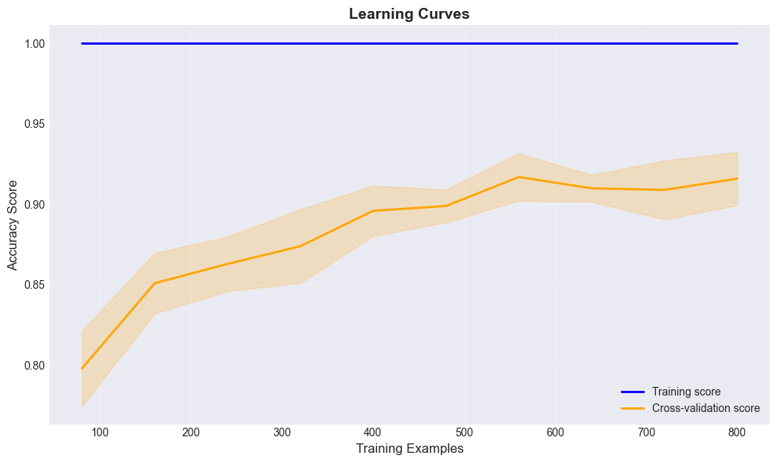

**Diagnosing from Learning Curves:**

| Pattern | Diagnosis | Solution |
|---------|-----------|----------|
| Both curves low and converging | **High bias** (underfitting) | More features, complex model |
| Large gap between curves | **High variance** (overfitting) | More data, regularization, simpler model |
| Training score >> validation score | Overfitting | Reduce model complexity |
| Both curves plateau | Model capacity limit | Try different algorithm |

**Q:** Your validation accuracy is stuck at 70% despite adding more data. What does this mean?  
**A:** The model has reached its capacity (high bias). Need to: (**1**) Add more features, (**2**) Use a more complex model, (**3**) Engineer better features.

### 12. Residual Plots (Regression Diagnostics)

A residual plot is a graph that visually evaluates the fit of a regression model by plotting the residuals (the difference between observed and predicted values) on the vertical axis against the independent variable or predicted values on the horizontal axis.

```python
from sklearn.linear_model import LinearRegression
from sklearn.datasets import make_regression

# Generate regression data with heteroscedasticity
X, y = make_regression(n_samples=500, n_features=1, noise=10, random_state=42)
y = y + X.ravel()**2 * 0.5  # Add non-linearity

# Train model
lr = LinearRegression()
lr.fit(X, y)
y_pred = lr.predict(X)
residuals = y - y_pred

# Create residual plots
fig, axes = plt.subplots(2, 2, figsize=(14, 10))

# 1. Residuals vs Fitted
axes[0, 0].scatter(y_pred, residuals, alpha=0.5, edgecolor='k', linewidth=0.5)
axes[0, 0].axhline(y=0, color='r', linestyle='--', linewidth=2)
axes[0, 0].set_xlabel('Fitted Values', fontsize=11)
axes[0, 0].set_ylabel('Residuals', fontsize=11)
axes[0, 0].set_title('Residuals vs Fitted Values', fontsize=12, fontweight='bold')
axes[0, 0].grid(alpha=0.3)

# 2. Histogram of residuals
axes[0, 1].hist(residuals, bins=30, edgecolor='black', alpha=0.7)
axes[0, 1].set_xlabel('Residuals', fontsize=11)
axes[0, 1].set_ylabel('Frequency', fontsize=11)
axes[0, 1].set_title('Distribution of Residuals', fontsize=12, fontweight='bold')
axes[0, 1].grid(alpha=0.3)

# 3. Q-Q plot (normality check)
from scipy import stats
stats.probplot(residuals, dist="norm", plot=axes[1, 0])
axes[1, 0].set_title('Q-Q Plot', fontsize=12, fontweight='bold')
axes[1, 0].grid(alpha=0.3)

# 4. Scale-Location (homoscedasticity check)
standardized_residuals = np.sqrt(np.abs(residuals / np.std(residuals)))
axes[1, 1].scatter(y_pred, standardized_residuals, alpha=0.5, edgecolor='k', linewidth=0.5)
axes[1, 1].set_xlabel('Fitted Values', fontsize=11)
axes[1, 1].set_ylabel('√|Standardized Residuals|', fontsize=11)
axes[1, 1].set_title('Scale-Location Plot', fontsize=12, fontweight='bold')
axes[1, 1].grid(alpha=0.3)

plt.tight_layout()
```

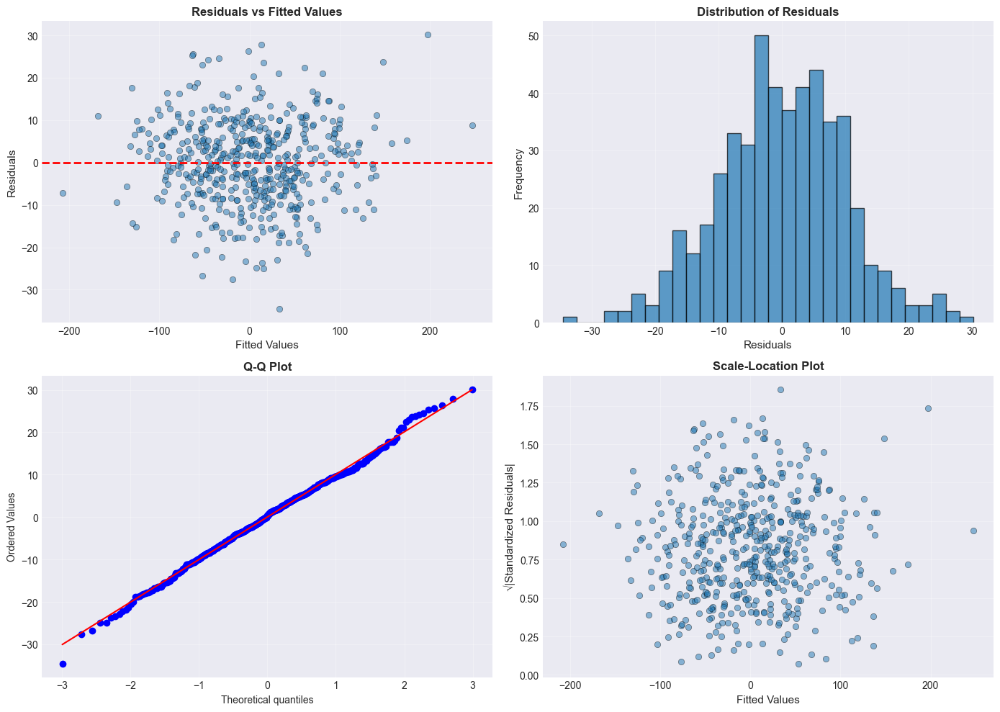

**What to Look For:**

1. **Residuals vs Fitted:**
   - ✅ Random scatter around zero → Good
   - ❌ Pattern (curve, funnel) → Non-linearity or heteroscedasticity

2. **Histogram:**
   - ✅ Bell-shaped → Normality assumption met
   - ❌ Skewed → May need transformation

3. **Q-Q Plot:**
   - ✅ Points on diagonal line → Normal distribution
   - ❌ Deviations → Non-normality (heavy tails, outliers)

4. **Scale-Location:**
   - ✅ Horizontal band → Constant variance (homoscedasticity)
   - ❌ Funnel shape → Heteroscedasticity

Using `Yellowbrick` for visualization

```py
from yellowbrick.regressor import ResidualsPlot
from sklearn.linear_model import LinearRegression
from sklearn.model_selection import train_test_split

X_train, X_test, y_train, y_test = train_test_split(
    X, y, test_size=0.1
)

visualizer = ResidualsPlot(LinearRegression())
# visualizer = ResidualsPlot(LinearRegression(), hist=False, qqplot=True)
visualizer.fit(X_train, y_train)
visualizer.score(X_test, y_test)
visualizer.show()
```

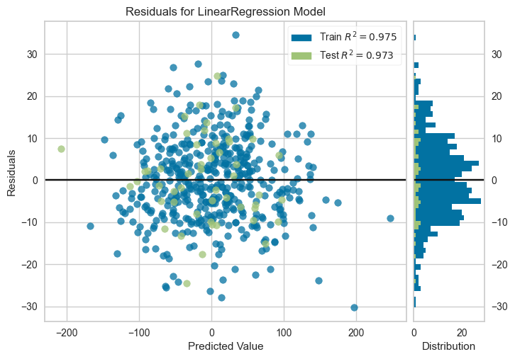

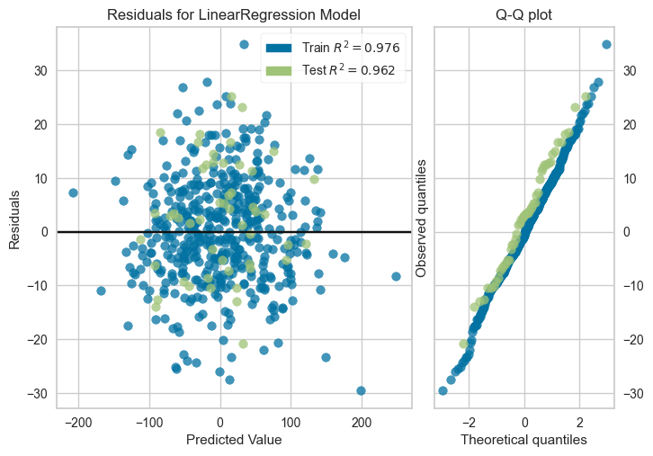

**Q:** Your residual plot shows a clear pattern. What does this mean?  
**A:** The model is missing important information. Solutions: (**1**) Add polynomial features, (**2**) Transform target variable, (**3**) Try non-linear models, (**4**) Add interaction terms.

### 13. Validation Curves (Hyperparameter Tuning)

A validation curve is a graph that plots a model's performance against a range of values for a single hyperparameter. It shows how both the training and validation scores change as a hyperparameter's complexity or value is adjusted, helping to diagnose issues like underfitting or overfitting

```python
# dataset
data = load_iris()
X, y = data.data, data.target

# Analyze impact of max_depth on Random Forest
param_range = np.arange(1, 21)
train_scores, val_scores = validation_curve(
    RandomForestClassifier(n_estimators=50, random_state=42), 
    X, y, param_name="max_depth", param_range=param_range,
    cv=5, scoring="accuracy", n_jobs=-1
)

train_mean = np.mean(train_scores, axis=1)
train_std = np.std(train_scores, axis=1)
val_mean = np.mean(val_scores, axis=1)
val_std = np.std(val_scores, axis=1)

plt.figure(figsize=(10, 6))
plt.plot(param_range, train_mean, label='Training score', linewidth=2, color='blue')
plt.fill_between(param_range, train_mean - train_std, train_mean + train_std, alpha=0.2, color='blue')
plt.plot(param_range, val_mean, label='Cross-validation score', linewidth=2, color='orange')
plt.fill_between(param_range, val_mean - val_std, val_mean + val_std, alpha=0.2, color='orange')
plt.xlabel('Max Depth', fontsize=12)
plt.ylabel('Accuracy Score', fontsize=12)
plt.title('Validation Curve (Random Forest Max Depth)', fontsize=14, fontweight='bold')
plt.legend(loc='best')
plt.grid(alpha=0.3)
plt.tight_layout()
plt.show()
```

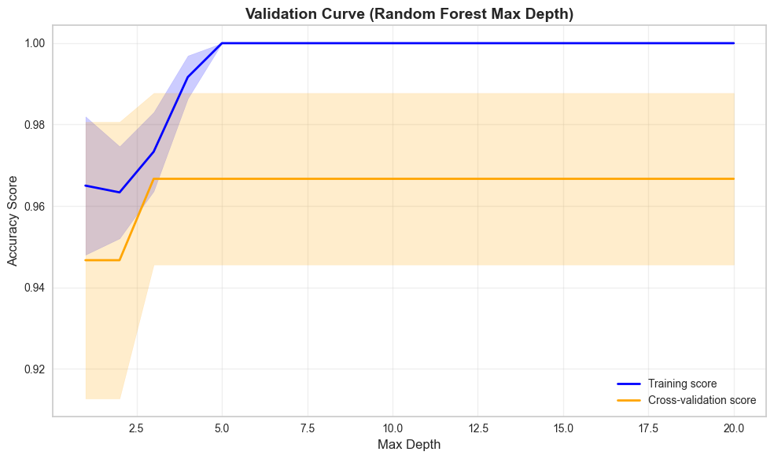

**Interpretation:**
- **Peak in validation curve:** Optimal hyperparameter value
- **Training score keeps increasing, validation plateaus:** Overfitting beyond this point

**Q:** How is a validation curve different from a learning curve?  
**A:** 
- **Learning curve:** Varies training set size (diagnoses bias/variance)
- **Validation curve:** Varies hyperparameter (finds optimal value)

### 14. Class Distribution (Imbalance Check)

Class distribution is the frequency of categories in a dataset, which is important for machine learning and statistical analysis, especially when dealing with imbalanced classes.

```python
# Check for class imbalance
from collections import Counter

class_counts = Counter(y)
classes = list(class_counts.keys())
counts = list(class_counts.values())

fig, axes = plt.subplots(1, 2, figsize=(14, 5))

# Bar chart
axes[0].bar(classes, counts, color='steelblue', edgecolor='black')
axes[0].set_xlabel('Class', fontsize=12)
axes[0].set_ylabel('Count', fontsize=12)
axes[0].set_title('Class Distribution', fontsize=14, fontweight='bold')
for i, v in enumerate(counts):
    axes[0].text(i, v + 10, str(v), ha='center', fontweight='bold')

# Pie chart (use only for 2-5 classes)
axes[1].pie(counts, labels=classes, autopct='%1.1f%%', startangle=90, 
            colors=sns.color_palette('pastel'))
axes[1].set_title('Class Distribution (%)', fontsize=14, fontweight='bold')
plt.tight_layout()
```

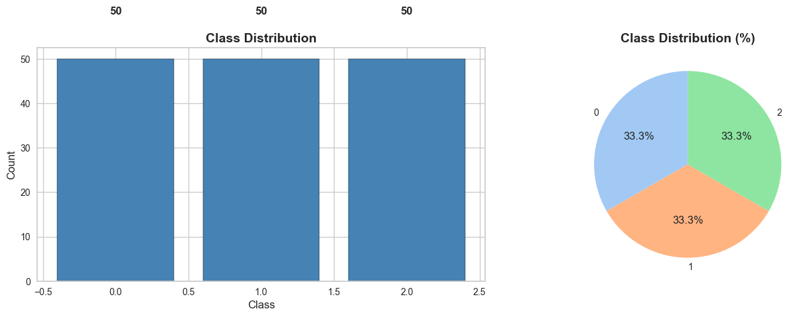

**Imbalance Handling:**
- **Ratio > 1:1.5:** Probably fine
- **Ratio > 1:3:** Consider stratified sampling, class weights
- **Ratio > 1:10:** Use SMOTE, undersampling, or anomaly detection

**Q:** You have 1% positive class. What do you do?  
**A:** (**1**) Use stratified cross-validation, (**2**) Optimize for F1/AUC not accuracy, (**3**) Try class_weight='balanced', (**4**) Consider SMOTE or ensemble methods, (**5**) Collect more positive samples if possible.

---

## Temporal Data Visualizations

Visualizing how data changes over time, helping to reveal patterns, trends, and correlations.

### 15. Time Series Plots (with Moving Averages)

A time series plot with a moving average overlays a smoothed version of the original data to make underlying trends more visible. The raw time series data often contains high-frequency "**noise**" from random or seasonal fluctuations, which can obscure the longer-term trend. 

```python
# Generate time series data
dates = pd.date_range('2023-01-01', periods=365, freq='D')
values = np.cumsum(np.random.randn(365)) + 100  # Random walk
df_ts = pd.DataFrame({'date': dates, 'value': values})

# Calculate moving averages
df_ts['MA_7'] = df_ts['value'].rolling(window=7).mean()
df_ts['MA_30'] = df_ts['value'].rolling(window=30).mean()

plt.figure(figsize=(14, 6))
plt.plot(df_ts['date'], df_ts['value'], label='Daily Values', alpha=0.5, linewidth=1)
plt.plot(df_ts['date'], df_ts['MA_7'], label='7-Day MA', linewidth=2)
plt.plot(df_ts['date'], df_ts['MA_30'], label='30-Day MA', linewidth=2)
plt.xlabel('Date', fontsize=12)
plt.ylabel('Value', fontsize=12)
plt.title('Time Series with Moving Averages', fontsize=14, fontweight='bold')
plt.legend()
plt.grid(alpha=0.3)
plt.tight_layout()
```

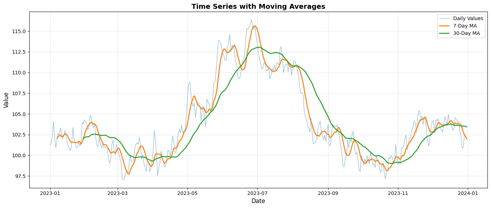

**Q:** How do you visualize seasonality in time series?  
**A:** (1) Seasonal decomposition plot (trend, seasonal, residual), (2) Autocorrelation plot (ACF), (3) Month-wise boxplots, (4) Heatmap (years × months).

### 16. Training Metrics Over Time (Deep Learning)

```python
# Simulated training history
epochs = np.arange(1, 101)
train_loss = 2 * np.exp(-epochs/20) + 0.1 + np.random.normal(0, 0.05, 100)
val_loss = 2 * np.exp(-epochs/20) + 0.3 + np.random.normal(0, 0.08, 100)
train_acc = 1 - 0.9 * np.exp(-epochs/15) + np.random.normal(0, 0.02, 100)
val_acc = 1 - 0.9 * np.exp(-epochs/15) - 0.05 + np.random.normal(0, 0.03, 100)

fig, (ax1, ax2) = plt.subplots(1, 2, figsize=(16, 6))

# Loss curves
ax1.plot(epochs, train_loss, label='Training Loss', linewidth=2)
ax1.plot(epochs, val_loss, label='Validation Loss', linewidth=2)
ax1.set_xlabel('Epoch', fontsize=12)
ax1.set_ylabel('Loss', fontsize=12)
ax1.set_title('Model Loss', fontsize=14, fontweight='bold')
ax1.legend()
ax1.grid(alpha=0.3)

# Accuracy curves
ax2.plot(epochs, train_acc, label='Training Accuracy', linewidth=2)
ax2.plot(epochs, val_acc, label='Validation Accuracy', linewidth=2)
ax2.set_xlabel('Epoch', fontsize=12)
ax2.set_ylabel('Accuracy', fontsize=12)
ax2.set_title('Model Accuracy', fontsize=14, fontweight='bold')
ax2.legend()
ax2.grid(alpha=0.3)

plt.tight_layout()
```

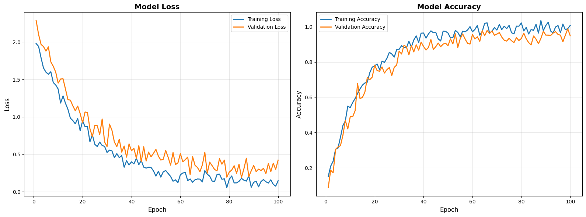

**Red Flags in Training Curves:**
- ❌ Validation loss increases while training loss decreases → Overfitting
- ❌ Both losses plateau early → Underfitting
- ❌ Validation loss oscillates wildly → Learning rate too high or small batch size
- ✅ Validation loss follows training loss closely → Healthy training

**Time series data best practices:**

* Always sort by date.
* Use rolling averages for smooth trends (`pd.Series.rolling()`).
* Use Seaborn’s `lineplot()` for built-in time handling.

---

## Interactive Visualization

| Tool              | Use Case                                  | Strength              |
| ----------------- | ----------------------------------------- | --------------------- |
| **Plotly**        | Interactive, browser-ready visualizations | Integration with Dash |
| **Bokeh**         | Real-time streaming data dashboards       | Web interactivity     |
| **Streamlit**     | Quick ML dashboards with Python           | Simple and fast       |
| **Panel / Voila** | Turn Jupyter notebooks into dashboards    | Notebook-native       |

### 17. Interactive Plots with Plotly (for Dashboards)

**When to use `Plotly` over `Matplotlib`**:

1. Interactive dashboards for stakeholders
2. Exploratory analysis with hover information
3. Sharing HTML reports (no Python needed to view)

```python
from sklearn.datasets import load_iris
import plotly.express as px
import plotly.graph_objects as go

iris = load_iris(as_frame=True)
df = iris.frame
df['species'] = iris.target_names[iris.target]

fig = px.scatter(df, x='sepal length (cm)', y='sepal width (cm)', 
                 color='species', size='petal length (cm)',
                 hover_data=['petal width (cm)'],
                 title='Interactive Iris Dataset Explorer')
fig.update_layout(height=600, font=dict(size=14))
# fig.write_html('iris_plot.html')  # Save for sharing
```

**Interactive Feature Importance:**

```python
# More engaging than static bar charts for presentations
feature_names = [f'Feature_{i}' for i in range(20)]
importances = np.random.rand(20)
df_imp = pd.DataFrame({'Feature': feature_names, 'Importance': importances})
df_imp = df_imp.sort_values('Importance', ascending=True)

fig = go.Figure(go.Bar(
    x=df_imp['Importance'],
    y=df_imp['Feature'],
    orientation='h',
    marker=dict(color=df_imp['Importance'], colorscale='Viridis')
))
fig.update_layout(title='Feature Importance (Interactive)',
                  xaxis_title='Importance Score',
                  height=600, font=dict(size=12))
# fig.show()
```

**Q:** When should you use interactive vs. static plots?  
**A:** 
- **Static (Matplotlib/Seaborn):** Reports, papers, reproducible analysis, large datasets
- **Interactive (Plotly):** Stakeholder presentations, dashboards, exploratory analysis with non-technical users
- **Trade-off:** Interactive plots are larger in size and slower to render

### 18. Multi-Class ROC Curves

- One vs Rest ROC curves for a multi-class classification problem with three classes (0, 1, and 2).

```python
from sklearn.datasets import make_classification
from sklearn.linear_model import LogisticRegression
from sklearn.model_selection import train_test_split
from sklearn.preprocessing import label_binarize
from sklearn.multiclass import OneVsRestClassifier
from sklearn.metrics import roc_curve, auc

# Multi-class classification
X, y = make_classification(n_samples=1000, n_features=20, n_informative=15,
                           n_classes=3, n_clusters_per_class=1, random_state=42)
X_train, X_test, y_train, y_test = train_test_split(X, y, test_size=0.3, random_state=42)

# Binarize labels for multi-class ROC
y_test_bin = label_binarize(y_test, classes=[0, 1, 2])
n_classes = y_test_bin.shape[1]

# Train classifier and get probabilities
classifier = OneVsRestClassifier(LogisticRegression(max_iter=1000))
classifier.fit(X_train, y_train)
y_score = classifier.predict_proba(X_test)

# Compute ROC curve for each class
fpr = dict()
tpr = dict()
roc_auc = dict()

plt.figure(figsize=(10, 8))
colors = ['blue', 'red', 'green']

for i in range(n_classes):
    fpr[i], tpr[i], _ = roc_curve(y_test_bin[:, i], y_score[:, i])
    roc_auc[i] = auc(fpr[i], tpr[i])
    plt.plot(fpr[i], tpr[i], color=colors[i], lw=2,
             label=f'Class {i} (AUC = {roc_auc[i]:.2f})')

plt.plot([0, 1], [0, 1], 'k--', lw=2, label='Random')
plt.xlim([0.0, 1.0])
plt.ylim([0.0, 1.05])
plt.xlabel('False Positive Rate', fontsize=12)
plt.ylabel('True Positive Rate', fontsize=12)
plt.title('Multi-Class ROC Curves', fontsize=14, fontweight='bold')
plt.legend(loc="lower right")
plt.grid(alpha=0.3)
plt.tight_layout()
```

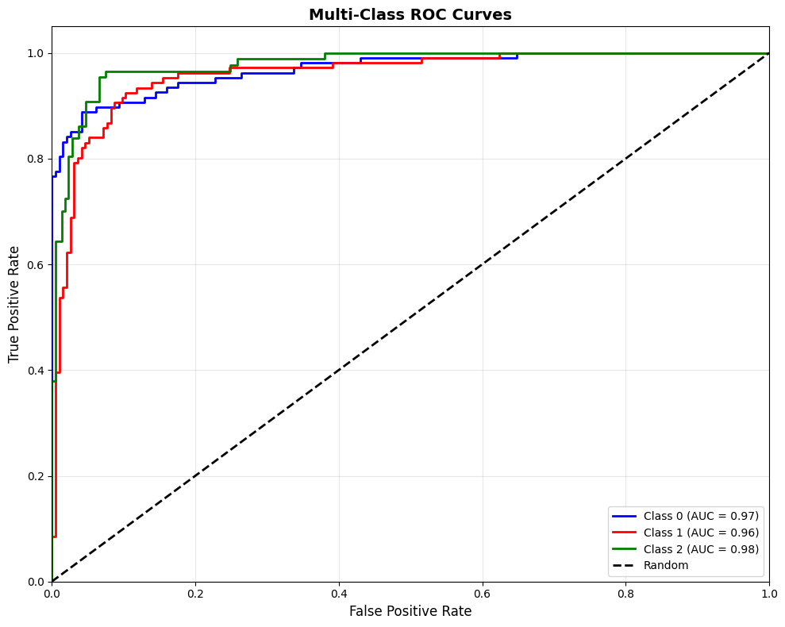

- Its main strength is **diagnostics**. It immediately shows you if the model is good at identifying all classes, or if it struggles with one or two specific classes.

- Look at the position of all curves. A good model will have all its curves "hugging" the top-left corner (TPR = 1, FPR = 0).

- All curves should be significantly above the diagonal line (AUC = 0.5). Any curve near or below this line indicates that the model has no skill

- **Identify the "Weakest Link"**: By comparing the AUC scores for all classes, you can instantly find the model's "problem class." A class with a significantly lower AUC (e.g., 0.95, 0.92, and 0.70) is the one the model finds hardest to separate from the others.

- A steep initial slope is ideal. It means the model can achieve a very high True Positive Rate (find most of the positives) while only incurring a tiny False Positive Rate (making very few false alarms).

### 19. Calibration Curves (Probability Calibration)

A probability calibration curve is a plot that visually assesses how well a classification model's predicted probabilities align with the actual observed frequencies of the positive class. It plots the average predicted probability (x-axis) against the fraction of positive samples in each probability bin (y-axis). A perfectly calibrated model follows a diagonal line, meaning if it predicts a 70% probability, the event actually occurs 70% of the time.

```python
from sklearn.calibration import calibration_curve, CalibrationDisplay

# Check if predicted probabilities are well-calibrated
X, y = make_classification(n_samples=10000, n_features=20, random_state=42)
X_train, X_test, y_train, y_test = train_test_split(X, y, test_size=0.3, random_state=42)

models = {
    'Logistic Regression': LogisticRegression(max_iter=1000),
    'Random Forest': RandomForestClassifier(n_estimators=100, random_state=42),
    'Gradient Boosting': GradientBoostingClassifier(random_state=42)
}

plt.figure(figsize=(10, 8))

for name, clf in models.items():
    clf.fit(X_train, y_train)
    y_proba = clf.predict_proba(X_test)[:, 1]
    
    fraction_of_positives, mean_predicted_value = calibration_curve(
        y_test, y_proba, n_bins=10, strategy='uniform'
    )
    
    plt.plot(mean_predicted_value, fraction_of_positives, 's-', label=name, linewidth=2)

plt.plot([0, 1], [0, 1], 'k--', label='Perfectly Calibrated', linewidth=2)
plt.xlabel('Mean Predicted Probability', fontsize=12)
plt.ylabel('Fraction of Positives', fontsize=12)
plt.title('Calibration Curves', fontsize=14, fontweight='bold')
plt.legend(loc='best')
plt.grid(alpha=0.3)
plt.tight_layout()
```

**Why This Matters:** A model with 70% predicted probability should be correct 70% of the time. Important for decision-making in healthcare, finance.

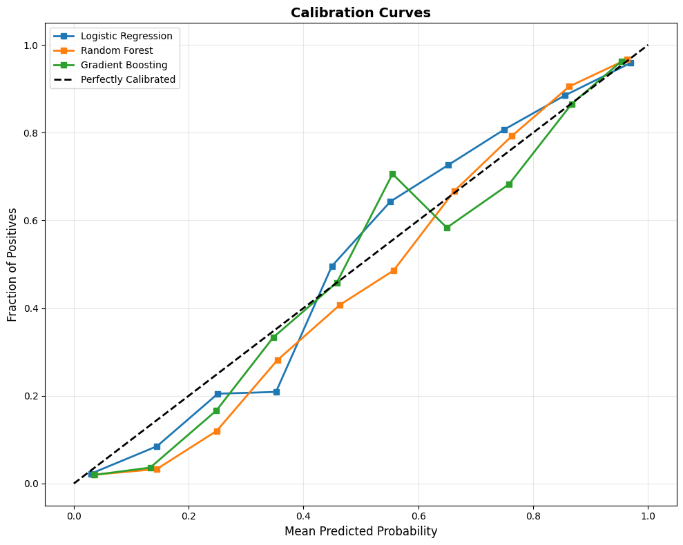

**Q:** Your model has high AUC but poor calibration. What does this mean?  
**A:** The model ranks predictions well (good discrimination) but the probability values are unreliable. **Solution**: Use calibration methods (Platt scaling, isotonic regression).

### 20. Decision Boundaries (2D Visualization)

A decision boundary is a line or surface that separates different classes in a classification model's output. It represents the region where the model's prediction switches from one class to another. 

```python
from sklearn.inspection import DecisionBoundaryDisplay

# Visualize how different models partition feature space
X, y = make_classification(n_samples=200, n_features=2, n_informative=2,
                          n_redundant=0, n_clusters_per_class=1, random_state=42)

models = {
    'Logistic Regression': LogisticRegression(),
    'Random Forest': RandomForestClassifier(n_estimators=50),
    'SVM': SVC(kernel='rbf', gamma=2)
}

fig, axes = plt.subplots(1, 3, figsize=(18, 5))

for ax, (name, clf) in zip(axes, models.items()):
    clf.fit(X, y)
    
    DecisionBoundaryDisplay.from_estimator(
        clf, X, cmap='RdYlBu', alpha=0.5, ax=ax, response_method='predict'
    )
    ax.scatter(X[:, 0], X[:, 1], c=y, cmap='RdYlBu', edgecolor='k', s=50)
    ax.set_title(name, fontsize=14, fontweight='bold')
    ax.set_xlabel('Feature 1', fontsize=11)
    ax.set_ylabel('Feature 2', fontsize=11)

plt.tight_layout()
```

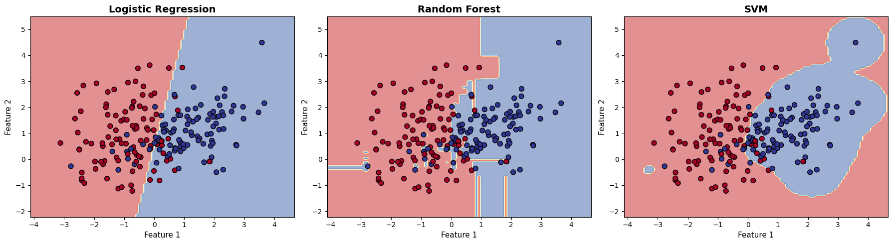

**Use Case:** Explain model behavior to non-technical stakeholders, debug overfitting (overly complex boundaries).

### 21. Geospatial Visualization

Matplotlib supports simple geographic plots using `Basemap` or `GeoPandas`.

```python
import geopandas as gpd
import matplotlib.pyplot as plt

# Download directly from Natural Earth GitHub mirror
url = "https://naciscdn.org/naturalearth/110m/cultural/ne_110m_admin_0_countries.zip"
world = gpd.read_file(url).rename(columns={"ADMIN": "name"})

# Set up figure and axes
fig, ax = plt.subplots(figsize=(14, 8), facecolor="#b3d9ff")  # light blue background for ocean

# Plot the world map
world.plot(ax=ax, color="whitesmoke", edgecolor="dimgray", linewidth=0.6)

# Add country labels (avoid overcrowding — filter by area or known countries)
for idx, row in world.iterrows():
    if row.geometry.centroid.y > -60:  # avoid Antarctica
        # Add only large or well-known countries
        if row["name"] in ["United States", "Brazil", "India", "China", "Russia", "Australia", "Canada"]:
            x, y = row.geometry.centroid.x, row.geometry.centroid.y
            ax.text(x, y, row["name"], fontsize=8, ha="center", color="black", weight="bold")

# Add title and style
ax.set_title("🌍 World Map — Geospatial Context", fontsize=16, weight="bold", pad=20)
ax.set_facecolor("#b3d9ff")  # same as figure background
ax.axis("off")

plt.tight_layout()
plt.show()
```


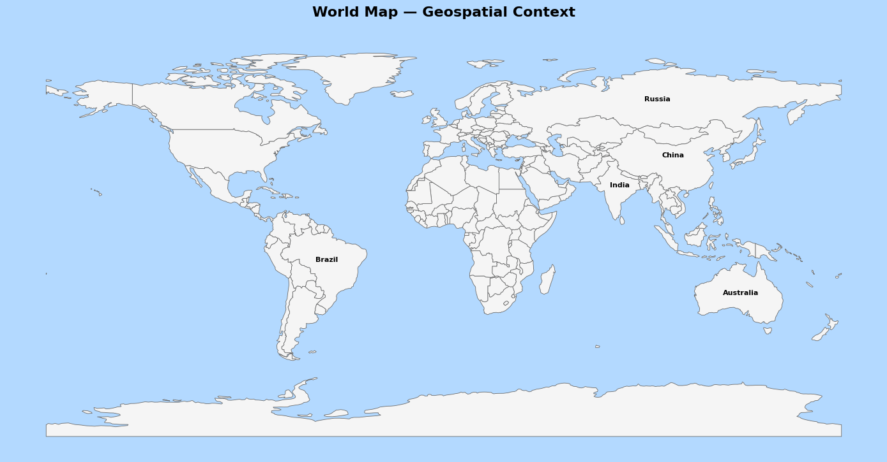

For advanced geospatial analytics: combine with **Folium**, **Plotly**, or **Kepler.gl**.

---

## Design & Communication Principles

1. **The 3-Second Rule** : Can a viewer understand the main message in 3 seconds?
2. Best color practices
    1. **Sequential data (low to high)** : 'Blues', 'Greens', 'Reds', 'viridis'
    2. **Diverging data (negative to positive)** : 'RdBu', 'coolwarm', 'seismic'
    3. **Categorical data** : 'Set2', 'tab10', 'husl'
    4. Avoid 'jet' (rainbow) - misleading and not colorblind-friendly instead use 'viridis', 'plasma' - perceptually uniform
3. Typography, Sizing and Minimal setup

```python
# Professional figure setup
plt.rcParams['figure.figsize'] = (10, 6)
plt.rcParams['font.size'] = 12
plt.rcParams['axes.labelsize'] = 12
plt.rcParams['axes.titlesize'] = 14
plt.rcParams['xtick.labelsize'] = 10
plt.rcParams['ytick.labelsize'] = 10
plt.rcParams['legend.fontsize'] = 11
plt.rcParams['figure.titlesize'] = 16

# For presentations (larger)
plt.rcParams['font.size'] = 16
plt.rcParams['axes.labelsize'] = 18
plt.rcParams['axes.titlesize'] = 20

# clean design
sns.set_style('whitegrid')
plt.plot(data, linewidth=2.5, color='steelblue')
plt.grid(alpha=0.3, linestyle='--')  # Subtle grid
sns.despine()  # Remove top and right spines

# Use golden ratio (1:1.618) for time series
plt.figure(figsize=(12, 7.4))  # ≈ 1.618 ratio
```

---

## Data Visualization Scenarios

### Scenario 1: Imbalanced Classification Results

**Question:** "Your fraud detection model has 99% accuracy but catches only 20% of frauds. How do you visualize this?"

**Answer:**
```python
# Show confusion matrix (normalized)
cm = confusion_matrix(y_test, y_pred, normalize='true')
sns.heatmap(cm, annot=True, fmt='.2%', cmap='Blues')
plt.title('Confusion Matrix: High Accuracy, Low Recall')
plt.ylabel('True Label')
plt.xlabel('Predicted Label')

# Show precision-recall curve
precision, recall, _ = precision_recall_curve(y_test, y_proba)
plt.plot(recall, precision)
plt.xlabel('Recall (True Positive Rate)')
plt.ylabel('Precision')
plt.title('PR Curve Shows Trade-off')

# Key insight: Accuracy is misleading with 1% fraud rate
```

### Scenario 2: Model Comparison

**Question:** "You tested 5 models. How do you present results to executives?"

**Answer:**
```python
# Don't show raw numbers - visualize!
models = ['Logistic\nRegression', 'Random\nForest', 'XGBoost', 'SVM', 'Neural\nNet']
metrics = {
    'Accuracy': [0.82, 0.88, 0.91, 0.85, 0.90],
    'Precision': [0.80, 0.86, 0.89, 0.83, 0.88],
    'Recall': [0.78, 0.84, 0.88, 0.81, 0.87]
}

x = np.arange(len(models))
width = 0.25

fig, ax = plt.subplots(figsize=(12, 6))
for i, (metric, values) in enumerate(metrics.items()):
    ax.bar(x + i*width, values, width, label=metric)

ax.set_ylabel('Score', fontsize=12)
ax.set_title('Model Performance Comparison', fontsize=14, fontweight='bold')
ax.set_xticks(x + width)
ax.set_xticklabels(models)
ax.legend()
ax.set_ylim([0.7, 1.0])
plt.tight_layout()

# Add annotation for recommendation
plt.annotate('Recommended', xy=(2, 0.91), xytext=(2.5, 0.95),
            arrowprops=dict(arrowstyle='->', color='red', lw=2),
            fontsize=12, color='red', fontweight='bold')
```

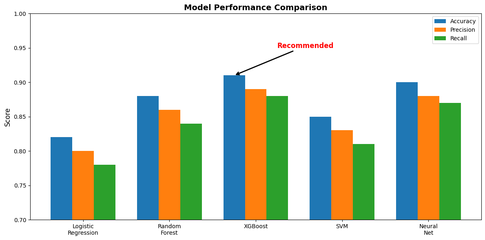

### Scenario 3: Feature Selection Justification

**Question:** "Why did you select these 10 features out of 100?"

**Answer:**
```python
# Show cumulative importance
importances = sorted_feature_importances  # Top 20
cumulative = np.cumsum(importances)

fig, (ax1, ax2) = plt.subplots(1, 2, figsize=(16, 6))

# Bar chart of top features
ax1.barh(range(10), importances[:10])
ax1.set_yticks(range(10))
ax1.set_yticklabels(feature_names[:10])
ax1.set_xlabel('Importance')
ax1.set_title('Top 10 Features')
ax1.invert_yaxis()

# Cumulative importance
ax2.plot(range(len(cumulative)), cumulative, linewidth=2)
ax2.axhline(y=0.95, color='r', linestyle='--', label='95% Threshold')
ax2.axvline(x=10, color='r', linestyle='--', label='10 Features')
ax2.set_xlabel('Number of Features')
ax2.set_ylabel('Cumulative Importance')
ax2.set_title('10 Features Capture 95% of Importance')
ax2.legend()
ax2.grid(alpha=0.3)

plt.tight_layout()
```

### Scenario 4: Explaining Model Failure

**Question:** "Your model performs poorly on new data. Diagnose the issue."

**Answer:**
```python
# Learning curves show the problem
train_sizes, train_scores, val_scores = learning_curve(
    model, X, y, train_sizes=np.linspace(0.1, 1.0, 10), cv=5
)

plt.figure(figsize=(10, 6))
plt.plot(train_sizes, np.mean(train_scores, axis=1), label='Training')
plt.plot(train_sizes, np.mean(val_scores, axis=1), label='Validation')
plt.xlabel('Training Examples')
plt.ylabel('Score')
plt.title('Diagnosis: High Variance (Overfitting)')
plt.annotate('Large gap = Overfitting', 
            xy=(train_sizes[-1], np.mean(train_scores, axis=1)[-1]),
            xytext=(train_sizes[-3], 0.85),
            arrowprops=dict(arrowstyle='->', color='red'),
            fontsize=12, color='red')
plt.legend()

# Solution: Show what happens with regularization
# (Plot learning curves with regularized model showing gap closing)
```

---

## Performance & Scalability

### Handling Large Datasets (>100k points)

```python
# Problem: 1M scatter points takes forever
# ❌ Don't do this:
# plt.scatter(x_large, y_large)  # Will freeze

# ✅ Solution 1: Hexbin plot (density)
plt.hexbin(x_large, y_large, gridsize=50, cmap='Blues', mincnt=1)
plt.colorbar(label='Count')

# ✅ Solution 2: 2D histogram
plt.hist2d(x_large, y_large, bins=100, cmap='Blues')
plt.colorbar(label='Count')

# ✅ Solution 3: Contour plot (KDE)
sns.kdeplot(x=x_large, y=y_large, fill=True, cmap='Blues', levels=20)

# ✅ Solution 4: Downsample intelligently
sample_idx = np.random.choice(len(x_large), size=10000, replace=False)
plt.scatter(x_large[sample_idx], y_large[sample_idx], alpha=0.5)
```

### Rasterization for Complex Plots

```python
# For plots with >10k elements (scatter, lines)
fig, ax = plt.subplots()
ax.scatter(x, y, rasterized=True)  # Converts to bitmap in PDF/SVG
plt.savefig('plot.pdf', dpi=300)  # Smaller file size, faster rendering
```

### Vectorization Tips

```python
# ❌ Slow: Loop through plots
for i in range(len(data)):
    plt.plot(data[i])

# ✅ Fast: Vectorized operations
plt.plot(data.T)  # Plot all columns at once

# ❌ Slow: Multiple subplots with tight_layout in loop
for i in range(10):
    plt.subplot(2, 5, i+1)
    plt.plot(data[i])
    plt.tight_layout()  # Don't call in loop!

# ✅ Fast: tight_layout once at end
for i in range(10):
    plt.subplot(2, 5, i+1)
    plt.plot(data[i])
plt.tight_layout()
```

### Memory Optimization

```python
# Clear figures to free memory (important in loops)
for i in range(100):
    fig, ax = plt.subplots()
    ax.plot(data[i])
    plt.savefig(f'plot_{i}.png')
    plt.close(fig)  # Explicitly close to free memory

# Use context manager
import matplotlib
with matplotlib.rc_context({'figure.max_open_warning': 0}):
    # Your plotting code
    pass
```

### Essential Code Snippets

```python
# Professional plot template
fig, ax = plt.subplots(figsize=(10, 6))
ax.plot(x, y, linewidth=2, color='steelblue')
ax.set_xlabel('X Label', fontsize=12)
ax.set_ylabel('Y Label', fontsize=12)
ax.set_title('Clear Title', fontsize=14, fontweight='bold')
ax.grid(alpha=0.3)
ax.legend(fontsize=11)
plt.tight_layout()
plt.savefig('plot.png', dpi=300, bbox_inches='tight')

# Subplots
fig, axes = plt.subplots(2, 2, figsize=(12, 10))
axes[0, 0].plot(x1, y1)
axes[0, 1].plot(x2, y2)
plt.tight_layout()

# Seaborn style
sns.set_style('whitegrid')
sns.set_palette('husl')
sns.despine()  # Remove top/right spines

# Color palettes
# Sequential: 'Blues', 'viridis'
# Diverging: 'coolwarm', 'RdBu'
# Categorical: 'Set2', 'tab10'
```

### Key Points to Remeber

1. **Always justify chart choice** ("I used a box plot because...")
1. **Explain what you see** ("The gap between training and validation indicates overfitting")
1. **Connect to business impact** ("This 5% AUC improvement translates to $2M in savings")
1. **Know when NOT to visualize** (Don't plot everything; focus on insights)
1. **Discuss trade-offs** (Accuracy vs. Interpretability, Detail vs. Clarity)
1. **Confusion Matrix:** Rows = actual, Columns = predicted
1. **ROC vs. PR:** PR curve for imbalanced data
1. **Learning Curves:** Diagnose bias (both low) vs. variance (large gap)
1. **Residual Plots:** Pattern = model missing information
1. **Feature Importance:** Tree-based ≠ coefficient magnitude
1. **Calibration:** High AUC doesn't mean reliable probabilities
1. **3D plots** often distort perception, obscure patterns, and add complexity without adding insight. Our brains are wired to interpret 3D scenes **spatially**, not **quantitatively**. 3D visualization is justified when the third dimension has genuine meaning (e.g., time, spatial coordinates, or a physically 3D process) (e.g. Showing decision surfaces in 3D feature spaces).

---

**[Matplotlib Notebook](./Matplotlib.ipynb)** & **[Seaborn Notebook](./Seaborn.ipynb)**

<h1 align="center"> End </h1>
