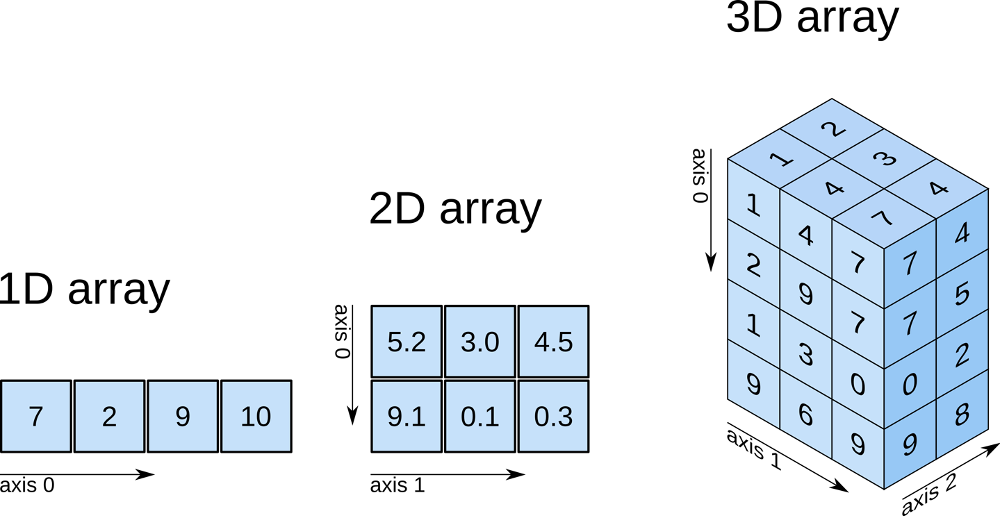
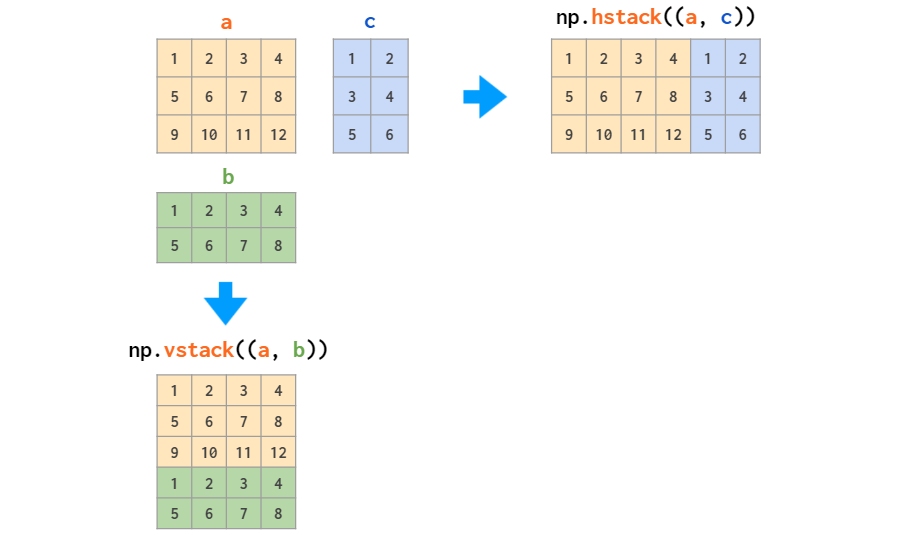

<!-- 
    Author : Kannan Jayachandran
    File : Readme.md (Numpy documentation)
 -->

<h1 align="center"> Numpy </h1>

NumPy (**Numerical Python**) is the foundational library for scientific computing in Python. It provides:

- High-performance multidimensional array objects (`ndarray`) with **Vectorized operations** and **broadcasting** capabilities, allowing efficient operations on arrays of different shapes
- Tools for **linear algebra**, **random number generation**, and **Fourier transforms**

---

## Why `Numpy` ?

Python’s built-in **lists** are flexible but slow for numerical computations. Numpy is essential because:

- **Performance** : NumPy's core routines are written in highly optimized `C/C++/FORTRAN`, making `Numpy` *10-100*x faster than pure Python

- **Memory efficiency** : *Homogeneous Data Storage* and *Contiguous Memory Layout* uses significantly less memory than *Python lists*

## Installation

```bash
pip install numpy
```

---

## `ndarray` Object

The `ndarray` (n-dimensional array) is `NumPy`'s core data structure. It is a **multidimensional** container defined by these key properties:

- **Homogeneous**: All elements must have the same data type, which are native **C** types (`int32`, `float64`, etc.)
- **Fixed-size**: The array's size is determined at creation and cannot grow dynamically
- **Contiguous memory**: Elements are stored in a single, unbroken block of memory, enabling efficient **C**-level operations and better cache utilization.

```py
import numpy as np

# Create a sample array
arr = np.array([[1, 2, 3, 4],
                [5, 6, 7, 8],
                [9, 10, 11, 12]])

# Core attributes
print(f"Array:\n{arr}")
print(f"Shape: {arr.shape}")            # (3, 4) - 3 rows, 4 columns, Tuple of array dimensions
print(f"Dimensions (ndim): {arr.ndim}") # 2 - 2D array, Number of dimensions
print(f"Size: {arr.size}")              # 12 - total elements
print(f"Data type: {arr.dtype}")        # int64 (platform dependent)
print(f"Item size: {arr.itemsize} bytes") # 8 bytes per element
print(f"Total bytes: {arr.nbytes}")     # 96 bytes total
print(f"Strides: {arr.strides}")        # (32, 8) - bytes to next row/col
print("Memory : ", np_arr.data)         # buffer containing actual data 
```

---

## Axes and Rank

- **Axes** → dimensions in an array (like rows and columns), similar to directions
    - **1D array**: 1 axis (axis 0)
    - **2D array**: 2 axes (axis 0 = rows, axis 1 = columns)
    - **3D array**: 3 axes (axis 0 = depth, axis 1 = rows, axis 2 = columns)
- **Rank** → number of axes in the array (`ndim`)



```py
# Understanding axes with examples
arr_1d = np.array([1, 2, 3, 4])
arr_2d = np.array([[1, 2, 3], [4, 5, 6]])
arr_3d = np.array([[[1, 2], [3, 4]], [[5, 6], [7, 8]]])

print(f"1D array - axes: {arr_1d.ndim}, shape: {arr_1d.shape}")
print(f"2D array - axes: {arr_2d.ndim}, shape: {arr_2d.shape}")
print(f"3D array - axes: {arr_3d.ndim}, shape: {arr_3d.shape}")
```

---

## Array Creation

### From Python Lists/Tuples

```py
# 1D array from list
arr1 = np.array([1, 2, 3, 4, 5])
print(f"1D array: {arr1}")

# 2D array from nested lists
arr2 = np.array([[1, 2, 3], [4, 5, 6]])
print(f"2D array:\n{arr2}")

# Explicitly specify data type
arr3 = np.array([1, 2, 3], dtype=np.float64)
print(f"Float array: {arr3}, dtype: {arr3.dtype}")

# From tuple
arr4 = np.array((1, 2, 3, 4))
print(f"From tuple: {arr4}")
```

### Array Generation Functions

#### Using **`arange`**

```py
# Basic usage
arr1 = np.arange(10)                    # 0 to 9
arr2 = np.arange(5, 15)                 # 5 to 14
arr3 = np.arange(0, 10, 2)              # 0, 2, 4, 6, 8
arr4 = np.arange(0, 1, 0.1)             # Supports floats (unlike range)

print(f"arange(10): {arr1}")
print(f"arange(5, 15): {arr2}")
print(f"arange(0, 10, 2): {arr3}")
print(f"arange(0, 1, 0.1): {arr4}")
```

- **Time complexity** : `O(n)`, Where `n` is the number of elements
- **Use case** : When you know step size and need integer or float sequences

#### Using **`linspace`** (Linear spacing)

```py
# Creates evenly spaced numbers over specified interval
arr1 = np.linspace(0, 10, 5)            # 5 points from 0 to 10
arr2 = np.linspace(0, 1, 11)            # 11 points from 0 to 1
arr3 = np.linspace(0, 10, 5, endpoint=False)  # Exclude endpoint

print(f"linspace(0, 10, 5): {arr1}")
print(f"linspace(0, 1, 11): {arr2}")
print(f"linspace(0, 10, 5, endpoint=False): {arr3}")

# Get the step size
arr, step = np.linspace(0, 10, 5, retstep=True)
print(f"Array: {arr}, Step: {step}")
```
- **Time complexity** : `O(n)`
- **Use case** :  Feature engineering, creating time series, plotting, evenly spaced sampling

#### Using **`logspace`** (Logarithmic spacing)

```py
# Creates numbers spaced evenly on a log scale
arr1 = np.logspace(0, 3, 4)             # 10^0 to 10^3, 4 points
arr2 = np.logspace(1, 3, 3, base=2)     # 2^1 to 2^3, 3 points

print(f"logspace(0, 3, 4): {arr1}")
print(f"logspace(1, 3, 3, base=2): {arr2}")
```

- **Use Case**: Hyperparameter tuning (learning rates), signal processing, plotting log scales

### Initialization / Placeholder Arrays

#### Zeros, Ones, empty, and Full Arrays

```py
# Create arrays filled with specific values
zeros_1d = np.zeros(5)
zeros_2d = np.zeros((3, 4))
zeros_int = np.zeros((2, 3), dtype=np.int32)

ones_1d = np.ones(5)
ones_2d = np.ones((2, 3))

uninitialized_arr = np.empty((2, 3))

full_arr = np.full((3, 3), 7)           # Fill with 7
full_pi = np.full((2, 4), np.pi)        # Fill with π

print(f"Zeros 1D: {zeros_1d}")
print(f"Zeros 2D:\n{zeros_2d}")
print(f"Ones 2D:\n{ones_2d}")
print(f"Uninitialized array (Garbage values) :\n{uninitialized_arr}")
print(f"Full (7):\n{full_arr}")
print(f"Full (π):\n{full_pi}")
```

- Use `np.empty` when initialization isn’t needed; it avoids unnecessary zero-filling and its faster than `zeros` and `ones`. One common use case is when you'll immediately overwrite all values (e.g., in loops)

- **Use Case**: Initializing weight matrices, creating masks, padding arrays

#### Identity and Eye Matrices

```py
# Identity matrix (diagonal of ones)
identity = np.eye(4)
print(f"Identity 4x4:\n{identity}")

# Identity with different dimensions
identity_rect = np.eye(3, 5)
print(f"Identity 3x5:\n{identity_rect}")

# Diagonal offset
eye_offset = np.eye(4, k=1)  # Diagonal shifted up by 1
print(f"Eye with k=1:\n{eye_offset}")

# Create diagonal matrix from array
diag_arr = np.diag([1, 2, 3, 4])
print(f"Diagonal from array:\n{diag_arr}")
```

- **Use Case**: Linear algebra operations, covariance matrices, identity transformations

### Arrays from Existing Arrays

```py
# Create arrays with same shape as existing arrays
original = np.array([[1, 2, 3], [4, 5, 6]])

zeros_like = np.zeros_like(original)
ones_like = np.ones_like(original)
empty_like = np.empty_like(original)
full_like = np.full_like(original, 9)

print(f"Original:\n{original}")
print(f"Zeros like:\n{zeros_like}")
print(f"Ones like:\n{ones_like}")
print(f"Full like (9):\n{full_like}")
```

- **Use Case**: Creating matching arrays for element-wise operations, masks, or initializations

### From Functions (`fromfunction`)

```py
# Create array by executing a function over each coordinate
def func(i, j):
    return i + j

arr = np.fromfunction(func, (4, 5), dtype=int)
print(f"Array from function:\n{arr}")

# Create multiplication table
def mult_table(i, j):
    return (i + 1) * (j + 1)

table = np.fromfunction(mult_table, (5, 5), dtype=int)
print(f"Multiplication table:\n{table}")
```

---

## Data Types

`Numpy`'s data type system is based on `C` types for performance

| Type | Description | Example |
| :--- | :--- | :--- |
| **int8, int16, int32, int64** | Signed integers (8, 16, 32, 64 bits) | `np.int32` |
| **uint8, uint16, uint32, uint64** | Unsigned integers | `np.uint8` |
| **float16, float32, float64** | Floating point | `np.float64` |
| **complex64, complex128** | Complex numbers | `np.complex128` |
| **bool** | Boolean (`True`/`False`) | `np.bool_` |
| **object** | Python objects | `np.object_` |
| **string\_, unicode\_** | Fixed-size strings | `np.string_` |

```py
# Exploring data types
int8_arr = np.array([1, 2, 3], dtype=np.int8)
float16_arr = np.array([1.5, 2.5], dtype=np.float16)
bool_arr = np.array([True, False, True], dtype=np.bool_)

print(f"int8: {int8_arr}, size: {int8_arr.itemsize} bytes")
print(f"float16: {float16_arr}, size: {float16_arr.itemsize} bytes")
print(f"bool: {bool_arr}, size: {bool_arr.itemsize} bytes")

# Type info
print(f"\nint8 info: {np.iinfo(np.int8)}")
print(f"float64 info: {np.finfo(np.float64)}")
```

### Type Conversion

```py
# Automatic type promotion
arr1 = np.array([1, 2, 3], dtype=np.int32)
arr2 = np.array([1.5, 2.5, 3.5], dtype=np.float64)
result = arr1 + arr2  # int32 promoted to float64
print(f"int32 + float64 = {result.dtype}: {result}")

# Explicit type casting
float_arr = np.array([1.7, 2.8, 3.9])
int_arr = float_arr.astype(np.int32)  # Truncates decimals
print(f"Float to int: {int_arr}")

# Safe casting check
can_cast = np.can_cast(np.float64, np.int32)
print(f"Can safely cast float64 to int32? {can_cast}")
```

### Memory consideration based on data type

Choosing the right `dtype` can dramatically reduce memory usage. The best practice is to use the **smallest** `dtype` that can represent your data range to optimize memory in large-scale ML applications.

---

## Array Manipulation

### Stacking & Concatenating Arrays

Stacking arrays in `NumPy` involves combining multiple arrays along a new dimension, thereby increasing the dimensionality of the resulting array.



#### Vertical Stacking (`vstack`)

```py
# Stacking arrays vertically (row-wise)
arr1 = np.array([[1, 2, 3]])
arr2 = np.array([[4, 5, 6]])
arr3 = np.array([[7, 8, 9]])

vstacked = np.vstack((arr1, arr2, arr3))
print(f"Vertically stacked:\n{vstacked}")
print(f"Shape: {vstacked.shape}")

# Must have same number of columns
# arr_incompatible = np.array([[1, 2]])  # Would raise error
```

#### Horizontal Stacking (`hstack`)

```py
# Stacking arrays horizontally (column-wise)
arr1 = np.array([[1], [2], [3]])
arr2 = np.array([[4], [5], [6]])
arr3 = np.array([[7], [8], [9]])

hstacked = np.hstack((arr1, arr2, arr3))
print(f"Horizontally stacked:\n{hstacked}")
print(f"Shape: {hstacked.shape}")
```

#### Depth Stacking (`dstack`)

```py
# Stacking arrays depth-wise (along 3rd axis)
arr1 = np.array([[1, 2], [3, 4]])
arr2 = np.array([[5, 6], [7, 8]])

dstacked = np.dstack((arr1, arr2))
print(f"Depth stacked:\n{dstacked}")
print(f"Shape: {dstacked.shape}")
```

#### Concatenate

It joins a sequence of arrays along an existing axis.

```py
# Concatenate along specified axis
arr1 = np.array([[1, 2], [3, 4]])
arr2 = np.array([[5, 6], [7, 8]])

# axis=0 (vertical)
concat_0 = np.concatenate((arr1, arr2), axis=0)
print(f"Concatenate axis=0:\n{concat_0}")

# axis=1 (horizontal)
concat_1 = np.concatenate((arr1, arr2), axis=1)
print(f"Concatenate axis=1:\n{concat_1}")

# 1D concatenation
arr_1d_1 = np.array([1, 2, 3])
arr_1d_2 = np.array([4, 5, 6])
concat_1d = np.concatenate((arr_1d_1, arr_1d_2))
print(f"1D concatenate: {concat_1d}")
```

| Function           | Description                      | Requirement                |
| ------------------ | -------------------------------- | -------------------------- |
| `np.vstack()`      | Stack vertically (row-wise)      | Same columns               |
| `np.hstack()`      | Stack horizontally (column-wise) | Same rows                  |
| `np.dstack()`      | Stack depth-wise                 | Same rows and columns      |
| `

### Splitting Arrays

```py
# Split array into equal parts
arr = np.arange(12).reshape(3, 4)
print(f"Original:\n{arr}\n")

# Horizontal split (split columns)
h1, h2 = np.hsplit(arr, 2)
print(f"Horizontal split 1:\n{h1}")
print(f"Horizontal split 2:\n{h2}\n")

# Vertical split (split rows)
v1, v2, v3 = np.vsplit(arr, 3)
print(f"Vertical split 1:\n{v1}")
print(f"Vertical split 2:\n{v2}")
print(f"Vertical split 3:\n{v3}")
```

### Repeating and Tiling

```py
# Repeat elements
arr = np.array([1, 2, 3])
repeated = np.repeat(arr, 3)
print(f"Repeated: {repeated}")

# Repeat with different counts per element
repeated_var = np.repeat(arr, [2, 3, 1])
print(f"Repeated (variable): {repeated_var}")

# Tile array
arr_2d = np.array([[1, 2], [3, 4]])
tiled = np.tile(arr_2d, (2, 3))  # Repeat 2 times vertically, 3 times horizontally
print(f"Tiled:\n{tiled}")
```

- **Use Case**: Data augmentation, creating batch inputs for neural networks

### Indexing

```py
# 1D indexing
arr = np.array([10, 20, 30, 40, 50])
print(f"arr[0]: {arr[0]}")      # First element
print(f"arr[-1]: {arr[-1]}")    # Last element
print(f"arr[2]: {arr[2]}")      # Third element

# 2D indexing
arr_2d = np.array([[1, 2, 3, 4],
                   [5, 6, 7, 8],
                   [9, 10, 11, 12]])

print(f"\narr_2d[0, 3]: {arr_2d[0, 3]}")     # Row 0, column 3
print(f"arr_2d[1, 2]: {arr_2d[1, 2]}")       # Row 1, column 2
print(f"arr_2d[-1, -1]: {arr_2d[-1, -1]}")   # Last element

# Accessing entire rows/columns
print(f"Row 1: {arr_2d[1]}")                  # Entire row 1
print(f"Column 2: {arr_2d[:, 2]}")            # Entire column 2
```

**Integer array Indexing**

```py
# Select specific elements using integer arrays
arr = np.array([10, 20, 30, 40, 50, 60])
indices = np.array([0, 2, 4])
selected = arr[indices]
print(f"Selected elements: {selected}")

# 2D integer array indexing
arr_2d = np.array([[1, 2, 3],
                   [4, 5, 6],
                   [7, 8, 9]])

# Select specific rows
rows = np.array([0, 2])
selected_rows = arr_2d[rows]
print(f"Selected rows:\n{selected_rows}")

# Select specific elements (row, col pairs)
rows = np.array([0, 1, 2])
cols = np.array([0, 1, 2])
diagonal = arr_2d[rows, cols]
print(f"Diagonal elements: {diagonal}")
```

### Slicing

```py
# 1D slicing
arr = np.arange(10)
print(f"arr[2:7]: {arr[2:7]}")        # Elements from index 2 to 6
print(f"arr[:5]: {arr[:5]}")          # First 5 elements
print(f"arr[5:]: {arr[5:]}")          # From index 5 to end
print(f"arr[::2]: {arr[::2]}")        # Every 2nd element
print(f"arr[::-1]: {arr[::-1]}")      # Reverse array

# 2D slicing
arr_2d = np.array([[1, 2, 3, 4],
                   [5, 6, 7, 8],
                   [9, 10, 11, 12]])

print(f"\nFirst 2 rows:\n{arr_2d[:2]}")
print(f"Last 2 columns:\n{arr_2d[:, -2:]}")
print(f"Center 2x2 block:\n{arr_2d[1:3, 1:3]}")
print(f"Every other element:\n{arr_2d[::2, ::2]}")
```

### Reshaping Arrays

```py
# Reshape 1D to 2D
arr = np.arange(12)
reshaped = arr.reshape(3, 4)
print(f"Original: {arr}")
print(f"Reshaped (3x4):\n{reshaped}")

# Reshape with -1 (automatic dimension calculation)
arr = np.arange(24)
auto_reshape = arr.reshape(4, -1)  # NumPy calculates: 24/4 = 6
print(f"\nAuto reshape (4, -1):\n{auto_reshape}")

# Multiple reshapes
arr = np.arange(24)
reshaped_3d = arr.reshape(2, 3, 4)
print(f"\n3D reshape (2, 3, 4):\n{reshaped_3d}")
```

- **Time Complexity**: `O(1)` if shape is compatible (returns view)
- **Memory**: Reshape returns a view when possible (no copy)

**Reshape vs Resize**

```py
# Reshape: requires compatible dimensions
arr = np.arange(12)
reshaped = np.reshape(arr, (3, 4))  # Works: 12 elements = 3x4
print(f"Reshaped:\n{reshaped}")

# Resize: can change total number of elements
arr = np.arange(6)
resized = np.resize(arr, (3, 4))  # 6 elements -> 12 (repeats pattern)
print(f"\nnp.resize (repeats):\n{resized}")

# ndarray.resize: modifies in place, fills with zeros
arr = np.arange(6)
arr.resize((3, 4))  # Fills extra elements with 0
print(f"\narr.resize (fills with 0):\n{arr}")
```

- `np.resize()` and `ndarray.resize()` behave differently!
    - `np.resize()`: Returns new array, repeats elements
    - `ndarray.resize()`: Modifies in place, fills with zeros

### Flattening Arrays

**Flatten vs Ravel**

```py
# Create 2D array
arr = np.array([[1, 2, 3],
                [4, 5, 6]])

# flatten: always returns a copy
flattened = arr.flatten()
flattened[0] = 999
print(f"Original after flatten[0]=999:\n{arr}")  # Unchanged
print(f"Flattened: {flattened}")

# ravel: returns view when possible (more memory efficient)
arr = np.array([[1, 2, 3],
                [4, 5, 6]])
raveled = arr.ravel()
raveled[0] = 999
print(f"\nOriginal after ravel[0]=999:\n{arr}")  # Changed!
print(f"Raveled: {raveled}")

# ravel order options
arr = np.array([[1, 2, 3],
                [4, 5, 6]])
print(f"\nRavel 'C' order (row-major): {arr.ravel()}")
print(f"Ravel 'F' order (column-major): {arr.ravel('F')}")
```

- `ravel()`: `O(1)` when returns view, **faster**
- `flatten()`: `O(n)` always copies, **safer**

**Best Practice**: Use `ravel()` for performance, `flatten()` when you need a guaranteed copy

### Transpose and Axis manipulation

```py
# Transpose 2D array
arr = np.array([[1, 2, 3],
                [4, 5, 6]])
transposed = arr.T
print(f"Original:\n{arr}")
print(f"Transposed:\n{transposed}")

# Transpose with transpose() method
transposed2 = arr.transpose()
print(f"Using transpose():\n{transposed2}")

# Swapping axes in 3D
arr_3d = np.arange(24).reshape(2, 3, 4)
print(f"\n3D array shape: {arr_3d.shape}")

swapped = np.swapaxes(arr_3d, 0, 2)  # Swap axis 0 and axis 2
print(f"After swapping axes 0 and 2: {swapped.shape}")

# Transpose with specific axis order
transposed_3d = arr_3d.transpose(2, 0, 1)
print(f"Transpose (2,0,1): {transposed_3d.shape}")
```

- **Use Case**: Image processing (changing channel order), matrix operations, reshaping neural network layers

### Adding and Removing Dimensions

```py
# Add new axis using np.newaxis
arr = np.array([1, 2, 3, 4])
print(f"Original shape: {arr.shape}")

# Add axis at different positions
arr_col = arr[:, np.newaxis]  # Column vector
arr_row = arr[np.newaxis, :]  # Row vector
print(f"Column vector shape: {arr_col.shape}")
print(f"Row vector shape: {arr_row.shape}")

# Using expand_dims
arr_expand = np.expand_dims(arr, axis=0)
print(f"Expand dims axis=0: {arr_expand.shape}")

# Squeeze: remove single-dimensional entries
arr_squeezable = np.array([[[1, 2, 3]]])
print(f"\nBefore squeeze: {arr_squeezable.shape}")
squeezed = np.squeeze(arr_squeezable)
print(f"After squeeze: {squeezed.shape}")
print(f"Squeezed: {squeezed}")
```

- **Use Case**: Broadcasting operations, preparing data for neural networks (batch dimensions)

---

## Broadcasting

Broadcasting is a powerful mechanism that allows NumPy to work with arrays of different shapes during arithmetic operations. It extends smaller arrays across larger ones to make their shapes compatible.

### Broadcasting Rules

NumPy compares array shapes element-wise, starting from the **trailing dimensions**:

1. **Rule 1**: If two dimensions are equal, they are compatible
2. **Rule 2**: If one dimension is 1, it can be stretched to match the other
3. **Rule 3**: If dimensions don't exist, prepend 1 to the shape

**Dimensions are compatible when:**
- They are equal, OR
- One of them is 1

```python
# Example 1: Scalar and array
arr = np.array([1, 2, 3, 4])
result = arr + 10
print(f"Array + scalar: {result}")
# Broadcasting: (4,) + () -> (4,) + (1,) -> (4,)

# Example 2: 1D and 2D
arr_2d = np.array([[1, 2, 3],
                   [4, 5, 6]])
arr_1d = np.array([10, 20, 30])
result = arr_2d + arr_1d
print(f"\n2D + 1D:\n{result}")
# Broadcasting: (2,3) + (3,) -> (2,3) + (1,3) -> (2,3)

# Example 3: Column and row vectors
col = np.array([[1], [2], [3]])
row = np.array([10, 20, 30])
result = col + row
print(f"\nColumn + row:\n{result}")
# Broadcasting: (3,1) + (3,) -> (3,1) + (1,3) -> (3,3)

# Example 4: Broadcasting in 3D
arr_3d = np.ones((2, 3, 4))
arr_1d = np.array([1, 2, 3, 4])
result = arr_3d + arr_1d
print(f"\n3D shape: {arr_3d.shape}, 1D shape: {arr_1d.shape}")
print(f"Result shape: {result.shape}")
# Broadcasting: (2,3,4) + (4,) -> (2,3,4) + (1,1,4) -> (2,3,4)
```

### Broadcasting Errors and Solutions

```python
# Example of incompatible shapes
try:
    a = np.ones((3, 4))
    b = np.ones((2, 3))
    result = a + b  # Error: shapes not compatible
except ValueError as e:
    print(f"Error: {e}")

# Solution: Use explicit reshape or newaxis
a = np.ones((3, 4))
b = np.ones((4,))
result = a + b  # Works: (3,4) + (4,) -> (3,4) + (1,4) -> (3,4)
print(f"Solution shape: {result.shape}")

# Common pattern: add bias to each sample in batch
batch = np.random.randn(32, 10)  # 32 samples, 10 features
bias = np.random.randn(10)       # 10 biases
result = batch + bias            # Broadcasts correctly
print(f"Batch + bias shape: {result.shape}")
```

**Key Takeaway**: Broadcasting eliminates explicit loops, leveraging optimized C code for massive performance gains.

[Practical example - Vector Quantization algorithm](https://numpy.org/doc/stable/user/basics.broadcasting.html#a-practical-example-vector-quantization)

---

## Universal Functions (UFuncs)

**UFuncs** are vectorized wrappers for element-wise computation. They are implemented in compiled C code, making them much faster than Python loops.

### Characteristics of UFuncs

1. **Element-wise operation**: Apply function to each element
2. **Broadcasting support**: Automatically handle different shapes
3. **Type casting**: Automatic type promotion
4. **Output allocation**: Can provide output arrays to avoid memory allocation

### Arithmetic UFuncs

```python
# Basic arithmetic operations
a = np.array([1, 2, 3, 4])
b = np.array([10, 20, 30, 40])

print(f"Addition: {np.add(a, b)}")          # a + b
print(f"Subtraction: {np.subtract(a, b)}")  # a - b
print(f"Multiplication: {np.multiply(a, b)}")  # a * b
print(f"Division: {np.divide(b, a)}")       # b / a
print(f"Floor division: {np.floor_divide(b, a)}")  # b // a
print(f"Power: {np.power(a, 2)}")           # a ** 2
print(f"Modulo: {np.mod(b, a)}")            # b % a

# Operator shortcuts
print(f"\nUsing operators:")
print(f"a + b = {a + b}")
print(f"a * 2 = {a * 2}")
print(f"a ** 2 = {a ** 2}")
```

### Comparison UFuncs

```python
a = np.array([1, 2, 3, 4, 5])
b = np.array([5, 4, 3, 2, 1])

print(f"Greater: {np.greater(a, b)}")           # a > b
print(f"Less: {np.less(a, b)}")                 # a < b
print(f"Equal: {np.equal(a, 3)}")               # a == 3
print(f"Not equal: {np.not_equal(a, 3)}")       # a != 3

# Operator shortcuts
print(f"\nUsing operators:")
print(f"a > b: {a > b}")
print(f"a == 3: {a == 3}")
```

### Mathematical UFuncs

```python
# Trigonometric functions
angles = np.array([0, np.pi/6, np.pi/4, np.pi/3, np.pi/2])
print(f"Sine: {np.sin(angles)}")
print(f"Cosine: {np.cos(angles)}")
print(f"Tangent: {np.tan(angles[:4])}")  # Avoid pi/2 for tan

# Exponential and logarithmic
x = np.array([1, 2, 3, 4, 5])
print(f"\nExponential: {np.exp(x)}")
print(f"Natural log: {np.log(x)}")
print(f"Log base 10: {np.log10(x)}")
print(f"Log base 2: {np.log2(x)}")

# Rounding
x = np.array([1.2, 2.5, 3.7, 4.1, 5.9])
print(f"\nRound: {np.round(x)}")
print(f"Floor: {np.floor(x)}")
print(f"Ceil: {np.ceil(x)}")
print(f"Truncate: {np.trunc(x)}")
```

### Statistical UFuncs

```python
# Absolute value and sign
x = np.array([-3, -1, 0, 1, 3])
print(f"Absolute: {np.abs(x)}")
print(f"Sign: {np.sign(x)}")

# Min/Max element-wise
a = np.array([1, 5, 3, 2, 4])
b = np.array([3, 2, 4, 5, 1])
print(f"\nElement-wise maximum: {np.maximum(a, b)}")
print(f"Element-wise minimum: {np.minimum(a, b)}")

# Clipping values
x = np.array([-5, 0, 5, 10, 15])
clipped = np.clip(x, 0, 10)  # Clip to [0, 10]
print(f"Clipped: {clipped}")
```

### Custom UFuncs

```python
# Create custom ufunc using vectorize
def custom_function(x):
    """Custom function: x^2 + 2x + 1"""
    return x**2 + 2*x + 1

# Vectorize the function
vectorized_func = np.vectorize(custom_function)

x = np.array([1, 2, 3, 4, 5])
result = vectorized_func(x)
print(f"Custom ufunc result: {result}")

# Using frompyfunc for more control
def sigmoid(x):
    return 1 / (1 + np.exp(-x))

vectorized_sigmoid = np.frompyfunc(sigmoid, 1, 1)
x = np.array([-2, -1, 0, 1, 2], dtype=float)
result = vectorized_sigmoid(x).astype(float)
print(f"Sigmoid: {result}")
```

**Note**: `vectorize` is convenient but not always faster than Python loops. For performance-critical code, use built-in ufuncs or Numba/Cython.

### Output Arrays for Memory Efficiency

```python
# Preallocate output array to avoid memory allocation
a = np.arange(1000000)
b = np.arange(1000000)

# Without output array (allocates new memory)
result1 = np.add(a, b)

# With output array (reuses memory)
result2 = np.empty_like(a)
np.add(a, b, out=result2)

print(f"Results equal: {np.array_equal(result1, result2)}")

# In-place operations (even more efficient)
a = np.arange(5, dtype=float)
print(f"Original: {a}")
np.multiply(a, 2, out=a)  # Multiply in place
print(f"After multiply: {a}")
```

---

## Aggregation and Statistical Operations

Aggregation functions reduce arrays along specified axes, computing summary statistics essential for data analysis.

### Basic Aggregations

```python
# Create sample data
data = np.array([[1, 2, 3, 4],
                 [5, 6, 7, 8],
                 [9, 10, 11, 12]])

print(f"Data:\n{data}\n")

# Aggregate over entire array
print(f"Sum: {np.sum(data)}")
print(f"Mean: {np.mean(data)}")
print(f"Median: {np.median(data)}")
print(f"Standard deviation: {np.std(data)}")
print(f"Variance: {np.var(data)}")
print(f"Min: {np.min(data)}")
print(f"Max: {np.max(data)}")
```

### Axis-Based Operations

```python
data = np.array([[1, 2, 3, 4],
                 [5, 6, 7, 8],
                 [9, 10, 11, 12]])

# Axis 0: down the rows (column-wise operation)
print(f"Sum along axis 0 (column sums): {np.sum(data, axis=0)}")
print(f"Mean along axis 0: {np.mean(data, axis=0)}")

# Axis 1: across the columns (row-wise operation)
print(f"\nSum along axis 1 (row sums): {np.sum(data, axis=1)}")
print(f"Mean along axis 1: {np.mean(data, axis=1)}")

# Multiple axes
data_3d = np.arange(24).reshape(2, 3, 4)
print(f"\n3D data shape: {data_3d.shape}")
print(f"Sum along axes (0, 2): {np.sum(data_3d, axis=(0, 2))}")
```

**Memory Tip**: 
- `axis=0`: Think "collapse rows" → result has shape `(cols,)`
- `axis=1`: Think "collapse columns" → result has shape `(rows,)`

### Cumulative Operations

```python
data = np.array([1, 2, 3, 4, 5])

print(f"Data: {data}")
print(f"Cumulative sum: {np.cumsum(data)}")
print(f"Cumulative product: {np.cumprod(data)}")

# 2D cumulative operations
data_2d = np.array([[1, 2, 3],
                    [4, 5, 6]])

print(f"\n2D data:\n{data_2d}")
print(f"Cumsum axis 0:\n{np.cumsum(data_2d, axis=0)}")
print(f"Cumsum axis 1:\n{np.cumsum(data_2d, axis=1)}")
```

**Use Case**: Running totals, cumulative returns in finance, prefix sums for algorithms

### ArgMin and ArgMax

```python
# Find indices of min/max values
data = np.array([[23, 17, 31, 14],
                 [89, 12, 65, 43]])

print(f"Data:\n{data}\n")

# Global min/max indices
print(f"Argmin (flattened): {np.argmin(data)}")
print(f"Argmax (flattened): {np.argmax(data)}")
print(f"Min value: {data.flat[np.argmin(data)]}")
print(f"Max value: {data.flat[np.argmax(data)]}")

# Per-axis min/max indices
print(f"\nArgmin axis 0: {np.argmin(data, axis=0)}")
print(f"Argmax axis 0: {np.argmax(data, axis=0)}")
print(f"Argmin axis 1: {np.argmin(data, axis=1)}")
print(f"Argmax axis 1: {np.argmax(data, axis=1)}")

# Convert flat index to 2D coordinates
flat_idx = np.argmax(data)
coords = np.unravel_index(flat_idx, data.shape)
print(f"\nMax value at coordinates: {coords}")
```

**Use Case**: Finding best/worst performing models, nearest neighbors, feature selection

### Statistical Functions

```python
# Comprehensive statistics
data = np.array([12, 15, 18, 21, 24, 27, 30, 33, 36])

print(f"Data: {data}\n")
print(f"Mean: {np.mean(data):.2f}")
print(f"Median: {np.median(data):.2f}")
print(f"Standard deviation: {np.std(data):.2f}")
print(f"Variance: {np.var(data):.2f}")

# Percentiles and quantiles
print(f"\n25th percentile: {np.percentile(data, 25):.2f}")
print(f"50th percentile (median): {np.percentile(data, 50):.2f}")
print(f"75th percentile: {np.percentile(data, 75):.2f}")
print(f"90th percentile: {np.percentile(data, 90):.2f}")

# Quantiles (same as percentiles but in [0, 1])
print(f"\nQuartiles: {np.quantile(data, [0.25, 0.5, 0.75])}")

# Range
print(f"\nRange (max - min): {np.ptp(data)}")  # ptp = peak to peak
```

### Weighted Statistics

```python
# Weighted average (common in ensemble models)
values = np.array([85, 90, 78, 92])
weights = np.array([0.2, 0.3, 0.1, 0.4])

weighted_avg = np.average(values, weights=weights)
print(f"Values: {values}")
print(f"Weights: {weights}")
print(f"Weighted average: {weighted_avg:.2f}")

# Regular average for comparison
regular_avg = np.mean(values)
print(f"Regular average: {regular_avg:.2f}")
```

**Use Case**: Weighted voting in ensemble models, feature importance, portfolio returns

### Boolean Aggregations

```python
# Logical operations on boolean arrays
data = np.array([1, 5, 10, 15, 20, 25, 30])

# Check conditions
greater_than_10 = data > 10
print(f"Data > 10: {greater_than_10}")

# Any: True if ANY element is True
print(f"Any > 10? {np.any(data > 10)}")
print(f"Any > 50? {np.any(data > 50)}")

# All: True if ALL elements are True
print(f"All > 0? {np.all(data > 0)}")
print(f"All > 10? {np.all(data > 10)}")

# Count True values
print(f"\nCount > 10: {np.sum(data > 10)}")
print(f"Percentage > 10: {np.mean(data > 10) * 100:.1f}%")

# Find where condition is True
indices = np.where(data > 10)
print(f"Indices where > 10: {indices}")
print(f"Values where > 10: {data[indices]}")
```

**Use Case**: Data validation, outlier detection, filtering datasets

### Unique and Counting

```python
# Find unique elements
data = np.array([1, 2, 2, 3, 3, 3, 4, 4, 4, 4])

unique_values = np.unique(data)
print(f"Unique values: {unique_values}")

# Get counts of unique values
unique_vals, counts = np.unique(data, return_counts=True)
print(f"\nValue counts:")
for val, count in zip(unique_vals, counts):
    print(f"  {val}: {count}")

# Get indices of unique values
unique_vals, indices = np.unique(data, return_index=True)
print(f"\nFirst occurrence indices: {indices}")

# Get inverse indices (reconstruct original array)
unique_vals, inverse = np.unique(data, return_inverse=True)
print(f"Inverse indices: {inverse}")
print(f"Reconstructed: {unique_vals[inverse]}")
```

**Use Case**: Categorical encoding, frequency analysis, deduplication

---

## Boolean Indexing and Masking

Boolean indexing is a powerful feature that allows you to select array elements based on conditions, essential for data filtering in ML pipelines.

### Basic Boolean Indexing

```python
# Create sample data
data = np.array([10, 25, 30, 15, 40, 5, 35, 20])

# Create boolean mask
mask = data > 20
print(f"Data: {data}")
print(f"Mask (data > 20): {mask}")
print(f"Filtered data: {data[mask]}")

# Direct indexing with condition
filtered = data[data > 20]
print(f"Direct filtering: {filtered}")

# Multiple conditions with logical operators
# & (and), | (or), ~ (not)
mask_complex = (data > 15) & (data < 35)
print(f"\nData between 15 and 35: {data[mask_complex]}")

mask_or = (data < 15) | (data > 35)
print(f"Data < 15 OR > 35: {data[mask_or]}")

mask_not = ~(data > 20)
print(f"Data NOT > 20: {data[mask_not]}")
```

**Important**: Use `&`, `|`, `~` (not `and`, `or`, `not`) and always use parentheses around conditions!

### Boolean Indexing in 2D Arrays

```python
# Student scores: [Math, Physics, Chemistry]
scores = np.array([[85, 78, 92],
                   [67, 88, 73],
                   [92, 84, 89],
                   [74, 69, 81],
                   [88, 91, 95]])

print(f"Scores:\n{scores}\n")

# Find students who scored > 80 in Math (first column)
high_math = scores[:, 0] > 80
print(f"Students with Math > 80:\n{scores[high_math]}")

# Find all scores > 90 (element-wise)
excellent = scores > 90
print(f"\nExcellent scores (>90):\n{scores[excellent]}")

# Count excellent scores per student
excellent_count = np.sum(scores > 90, axis=1)
print(f"\nExcellent scores per student: {excellent_count}")

# Find students with all scores > 75
all_good = np.all(scores > 75, axis=1)
print(f"Students with all scores > 75:\n{scores[all_good]}")
```

### Modifying Values with Boolean Indexing

```python
# Replace values based on condition
data = np.array([10, 25, 30, 15, 40, 5, 35, 20])
print(f"Original: {data}")

# Set all values > 30 to 30 (clipping)
data_copy = data.copy()
data_copy[data_copy > 30] = 30
print(f"Clipped at 30: {data_copy}")

# Increment values that match condition
data_copy = data.copy()
data_copy[data_copy < 20] += 10
print(f"Added 10 to values < 20: {data_copy}")

# Replace with array
data_copy = data.copy()
mask = data_copy > 25
data_copy[mask] = data_copy[mask] * 0.9  # Apply 10% discount
print(f"10% reduction for > 25: {data_copy}")
```

### Using `where` for Conditional Selection

```python
# np.where(condition, value_if_true, value_if_false)
data = np.array([10, 25, 30, 15, 40, 5, 35, 20])

# Replace values: if > 20 then 1, else 0
binary = np.where(data > 20, 1, 0)
print(f"Binary (>20): {binary}")

# Apply different operation based on condition
# If > 25: multiply by 2, else add 5
transformed = np.where(data > 25, data * 2, data + 5)
print(f"Transformed: {transformed}")

# Get indices where condition is True
indices = np.where(data > 25)
print(f"Indices where > 25: {indices[0]}")
print(f"Values where > 25: {data[indices]}")

# 2D example: replace negative values with 0
matrix = np.array([[1, -2, 3],
                   [-4, 5, -6],
                   [7, -8, 9]])
cleaned = np.where(matrix < 0, 0, matrix)
print(f"\nOriginal matrix:\n{matrix}")
print(f"Cleaned matrix:\n{cleaned}")
```

### Masking for Missing Data

```python
# Simulate dataset with missing values (represented as -999)
data = np.array([[85, 90, -999],
                 [78, -999, 88],
                 [92, 85, 90],
                 [-999, 80, 85]])

print(f"Data with missing values:\n{data}\n")

# Create mask for missing values
missing_mask = data == -999
print(f"Missing mask:\n{missing_mask}\n")

# Replace missing values with column mean
data_clean = data.copy().astype(float)
for col in range(data.shape[1]):
    col_data = data[:, col]
    col_mask = col_data != -999
    col_mean = col_data[col_mask].mean()
    data_clean[data_clean[:, col] == -999, col] = col_mean

print(f"After filling with column means:\n{data_clean}")

# Alternative: use np.ma (masked arrays)
masked_data = np.ma.masked_equal(data, -999)
print(f"\nMasked array:\n{masked_data}")
print(f"Column means (ignoring masked): {masked_data.mean(axis=0)}")
```

**Use Case**: Handling missing data, outlier removal, data cleaning pipelines

### Boolean Indexing for Feature Selection

```python
# Feature matrix with correlation to target
X = np.random.randn(100, 10)  # 100 samples, 10 features
y = np.random.randn(100)

# Calculate correlation of each feature with target
correlations = np.array([np.corrcoef(X[:, i], y)[0, 1] for i in range(X.shape[1])])
print(f"Correlations with target: {correlations}")

# Select features with |correlation| > 0.2
feature_mask = np.abs(correlations) > 0.2
print(f"\nFeature mask: {feature_mask}")
print(f"Selected features: {np.where(feature_mask)[0]}")

# Apply feature selection
X_selected = X[:, feature_mask]
print(f"\nOriginal shape: {X.shape}")
print(f"Selected shape: {X_selected.shape}")
```

---

## Sorting and Partitioning

### Basic Sorting

```python
# 1D sorting
arr = np.array([5, 2, 8, 1, 9, 3, 7])
sorted_arr = np.sort(arr)
print(f"Original: {arr}")
print(f"Sorted: {sorted_arr}")

# In-place sorting
arr_copy = arr.copy()
arr_copy.sort()
print(f"In-place sorted: {arr_copy}")

# Descending order
desc_sorted = np.sort(arr)[::-1]
print(f"Descending: {desc_sorted}")
```

### Argsort - Sorting Indices

```python
# Get indices that would sort the array
scores = np.array([85, 92, 78, 95, 88])
students = np.array(['Alice', 'Bob', 'Charlie', 'David', 'Eve'])

# Get sorted indices
sorted_indices = np.argsort(scores)
print(f"Scores: {scores}")
print(f"Sorted indices: {sorted_indices}")
print(f"Students (lowest to highest): {students[sorted_indices]}")

# Descending order
desc_indices = np.argsort(scores)[::-1]
print(f"\nTop 3 students: {students[desc_indices[:3]]}")
print(f"Their scores: {scores[desc_indices[:3]]}")
```

**Use Case**: Ranking, top-k selection, leaderboards

### Sorting 2D Arrays

```python
# Sort along different axes
data = np.array([[5, 2, 8],
                 [1, 9, 3],
                 [7, 4, 6]])

print(f"Original:\n{data}\n")

# Sort each row
sorted_rows = np.sort(data, axis=1)
print(f"Sorted rows:\n{sorted_rows}\n")

# Sort each column
sorted_cols = np.sort(data, axis=0)
print(f"Sorted columns:\n{sorted_cols}\n")

# Sort rows based on first column
row_order = np.argsort(data[:, 0])
sorted_by_first_col = data[row_order]
print(f"Sorted by first column:\n{sorted_by_first_col}")
```

### Partitioning - Fast Top-K Selection

`partition` is faster than full sorting when you only need the k smallest/largest elements.

```python
# Find top 3 elements (doesn't fully sort)
data = np.array([23, 45, 12, 67, 34, 89, 56, 78])

# Partition: elements < k-th are before, elements >= k-th are after
k = 3
partitioned = np.partition(data, k)
print(f"Original: {data}")
print(f"Partitioned at k={k}: {partitioned}")
print(f"3 smallest: {partitioned[:k]}")  # Not sorted, but all < kth element

# Get top 3 (use negative index for largest)
top_3_partitioned = np.partition(data, -3)
print(f"\nPartitioned for top 3: {top_3_partitioned}")
print(f"Top 3 (unsorted): {top_3_partitioned[-3:]}")

# Get indices with argpartition
indices = np.argpartition(data, -3)[-3:]
top_3_sorted = data[indices[np.argsort(data[indices])[::-1]]]
print(f"Top 3 (sorted): {top_3_sorted}")
```

**Time Complexity**:
- `sort`: O(n log n)
- `partition`: O(n) - Much faster!

**Use Case**: Top-k feature selection, finding outliers, nearest neighbors

### Lexicographic Sorting (Multiple Keys)

```python
# Sort by multiple columns
# Data: [Name, Age, Score]
data = np.array([
    ['Alice', 25, 85],
    ['Bob', 30, 92],
    ['Charlie', 25, 78],
    ['David', 30, 88],
    ['Eve', 25, 92]
], dtype=object)

# Sort by Age (ascending), then Score (descending)
# First convert to appropriate types
ages = data[:, 1].astype(int)
scores = data[:, 2].astype(int)

# Use lexsort (sorts by last key first)
indices = np.lexsort((-scores, ages))  # Negative for descending
sorted_data = data[indices]

print("Sorted by Age (asc), then Score (desc):")
for row in sorted_data:
    print(f"{row[0]:8s} Age:{row[1]:2s} Score:{row[2]:2s}")
```

**Use Case**: Multi-criteria ranking, database-like operations

---

## Linear Algebra Operations

### Matrix Multiplication

```python
# Dot product and matrix multiplication
A = np.array([[1, 2], [3, 4]])
B = np.array([[5, 6], [7, 8]])

# Matrix multiplication (modern way)
C = A @ B
print(f"A @ B:\n{C}\n")

# Using np.dot (equivalent for 2D)
C_dot = np.dot(A, B)
print(f"np.dot(A, B):\n{C_dot}\n")

# Matrix-vector multiplication
v = np.array([1, 2])
result = A @ v
print(f"A @ v: {result}")

# Element-wise multiplication (NOT matrix mult)
elementwise = A * B
print(f"\nElement-wise (A * B):\n{elementwise}")
```

### Common Linear Algebra Operations

```python
# Matrix operations
A = np.array([[1, 2], [3, 4]])

# Transpose
print(f"Transpose:\n{A.T}\n")

# Inverse
A_inv = np.linalg.inv(A)
print(f"Inverse:\n{A_inv}\n")
print(f"A @ A_inv:\n{A @ A_inv}")  # Should be identity

# Determinant
det = np.linalg.det(A)
print(f"\nDeterminant: {det}")

# Eigenvalues and eigenvectors
eigenvalues, eigenvectors = np.linalg.eig(A)
print(f"Eigenvalues: {eigenvalues}")
print(f"Eigenvectors:\n{eigenvectors}")

# Matrix rank
rank = np.linalg.matrix_rank(A)
print(f"\nRank: {rank}")

# Trace
trace = np.trace(A)
print(f"Trace: {trace}")
```

---

## Random Module

### Random Number Generation

```python
# Set seed for reproducibility
np.random.seed(42)

# Uniform random numbers [0, 1)
uniform = np.random.rand(5)
print(f"Uniform [0,1): {uniform}")

# Uniform in range [low, high)
uniform_range = np.random.uniform(10, 20, size=5)
print(f"Uniform [10,20): {uniform_range}")

# Random integers
integers = np.random.randint(0, 10, size=5)
print(f"Random integers [0,10): {integers}")

# Standard normal distribution (mean=0, std=1)
normal = np.random.randn(5)
print(f"Standard normal: {normal}")

# Normal with specific mean and std
normal_custom = np.random.normal(loc=100, scale=15, size=5)
print(f"Normal (μ=100, σ=15): {normal_custom}")
```

### Random Sampling

```python
# Random choice from array
data = np.array([10, 20, 30, 40, 50])

# Sample with replacement
sample_with = np.random.choice(data, size=10, replace=True)
print(f"With replacement: {sample_with}")

# Sample without replacement
sample_without = np.random.choice(data, size=3, replace=False)
print(f"Without replacement: {sample_without}")

# Weighted sampling
weights = np.array([0.1, 0.2, 0.3, 0.3, 0.1])
weighted_sample = np.random.choice(data, size=100, p=weights)
print(f"Weighted sample mean: {weighted_sample.mean():.2f}")
```

### Random Permutations and Shuffling

```python
# Permutation: return shuffled copy
arr = np.arange(10)
permuted = np.random.permutation(arr)
print(f"Original: {arr}")
print(f"Permuted: {permuted}")

# Shuffle: in-place shuffling
arr_copy = arr.copy()
np.random.shuffle(arr_copy)
print(f"Shuffled: {arr_copy}")

# Shuffle rows of 2D array
matrix = np.arange(12).reshape(3, 4)
print(f"\nOriginal matrix:\n{matrix}")
np.random.shuffle(matrix)
print(f"Shuffled rows:\n{matrix}")
```

---

## Advanced Topics

### Views vs Copies

Numpy saves memory whenever possible by directly using a `View` instead of passing copies. It does this by accessing the internal data buffer. A `View` can be created using `ndarray.view()` or by slicing an array. Although this enures good performance, it can become a problem if we accidentally modify the original array. Also this put limitations on performing operations on the array. For example, we cannot reshape a view.

`np.base` returns the base object of the array. If the array is a view then it will return the original array, if it is a copy then it will return `None`.

```python
# View: references same memory
arr = np.arange(10)
view = arr[::2]
view[0] = 999
print(f"Original after view modification: {arr}")

# Check if view
print(f"Is view? {view.base is arr}")

# Copy: independent memory
arr = np.arange(10)
copy = arr[::2].copy()
copy[0] = 999
print(f"Original after copy modification: {arr}")
```

### Structured Arrays

Structured arrays are nd-arrays whose datatype is a composition of simpler data types organized as a sequence of named fields. They are designed to mimic `structs` in C. They are useful for reading binary files with fixed length records.

```python
# Define structured dtype
dt = np.dtype([('name', 'U10'), ('age', 'i4'), ('score', 'f4')])

# Create structured array
data = np.array([('Alice', 25, 85.5),
                 ('Bob', 30, 92.0),
                 ('Charlie', 28, 78.5)], dtype=dt)

print(f"Structured array:\n{data}")
print(f"\nNames: {data['name']}")
print(f"Ages: {data['age']}")
print(f"Mean score: {data['score'].mean():.2f}")

# Sort by score
sorted_data = np.sort(data, order='score')
print(f"\nSorted by score:\n{sorted_data}")
```

### Masked Arrays

Masked arrays are nd-arrays that have a `mask` property. The mask property is a boolean array that determines whether the corresponding element in the array is valid or not. The mask property can be used to filter out invalid values.

```python
# Handle invalid/missing data
data = np.array([1, 2, -999, 4, -999, 6])
masked_data = np.ma.masked_equal(data, -999)

print(f"Masked array: {masked_data}")
print(f"Mean (ignoring masked): {masked_data.mean():.2f}")
print(f"Valid data: {masked_data.compressed()}")
```

---

## Performance Optimization

### Memory-Efficient Operations

```python
# Use in-place operations
arr = np.arange(1000000, dtype=float)

# Creates new array (uses more memory)
result = arr * 2

# In-place (memory efficient)
arr *= 2

# Use appropriate dtype
large_int = np.ones(1000000, dtype=np.int64)
small_int = np.ones(1000000, dtype=np.int8)

print(f"int64: {large_int.nbytes / 1e6:.2f} MB")
print(f"int8:  {small_int.nbytes / 1e6:.2f} MB")
```

---

## Notebooks

- [Notebook - 1](./Numpy-I.ipynb)
- [Notebook - 2](./Numpy-II.ipynb)
- [Notebook - 3](./Numpy-III.ipynb)
- [Exercise notebook](./Exercises.ipynb)

---

## References

- [NumPy Documentation](https://numpy.org/doc/stable/)
- [NumPy Tutorials](https://numpy.org/numpy-tutorials/)
