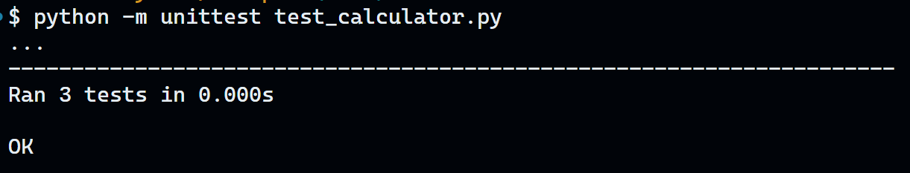

# Test Driven Development (TDD)

TDD is a software development process that relies on the repetition of a very short development cycle: requirements are turned into very specific test cases, then first we write the test cases and then we write the bare minimum code to pass the test cases.

Here we will demonstrate the TDD process by writing a simple calculator program.

## Step 1: Create the calculator class

```python
class Calculator:

    def add(self, x, y):
        pass
```

## Step 2: Write a test case

```python
# Valid inputs should return the sum of the two numbers
def test_add_valid_numbers(self):
        result = self.calculator.add(10, 40)
        self.assertEqual(10 + 40, result)
        result = self.calculator.add(10.5, 20.9)
        self.assertEqual(10.5 + 20.9, result)

# Invalid inputs should raise a TypeError
def test_add_invalid_numbers_raises_type_error(self):
    self.assertRaises(TypeError, self.calculator.add, "Hello", "World")
    self.assertRaises(TypeError, self.calculator.add, 100, "World")
    self.assertRaises(TypeError, self.calculator.add, "Hello", 2)
    self.assertRaises(TypeError, self.calculator.add, "10.5.4", 2)
    self.assertRaises(TypeError, self.calculator.add, 10, "5.11.2")

# Valid string numbers should return the sum of the two numbers
def test_add_valid_string_numbers_return_sum(self):
    result = self.calculator.add("10", "20")
    self.assertEqual(10 + 20, result)

    result = self.calculator.add(10, "20")
    self.assertEqual(10 + 20, result)

    result = self.calculator.add("10", 20)
    self.assertEqual(10 + 20, result)
```

First run:


## Step 3: Write the code to pass the test

```python
class Calculator:

    def add(self, x, y):
        # Check if x and y are strings representing valid integers
        if isinstance(x, str) and x.isdigit():
            x = int(x)
        if isinstance(y, str) and y.isdigit():
            y = int(y)

        # Check for valid types
        if not isinstance(x, (int, float)) or not isinstance(y, (int, float)):
            raise TypeError("Invalid input type")

        return x + y

```

