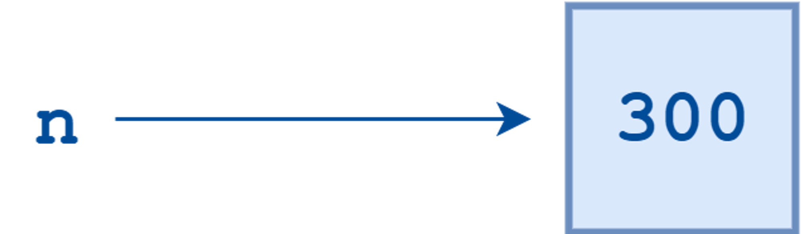
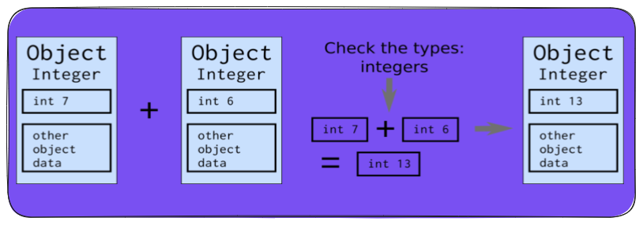

<h1 align="center" > Python Programming </h1>

Python is a `open source`, `high-level`, `interpreted`, and `general-purpose` programming language. Python is both `dynamically-typed` (Type determined at runtime). It is also a `garbage-collected` language. Python supports multiple programming paradigms, which includes `procedural`, `object-oriented` and `functional`.

## Variables in Python

Every variables in python is a reference ($\color{FEC260} \tt \text{ like a  pointer}$) to an object. if we write $\color{FEC260}n = 300$ we are creating an integer object with value 300 and bind the variable $\color{FEC260}n $ to this object. Each object created would have unique id’s {$\color{FEC260} \tt \text{ the memory address }$}, which we can see using the $\tt\color{FEC260}id()$ function. Everything in python is  an object { variables, functions, modules }.

<p align="center"></p>

<p align="center"></p>

> Dynamic memory allocation in the heap

Usually if we have two or more objects containing same value, what python does is that it would bind all those variables to the same object; in order to save memory, it won’t create multiple objects. Now if we do something like $\color{FEC260}n \;= \;``foo"$ , python would create a string object $\color{FEC260} foo$ and bind $\color{FEC260}n$ with it. Now the integer object $\color{FEC260}300$ is orphan and garbage collector would remove it. 

In python an object is eligible for garbage collection if the number of reference to that object is $\color{FEC260}0$. We can use $\tt\color{FEC260}del$ keyword to delete an object. (_`del` keyword actually decrement the number of reference to the object by one and garbage collector would ultimately remove it_).

## Memory Management in Python

Most programming languages share objects or data by the following two methods:

- **Pass by value** → A copy of the actual argument is passed.

- **Pass by reference** → The argument itself (its memory address) is passed. 

Python uses something different, which is called **Pass by object reference**.

- **Pass by object reference / Pass by assignment** → Every thing is an object in python including primitives and other complex data structures (i.e. both mutable and immutable). When you pass an argument to a function, Python passes the reference (**a kind of pointer to the memory address where the object is stored**) to the object, not the actual object itself. The effect of this depends on whether the object is mutable or immutable. If you pass an immutable object to a function and try to change it, Python creates a new object instead of modifying the existing one. If you pass a mutable object to a function and change it, the object is modified in place.

The fact that everything is an object also means that there is a lot of  $\color{FEC260}\texttt{unboxing}$ and  $\color{FEC260}\texttt{boxing}$ involved when Python performs operations with variables. For example while adding two integers;

```python
a = 10
b = 20

c = a + b
```

**Behind the scene python performs several steps;**

- **Check the types of both operands**

- **Check whether they both support the $\color{gold}+$ operation**

- **Extract the function that performs the $\color{gold}+$ operation**

- **Extract the actual values of the objects**

- **Perform the $\color{gold}+$ operation**

- **Construct a new integer object for the result**



Unless we do some sort of optimization or _`Cythonize`_ our python code; every time two variables are added python needs to perform all the above steps.

```python
# cython code for adding two integers
cpdef def add (int x, int y):
 cdef int result
 result = x + y
 return result
 ```

- Python's memory allocation and de-allocation method is automatic. The Python memory manager internally ensures the management of the Python heap.

## Data Types

Python has the following data types built-in by default, in these categories:

- **Text Type**: `str`
- **Numeric Types**: `int`, `float`, `complex`
- **Sequence Types**: `list`, `tuple`, `range`
- **Mapping Type**: `dict`
- **Set Types**: `set`, `frozenset`
- **Boolean Type**: `bool`
- **Binary Types**: `bytes`, `bytearray`, `memoryview`

- For purposes of optimization, the interpreter creates objects for the integers in the range $\color{FEC260}[-5, \;256]$ at startup, and then reuses them during program execution. Thus, when you assign separate variables to an integer value in this range, they will actually reference the same object created earlier. (The numbers from -5 to 256 are found to be used the most). 

We generally won't face integer overflow in python as it can handle arbitrarily large numbers. Python internally uses a data structure called `long` to store large numbers.

## Operators

Python language supports the following types of operators.

- **Arithmetic Operators**

- **Comparison (Relational) Operators**: `==`, `!=`, `>`, `<`, `>=`, `<=`

- **Assignment Operators**: `=`, `+=`, `-=`, `*=`, `/=`, `%=`, `//=`, `**=`

- **Logical Operators**: `and`, `or`, `not`

- **Bitwise Operators**: `&`, `|`, `^`, `~`, `<<`, `>>`

- **Membership Operators**: `in`, `not in`

- **Identity Operators**: `is`, `is not`

- **Ternary Operator**: `a if condition else b`
> Not really ternary operator, but a small hack to achieve the same.

## Python Keywords


## Conditional Statements

Python supports the usual logical conditions:

- **if** statement

- **elif** statement

- **else** statement

- **Nested if** statement

## Loops

Python has two primitive loop commands:

- **while** loops

- **for** loops

We can use the `break` statement to stop the loop before it has looped through all the items, and the `continue` statement to stop the current iteration of the loop, and continue with the next.

Python loops also have something like $\color{FEC260}for→else$ and $\color{FEC260}while→else$ which is executed when the loop is finished without a `break` statement.

## Functions

Like other programming languages, Python also supports functions. A function is a block of code that only runs when it is called. We use the `def` keyword to define functions in Python.

- In python all the function calls resides inside the stack memory. For storing all the objects, we have the heap memory. Heap is larger in size than the stack. The actual data is stored inside heap while stack stores the references. 

- Python functions can return multiple values. It is done by returning a tuple.

- A `parameter` is a variable in a method definition. When a method is called, the `arguments` are the data you pass into the method's parameters.

**[Functions Notebook](./Notebooks/8_Functions.ipynb)**

### Lambda Functions

Lambda functions are small anonymous functions. They can have any number of arguments but only one expression. The expression is evaluated and returned. Lambda functions can be used wherever function objects are required.

## String

Strings in Python are immutable sequences of Unicode code-points/ arrays or bytes representing unicode characters. Strings are ordered, indexed, and can contain duplicate elements. They are also iterable. We can slice and use the membership operator in strings.

**[String Notebook](./Notebooks/7_String.ipynb)**

## Built-in Containers

### List

Python lists are heterogeneous, mutable built-in data structures. Lists are indexed, dynamic and allows duplicate elements. Most of the operations on a list takes $\color{FEC260}O(1)$ or $\color{FEC260}O(n)$ time complexity. Lists has a powerful mechanism to create new lists from other iterable (list, tuple, strings, etc.) called List comprehension. Lists are ordered also. Lists are superset of arrays.

- During list slicing, we are creating a new list object. We can use the slicing technique in other python data structures like tuple, string, etc.

- List comprehension is an elegant way to generate new lists form existing ones. Internally python would run a loop to do this, hence the complexity of comprehension would be similar to the iterative implementation. 

**[List Notebook](./Notebooks/3_List.ipynb)**

### Tuple

Tuples are basically immutable or read-only lists. The tuple stores items as reference, hence the tuple is immutable not the items; i.e. we can change the contents of a list inside a tuple but we cannot change the item in the tuple. 

- Tuples are generally faster than lists because they are immutable. 

**[Tuple Notebook](./Notebooks/4_Tuple.ipynb)**

### Set

Set is an unordered data structure in python, where every item is unique and immutable, however the set itself is mutable. Set allows fast insertion, deletion and searching. 

- We can insert, delete, and search a list in amortized  $\color{gold}O(1)$ time complexity. 

- Set uses hashing under the hood and that’s how it achieves that $\color{gold}O(1)$ time complexity. 

- Set also supports different set (Mathematical set) operations like Union, Intersection, Difference, Symmetric difference, etc. 

- Sets are also highly optimized for membership tests, it can do membership test in $\color{gold}O(1)$ (amortized).

**[Set Notebook](./Notebooks/6_Set.ipynb)**

### Dictionary

A dictionary is a collection of key-value pairs. They are generally unordered, indexed, and mutable. The key is used to access the value and the key must be unique (immutable objects). The value can be any data type. Under the hood dictionaries also use hashing like sets.

- Dictionaries are highly optimized for searching, insertion, and deletion.

- Dictionaries are also highly optimized for membership tests, it can do membership test in $\color{gold}O(1)$ (amortized).

**Shallow Copy and Deep Copy**

Shallow copy creates a new dictionary and copy references to the objects found in the original dictionary. Hence changes to mutable objects within the copy affect the original dictionary.

Deep copy creates a new dictionary and recursively copies the objects found in the original dictionary. Hence changes to mutable objects within the copy do not affect the original dictionary.

- Dictionaries also support comprehension like lists.

**[Dictionary Notebook](./Notebooks/5_Dictionary.ipynb)**

## Object Oriented Programming in Python

OOPS properties in Python are similar to other major object oriented languages. What python does differently are:

### Multiple Inheritance

- A class can be derived from more than one base classes in Python. Useful while having [Mixins](https://en.wikipedia.org/wiki/Mixin).

- the C3 linearization (MRO - Method Resolution Order) to resolve method calls in a consistent and predictable manner, which avoids the diamond problem by defining a specific order in which base classes are searched.

### Abstract Base Classes and Duck Typing

- Abstract Base Classes are classes that contain one or more abstract methods. An abstract method is a method that is declared, but contains no implementation. Python provides the `abc` module to use the Abstract Base Classes.

- Duck typing is a concept related to dynamic typing, where the type or class of an object is less important than the methods it defines. When you use duck typing, you do not check types at all. Instead, you check for the presence of a given method or attribute. 

> If it looks like a duck and quacks like a duck, it must be a duck. 🦆

### Method Overloading

- Python does not support method overloading like C++ or Java. We can use default arguments or variable length arguments to achieve the same.

- Due to the dynamic nature of Python, it can already handle different types of arguments.

### Encapsulation and Access Modifiers

Encapsulation in OOP refers to two concepts:

- A language construct that bind data with methods that operate on that data.

- A language mechanism that restricts direct access to some of an object's components.

Python simply uses naming conventions to indicate private(__) and protected(_) members of a class.

### Constructor Overloading

- Python does not support constructor overloading the same way as C++ or Java.  The `__init__` method is used for initialization, and multiple ways of initializing an object can be handled with default arguments or conditional logic within `__init__`.

### Dunder Methods or Magic Methods

- `Dunder` methods or magic methods are special methods that have double underscores at the beginning and end of their names. They are used to create functionality that can't be represented as a normal method.

[OOPS Notebook](./Notebooks/9_Object_Oriented_Programming.ipynb)

## Python Documentation

[Official Python documentation](https://docs.python.org/3/)
