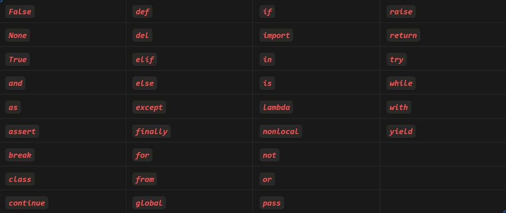

<h1 align="center" > Python Programming </h1>

**[Python](https://en.wikipedia.org/wiki/Python_(programming_language))** is an **[open-source](https://en.wikipedia.org/wiki/Open_source)**, **[high-level](https://en.wikipedia.org/wiki/High-level_programming_language)** and **[general-purpose](https://en.wikipedia.org/wiki/General-purpose_programming_language)** programming language. It is **dynamically type-checked** (type safety of a program is verified at runtime) and **garbage-collected**. 

> Note: These notes use Python 3 for all examples and explanations.

## Table of Contents

- [Python Syntax](#Python-Syntax)
- [Variables in python](#variables-in-python)	


## Python Syntax

After installing Python, we can execute python source code using the Python interpreter (`python name.py` Or `python3 name.py`). Python emphasizes code readability and relies on indentation to define code blocks instead of using braces `{}` like many other programming languages.

```python
print("Hello, World!")

if 5 > 2:
    print("Five is greater than two!")
```

We can write a single line comment using `#` and multi-line comments using triple quotes `'''` or `"""`.

```python
# This is a comment

'''
This is a multi-line comment
'''

"""
This is also a multi-line comment
"""
```

## Variables in Python

Variables are containers for storing data values. Python is dynamically typed, meaning you don’t need to declare a variable’s type; it is determined automatically based on the value assigned.

```python
x = 5
y = "Hello, World!"
```

> In Python, everything is an object; this includes variables, functions, classes, and even modules. Objects are instances of classes, and each class has its own attributes and methods.

In Python, variables serve as references (or bindings) to [objects](https://en.wikipedia.org/wiki/Object-oriented_programming). For example:

```python
n = 300
```

Here, an integer object with the value `300` is created, and the variable `n` is a reference to this object (means `n` is storing the memory address). Every object in Python has a unique identifier (typically its memory address), which can be checked using the id() function.

Consider the following code:

```python
n = 300
n = "foo"
```

We can visualize the memory allocation as follows

<p align="center"></p>

Once we reassign the variable `n` to a new value, the reference is updated to point to the new object.

### Memory Optimization

Python is a high-level language and it manages memory automatically. Memory usage is optimized by binding multiple variables with the same value to a single object instead of creating duplicate objects. For example:

```python
a = 10
b = 10
```

In this case, `a` and `b` both refer to the same object in memory. 

<p align="center"></p>

If no variables are referencing an object, it becomes orphaned and eligible for garbage collection. An object is eligible for garbage collection if the number of references to it becomes zero. We can manually reduce the reference count of an object using the `del` keyword.

### Pass by What?

Programming languages typically share objects or data between functions using one of two approaches:

- **Pass by value**: A copy of the actual argument is passed to the function. Modifications inside the function do not affect the original object.

- **Pass by reference**: The actual argument (its memory address) is passed, allowing modifications inside the function to directly affect the original object.

Python, however, uses a different mechanism known as **Pass by Object Reference** (or **Pass by Assignment**). In Python, everything is an object, including primitive types (e.g., integers, floats, and strings) and complex data structures (e.g., lists, dictionaries). When passing arguments to functions, Python passes a reference to the object (essentially a pointer to its memory address), not the actual object. Depending on the object type (**mutable** or **immutable**), the behavior can resemble pass by value or pass by reference.

- **Immutable Objects** (e.g., integers, strings, tuples):
When an immutable object is passed to a function and modified, Python creates a new object rather than altering the existing one.

```python
def modify_value(x):
    x += 10
    print("Inside function:", x)

a = 5
modify_value(a)
# Output: Inside function: 15
print("Outside function:", a)
# Output: Outside function: 5
```

- **Mutable Objects**(e.g., lists, dictionaries, sets):
When a mutable object is passed to a function and modified, the changes affect the original object.

```python
def modify_list(lst):
    lst.append(10)
    print("Inside function:", lst)

my_list = [1, 2, 3]
modify_list(my_list)
# Output: Inside function: [1, 2, 3, 10]
print("Outside function:", my_list)
# Output: Outside function: [1, 2, 3, 10]
```

### Boxing and Unboxing

Since everything in Python is an object, operations on variables involve processes called **boxing** and **unboxing**.

- **Boxing**: Wrapping primitive values (e.g., integers, floats) into Python objects so they can be managed as objects.

- **Unboxing**: Extracting the actual value from an object to perform operations.

For example, consider the addition of two integers:

```python
a = 10
b = 20
c = a + b
```

Behind the scenes, Python performs the following steps:

- Check the types of both operands (`a` and `b`).

- Verify support for the `+` operation for these types.

- Extract the function responsible for performing the `+` operation.

- Unbox the values from the objects (`10` and `20`).

- Perform the addition (`10 + 20`).

- Box the result into a new integer object (`30`).

These steps ensure Python’s flexibility but can introduce overhead in performance.

### A peak into Cython Optimization

For performance-critical tasks, extensions like **Cython** can compile Python code into C code, which can then be compiled into machine code. Here’s an example of a function for adding two integers:

```python
cpdef int add(int x, int y):
    cdef int result
    result = x + y
    return result
```

By specifying types (`int`), this code bypasses Python's usual boxing and unboxing processes, significantly improving performance.

### Automatic Memory Management

Python handles memory allocation and deallocation automatically through its memory manager, which manages the **Python heap**. The memory manager:

1. Allocates memory for objects when needed.

1. Tracks references to objects.

1. De-allocates memory when objects are no longer referenced (via garbage collection).

1. This ensures efficient memory usage without requiring explicit memory management from the programmer.

## Data Types

Python provides a variety of built-in data types, categorized as follows:

- **Text Type**: 
    - `str`

- **Numeric Types**: 
    - `int`
    - `float`
    - `complex`

- **Sequence Types**: 
    - `list`  (mutable sequence of items) 
    - `tuple` (immutable sequence of items)
    - `range` (sequence of numbers generated on demand)

- **Mapping Type**: 
    - `dict` (key-value pairs)

- **Set Types**: 
    - `set` (unordered collection of unique items)
    - `frozenset` (immutable version of `set`)

- **Boolean Type**: 
    - `bool` (represents `True` or `False`)

- **Binary Types**: 
    - `bytes`  (immutable sequence of bytes)
    - `bytearray` (mutable sequence of bytes)
    - `memoryview` (views over memory buffers)

- **None Type**:
    - `None` (represents the absence of a value)

### Type Conversion or Type Casting

Python allows us to convert between different data types using built-in functions like `int()`, `float()`, `str()`, etc.

```python
x = 5
y = float(x)
z = str(x)
```

### Type Checking

Python provides the `type()` function to check the type of an object.

```python
x = 5
print(type(x))
# Output: <class 'int'>
```

### Integer Optimization

For performance optimization, Python preallocates and caches integer objects in the range $\color{FEC260}[-5, \;256]$ at interpreter startup. This means:

- Integers in this range are reused rather than creating new objects each time they are assigned to variables.

- When two variables are assigned the same integer value within this range, they point to the same object in memory.

```python
a = 100
b = 100
print(a is b)  # Output: True

x = 1000
y = 1000
print(x is y)  # Output: False
```

This optimization is based on the observation that integers in this range are frequently used, improving performance and reducing memory overhead.

### Handling Large Integers (Integer Overflow)

Python's int type is **arbitrary-precision**, meaning it can handle numbers of any size, limited only by the available memory. Unlike many other programming languages, Python does not have fixed-size integer types that can **overflow**. Internally, Python uses a data structure called `long` (from earlier versions) to manage large integers efficiently.

```python
large_number = 10**100  # This is a 101-digit number!
print(large_number)
```

Python automatically handles operations involving such large numbers without requiring any special libraries or configurations.

## Operators

Python provides a wide range of operators to perform various operations. These are categorized as follows:

### Arithmetic Operators

Used to perform basic mathematical operations.

| Operator | Description | Example | Output |
| --- | --- | --- | --- |
| `+` | Addition | `5 + 3` | `8` |
| `-` | Subtraction | `5 - 3` | `2` |
| `*` | Multiplication | `5 * 3` | `15` |
| `/` | Division | `10 / 2` | `5` |
| `%` | Modulus | `10 % 3` | `1` |
| `//` | Floor Division | `10 // 3` | `3` |
| `**` | Exponentiation | `5 ** 3` | `125` |

### Comparison (Relational) Operators

Used to compare values and return a Boolean (`True` or `False`).

| Operator | Description | Example | Output |
| --- | --- | --- | --- |
| `==` | Equal to | `5 == 3` | `False` |
| `!=` | Not Equal to | `5 != 3` | `True` |
| `>` | Greater Than | `5 > 3` | `True` |
| `<` | Less Than | `5 < 3` | `False` |
| `>=` | Greater Than or Equal To | `5 >= 3` | `True` |
| `<=` | Less Than or Equal To | `5 <= 3` | `False` |

### Assignment Operators

Used to assign values to variables and perform shorthand operations.

| Operator | Description | Example | Equivalent |
| --- | --- | --- | --- |
| `=` | Assign | `x = 5` | `x = 5` |
| `+=` | Add and Assign | `x += 3` | `x = x + 3` |
| `-=` | Subtract and Assign | `x -= 3` | `x = x - 3` |
| `*=` | Multiply and Assign | `x *= 3` | `x = x * 3` |
| `/=` | Divide and Assign | `x /= 3` | `x = x / 3` |
| `%=` | Modulus and Assign | `x %= 3` | `x = x % 3` |
| `//=` | Floor Division and Assign | `x //= 3` | `x = x // 3` |
| `**=` | Exponentiation and Assign | `x **= 3` | `x = x ** 3` |

### Logical Operators

Used to combine conditional statements.

| Operator | Description | Example | Output |
| --- | --- | --- | --- |
| `and` | Logical AND | `True and False` | `False` |
| `or` | Logical OR | `True or False` | `True` |
| `not` | Logical NOT | `not True` | `False` |

### Bitwise Operators

Operate on binary representations of integers.

| Operator | Description | Example | Output |
| --- | --- | --- | --- |
| `&` | Bitwise AND | `5 & 3` | `1` |
| `|` | Bitwise OR | `5 \| 3` | `7` |
| `^` | Bitwise XOR | `5 ^ 3` | `6` |
| `~` | Bitwise NOT | `~5` | `-6` |
| `<<` | Left Shift | `5 << 1` | `10` |
| `>>` | Right Shift | `5 >> 1` | `2` |

### Membership Operators

Used to check if a value is part of a sequence (e.g., string, list, tuple, etc.).

| Operator | Description | Example | Output |
| --- | --- | --- | --- |
| `in` | Present in | `5 in [1, 2, 3, 4, 5]` | `True` |
| `not in` | Not Present in | `5 not in [1, 2, 3, 4, 5]` | `False` |

### Identity Operators

Used to compare the memory locations of two objects.

| Operator | Description | Example | Output |
| --- | --- | --- | --- |
| `is` | Same Object | `x is y` | `True` |
| `is not` | Different Object | `x is not y` | `False` |

### Ternary Operator

Python doesn’t have a dedicated ternary operator but uses a concise syntax to achieve similar functionality:

```python
result = a if condition else b
```

> If condition is True, the value of `a` is assigned to result. Otherwise, the value of `b` is assigned.

```python
x = 10
y = 20
max_value = x if x > y else y
print(max_value)  # Output: 20
```

## Python Keywords



## Conditional Statements

Conditional statements in Python are used to execute specific blocks of code based on logical conditions. Python supports the following conditional statements:

### `if` statement

Executes a block of code if the condition evaluates to `True`.

```python
x = 10
if x > 5:
    print("x is greater than 5")
# Output: x is greater than 5
```

### `elif` Statement

Allows checking multiple conditions. It is short for "else if."

```python
x = 10
if x > 15:
    print("x is greater than 15")
elif x > 5:
    print("x is greater than 5 but less than or equal to 15")
# Output: x is greater than 5 but less than or equal to 15
```

### `else` Statement

Executes a block of code if none of the preceding conditions are `True`.

```python
x = 2
if x > 5:
    print("x is greater than 5")
else:
    print("x is 5 or less")
# Output: x is 5 or less
```

### Nested `if` Statement

Allows placing an if statement inside another if statement to check multiple conditions hierarchically.

```python
x = 10
if x > 5:
    if x % 2 == 0:
        print("x is greater than 5 and even")
    else:
        print("x is greater than 5 and odd")
# Output: x is greater than 5 and even
```

## Loops

Loops in Python are used to execute a block of code repeatedly as long as a condition is met or for each item in a sequence. Python supports the following loop constructs:

### while loops

A while loop runs as long as its condition evaluates to True.

````python
i = 1
while i <= 5:
    print(i)
    i += 1
# Output: 
# 1
# 2
# 3
# 4
# 5
````

### for loops

A `for` loop iterates over a sequence (like a list, tuple, string, or range).

````python
for i in range(1, 6):
    print(i)
# Output: 
# 1
# 2
# 3
# 4
# 5
````

We can use the `break` statement to stop the loop before it has looped through all the items, and the `continue` statement to stop the current iteration of the loop, and continue with the next.

Python loops also have something like $for → else$ and $while → else$ which is executed when the loop is finished without a `break` statement.

````python
# for else
for i in range(1, 6):
    if i == 7:
        break
else:
    print("Loop completed without a break")
# Output: Loop completed without a break

# while else
i = 1
while i <= 5:
    if i == 7:
        break
    i += 1
else:
    print("Loop completed without a break")
# Output: Loop completed without a break
````

## Functions

A function is a reusable block of code designed to perform a specific task. Functions allow modularity, code reuse, and better organization of programs. In Python, functions are defined using the `def` keyword.

````python
def function_name(parameters):
    # Function body
    return value
````

### Properties of Functions in python

1. **Stack and Heap Memory**:

- Function calls reside in **stack memory** (LIFO structure), which stores execution contexts and local variables.

- **Heap memory** is used to store objects and data. While the stack contains references, the actual objects are stored in the heap.

2. **Return Multiple Values**:

Python functions can return multiple values using a tuple.

````python
def calculate(a, b):
    return a + b, a - b

sum_result, diff_result = calculate(10, 5)
print(sum_result)  # Output: 15
print(diff_result) # Output: 5
````

3. **Parameters and Arguments**:

- **Parameter**: A variable defined in the function declaration.

- **Argument**: The actual value passed to the function when it is called.

```python
def add(a, b):  # 'a' and 'b' are parameters
    return a + b

print(add(5, 10))  # '5' and '10' are arguments
```

4. **Default Parameters**:

Functions can have default values for parameters.

```python
def greet(name="Guest"):
    return f"Hello, {name}!"

print(greet())          # Output: Hello, Guest!
print(greet("Alice"))   # Output: Hello, Alice!
```

5. **Variable-length Arguments**:

- ***args**: Allows passing a variable number of positional arguments.

- ****kwargs**: Allows passing a variable number of keyword arguments.

```python
def sum_numbers(*args):
    return sum(args)

print(sum_numbers(1, 2, 3, 4))  # Output: 10

def display_info(**kwargs):
    for key, value in kwargs.items():
        print(f"{key}: {value}")

display_info(name="Alice", age=25)
# Output:
# name: Alice
# age: 25
```

**For further exploration, refer to the [_Function Notebook_](./Notebooks/8_Functions.ipynb)**

### Lambda Functions

Lambda functions are small, anonymous functions defined using the `lambda` keyword. They are limited to a single expression and are often used for short-term tasks.

```python
lambda arguments: expression
```
Lambda functions are particularly useful with higher-order functions like `map()`, `filter()`, and `reduce()`.

```python
nums = [1, 2, 3, 4]
squared = list(map(lambda x: x ** 2, nums))
print(squared)  # Output: [1, 4, 9, 16]
```
## String

Strings in Python are immutable sequences of Unicode code-points/ arrays or bytes representing unicode characters. Strings are ordered, indexed, and can contain duplicate elements. They are also iterable. We can slice and use the membership operator in strings.

**[String Notebook](./Notebooks/7_String.ipynb)**

## Built-in Containers

### List

Python lists are heterogeneous, mutable built-in data structures. Lists are indexed, dynamic and allows duplicate elements. Most of the operations on a list takes $\color{FEC260}O(1)$ or $\color{FEC260}O(n)$ time complexity. Lists has a powerful mechanism to create new lists from other iterable (list, tuple, strings, etc.) called List comprehension. Lists are ordered also. Lists are superset of arrays.

- During list slicing, we are creating a new list object. We can use the slicing technique in other python data structures like tuple, string, etc.

- List comprehension is an elegant way to generate new lists form existing ones. Internally python would run a loop to do this, hence the complexity of comprehension would be similar to the iterative implementation. 

**[List Notebook](./Notebooks/3_List.ipynb)**

### Tuple

Tuples are basically immutable or read-only lists. The tuple stores items as reference, hence the tuple is immutable not the items; i.e. we can change the contents of a list inside a tuple but we cannot change the item in the tuple. 

- Tuples are generally faster than lists because they are immutable. 

**[Tuple Notebook](./Notebooks/4_Tuple.ipynb)**

### Set

Set is an unordered data structure in python, where every item is unique and immutable, however the set itself is mutable. Set allows fast insertion, deletion and searching. 

- We can insert, delete, and search a list in amortized  $\color{gold}O(1)$ time complexity. 

- Set uses hashing under the hood and that’s how it achieves that $\color{gold}O(1)$ time complexity. 

- Set also supports different set (Mathematical set) operations like Union, Intersection, Difference, Symmetric difference, etc. 

- Sets are also highly optimized for membership tests, it can do membership test in $\color{gold}O(1)$ (amortized).

**[Set Notebook](./Notebooks/6_Set.ipynb)**

### Dictionary

A dictionary is a collection of key-value pairs. They are generally unordered, indexed, and mutable. The key is used to access the value and the key must be unique (immutable objects). The value can be any data type. Under the hood dictionaries also use hashing like sets.

- Dictionaries are highly optimized for searching, insertion, and deletion.

- Dictionaries are also highly optimized for membership tests, it can do membership test in $\color{gold}O(1)$ (amortized).

**Shallow Copy and Deep Copy**

Shallow copy creates a new dictionary and copy references to the objects found in the original dictionary. Hence changes to mutable objects within the copy affect the original dictionary.

Deep copy creates a new dictionary and recursively copies the objects found in the original dictionary. Hence changes to mutable objects within the copy do not affect the original dictionary.

- Dictionaries also support comprehension like lists.

**[Dictionary Notebook](./Notebooks/5_Dictionary.ipynb)**

## Object Oriented Programming in Python

OOPS properties in Python are similar to other major object oriented languages. What python does differently are:

### Multiple Inheritance

- A class can be derived from more than one base classes in Python. Useful while having [Mixins](https://en.wikipedia.org/wiki/Mixin).

- the C3 linearization (MRO - Method Resolution Order) to resolve method calls in a consistent and predictable manner, which avoids the diamond problem by defining a specific order in which base classes are searched.

### Abstract Base Classes and Duck Typing

- Abstract Base Classes are classes that contain one or more abstract methods. An abstract method is a method that is declared, but contains no implementation. Python provides the `abc` module to use the Abstract Base Classes.

- Duck typing is a concept related to dynamic typing, where the type or class of an object is less important than the methods it defines. When you use duck typing, you do not check types at all. Instead, you check for the presence of a given method or attribute. 

> If it looks like a duck and quacks like a duck, it must be a duck. 🦆

### Method Overloading

- Python does not support method overloading like C++ or Java. We can use default arguments or variable length arguments to achieve the same.

- Due to the dynamic nature of Python, it can already handle different types of arguments.

### Encapsulation and Access Modifiers

Encapsulation in OOP refers to two concepts:

- A language construct that bind data with methods that operate on that data.

- A language mechanism that restricts direct access to some of an object's components.

Python simply uses naming conventions to indicate private(__) and protected(_) members of a class.

### Constructor Overloading

- Python does not support constructor overloading the same way as C++ or Java.  The `__init__` method is used for initialization, and multiple ways of initializing an object can be handled with default arguments or conditional logic within `__init__`.

### Dunder Methods or Magic Methods

- `Dunder` methods or magic methods are special methods that have double underscores at the beginning and end of their names. They are used to create functionality that can't be represented as a normal method.

[OOPS Notebook](./Notebooks/9_Object_Oriented_Programming.ipynb)

## Python Documentation

[Official Python documentation](https://docs.python.org/3/)
