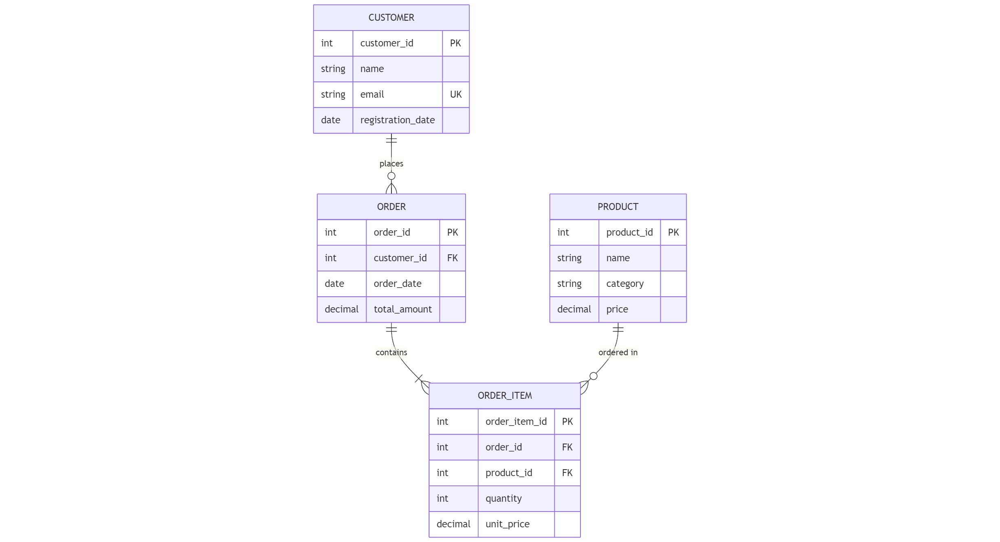
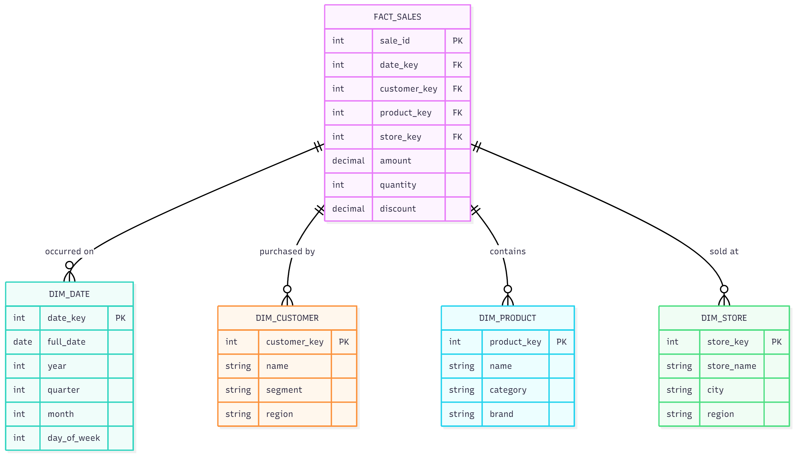
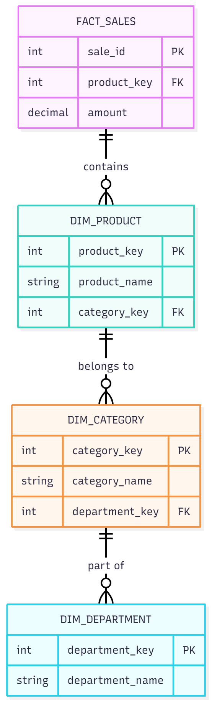
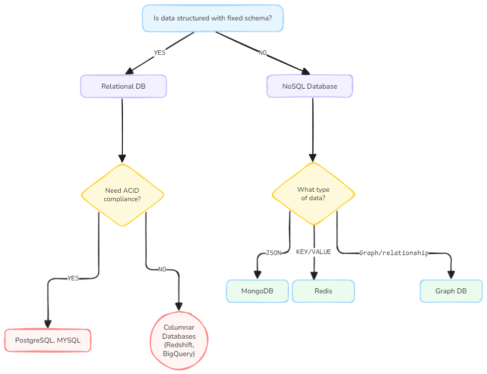

<h1 align='center'> Database Systems For DSML </h1>

## Table of Contents

1. [Introduction to Databases](#introduction-to-databases)
2. [Types of Databases](#types-of-databases)
   - [Relational Databases](#relational-databases-rdbms)
   - [Non-Relational Databases](#non-relational-databases-nosql)
3. [Database Languages](#database-languages)
4. [Database Architecture and Components](#database-architecture-and-components)
5. [ACID Properties Explained](#acid-properties)
6. [CAP Theorem and Distributed Systems](#cap-theorem-and-distributed-systems)
7. [Database Design Principles](#database-design-principles)
8. [Normalization and Denormalization](#normalization-and-denormalization)
9. [Data Warehousing Concepts](#data-warehousing)
10. [Database Selection for DS/ML Projects](#database-selection-for-dsml-projects)

---

## Introduction to Databases

A **database** is an organized collection of structured or semi-structured data that is stored and accessed electronically. Unlike simple file storage, databases provide sophisticated mechanisms for data retrieval, manipulation, security, and integrity maintenance.

A **Database Management System (DBMS)** is the software layer that sits between users/applications and the physical storage, providing:

- **Data abstraction**: Users interact with logical data structures without concerning themselves with physical storage details
- **Concurrent access control**: Multiple users can access data simultaneously without conflicts
- **Data integrity enforcement**: Rules and constraints ensure data accuracy and consistency
- **Security and authorization**: Controlled access to sensitive information
- **Backup and recovery mechanisms**: Protection against data loss
- **Query optimization**: Efficient execution of data retrieval operations

### Database vs. Data Warehouse vs. Data Lake

| Aspect | Database | Data Warehouse | Data Lake |
|--------|----------|----------------|-----------|
| **Purpose** | Operational transactions (OLTP) | Analytical queries (OLAP) | Raw data storage for future use |
| **Schema** | Predefined, normalized | Star/snowflake schema | Schema-on-read |
| **Data Type** | Structured | Structured, aggregated | Structured, semi-structured, unstructured |
| **Users** | Application developers | Business analysts, data scientists | Data engineers, data scientists |
| **Query Performance** | Optimized for writes and point lookups | Optimized for complex aggregations | Varies, requires processing frameworks |
| **Examples** | PostgreSQL, MySQL | Snowflake, Redshift, BigQuery | S3 + Athena, Azure Data Lake, HDFS |

---

## Types of Databases

Databases are categorized based on their data models, consistency guarantees, and intended use cases.

### Relational Databases (RDBMS)

**Relational Databases** are built on the relational model proposed by `Edgar F. Codd` in 1970. Data is organized into **tables** (relations), where each table consists of rows (tuples) and columns (attributes).

#### Core Characteristics

- **Structured Data Organization**: Data follows a strict schema with predefined tables, columns, and data types
- **ACID Compliance**: Guarantees transactional integrity
- **Referential Integrity**: Foreign key constraints maintain relationships between tables
- **Declarative Query Language**: SQL allows users to specify *what* data they want, not *how* to retrieve it
- **Fixed Schema**: Schema changes require migrations and can be costly
- **Vertical Scalability**: Traditionally scaled by adding more CPU/RAM to a single server

#### ACID Properties

**ACID** is an acronym representing four key properties that guarantee reliable transaction processing:

**1. Atomicity (All or Nothing)**
- Transactions are indivisible units of work
- Either all operations succeed, or none do
- Example: Transferring money between accounts—both debit and credit must succeed together

```sql
BEGIN TRANSACTION;
    UPDATE accounts SET balance = balance - 100 WHERE account_id = 1;
    UPDATE accounts SET balance = balance + 100 WHERE account_id = 2;
COMMIT; -- Both updates succeed
-- If any operation fails, ROLLBACK occurs automatically
```

**2. Consistency (Data Integrity)**
- Transactions bring the database from one valid state to another
- All integrity constraints are satisfied after the transaction
- Example: A foreign key constraint prevents orphaned records

**3. Isolation (Concurrent Execution)**
- Concurrent transactions execute as if they were serial
- Different isolation levels balance performance vs. consistency:
  - **Read Uncommitted**: Dirty reads possible (rarely used)
  - **Read Committed**: See only committed data (default in PostgreSQL)
  - **Repeatable Read**: Consistent reads within a transaction
  - **Serializable**: Full isolation, highest consistency

**4. Durability (Persistence)**
- Once committed, data survives system crashes
- Achieved through write-ahead logs (WAL) and disk persistence

#### When to Use Relational Databases in DS/ML

✅ **Best for:**
- Structured data with well-defined relationships
- Transactional data requiring strong consistency
- Complex joins across multiple entities
- Financial data, user accounts, inventory systems
- Feature stores with strict schema requirements
- ML metadata tracking (experiment runs, model versions)

❌ **Not ideal for:**
- Unstructured data (images, videos, raw text)
- Highly variable schemas that change frequently
- Massive horizontal scaling requirements (billions of rows)
- Graph-like relationships with many-to-many connections

#### Popular Relational Databases

| Database | Strengths | DS/ML Use Cases |
|----------|-----------|-----------------|
| **PostgreSQL** | Advanced features (window functions, CTEs, JSON support), open-source | General-purpose analytics, feature engineering, geospatial data (PostGIS) |
| **MySQL** | Fast reads, widely adopted, simple setup | Web application backends, log aggregation |
| **SQLite** | Embedded, serverless, zero-config | Local development, mobile apps, small datasets |
| **Oracle** | Enterprise features, scalability | Large enterprise data warehouses |
| **SQL Server** | Windows integration, business intelligence tools | Enterprise analytics, integration with Azure ML |

### Non-Relational Databases (NoSQL)

**NoSQL databases** ("Not Only SQL") emerged to address limitations of relational databases, particularly for:
- Massive scale (horizontal scaling)
- Flexible schemas
- High-velocity data ingestion
- Unstructured or semi-structured data

#### BASE Properties

NoSQL databases often follow **BASE** semantics instead of ACID:

- **Basically Available**: System guarantees availability
- **Soft state**: State may change over time without input (eventual consistency)
- **Eventual consistency**: System will become consistent given enough time

### Document Databases

**Document databases** store data as self-contained documents (typically JSON, BSON, or XML). Each document can have a different structure, enabling schema flexibility.

#### Characteristics

- **Flexible Schema**: Documents in the same collection can have different fields
- **Nested Data**: Support complex, hierarchical data structures
- **Indexing**: Can index on any field, including nested fields
- **Horizontal Scalability**: Partition data across multiple nodes (sharding)

#### When to Use Document Databases in DS/ML

✅ **Best for:**
- Semi-structured data with varying attributes
- Rapid prototyping where schema evolves
- Storing raw JSON API responses
- Product catalogs with varying attributes
- Event logging with flexible payloads
- Storing ML model metadata and configurations

❌ **Not ideal for:**
- Complex multi-document transactions (limited support)
- Heavy relational joins across documents
- Strict schema enforcement requirements

#### Example: Storing ML Experiment Metadata

```python
# MongoDB example: Storing experiment runs
from pymongo import MongoClient

client = MongoClient('mongodb://localhost:27017/')
db = client['ml_experiments']
experiments = db['runs']

# Insert experiment metadata (flexible schema)
experiment = {
    "experiment_id": "exp_20250101_001",
    "model_type": "xgboost",
    "hyperparameters": {
        "max_depth": 6,
        "learning_rate": 0.1,
        "n_estimators": 100
    },
    "metrics": {
        "train_accuracy": 0.92,
        "val_accuracy": 0.88,
        "test_accuracy": 0.87
    },
    "feature_importance": [
        {"feature": "age", "importance": 0.35},
        {"feature": "income", "importance": 0.28}
    ],
    "created_at": "2025-01-01T10:30:00Z",
    "tags": ["production", "v2"]
}

experiments.insert_one(experiment)

# Query experiments by criteria
best_models = experiments.find({
    "metrics.val_accuracy": {"$gt": 0.85},
    "tags": "production"
}).sort("metrics.val_accuracy", -1).limit(5)
```

#### Popular Document Databases

- **MongoDB**: Most widely adopted, rich query language, aggregation pipeline
- **CouchDB**: Multi-master replication, RESTful API
- **Firestore**: Real-time sync, serverless, integrated with Firebase

### Key-Value Databases

**Key-value stores** are the simplest NoSQL databases, functioning like distributed hash tables. Data is accessed via unique keys, with values being opaque blobs to the database.

#### Characteristics

- **Simple Data Model**: Just keys and values
- **High Performance**: Optimized for fast reads and writes
- **Horizontal Scaling**: Easy to partition by key
- **Limited Querying**: No complex queries—only key-based lookups

#### When to Use Key-Value Databases in DS/ML

✅ **Best for:**
- **Caching**: Store computed features, model predictions
- **Session management**: User sessions, temporary tokens
- **Rate limiting**: Track API request counts
- **Real-time feature serving**: Low-latency feature lookups during inference
- **Job queues**: Store task metadata by job ID

```python
# Redis example: Caching ML predictions
import redis
import json

r = redis.Redis(host='localhost', port=6379, decode_responses=True)

# Cache prediction for 1 hour
user_id = "U12345"
prediction = {"churn_probability": 0.73, "model_version": "v2.1"}

r.setex(
    f"prediction:{user_id}",
    3600,  # TTL: 1 hour
    json.dumps(prediction)
)

# Retrieve cached prediction
cached = r.get(f"prediction:{user_id}")
if cached:
    result = json.loads(cached)
    print(f"Cached prediction: {result}")
else:
    # Compute prediction if not cached
    pass
```

#### Popular Key-Value Databases

| Database | Strengths | DS/ML Use Cases |
|----------|-----------|-----------------|
| **Redis** | In-memory, sub-millisecond latency, rich data structures (lists, sets, sorted sets) | Feature caching, real-time leaderboards, job queues |
| **DynamoDB** | Fully managed (AWS), auto-scaling, single-digit millisecond latency | Serverless ML applications, feature stores |
| **Riak** | High availability, fault tolerance | Distributed feature stores |

### Graph Databases

**Graph databases** store data as nodes (entities) and edges (relationships), using graph theory to model and query complex relationships.

#### Characteristics

- **Native Graph Storage**: Relationships are first-class citizens
- **Traversal Queries**: Efficiently navigate multi-hop relationships
- **Pattern Matching**: Find complex patterns in connected data
- **No JOIN Overhead**: Relationships are pre-materialized

#### When to Use Graph Databases in DS/ML

✅ **Best for:**
- **Social network analysis**: Friend recommendations, influence propagation
- **Knowledge graphs**: Entity relationships, recommendation systems
- **Fraud detection**: Identify suspicious relationship patterns
- **Network analysis**: PageRank, community detection
- **Feature engineering**: Graph-based features (centrality, clustering coefficient)

```sql
-- Neo4j example: Find influential users in a social network
-- Nodes: User, Edges: FOLLOWS
MATCH (u:User)-[:FOLLOWS]->(influencer:User)
WHERE u.country = 'US'
WITH influencer, COUNT(u) as follower_count
WHERE follower_count > 1000
RETURN influencer.name, follower_count
ORDER BY follower_count DESC
LIMIT 10;
```

#### Graph Features for ML

```python
# Using Neo4j with Python for feature extraction
from neo4j import GraphDatabase

driver = GraphDatabase.driver("bolt://localhost:7687", auth=("neo4j", "password"))

def get_user_graph_features(user_id):
    with driver.session() as session:
        result = session.run("""
            MATCH (u:User {id: $user_id})
            OPTIONAL MATCH (u)-[:FOLLOWS]->(following)
            OPTIONAL MATCH (follower)-[:FOLLOWS]->(u)
            OPTIONAL MATCH (u)-[:FOLLOWS]->()-[:FOLLOWS]->(mutual)
            RETURN 
                COUNT(DISTINCT following) as following_count,
                COUNT(DISTINCT follower) as follower_count,
                COUNT(DISTINCT mutual) as two_hop_connections
        """, user_id=user_id)
        
        record = result.single()
        return {
            'following_count': record['following_count'],
            'follower_count': record['follower_count'],
            'two_hop_connections': record['two_hop_connections']
        }

# Use as features in ML model
features = get_user_graph_features('U12345')
```

#### Popular Graph Databases

- **Neo4j**: Most popular, Cypher query language, graph algorithms library
- **Amazon Neptune**: Managed service (AWS), supports Gremlin and SPARQL
- **JanusGraph**: Distributed, scalable, Apache TinkerPop compatible

### Vector Databases

**Vector databases** are specialized systems designed to store and query high-dimensional vector embeddings efficiently. They are essential for modern ML applications involving similarity search.

#### Characteristics

- **High-Dimensional Indexing**: Optimized for vectors with hundreds or thousands of dimensions
- **Similarity Search**: Find nearest neighbors using cosine similarity, Euclidean distance, dot product
- **Approximate Search**: Use techniques like HNSW, IVF, LSH for fast approximate nearest neighbor (ANN) search
- **Integration with ML Frameworks**: Work seamlessly with embedding models (Word2Vec, BERT, ResNet)

#### When to Use Vector Databases in DS/ML

✅ **Best for:**
- **Semantic search**: Find similar documents, images, or products
- **Recommendation systems**: Content-based recommendations
- **LLM applications**: Retrieval-Augmented Generation (RAG), memory for chatbots
- **Anomaly detection**: Find outliers by vector distance
- **Image similarity**: Reverse image search
- **Duplicate detection**: Near-duplicate content identification

#### Example: RAG System with Vector Database

```python
# FAISS example: Building a semantic search system
import faiss
import numpy as np
from sentence_transformers import SentenceTransformer

# Load embedding model
model = SentenceTransformer('all-MiniLM-L6-v2')

# Sample documents
documents = [
    "Machine learning is a subset of artificial intelligence",
    "Deep learning uses neural networks with many layers",
    "SQL is used to query relational databases",
    "Python is popular for data science and ML"
]

# Generate embeddings
embeddings = model.encode(documents)
dimension = embeddings.shape[1]  # 384 for this model

# Create FAISS index
index = faiss.IndexFlatL2(dimension)  # L2 distance
index.add(embeddings.astype('float32'))

# Search for similar documents
query = "What is machine learning?"
query_embedding = model.encode([query]).astype('float32')

k = 2  # Top 2 results
distances, indices = index.search(query_embedding, k)

print("Most similar documents:")
for i, idx in enumerate(indices[0]):
    print(f"{i+1}. {documents[idx]} (distance: {distances[0][i]:.4f})")
```

#### Popular Vector Databases

| Database | Strengths | DS/ML Use Cases |
|----------|-----------|-----------------|
| **FAISS** | Facebook's library, extremely fast, in-memory | Prototyping, batch similarity search |
| **Pinecone** | Fully managed, real-time updates, filtering | Production RAG systems, recommendation engines |
| **Weaviate** | Open-source, built-in vectorization, GraphQL API | Semantic search, hybrid search (vector + keyword) |
| **Milvus** | Open-source, distributed, GPU support | Large-scale image/video search |
| **Chroma** | Open-source, lightweight, Python-first | LLM applications, document Q&A |
| **Qdrant** | Rust-based, fast, payload filtering | Production ML applications |

---

## Database Languages

Database languages enable users to interact with databases through standardized syntax. The most important language for databases are **SQL**.

### Structured Query Language (SQL)

**SQL (Structured Query Language)** is the standard language for interacting with relational databases. It is a declarative language—you specify *what* data you want, and the database optimizer determines *how* to retrieve it.

#### SQL Language Components

SQL is divided into several sub-languages:

1. **DDL (Data Definition Language)**: Define and modify database structures
   - `CREATE`, `ALTER`, `DROP`, `TRUNCATE`

2. **DML (Data Manipulation Language)**: Manipulate data
   - `SELECT`, `INSERT`, `UPDATE`, `DELETE`

3. **DCL (Data Control Language)**: Control access and permissions
   - `GRANT`, `REVOKE`

4. **TCL (Transaction Control Language)**: Manage transactions
   - `BEGIN`, `COMMIT`, `ROLLBACK`, `SAVEPOINT`

---

## Database Architecture and Components

Understanding database internals helps you write efficient queries and diagnose performance issues.



### Key Components

#### 1. Query Processor
- **Parser**: Checks SQL syntax and converts queries to internal representation
- **Optimizer**: Generates and evaluates multiple execution plans, selects the most efficient
- **Executor**: Executes the chosen plan and returns results

#### 2. Storage Manager
- **Buffer Manager**: Caches frequently accessed data pages in memory
- **File Manager**: Manages data files on disk
- **Transaction Manager**: Ensures ACID properties

#### 3. Indexes
- **B-Tree Indexes**: Default index type, efficient for range queries
- **Hash Indexes**: Fast equality lookups
- **Bitmap Indexes**: Efficient for low-cardinality columns
- **Full-Text Indexes**: Specialized for text search

#### 4. Query Execution Plans

Understanding execution plans is critical for optimization:

```sql
-- PostgreSQL: View execution plan
EXPLAIN ANALYZE
SELECT customer_id, SUM(amount) as total_spent
FROM orders
WHERE order_date >= '2024-01-01'
GROUP BY customer_id
HAVING SUM(amount) > 1000;

-- Output includes:
-- - Scan method (Seq Scan, Index Scan, Bitmap Scan)
-- - Join algorithm (Nested Loop, Hash Join, Merge Join)
-- - Estimated vs actual rows
-- - Execution time
```

---

## CAP Theorem and Distributed Systems

The **CAP Theorem** (Brewer's Theorem) states that a distributed database can provide at most two of these three guarantees:

1. **Consistency (C)**: All nodes see the same data at the same time
2. **Availability (A)**: Every request receives a response (success or failure)
3. **Partition Tolerance (P)**: System continues operating despite network partitions

### Practical Implications

In reality, network partitions *will* occur, so you must choose between:

- **CP Systems (Consistency + Partition Tolerance)**: Sacrifice availability during partitions
  - Examples: MongoDB (with strong consistency), HBase, Redis (single-master)
  - Use case: Banking systems, inventory management

- **AP Systems (Availability + Partition Tolerance)**: Sacrifice consistency during partitions
  - Examples: Cassandra, DynamoDB, Riak
  - Use case: Social media feeds, IoT sensor data, caching layers

- **CA Systems (Consistency + Availability)**: No partition tolerance
  - Only possible in single-node systems (not truly distributed)
  - Examples: Traditional RDBMS on a single server

### Consistency Models in Distributed Databases

| Model | Description | Example |
|-------|-------------|---------|
| **Strong Consistency** | All reads return the most recent write | PostgreSQL, MySQL (single master) |
| **Eventual Consistency** | Reads may return stale data, but will eventually converge | DynamoDB (default), Cassandra |
| **Causal Consistency** | Related operations are seen in order | Some MongoDB configurations |
| **Read-Your-Writes** | A process always sees its own writes | Session-based consistency |

---

## Database Design Principles

### Entity-Relationship (ER) Modeling

ER diagrams help visualize database structure before implementation:



### Key Design Concepts

#### Primary Keys (PK)
- Uniquely identify each row in a table
- Should be immutable and non-null
- Can be natural (e.g., email) or surrogate (e.g., auto-increment ID)

#### Foreign Keys (FK)
- Establish relationships between tables
- Enforce referential integrity
- Enable joins

#### Unique Constraints (UK)
- Ensure column values are unique across rows
- Different from primary keys—can be null (depending on DBMS)

---

## Normalization and Denormalization

### Normalization: Organizing Data Efficiently

**Normalization** is the process of organizing data to reduce redundancy and improve integrity.

#### Normal Forms

**1st Normal Form (1NF)**
- Each column contains atomic (indivisible) values
- No repeating groups

❌ **Violates 1NF:**
```
customer_id | name  | phone_numbers
1           | Alice | 555-1234, 555-5678
```

✅ **Satisfies 1NF:**
```
customer_id | name  | phone_number
1           | Alice | 555-1234
1           | Alice | 555-5678
```

**2nd Normal Form (2NF)**
- Satisfies 1NF
- No partial dependencies (all non-key attributes depend on the entire primary key)

**3rd Normal Form (3NF)**
- Satisfies 2NF
- No transitive dependencies (non-key attributes don't depend on other non-key attributes)

❌ **Violates 3NF:**
```sql
CREATE TABLE orders (
    order_id INT PRIMARY KEY,
    customer_id INT,
    customer_name VARCHAR(100),  -- Depends on customer_id, not order_id
    customer_email VARCHAR(100), -- Depends on customer_id, not order_id
    order_date DATE
);
```

✅ **Satisfies 3NF:**
```sql
CREATE TABLE customers (
    customer_id INT PRIMARY KEY,
    customer_name VARCHAR(100),
    customer_email VARCHAR(100)
);

CREATE TABLE orders (
    order_id INT PRIMARY KEY,
    customer_id INT REFERENCES customers(customer_id),
    order_date DATE
);
```

**Boyce-Codd Normal Form (BCNF)**
- Stricter version of 3NF
- Every determinant is a candidate key

### Denormalization: Trading Redundancy for Performance

In analytics and ML contexts, **denormalization** is often beneficial:

✅ **Benefits:**
- Faster queries (fewer joins)
- Simpler queries
- Better for read-heavy workloads

❌ **Drawbacks:**
- Data redundancy
- Update anomalies
- Increased storage

#### When to Denormalize for DS/ML

1. **Data warehouses**: Star schema uses denormalization
2. **Feature stores**: Pre-compute aggregate features
3. **Reporting dashboards**: Materialized views
4. **Real-time inference**: Avoid joins during prediction

```sql
-- Normalized (OLTP)
SELECT 
    o.order_id,
    c.customer_name,
    p.product_name,
    oi.quantity,
    oi.unit_price
FROM orders o
JOIN customers c ON o.customer_id = c.customer_id
JOIN order_items oi ON o.order_id = oi.order_id
JOIN products p ON oi.product_id = p.product_id;

-- Denormalized (OLAP) - Single table with redundancy
SELECT 
    order_id,
    customer_name,  -- Denormalized from customers
    product_name,   -- Denormalized from products
    quantity,
    unit_price
FROM order_details_denormalized;
```

---

## Data Warehousing

### OLTP vs. OLAP

| Aspect | OLTP (Online Transaction Processing) | OLAP (Online Analytical Processing) |
|--------|--------------------------------------|-------------------------------------|
| **Purpose** | Day-to-day operations | Historical analysis, reporting |
| **Queries** | Simple, frequent, short | Complex, less frequent, long-running |
| **Data Volume** | Recent data | Historical data (years) |
| **Schema** | Normalized (3NF) | Denormalized (star/snowflake) |
| **Users** | Many concurrent users | Fewer users (analysts, data scientists) |
| **Examples** | E-commerce checkout, banking transactions | Sales analysis, customer segmentation |

### Dimensional Modeling

**Dimensional modeling** organizes data into **fact tables** (measurable events) and **dimension tables** (context for facts).

#### Star Schema

The most common dimensional model:



**Characteristics:**
- Fact table in the center
- Dimension tables directly connected to fact table
- Denormalized dimensions (faster queries)
- Simple to understand and query

#### Snowflake Schema

A normalized version of star schema:



**Characteristics:**
- Normalized dimensions (less redundancy)
- More complex queries (additional joins)
- Reduced storage

### Slowly Changing Dimensions (SCD)

Dimensions change over time (e.g., customer changes address). SCD strategies handle this:

**Type 1 (Overwrite)**: Update in place, lose history
```sql
UPDATE dim_customer 
SET city = 'New York' 
WHERE customer_id = 123;
```

**Type 2 (Add Row)**: Keep history with versioning
```sql
-- Old record
customer_key | customer_id | city      | valid_from | valid_to   | is_current
1            | 123         | Boston    | 2023-01-01 | 2024-06-30 | N

-- New record
2            | 123         | New York  | 2024-07-01 | 9999-12-31 | Y
```

**Type 3 (Add Column)**: Store limited history
```sql
customer_id | current_city | previous_city
123         | New York     | Boston
```

---

## Database Selection for DS/ML Projects

### Decision Framework



### Use Case to Database Mapping

| Use Case | Recommended Database | Reasoning |
|----------|---------------------|-----------|
| **Feature engineering pipeline** | PostgreSQL, Snowflake | Rich SQL support, window functions, CTEs |
| **Real-time model serving** | Redis, DynamoDB | Low-latency feature lookups, caching predictions |
| **Training data storage** | S3 + Parquet, Data Lake | Cost-effective for large volumes, columnar format |
| **ML experiment tracking** | MongoDB, PostgreSQL | Flexible schema for varying metadata |
| **Recommendation engine** | Graph DB (Neo4j), Vector DB (Pinecone) | Relationship traversal, similarity search |
| **Time-series forecasting** | InfluxDB, TimescaleDB | Optimized for time-series operations |
| **Real-time analytics** | ClickHouse, Apache Druid | Column-oriented, fast aggregations |
| **RAG system for LLMs** | Pinecone, Weaviate, Chroma | Vector similarity search, hybrid search |
| **Customer 360 view** | Snowflake, BigQuery | Handles large-scale joins, data warehousing |
| **IoT sensor data** | Cassandra, TimescaleDB | High write throughput, time-series support |
| **Fraud detection** | Neo4j, PostgreSQL | Graph patterns, complex relationship queries |

### Performance Considerations

#### Read vs. Write Optimization

**Read-Heavy Workloads** (Analytics, Reporting):
- Use columnar databases (Redshift, BigQuery, ClickHouse)
- Create appropriate indexes
- Use materialized views
- Consider read replicas

**Write-Heavy Workloads** (Logging, IoT):
- Use append-only databases (Cassandra, InfluxDB)
- Minimize indexes (each index slows writes)
- Batch inserts when possible
- Use time-series databases for sequential writes

#### Storage Format for ML

| Format | Best For | Advantages | Disadvantages |
|--------|----------|------------|---------------|
| **Parquet** | Training data, feature stores | Columnar, compressed, schema evolution | Not human-readable |
| **CSV** | Small datasets, quick exports | Simple, universally supported | No schema, inefficient storage |
| **Avro** | Streaming data, Kafka | Row-based, schema evolution, compact | Less efficient for analytics |
| **ORC** | Hive, Hadoop ecosystems | Highly compressed, optimized for Hive | Limited tool support |
| **JSON** | API responses, document stores | Flexible, human-readable | Verbose, no compression |
| **Feather/Arrow** | Pandas/Python workflows | Fast serialization, zero-copy reads | Not widely supported outside Python/R |

---

- **[SQL Primer](./SQL-Primer.md)** $\rightarrow$ **[SQL Deep Dive](./SQL-deep-dive.md)**

- **[Mongo DB](./Mongo_DB.md) & [Redis DB](./Redis_DB.md)**

---

<h1 align='center'> END </h1>
