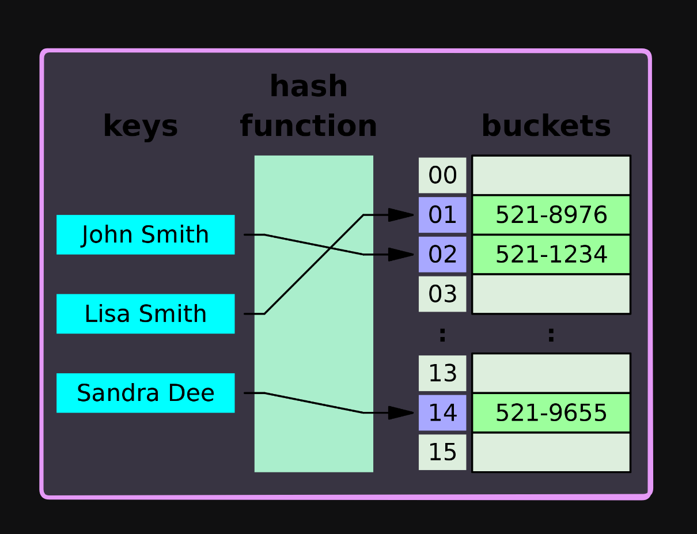

<h1 align="center"> Hash Tables </h1>

Hash table is a data structure that implement an associative array, also called a map, dictionary, or hash map. It maps keys to values using a hash function. After arrays hash tables are the most commonly used data structure.

- Hash table provide search, insert, and delete operations in `O(1)` time complexity on average.

- The hash function, which performs hashing, is a deterministic function that maps data of arbitrary size to a fixed-size value. 

- When two keys hash to the same value, a collision occurs. Collisions are meant to happen because the number of possible keys is usually much larger than the number of available hash values. There are two common ways to handle collisions: `chaining` and `open addressing`.

- In chaining, each bucket is independent, and has some sort of list of entries with the same index. The time for hash table operations is the time to find the bucket (which is constant) plus the time for the list operation. Most modern programming languages provide a hash table implementation that handles collisions using chaining. 

- In open addressing, when a new entry is inserted, the table is examined until an empty slot is found. The time for hash table operations is the time to find the bucket (which is constant) plus the time for the probing operation. Python uses open addressing to handle collisions.

- We have mainly 3 type of probing techniques:
    - `Linear probing`: In linear probing, when a new entry is inserted, the table is examined until an empty slot is found. The time for hash table operations is the time to find the bucket (which is constant) plus the time for the probing operation.

    - `Quadratic probing`: Quadratic probing is an open addressing scheme where the interval between probes is computed by adding the successive outputs of a quadratic polynomial to the starting value given by the original hash code.

    - `Double hashing`: Double hashing is a computer programming technique used in hash tables to resolve hash collisions, by using a secondary hash of the key as an offset when a collision occurs.

- Linear probing and quadratic probing are susceptible to clustering, a phenomenon where hash table entries are not distributed uniformly across the table. This can lead to a degradation of performance, as the probing operation may take longer.

- Double hashing is less susceptible to clustering, but it requires more computation than linear or quadratic probing. Also the second hash function should be carefully chosen so that it should not return 0 for any key.

- The performance of chaining can be expressed in terms of the `load factor`, which is the ratio of the number of elements to the number of buckets. The load factor is a measure of how full the hash table is allowed to get before its capacity is automatically increased. The load factor is usually kept less than 1.

$$\color{gold}\text{Load Factor} = \frac{\text{Number of elements}}{\text{Number of buckets}}$$

The following table summarizes the main difference between chaining and open addressing:

| Chaining | Open Addressing |
|----------|-----------------|
| Each bucket is independent | All elements are stored in the hash table itself |
| Hash table never fills up, we can always add more elements | Hash table may become full |
| Less sensitive to the hash function or load factors | More sensitive to the hash function and load factors |
| Cache performance is not good | Cache performance is good |
| Simple to implement | Complex to implement |
| Require extra space; but performance is $1+\alpha$ | No extra space, but performance is $\large\frac{1}{1-\alpha}$ |

## [Basic Hash Table Implementation](./Implementation.ipynb)

## Questions

1. Contains duplicate
