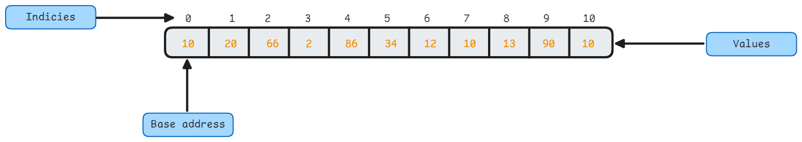
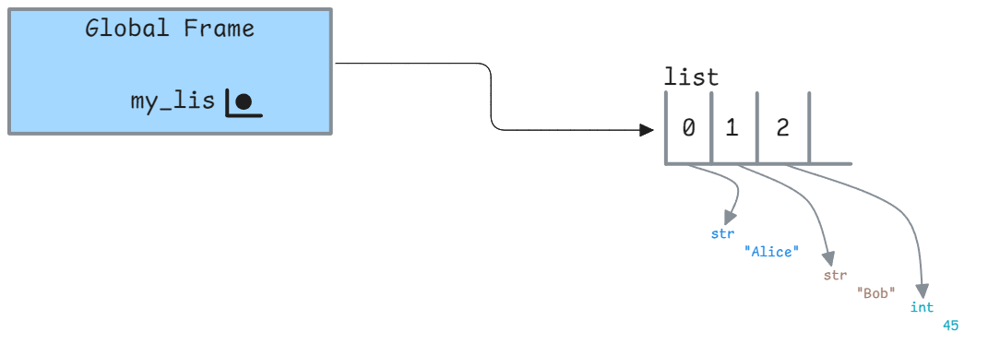
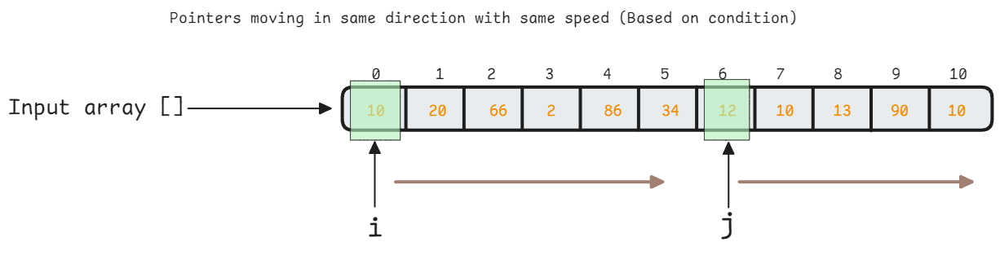
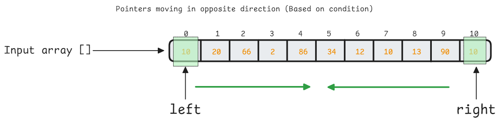

<h1 align="center"> Arrays </h1>

Linear data structure consisting elements of the same type and stored in contiguous memory locations. The first element corresponds to the lowest address, and the last element to the highest address. [Cache locality](https://www.geeksforgeeks.org/locality-of-reference-and-cache-operation-in-cache-memory/) is a significant advantage of arrays, as it allows for faster access to elements due to less [cache misses](https://stackoverflow.com/questions/18559342/what-is-a-cache-hit-and-a-cache-miss-why-would-context-switching-cause-cache-mi). However, arrays have a fixed size, and inserting or deleting elements can be expensive due to shifting elements.



In python we have something known as a **list** which is a _dynamic array_ and _heterogenous_ in nature. It is a built-in data structure in Python that can grow and shrink in size as needed. Lists are defined by enclosing elements in square brackets `[]` separated by commas.

```python
# Creating a list
nums = [1, 2, 3, 4, 5]

# Accessing elements
print(nums[0])  # 1

# Modifying elements
nums[0] = 10
print(nums)  # [10, 2, 3, 4, 5]
```

This is how a list is instantiated in the memory.


Internally, a list is represented as an array of pointers to the elements. The elements themselves are stored in a separate memory location. This allows for the list to store elements of different types and sizes.



## Time complexity of operations on Lists

| Operation |Time Complexity |
|:---------:|:---------------:|
| Access | O(1) |
| Insertion | O(n) |
| Deletion | O(n) |
| Append (to end) | O(1) |
| len() | O(1) |
| Pop (last element) | O(1) |
| Pop(i) | O(n) |
| Extend | O(k) |
| Contains | O(n) |
| Get Slice | O(k) |
| Del Slice | O(n) |
| Set Slice | O(n+k) |

---

## Strings

A string is a sequence of characters. In Python, strings are **immutable**, which means that once a string is created, it cannot be changed. Since there is no _char_ datatype in python, a character is represented as a string of length 1. 

We can perform the following operations on strings:

1. **Concatenation**: Combining two or more strings to create a new string.
2. **Indexing**: Accessing individual characters in a string using their position.
3. **Slicing**: Extracting a substring from a string.
4. **Length**: Finding the length of a string.
5. **Membership**: Checking if a character or substring is present in a string.
6. **Repetition**: Repeating a string multiple times.
7. **Comparison**: Comparing two strings lexicographically.
8. **Traversal**: Iterating over the characters of a string.

### Time Complexity

| Operation | Time Complexity |
|:---------:|:---------------:|
| Indexing | O(1) |
| Slicing | O(k) `k` is the length of the slice |
| Concatenation | O(n) `n` is the length of the resulting string |
| Length | O(1) |
| Membership | O(n) |
| Repetition | O(n) |
| Comparison | O(n) |
| Traversal | O(n) |

---

## Problem Solving Techniques for Arrays

1. **Two Pointer Approach**: The two-pointer approach is a useful strategy for optimizing time and space complexity in problems involving searching on arrays and linked lists. It uses pairs of indices or pointers to simultaneously iterate over two different input parts, which allows us to perform fewer operations. There are 3 variations of this approach:

- Pointers are moving in the same direction with the same pace.

<div align="center">



</div>

- Pointers are moving in the same direction at a different pace (Fast and slow pointers)

<div align="center">


</div>

- Pointers are moving in the opposite direction

<div align="center">



</div>

## Problem set

These are the problems I have solved in the `Arrays` section. Refer [this](https://www.techinterviewhandbook.org/grind75?hours=40&weeks=4) for most important problems related to arrays.

### Problem set - I

1. Find the minimum and maximum element in an array
2. Reverse an array
3. Remove element
4. Remove Duplicates from Sorted Array
5. Concatenation of Array
6. Second largest element in an array
7. Rotate an array by k times in the right direction
8. Rotate an array by k times in the left direction
9. Left rotate an array by 1 element
10. Move all zeros to the end of the array
11. Union of two sorted arrays
12. Intersection of two sorted arrays
13. Find all unique elements in an array
14. Find whether the inverse of the array is mirror inverse or not
15. Find all non-min-max elements in an array

## Problem set - II

1. Find all sub-array of an array
2. Find leaders in an array
3. Find the length of the smallest sub-array containing the min and max element
4. Sum in range of queries
5. Equilibrium index of an array | Middle index of an array | Pivot index of an array
6. Find all equilibrium indices in an array
7. Count good pairs
8. Count the number of leaders in the array
9. K-th Maximum Integer in a list
10. Non-constructible change
11. Tournament winner
12. Product array except self
13. Longest peak
14. Minimum operations to reduce x to zero
15. Find the first duplicate element in an array between 1 and N (Inclusive)

## Problem set - III

1. Find the sum of each row in a matrix
2. Find the sum of each column in a matrix
3. Return the two diagonals of a square matrix
4. Find the sum of two matrices
5. Find the product of two matrices
6. Find the boundary elements of a matrix
7. Traverse a matrix in a spiral order
8. Minimum cost to choose 3 Christmas trees
9. Find the anti-diagonals of a matrix
10. Weakest row in a matrix
11. Merge overlapping intervals
12. Monotonic array
13. Minimum operations to empty the array
14. Number of senior citizens


## Important Array and Hashing Problems ( + Two Pointer and Sliding Window)

1. [Duplicate Integer](https://neetcode.io/problems/duplicate-integer)
2. [Is Anagram](https://neetcode.io/problems/is-anagram)
3. [Two Sum](https://neetcode.io/problems/two-integer-sum)
4. [Anagram Group](https://neetcode.io/problems/anagram-groups)
5. [Top K Frequent Elements](https://neetcode.io/problems/top-k-elements-in-list)
6. [kth Largest Element](https://leetcode.com/problems/kth-largest-element-in-an-array/description/)
7. [Encode decode Strings](https://leetcode.com/problems/encode-and-decode-strings/description/)
8. [Product of array except self](https://leetcode.com/problems/product-of-array-except-self/description/)
9. [Valid Sudoku](https://leetcode.com/problems/valid-sudoku/description/)
10. [Longest consecutive sequence](https://leetcode.com/problems/longest-consecutive-sequence/description/)
11. [Valid Palindrome](https://leetcode.com/problems/valid-palindrome/description/)
12. [Two Sum II](https://leetcode.com/problems/two-sum-ii-input-array-is-sorted/description/)
13. [3Sum](https://leetcode.com/problems/3sum/description/)
14. [Container with most water](https://leetcode.com/problems/container-with-most-water/description/)
15. [Trapping Rain Water](https://leetcode.com/problems/trapping-rain-water/description/)