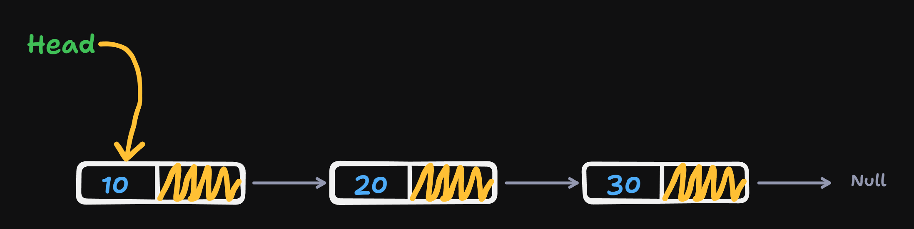
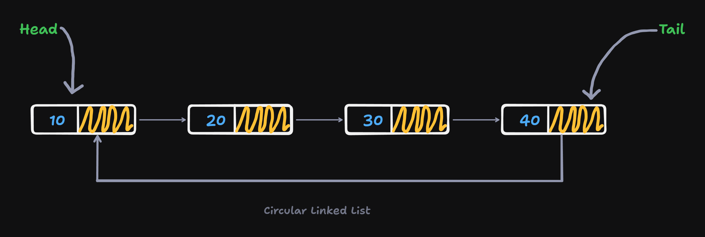
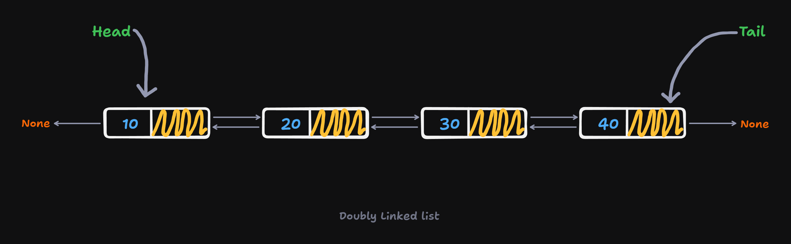

<h1 align="center"> LinkedLists </h1>

Linked lists are a linear data structure consisting of nodes where each node contains a data field and a reference to the next node in the sequence. The first node is called the `head`, and the last node is called the `tail`. The `tail` node points to `null` or `None` to indicate the end of the list. Linked lists are dynamic data structures that can grow or shrink in size during execution. They are efficient for insertion and deletion operations.

## Types of Linked Lists

1. **Singly Linked List**: Each node has a data field and a reference to the next node.

2. **Doubly Linked List**: Each node has a data field and references to the next and previous nodes.

3. **Circular Linked List**: The last node points to the first node, forming a circle.

### Singly Linked List



A simple Node would look like this:

```python
class Node:
    def __init__(self, data):
        self.data = data
        self.next = None
```

We can create a simple naive implementation of linked list using the `Node` class:

```python
head = Node(10)
head.next = Node(20)
head.next.next = Node(30)
```

We can traverse the above linked list and print the data of each node using the following code:

```python   
def print_linked_list(head):
    current = head
    while current:
        print(current.data)
        current = current.next
```

We search for a particular element in the linked list and return the position if found, else return -1:

```python
def search(head, key):
    current = head
    position = 1
    while current:
        if current.data == key:
            return position
        current = current.next
        position += 1
    return -1
```

We can insert a new node at the beginning of the linked list using the following code:

```python
def insert_at_beginning(head, data):
    new_node = Node(data)
    new_node.next = head
    return new_node
```

We can insert a new node at the end of the linked list using the following code:

```python
def insert_at_end(head, data):
    new_node = Node(data)
    if not head:
        return new_node
    current = head
    while current.next:
        current = current.next
    current.next = new_node
    return head
```

We can insert a new node at a given position in the linked list using the following code:

```python
def insert_at_pos(head, data, position):
    new_node = Node(data)
    if position == 1:
        new_node.next = head
        return new_node
    current = head
    for _ in range(position-2):
        if current is None:
            raise IndexError("Position out of bound")
        current = current.next

    if current is None:
        raise IndexError("Position out of bound")

    new_node.next = current.next
    current.next = new_node

    return head
```

We can delete the first node of the linked list using the following code:

```python
def delete_first_node(head):
    if not head:
        return None
    return head.next
```

We can delete the last node of the linked list using the following code:
    
```python
def delete_last_node(head):
    if head is None or head.next is None:
        return None
    current = head
    while current.next.next:
        current = current.next
    current.next = None
    return head
```

We can reverse a linked list using mainly 2 methods:

- Using auxiliary space (Use a stack or list to store the elements of the linked list and then pop them to create a new linked list)

- Reversing the links and updating the head

Following is the code to reverse a linked list using both the methods:

```python
def reverse_linked_list(head):
    prev = None
    current = head
    while current is not None:
        next_node = current.next
        current.next = prev
        prev = current
        current = next_node
    return prev
```

- This method is more efficient as it has a time complexity of $O(n)$ and space complexity of $O(1)$.

```python
def reverse_list_stack(head):
    stack = []
    current = head
    while current is not None:
        stack.append(current.data)
        current = current.next
    new_head = Node(stack.pop())
    current = new_head
    while stack:
        current.next = Node(stack.pop())
        current = current.next
    return new_head
```

Recursive solution to reverse a linked list:

```python
def reverse_linked_list_recursive(current, prev):
    if current is None:
        return prev
    next_node = current.next
    current.next = prev
    return reverse_linked_list_recursive(next_node, current)
```

### Circular Linked List

In a circular linked list, the last node points to the first node, forming a circle. Circular linked lists are used in applications where the list needs to be traversed in a circular manner. (e.g., round-robin scheduling)



Simple implementation of circular linked list would look like this:

```python
class Node:
    def __init__(self, data):
        self.data = data
        self.next = None


one = Node(10)
two = Node(20)
three = Node(30)
four = Node(40)

one.next = two
two.next = three
three.next = four
four.next = one
```

- We can view/traverse the circular linked list using the following code:

```python
def show_circular_list(head: Node):
    if head is None:
        return None
    print(head.data, end=' ')
    current = head.next
    while current != head:
        print(current.data, end=' ')
        current = current.next
    print()
```

- We can insert an element at the beginning of the circular linked list using the following code:

```python
def insert_at_beginning(head: Node, data: int):
    new_node = Node(data)
    if head is None:
        new_node.next = new_node
        return new_node
    new_node.next = head.next
    head.next = new_node
    head.data, new_node.data = new_node.data, head.data
    return head
```

_Here in order to insert a new node/element at the beginning; First we insert an element at the second position (next of head); then we swap the data of head and the second node, and return the head_.

- We can insert an element at the end of the circular linked list using the following code:

```python
def insert_at_end(head: Node, data: int):
    new_node = Node(data)
    if head is None:
        new_node.next = new_node
        return new_node
    new_node.next = head.next
    head.next = new_node
    head.data, new_node.data = new_node.data, head.data
    return new_node
```

_Here in order to insert a new node/element at the end; First we insert an element at the second position (next of head); then we swap the data of head and the second node and return the new node_.

- We can delete the first node of the circular linked list using the following code:

```python
def delete_first_node(head: Node):
    if head is None:
        return None
    
    # If there is only one node in the list
    if head.next == head:
        return None
    head.data = head.next.data
    head.next = head.next.next
    return head
```

_Here in order to delete the first node; we copy the data of the second node to the head and then update the next of head to the next of the second node and return the head (after copying the data from second node to head node; we link head with third node instead of second node)_.

- We can delete the last node of the circular linked list using the following code:

```python
def delete_last_node(head: Node):
    if head is None:
        return None
    
    # If there is only one node in the list
    if head.next == head:
        return None
    current = head
    while current.next.next != head:
        current = current.next
    current.next = head
    return head
```

- We can delete the k-th node of the circular linked list using the following code:

```python
def delete_kth_node(head: Node, k: int):
    if head is None:
        return None
    if k == 1:
        return delete_first_node(head)
    current = head
    for _ in range(k-2):
        current = current.next
    current.next = current.next.next
    return head
```

- We can search for an element in the circular linked list using the following code:

```python
def search(head: Node, key: int):
    if head is None:
        return False
    current = head
    while True:
        if current.data == key:
            return True
        current = current.next
        if current == head:
            return False
```

- We can reverse a circular linked list using the following code:

```python
def reverse_circular_list(head: Node):
    if head is None:
        return None
    current = head
    prev = None
    while True:
        next_node = current.next
        current.next = prev
        prev = current
        current = next_node
        if current == head:
            break
    head.next = prev
    return prev
```

### Doubly Linked List

In a doubly linked list, each node has a data field and two references to the next and previous nodes. Doubly linked lists allow traversal in both directions.



A simple Node would look like this:

```python
class Node:
    def __init__(self, data):
        self.data = data
        self.next = None
        self.prev = None
```

- We can create a simple doubly linked list using the `Node` class:

```python
head = Node(10)
two = Node(20)
three = Node(30)
four = Node(40)

head.next = two
two.prev = head
two.next = three
three.prev = two
three.next = four
four.prev = three
```

- We can traverse the above doubly linked list and print the data of each node using the following code:

```python
def print_doubly_linked_list(head):
    current = head
    while current:
        print(current.data, end=' -><- ')
        current = current.next
    print('None')
```

- We can search for a particular element in the doubly linked list and return the position if found, else return -1:

```python
def search(head, key):
    current = head
    position = 1
    while current:
        if current.data == key:
            return position
        current = current.next
        position += 1
    return -1
```

- We can insert a new node at the beginning of the doubly linked list using the following code:

```python
def insert_at_beginning(head, data):
    new_node = Node(data)
    new_node.next = head
    if head is not None:
        head.prev = new_node
    return new_node
```

- We can insert a new node at the end of the doubly linked list using the following code:

```python
def insert_at_end(head: Node, data):
    new_node = Node(data)
    if head is None or head.next is None:
        return new_node
    current = head
    while current.next.next is not None:
        current = current.next
    current.next = new_node
    new_node.prev = current
    return head
```

- We can insert a new node at a given position in the doubly linked list using the following code:

```python
def insert_at_pos(head, data, position):
    new_node = Node(data)
    if position == 1:
        new_node.next = head
        head.prev = new_node
        return new_node
    current = head
    for _ in range(position-2):
        if current is None:
            raise IndexError("Position out of bound")
        current = current.next

    if current is None:
        raise IndexError("Position out of bound")

    new_node.next = current.next
    new_node.prev = current
    if current.next is not None:
        current.next.prev = new_node
    current.next = new_node

    return head
```

- We can delete the first node of the doubly linked list using the following code:

```python
def delete_first_node(head):
    if head is None:
        return None
    if head.next is None:
        return None
    head = head.next
    head.prev = None
    return head
```

- We can delete the last node of the doubly linked list using the following code:

```python
def delete_last_node(head):
    if head is None:
        return None
    if head.next is None:
        return None
    current = head
    while current.next.next is not None:
        current = current.next
    current.next = None
    return head
```

- We can delete the k-th node of the doubly linked list using the following code:

```python
def delete_kth_node(head, k):
    if head is None:
        return None
    if k == 1:
        return delete_first_node(head)
    current = head
    for _ in range(k-2):
        current = current.next
    if current.next is None:
        raise IndexError("Position out of bound")
    current.next = current.next.next
    if current.next is not None:
        current.next.prev = current
    return head
```

- We can reverse a doubly linked list using the following code:

```python
def reverse_doubly_list(head: Node):
    prev = None
    current = head
    while current is not None:
        prev = current
        current.next, current.prev = current.prev, current.next
        current = current.prev
    return prev  
```

**[Implementation](./Implementation.ipynb)**

## Important Questions

1. [Reverse a linked list](https://leetcode.com/problems/reverse-linked-list/description/)
2. [Merge two sorted linked lists](https://leetcode.com/problems/merge-two-sorted-lists/description/)
3. [Design browser history using linked list](https://leetcode.com/problems/design-browser-history/description/)
4. Find the duplicate element {Floyd's Cycle Detection Algorithm}
