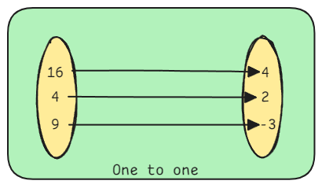
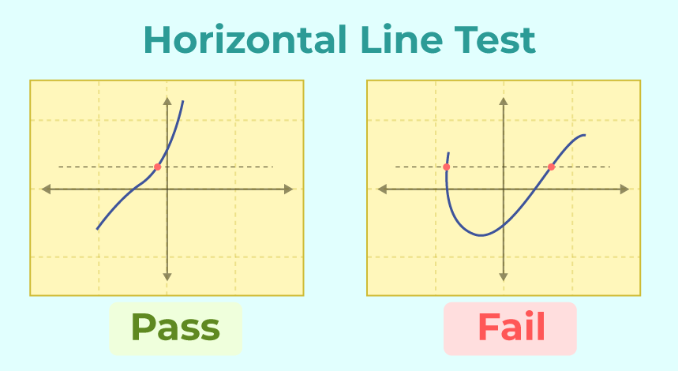

# Functions

In functions it is possible for different inputs to yield the same output, but one input cannot yield multiple outputs.

## Types of Functions

Functions can be classified in various ways based on their properties, algebraic form, or mapping characteristics.

### 1. Based on Mapping/Correspondence:

1.  **One-to-One Function (Injective Function):** Each element in the domain maps to a unique element in the range. No two distinct inputs produce the same output.

* If $f(x_1) = f(x_2)$, then $x_1 = x_2$.

* **Horizontal Line Test:** If any horizontal line intersects the graph at most once, it's a one-to-one function.

2.  **Onto Function (Surjective Function):** Every element in the co-domain is an output for at least one input in the domain. The range is equal to the co-domain.

    * For every $y \in B$, there exists an $x \in A$ such that $f(x) = y$.

3.  **One-to-One and Onto Function (Bijective Function):** A function that is both injective and surjective. Each element in the domain maps to exactly one unique element in the co-domain, and every element in the co-domain is mapped to.

    * Bijective functions are important because they are the only functions that have true **inverse functions**.

### 2. Based on Algebraic Form:

1.  **Algebraic Functions:** Functions that can be expressed using a finite number of algebraic operations (addition, subtraction, multiplication, division, raising to a rational power).

    * **Polynomial Functions:** Functions of the form $f(x) = a_n x^n + a_{n-1} x^{n-1} + \dots + a_1 x + a_0$, where $a_i$ are constants and $n$ is a non-negative integer.

        * **Constant Function:** $f(x) = c$ (degree 0) - horizontal line.

        * **Linear Function:** $f(x) = mx + c$ (degree 1) - straight line.

        * **Quadratic Function:** $f(x) = ax^2 + bx + c$ (degree 2) - parabola.

        * **Cubic Function:** $f(x) = ax^3 + bx^2 + cx + d$ (degree 3).

    * **Rational Functions:** Functions that are ratios of two polynomial functions, $f(x) = \frac{P(x)}{Q(x)}$, where $Q(x) \neq 0$.

    * **Radical Functions:** Functions involving roots (e.g., square roots, cube roots).

2.  **Transcendental Functions:** Functions that are not algebraic; they "transcend" algebraic operations.

    * **Exponential Functions:** $f(x) = a^x$, where $a > 0$ and $a \neq 1$.

    * **Logarithmic Functions:** $f(x) = \log_b x$, which are inverses of exponential functions.

    * **Trigonometric Functions:** Sine ($\sin x$), Cosine ($\cos x$), Tangent ($\tan x$), and their reciprocals and inverses. These are periodic functions.

    * **Hyperbolic Functions:** Analogues of trigonometric functions based on the hyperbola.

### 3. Based on Properties/Behavior:

1.  **Even Functions:** $f(-x) = f(x)$ for all $x$ in the domain. Symmetric about the y-axis.

2.  **Odd Functions:** $f(-x) = -f(x)$ for all $x$ in the domain. Symmetric about the origin.

3.  **Periodic Functions:** $f(x+P) = f(x)$ for some constant $P > 0$ (the period). The function's graph repeats itself over intervals of length $P$. (e.g., trigonometric functions).

4.  **Continuous Functions:** A function whose graph can be drawn without lifting the pen from the paper. Informally, small changes in input lead to small changes in output. (Formally defined using limits).

5.  **Discontinuous Functions:** Functions that are not continuous, having "jumps," "holes," or "vertical asymptotes."

6.  **Piecewise Functions:** Functions defined by different formulas on different parts of their domain.

7.  **Implicit Functions:** A function defined by an equation where the dependent variable is not explicitly expressed in terms of the independent variable (e.g., $x^2 + y^2 = r^2$).

8.  **Explicit Functions:** A function where the dependent variable is clearly isolated on one side of the equation (e.g., $y = x^2 + 3$).

---

## Function Operations
* **Arithmetic Operations:** Adding, subtracting, multiplying, and dividing functions:

    * $(f+g)(x) = f(x) + g(x)$

    * $(f-g)(x) = f(x) - g(x)$

    * $(fg)(x) = f(x) \cdot g(x)$

    * $(\frac{f}{g})(x) = \frac{f(x)}{g(x)}$, provided $g(x) \neq 0$.

* **Function Composition:** Combining two functions where the output of one becomes the input of the other.

    * $(f \circ g)(x) = f(g(x))$ (read as "f of g of x"). The domain of $f \circ g$ includes all $x$ in the domain of $g$ such that $g(x)$ is in the domain of $f$.

    * Composition is generally not commutative ($f \circ g \neq g \circ f$).

---

## Graphing Functions
Graphing a function means visually representing its behavior on a coordinate plane. The graph of a function `f(x)` is the set of all points `(x,y)` where `y=f(x)`.

- **Coordinate Plane**: A two-dimensional plane formed by the intersection of a horizontal x-axis (independent variable) and a vertical y-axis (dependent variable). The intersection point is the origin (0,0).

- **Plotting Points**: For any input x in the domain, calculate the corresponding output y=f(x). Then plot the point (x,y) on the coordinate plane.

- **Connecting Points**: For most functions encountered in basic algebra, the points can be connected to form a smooth curve or line, assuming the function is continuous. For discontinuous functions, there will be breaks or jumps.

### Key Features to Identify/Analyze from a Graph

1. **Intercepts**:
    1. **y-intercept**: The point where the graph crosses the y-axis. This occurs when `x=0`. To find it, calculate `f(0)`. A function can have at most one y-intercept (due to the vertical line test).

    1. **x-intercepts (or Zeros/Roots)**: The points where the graph crosses the x-axis. This occurs when `y=0` (i.e., `f(x)=0`). To find them, solve the equation f(x)=0. A function can have multiple x-intercepts.

1. **Domain and Range (from Graph)**:
    1. **Domain**: The set of all x-values for which the graph exists. Visually, project the graph onto the x-axis.

    1. **Range**: The set of all y-values for which the graph exists. Visually, project the graph onto the y-axis.

1. **Asymptotes**: Lines that the graph approaches but never quite touches (or touches at infinity).

1. **Local Maxima and Minima (Turning Points)**:

    1. **Local Maximum**: A point where the function changes from increasing to decreasing, forming a "hill" on the graph.
    
    1. **Local Minimum**: A point where the function changes from decreasing to increasing, forming a "valley" on the graph.

1. **Monotonicity (Increasing/Decreasing Intervals)**:

    1. **Increasing**: As x increases, y also increases (graph goes uphill from left to right).
    
    1. **Decreasing**: As x increases, y decreases (graph goes downhill from left to right).
    
    1. **Constant**: As x increases, y remains the same (horizontal line segment).

## Graph Transformations

Understanding these allows you to graph many functions by knowing the basic shape and applying simple rules. Let $y = f(x)$ be the original function.

* **Vertical Shifts:**
    * $y = f(x) + c$: Shift graph UP by $c$ units.
    * $y = f(x) - c$: Shift graph DOWN by $c$ units.

* **Horizontal Shifts:**
    * $y = f(x - c)$: Shift graph RIGHT by $c$ units. (Counter-intuitive, $x$ must be larger to get the same output)
    * $y = f(x + c)$: Shift graph LEFT by $c$ units. ($x$ must be smaller)

* **Reflections:**
    * $y = -f(x)$: Reflect graph across the **x-axis**. (Outputs change sign)
    * $y = f(-x)$: Reflect graph across the **y-axis**. (Inputs change sign)

* **Vertical Stretches/Compressions:**
    * $y = a \cdot f(x)$ (where $a > 0$):
        * If $a > 1$: Vertical Stretch (graph becomes "taller" or "skinnier").
        * If $0 < a < 1$: Vertical Compression (graph becomes "shorter" or "wider").

* **Horizontal Stretches/Compressions:**
    * $y = f(ax)$ (where $a > 0$):
        * If $a > 1$: Horizontal Compression (graph becomes "skinnier").
        * If $0 < a < 1$: Horizontal Stretch (graph becomes "wider"). (Again, counter-intuitive)

---

## Inverse Functions

A function $f^{-1}(x)$ that "undoes" the action of $f(x)$. If $f(a) = b$, then $f^{-1}(b) = a$.

* An inverse function exists if and only if the original function is **bijective** (one-to-one and onto).

* The domain of $f$ is the range of $f^{-1}$, and the range of $f$ is the domain of $f^{-1}$.

* The graph of $f^{-1}(x)$ is a reflection of the graph of $f(x)$ across the line $y=x$.

* To find an inverse function algebraically:
    1.  Replace $f(x)$ with $y$.
    2.  Swap $x$ and $y$.
    3.  Solve the new equation for $y$.
    4.  Replace $y$ with $f^{-1}(x)$.

---

## Continuity and Discontinuity

Continuity is a fundamental concept in calculus, referring to the "smoothness" or "connectedness" of a function's graph.

### Intuitive Understanding of Continuity

A function is continuous if you can draw its graph without lifting your pen from the paper. There are no sudden jumps, breaks, holes, or gaps in the graph.

### Continuity at a Point

A function $f(x)$ is continuous at a point $x=c$ if and only if all three of the following conditions are met:

1.  **$f(c)$ is defined:** The function must have a value at $x=c$. The point $(c, f(c))$ must exist on the graph.

2.  **$\lim_{x \to c} f(x)$ exists:** The limit of the function as $x$ approaches $c$ from both the left and the right must exist and be equal. This means $\lim_{x \to c^-} f(x) = \lim_{x \to c^+} f(x)$.

3.  **$\lim_{x \to c} f(x) = f(c)$:** The limit value must be equal to the function's actual value at that point. The "intended" value must be the "actual" value.

### Continuity over an Interval

A function is **continuous on an open interval $(a, b)$** if it is continuous at every point in that interval.

A function is **continuous on a closed interval $[a, b]$** if it is continuous on $(a, b)$, and also right-continuous at $a$ ($\lim_{x \to a^+} f(x) = f(a)$) and left-continuous at $b$ ($\lim_{x \to b^-} f(x) = f(b)$).

### Properties of Continuous Functions

* If $f$ and $g$ are continuous at $c$, then $f+g$, $f-g$, $fg$ are continuous at $c$.

* If $f$ and $g$ are continuous at $c$, then $f/g$ is continuous at $c$, provided $g(c) \neq 0$.

* Polynomial functions are continuous everywhere.

* Rational functions are continuous everywhere in their domain (i.e., except where the denominator is zero).

* Trigonometric functions are continuous in their domains.

* Composition of continuous functions is continuous: If $g$ is continuous at $c$ and $f$ is continuous at $g(c)$, then $(f \circ g)(x)$ is continuous at $c$.
