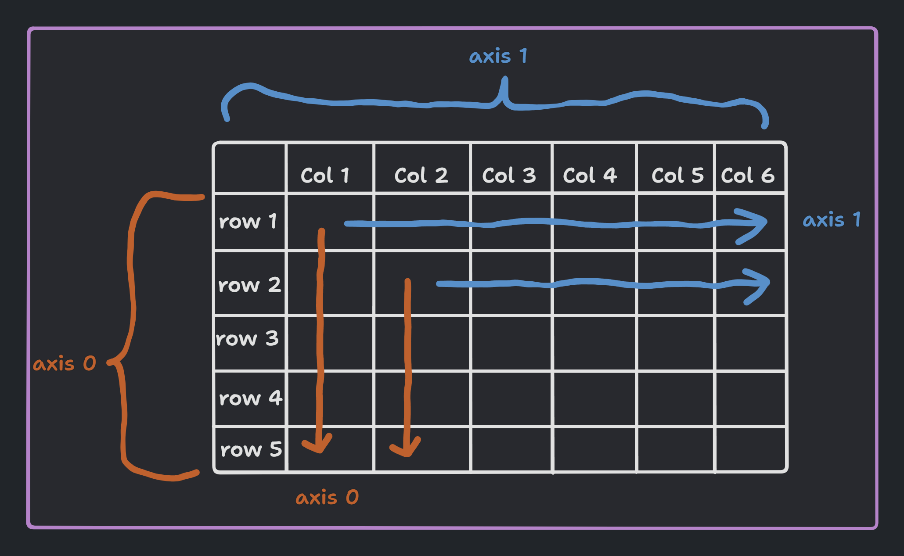

<h1 align="center"> Numpy </h1>

`Numpy` or Numerical Python is a python library for working with multi-dimensional array objects. It also has functions for working in domain of linear algebra, fourier transform, and matrices. The performance critical parts of the `numpy` library are written in C/C++, which makes it quite fast. It is also optimized for `vectorized operations` and thus it is extensively used for performing operations on individual elements.

The primary data structure in Numpy is the `ndarray` (n-dimensional array). It is a `homogeneous multidimensional` array of fixed-size items. In Numpy dimensions are called `axes`. The number of axes is called `rank`.  Some important numpy **functions/attributes** are:

- `ndarray.shape` - returns a tuple consisting of array dimensions (similar to (rows, columns))
- `ndarray.ndim` - returns the number of array dimensions
- `ndarray.size` - returns the total number of elements in the array
- `ndarray.dtype` - returns the type of elements in the array
- `ndarray.itemsize` - returns the size of each element in the array in bytes

Similar to `range` in python, numpy has `arange` which returns an array instead of a list. It also takes float arguments unlike `range`. Additionally numpy provides `linspace` which generates evenly spaced numbers over a specified interval. It takes the start, stop and number of elements as arguments. We use it when we want to divide a range into equal parts.

We can use `reshape` to change the shape of an array. The number of elements in the array should be the same as the number of elements in the new shape. It returns a new array. We also have `resize` which is similar to reshape but the number of elements in the array can be different from the number of elements in the new shape, if the number of elements is less than the number of elements in the new shape then the array will be filled by repeating the elements. We can also use `flatten` or `ravel` to flatten an array into a 1D array. `flatten` returns a copy of the array while `ravel` performs the operation in place. 

> <picture>
>   <source media="(prefers-color-scheme: light)" srcset="https://raw.githubusercontent.com/Mqxx/GitHub-Markdown/main/blockquotes/badge/light-theme/warning.svg">
>   
> </picture><br>
>
> `np.resize()` and `arr.resize()` are different, `np.resize()` returns a new array with the new shape and `arr.resize()` changes the shape of the array in place, also `np.resize()` can take a tuple as the new shape and fills the remaining elements with *copies* while `arr.resize()` can only take a list as the new shape and fills the remaining elements with *zeros*.

Numpy also has a lot of functions for creating arrays like `zeros`, `ones`, `full`, `eye`, `random`, etc. Along with that it also has functions for performing operations on arrays like `min`, `max`, `sum`, `mean`, `std`, `var`, `argmin`, `argmax`, `cumsum`, `cumprod`, etc.

Numpy is heavily optimized for performing `Vectorized` operations. In numpy it is implemented using `UFuncs` (Universal functions). Some `UFuncs` are;

- `np.add(x1, x2)` : Add two arrays element-wise.
- `np.subtract(x1, x2)` : Subtract elements of second array from first array.
- `np.multiply(x1, x2)` : Multiply two arrays element-wise.
- `np.divide(x1, x2)` : Divide first array by second array element-wise.
- `np.power(x1, x2)` : Raise elements of first array to powers from second array element-wise.
- `np.log(x)` : Natural logarithm, element-wise.
- `np.sin(x)` : Computes the sine of each element in radians.

- `np.cos(x)` : Computes the cosine of each element in radians.

- `np.round(x)` : Rounds each element to the nearest integer.

`Aggregate/reduction Functions` are the functions in numpy that can be used to perform operations on the entire array. Some of the aggregate functions are:
- `np.sum()`
- `np.min()`
- `np.max()`
- `np.mean()`
- `np.any()`
- `np.all()`

**`Axes`**; Dimensions of the arrays. In numpy, the axes are defined for arrays with more than one dimension. 

>For 1D arrays, it is the same as the dimension of the array. 

> For 2D array having 3 rows and 4 columns, the axis 0 is the column and has 3 elements in it, and axis 1 is the row and has 4 elements in it.



### Broadcasting

Broadcasting is a mechanism that allows NumPy to perform operations on arrays of different shapes. For example, we can add a scalar to an array of any shape, or we can add a 1D array to a 2D array. The way broadcasting works is by first comparing the shape of the arrays element-wise starting from the trailing dimensions and working its way forward. Two dimensions are compatible when they are equal or one of them is 1. If these conditions are not met then a `ValueError` is raised. After the dimensions are found to be compatible, the array with fewer dimensions is padded with ones on its leading side. After that, the arrays are said to be `broadcastable` and the broadcasting operation is performed on them. 

[Classic example of broadcasting from numpy documentation](https://numpy.org/doc/stable/user/basics.broadcasting.html#a-practical-example-vector-quantization)

### Views and Copies

Numpy saves memory whenever possible using by directly using a `View` instead of passing copies. It does this by accessing the internal data buffer. A `View` can be created using `np.view()` or by slicing an array. Although this enures good performance, it can become a problem if we use numpy arrays without knowing this.

We can find whether an array is a view or a copy by using `np.base` which returns the base object of the array. If the array is a view then it will return the original array, if it is a copy then it will return `None`.

```python
arr  = np.array([1, 2, 3, 4, 5])
arr2 = arr[1:4]
print(arr2.base) # [1 2 3 4 5]
```

### Structured arrays

Structured arrays are nd-arrays whose datatype is a composition of simpler data types organized as a sequence of named fields. They are designed to mimic `structs` in C. 

```python
dt = np.dtype([('name', np.unicode_, 16), ('grades', np.float64, (2,))])
x = np.array([('Sarah', (8.0, 7.0)), ('John', (6.0, 7.0))], dtype=dt)
print(x[1]) # ('John', [6., 7.])
print(x['grades']) # [array([8., 7.]) array([6., 7.])]
```

### [Numpy Documentation](https://numpy.org/doc/stable/) | [Numpy tutorials](https://numpy.org/numpy-tutorials/)
