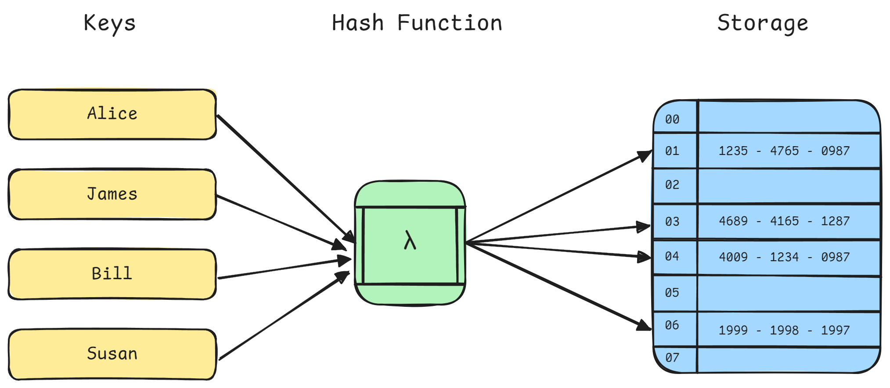
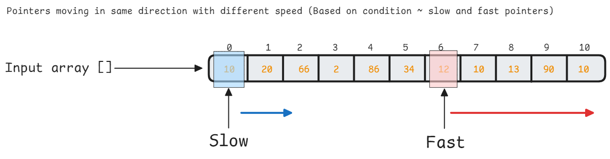
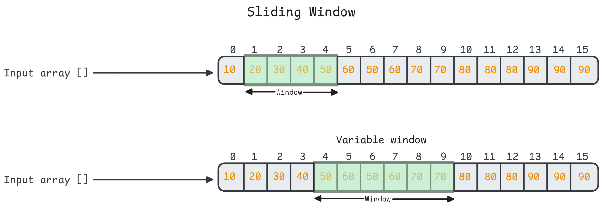

<h1 align="center"> Arrays & Hashing </h1> 

## Introduction

**Arrays** are contiguous memory blocks storing elements of the same type, providing `O(1)` random access. Arrays excel at indexed access. Inserting and deleting elements can be expensive.


> In python we have **list** which is similar to dynamic arrays

**Hash tables** (`dicts` in Python) map keys to values using hash functions, offering average `O(1)` lookup, insertion, and deletion. Hash tables excel at key-based retrieval.



Collision occurs when two different keys are mapped to the same hash value or index by a hash function.

**Hash Collision Handling**:
- **Chaining**: Store collisions in linked lists
- **Open addressing**: Probe for next available slot
- **Load factor**: Python dicts resize when **~2/3 full ($\approx 0.67$)** to maintain `O(1)`

Python uses **open addressing** with random (actually deterministic “perturbation”) probing. When collision occurs, it searches for the next available slot using a pseudo-random sequence.

> Both arrays and hash table operations are covered in [Python docs](../02%20Python%20Programming/Python%20I.md)

### Basic Array and Hashing patterns

```py
from collections import defaultdict, Counter

# Basic array operations
arr = [1, 2, 3, 4, 5]
print(arr[2])  # O(1) access
arr.append(6)  # O(1) amortized
arr.insert(0, 0)  # O(n) - requires shifting

# Hash table patterns
freq_map = {}
for item in arr:
    freq_map[item] = freq_map.get(item, 0) + 1

# Pythonic alternative using Counter
freq_map = Counter(arr)

# defaultdict avoids KeyError
graph = defaultdict(list)
graph['A'].append('B')  # No need to initialize

# Set operations for O(1) membership testing
seen = set()
duplicates = [x for x in arr if x in seen or seen.add(x)]
```

1. **Two-Sum Pattern** (Hash for complement lookup)

```python
def two_sum(nums, target):
    """Find two numbers that add up to target."""
    seen = {}
    for i, num in enumerate(nums):
        complement = target - num
        if complement in seen:
            return [seen[complement], i]
        seen[num] = i
    return []
```

2. **Frequency counting**
```python
from collections import Counter

def top_k_frequent(nums, k):
    """Find k most frequent elements."""
    return [num for num, _ in Counter(nums).most_common(k)]
```

3. **Subarray sum using prefix sums**
```python
def subarray_sum(nums, k):
    """Count subarrays with sum equal to k."""
    prefix_sum = 0
    count = 0
    sum_freq = {0: 1}  # Handle sum from start
    
    for num in nums:
        prefix_sum += num
        # Check if (prefix_sum - k) exists
        count += sum_freq.get(prefix_sum - k, 0)
        sum_freq[prefix_sum] = sum_freq.get(prefix_sum, 0) + 1
    
    return count
```

### Complexity Analysis

| Operation | Array | Hash Table | Notes |
|-----------|-------|------------|-------|
| Access by index | O(1) | N/A | Direct memory offset |
| Search by value | O(n) | O(1) avg | Hash collision → O(n) worst |
| Insert at end | O(1) amortized | O(1) avg | Array may need resizing |
| Insert at position | O(n) | N/A | Requires shifting elements |
| Delete | O(n) | O(1) avg | Array requires shifting |
| Space | O(n) | O(n) | Hash table has overhead |

**Edge Cases to Consider**:
- Empty arrays/dicts
- Single element
- All duplicates
- Hash collision scenarios (though Python handles this)
- Integer overflow (less common in Python but relevant in systems programming)

---

## Two Pointer Pattern

Two pointers involve maintaining two indices that traverse an array/string simultaneously, either:

- **Converging**: Moving toward each other (starts at opposite ends)


- **Same direction**: Both moving forward at different speeds



- **Sliding Window**: Maintaining a variable-sized window


### Why two pointer approach?

- Reduces $O(n^2)$ brute force to $O(n)$ by intelligently pruning the search space. Common in array manipulation, string processing, and sequence analysis.

### When to consider

When you need to examine pairs/subarrays and the problem has ordering or sorting properties, two pointers can eliminate nested loops.

- **Pattern 1: Opposite Direction (Converging)**
```py
def two_sum_sorted(nums, target):
    """Find pair in sorted array that sums to target."""
    left, right = 0, len(nums) - 1
    
    while left < right:
        current_sum = nums[left] + nums[right]
        
        if current_sum == target:
            return [left, right]
        elif current_sum < target:
            left += 1  # Need larger sum
        else:
            right -= 1  # Need smaller sum
    
    return []

# Time: O(n), Space: O(1)
```

- **Pattern 2: Same Direction (Fast & Slow)**

```python
def remove_duplicates(nums):
    """Remove duplicates in-place from sorted array."""
    if not nums:
        return 0
    
    slow = 0  # Position for next unique element
    
    for fast in range(1, len(nums)):
        if nums[fast] != nums[slow]:
            slow += 1
            nums[slow] = nums[fast]
    
    return slow + 1  # Length of unique elements

# Time: O(n), Space: O(1)
```

- **Pattern 3: Partition (Dutch National Flag)**

```python
def sort_colors(nums):
    """Sort array of 0s, 1s, 2s in-place."""
    low, mid, high = 0, 0, len(nums) - 1
    
    while mid <= high:
        if nums[mid] == 0:
            nums[low], nums[mid] = nums[mid], nums[low]
            low += 1
            mid += 1
        elif nums[mid] == 1:
            mid += 1
        else:  # nums[mid] == 2
            nums[mid], nums[high] = nums[high], nums[mid]
            high -= 1
    
    return nums

# Time: O(n), Space: O(1) - single pass!
```

- **Pattern 4: Palindrome Checking**

```python
def is_palindrome(s):
    """Check if string is palindrome (alphanumeric only)."""
    left, right = 0, len(s) - 1
    
    while left < right:
        # Skip non-alphanumeric
        while left < right and not s[left].isalnum():
            left += 1
        while left < right and not s[right].isalnum():
            right -= 1
        
        if s[left].lower() != s[right].lower():
            return False
        
        left += 1
        right -= 1
    
    return True

# Time: O(n), Space: O(1)
```

- Consider two pointers approach when the problem involves:
    - Sorted/sortable input
    - Pairs/triplets with sum conditions
    - In-place array modification
    - Palindrome checking
    - Partitioning around a pivot

- While using two pointers, always ensure progress condition to avoid infinite loops.

```python
def two_pointer_template(arr):
    """Generic two pointer template."""
    # Initialize pointers based on pattern
    left, right = 0, len(arr) - 1  # or both at 0
    
    while left < right:  # or other termination condition
        # Check current state
        if satisfies_condition(arr[left], arr[right]):
            # Process and move pointers
            pass
        elif needs_larger:
            left += 1
        else:
            right -= 1
    
    return result
```

**Edge Cases**:
- Empty array
- Single element
- All elements identical
- Already in desired state
- No valid solution exists

### Sliding Window

Maintains a window `[left, right]` over a sequence and adjust its boundaries to satisfy constraints. The window can be:

- **Fixed size**: Window size constant (`k` elements)

- **Variable size**: Expands/contracts based on conditions



- It transforms $O(n·k)$ or $O(n^2)$ problems to $O(n)$ by reusing computations within the window instead of recalculating from scratch.

- When you need to find a contiguous subarray/substring satisfying some property, sliding window often applies. The "sliding" reuses work done in previous positions.

- **Pattern 1: Fixed-Size Window**

```python
def max_sum_subarray(nums, k):
    """Find maximum sum of k consecutive elements."""
    if len(nums) < k:
        return None
    
    # Initialize first window
    window_sum = sum(nums[:k])
    max_sum = window_sum
    
    # Slide window
    for i in range(k, len(nums)):
        # Remove leftmost, add rightmost
        window_sum = window_sum - nums[i - k] + nums[i]
        max_sum = max(max_sum, window_sum)
    
    return max_sum

# Time: O(n), Space: O(1)
```

- **Pattern 2: Variable-Size Window (Expand & Contract)**

```python
def longest_substring_without_repeat(s):
    """Find length of longest substring without repeating chars."""
    char_set = set()
    left = 0
    max_len = 0
    
    for right in range(len(s)):
        # Contract window if duplicate found
        while s[right] in char_set:
            char_set.remove(s[left])
            left += 1
        
        # Expand window
        char_set.add(s[right])
        max_len = max(max_len, right - left + 1)
    
    return max_len

# Time: O(n), Space: O(min(n, charset_size))
```

- **Pattern 3: At Most K Constraint**

```python
def longest_subarray_at_most_k_distinct(nums, k):
    """Find longest subarray with at most k distinct elements."""
    from collections import defaultdict
    
    count = defaultdict(int)
    left = 0
    max_len = 0
    
    for right in range(len(nums)):
        # Expand: add right element
        count[nums[right]] += 1
        
        # Contract: shrink until valid
        while len(count) > k:
            count[nums[left]] -= 1
            if count[nums[left]] == 0:
                del count[nums[left]]
            left += 1
        
        # Update result
        max_len = max(max_len, right - left + 1)
    
    return max_len

# Time: O(n), Space: O(k)
```

- **Pattern 4: Exact Match Window**

```python
def min_window_substring(s, t):
    """Find minimum window in s containing all characters of t."""
    from collections import Counter
    
    if not t or not s:
        return ""
    
    # Character frequency in t
    t_count = Counter(t)
    required = len(t_count)
    
    # Sliding window counters
    window_count = {}
    formed = 0  # Characters meeting requirement
    
    left = 0
    min_len = float('inf')
    result = (0, 0)  # (left, right) of min window
    
    for right in range(len(s)):
        # Expand window
        char = s[right]
        window_count[char] = window_count.get(char, 0) + 1
        
        if char in t_count and window_count[char] == t_count[char]:
            formed += 1
        
        # Contract window when valid
        while formed == required and left <= right:
            # Update result if smaller window found
            if right - left + 1 < min_len:
                min_len = right - left + 1
                result = (left, right)
            
            # Remove leftmost character
            char = s[left]
            window_count[char] -= 1
            if char in t_count and window_count[char] < t_count[char]:
                formed -= 1
            
            left += 1
    
    return "" if min_len == float('inf') else s[result[0]:result[1] + 1]

# Time: O(|s| + |t|), Space: O(|s| + |t|)
```

#### Complexity Analysis

| Window Type | Time | Space | Key Characteristic |
|-------------|------|-------|-------------------|
| Fixed size | O(n) | O(1) to O(k) | Window size constant |
| Variable size | O(n) | O(k) | Window expands/contracts |
| With frequency map | O(n) | O(charset) | Track element counts |
| Nested conditions | O(n) | Depends on state | Each element visited ≤ 2 times |

- **Why $O(n)$ even with nested while?** Each element is added once (right pointer) and removed once (left pointer), so total operations = $2n$ = $O(n)$.

1. "How do you know when to expand vs contract the window?"
   - **Answer**: 
     - **Expand** (move right): Always expand to explore new elements
     - **Contract** (move left): When window violates constraint (too large, invalid, etc.)
     - Pattern: Outer loop expands, inner while loop contracts

2. "Fixed vs variable size window - how to decide?"
   - **Answer**:
     - **Fixed size**: Problem explicitly mentions "k consecutive elements" or window size is predetermined
     - **Variable size**: Looking for "longest/shortest" substring/subarray satisfying some property

```python
def sliding_window_template(arr, constraint):
    """Generic sliding window template."""
    left = 0
    state = initialize_state()  # e.g., Counter, set, sum
    result = initial_result()
    
    for right in range(len(arr)):
        # Expand window: add arr[right]
        update_state_expand(state, arr[right])
        
        # Contract window while invalid
        while not is_valid(state, constraint):
            update_state_contract(state, arr[left])
            left += 1
        
        # Update result with current valid window
        result = update_result(result, right - left + 1)
    
    return result
```

**Edge Cases**:
- Empty input
- Window size larger than array
- All elements satisfy/violate constraint
- Single element array
- No valid window exists

---

**[Array-Hashing Questions Notebook](./Notebooks/Arrays-Hashing.ipynb)**
