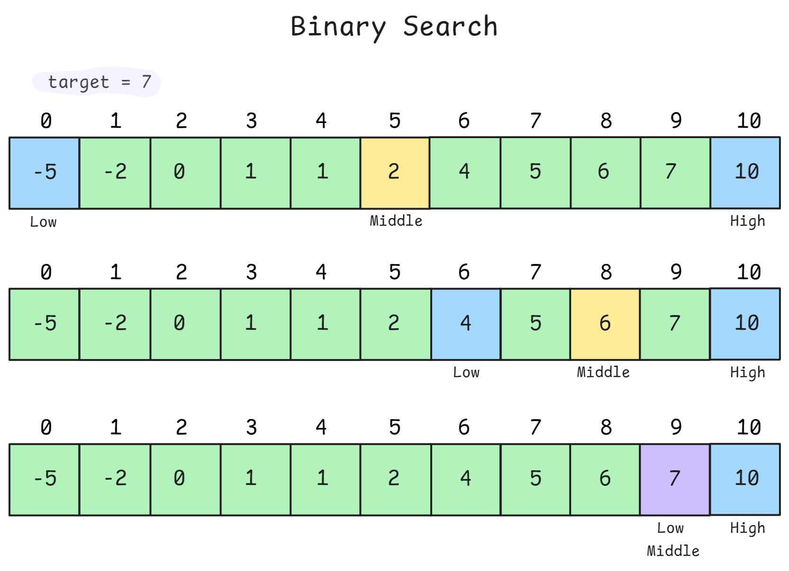

<h1 align="center"> Binary Search </h1>

Binary Search repeatedly divides a sorted search space in half, eliminating half of the remaining elements in each step. We can use binary search for searching an element in sorted array or use it on answer space to find optimal value satisfying condition



It reduces search time from $O(n)$ to $O(log\;n)$ (logarithmic). Which means even billion element require only ~30 comparisons. Binary search works on any monotonic function(sorted array, or any property that divides space into "yes/no" regions)

> Ask: "**Can I define a condition that splits the space?**"

## Python Implementation

**Classic Binary Search**:

```python
def binary_search(nums, target):
    """
    Standard binary search - find target in sorted array.
    
    Returns: index if found, -1 otherwise
    """
    left, right = 0, len(nums) - 1
    
    while left <= right:  # Note: <= to check when left == right
        mid = left + (right - left) // 2  # Avoid overflow
        
        if nums[mid] == target:
            return mid
        elif nums[mid] < target:
            left = mid + 1  # Search right half
        else:
            right = mid - 1  # Search left half
    
    return -1  # Not found

# Time: O(log n), Space: O(1)
```

**Finding Boundaries (First/Last Occurrence)**:

```python
def find_first_occurrence(nums, target):
    """
    Find leftmost (first) occurrence of target.
    
    Key: When found, keep searching left to find earlier occurrences.
    """
    left, right = 0, len(nums) - 1
    result = -1
    
    while left <= right:
        mid = left + (right - left) // 2
        
        if nums[mid] == target:
            result = mid  # Record position
            right = mid - 1  # Continue searching left
        elif nums[mid] < target:
            left = mid + 1
        else:
            right = mid - 1
    
    return result

# Time: O(log n), Space: O(1)


def find_last_occurrence(nums, target):
    """
    Find rightmost (last) occurrence of target.
    
    Key: When found, keep searching right to find later occurrences.
    """
    left, right = 0, len(nums) - 1
    result = -1
    
    while left <= right:
        mid = left + (right - left) // 2
        
        if nums[mid] == target:
            result = mid  # Record position
            left = mid + 1  # Continue searching right
        elif nums[mid] < target:
            left = mid + 1
        else:
            right = mid - 1
    
    return result

# Time: O(log n), Space: O(1)


def search_range(nums, target):
    """
    Find start and end positions of target (LC 34).
    
    Returns: [start, end] or [-1, -1]
    """
    return [find_first_occurrence(nums, target),
            find_last_occurrence(nums, target)]
```

**Binary Search Template (Universal)**:

```python
def binary_search_template(array, condition):
    """
    Universal binary search template.
    
    Find the boundary where condition changes from False to True.
    Or equivalently, find minimum/maximum value satisfying condition.
    
    Args:
        array: Search space (or implicit range)
        condition: Function returning bool
    
    Returns: 
        Boundary index where condition first becomes True
    """
    left, right = 0, len(array)  # Note: right = len, not len-1
    
    while left < right:  # Note: <, not <=
        mid = left + (right - left) // 2
        
        if condition(mid):
            right = mid  # Condition satisfied, search left for boundary
        else:
            left = mid + 1  # Condition not satisfied, search right
    
    return left  # or right, they're equal at end

# Invariant: 
# - All indices < left don't satisfy condition
# - All indices >= right satisfy condition
```

**Binary Search on Answer Space**:

```python
def find_minimum_in_rotated_sorted(nums):
    """
    Find minimum in rotated sorted array [4,5,6,7,0,1,2].
    
    Key insight: Compare mid with right to determine which half is sorted.
    """
    left, right = 0, len(nums) - 1
    
    while left < right:
        mid = left + (right - left) // 2
        
        # Mid is in right sorted portion
        if nums[mid] > nums[right]:
            left = mid + 1  # Minimum is in right half
        else:
            # Mid is in left sorted portion or is minimum
            right = mid  # Don't exclude mid, it might be minimum
    
    return nums[left]

# Time: O(log n), Space: O(1)


def search_in_rotated_array(nums, target):
    """
    Search in rotated sorted array.
    
    Strategy: Identify which half is sorted, then determine if target is there.
    """
    left, right = 0, len(nums) - 1
    
    while left <= right:
        mid = left + (right - left) // 2
        
        if nums[mid] == target:
            return mid
        
        # Left half is sorted
        if nums[left] <= nums[mid]:
            if nums[left] <= target < nums[mid]:
                right = mid - 1  # Target in sorted left half
            else:
                left = mid + 1  # Target in right half
        else:
            # Right half is sorted
            if nums[mid] < target <= nums[right]:
                left = mid + 1  # Target in sorted right half
            else:
                right = mid - 1  # Target in left half
    
    return -1

# Time: O(log n), Space: O(1)
```

**Binary Search on Implicit Array**:

```python
def koko_eating_bananas(piles, h):
    """
    Find minimum eating speed K such that Koko can eat all bananas in h hours.
    
    piles = [3,6,7,11], h = 8 → answer is 4
    
    Key insight: Speed range is [1, max(piles)]. Binary search on speed.
    """
    import math
    
    def can_finish(speed):
        """Check if can eat all bananas at given speed in h hours."""
        hours_needed = sum(math.ceil(pile / speed) for pile in piles)
        return hours_needed <= h
    
    left, right = 1, max(piles)
    
    while left < right:
        mid = left + (right - left) // 2
        
        if can_finish(mid):
            right = mid  # Can finish, try slower speed
        else:
            left = mid + 1  # Too slow, need faster speed
    
    return left

# Time: O(n log m) where n = len(piles), m = max(piles)
# Space: O(1)


def split_array_largest_sum(nums, k):
    """
    Split array into k subarrays to minimize largest subarray sum.
    
    Example: nums = [7,2,5,10,8], k = 2 → answer is 18
    Split: [7,2,5] and [10,8], largest sum is 18
    
    Binary search on the answer (largest sum).
    """
    def can_split(max_sum):
        """Check if can split into <= k subarrays with each sum <= max_sum."""
        subarrays = 1
        current_sum = 0
        
        for num in nums:
            if current_sum + num > max_sum:
                subarrays += 1
                current_sum = num
                if subarrays > k:
                    return False
            else:
                current_sum += num
        
        return True
    
    # Search space: [max(nums), sum(nums)]
    left, right = max(nums), sum(nums)
    
    while left < right:
        mid = left + (right - left) // 2
        
        if can_split(mid):
            right = mid  # Can split with this max, try smaller
        else:
            left = mid + 1  # Can't split, need larger max
    
    return left

# Time: O(n log S) where S = sum(nums)
# Space: O(1)
```

**Floating Point Binary Search**:

```python
def sqrt_binary_search(x, precision=1e-6):
    """
    Compute square root using binary search.
    
    Works for floating point with precision control.
    """
    if x < 0:
        return None
    if x == 0:
        return 0
    
    left, right = 0, max(1, x)  # Handle x < 1
    
    while right - left > precision:
        mid = (left + right) / 2
        
        if mid * mid > x:
            right = mid
        else:
            left = mid
    
    return (left + right) / 2

# Time: O(log(x / precision))
# Space: O(1)


def find_peak_element(nums):
    """
    Find peak element (nums[i] > nums[i-1] and nums[i] > nums[i+1]).
    
    Works even though array not fully sorted - local property.
    """
    left, right = 0, len(nums) - 1
    
    while left < right:
        mid = left + (right - left) // 2
        
        # If mid < mid+1, peak must be on right
        if nums[mid] < nums[mid + 1]:
            left = mid + 1
        else:
            # mid > mid+1, peak is mid or on left
            right = mid
    
    return left

# Time: O(log n), Space: O(1)
```

**2D Binary Search**:

```python
def search_2d_matrix(matrix, target):
    """
    Search in row-wise and column-wise sorted matrix.
    
    Approach 1: Treat as 1D array (if rows fully sorted)
    """
    if not matrix or not matrix[0]:
        return False
    
    m, n = len(matrix), len(matrix[0])
    left, right = 0, m * n - 1
    
    while left <= right:
        mid = left + (right - left) // 2
        # Convert 1D index to 2D
        row, col = mid // n, mid % n
        mid_val = matrix[row][col]
        
        if mid_val == target:
            return True
        elif mid_val < target:
            left = mid + 1
        else:
            right = mid - 1
    
    return False

# Time: O(log(m·n)), Space: O(1)


def search_2d_matrix_ii(matrix, target):
    """
    Search in matrix where rows and columns are sorted independently.
    
    Approach: Start from top-right (or bottom-left)
    - If current > target, move left
    - If current < target, move down
    """
    if not matrix or not matrix[0]:
        return False
    
    row, col = 0, len(matrix[0]) - 1  # Start top-right
    
    while row < len(matrix) and col >= 0:
        if matrix[row][col] == target:
            return True
        elif matrix[row][col] > target:
            col -= 1  # Move left
        else:
            row += 1  # Move down
    
    return False

# Time: O(m + n), Space: O(1)
# Note: Not pure binary search, but efficient for this structure
```

## Complexity Analysis

| Variant | Time | Space | Use Case |
|---------|------|-------|----------|
| Standard search | O(log n) | O(1) | Sorted array lookup |
| First/last occurrence | O(log n) | O(1) | Find boundaries |
| Rotated array | O(log n) | O(1) | Modified sorted array |
| Answer space | O(n log m) | O(1) | m = answer range |
| 2D matrix (sorted rows) | O(log(mn)) | O(1) | Treat as 1D |
| 2D matrix (rows+cols sorted) | O(m+n) | O(1) | Search from corner |
| Floating point | O(log(x/ε)) | O(1) | ε = precision |

### Why O(log n)

- Each iteration eliminates half the search space
- After $k$ iterations: $\frac{n}{2^k}$ elements remain
- When $\frac{n}{2^k} = 1$; $k = log_2(n)$

## Common Questions

1. "Explain when you can use binary search"
   - **Answer**: Binary search applies when:
     - Search space is sorted (or has monotonic property)
     - Can define a condition that divides space into two regions
     - Can efficiently check condition at any point
     - Example: "Find minimum speed where condition is satisfied" - if speed X works, all speeds > X also work (monotonic)

2. "What's the difference between `left <= right` and `left < right`?"
   - **Answer**:
     - **`left <= right`**: Standard binary search, exits when left > right
     - **`left < right`**: Template for finding boundaries, exits when left == right
     - Choice depends on what you're returning and how you update bounds
     - **`<= right`**: Use when checking exact match, update as `left = mid + 1`, `right = mid - 1`
     - **`< right`**: Use when finding boundary, update as `left = mid + 1`, `right = mid`

3. "How to avoid infinite loops in binary search?"
   - **Answer**:
     - **Infinite loop cause**: `left` and `right` never converge
     - **Prevention**:
       - If using `left < right`, never do `right = mid + 1` (should be `right = mid`)
       - If using `left <= right`, always exclude mid: `left = mid + 1` or `right = mid - 1`
       - Calculate mid correctly: `left + (right - left) // 2`
     - **Test**: Try input with 2 elements to verify termination

4. "Binary search on answer space - how to identify?"
   - **Answer**: Look for:
     - "Minimize/maximize X such that condition Y holds"
     - "Find smallest/largest value where..."
     - Monotonic relationship: if X works, all larger/smaller X also work
     - Can check feasibility of candidate answer efficiently
     - Examples: Koko bananas, split array, capacity to ship packages

## Problem-Solving Strategy


- Step 1: **Identify if binary search applies**
    - Is there a sorted property or monotonic function?
    - Can I split search space into yes/no regions?

- Step 2: **Define search space**
    - What are left and right boundaries?
    - Inclusive or exclusive bounds?

- Step 3: **Define condition/comparator**
    - What am I comparing at mid?
    - Which direction to search based on comparison?

- Step 4: **Choose template**
    - Finding exact element → left <= right
    - Finding boundary → left < right

- Step 5: **Handle edge cases**
    - Empty array
    - Single element
    - All elements same
    - Target not found

## Common Patterns

1. **Find exact value**: Standard binary search
2. **Find first/last occurrence**: Search left/right after finding
3. **Find insertion position**: Return `left` when not found
4. **Rotated array**: Identify sorted half, check if target in range
5. **Minimize/maximize answer**: Binary search on answer space with feasibility check

## Edge Cases
- Empty array
- Single element
- Two elements (test termination)
- Target smaller than all elements
- Target larger than all elements
- Target not in array
- All elements equal to target
- Floating point precision issues

---

**[Binary Search Questions Notebook](./Notebooks/Binary-Search.ipynb)
