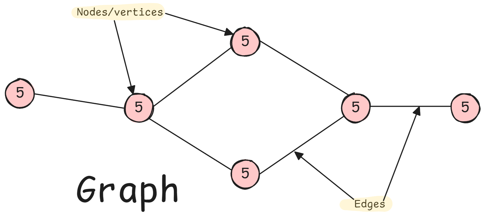
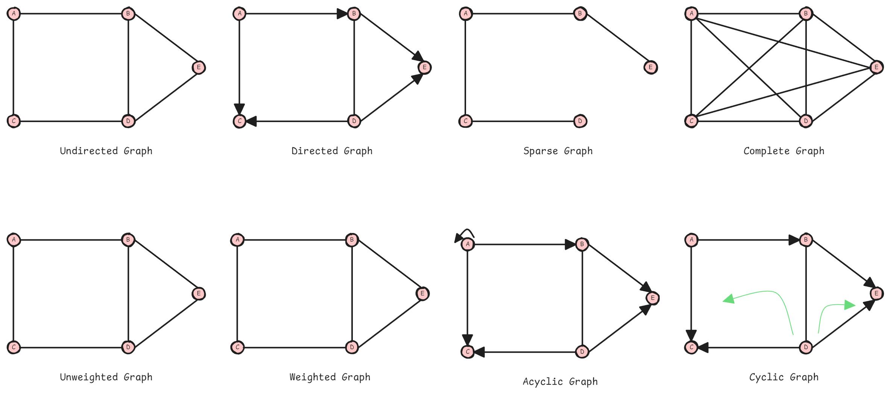

<h1 align="center"> Graphs </h1>

Graph is a non-linear data structure made up of vertices (nodes) connected by edges. It is used to represent relationships between different entities.



> $G = (V, E)$, where;

Graphs model relationships in:

- Social networks (users, friendships)
- Web pages (links)
- Neural networks (computational graphs)
- Transportation (cities, roads)
- Dependencies (tasks, prerequisites)

Many problems reduce to graph problems:

- Pathfinding → Shortest path algorithms
- Recommendation → Community detection
- Scheduling → Topological sort
- Clustering → Connected components

## Types

- **Directed (Digraph)**: Edges have direction (A → B ≠ B → A)
- **Undirected**: Edges bidirectional (A — B means A ↔ B)
- **Weighted**: Edges have weights/costs
- **Unweighted**: All edges equal weight



---

## Python Implementation

**Graph Representations**:

```python
class Graph:
    """Graph implementations using different representations."""
    
    def __init__(self, n, directed=False):
        """
        Initialize graph with n vertices.
        
        Args:
            n: Number of vertices
            directed: Whether graph is directed
        """
        self.n = n
        self.directed = directed
    
    # Representation 1: Adjacency Matrix
    def as_adjacency_matrix(self):
        """
        2D array where matrix[i][j] = weight of edge i→j.
        
        Pros: O(1) edge lookup, good for dense graphs
        Cons: O(V²) space, slow iteration over neighbors
        """
        matrix = [[0] * self.n for _ in range(self.n)]
        return matrix
    
    # Representation 2: Adjacency List (most common)
    def as_adjacency_list(self):
        """
        Dict/List where adj_list[u] = list of (neighbor, weight).
        
        Pros: O(V+E) space, fast neighbor iteration
        Cons: O(degree) edge lookup
        """
        from collections import defaultdict
        adj_list = defaultdict(list)
        return adj_list
    
    # Representation 3: Edge List
    def as_edge_list(self):
        """
        List of (u, v, weight) tuples.
        
        Pros: Simple, good for algorithms that process edges
        Cons: Slow neighbor queries
        """
        edges = []
        return edges


# Practical adjacency list implementation
class GraphAdjList:
    """Graph using adjacency list - most common representation."""
    
    def __init__(self, directed=False):
        from collections import defaultdict
        self.graph = defaultdict(list)
        self.directed = directed
    
    def add_edge(self, u, v, weight=1):
        """Add edge from u to v with optional weight."""
        self.graph[u].append((v, weight))
        if not self.directed:
            self.graph[v].append((u, weight))
    
    def get_neighbors(self, u):
        """Get neighbors of vertex u."""
        return self.graph[u]
    
    def get_vertices(self):
        """Get all vertices."""
        return list(self.graph.keys())
    
    def has_edge(self, u, v):
        """Check if edge exists."""
        return any(neighbor == v for neighbor, _ in self.graph[u])

# Example usage
g = GraphAdjList(directed=False)
g.add_edge('A', 'B')
g.add_edge('A', 'C')
g.add_edge('B', 'D')
```

**Breadth-First Search (BFS)**:

```python
from collections import deque

def bfs(graph, start):
    """
    BFS traversal - explore level by level.
    
    Use cases:
    - Shortest path in unweighted graph
    - Level-order traversal
    - Finding connected components
    - Checking bipartiteness
    
    Time: O(V + E), Space: O(V)
    """
    visited = set()
    queue = deque([start])
    visited.add(start)
    result = []
    
    while queue:
        vertex = queue.popleft()
        result.append(vertex)
        
        # Visit all unvisited neighbors
        for neighbor, _ in graph.get_neighbors(vertex):
            if neighbor not in visited:
                visited.add(neighbor)
                queue.append(neighbor)
    
    return result


def bfs_shortest_path(graph, start, end):
    """
    Find shortest path in unweighted graph using BFS.
    
    Returns path from start to end, or None if no path exists.
    """
    if start == end:
        return [start]
    
    visited = {start}
    queue = deque([(start, [start])])  # (vertex, path)
    
    while queue:
        vertex, path = queue.popleft()
        
        for neighbor, _ in graph.get_neighbors(vertex):
            if neighbor not in visited:
                new_path = path + [neighbor]
                
                if neighbor == end:
                    return new_path
                
                visited.add(neighbor)
                queue.append((neighbor, new_path))
    
    return None  # No path found


def bfs_levels(graph, start):
    """
    BFS with level tracking.
    
    Returns dict mapping vertex → distance from start.
    """
    visited = {start: 0}  # vertex → distance
    queue = deque([(start, 0)])
    
    while queue:
        vertex, level = queue.popleft()
        
        for neighbor, _ in graph.get_neighbors(vertex):
            if neighbor not in visited:
                visited[neighbor] = level + 1
                queue.append((neighbor, level + 1))
    
    return visited

# Time: O(V + E), Space: O(V)
```

**Depth-First Search (DFS)**:

```python
def dfs_recursive(graph, start, visited=None):
    """
    DFS traversal - explore as deep as possible before backtracking.
    
    Use cases:
    - Cycle detection
    - Topological sort
    - Finding connected components
    - Path finding
    - Backtracking problems
    
    Time: O(V + E), Space: O(V) for visited + O(h) for recursion
    """
    if visited is None:
        visited = set()
    
    visited.add(start)
    result = [start]
    
    for neighbor, _ in graph.get_neighbors(start):
        if neighbor not in visited:
            result.extend(dfs_recursive(graph, neighbor, visited))
    
    return result


def dfs_iterative(graph, start):
    """
    Iterative DFS using explicit stack.
    
    More control, avoids recursion limit issues.
    """
    visited = set()
    stack = [start]
    result = []
    
    while stack:
        vertex = stack.pop()
        
        if vertex not in visited:
            visited.add(vertex)
            result.append(vertex)
            
            # Add neighbors to stack (reverse order for same traversal as recursive)
            for neighbor, _ in reversed(graph.get_neighbors(vertex)):
                if neighbor not in visited:
                    stack.append(neighbor)
    
    return result


def dfs_with_path(graph, start, end, visited=None, path=None):
    """
    DFS to find path from start to end.
    
    Returns first path found (not necessarily shortest).
    """
    if visited is None:
        visited = set()
    if path is None:
        path = []
    
    visited.add(start)
    path.append(start)
    
    if start == end:
        return path
    
    for neighbor, _ in graph.get_neighbors(start):
        if neighbor not in visited:
            result = dfs_with_path(graph, neighbor, end, visited, path)
            if result:
                return result
    
    path.pop()  # Backtrack
    return None

# Time: O(V + E), Space: O(V)
```

**Connected Components**:

```python
def find_connected_components(graph):
    """
    Find all connected components in undirected graph.
    
    Returns list of components, each component is a set of vertices.
    """
    visited = set()
    components = []
    
    def dfs(vertex, component):
        """DFS to explore component."""
        visited.add(vertex)
        component.add(vertex)
        
        for neighbor, _ in graph.get_neighbors(vertex):
            if neighbor not in visited:
                dfs(neighbor, component)
    
    # Try starting DFS from each unvisited vertex
    for vertex in graph.get_vertices():
        if vertex not in visited:
            component = set()
            dfs(vertex, component)
            components.append(component)
    
    return components

# Time: O(V + E), Space: O(V)


def count_connected_components(n, edges):
    """
    Count connected components given edge list.
    
    Common interview question format.
    """
    from collections import defaultdict
    
    graph = defaultdict(list)
    for u, v in edges:
        graph[u].append(v)
        graph[v].append(u)
    
    visited = set()
    count = 0
    
    def dfs(node):
        visited.add(node)
        for neighbor in graph[node]:
            if neighbor not in visited:
                dfs(neighbor)
    
    for node in range(n):
        if node not in visited:
            dfs(node)
            count += 1
    
    return count

# Time: O(V + E), Space: O(V)
```

**Cycle Detection**:

```python
def has_cycle_undirected(graph):
    """
    Detect cycle in undirected graph using DFS.
    
    Key: If we visit a node that's already visited and it's not the parent,
    there's a cycle.
    """
    visited = set()
    
    def dfs(node, parent):
        visited.add(node)
        
        for neighbor, _ in graph.get_neighbors(node):
            if neighbor not in visited:
                if dfs(neighbor, node):
                    return True
            elif neighbor != parent:  # Visited and not parent → cycle
                return True
        
        return False
    
    # Check each component
    for vertex in graph.get_vertices():
        if vertex not in visited:
            if dfs(vertex, None):
                return True
    
    return False

# Time: O(V + E), Space: O(V)


def has_cycle_directed(graph):
    """
    Detect cycle in directed graph using DFS with colors.
    
    White (0): Unvisited
    Gray (1): Visiting (in current DFS path)
    Black (2): Visited (DFS complete)
    
    Cycle exists if we reach a gray node (back edge).
    """
    WHITE, GRAY, BLACK = 0, 1, 2
    color = {v: WHITE for v in graph.get_vertices()}
    
    def dfs(node):
        color[node] = GRAY  # Mark as visiting
        
        for neighbor, _ in graph.get_neighbors(node):
            if color[neighbor] == GRAY:  # Back edge → cycle
                return True
            if color[neighbor] == WHITE:
                if dfs(neighbor):
                    return True
        
        color[node] = BLACK  # Mark as visited
        return False
    
    for vertex in graph.get_vertices():
        if color[vertex] == WHITE:
            if dfs(vertex):
                return True
    
    return False

# Time: O(V + E), Space: O(V)
```

**Bipartite Check**:

```python
def is_bipartite(graph):
    """
    Check if graph is bipartite (can be colored with 2 colors).
    
    Use BFS and try to color with alternating colors.
    If we can assign two colors such that no adjacent vertices
    have same color, graph is bipartite.
    
    Applications: Matching problems, scheduling
    """
    color = {}  # vertex → color (0 or 1)
    
    def bfs(start):
        from collections import deque
        
        queue = deque([start])
        color[start] = 0
        
        while queue:
            vertex = queue.popleft()
            current_color = color[vertex]
            
            for neighbor, _ in graph.get_neighbors(vertex):
                if neighbor not in color:
                    # Assign opposite color
                    color[neighbor] = 1 - current_color
                    queue.append(neighbor)
                elif color[neighbor] == current_color:
                    # Same color as neighbor → not bipartite
                    return False
        
        return True
    
    # Check each component
    for vertex in graph.get_vertices():
        if vertex not in color:
            if not bfs(vertex):
                return False
    
    return True

# Time: O(V + E), Space: O(V)
```

**Clone Graph**:

```python
def clone_graph(node):
    """
    Deep copy a graph.
    
    Given reference to a node, return deep copy of graph.
    Common interview question.
    """
    if not node:
        return None
    
    # Map original node → cloned node
    clones = {}
    
    def dfs(original):
        if original in clones:
            return clones[original]
        
        # Create clone
        clone = Node(original.val)
        clones[original] = clone
        
        # Clone neighbors recursively
        for neighbor in original.neighbors:
            clone.neighbors.append(dfs(neighbor))
        
        return clone
    
    return dfs(node)

# Time: O(V + E), Space: O(V)
```

**All Paths from Source to Target**:

```python
def all_paths_source_target(graph, start, end):
    """
    Find all paths from start to end in directed acyclic graph.
    
    Use backtracking/DFS to explore all possibilities.
    """
    result = []
    
    def dfs(node, path):
        if node == end:
            result.append(path[:])  # Make copy
            return
        
        for neighbor, _ in graph.get_neighbors(node):
            path.append(neighbor)
            dfs(neighbor, path)
            path.pop()  # Backtrack
    
    dfs(start, [start])
    return result

# Time: O(2^V · V) in worst case (exponential in general)
# Space: O(V) for recursion depth
```

---

## Advanced Graphs

Advanced graph algorithms solve optimization and ordering problems:
- **Shortest paths**: Find minimum cost path between vertices
- **Minimum spanning tree**: Connect all vertices with minimum total edge weight
- **Topological sort**: Linear ordering of vertices in DAG
- **Strongly connected components**: Maximal subgraphs where every vertex reaches every other

These algorithms are foundations for:
- Route planning (GPS, navigation)
- Network design (minimizing cable costs)
- Task scheduling (build systems, course prerequisites)
- Dependency resolution (package managers)

### Python Implementation

#### Topological Sort

```python
def topological_sort_dfs(graph):
    """
    Topological sort using DFS.
    
    Valid only for Directed Acyclic Graphs (DAG).
    Returns linear ordering where u appears before v if edge u→v exists.
    
    Use cases: Task scheduling, course prerequisites, build systems
    """
    visited = set()
    stack = []  # Post-order of DFS
    
    def dfs(vertex):
        visited.add(vertex)
        
        for neighbor, _ in graph.get_neighbors(vertex):
            if neighbor not in visited:
                dfs(neighbor)
        
        # Add to stack after visiting all descendants
        stack.append(vertex)
    
    # Visit all vertices
    for vertex in graph.get_vertices():
        if vertex not in visited:
            dfs(vertex)
    
    # Return reversed post-order
    return stack[::-1]

# Time: O(V + E), Space: O(V)


def topological_sort_kahn(graph):
    """
    Topological sort using Kahn's algorithm (BFS-based).
    
    Process vertices with no incoming edges first.
    Works by repeatedly removing vertices with in-degree 0.
    
    Bonus: Can detect cycles (if can't process all vertices).
    """
    from collections import deque, defaultdict
    
    # Calculate in-degrees
    in_degree = defaultdict(int)
    vertices = set(graph.get_vertices())
    
    # Initialize all vertices with 0 in-degree
    for v in vertices:
        if v not in in_degree:
            in_degree[v] = 0
    
    # Count incoming edges
    for vertex in vertices:
        for neighbor, _ in graph.get_neighbors(vertex):
            in_degree[neighbor] += 1
    
    # Queue vertices with no incoming edges
    queue = deque([v for v in vertices if in_degree[v] == 0])
    result = []
    
    while queue:
        vertex = queue.popleft()
        result.append(vertex)
        
        # Remove edges from vertex
        for neighbor, _ in graph.get_neighbors(vertex):
            in_degree[neighbor] -= 1
            if in_degree[neighbor] == 0:
                queue.append(neighbor)
    
    # Check for cycle
    if len(result) != len(vertices):
        return None  # Cycle detected (not a DAG)
    
    return result

# Time: O(V + E), Space: O(V)
```

#### Dijkstra's Shortest Path

```python
import heapq
from collections import defaultdict

def dijkstra(graph, start):
    """
    Find shortest paths from start to all other vertices.
    
    Works for: Weighted graphs with NON-NEGATIVE weights
    Returns: Dict mapping vertex → (distance, previous_vertex)
    
    Algorithm:
    1. Initialize distances to infinity (except start = 0)
    2. Use min-heap to always process closest unvisited vertex
    3. Update distances to neighbors if shorter path found
    """
    distances = {v: float('inf') for v in graph.get_vertices()}
    distances[start] = 0
    previous = {v: None for v in graph.get_vertices()}
    
    # Min heap: (distance, vertex)
    pq = [(0, start)]
    visited = set()
    
    while pq:
        current_dist, current = heapq.heappop(pq)
        
        if current in visited:
            continue
        
        visited.add(current)
        
        # Explore neighbors
        for neighbor, weight in graph.get_neighbors(current):
            if neighbor in visited:
                continue
            
            new_dist = current_dist + weight
            
            if new_dist < distances[neighbor]:
                distances[neighbor] = new_dist
                previous[neighbor] = current
                heapq.heappush(pq, (new_dist, neighbor))
    
    return distances, previous

# Time: O((V + E) log V) with binary heap
# Space: O(V)


def reconstruct_path(previous, start, end):
    """Reconstruct shortest path from start to end using previous dict."""
    if previous[end] is None and end != start:
        return None  # No path exists
    
    path = []
    current = end
    
    while current is not None:
        path.append(current)
        current = previous[current]
    
    return path[::-1]


def dijkstra_with_path(graph, start, end):
    """Find shortest path between two vertices."""
    distances, previous = dijkstra(graph, start)
    
    if distances[end] == float('inf'):
        return None, float('inf')  # No path
    
    path = reconstruct_path(previous, start, end)
    return path, distances[end]

# Example usage:
# path, distance = dijkstra_with_path(graph, 'A', 'D')
```

#### Bellman-Ford Algorithm

```python
def bellman_ford(graph, start):
    """
    Find shortest paths allowing NEGATIVE weights.
    
    Can detect negative cycles.
    Slower than Dijkstra but handles negative weights.
    
    Algorithm:
    1. Initialize distances
    2. Relax all edges V-1 times
    3. Check for negative cycles (one more iteration)
    """
    vertices = graph.get_vertices()
    distances = {v: float('inf') for v in vertices}
    distances[start] = 0
    previous = {v: None for v in vertices}
    
    # Relax edges V-1 times
    for _ in range(len(vertices) - 1):
        for vertex in vertices:
            for neighbor, weight in graph.get_neighbors(vertex):
                new_dist = distances[vertex] + weight
                
                if new_dist < distances[neighbor]:
                    distances[neighbor] = new_dist
                    previous[neighbor] = vertex
    
    # Check for negative cycles
    for vertex in vertices:
        for neighbor, weight in graph.get_neighbors(vertex):
            if distances[vertex] + weight < distances[neighbor]:
                return None, None  # Negative cycle detected
    
    return distances, previous

# Time: O(V · E), Space: O(V)
# Slower than Dijkstra but handles negative weights
```

#### Floyd-Warshall Algorithm

```python
def floyd_warshall(graph):
    """
    Find shortest paths between ALL pairs of vertices.
    
    Works with negative weights (but not negative cycles).
    Uses dynamic programming.
    
    Returns: 2D dict distances[i][j] = shortest distance from i to j
    """
    vertices = list(graph.get_vertices())
    n = len(vertices)
    
    # Initialize distances
    dist = {v: {u: float('inf') for u in vertices} for v in vertices}
    
    # Distance from vertex to itself is 0
    for v in vertices:
        dist[v][v] = 0
    
    # Set initial edge weights
    for vertex in vertices:
        for neighbor, weight in graph.get_neighbors(vertex):
            dist[vertex][neighbor] = weight
    
    # Try all intermediate vertices
    for k in vertices:
        for i in vertices:
            for j in vertices:
                # Check if path through k is shorter
                if dist[i][k] + dist[k][j] < dist[i][j]:
                    dist[i][j] = dist[i][k] + dist[k][j]
    
    # Check for negative cycles
    for v in vertices:
        if dist[v][v] < 0:
            return None  # Negative cycle detected
    
    return dist

# Time: O(V³), Space: O(V²)
# Use when: Need all-pairs shortest paths, graph is small/medium


def has_negative_cycle(graph):
    """Check if graph has negative cycle using Floyd-Warshall."""
    vertices = list(graph.get_vertices())
    dist = floyd_warshall(graph)
    
    if dist is None:
        return True
    
    return False
```

#### Prim's Minimum Spanning Tree

```python
def prim_mst(graph):
    """
    Find Minimum Spanning Tree using Prim's algorithm.
    
    MST: Tree connecting all vertices with minimum total edge weight.
    Similar to Dijkstra but grows tree greedily.
    
    Use cases: Network design, clustering, approximation algorithms
    """
    import heapq
    
    vertices = graph.get_vertices()
    if not vertices:
        return []
    
    start = vertices[0]
    visited = set([start])
    edges = []  # MST edges
    total_weight = 0
    
    # Min heap: (weight, from_vertex, to_vertex)
    pq = [(weight, start, neighbor) 
          for neighbor, weight in graph.get_neighbors(start)]
    heapq.heapify(pq)
    
    while pq and len(visited) < len(vertices):
        weight, u, v = heapq.heappop(pq)
        
        if v in visited:
            continue
        
        # Add edge to MST
        visited.add(v)
        edges.append((u, v, weight))
        total_weight += weight
        
        # Add edges from new vertex
        for neighbor, edge_weight in graph.get_neighbors(v):
            if neighbor not in visited:
                heapq.heappush(pq, (edge_weight, v, neighbor))
    
    return edges, total_weight

# Time: O((V + E) log V), Space: O(V)
```

#### Kruskal's Minimum Spanning Tree

```python
class UnionFind:
    """Union-Find (Disjoint Set Union) data structure."""
    
    def __init__(self, n):
        self.parent = list(range(n))
        self.rank = [0] * n
    
    def find(self, x):
        """Find set representative with path compression."""
        if self.parent[x] != x:
            self.parent[x] = self.find(self.parent[x])
        return self.parent[x]
    
    def union(self, x, y):
        """Union two sets by rank."""
        root_x = self.find(x)
        root_y = self.find(y)
        
        if root_x == root_y:
            return False  # Already in same set
        
        # Union by rank
        if self.rank[root_x] < self.rank[root_y]:
            self.parent[root_x] = root_y
        elif self.rank[root_x] > self.rank[root_y]:
            self.parent[root_y] = root_x
        else:
            self.parent[root_y] = root_x
            self.rank[root_x] += 1
        
        return True


def kruskal_mst(edges, n_vertices):
    """
    Find MST using Kruskal's algorithm.
    
    Args:
        edges: List of (u, v, weight) tuples
        n_vertices: Number of vertices (0 to n-1)
    
    Algorithm:
    1. Sort edges by weight
    2. Add edge if doesn't create cycle (use Union-Find)
    """
    # Sort edges by weight
    edges.sort(key=lambda x: x[2])
    
    uf = UnionFind(n_vertices)
    mst_edges = []
    total_weight = 0
    
    for u, v, weight in edges:
        # Add edge if doesn't create cycle
        if uf.union(u, v):
            mst_edges.append((u, v, weight))
            total_weight += weight
            
            # Stop when we have V-1 edges
            if len(mst_edges) == n_vertices - 1:
                break
    
    return mst_edges, total_weight

# Time: O(E log E) for sorting + O(E α(V)) for union-find ≈ O(E log E)
# Space: O(V)
# α(V) is inverse Ackermann function (effectively constant)
```

#### Strongly Connected Components (Kosaraju's Algorithm)

```python
def strongly_connected_components(graph):
    """
    Find strongly connected components in directed graph.
    
    SCC: Maximal subgraph where every vertex reaches every other vertex.
    
    Kosaraju's Algorithm:
    1. DFS to compute finish times
    2. Transpose graph
    3. DFS on transpose in decreasing finish time order
    """
    # Step 1: First DFS to get finish order
    visited = set()
    finish_order = []
    
    def dfs1(vertex):
        visited.add(vertex)
        for neighbor, _ in graph.get_neighbors(vertex):
            if neighbor not in visited:
                dfs1(neighbor)
        finish_order.append(vertex)
    
    for vertex in graph.get_vertices():
        if vertex not in visited:
            dfs1(vertex)
    
    # Step 2: Transpose graph
    transposed = defaultdict(list)
    for vertex in graph.get_vertices():
        for neighbor, weight in graph.get_neighbors(vertex):
            transposed[neighbor].append((vertex, weight))
    
    # Step 3: DFS on transposed graph in reverse finish order
    visited = set()
    sccs = []
    
    def dfs2(vertex, component):
        visited.add(vertex)
        component.append(vertex)
        for neighbor, _ in transposed[vertex]:
            if neighbor not in visited:
                dfs2(neighbor, component)
    
    for vertex in reversed(finish_order):
        if vertex not in visited:
            component = []
            dfs2(vertex, component)
            sccs.append(component)
    
    return sccs

# Time: O(V + E), Space: O(V)
```

#### A* Search Algorithm

```python
def a_star(graph, start, goal, heuristic):
    """
    A* pathfinding algorithm.
    
    Like Dijkstra but uses heuristic to guide search toward goal.
    Finds optimal path if heuristic is admissible (never overestimates).
    
    Args:
        graph: Graph structure
        start: Start vertex
        goal: Goal vertex
        heuristic: Function h(v) estimating distance from v to goal
    
    Use cases: GPS navigation, game AI, robotics
    """
    import heapq
    
    # g_score[v] = distance from start to v
    g_score = {v: float('inf') for v in graph.get_vertices()}
    g_score[start] = 0
    
    # f_score[v] = g_score[v] + h(v)
    f_score = {v: float('inf') for v in graph.get_vertices()}
    f_score[start] = heuristic(start, goal)
    
    # Priority queue: (f_score, vertex)
    pq = [(f_score[start], start)]
    previous = {v: None for v in graph.get_vertices()}
    visited = set()
    
    while pq:
        _, current = heapq.heappop(pq)
        
        if current == goal:
            # Reconstruct path
            path = []
            while current is not None:
                path.append(current)
                current = previous[current]
            return path[::-1], g_score[goal]
        
        if current in visited:
            continue
        
        visited.add(current)
        
        for neighbor, weight in graph.get_neighbors(current):
            if neighbor in visited:
                continue
            
            tentative_g = g_score[current] + weight
            
            if tentative_g < g_score[neighbor]:
                previous[neighbor] = current
                g_score[neighbor] = tentative_g
                f_score[neighbor] = tentative_g + heuristic(neighbor, goal)
                heapq.heappush(pq, (f_score[neighbor], neighbor))
    
    return None, float('inf')  # No path found

# Time: O((V + E) log V) with good heuristic
# Better than Dijkstra when heuristic is informative
```

#### Union-Find (Disjoint Set Union)

```python
class UnionFindOptimized:
    """
    Optimized Union-Find with path compression and union by rank.
    
    Use cases:
    - Detecting cycles in undirected graphs
    - Kruskal's MST algorithm
    - Dynamic connectivity problems
    - Image segmentation
    """
    
    def __init__(self, n):
        """Initialize with n elements (0 to n-1)."""
        self.parent = list(range(n))
        self.rank = [0] * n
        self.count = n  # Number of components
    
    def find(self, x):
        """
        Find set representative with path compression.
        
        Path compression: Make all nodes on path point directly to root.
        Amortizes to nearly O(1).
        """
        if self.parent[x] != x:
            self.parent[x] = self.find(self.parent[x])  # Path compression
        return self.parent[x]
    
    def union(self, x, y):
        """
        Union two sets by rank.
        
        Returns True if union performed, False if already in same set.
        """
        root_x = self.find(x)
        root_y = self.find(y)
        
        if root_x == root_y:
            return False
        
        # Union by rank: attach smaller tree under larger tree
        if self.rank[root_x] < self.rank[root_y]:
            self.parent[root_x] = root_y
        elif self.rank[root_x] > self.rank[root_y]:
            self.parent[root_y] = root_x
        else:
            self.parent[root_y] = root_x
            self.rank[root_x] += 1
        
        self.count -= 1
        return True
    
    def connected(self, x, y):
        """Check if x and y are in same set."""
        return self.find(x) == self.find(y)
    
    def get_components(self):
        """Return number of connected components."""
        return self.count

# Time: O(α(n)) per operation, where α is inverse Ackermann
# Effectively O(1) for all practical purposes
# Space: O(n)


def has_cycle_union_find(edges, n_vertices):
    """
    Detect cycle in undirected graph using Union-Find.
    
    More efficient than DFS for this specific task.
    """
    uf = UnionFindOptimized(n_vertices)
    
    for u, v in edges:
        if not uf.union(u, v):
            return True  # u and v already connected → cycle
    
    return False

# Time: O(E · α(V)) ≈ O(E)
```


---

## Complexity Analysis

| Operation | Adj Matrix | Adj List | Edge List |
|-----------|------------|----------|-----------|
| Space | O(V²) | O(V + E) | O(E) |
| Add edge | O(1) | O(1) | O(1) |
| Remove edge | O(1) | O(V) | O(E) |
| Check edge | O(1) | O(degree) | O(E) |
| Get neighbors | O(V) | O(degree) | O(E) |

**Graph Traversal Complexities**:

| Algorithm | Time | Space | Use Case |
|-----------|------|-------|----------|
| BFS | O(V + E) | O(V) | Shortest path, levels |
| DFS | O(V + E) | O(V) | Cycle detection, paths |
| Connected Components | O(V + E) | O(V) | Find clusters |
| Bipartite Check | O(V + E) | O(V) | Two-coloring |

**Shortest Path Algorithms**:

| Algorithm | Time | Space | Works With | Use Case |
|-----------|------|-------|------------|----------|
| BFS | O(V + E) | O(V) | Unweighted | Shortest path in unweighted |
| Dijkstra | O((V+E) log V) | O(V) | Non-negative weights | Single source, positive weights |
| Bellman-Ford | O(V · E) | O(V) | Negative weights | Detects negative cycles |
| Floyd-Warshall | O(V³) | O(V²) | All pairs | Small graphs, dense graphs |
| A* | O((V+E) log V) | O(V) | Non-negative + heuristic | Pathfinding with goal |

**Minimum Spanning Tree**:

| Algorithm | Time | Space | Best For |
|-----------|------|-------|----------|
| Prim's | O((V+E) log V) | O(V) | Dense graphs |
| Kruskal's | O(E log E) | O(V) | Sparse graphs |

**Other Advanced Algorithms**:

| Algorithm | Time | Space | Use Case |
|-----------|------|-------|----------|
| Topological Sort (DFS) | O(V + E) | O(V) | DAG ordering |
| Topological Sort (Kahn) | O(V + E) | O(V) | DAG ordering + cycle detection |
| SCC (Kosaraju) | O(V + E) | O(V) | Find strongly connected components |
| Union-Find | O(α(n)) per op | O(n) | Dynamic connectivity |

**Space Complexity Notes**:
- **Visited set**: O(V)
- **Queue (BFS)**: O(V) in worst case (all vertices in queue)
- **Stack (DFS recursive)**: O(h) where h = height (O(V) worst case for linear graph)
- **Stack (DFS iterative)**: O(V) in worst case

---

## Common Questions

1. "When to use BFS vs DFS?"
   - **Answer**:
     - **BFS**: 
       - Shortest path in unweighted graph
       - Level-by-level processing
       - Finding closest nodes
       - Minimum spanning tree (Prim's)
     - **DFS**:
       - Detecting cycles
       - Topological sorting
       - Finding strongly connected components
       - Path existence (any path, not shortest)
       - Backtracking problems
       - Memory constrained (usually uses less than BFS)

2. "How to detect a cycle in a graph?"
   - **Answer**:
     - **Undirected**: DFS, if we reach visited node that's not parent
     - **Directed**: DFS with colors (white/gray/black), if we reach gray node
     - **Alternative**: Union-Find for undirected graphs

3. "Explain graph representations trade-offs"
   - **Answer**:
     - **Adjacency Matrix**:
       - Fast edge lookup O(1)
       - Good for dense graphs (E ≈ V²)
       - Wastes space for sparse graphs
       - Easy to implement graph operations
     - **Adjacency List**:
       - Space efficient for sparse graphs (E << V²)
       - Fast neighbor iteration
       - Slower edge lookup O(degree)
       - Most common in practice
     - **Edge List**:
       - Simplest representation
       - Good for algorithms processing edges (Kruskal's MST)
       - Slow for neighbor queries

4. "How to handle disconnected graphs?"
   - **Answer**: Loop through all vertices, starting DFS/BFS from unvisited ones
   ```python
   visited = set()
   for vertex in graph.get_vertices():
       if vertex not in visited:
           bfs(graph, vertex, visited)
   ```

5. "When to use Dijkstra vs Bellman-Ford vs Floyd-Warshall?"
   - **Answer**:
     - **Dijkstra**: Single source, non-negative weights, need efficiency
     - **Bellman-Ford**: Need to detect negative cycles, or have negative weights
     - **Floyd-Warshall**: All-pairs shortest paths, small graph (V ≤ 400)
     - **BFS**: Unweighted graph (fastest option)
     - **A***: Have good heuristic and specific goal (pathfinding)

6. "Explain why Dijkstra doesn't work with negative weights"
   - **Answer**: Dijkstra greedily selects closest unvisited node. With negative weights, a longer path might become shorter after visiting more nodes. Once a node is visited, Dijkstra never reconsiders it, so it can miss the optimal path.
   - **Example**: A→B (weight 2), A→C (weight 1), C→B (weight -5). Dijkstra would mark B as visited with distance 2, missing the shorter path A→C→B with distance -4.

7. "How to detect if topological sort is possible?"
   - **Answer**: Topological sort exists iff graph is a DAG (Directed Acyclic Graph)
   - **Detection methods**:
     - DFS with cycle detection (if cycle found, no topological sort)
     - Kahn's algorithm: if can't process all vertices, cycle exists
   
8. "When to use Prim vs Kruskal for MST?"
   - **Answer**:
     - **Prim**: Dense graphs (many edges), when graph is connected
     - **Kruskal**: Sparse graphs, when need to sort edges anyway
     - **Performance**: Similar asymptotically, but Prim often faster in practice for dense graphs
     - **Implementation**: Kruskal simpler with Union-Find

## Problem-Solving Patterns

1. **Matrix as Graph**: Treat 2D grid as graph (4 or 8 directions)
   ```python
   def get_neighbors(matrix, row, col):
       """Get valid neighbors in 4 directions."""
       rows, cols = len(matrix), len(matrix[0])
       directions = [(0,1), (1,0), (0,-1), (-1,0)]
       
       neighbors = []
       for dr, dc in directions:
           r, c = row + dr, col + dc
           if 0 <= r < rows and 0 <= c < cols:
               neighbors.append((r, c))
       return neighbors
   ```

2. **Implicit Graph**: Graph not explicitly given, generate neighbors on the fly
   - Word ladder problem
   - Game state transitions
   - Puzzle solving

3. **Multiple Source BFS**: Start BFS from multiple sources simultaneously
   ```python
   queue = deque(all_sources)
   for source in all_sources:
       visited.add(source)
   # Then standard BFS
   ```

4. **Bidirectional BFS**: BFS from both start and end
   - Faster for finding shortest path
   - O(b^(d/2)) vs O(b^d) where b = branching factor, d = depth

5. **Shortest path in weighted graph**: Dijkstra (if non-negative) or Bellman-Ford
6. **All-pairs shortest paths**: Floyd-Warshall (small) or run Dijkstra from each vertex
7. **Minimum spanning tree**: Prim or Kruskal
8. **Course schedule / task dependencies**: Topological sort
9. **Network connectivity**: Union-Find
10. **Finding cycles**: DFS (directed), Union-Find (undirected)

---

## Common Mistakes

- Not handling disconnected graphs
- Forgetting to mark nodes as visited before adding to queue (causes duplicates)
- Not checking if node is already visited before recursing (infinite loop)
- Confusing directed vs undirected graph logic
- Not considering self-loops and parallel edges
- Using Dijkstra with negative weights
- Not checking if topological sort is possible (graph might have cycles)
- Forgetting to reverse finish order in topological sort (DFS version)
- Not handling disconnected graphs in MST
- Confusing strongly connected components (directed) with connected components (undirected)

## Edge Cases

- Empty graph
- Single vertex
- Disconnected components
- Self-loops
- Parallel edges (multiple edges between same vertices)
- Negative weights (for weighted graphs)
- Disconnected graphs
- Self-loops
- Negative weights
- Negative cycles
- Multiple edges between same vertices (parallel edges)
- Very large weights (potential overflow)

---

**[Graph Questions Notebook](./Notebooks/Graphs.ipynb)**
