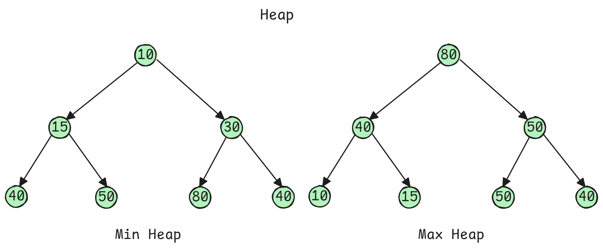
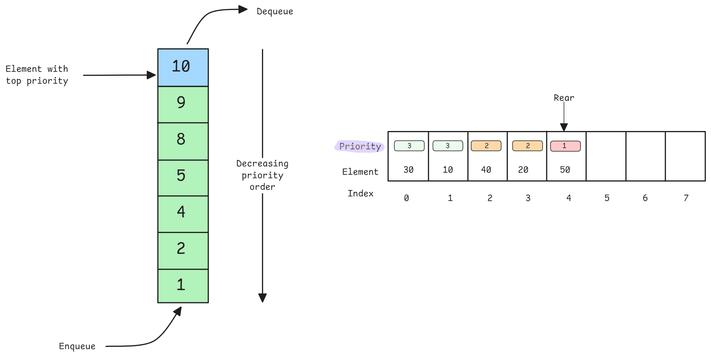

<h1 align="center"> Heap / Priority Queue </h1>

A **heap** is a complete binary tree satisfying the heap property:

- **Min heap**: Parent <= children (root is minimum)
- **Max heap**: Parent >= children (root is maximum)



**Heaps** enable $O(log\;n)$ insertion and $O(1)$ access to min/max element. Critical for:
- Efficiently maintaining "top K" elements
- Dijkstra's shortest path
- Huffman coding
- Event scheduling
- Median maintenance

> Heaps sacrifice sorted **order** (unlike BST) for faster insertion/deletion while maintaining quick access to extremum.

**Array Representation**: Complete binary tree stored in array
- Parent of index i: `(i - 1) // 2`
- Left child of i: `2 * i + 1`
- Right child of i: `2 * i + 2`

---

## Priority Queue

A **priority queue** is an abstract data type where each element has a priority, implemented efficiently using heaps.



---

## Python Implementation

**Using heapq (Built-in)**:

```python
import heapq

# Min heap (default in Python)
min_heap = []
heapq.heappush(min_heap, 3)  # O(log n)
heapq.heappush(min_heap, 1)
heapq.heappush(min_heap, 2)

min_element = heapq.heappop(min_heap)  # Returns 1, O(log n)
peek = min_heap[0]  # View min without removing, O(1)

# Heapify existing list
nums = [3, 1, 4, 1, 5, 9, 2, 6]
heapq.heapify(nums)  # O(n) - converts to min heap in-place

# Get k smallest/largest
k_smallest = heapq.nsmallest(3, nums)  # O(n log k)
k_largest = heapq.nlargest(3, nums)    # O(n log k)

# Max heap (negate values)
max_heap = []
heapq.heappush(max_heap, -3)
heapq.heappush(max_heap, -1)
max_element = -heapq.heappop(max_heap)  # Returns 3
```

**Custom Heap Implementation**:

```python
class MinHeap:
    """
    Min heap implementation from scratch.
    
    Educational purposes - use heapq in production.
    """
    
    def __init__(self):
        self.heap = []
    
    def parent(self, i):
        return (i - 1) // 2
    
    def left_child(self, i):
        return 2 * i + 1
    
    def right_child(self, i):
        return 2 * i + 2
    
    def swap(self, i, j):
        self.heap[i], self.heap[j] = self.heap[j], self.heap[i]
    
    def push(self, val):
        """
        Insert element and bubble up.
        
        Time: O(log n)
        """
        self.heap.append(val)
        self._bubble_up(len(self.heap) - 1)
    
    def _bubble_up(self, i):
        """Move element up until heap property satisfied."""
        parent = self.parent(i)
        
        # If current < parent, swap and continue
        if i > 0 and self.heap[i] < self.heap[parent]:
            self.swap(i, parent)
            self._bubble_up(parent)
    
    def pop(self):
        """
        Remove and return minimum element.
        
        Time: O(log n)
        """
        if not self.heap:
            return None
        
        if len(self.heap) == 1:
            return self.heap.pop()
        
        # Save min, replace with last, bubble down
        min_val = self.heap[0]
        self.heap[0] = self.heap.pop()
        self._bubble_down(0)
        
        return min_val
    
    def _bubble_down(self, i):
        """Move element down until heap property satisfied."""
        min_idx = i
        left = self.left_child(i)
        right = self.right_child(i)
        
        # Find smallest among node and children
        if left < len(self.heap) and self.heap[left] < self.heap[min_idx]:
            min_idx = left
        
        if right < len(self.heap) and self.heap[right] < self.heap[min_idx]:
            min_idx = right
        
        # If smallest is not current node, swap and continue
        if min_idx != i:
            self.swap(i, min_idx)
            self._bubble_down(min_idx)
    
    def peek(self):
        """View minimum without removing."""
        return self.heap[0] if self.heap else None
    
    def size(self):
        return len(self.heap)
```

**Priority Queue with Custom Objects**:

```python
import heapq
from dataclasses import dataclass, field
from typing import Any

@dataclass(order=True)
class PrioritizedItem:
    """
    Wrapper for priority queue items.
    
    Python compares tuples lexicographically, so we use
    priority as first field and make item non-comparable.
    """
    priority: int
    item: Any = field(compare=False)

# Usage
pq = []
heapq.heappush(pq, PrioritizedItem(priority=2, item="Low priority"))
heapq.heappush(pq, PrioritizedItem(priority=1, item="High priority"))
heapq.heappush(pq, PrioritizedItem(priority=3, item="Lowest priority"))

while pq:
    item = heapq.heappop(pq)
    print(f"{item.item} (priority: {item.priority})")

# Output:
# High priority (priority: 1)
# Low priority (priority: 2)
# Lowest priority (priority: 3)
```

---

## Common Heap Patterns

**Pattern 1: Top K Elements**:

```python
def find_k_largest(nums, k):
    """
    Find k largest elements using min heap of size k.
    
    Strategy: Maintain min heap of size k. If new element > min,
    replace min. Final heap contains k largest.
    """
    if k == 0:
        return []
    
    heap = []
    
    for num in nums:
        if len(heap) < k:
            heapq.heappush(heap, num)
        elif num > heap[0]:  # num larger than current kth largest
            heapq.heapreplace(heap, num)  # Pop and push in one operation
    
    return sorted(heap, reverse=True)  # or just heap

# Time: O(n log k), Space: O(k)
# More efficient than sorting O(n log n) when k << n


def find_k_smallest(nums, k):
    """Find k smallest using max heap."""
    if k == 0:
        return []
    
    # Use negative values for max heap
    heap = []
    
    for num in nums:
        if len(heap) < k:
            heapq.heappush(heap, -num)
        elif num < -heap[0]:
            heapq.heapreplace(heap, -num)
    
    return sorted([-x for x in heap])

# Time: O(n log k), Space: O(k)
```

**Pattern 2: K-Way Merge**:

```python
def merge_k_sorted_lists(lists):
    """
    Merge k sorted lists using min heap.
    
    Use case: External sorting, merging partitions in distributed systems
    """
    import heapq
    
    # Initialize heap with first element from each list
    heap = []
    for i, lst in enumerate(lists):
        if lst:
            heapq.heappush(heap, (lst[0], i, 0))  # (value, list_idx, element_idx)
    
    result = []
    
    while heap:
        val, list_idx, element_idx = heapq.heappop(heap)
        result.append(val)
        
        # Add next element from same list
        if element_idx + 1 < len(lists[list_idx]):
            next_val = lists[list_idx][element_idx + 1]
            heapq.heappush(heap, (next_val, list_idx, element_idx + 1))
    
    return result

# Time: O(N log k) where N = total elements, k = number of lists
# Space: O(k)
```

**Pattern 3: Running Median**:

```python
class MedianFinder:
    """
    Find median of data stream using two heaps.
    
    Strategy:
    - Max heap (left): stores smaller half
    - Min heap (right): stores larger half
    - Keep heaps balanced (size difference ≤ 1)
    - Median is either top of larger heap or average of both tops
    """
    
    def __init__(self):
        self.small = []  # Max heap (negate values)
        self.large = []  # Min heap
    
    def addNum(self, num):
        """
        Add number to data structure.
        
        Time: O(log n)
        """
        # Add to appropriate heap
        if not self.small or num <= -self.small[0]:
            heapq.heappush(self.small, -num)
        else:
            heapq.heappush(self.large, num)
        
        # Balance heaps (size difference should be at most 1)
        if len(self.small) > len(self.large) + 1:
            heapq.heappush(self.large, -heapq.heappop(self.small))
        elif len(self.large) > len(self.small):
            heapq.heappush(self.small, -heapq.heappop(self.large))
    
    def findMedian(self):
        """
        Return median of all elements.
        
        Time: O(1)
        """
        if len(self.small) > len(self.large):
            return -self.small[0]
        else:
            return (-self.small[0] + self.large[0]) / 2.0

# Total: O(log n) insert, O(1) median query
```

**Pattern 4: Task Scheduler**:

```python
def task_scheduler(tasks, n):
    """
    Schedule tasks with cooldown period using heap.
    
    Args:
        tasks: List of task types (e.g., ['A','A','A','B','B','B'])
        n: Cooldown period between same tasks
    
    Returns:
        Minimum time units needed
    
    Strategy: Process most frequent tasks first, use heap to track frequencies
    """
    from collections import Counter
    import heapq
    
    # Count frequencies
    freq = Counter(tasks)
    
    # Max heap of frequencies (negate for max heap)
    heap = [-count for count in freq.values()]
    heapq.heapify(heap)
    
    time = 0
    
    while heap:
        cycle = []
        
        # Process up to n+1 tasks (or until heap empty)
        for _ in range(n + 1):
            if heap:
                freq = heapq.heappop(heap)
                freq += 1  # One task completed (remember it's negative)
                if freq < 0:  # Still has tasks remaining
                    cycle.append(freq)
        
        # Add back tasks with remaining frequency
        for freq in cycle:
            heapq.heappush(heap, freq)
        
        # Add time (full cycle or remaining tasks)
        time += (n + 1) if heap else len(cycle)
    
    return time

# Time: O(n log k) where k = unique tasks
# Space: O(k)
```

---

## Complexity Analysis

| Operation | Time | Space | Notes |
|-----------|------|-------|-------|
| Insert (push) | O(log n) | - | Bubble up |
| Extract min/max (pop) | O(log n) | - | Bubble down |
| Peek (view top) | O(1) | - | Just array[0] |
| Heapify | O(n) | - | Build heap from array |
| Delete arbitrary | O(n) | - | Need to find element first |
| Search | O(n) | - | No search structure |

**Heapify vs Repeated Insertion**:
- **Heapify**: O(n) - optimal for building heap from array
- **n insertions**: O(n log n) - less efficient

**Why Heapify is O(n)**:
- Bottom-up approach
- Most nodes are near leaves (need few swaps)
- Mathematical proof: Σ(i=0 to h) (n/2^i) * i = O(n)

---

## Common Questions

1. "Explain why heapify is O(n) not O(n log n)"
   - **Answer**: When building heap bottom-up, most nodes are at lower levels and require few operations. Leaves (n/2 nodes) need 0 operations, next level (n/4 nodes) need at most 1 operation, etc. Sum of (nodes at level) × (operations per node) = O(n).

2. "When to use heap vs sorted array?"
   - **Answer**:
     - **Heap**: Need repeated min/max access with insertions (O(log n) both)
     - **Sorted array**: Need range queries, no/rare insertions (O(n) insert)
     - **Heap**: Priority scheduling, top-K streaming data
     - **Sorted array**: Binary search, range sum queries

3. "Design a system to find k-th largest element in stream"
   ```python
   class KthLargest:
       """
       Find k-th largest element efficiently in stream.
       
       Strategy: Maintain min heap of size k containing k largest elements.
       Root of heap is k-th largest.
       """
       
       def __init__(self, k, nums):
           self.k = k
           self.heap = []
           
           # Initialize with first k elements
           for num in nums:
               self.add(num)
       
       def add(self, val):
           """
           Add value to stream and return k-th largest.
           
           Time: O(log k)
           """
           if len(self.heap) < self.k:
               heapq.heappush(self.heap, val)
           elif val > self.heap[0]:
               heapq.heapreplace(self.heap, val)
           
           return self.heap[0] if len(self.heap) == self.k else None
   ```

4. "How to delete arbitrary element from heap?"
   - **Answer**: 
     1. Find element (O(n) - heap has no search structure)
     2. Replace with last element (O(1))
     3. Bubble up or down as needed (O(log n))
     4. Total: O(n) due to search
     5. Optimization: Maintain element→index mapping (extra space)

---

## Problem-Solving Patterns

1. **Top K problems**: Use heap of size K
   - K largest → min heap
   - K smallest → max heap (negate values)

2. **Merge K sorted**: Min heap with (value, source_id, position)

3. **Scheduling with constraints**: Priority queue with time/deadline

4. **Running statistics**: Two heaps for median, single heap for other percentiles

5. **Graph algorithms**: Dijkstra, Prim's MST use priority queue

**Common Pitfalls**:
- Forgetting Python has only min heap (negate for max heap)
- Not handling ties properly in priority queue
- Assuming heap is sorted (only heap property, not fully sorted)
- Using linear search in heap (no search structure)
- Not considering heapify O(n) for initialization

---

## Edge Cases
- Empty heap operations
- Single element
- K larger than array size
- All equal elements
- Negative numbers (be careful with negation for max heap)

---

**[Heap-Priority Queue Questions Notebook](./Notebooks/Heap-PriorityQueue.ipynb)**
