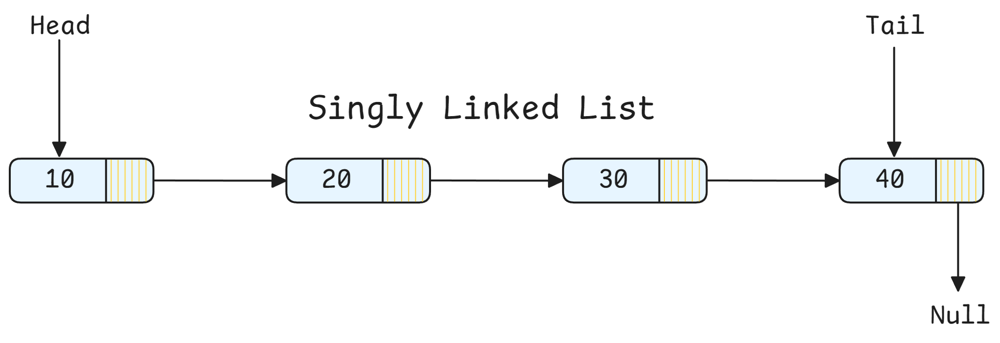
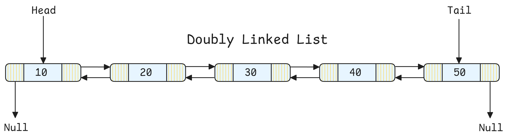
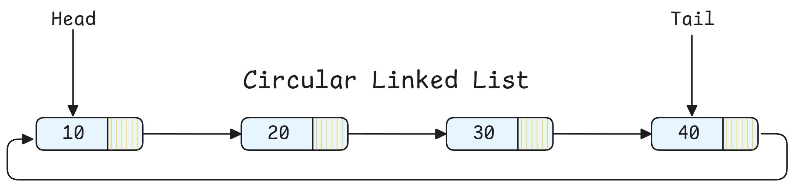

<h1 align="center"> Linked Lists </h1>

A **linked list** is a sequential data structure where each element (**`node`**) contains **data** and a **reference** (**`pointer`**) to the next node. Unlike arrays, elements are not stored contiguously in memory.

The first node is called the `head`, and the last node is called the `tail`.

**Types**:
- **Singly Linked**: Each node points to next node only



- **Doubly Linked**: Each node points to both next and previous



- **Circular**: Last node points back to first



Linked lists enable $O(1)$ insertion/deletion at known positions (vs $O(n)$ for arrays), dynamic sizing, and are foundational for understanding complex data structures (trees, graphs).

## Implementation

**Node Definition**:
```python
class ListNode:
    """Singly linked list node."""
    def __init__(self, val=0, next=None):
        self.val = val
        self.next = next

class DoublyListNode:
    """Doubly linked list node."""
    def __init__(self, val=0, prev=None, next=None):
        self.val = val
        self.prev = prev
        self.next = next
```

**Basic Operations**:
```python
class LinkedList:
    """Singly linked list implementation."""
    
    def __init__(self):
        self.head = None
    
    def insert_at_head(self, val):
        """O(1) insertion at head."""
        new_node = ListNode(val)
        new_node.next = self.head
        self.head = new_node
    
    def insert_at_tail(self, val):
        """O(n) insertion at tail."""
        new_node = ListNode(val)
        
        if not self.head:
            self.head = new_node
            return
        
        # Traverse to end
        current = self.head
        while current.next:
            current = current.next
        
        current.next = new_node
    
    def delete_value(self, val):
        """O(n) delete first occurrence of value."""
        # Handle head deletion
        if self.head and self.head.val == val:
            self.head = self.head.next
            return
        
        # Find node before target
        current = self.head
        while current and current.next:
            if current.next.val == val:
                current.next = current.next.next  # Skip node
                return
            current = current.next
    
    def search(self, val):
        """O(n) search for value."""
        current = self.head
        while current:
            if current.val == val:
                return current
            current = current.next
        return None
```

**Pattern 1: Two Pointers (Fast & Slow)**

```python
def has_cycle(head):
    """
    Detect cycle in linked list using Floyd's algorithm.
    
    Intuition: Fast pointer moves 2x speed. If cycle exists,
    they'll eventually meet.
    """
    if not head or not head.next:
        return False
    
    slow = head
    fast = head
    
    while fast and fast.next:
        slow = slow.next
        fast = fast.next.next
        
        if slow == fast:  # Cycle detected
            return True
    
    return False

# Time: O(n), Space: O(1)


def find_middle(head):
    """Find middle node (for odd length, return middle; for even, return second middle)."""
    if not head:
        return None
    
    slow = head
    fast = head
    
    while fast and fast.next:
        slow = slow.next
        fast = fast.next.next
    
    return slow  # slow is at middle

# Time: O(n), Space: O(1)
```

**Pattern 2: Reversal**

```python
def reverse_list(head):
    """
    Reverse linked list iteratively.
    
    Intuition: Change next pointers to point backwards.
    Need to track: prev, current, next.
    """
    prev = None
    current = head
    
    while current:
        # Save next before overwriting
        next_node = current.next
        
        # Reverse pointer
        current.next = prev
        
        # Move pointers forward
        prev = current
        current = next_node
    
    return prev  # New head

# Time: O(n), Space: O(1)


def reverse_list_recursive(head):
    """Reverse linked list recursively."""
    # Base case
    if not head or not head.next:
        return head
    
    # Reverse rest of list
    new_head = reverse_list_recursive(head.next)
    
    # Reverse current link
    head.next.next = head
    head.next = None
    
    return new_head

# Time: O(n), Space: O(n) due to recursion stack
```

**Pattern 3: Merge Operations**

```python
def merge_two_sorted_lists(l1, l2):
    """
    Merge two sorted linked lists.
    
    Use dummy node to simplify edge cases.
    """
    dummy = ListNode(0)
    current = dummy
    
    while l1 and l2:
        if l1.val <= l2.val:
            current.next = l1
            l1 = l1.next
        else:
            current.next = l2
            l2 = l2.next
        current = current.next
    
    # Attach remaining nodes
    current.next = l1 if l1 else l2
    
    return dummy.next

# Time: O(m + n), Space: O(1)


def merge_k_sorted_lists(lists):
    """
    Merge k sorted linked lists using min heap.
    
    Use case: Merging sorted partitions in distributed systems.
    """
    import heapq
    
    # Handle comparison of ListNode objects
    ListNode.__lt__ = lambda self, other: self.val < other.val
    
    heap = []
    
    # Add first node from each list
    for i, head in enumerate(lists):
        if head:
            heapq.heappush(heap, head)
    
    dummy = ListNode(0)
    current = dummy
    
    while heap:
        # Get node with minimum value
        node = heapq.heappop(heap)
        current.next = node
        current = current.next
        
        # Add next node from same list
        if node.next:
            heapq.heappush(heap, node.next)
    
    return dummy.next

# Time: O(N log k), N = total nodes, k = number of lists
# Space: O(k) for heap
```

**Pattern 4: Reordering**

```python
def reorder_list(head):
    """
    Reorder list: L0 → L1 → ... → Ln-1 → Ln
    to: L0 → Ln → L1 → Ln-1 → ...
    
    Strategy: Find middle, reverse second half, merge alternately.
    """
    if not head or not head.next:
        return
    
    # Step 1: Find middle using slow/fast pointers
    slow = fast = head
    while fast.next and fast.next.next:
        slow = slow.next
        fast = fast.next.next
    
    # Step 2: Reverse second half
    second = slow.next
    slow.next = None  # Split list
    second = reverse_list(second)
    
    # Step 3: Merge two halves alternately
    first = head
    while second:
        # Save next pointers
        tmp1, tmp2 = first.next, second.next
        
        # Interleave
        first.next = second
        second.next = tmp1
        
        # Move forward
        first = tmp1
        second = tmp2

# Time: O(n), Space: O(1)
```

**Pattern 5: Dummy Node Technique**

```python
def remove_nth_from_end(head, n):
    """
    Remove nth node from end of list.
    
    Trick: Use two pointers n steps apart.
    """
    dummy = ListNode(0)
    dummy.next = head
    
    # Move fast pointer n steps ahead
    fast = dummy
    for _ in range(n + 1):
        fast = fast.next
    
    # Move both until fast reaches end
    slow = dummy
    while fast:
        slow = slow.next
        fast = fast.next
    
    # Remove node
    slow.next = slow.next.next
    
    return dummy.next

# Time: O(n), Space: O(1)
```

**Pattern 6: Detecting Intersection**

```python
def get_intersection_node(headA, headB):
    """
    Find intersection point of two linked lists.
    
    Clever approach: Traverse both lists, switch heads at end.
    If intersection exists, pointers will meet.
    """
    if not headA or not headB:
        return None
    
    pA, pB = headA, headB
    
    # Traverse until they meet or both become None
    while pA != pB:
        # Switch to other list's head when reaching end
        pA = pA.next if pA else headB
        pB = pB.next if pB else headA
    
    return pA  # Either intersection node or None

# Time: O(m + n), Space: O(1)
# Works because: if no intersection, both will be None after m+n steps
# If intersection, they meet at intersection after balancing path lengths
```

## Complexity Analysis

| Operation | Array | Linked List | Notes |
|-----------|-------|-------------|-------|
| Access by index | O(1) | O(n) | LL requires traversal |
| Search | O(n) | O(n) | Both linear scan |
| Insert at head | O(n) | O(1) | Array needs shifting |
| Insert at tail | O(1) | O(n) | LL needs traversal (O(1) with tail pointer) |
| Insert at position | O(n) | O(1)* | *After reaching position O(n) |
| Delete at position | O(n) | O(1)* | *After reaching position O(n) |
| Memory overhead | Minimal | High | Each node has pointer(s) |

**Space Complexity Notes**:
- **Array**: Contiguous block, better cache locality
- **Linked List**: Scattered nodes, extra pointer per node (4-8 bytes)
- **Doubly Linked**: Double pointer overhead

## Common Questions

1. "Why use linked lists if arrays are faster for access?"
   - **Answer**: 
     - Dynamic sizing without reallocation
     - O(1) insertion/deletion at known positions
     - No wasted preallocated space
     - Fundamental building block for complex structures
     - Better for frequent insertions/deletions in middle

2. "Explain dummy node technique and its benefits"
   - **Answer**: Dummy node is a placeholder node before the actual head. Benefits:
     - Eliminates special cases for head operations
     - Simplifies edge case handling (empty list, single node)
     - Makes code cleaner and less error-prone
     - Standard pattern in interview problems

3. "How to detect the start of a cycle?"
   ```python
   def detect_cycle_start(head):
       """
       Find the node where cycle begins.
       
       Floyd's algorithm extended:
       1. Detect cycle with fast/slow
       2. Reset one pointer to head
       3. Move both at same speed - they meet at cycle start
       """
       # Phase 1: Detect cycle
       slow = fast = head
       
       while fast and fast.next:
           slow = slow.next
           fast = fast.next.next
           
           if slow == fast:
               break
       else:
           return None  # No cycle
       
       # Phase 2: Find cycle start
       slow = head
       while slow != fast:
           slow = slow.next
           fast = fast.next
       
       return slow  # Cycle start
   
   # Why this works: Mathematical proof based on distances
   # If cycle starts at position C and meeting point is M:
   # Distance from head to C = Distance from M to C (going forward)
   ```

4. "Compare recursion vs iteration for linked list problems"
   - **Answer**:
     - **Recursion**: 
       - More elegant, easier to understand
       - O(n) space due to call stack
       - Risk of stack overflow for very long lists
       - Natural for tree-like thinking
     - **Iteration**:
       - O(1) space
       - More control, no stack overflow risk
       - Sometimes requires more complex state tracking
     - **Choice**: Use iteration for production code, recursion for clarity in interviews (mention space trade-off)

## Patterns in Linked List

1. **Two-Pointer Patterns**:
   - Fast/slow for cycle detection, middle finding
   - Two pointers n apart for nth from end
   - One pointer per list for merging

2. **Reversal Patterns**:
   - Full reversal
   - Reverse between positions
   - Reverse in groups of k

3. **Dummy Node Pattern**:
   - Use when head might change
   - Simplifies merge operations
   - Cleaner deletion logic

4. **Common Tricks**:
   - Use dummy node for edge cases
   - Draw diagrams with 2-3 nodes
   - Track prev, current, next pointers carefully
   - Consider single node and empty list cases
   - For cycle problems, think mathematical invariants

## Edge Cases
- Empty list (head is None)
- Single node
- Two nodes
- Operations at head
- Operations at tail
- Cycles (if applicable)
- Lists of different lengths (for merge operations)

---

**[Linked List Questions Notebook](./Notebooks/LinkedList.ipynb)