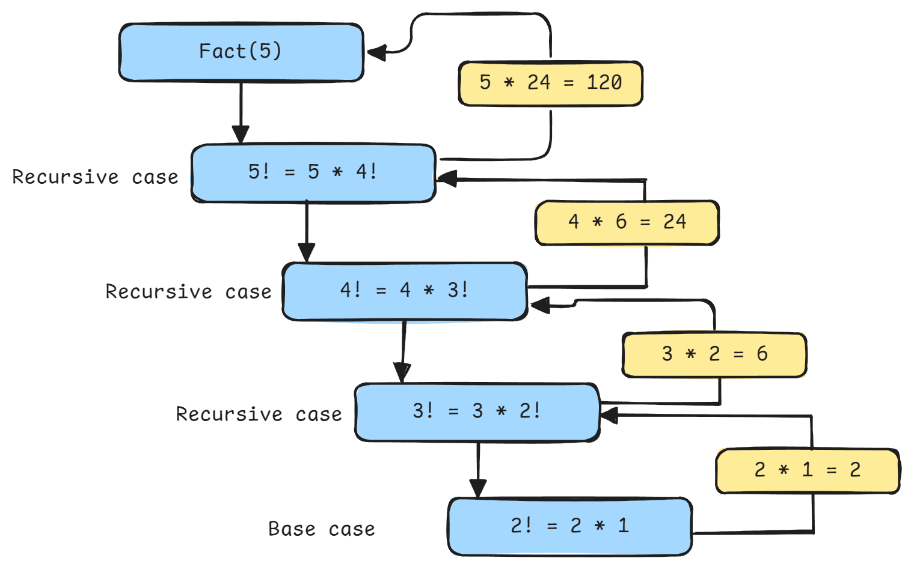
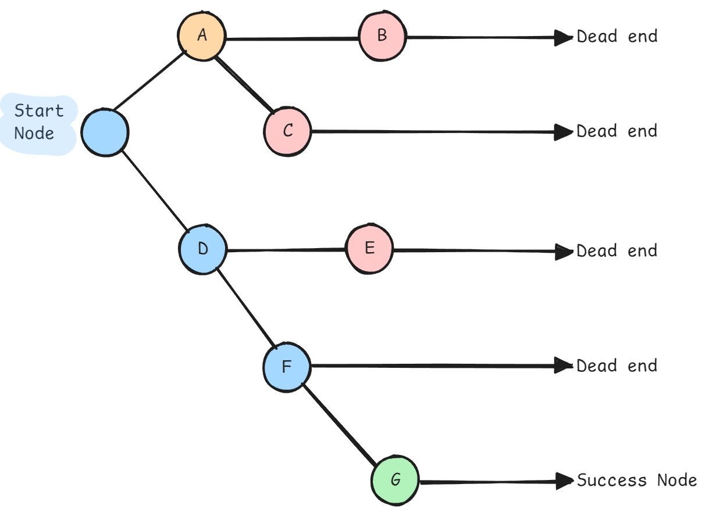

<h1 align="center"> Recursion & Backtracking </h1>

**Recursion**: A function that calls itself with a simpler version of the problem until reaching a base case.



**Backtracking**: A systematic way to try all possible solutions by building candidates incrementally and abandoning ("backtracking") when they cannot lead to valid solutions.



**Why it matters**: 
- Natural way to solve problems with recursive structure (trees, combinations, permutations)
- Enables exhaustive search with pruning (better than brute force)
- Foundation for dynamic programming (recursion + memoization)

**Key Insight**: 
- **Recursion**: "Solve smaller problem, combine results"
- **Backtracking**: "Try a choice, recurse; if fails, undo choice and try another"

**When to Use**:
- Problem can be broken into similar subproblems
- Need to explore all possible configurations
- Constraint satisfaction problems (Sudoku, N-Queens)
- Combinatorial search (subsets, permutations)

## Python Implementation

**Basic Recursion**:

```python
def factorial(n):
    """
    Classic recursion example.
    
    Base case: n == 0 or n == 1
    Recursive case: n * factorial(n-1)
    """
    # Base case
    if n <= 1:
        return 1
    
    # Recursive case
    return n * factorial(n - 1)

# Time: O(n), Space: O(n) call stack


def fibonacci(n):
    """
    Fibonacci: f(n) = f(n-1) + f(n-2)
    
    Naive recursion - inefficient due to repeated computation.
    """
    if n <= 1:
        return n
    
    return fibonacci(n - 1) + fibonacci(n - 2)

# Time: O(2^n) - exponential!, Space: O(n) call stack


def fibonacci_memoized(n, memo=None):
    """
    Fibonacci with memoization - cache computed values.
    
    This bridges recursion to dynamic programming.
    """
    if memo is None:
        memo = {}
    
    if n in memo:
        return memo[n]
    
    if n <= 1:
        return n
    
    memo[n] = fibonacci_memoized(n - 1, memo) + fibonacci_memoized(n - 2, memo)
    return memo[n]

# Time: O(n), Space: O(n)
```

**Recursion on Trees**:

```python
def max_depth(root):
    """Tree height using recursion."""
    if not root:
        return 0
    
    return 1 + max(max_depth(root.left), max_depth(root.right))


def is_same_tree(p, q):
    """Check if two trees are identical."""
    # Base cases
    if not p and not q:
        return True
    if not p or not q:
        return False
    
    # Check current node and recurse
    return (p.val == q.val and 
            is_same_tree(p.left, q.left) and 
            is_same_tree(p.right, q.right))


def invert_tree(root):
    """Invert binary tree (mirror)."""
    if not root:
        return None
    
    # Swap children
    root.left, root.right = root.right, root.left
    
    # Recursively invert subtrees
    invert_tree(root.left)
    invert_tree(root.right)
    
    return root
```

**Backtracking Template**:

```python
def backtrack_template(state, choices):
    """
    Universal backtracking template.
    
    Args:
        state: Current state of solution being built
        choices: Available choices at current state
    
    Pattern:
        1. Check if current state is valid solution
        2. Try each possible choice
        3. Make choice (update state)
        4. Recurse with new state
        5. Undo choice (backtrack)
    """
    # Base case: found valid solution
    if is_solution(state):
        process_solution(state)
        return
    
    # Try each possible choice
    for choice in choices:
        # Prune: skip invalid choices
        if not is_valid(choice, state):
            continue
        
        # Make choice
        make_choice(state, choice)
        
        # Recurse
        backtrack_template(state, get_next_choices(state))
        
        # Undo choice (backtrack)
        undo_choice(state, choice)
```

**Backtracking: Subsets**:

```python
def subsets(nums):
    """
    Generate all subsets (power set).
    
    Example: [1,2,3] → [[], [1], [2], [3], [1,2], [1,3], [2,3], [1,2,3]]
    
    Approach: At each position, choose to include or exclude the element.
    """
    result = []
    
    def backtrack(start, current):
        # Every state is a valid subset
        result.append(current[:])  # Make copy
        
        # Try adding each remaining element
        for i in range(start, len(nums)):
            # Make choice: include nums[i]
            current.append(nums[i])
            
            # Recurse
            backtrack(i + 1, current)
            
            # Undo choice: remove nums[i]
            current.pop()
    
    backtrack(0, [])
    return result

# Time: O(n * 2^n) - 2^n subsets, each takes O(n) to copy
# Space: O(n) recursion depth


def subsets_with_duplicates(nums):
    """
    Generate subsets when input has duplicates.
    
    Example: [1,2,2] → [[], [1], [2], [1,2], [2,2], [1,2,2]]
    
    Key: Sort first, skip duplicates at same recursion level.
    """
    nums.sort()  # Sort to group duplicates
    result = []
    
    def backtrack(start, current):
        result.append(current[:])
        
        for i in range(start, len(nums)):
            # Skip duplicates at same level
            if i > start and nums[i] == nums[i - 1]:
                continue
            
            current.append(nums[i])
            backtrack(i + 1, current)
            current.pop()
    
    backtrack(0, [])
    return result

# Time: O(n * 2^n), Space: O(n)
```

**Backtracking: Permutations**:

```python
def permutations(nums):
    """
    Generate all permutations.
    
    Example: [1,2,3] → [[1,2,3], [1,3,2], [2,1,3], [2,3,1], [3,1,2], [3,2,1]]
    
    Approach: At each position, try each unused element.
    """
    result = []
    
    def backtrack(current, remaining):
        # Base case: used all elements
        if not remaining:
            result.append(current[:])
            return
        
        # Try each remaining element
        for i in range(len(remaining)):
            # Make choice
            current.append(remaining[i])
            
            # Recurse with remaining elements
            backtrack(current, remaining[:i] + remaining[i+1:])
            
            # Undo choice
            current.pop()
    
    backtrack([], nums)
    return result

# Time: O(n! * n) - n! permutations, each takes O(n) to build
# Space: O(n) recursion depth


def permutations_optimized(nums):
    """Optimized version using swap instead of creating new lists."""
    result = []
    
    def backtrack(start):
        # Base case: completed permutation
        if start == len(nums):
            result.append(nums[:])
            return
        
        # Try each element in remaining positions
        for i in range(start, len(nums)):
            # Swap current element to start position
            nums[start], nums[i] = nums[i], nums[start]
            
            # Recurse
            backtrack(start + 1)
            
            # Backtrack: undo swap
            nums[start], nums[i] = nums[i], nums[start]
    
    backtrack(0)
    return result

# Time: O(n! * n), Space: O(n)
```

**Backtracking: Combinations**:

```python
def combinations(n, k):
    """
    Generate all combinations of k numbers from 1 to n.
    
    Example: n=4, k=2 → [[1,2], [1,3], [1,4], [2,3], [2,4], [3,4]]
    """
    result = []
    
    def backtrack(start, current):
        # Base case: combination complete
        if len(current) == k:
            result.append(current[:])
            return
        
        # Try each number from start to n
        for i in range(start, n + 1):
            # Make choice
            current.append(i)
            
            # Recurse (i+1 to avoid duplicates like [1,2] and [2,1])
            backtrack(i + 1, current)
            
            # Undo choice
            current.pop()
    
    backtrack(1, [])
    return result

# Time: O(C(n,k) * k) where C(n,k) = n!/(k!(n-k)!)
# Space: O(k)


def combination_sum(candidates, target):
    """
    Find all combinations that sum to target (can reuse elements).
    
    Example: candidates=[2,3,6,7], target=7 → [[2,2,3], [7]]
    """
    result = []
    candidates.sort()  # Optional: for early pruning
    
    def backtrack(start, current, remaining):
        # Base case: found valid combination
        if remaining == 0:
            result.append(current[:])
            return
        
        # Pruning: remaining < 0
        if remaining < 0:
            return
        
        for i in range(start, len(candidates)):
            # Pruning: early stop if sorted
            if candidates[i] > remaining:
                break
            
            # Make choice
            current.append(candidates[i])
            
            # Recurse (can reuse same element, so start=i not i+1)
            backtrack(i, current, remaining - candidates[i])
            
            # Undo choice
            current.pop()
    
    backtrack(0, [], target)
    return result

# Time: O(n^(t/m)) where t=target, m=min(candidates)
# Space: O(t/m) recursion depth
```

**Backtracking: N-Queens**:

```python
def solve_n_queens(n):
    """
    Place n queens on n×n board such that no two queens attack each other.
    
    Classic backtracking problem demonstrating constraint satisfaction.
    """
    result = []
    board = [['.'] * n for _ in range(n)]
    
    # Track attacked positions for efficiency
    cols = set()
    diag1 = set()  # row - col
    diag2 = set()  # row + col
    
    def backtrack(row):
        # Base case: placed all queens
        if row == n:
            result.append([''.join(row) for row in board])
            return
        
        # Try placing queen in each column
        for col in range(n):
            # Check if position is under attack
            if (col in cols or 
                row - col in diag1 or 
                row + col in diag2):
                continue
            
            # Make choice: place queen
            board[row][col] = 'Q'
            cols.add(col)
            diag1.add(row - col)
            diag2.add(row + col)
            
            # Recurse to next row
            backtrack(row + 1)
            
            # Undo choice: remove queen
            board[row][col] = '.'
            cols.remove(col)
            diag1.remove(row - col)
            diag2.remove(row + col)
    
    backtrack(0)
    return result

# Time: O(n!), Space: O(n)
```

**Backtracking: Word Search**:

```python
def word_search(board, word):
    """
    Find if word exists in board (can move up/down/left/right).
    
    Example:
    board = [['A','B','C','E'],
             ['S','F','C','S'],
             ['A','D','E','E']]
    word = "ABCCED" → True
    """
    rows, cols = len(board), len(board[0])
    
    def backtrack(row, col, index):
        # Base case: found all characters
        if index == len(word):
            return True
        
        # Check bounds and character match
        if (row < 0 or row >= rows or 
            col < 0 or col >= cols or 
            board[row][col] != word[index]):
            return False
        
        # Mark as visited (in-place)
        temp = board[row][col]
        board[row][col] = '#'
        
        # Try all four directions
        found = (backtrack(row + 1, col, index + 1) or
                backtrack(row - 1, col, index + 1) or
                backtrack(row, col + 1, index + 1) or
                backtrack(row, col - 1, index + 1))
        
        # Restore cell (backtrack)
        board[row][col] = temp
        
        return found
    
    # Try starting from each cell
    for i in range(rows):
        for j in range(cols):
            if backtrack(i, j, 0):
                return True
    
    return False

# Time: O(m*n * 4^L) where L = len(word)
# Space: O(L) recursion depth
```

## Complexity Analysis

| Problem Type | Time Complexity | Space Complexity | Notes |
|--------------|-----------------|------------------|-------|
| Subsets | O(n · 2^n) | O(n) | 2^n subsets |
| Permutations | O(n! · n) | O(n) | n! permutations |
| Combinations C(n,k) | O(C(n,k) · k) | O(k) | Binomial coefficient |
| N-Queens | O(n!) | O(n) | Pruning reduces from n^n |
| Sudoku | O(9^m) | O(m) | m = empty cells |
| Word Search | O(m·n · 4^L) | O(L) | L = word length |

**Why Backtracking is Better than Brute Force**:
- **Pruning**: Abandon invalid partial solutions early
- **Constraint propagation**: Use domain knowledge to skip branches
- **Example**: N-Queens checks attacks before trying, reducing from n^n to n!

## Common Questions

1. "Explain the difference between recursion and backtracking"
   - **Answer**:
     - **Recursion**: General technique of function calling itself
     - **Backtracking**: Specific algorithm using recursion to explore solution space
     - **Key difference**: Backtracking involves "undoing" choices (backtracking step)
     - **Example**: Factorial uses recursion; N-Queens uses backtracking

2. "When to use backtracking vs dynamic programming?"
   - **Answer**:
     - **Backtracking**: Need all solutions, or solution space is sparse
     - **DP**: Need optimal solution, has overlapping subproblems
     - **DP = Recursion + Memoization**: DP is optimized recursion
     - **Example**: Subsets (backtracking), Fibonacci (DP)

3. "How to optimize backtracking?"
   - **Answer**:
     - **Pruning**: Skip branches that can't lead to solution
     - **Constraint checking early**: Validate before recursing
     - **Ordering**: Try most constrained choices first
     - **Memoization**: Cache results if subproblems repeat
     - **Example**: N-Queens tracks attacked positions

4. "How to avoid stack overflow in recursion?"
   - **Answer**:
     - **Check recursion depth**: Python default is ~1000
     - **Increase limit**: `sys.setrecursionlimit()` (use cautiously)
     - **Convert to iteration**: Use explicit stack
     - **Tail recursion optimization**: Python doesn't optimize, but concept helps
     - **Example**: Deep trees might need iterative solution

## Problem-Solving Patterns

1. **Subsets/Combinations**: Include/exclude each element
2. **Permutations**: Try each element at each position
3. **Constraint Satisfaction**: Check constraints before recursing
4. **Path Finding**: Mark visited, recurse, unmark (backtrack)
5. **Partition Problems**: Try different split points

## Common Mistakes

- Forgetting to make copy when adding to result (`result.append(current[:])`)
- Not backtracking properly (forgetting to undo choice)
- Modifying shared state without restoration
- Not handling base case correctly
- Inefficient pruning (checking constraints too late)

## Edge Cases

- Empty input
- Single element
- No valid solution exists
- All elements identical
- Maximum recursion depth exceeded

---

**[Recursion & Backtracking Questions Notebook](./notebooks/Recursion-Backtracking.ipynb)
