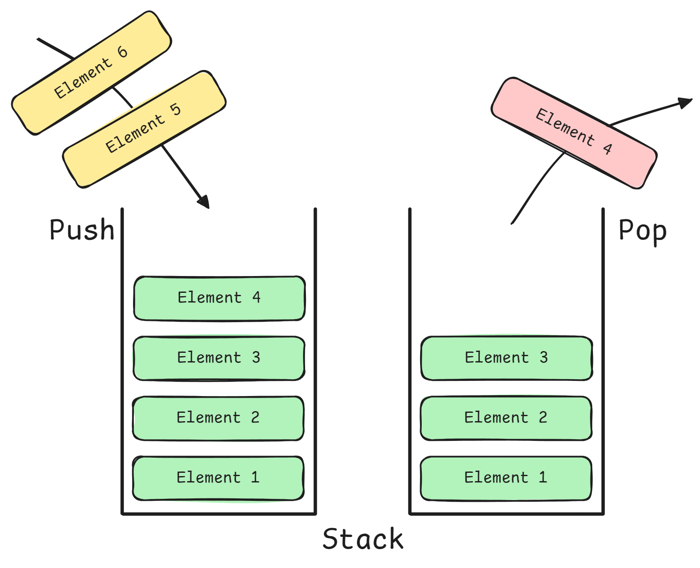
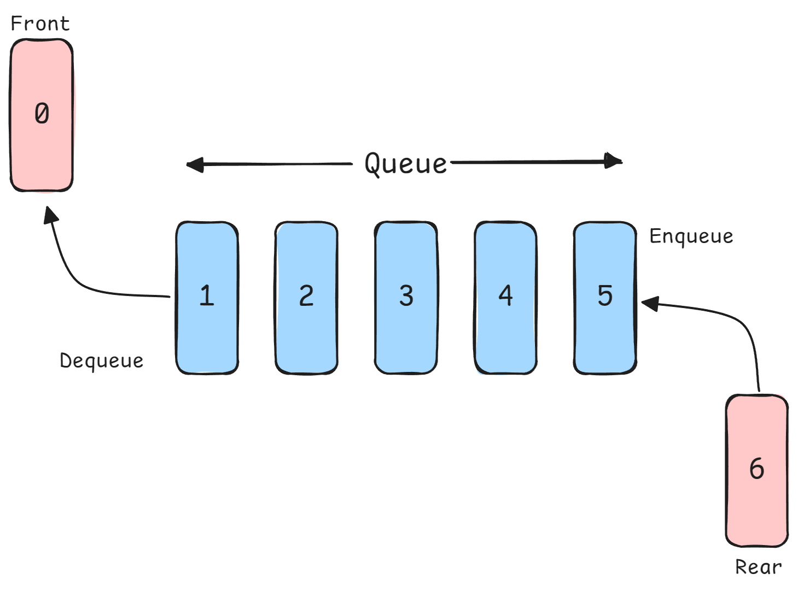

<h1 align="center"> Stacks & Queues </h1>

## Introduction

**Stack** is a linear data structure that follows LIFO (Last In First Out) order. Like a stack of plates, you can only **add/remove from the top**. Operations: `push` (add), `pop` (remove), `peek` (view top).



**Queue** is a linear data structure that follows FIFO (First In First Out) principle. Like a line at a store, first person in line is served first. Operations: `enqueue` (add to rear), `dequeue` (remove from front).



- **Stacks** are fundamental to **recursion**, expression parsing, and **backtracking**. 

- **Queues** enable **BFS**, task scheduling, and **streaming data processing**. Both provide `O(1)` operations when implemented correctly.

- We also have variations of queues called **Circular Queue** (rear end connected to front end), **Priority Queue** (elements are inserted based on their priority) and **Doubly-ended Queue** (or **deque** that allows insertion and deletion from both front and rear ends).

> **Stacks** remember "**where you came from**" (undo, backtracking), **queues** **process in order** (level-by-level, scheduling)

- **Stack Implementation**

```python
# Using list (simplest, but append/pop from end)
stack = []
stack.append(1)  # push - O(1)
stack.append(2)
top = stack[-1]  # peek - O(1)
item = stack.pop()  # pop - O(1)

# Using collections.deque (more efficient for large stacks)
from collections import deque
stack = deque()
stack.append(1)  # push
stack.pop()  # pop from right

# Stack applications: Valid Parentheses
def is_valid_parentheses(s):
    """Check if parentheses are balanced."""
    stack = []
    pairs = {'(': ')', '[': ']', '{': '}'}
    
    for char in s:
        if char in pairs:  # Opening bracket
            stack.append(char)
        elif not stack or pairs[stack.pop()] != char:
            return False  # Mismatched or extra closing
    
    return len(stack) == 0  # All opened brackets closed

# Time: O(n), Space: O(n)
```

- **Queue Implementation**

```python
from collections import deque

# Using deque (efficient O(1) operations at both ends)
queue = deque()
queue.append(1)  # enqueue - O(1)
queue.append(2)
item = queue.popleft()  # dequeue - O(1)

# DON'T use list for queue (pop(0) is O(n))
# bad_queue = []
# bad_queue.append(1)
# bad_queue.pop(0)  # O(n) - shifts all elements!

# Queue application: Recent Counter
class RecentCounter:
    """Count requests in last 3000ms."""
    
    def __init__(self):
        self.queue = deque()
    
    def ping(self, t):
        """Add new request at time t."""
        self.queue.append(t)
        
        # Remove requests older than 3000ms
        while self.queue and self.queue[0] < t - 3000:
            self.queue.popleft()
        
        return len(self.queue)

# Time per ping: O(1) amortized, Space: O(W) where W is window size
```

- **Monotonic Stack**

```python
def daily_temperatures(temperatures):
    """
    For each day, find how many days until warmer temperature.
    
    Example: [73,74,75,71,69,72,76,73] -> [1,1,4,2,1,1,0,0]
    """
    n = len(temperatures)
    result = [0] * n
    stack = []  # Store indices
    
    for i, temp in enumerate(temperatures):
        # Pop while current temp is warmer than stack top
        while stack and temperatures[stack[-1]] < temp:
            prev_idx = stack.pop()
            result[prev_idx] = i - prev_idx  # Days difference
        
        stack.append(i)
    
    return result

# Time: O(n), Space: O(n)
# Each element pushed and popped at most once
```

- **Monotonic Queue**

```python
from collections import deque

def max_sliding_window(nums, k):
    """
    Find maximum in each sliding window of size k.
    
    Example: nums=[1,3,-1,-3,5,3,6,7], k=3 -> [3,3,5,5,6,7]
    """
    result = []
    dq = deque()  # Store indices of potential maximums
    
    for i, num in enumerate(nums):
        # Remove elements outside window
        while dq and dq[0] < i - k + 1:
            dq.popleft()
        
        # Remove elements smaller than current (can't be max)
        while dq and nums[dq[-1]] < num:
            dq.pop()
        
        dq.append(i)
        
        # Add to result once window is full
        if i >= k - 1:
            result.append(nums[dq[0]])  # Front is maximum
    
    return result

# Time: O(n), Space: O(k)
```

- **Priority Queue (Heap-based Queue)**

```python
import heapq

# Min heap (smallest element has highest priority)
pq = []
heapq.heappush(pq, 3)  # O(log n)
heapq.heappush(pq, 1)
heapq.heappush(pq, 2)
min_item = heapq.heappop(pq)  # Returns 1 - O(log n)

# Max heap (use negative values)
max_pq = []
heapq.heappush(max_pq, -3)
heapq.heappush(max_pq, -1)
max_item = -heapq.heappop(max_pq)  # Returns 3

# Priority queue for tasks
import heapq
from dataclasses import dataclass
from typing import Any

@dataclass(order=True)
class Task:
    priority: int
    data: Any = None

task_queue = []
heapq.heappush(task_queue, Task(priority=2, data="Medium"))
heapq.heappush(task_queue, Task(priority=1, data="High"))
heapq.heappush(task_queue, Task(priority=3, data="Low"))

next_task = heapq.heappop(task_queue)  # Task(priority=1, data="High")
```

#### Complexity Analysis

| Data Structure | Operation | Time | Space | Notes |
|---------------|-----------|------|-------|-------|
| Stack (list) | push/pop | O(1) | O(n) | Occasional resize |
| Stack (deque) | push/pop | O(1) | O(n) | No resize overhead |
| Queue (list) | enqueue/dequeue | O(1)/O(n)
| Queue (deque) | enqueue/dequeue | O(1)/O(1) | O(n) | Recommended |
| Priority Queue | insert/extract | O(log n) | O(n) | Heap-based |
| Monotonic Stack | push/pop | O(1) amortized | O(n) | Each element once |
| Monotonic Queue | operations | O(1) amortized | O(k) | Window size k |

**Key Performance Notes**:
- **Never use `list.pop(0)` for queues** - it's O(n) due to element shifting
- **deque is implemented as doubly-linked list** - O(1) at both ends
- **Monotonic structures**: Each element is pushed and popped at most once → O(n) total over all operations

## Common Questions

1. "Implement a stack using queues (or vice versa)"
   ```python
   from collections import deque
   
   class StackUsingQueues:
       """Implement stack using two queues."""
       
       def __init__(self):
           self.q1 = deque()
           self.q2 = deque()
       
       def push(self, x):
           """O(1) push operation."""
           self.q1.append(x)
       
       def pop(self):
           """O(n) pop - move all but last to q2."""
           if not self.q1:
               return None
           
           # Move all but last element to q2
           while len(self.q1) > 1:
               self.q2.append(self.q1.popleft())
           
           result = self.q1.popleft()
           
           # Swap queues
           self.q1, self.q2 = self.q2, self.q1
           
           return result
       
       def top(self):
           """O(n) peek operation."""
           if not self.q1:
               return None
           
           while len(self.q1) > 1:
               self.q2.append(self.q1.popleft())
           
           result = self.q1[0]
           self.q2.append(self.q1.popleft())
           self.q1, self.q2 = self.q2, self.q1
           
           return result
   ```

2. "Explain monotonic stack and when to use it"
   - **Answer**: A monotonic stack maintains elements in sorted order (increasing or decreasing). Use it when you need to find the "next greater/smaller element" or solve problems involving ranges and comparisons. Key insight: When you pop an element, you've found its "answer" (next greater/smaller).
   
   **Pattern Recognition**:
   - "Next greater/smaller element"
   - "Largest rectangle in histogram"
   - "Stock span problem"
   - Any problem involving finding boundaries or ranges

3. "Min Stack - design stack with $O(1)$ `getMin()`"

   ```python
   class MinStack:
       """Stack supporting O(1) min operation."""
       
       def __init__(self):
           self.stack = []
           self.min_stack = []  # Parallel stack tracking minimums
       
       def push(self, val):
           """O(1) push."""
           self.stack.append(val)
           # Push current min (val or previous min)
           min_val = min(val, self.min_stack[-1] if self.min_stack else val)
           self.min_stack.append(min_val)
       
       def pop(self):
           """O(1) pop."""
           if self.stack:
               self.stack.pop()
               self.min_stack.pop()
       
       def top(self):
           """O(1) peek."""
           return self.stack[-1] if self.stack else None
       
       def getMin(self):
           """O(1) get minimum."""
           return self.min_stack[-1] if self.min_stack else None
   
   # Space optimization: only store mins when they change
   class MinStackOptimized:
       def __init__(self):
           self.stack = []
           self.min_stack = []  # (value, count)
       
       def push(self, val):
           self.stack.append(val)
           
           if not self.min_stack or val < self.min_stack[-1][0]:
               self.min_stack.append((val, 1))
           elif val == self.min_stack[-1][0]:
               self.min_stack[-1] = (val, self.min_stack[-1][1] + 1)
       
       def pop(self):
           if not self.stack:
               return
           
           val = self.stack.pop()
           
           if val == self.min_stack[-1][0]:
               count = self.min_stack[-1][1]
               if count == 1:
                   self.min_stack.pop()
               else:
                   self.min_stack[-1] = (val, count - 1)
       
       def getMin(self):
           return self.min_stack[-1][0] if self.min_stack else None
   ```

4. "Design circular queue"

   ```python
   class CircularQueue:
       """Fixed-size circular queue using array."""
       
       def __init__(self, k):
           self.data = [None] * k
           self.head = 0
           self.tail = 0
           self.size = 0
           self.capacity = k
       
       def enqueue(self, value):
           """Add element to rear."""
           if self.is_full():
               return False
           
           self.data[self.tail] = value
           self.tail = (self.tail + 1) % self.capacity  # Circular
           self.size += 1
           return True
       
       def dequeue(self):
           """Remove element from front."""
           if self.is_empty():
               return None
           
           value = self.data[self.head]
           self.head = (self.head + 1) % self.capacity
           self.size -= 1
           return value
       
       def is_empty(self):
           return self.size == 0
       
       def is_full(self):
           return self.size == self.capacity
   
   # Time: O(1) all operations, Space: O(k)
   ```

## Common Pitfalls

- Using `list.pop(0)` for queue → O(n) instead of O(1)
- Not checking for empty stack/queue before pop/peek
- Confusing stack (LIFO) vs queue (FIFO) semantics
- Not maintaining monotonic property correctly
- Integer overflow in monotonic problems (less common in Python)

**Edge Cases**:
- Empty structure
- Single element
- All elements equal
- Operations on empty structure
- Maximum capacity (for bounded structures)

---

## When to Use Each Structure

| Use Case | Structure | Reason |
|----------|-----------|--------|
| Function call tracking | Stack | LIFO - last called, first returned |
| Backtracking | Stack | Remember previous states |
| Level-order traversal | Queue | Process nodes level by level |
| Task scheduling | Priority Queue | Process by importance/deadline |
| Moving window max/min | Monotonic Deque | O(1) amortized per element |
| Expression parsing | Stack | Handle nested operations |
| Stream buffering | Queue | Maintain order, handle rate differences |

---

**[Stacks & Queues Questions Notebook](./Notebooks/Stacks-Queues.ipynb)**
