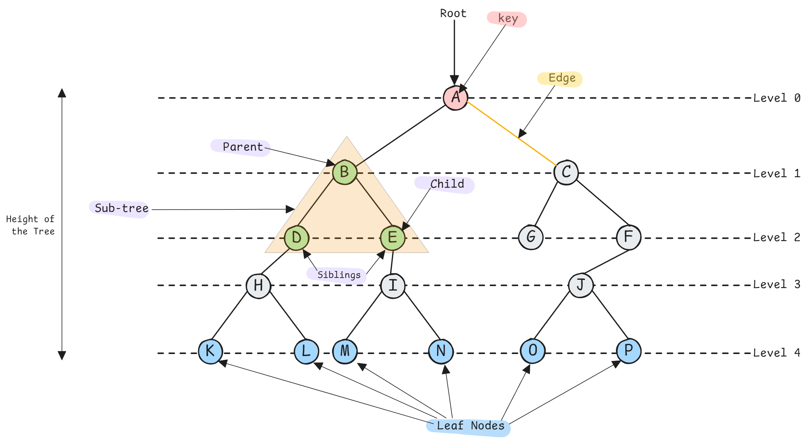
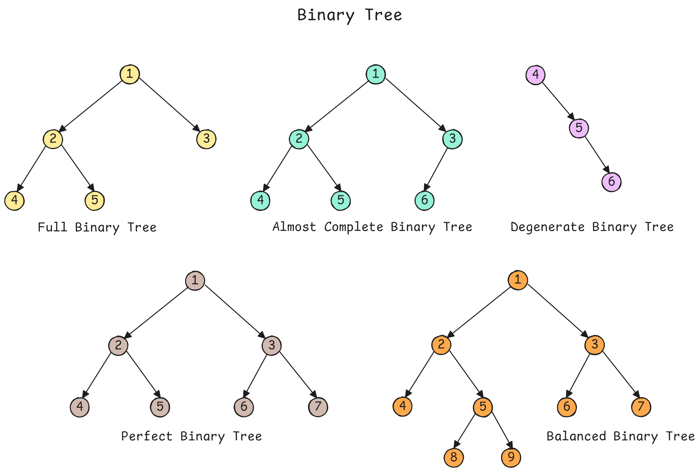
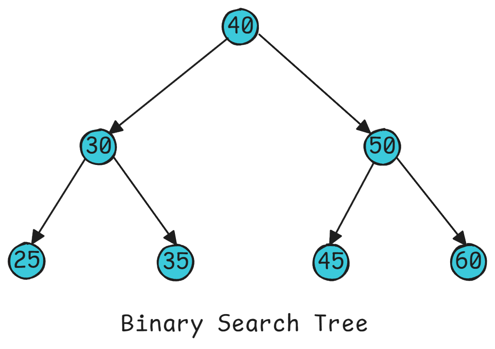

<h1 align="center"> Trees </h1>

A **tree** is a hierarchical data structure consisting of nodes connected by edges, with a single root node and no cycles. Each node can have zero or more children.

Trees model **hierarchical relationships** (file systems, org charts, decision trees).  Tree traversals are foundational for graph algorithms, parsing, and many ML structures.



**Key Terminology**:
- **Root**: Topmost node (no parent)
- **Leaf**: Node with no children
- **Edge**: A line segment that connects two nodes, representing a reference (Pointer) between the nodes
- **Height**: Longest path from node to leaf
- **Depth**: Path length from root to node
- **Subtree**: Tree formed by node and its descendants
- **Number of Edges**: A tree with `N` node will always have `N-1` edges
- **Degree of a Node**: Number of subtrees attached to a node (number of children)

---

## Types of Trees

- **Binary Tree**: Each node has at most 2 children (left and right). If all levels are fully filled expect the last, and it is filled from left to right, then we have a **complete binary tree**. Finally if the height difference between left and right subtrees of every node is minimal, we have a **balanced binary tree.**



- **Binary Search Tree (BST)**: Binary tree where left child < parent < right child. It enable `O(log n)` **search/insert/delete**



**Key Insight**: Trees reduce search space logarithmically (like binary search). Understanding tree traversals is crucial for DFS/BFS in graphs and parsing expressions.

---

## Python Implementation

**Node Definition**:
```python
class TreeNode:
    """Binary tree node."""
    def __init__(self, val=0, left=None, right=None):
        self.val = val
        self.left = left
        self.right = right

class NaryNode:
    """N-ary tree node."""
    def __init__(self, val=0, children=None):
        self.val = val
        self.children = children if children else []
```

**Tree Traversals - Recursive**:

```python
def inorder_traversal(root):
    """
    Inorder: Left → Root → Right
    For BST: visits nodes in sorted order
    """
    result = []
    
    def traverse(node):
        if not node:
            return
        
        traverse(node.left)      # Left
        result.append(node.val)  # Root
        traverse(node.right)     # Right
    
    traverse(root)
    return result

# Time: O(n), Space: O(h) where h is height


def preorder_traversal(root):
    """
    Preorder: Root → Left → Right
    Use case: Tree serialization, copying tree structure
    """
    result = []
    
    def traverse(node):
        if not node:
            return
        
        result.append(node.val)  # Root
        traverse(node.left)      # Left
        traverse(node.right)     # Right
    
    traverse(root)
    return result

# Time: O(n), Space: O(h)


def postorder_traversal(root):
    """
    Postorder: Left → Right → Root
    Use case: Deleting tree, evaluating expression trees
    """
    result = []
    
    def traverse(node):
        if not node:
            return
        
        traverse(node.left)      # Left
        traverse(node.right)     # Right
        result.append(node.val)  # Root
    
    traverse(root)
    return result

# Time: O(n), Space: O(h)


def level_order_traversal(root):
    """
    Level-order (BFS): Visit nodes level by level
    Use case: Finding shortest path, level-wise operations
    """
    if not root:
        return []
    
    from collections import deque
    
    result = []
    queue = deque([root])
    
    while queue:
        level_size = len(queue)
        level = []
        
        for _ in range(level_size):
            node = queue.popleft()
            level.append(node.val)
            
            if node.left:
                queue.append(node.left)
            if node.right:
                queue.append(node.right)
        
        result.append(level)
    
    return result

# Time: O(n), Space: O(w) where w is max width
```

**Tree Traversals - Iterative**:

```python
def inorder_iterative(root):
    """
    Iterative inorder using stack.
    Better space efficiency than recursion for skewed trees.
    """
    result = []
    stack = []
    current = root
    
    while current or stack:
        # Go to leftmost node
        while current:
            stack.append(current)
            current = current.left
        
        # Process node
        current = stack.pop()
        result.append(current.val)
        
        # Move to right subtree
        current = current.right
    
    return result

# Time: O(n), Space: O(h)


def preorder_iterative(root):
    """Iterative preorder using stack."""
    if not root:
        return []
    
    result = []
    stack = [root]
    
    while stack:
        node = stack.pop()
        result.append(node.val)
        
        # Push right first (so left is processed first)
        if node.right:
            stack.append(node.right)
        if node.left:
            stack.append(node.left)
    
    return result

# Time: O(n), Space: O(h)


def postorder_iterative(root):
    """
    Iterative postorder (tricky - needs two stacks or visited tracking).
    
    Approach: Preorder with reversed children, then reverse result.
    """
    if not root:
        return []
    
    stack1 = [root]
    stack2 = []
    
    while stack1:
        node = stack1.pop()
        stack2.append(node)
        
        # Push left first (opposite of preorder)
        if node.left:
            stack1.append(node.left)
        if node.right:
            stack1.append(node.right)
    
    # Reverse to get postorder
    return [node.val for node in reversed(stack2)]

# Time: O(n), Space: O(h)
```

**Binary Search Tree Operations**:

```python
class BST:
    """Binary Search Tree implementation."""
    
    def __init__(self):
        self.root = None
    
    def search(self, val):
        """Search for value in BST."""
        current = self.root
        
        while current:
            if val == current.val:
                return True
            elif val < current.val:
                current = current.left
            else:
                current = current.right
        
        return False
    
    # Time: O(h), Space: O(1)
    
    def insert(self, val):
        """Insert value into BST."""
        if not self.root:
            self.root = TreeNode(val)
            return
        
        current = self.root
        
        while True:
            if val < current.val:
                if not current.left:
                    current.left = TreeNode(val)
                    return
                current = current.left
            else:
                if not current.right:
                    current.right = TreeNode(val)
                    return
                current = current.right
    
    # Time: O(h), Space: O(1)
    
    def delete(self, val):
        """Delete value from BST."""
        def delete_node(node, val):
            if not node:
                return None
            
            if val < node.val:
                node.left = delete_node(node.left, val)
            elif val > node.val:
                node.right = delete_node(node.right, val)
            else:
                # Found node to delete
                # Case 1: Leaf node
                if not node.left and not node.right:
                    return None
                
                # Case 2: One child
                if not node.left:
                    return node.right
                if not node.right:
                    return node.left
                
                # Case 3: Two children
                # Find inorder successor (smallest in right subtree)
                successor = node.right
                while successor.left:
                    successor = successor.left
                
                # Replace value with successor
                node.val = successor.val
                
                # Delete successor
                node.right = delete_node(node.right, successor.val)
            
            return node
        
        self.root = delete_node(self.root, val)
    
    # Time: O(h), Space: O(h) for recursion
```

---

## Common Tree Patterns

**Pattern 1: Height and Depth**:
```python
def max_depth(root):
    """
    Find maximum depth (height) of tree.
    
    Approach: Recursively compute height of subtrees.
    """
    if not root:
        return 0
    
    return 1 + max(max_depth(root.left), max_depth(root.right))

# Time: O(n), Space: O(h)


def min_depth(root):
    """
    Find minimum depth to nearest leaf.
    
    Use BFS for optimal solution (stops at first leaf).
    """
    if not root:
        return 0
    
    from collections import deque
    
    queue = deque([(root, 1)])  # (node, depth)
    
    while queue:
        node, depth = queue.popleft()
        
        # First leaf found
        if not node.left and not node.right:
            return depth
        
        if node.left:
            queue.append((node.left, depth + 1))
        if node.right:
            queue.append((node.right, depth + 1))
    
    return 0

# Time: O(n), Space: O(w) - width of tree
```

**Pattern 2: Path Problems**:
```python
def has_path_sum(root, target_sum):
    """
    Check if root-to-leaf path sums to target.
    
    Use case: Decision tree path validation.
    """
    if not root:
        return False
    
    # Leaf node check
    if not root.left and not root.right:
        return root.val == target_sum
    
    # Recursively check subtrees with reduced sum
    remaining = target_sum - root.val
    return (has_path_sum(root.left, remaining) or 
            has_path_sum(root.right, remaining))

# Time: O(n), Space: O(h)


def max_path_sum(root):
    """
    Find maximum path sum (path can start/end anywhere).
    
    This is a hard problem - need to track global max.
    """
    max_sum = float('-inf')
    
    def max_gain(node):
        """Return max sum path going through node downward."""
        nonlocal max_sum
        
        if not node:
            return 0
        
        # Get max path sum from children (ignore negative)
        left_gain = max(max_gain(node.left), 0)
        right_gain = max(max_gain(node.right), 0)
        
        # Path through current node
        path_sum = node.val + left_gain + right_gain
        
        # Update global maximum
        max_sum = max(max_sum, path_sum)
        
        # Return max gain if continue from node upward
        return node.val + max(left_gain, right_gain)
    
    max_gain(root)
    return max_sum

# Time: O(n), Space: O(h)
```

**Pattern 3: Tree Construction**:
```python
def build_tree_from_preorder_inorder(preorder, inorder):
    """
    Construct binary tree from preorder and inorder traversals.
    
    Key insight: First element of preorder is root.
    Find root in inorder to determine left/right subtrees.
    """
    if not preorder or not inorder:
        return None
    
    # First element in preorder is root
    root_val = preorder[0]
    root = TreeNode(root_val)
    
    # Find root in inorder
    mid = inorder.index(root_val)
    
    # Recursively build subtrees
    root.left = build_tree_from_preorder_inorder(
        preorder[1:mid+1],      # Left subtree in preorder
        inorder[:mid]           # Left subtree in inorder
    )
    root.right = build_tree_from_preorder_inorder(
        preorder[mid+1:],       # Right subtree in preorder
        inorder[mid+1:]         # Right subtree in inorder
    )
    
    return root

# Time: O(n²) due to list slicing and index()
# Optimized: O(n) using indices instead of slicing


def build_tree_optimized(preorder, inorder):
    """Optimized version using hashmap for inorder indices."""
    inorder_map = {val: idx for idx, val in enumerate(inorder)}
    pre_idx = 0
    
    def helper(left, right):
        """Build tree for inorder[left:right+1]."""
        nonlocal pre_idx
        
        if left > right:
            return None
        
        # Root is current preorder element
        root_val = preorder[pre_idx]
        root = TreeNode(root_val)
        pre_idx += 1
        
        # Find position in inorder
        mid = inorder_map[root_val]
        
        # Build left then right (follows preorder)
        root.left = helper(left, mid - 1)
        root.right = helper(mid + 1, right)
        
        return root
    
    return helper(0, len(inorder) - 1)

# Time: O(n), Space: O(n)
```

**Pattern 4: Validate BST**:
```python
def is_valid_bst(root):
    """
    Validate if tree is a valid BST.
    
    Common mistake: Only checking node.left < node < node.right
    Need to check entire subtree constraints.
    """
    def validate(node, min_val, max_val):
        if not node:
            return True
        
        # Check current node's constraint
        if node.val <= min_val or node.val >= max_val:
            return False
        
        # Validate subtrees with updated bounds
        return (validate(node.left, min_val, node.val) and
                validate(node.right, node.val, max_val))
    
    return validate(root, float('-inf'), float('inf'))

# Time: O(n), Space: O(h)


def is_valid_bst_inorder(root):
    """
    Alternative: BST inorder traversal is sorted.
    Check if inorder is strictly increasing.
    """
    prev = float('-inf')
    stack = []
    current = root
    
    while current or stack:
        while current:
            stack.append(current)
            current = current.left
        
        current = stack.pop()
        
        # Check sorted property
        if current.val <= prev:
            return False
        prev = current.val
        
        current = current.right
    
    return True

# Time: O(n), Space: O(h)
```

**Pattern 5: Lowest Common Ancestor (LCA)**:
```python
def lowest_common_ancestor(root, p, q):
    """
    Find LCA of two nodes in binary tree.
    
    Key insight: LCA is the deepest node that has p and q
    in different subtrees (or is p/q itself).
    """
    if not root or root == p or root == q:
        return root
    
    # Search in left and right subtrees
    left = lowest_common_ancestor(root.left, p, q)
    right = lowest_common_ancestor(root.right, p, q)
    
    # If both found in different subtrees, current node is LCA
    if left and right:
        return root
    
    # Return whichever subtree found the nodes
    return left if left else right

# Time: O(n), Space: O(h)


def lowest_common_ancestor_bst(root, p, q):
    """
    LCA for BST - can use BST property for optimization.
    
    If both p and q are less than root, LCA is in left subtree.
    If both greater, LCA is in right subtree.
    Otherwise, root is LCA.
    """
    current = root
    
    while current:
        if p.val < current.val and q.val < current.val:
            current = current.left
        elif p.val > current.val and q.val > current.val:
            current = current.right
        else:
            return current
    
    return None

# Time: O(h), Space: O(1)
```

**Pattern 6: Serialize and Deserialize**:
```python
class Codec:
    """
    Serialize and deserialize binary tree.
    
    Use preorder traversal with null markers.
    """
    
    def serialize(self, root):
        """Encode tree to string."""
        result = []
        
        def encode(node):
            if not node:
                result.append('null')
                return
            
            result.append(str(node.val))
            encode(node.left)
            encode(node.right)
        
        encode(root)
        return ','.join(result)
    
    def deserialize(self, data):
        """Decode string to tree."""
        vals = iter(data.split(','))
        
        def decode():
            val = next(vals)
            if val == 'null':
                return None
            
            node = TreeNode(int(val))
            node.left = decode()
            node.right = decode()
            return node
        
        return decode()

# Time: O(n) for both, Space: O(n)
```

---

## Complexity Analysis

| Operation | BST (Balanced) | BST (Skewed) | Binary Tree |
|-----------|----------------|--------------|-------------|
| Search | O(log n) | O(n) | O(n) |
| Insert | O(log n) | O(n) | N/A |
| Delete | O(log n) | O(n) | N/A |
| Traversal | O(n) | O(n) | O(n) |
| Space (traversal) | O(log n) | O(n) | O(h) |

**Tree Height**:
- **Balanced tree**: h = O(log n)
- **Skewed tree**: h = O(n)
- **Complete tree**: h = ⌊log₂ n⌋

**Traversal Space Complexity**:
- **Recursive**: O(h) - call stack
- **Iterative (stack-based)**: O(h) - explicit stack
- **Level-order (queue-based)**: O(w) - width of tree

---

## Common Questions

1. "When to use recursion vs iteration for tree traversals?"
   - **Answer**:
     - **Recursion**: Cleaner code, natural for trees, but uses call stack O(h)
     - **Iteration**: Better control, O(1) to O(h) space, avoids stack overflow
     - **Level-order**: Always use iteration with queue
     - **In production**: Prefer iteration for very deep trees, recursion for readability

2. "Explain the difference between DFS and BFS for trees"
   - **Answer**:
     - **DFS** (Inorder/Preorder/Postorder): Uses stack (recursion or explicit), explores depth-first, O(h) space
     - **BFS** (Level-order): Uses queue, explores breadth-first, O(w) space
     - **Use DFS when**: Need to explore all paths, processing leaf data, memory-constrained (tall skinny tree)
     - **Use BFS when**: Shortest path needed, level-by-level processing, memory-abundant (wide tree)

3. "How to check if a tree is balanced?"
   ```python
   def is_balanced(root):
       """
       Check if tree is height-balanced.
       
       Definition: For every node, height difference between
       left and right subtrees is at most 1.
       """
       def check_height(node):
           if not node:
               return 0
           
           # Get heights of subtrees
           left_height = check_height(node.left)
           if left_height == -1:  # Left subtree unbalanced
               return -1
           
           right_height = check_height(node.right)
           if right_height == -1:  # Right subtree unbalanced
               return -1
           
           # Check balance condition
           if abs(left_height - right_height) > 1:
               return -1
           
           return 1 + max(left_height, right_height)
       
       return check_height(root) != -1
   
   # Time: O(n), Space: O(h)
   ```

4. "What's the difference between complete and full binary trees?"
   - **Answer**:
     - **Full binary tree**: Every node has 0 or 2 children
     - **Complete binary tree**: All levels filled except possibly last, which fills left-to-right
     - **Perfect binary tree**: All internal nodes have 2 children, all leaves at same level
     - **Importance**: Complete trees can be stored efficiently in arrays (heaps use this)

---

## Problem-Solving Strategies

1. **Draw small examples** (3-5 nodes)
2. **Identify base cases** (null, leaf, single child)
3. **Think recursively**: "If I solve subproblems, how do I combine?"
4. **Track additional state**: Use helper functions with extra parameters
5. **Consider traversal order**: Does problem need specific ordering?

---

## Common Patterns by Traversal

- **Preorder**: Copy tree, serialize, prefix expression evaluation
- **Inorder**: BST operations (sorted order), validate BST
- **Postorder**: Delete tree, evaluate expression tree, postfix expression
- **Level-order**: Shortest path, level-wise processing, width calculations

---

## Edge Cases
- Empty tree (None)
- Single node
- Only left children (left-skewed)
- Only right children (right-skewed)
- Large depth (recursion limit)
- Duplicate values in BST

---

**[Trees Question Notebook](./Notebooks/Trees.ipynb)
