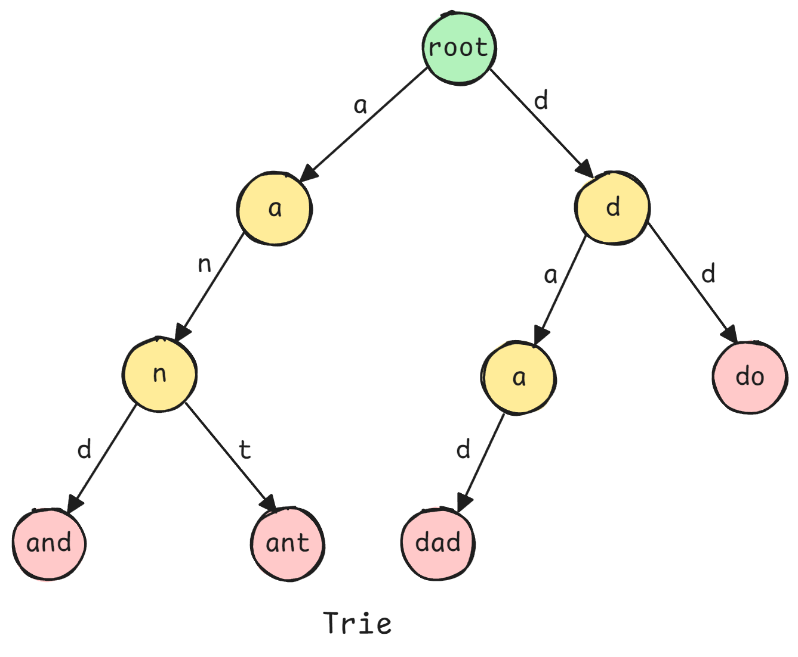

<h1 align="center"> Trie </h1>

A **Trie** (prefix tree or digital tree) is a tree-like data structure for storing and efficient retrieval of strings where each node represents a character. All descendants of a node share a common prefix (the path from root to that node).

**Tries enable**:

- $O(m)$ **Search/insert/delete** where $m$ = length of word (vs $O(n\;log\;n)$ for sorted list)
- Prefix-based searches (autocomplete, spell check)
- Space-efficient storage of strings with common prefixes
- Pattern matching in strings

> Tries trade space for time - common prefixes stored once, operations depend on word length not dictionary size.



## Python Implementation

**Basic Trie Implementation**:

```python
class TrieNode:
    """Node in a Trie."""
    
    def __init__(self):
        self.children = {}  # char -> TrieNode
        self.is_end_of_word = False
        # Optional: store data at leaf nodes
        self.data = None


class Trie:
    """
    Trie data structure for string storage and retrieval.
    
    Use cases: Autocomplete, spell checking, IP routing, dictionary
    """
    
    def __init__(self):
        self.root = TrieNode()
    
    def insert(self, word):
        """
        Insert word into trie.
        
        Time: O(m) where m = len(word)
        Space: O(m) in worst case (no shared prefixes)
        """
        node = self.root
        
        for char in word:
            if char not in node.children:
                node.children[char] = TrieNode()
            node = node.children[char]
        
        node.is_end_of_word = True
    
    def search(self, word):
        """
        Search for exact word match.
        
        Time: O(m), Space: O(1)
        """
        node = self.root
        
        for char in word:
            if char not in node.children:
                return False
            node = node.children[char]
        
        return node.is_end_of_word
    
    def starts_with(self, prefix):
        """
        Check if any word starts with prefix.
        
        Time: O(m), Space: O(1)
        """
        node = self.root
        
        for char in prefix:
            if char not in node.children:
                return False
            node = node.children[char]
        
        return True
    
    def delete(self, word):
        """
        Delete word from trie.
        
        Tricky: Need to remove nodes only if not part of other words.
        """
        def _delete(node, word, index):
            if index == len(word):
                # Reached end of word
                if not node.is_end_of_word:
                    return False  # Word doesn't exist
                
                node.is_end_of_word = False
                
                # Delete node if it has no children
                return len(node.children) == 0
            
            char = word[index]
            if char not in node.children:
                return False  # Word doesn't exist
            
            child = node.children[char]
            should_delete_child = _delete(child, word, index + 1)
            
            if should_delete_child:
                del node.children[char]
                # Delete current node if it's not end of another word
                # and has no other children
                return not node.is_end_of_word and len(node.children) == 0
            
            return False
        
        _delete(self.root, word, 0)
    
    # Time: O(m), Space: O(m) for recursion
```

**Advanced Trie Operations**:

```python
class TrieAdvanced:
    """Trie with additional operations."""
    
    def __init__(self):
        self.root = TrieNode()
    
    def autocomplete(self, prefix, max_results=10):
        """
        Return words that start with prefix.
        
        Two-phase: (1) Navigate to prefix, (2) DFS collect words
        """
        # Phase 1: Navigate to prefix node
        node = self.root
        for char in prefix:
            if char not in node.children:
                return []
            node = node.children[char]
        
        # Phase 2: DFS to collect all words from this node
        results = []
        
        def dfs(node, path):
            if len(results) >= max_results:
                return
            
            if node.is_end_of_word:
                results.append(prefix + path)
            
            for char, child in node.children.items():
                dfs(child, path + char)
        
        dfs(node, "")
        return results
    
    # Time: O(p + n) where p = len(prefix), n = results
    # Space: O(n) for results
    
    def longest_common_prefix(self):
        """
        Find longest common prefix of all words in trie.
        
        Strategy: Traverse down while only one child exists.
        """
        node = self.root
        prefix = []
        
        while len(node.children) == 1 and not node.is_end_of_word:
            char = next(iter(node.children))
            prefix.append(char)
            node = node.children[char]
        
        return ''.join(prefix)
    
    # Time: O(m) where m = length of LCP
    # Space: O(m)
    
    def count_words(self):
        """Count total number of words in trie."""
        def dfs(node):
            count = 1 if node.is_end_of_word else 0
            for child in node.children.values():
                count += dfs(child)
            return count
        
        return dfs(self.root)
    
    # Time: O(n) where n = total nodes
    # Space: O(h) where h = max depth
    
    def find_all_words(self):
        """Return all words stored in trie."""
        results = []
        
        def dfs(node, path):
            if node.is_end_of_word:
                results.append(''.join(path))
            
            for char, child in node.children.items():
                path.append(char)
                dfs(child, path)
                path.pop()
        
        dfs(self.root, [])
        return results
    
    # Time: O(n · m) where n = words, m = avg length
    # Space: O(n · m)
```

**Pattern Matching with Trie**:

```python
def word_search_with_wildcard(trie_root, pattern):
    """
    Search for pattern with '.' as wildcard (matches any char).
    
    Example: "c.t" matches "cat", "cot", "cut"
    """
    def dfs(node, index):
        if index == len(pattern):
            return node.is_end_of_word
        
        char = pattern[index]
        
        if char == '.':
            # Try all possible characters
            for child in node.children.values():
                if dfs(child, index + 1):
                    return True
            return False
        else:
            # Exact character match
            if char not in node.children:
                return False
            return dfs(node.children[char], index + 1)
    
    return dfs(trie_root, 0)

# Time: O(m · k) where m = len(pattern), k = branching factor
# Space: O(m) for recursion


def word_break(s, word_dict):
    """
    Check if string can be segmented into dictionary words.
    
    Example: s = "leetcode", dict = ["leet", "code"] → True
    
    Trie + DP approach for efficient solution.
    """
    # Build trie from dictionary
    trie = Trie()
    for word in word_dict:
        trie.insert(word)
    
    n = len(s)
    dp = [False] * (n + 1)
    dp[0] = True  # Empty string
    
    for i in range(1, n + 1):
        # Try all possible last words ending at position i
        node = trie.root
        for j in range(i - 1, -1, -1):
            char = s[j]
            if char not in node.children:
                break
            
            node = node.children[char]
            
            # Found valid word ending at i
            if node.is_end_of_word and dp[j]:
                dp[i] = True
                break
    
    return dp[n]

# Time: O(n² · m) where n = len(s), m = max word length
# Space: O(total chars in dictionary)
```

**Trie with Frequency Counting**:

```python
class TrieWithFrequency:
    """
    Trie that tracks word frequencies.
    
    Use case: Top-K frequent searches, autocomplete with ranking
    """
    
    class Node:
        def __init__(self):
            self.children = {}
            self.is_end = False
            self.frequency = 0  # How many times word inserted
    
    def __init__(self):
        self.root = self.Node()
    
    def insert(self, word):
        """Insert word and increment frequency."""
        node = self.root
        
        for char in word:
            if char not in node.children:
                node.children[char] = self.Node()
            node = node.children[char]
        
        node.is_end = True
        node.frequency += 1
    
    def get_top_k(self, prefix, k):
        """
        Get top k most frequent words with given prefix.
        
        Strategy: Navigate to prefix, then collect all words with frequencies,
        sort by frequency, return top k.
        """
        # Navigate to prefix
        node = self.root
        for char in prefix:
            if char not in node.children:
                return []
            node = node.children[char]
        
        # Collect all words with frequencies
        words = []
        
        def dfs(node, path):
            if node.is_end:
                words.append((prefix + path, node.frequency))
            
            for char, child in node.children.items():
                dfs(child, path + char)
        
        dfs(node, "")
        
        # Sort by frequency (descending) and return top k
        words.sort(key=lambda x: (-x[1], x[0]))  # Sort by freq desc, then lexically
        return [word for word, _ in words[:k]]
    
    # Time: O(p + n log n) where p = prefix length, n = matching words
    # Space: O(n)
```

**Space-Optimized Trie (Array-Based)**:

```python
class CompactTrie:
    """
    Array-based trie for lowercase letters only.
    
    More memory efficient when alphabet is small and known.
    """
    
    class Node:
        def __init__(self):
            self.children = [None] * 26  # a-z only
            self.is_end = False
    
    def __init__(self):
        self.root = self.Node()
    
    def _char_to_index(self, char):
        """Convert character to array index."""
        return ord(char) - ord('a')
    
    def insert(self, word):
        """Insert lowercase word."""
        node = self.root
        
        for char in word:
            idx = self._char_to_index(char)
            if node.children[idx] is None:
                node.children[idx] = self.Node()
            node = node.children[idx]
        
        node.is_end = True
    
    def search(self, word):
        """Search for word."""
        node = self.root
        
        for char in word:
            idx = self._char_to_index(char)
            if node.children[idx] is None:
                return False
            node = node.children[idx]
        
        return node.is_end
    
    # Time: O(m) for both operations
    # Space: 26 pointers per node (vs dict overhead)
```

## Complexity Analysis

| Operation | Time | Space | Notes |
|-----------|------|-------|-------|
| Insert | O(m) | O(m) worst | m = word length |
| Search | O(m) | O(1) | - |
| Prefix search | O(p) | O(1) | p = prefix length |
| Autocomplete | O(p + n) | O(n) | n = result count |
| Delete | O(m) | O(m) | Recursive space |
| Count words | O(N) | O(h) | N = nodes, h = height |

**Space Complexity Comparison**:
- **Hash set**: O(n · m) where n = words, m = avg length
- **Trie**: O(ALPHABET_SIZE · N · m) worst case, but shared prefixes reduce this
- **Practical**: Trie often more space-efficient for large dictionaries with common prefixes

**When Trie is Better than Hash**:
- Prefix-based queries (autocomplete)
- Sorted traversal needed
- Memory-efficient for common prefixes
- Pattern matching with wildcards

**When Hash is Better**:
- Only exact lookups needed
- Large alphabet size
- Short words with few common prefixes
- Simpler implementation


## Common Questions

1. "Implement autocomplete system"

   ```python
   class AutocompleteSystem:
       """
       Design autocomplete with hot ranking.
       
       Operations:
       - input(c): User types character c
       - If c == '#', save current sentence
       - Otherwise, return top 3 matching sentences
       """
       
       def __init__(self, sentences, times):
           self.trie = TrieWithFrequency()
           self.current = []
           
           # Initialize with historical data
           for sentence, freq in zip(sentences, times):
               for _ in range(freq):
                   self.trie.insert(sentence)
       
       def input(self, c):
           if c == '#':
               # Save sentence
               sentence = ''.join(self.current)
               self.trie.insert(sentence)
               self.current = []
               return []
           else:
               # Add to current search
               self.current.append(c)
               prefix = ''.join(self.current)
               return self.trie.get_top_k(prefix, 3)
   ```

2. "Find longest word in dictionary that can be built one character at a time"

   ```python
   def longest_word(words):
       """
       Find longest word where all prefixes are also words.
       
       Example: ["w","wo","wor","worl","world"] → "world"
       """
       trie = Trie()
       
       # Insert all words
       for word in words:
           trie.insert(word)
       
       longest = ""
       
       def dfs(node, path):
           nonlocal longest
           
           # Update longest if current path is valid word
           if node.is_end_of_word:
               if len(path) > len(longest) or \
                  (len(path) == len(longest) and path < longest):
                   longest = path
           
           # Only explore children if current is a word
           # (all prefixes must exist)
           if node.is_end_of_word or not path:  # Allow root
               for char, child in sorted(node.children.items()):
                   dfs(child, path + char)
       
       dfs(trie.root, "")
       return longest
   
   # Time: O(sum of word lengths)
   # Space: O(sum of word lengths)
   ```

3. "Replace words with shortest root from dictionary"

   ```python
   def replace_words(dictionary, sentence):
       """
       Replace words with shortest dictionary root.
       
       Example: dict = ["cat","bat","rat"], 
                sentence = "the cattle was rattled by the battery"
       Output: "the cat was rat by the bat"
       """
       trie = Trie()
       for root in dictionary:
           trie.insert(root)
       
       def find_root(word):
           """Find shortest root for word."""
           node = trie.root
           
           for i, char in enumerate(word):
               if char not in node.children:
                   return word  # No root found
               
               node = node.children[char]
               
               if node.is_end_of_word:
                   return word[:i + 1]  # Found shortest root
           
           return word  # Word itself is shortest
       
       words = sentence.split()
       return ' '.join(find_root(word) for word in words)
   
   # Time: O(sum of all word lengths)
   # Space: O(dictionary size)
   ```

4. "Implement phone directory with prefix search"

   ```python
   class PhoneDirectory:
       """
       Phone directory supporting prefix search.
       
       Operations:
       - add(name, number)
       - search(prefix) → all names starting with prefix
       """
       
       def __init__(self):
           self.name_trie = Trie()
           self.contacts = {}  # name -> number
       
       def add(self, name, number):
           """Add contact."""
           self.name_trie.insert(name.lower())
           self.contacts[name] = number
       
       def search(self, prefix):
           """Find all contacts with name starting with prefix."""
           prefix_lower = prefix.lower()
           names = self.name_trie.autocomplete(prefix_lower, max_results=10)
           
           # Return name-number pairs
           return [(name, self.contacts.get(name)) for name in names]
   ```

## Problem-Solving Patterns

1. **String matching with dictionary**: Build trie from dictionary, traverse input string
2. **Autocomplete**: Navigate to prefix, DFS to collect results
3. **Word segmentation**: Trie + DP for efficient checking
4. **Longest prefix**: Traverse trie while collecting common path
5. **Pattern matching**: DFS with wildcards

## Common Pitfalls
- Forgetting to mark `is_end_of_word`
- Not handling empty string case
- Memory leaks in deletion (not removing unnecessary nodes)
- Case sensitivity (normalize to lowercase if appropriate)
- Not considering alphabet size (array vs dict)

## Edge Cases
- Empty string
- Single character
- Prefix that doesn't exist
- Word that is prefix of another word
- Duplicate insertions
- Deletion of non-existent word

## Performance Considerations

- **Memory**: Trie can be memory-intensive (pointers per node)
- **Cache locality**: Poor compared to arrays (scattered nodes)
- **Alphabet size**: Large alphabets (Unicode) → use hash map children
- **Python overhead**: Dict-based children have overhead; consider array for small alphabets

## Modern Alternatives

- **Burst Trie**: Hybrid trie + array for better cache performance
- **HAT-trie**: Hash + Trie for space efficiency
- **LOUDS**: Succinct trie representation (academic)
- **For production NLP**: Often use hash maps with preprocessing rather than tries

---

**[Trie Questions Notebook](./Notebooks/Tries.ipynb)
