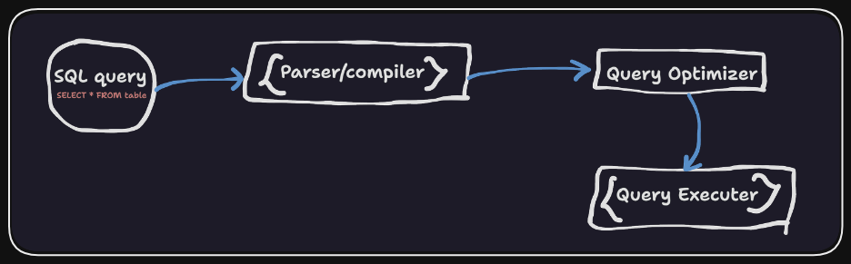

# SQL

SQL _Stands for Structured Query Language_. It is the standard language for interacting with relational databases. Here we are using `PostgreSQL` as the database engine.

> SQL is a _declarative language_, which means that you tell the database what you want to do, and it figures out how to perform the operation in the most efficient way.

Check out the Scripts folder for the SQL scripts. Notebook contains examples of working with Postgres Python client `psycopg2`.

## Basic terminology

1. **Data value** : A single unit of data. Each entry in a table represents a data value.

> Eg: `1`, `03/09/2016`, `A_1`, etc

2. **Record** : A collection of related data values. Each row in a table represents a record.

> Eg: `1, 03/09/2016, 1, A_1`, etc

3. **Field** : A single unit of information. Each column in a table represents a field.

4. **File** : A collection of related records. A table is a file.

## Overview of how SQL queries work



1. The user sends a query to the database.

2. The database parses the query and checks the syntax.

3. The database checks the query against the database schema to make sure the tables and columns exist.

4. The database determines the most efficient way to execute the query.

5. The database executes the query and returns the results.

> Whenever we run a SQL query, the database creates a new table from the existing table. The newly generated output is called **result set** (set of rows with column names and some meta data).

## Database schema

A schema in a database refers to the organization of data. Think of it as a blueprint of how the database is constructed. Schema represents all the tables and the relationships between those tables in a database.

> The formal definition of a database schema is a set of formulas (sentences) called integrity constraints imposed on a database.

To understand database schema better, let us consider the example from the `IMDB` dataset. The schema for the `IMDB` dataset is as follows:


## SQL Commands


**DDL (Data Definition Language)** : DDL statements are used to define the database structure or schema.

**DML (Data Manipulation Language)** : DML statements are used for managing data within schema objects.

**DCL (Data Control Language)** : DCL statements are used to control access to data in the database.

**TCL (Transaction Control Language)** : TCL statements are used to manage the changes made by DML statements.

## Syntax of SQL queries 

1. Show all available databases

```sql

-- In PSQL
\l
-- or
SELECT datname FROM pg_database;

-- In my SQL
SHOW DATABASES;
```

2. Connect to a database

```sql
--  In PSQL
\c DBNAME

-- In my SQL
USE DBNAME;
```
>  In most `PostgreSQL` client applications you would select the database when establishing the database connection, rather than using a separate SQL command to change the database context.

3. Show tables in a database

```sql
-- In PSQL
\dt

-- In my SQL
SHOW TABLES;
```

4. Creating a database

```sql
CREATE DATABASE imdb;
```

5. Show schema of a table

```sql
-- In PSQL
\d TABLENAME
-- for detailed schema
\d+ TABLENAME

-- In my SQL
DESCRIBE TABLENAME;
```

6. Selecting data from a table

```sql
-- Select all columns
SELECT * FROM TABLENAME;

-- Select specific columns
SELECT COLUMN1, COLUMN2 FROM TABLENAME;
```

7. Creating a table

```sql
CREATE TABLE TABLENAME (
    COLUMN1 DATATYPE,
    COLUMN2 DATATYPE,
    COLUMN3 DATATYPE
);
```


8. DML Commands

```sql
-- Inserting data into a table
INSERT INTO TABLENAME (COLUMN1, COLUMN2) VALUES (VALUE1, VALUE2), (VALUE3, VALUE4);

-- insert from another table using sub query
INSERT INTO phone_book2
SELECT *
FROM phone_book
WHERE phone_number = '1234567890';

-- Updating data in a table
UPDATE TABLENAME SET COLUMN1 = VALUE1, COLUMN2 = VALUE2 WHERE COLUMN3 = VALUE3;

-- Deleting data from a table
DELETE FROM TABLENAME WHERE COLUMN1 = VALUE1;
```

9. Limit in SQL

```sql
-- To get the first 10 rows of columns Column1 and Column2
SELECT Column1, Column2 FROM TABLENAME LIMIT 10;

-- To get the next 10 rows of columns Column1 and Column2 after the first 10 rows
SELECT Column1, Column2 FROM TABLENAME LIMIT 10 OFFSET 10;
```

10. Ordering in SQL (Sorting)

```sql
-- For ordering in ascending order
SELECT Column1, Column2 FROM TABLENAME ORDER BY Column1 ASC;

-- For ordering in descending order
SELECT Column1, Column2 FROM TABLENAME ORDER BY Column1 DESC;
```

> The output row order may not be the same as the order in which the rows are inserted into the database. It depends on query optimizer, database engine, and the indexes on the table.

11. Distinct in SQL

```sql
-- To get the unique values of a column
SELECT DISTINCT Column1 FROM TABLENAME;
```

12. Where in SQL

```sql
-- To get the rows where Column1 is equal to 1
SELECT * FROM TABLENAME WHERE Column1 = 1;

-- To get the rows where Column1 is between 1 and 10
SELECT * FROM TABLENAME WHERE Column1 BETWEEN 1 AND 10;

-- <> and != implies not equal to, = and != won't work for NULL values
SELECT column1, column2 FROM TABLENAME WHERE column2 IS NOT NULL;
```

13. Logical operators in SQL

```sql
-- AND
SELECT * FROM TABLENAME WHERE Column1 = 1 AND Column2 = 2;

-- OR
SELECT * FROM TABLENAME WHERE Column1 = 1 OR Column2 = 2;

-- NOT
SELECT * FROM TABLENAME WHERE NOT Column1 = 1;

-- BETWEEN - It is inclusive
-- low value should always be less than or equal to high value
SELECT * FROM TABLENAME WHERE Column1 BETWEEN 1 AND 10;

-- IN
SELECT column1 FROM TABLENAME WHERE Column1 IN (1, 2, 3);

-- LIKE
-- % is a wildcard character
-- _ is a single character wildcard

-- To get all the rows where Column1 starts with A
SELECT * FROM TABLENAME WHERE Column1 LIKE 'A%';

-- To get all the rows where Column1 contains A
SELECT * FROM TABLENAME WHERE Column1 LIKE '%A%';

-- To get all the rows where Column1 starts with A and ends with A and has 3 characters in between
SELECT * FROM TABLENAME WHERE Column1 LIKE 'A___A';
```

14. Aggregate functions in SQL (Count, Sum, Min, Max, Avg) - These functions ignore NULL values and return only one value

```sql
-- Count
SELECT COUNT(*) FROM TABLENAME;

-- Sum
SELECT SUM(Column1) FROM TABLENAME;

-- Min
SELECT MIN(Column1) FROM TABLENAME;

-- Max
SELECT MAX(Column1) FROM TABLENAME;

-- Avg
SELECT AVG(Column1) FROM TABLENAME;
```

15. Group by in SQL

```sql
-- To get the count of each unique value in Column1
SELECT column1, COUNT(column1) col1_count, FROM TABLENAME GROUP BY column1 ORDER BY col1_count;

-- col1_count is an alias for the column name COUNT(column1)
-- Null values are grouped together
```

16. Having in SQL

```sql
-- To get the count of each unique value in Column1 where the count is greater than 1
SELECT column1, COUNT(column1) col1_count, FROM TABLENAME GROUP BY column1 HAVING col1_count > 1 ORDER BY col1_count;

-- Having is often used with group by, when used without group by it is same as where

-- Where is applied on individual rows, while having is applied on groups and having is applied after grouping and where is used before grouping
```

17. Joins in SQL

```sql
-- Inner join
SELECT * FROM TABLENAME1 INNER JOIN TABLENAME2 ON TABLENAME1.Column1 = TABLENAME2.Column1;

-- Left join
SELECT * FROM TABLENAME1 LEFT JOIN TABLENAME2 ON TABLENAME1.Column1 = TABLENAME2.Column1;

-- Right join
SELECT * FROM TABLENAME1 RIGHT JOIN TABLENAME2 ON TABLENAME1.Column1 = TABLENAME2.Column1;

-- Full outer join
SELECT * FROM TABLENAME1 FULL OUTER JOIN TABLENAME2 ON TABLENAME1.Column1 = TABLENAME2.Column1;
```

> **Inner join** : Returns only the rows that match in both tables

> **Natural join** : Returns only the rows that match in both tables, but it doesn't require us to specify the columns to join on. It automatically matches the columns with the same name.


18. Sub queries in SQL

```sql
--
SELECT column1, column2 FROM TABLENAME WHERE some_id IN
(SELECT column3 FROM TABLENAME2 WHERE column4 = 'some_value');
```

> Consider writing sub queries like nested code blocks, the inner query is executed first and the result of the inner query is used in the outer query. Writing and reading sub-queries may be easier than complex joins.

19. Union in SQL

```sql
-- Union is used to combine the result of two or more select statements
SELECT column1 FROM TABLENAME1 UNION SELECT column1 FROM TABLENAME2;

-- Union all is used to combine the result of two or more select statements, including duplicate values
SELECT column1 FROM TABLENAME1 UNION ALL SELECT column1 FROM TABLENAME2;
```

20. Views in SQL

```sql
-- Views are virtual tables created from the result set of a query
CREATE VIEW view_name AS
SELECT column1, column2 FROM TABLENAME WHERE column1 = 'some_value';

-- To get the data from a view
SELECT * FROM view_name;

-- To delete a view
DROP VIEW view_name;
```

21. Indexes in SQL

```sql
-- Indexes are used to speed up the data retrieval process
-- Indexes are created on columns
-- Indexes are automatically created on primary key columns

-- To create an index
CREATE INDEX index_name ON TABLENAME (column1);

-- To delete an index
DROP INDEX index_name;
```

22. Data definition language (DDL) in SQL

```sql
-- To create a table
CREATE TABLE TABLENAME (
    column1 datatype,
    column2 datatype,
    column3 datatype
);

-- To delete a table
DROP TABLE TABLENAME;

-- To add a column to a table
ALTER TABLE TABLENAME ADD COLUMN column1 datatype;

-- To delete a column from a table
ALTER TABLE TABLENAME DROP COLUMN column1;

-- To change the datatype of a column
ALTER TABLE TABLENAME ALTER COLUMN column1 datatype;

-- To rename a column
ALTER TABLE TABLENAME RENAME COLUMN column1 TO column2;

-- To rename a table
ALTER TABLE TABLENAME RENAME TO TABLENAME2;
```

23. Data control language (DCL) in SQL

```sql
-- To grant privileges to a user
GRANT privilege_name ON TABLENAME TO user_name;

-- To revoke privileges from a user
REVOKE privilege_name ON TABLENAME FROM user_name;
```

**Data-types in SQL (PostgreSQL specific)**


**Constraints in SQL**

Constraints are used to specify rules for the data in a table. If there is any violation between the constraint and the data action, the action is aborted. Constraints can be column level or table level. 

The following constraints are commonly used in SQL:

- `NOT NULL` - Ensures that a column cannot have a NULL value

- `UNIQUE` - Ensures that all values in a column are different

- `PRIMARY KEY` - A combination of a NOT NULL and UNIQUE. Uniquely identifies each row in a table

- `FOREIGN KEY` - Prevents actions that would destroy links between tables

- `CHECK` - Ensures that the values in a column satisfies a specific condition

- `DEFAULT` - Sets a default value for a column if no value is specified

- `INDEX` - Used to create and retrieve data from the database very quickly

## Postgres with Python

Use the [`psycopg2`](https://www.psycopg.org/psycopg3/docs/) library to connect to the database and execute queries.

```python
import psycopg2

# Connect to the database
conn = psycopg2.connect("dbname=imdb user=postgres password=postgres")

# Create a cursor object
cur = conn.cursor()

# Execute a query
cur.execute("SELECT * FROM movies LIMIT 10")

# Fetch the results
results = cur.fetchall()

# Print the results
for row in results:
    print(row)

# Close the cursor
cur.close()

# Close the connection
conn.close()
```
