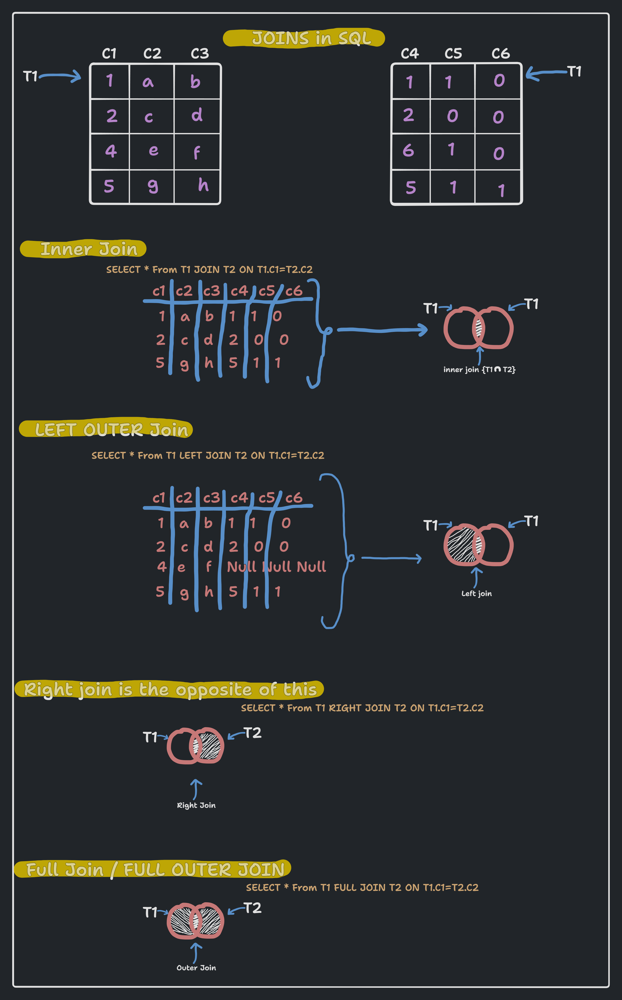

# SQL

SQL _Stands for Structured Query Language_. It is a language used to interact with databases. It is the standard language for interacting with relational databases. There are many different types of SQL databases, but the most popular are MySQL, SQLite, and PostgreSQL. I am going to use PostgreSQL, because it is open source and is widely used in production environments. But it doesn't really matter which one you use, because the syntax is almost same for all of them.

SQL is a _declarative language_, which means that you tell the database what you want to do, and it figures out how to perform the operation in the most efficient way.

## High level overview of how SQL queries work


1. The user sends a query to the database.

2. The database parses the query and checks the syntax.

3. The database checks the query against the database schema to make sure the tables and columns exist.

4. The database determines the most efficient way to execute the query.

5. The database executes the query and returns the results.

Whenever we run a SQL query, the database creates a new table from the existing table on which the query is run. The newly generated output is called _result set_ (set of rows with column names and some meta data).

## Database schema

A schema in a database refers to the organization of data as a blueprint of how the database is constructed. We can say that a schema represents all the tables and the relationships between those tables in a database.

> The formal definition of a database schema is a set of formulas (sentences) called integrity constraints imposed on a database.

Let us consider the example from the `IMDB` dataset. The schema for the `IMDB` dataset is as follows:


## SQL Commands

**DDL (Data Definition Language)**
DDL statements are used to define the database structure or schema. They are;

- CREATE - to create objects in the database
- ALTER - alters the structure of the database
- DROP - delete objects from the database
- TRUNCATE - remove all records from a table, including all spaces allocated for the records are removed
- RENAME - rename an object

**DML (Data Manipulation Language)**
DML statements are used for managing data within schema objects. They are;

- SELECT - retrieve data from the a database
- INSERT - insert data into a table
- UPDATE - updates existing data within a table
- DELETE - deletes all records from a table, the space for the records remain
- MERGE - update-insert operation (insert or update)
- CALL - call a PL/SQL or Java subprogram
- EXPLAIN PLAN - explain access path to data
- LOCK TABLE - control concurrency

**DCL (Data Control Language)**
DCL statements are used to control access to data in the database. They are;

- GRANT - gives user's access privileges to database
- REVOKE - withdraw access privileges given with the GRANT command

**TCL (Transaction Control Language)**
TCL statements are used to manage the changes made by DML statements. They are;

- COMMIT - save work done
- SAVEPOINT - identify a point in a transaction to which you can later roll back
- ROLLBACK - restore database to original since the last COMMIT
- SET TRANSACTION - Change transaction options like isolation level and what rollback segment to use

1. Creating a database

```sql
CREATE DATABASE imdb;
```

2. Connect to a database

```sql
--  In PSQL
\c DBNAME

-- In my SQL
USE DBNAME;
```

3. To clear the shell

```sql
\! cls
```

4. Show database

```sql

-- In PSQL
\l

-- In my SQL
SHOW DATABASES;
```

5. Show tables in a database

```sql
-- In PSQL
\dt

-- In my SQL
SHOW TABLES;
```

6. Show schema of a table

```sql
-- In PSQL
\d TABLENAME
-- for detailed schema
\d+ TABLENAME

-- In my SQL
DESCRIBE TABLENAME;
```

7. Selecting data from a table

```sql
-- Select all columns
SELECT * FROM TABLENAME;

-- Select specific columns
SELECT COLUMN1, COLUMN2 FROM TABLENAME;
```

8. Limit in SQL

```sql
-- To get the first 10 rows of columns Column1 and Column2
SELECT Column1, Column2 FROM TABLENAME LIMIT 10;

-- To get the next 10 rows of columns Column1 and Column2 after the first 10 rows
SELECT Column1, Column2 FROM TABLENAME LIMIT 10 OFFSET 10;
```

9. Ordering in SQL (Sorting)

```sql
-- For ordering in ascending order
SELECT Column1, Column2 FROM TABLENAME ORDER BY Column1 ASC;

-- For ordering in descending order
SELECT Column1, Column2 FROM TABLENAME ORDER BY Column1 DESC;
```

> The output row order may not be the same as the order in which the rows are inserted into the database. It depends on query optimizer, database engine, and the indexes on the table.

10. Distinct in SQL

```sql
-- To get the unique values of a column
SELECT DISTINCT Column1 FROM TABLENAME;
```

11. Where in SQL

```sql
-- To get the rows where Column1 is equal to 1
SELECT * FROM TABLENAME WHERE Column1 = 1;

-- To get the rows where Column1 is between 1 and 10
SELECT * FROM TABLENAME WHERE Column1 BETWEEN 1 AND 10;

-- <> and != implies not equal to, = and != won't work for NULL values
SELECT column1, column2 FROM TABLENAME WHERE column2 IS NOT NULL;
```

12. Logical operators in SQL

```sql
-- AND
SELECT * FROM TABLENAME WHERE Column1 = 1 AND Column2 = 2;

-- OR
SELECT * FROM TABLENAME WHERE Column1 = 1 OR Column2 = 2;

-- NOT
SELECT * FROM TABLENAME WHERE NOT Column1 = 1;

-- BETWEEN - It is inclusive
-- low value should always be less than or equal to high value
SELECT * FROM TABLENAME WHERE Column1 BETWEEN 1 AND 10;

-- IN
SELECT column1 FROM TABLENAME WHERE Column1 IN (1, 2, 3);

-- LIKE
-- % is a wildcard character
-- _ is a single character wildcard

-- To get all the rows where Column1 starts with A
SELECT * FROM TABLENAME WHERE Column1 LIKE 'A%';

-- To get all the rows where Column1 contains A
SELECT * FROM TABLENAME WHERE Column1 LIKE '%A%';

-- To get all the rows where Column1 starts with A and ends with A and has 3 characters in between
SELECT * FROM TABLENAME WHERE Column1 LIKE 'A___A';
```

13. Aggregate functions in SQL (Count, Sum, Min, Max, Avg) - These functions ignore NULL values and return only one value

```sql
-- Count
SELECT COUNT(*) FROM TABLENAME;

-- Sum
SELECT SUM(Column1) FROM TABLENAME;

-- Min
SELECT MIN(Column1) FROM TABLENAME;

-- Max
SELECT MAX(Column1) FROM TABLENAME;

-- Avg
SELECT AVG(Column1) FROM TABLENAME;
```

14. Group by in SQL

```sql
-- To get the count of each unique value in Column1
SELECT column1, COUNT(column1) col1_count, FROM TABLENAME GROUP BY column1 ORDER BY col1_count;

-- col1_count is an alias for the column name COUNT(column1)
-- Null values are grouped together
```

15. Having in SQL

```sql
-- To get the count of each unique value in Column1 where the count is greater than 1
SELECT column1, COUNT(column1) col1_count, FROM TABLENAME GROUP BY column1 HAVING col1_count > 1 ORDER BY col1_count;

-- Having is often used with group by, when used without group by it is same as where

-- Where is applied on individual rows, while having is applied on groups and having is applied after grouping and where is used before grouping
```

16. Joins in SQL

```sql
-- Inner join
SELECT * FROM TABLENAME1 INNER JOIN TABLENAME2 ON TABLENAME1.Column1 = TABLENAME2.Column1;

-- Left join
SELECT * FROM TABLENAME1 LEFT JOIN TABLENAME2 ON TABLENAME1.Column1 = TABLENAME2.Column1;

-- Right join
SELECT * FROM TABLENAME1 RIGHT JOIN TABLENAME2 ON TABLENAME1.Column1 = TABLENAME2.Column1;

-- Full outer join
SELECT * FROM TABLENAME1 FULL OUTER JOIN TABLENAME2 ON TABLENAME1.Column1 = TABLENAME2.Column1;
```

> **Inner join** : Returns only the rows that match in both tables

> **Natural join** : Returns only the rows that match in both tables, but it doesn't require us to specify the columns to join on. It automatically matches the columns with the same name.



17. Sub queries in SQL

```sql
--
SELECT column1, column2 FROM TABLENAME WHERE some_id IN
(SELECT column3 FROM TABLENAME2 WHERE column4 = 'some_value');
```

> Consider sub queries like nested code blocks, the inner query is executed first and the result of the inner query is used in the outer query. Writing and reading sub-queries may be easier than complex joins.
