<!-- 
    Author : Kannan Jayachandran
    File : Calculus.md
    Section : Mathematics for data science and machine learning
 -->

<h1 align="center"> Calculus </h1>

## Table of Contents

1. [Functions](#functions)
1. [Limits and Continuity](#limits-and-continuity)
1. [Derivatives](#derivatives)
1. [Partial Derivatives and Gradients](#partial-derivatives-and-gradients)
1. [Chain Rule and Backpropagation](#chain-rule-and-backpropagation)
1. [Integration Fundamentals](#integration-fundamentals)
1. [Optimization in Machine Learning](#optimization-in-machine-learning)
1. [Advanced Topics](#advanced-topics)
1. [Interview Questions](#interview-questions)

---

**Calculus** is the mathematical study of continuous change, providing the foundational tools for understanding optimization, gradient-based learning, and rate of change analysis in machine learning systems. It encompasses derivatives (measuring instantaneous rates of change) and integrals (measuring accumulation).

## Functions

A **function** $f$ is a quantity that relates two quantities to each other, for our purpose these quantities are inputs $x \in \R^D$ and targets (function values) $f(x)$. Thus a functions is a mathematical relationship that maps each input to exactly one output/target.

A function $f: X \rightarrow Y$ is a relation between two sets where:
- **Domain** ($X$): The set of all possible inputs
- **Range** ($Y$): The set of all possible outputs
- Each input maps to exactly **one** output

$f(x)$ or $y = f(x)$, where $x$ is the independent variable and $y$ is the dependent variable.

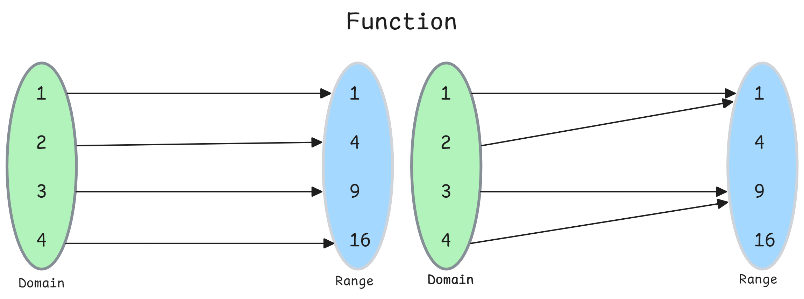

**Key Properties**

- **Deterministic**: Same input always produces same output
- **Many-to-one allowed**: Multiple inputs can map to same output (e.g., $f(x) = x^2$ maps both $2$ and $-2$ to $4$)
- **One-to-many forbidden**: A single input cannot produce multiple outputs

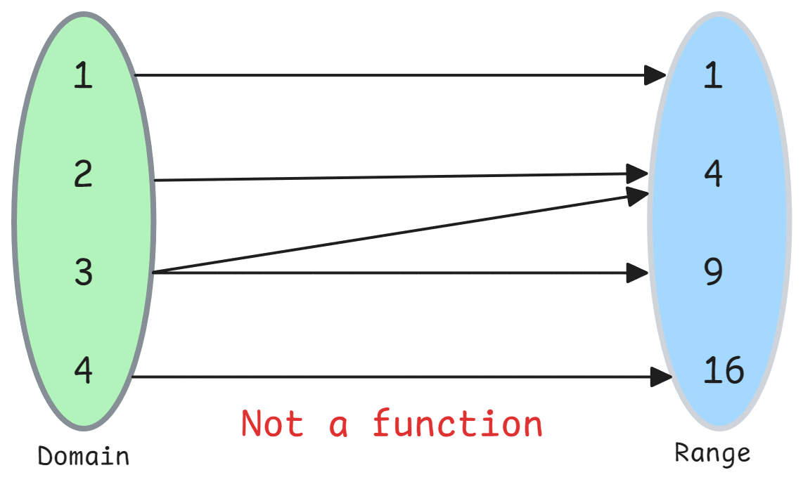

### Types of Functions

#### 1. Linear Functions

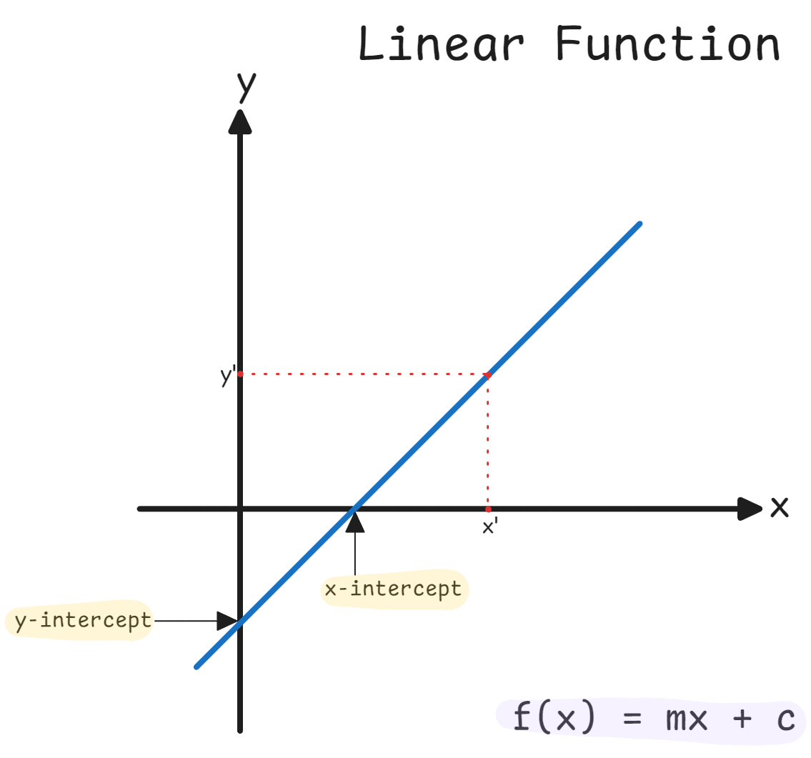

**Form**: $f(x) = mx + b$

Where:
- $m$ = slope (rate of change)
- $b$ = y-intercept (value when $x = 0$)

**Data Science Applications**:
- **Linear Regression**: Models relationship between features and target as $\hat{y} = w_0 + w_1x_1 + w_2x_2 + \ldots$
- **Logistic Regression**: Linear combination passed through sigmoid activation
- **Feature Engineering**: Linear transformations for normalization

**Example**

Predicting house prices where price increases linearly with square footage:
$$\text{Price} = 50000 + 200 \times \text{SquareFeet}$$

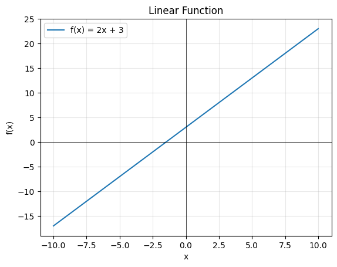

#### 2. Quadratic Functions

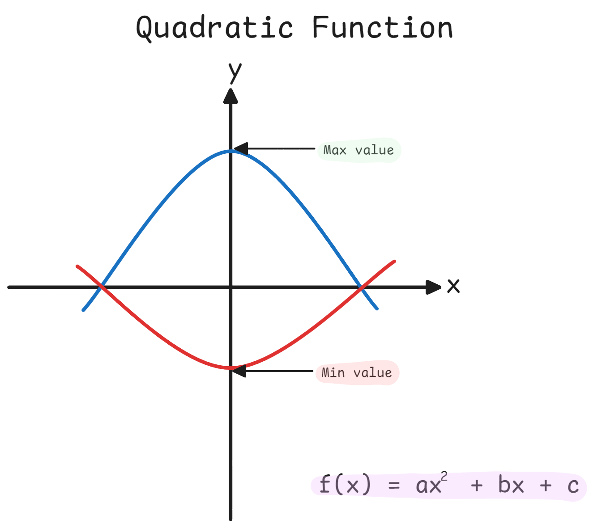

**Form**: $f(x) = ax^2 + bx + c$ where $a \neq 0$

**Properties**:
- Parabolic shape (U-shaped if $a > 0$, inverted if $a < 0$)
- Has minimum or maximum (vertex)
- **Discriminant** $\Delta = b^2 - 4ac$ determines number of real roots

**Data Science Applications**:
- **Polynomial Regression**: Capturing non-linear relationships
- **Loss Function Landscapes**: Convex quadratic approximations
- **Feature Engineering**: Polynomial features (e.g., $x^2$ terms)

**Example**

Modeling the trajectory of gradient descent in a simple quadratic loss function.

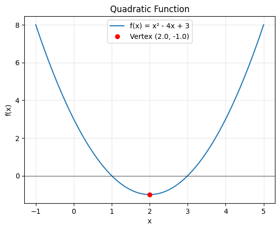

#### 3. Exponential Functions

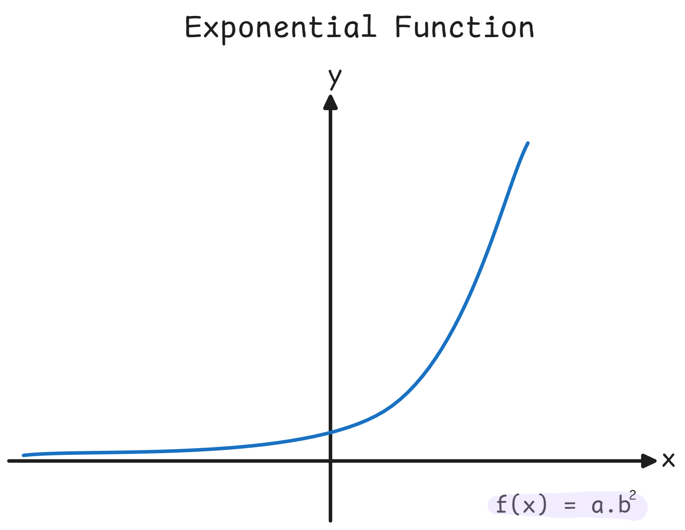

**Form**: $f(x) = ab^x$ or $f(x) = ae^{kx}$

Where:
- $a$ = initial value (y-intercept)
- $b$ or $e^k$ = growth/decay factor
- $e \approx 2.71828$ (Euler's number)

**Properties**:
- Rapid growth (if $b > 1$) or decay (if $0 < b < 1$)
- Never touches x-axis (horizontal asymptote at $y = 0$)
- Derivative of $e^x$ is itself: $\frac{d}{dx}e^x = e^x$

**Data Science Applications**:
- **Activation Functions**: Exponential in softmax and sigmoid
- **Exponential Moving Averages**: Time series smoothing
- **Learning Rate Decay**: $\alpha(t) = \alpha_0 e^{-kt}$
- **Probability Distributions**: Exponential and Poisson distributions

**Example** 

Exponential growth of model complexity vs. performance.

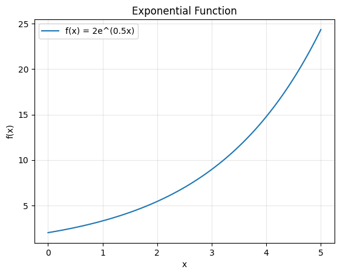

#### 4. Logarithmic Functions

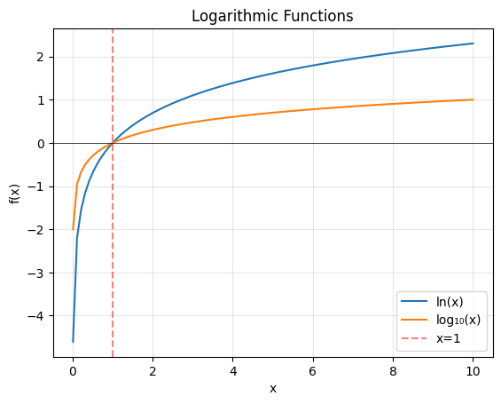

**Form**: $f(x) = \log_b(x)$ or $f(x) = \ln(x)$ (natural log, base $e$)

**Properties**:
- Inverse of exponential function
- Domain: $x > 0$ (undefined for non-positive values)
- Grows slowly compared to polynomial or exponential functions

**Data Science Applications**:
- **Log-Loss**: Cross-entropy loss function uses $-\log(p)$
- **Information Theory**: Entropy and KL divergence
- **Feature Transformation**: Log-scaling for skewed distributions
- **Regularization**: Log barriers in optimization

### Slope and Rate of Change

**Slope** measures the steepness of a line, representing how much the output changes for a unit change in input.

**Formula**: 
$$\text{Slope} = m = \frac{\Delta y}{\Delta x} = \frac{y_2 - y_1}{x_2 - x_1} = \frac{\text{rise}}{\text{run}}$$

**Interpretation**:
- $m > 0$: Function is increasing (positive correlation)
- $m < 0$: Function is decreasing (negative correlation)
- $m = 0$: Function is constant (horizontal line)

**Common Pitfalls**:

- **Extrapolation**: Functions behave unpredictably outside training domain
- **Numerical instability**: Exponentials can overflow; use log-space arithmetic when possible (e.g., `logsumexp`)

---

## Limits and Continuity

A **limit** describes the value a function approaches as the input approaches some value. It's the foundation for defining derivatives and understanding function behavior at boundaries.

> Think of it as asking: "**Where is the function heading**?" rather than "*Where is it right now?*"

**Formal Definition**

The limit of $f(x)$ as $x$ approaches $a$ is $L$, written as:

$$\lim_{x \to a} f(x) = L$$

> As $x$ gets arbitrarily close to $a$ (but not necessarily equal to $a$), $f(x)$ gets arbitrarily close to $L$.

**Epsilon-Delta Definition** (rigorous)

$$\forall \epsilon > 0, \exists \delta > 0 \text{ such that } 0 < |x - a| < \delta \implies |f(x) - L| < \epsilon$$

> You can make the output of the function ($f(x)$) as close as you want to the limit ($L$), by choosing an input ($x$) that is sufficiently close to $a$.

### Types of Limits

**1. One-Sided Limits**

- **Right-hand limit**: $\lim_{x \to a^+} f(x)$ (approaching from right)
- **Left-hand limit**: $\lim_{x \to a^-} f(x)$ (approaching from left)

A limit exists if and only if both one-sided limits exist and are equal:
$$\lim_{x \to a} f(x) = L \iff \lim_{x \to a^-} f(x) = \lim_{x \to a^+} f(x) = L$$

**2. Limits at Infinity**

Describes function behavior as $x \to \infty$ or $x \to -\infty$:
$$\lim_{x \to \infty} \frac{1}{x} = 0$$

**3. Infinite Limits**

When function grows without bound:
$$\lim_{x \to 0} \frac{1}{x^2} = \infty$$

### Evaluating Limits

**Direct Substitution**: If $f(x)$ is continuous at $a$, then $\lim_{x \to a} f(x) = f(a)$

### Continuity

A function $f(x)$ is **continuous** at $x = a$ if:

1. $f(a)$ is defined
2. $\lim_{x \to a} f(x)$ exists
3. $\lim_{x \to a} f(x) = f(a)$

**Intuitive meaning**: You can draw the function without lifting your pen.

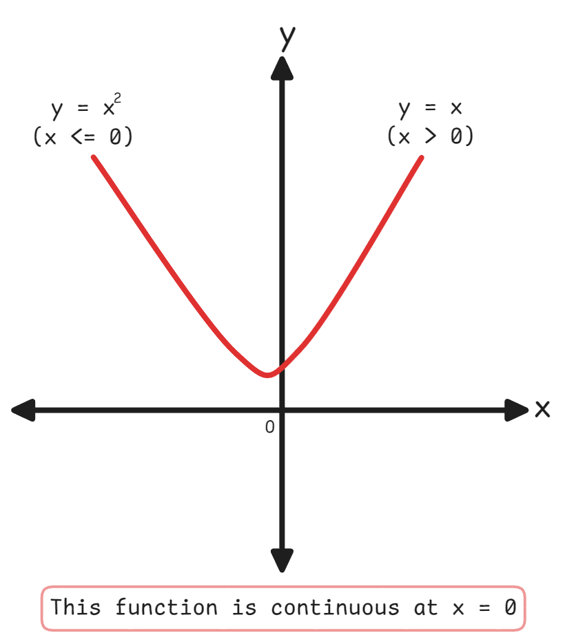

**Types of Discontinuities**:

1. **Removable (point)**: Limit exists but doesn't equal function value (hole in graph)
2. **Jump**: Left and right limits exist but are different
3. **Infinite**: Function approaches infinity at the point
4. **Essential**: Limit doesn't exist (oscillating behavior)

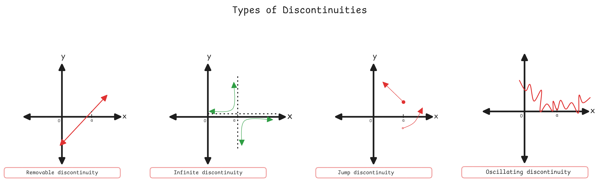

**Data Science Applications**:

1. **Convergence Analysis**: 
- Neural network training converges when loss function approaches a limit
- Checking if gradient descent reaches stable minimum

2. **Regularization and Smoothness**:
- Continuous loss functions ensure stable optimization
- Discontinuous functions cause optimization difficulties
3. **Feature Engineering**:
- Continuous features enable gradient-based methods
- Handling missing data to maintain continuity

**4. Model Assumptions**:
- Many ML algorithms assume continuous probability distributions
- Decision boundaries in classification should be smooth (continuous)

**Best Practices**:

- Check for discontinuities before applying gradient-based optimization
- Use smooth approximations for step functions (e.g., sigmoid instead of Heaviside)
- Verify convergence criteria in iterative algorithms using limit concepts

**Common Pitfalls**:

- **Assuming existence**: Not all limits exist (e.g., $\lim_{x \to 0} \sin(1/x)$)
- **Indeterminate forms**: $0/0$, $\infty/\infty$ require special techniques (L'Hôpital's rule)
- **Numerical precision**: Floating-point arithmetic can mask discontinuities
- **Ignoring domain**: Always check where function is defined before evaluating limits

---

## Derivatives

A **derivative** measures the **instantaneous rate of change** of a function at a specific point. It answers: "How fast is the function changing right now?"

Geometrically, it's the **slope of the tangent line** to the function's curve at a given point.

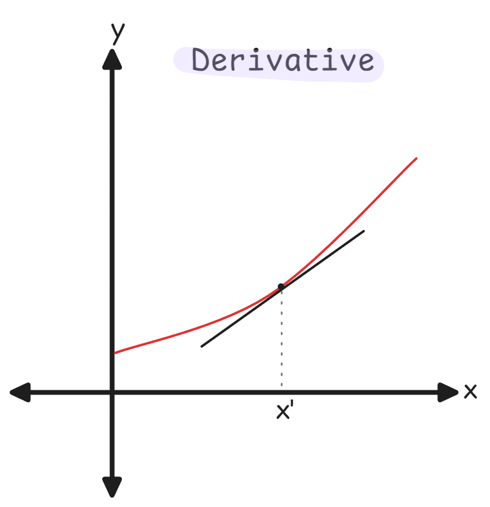

#### Formal Definition

The derivative of $f(x)$ at $x = a$ is:

$$f'(a) = \lim_{h \to 0} \frac{f(a + h) - f(a)}{h}$$

**Alternative notation**:
- $f'(x)$ (Lagrange notation)
- $\frac{df}{dx}$ (Leibniz notation)
- $\frac{dy}{dx}$ (if $y = f(x)$)
- $Df(x)$ (operator notation)

**Interpretation**: The derivative represents:
- **Rate of change**: How much output changes per unit input change
- **Slope**: Steepness of function at a point
- **Velocity**: If $f(t)$ is position, $f'(t)$ is velocity
- **Gradient direction**: Direction of steepest ascent

