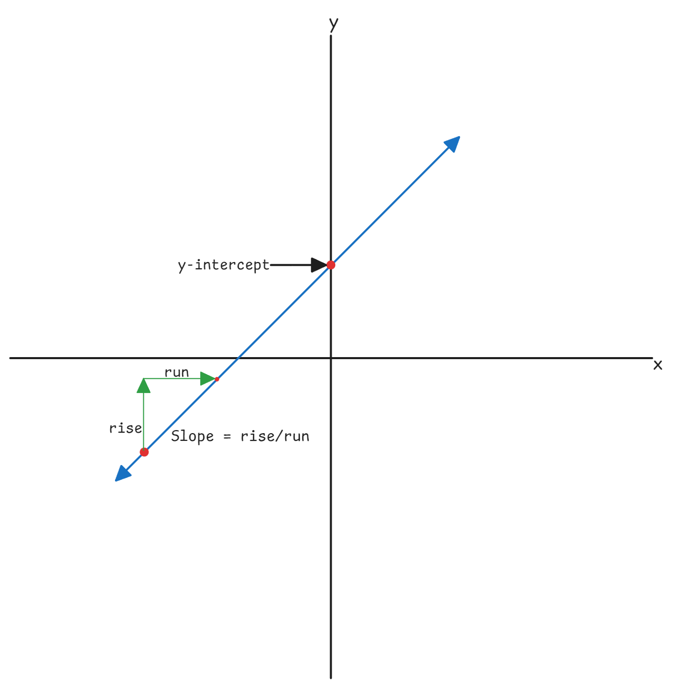
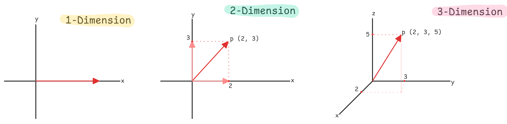
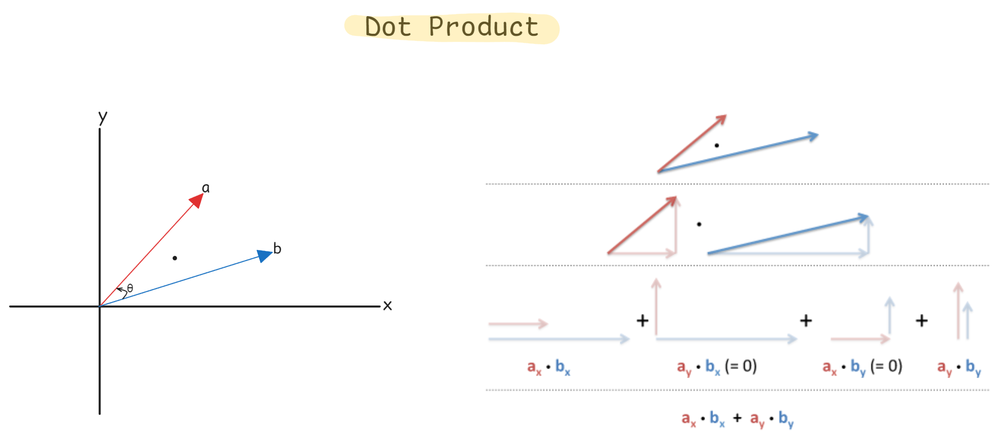
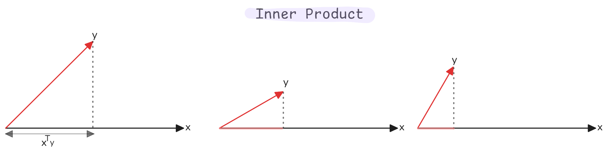
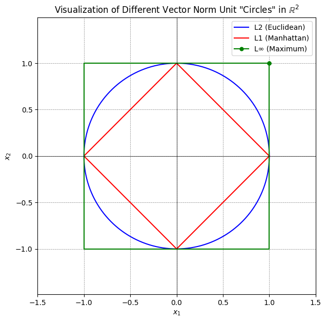
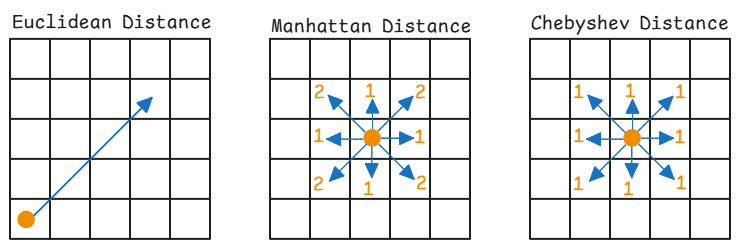
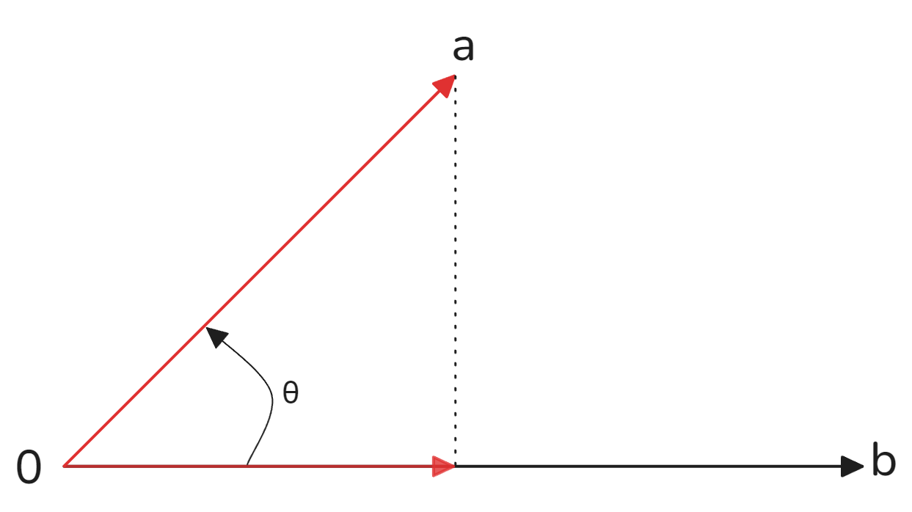
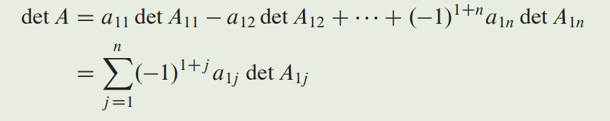

<!-- 
    Author : Kannan Jayachandran
    File : Linear_Algebra.md
    Section : Applied Mathematics for Data Science
 -->
 <h1 align="center"> Linear Algebra For Data Science and Machine Learning </h1>

## Table of Contents

1. **Foundation**
    - [Introduction](#introduction)
    - [Linear equations](#linear-equations)
    - [Systems of linear equations](#systems-of-linear-equations)
    - [Solutions and Existence Conditions](#solutions--existence-conditions)
    - [Solving Systems of Linear Equations](#solution-methods)

1. **Vectors**
    - [Vector](#vector)
    - [Row and Column Vectors](#row-and-column-vectors)
    - [Vector Dot Product](#vector-dot-product)
    - [Vector - Scalar Multiplication](#vector---scalar-multiplication)
    - [Inner product](#inner-product)
    - [Vector norm](#vector-norm)
    - [Projection of a vector](#projection-of-a-vector)
    - [Unit vector](#unit-vector)

1. **Matrices**
    - [Matrix](#matrix)
    - [Types of matrices](#types-of-matrices)
    - [Matrix addition and subtraction](#matrix-addition-and-subtraction)
    - [Matrix multiplication](#matrix-multiplication)
    - [Transpose of a matrix](#transpose-of-a-matrix)
    - [Inverse of a matrix](#inverse-of-a-matrix)
    - [Trace of a matrix](#trace-of-a-matrix)
    - [Determinant of a matrix](#determinant-of-a-matrix)
    - [Rank of a matrix](#rank-of-a-matrix)
    - [Matrix Decompositions](#matrix-decompositions)
    - [Eigendecomposition](#eigendecomposition)
    - [Eigenvectors and Eigenvalues](#eigenvectors-and-eigenvalues)
    - [Singular Value Decomposition (SVD)](#singular-value-decomposition-svd)
    - [Pseudo Inverse](#Pseudoinverse)

1. **Tensors**
    - [Tensor](#tensors)
    - [Tensor dot product](#tensor-dot-product)

1. **Geometric Interpretations**
    - [Line](#line)
    - [Distance of a point from a plane](#distance-of-a-point-from-a-plane)
    - [Slope](#slope)
    - [Intercept](#intercept)
    - [Circle](#circle)

1. **Notation Reference**
    - [Notations](#notations)

---

## Introduction

Linear algebra is the branch of mathematics that deals with linear equations and their representations in vector spaces, through matrices. By providing the language and computational tools for representing, manipulating, and understanding high-dimensional data, it act as the foundation of modern Data Science and Machine Learning.

> **Data Representation:** Every dataset is a matrix where rows are observations and columns are features


## Linear equations

A **linear equation** is an algebraic equation where each term is either a constant or the product of a constant and a single variable raised to the first power. The general form in $n$ variables is:

$$a_1x_1 + a_2x_2 + \cdots + a_nx_n + b = 0$$

Where:

- $x_1, x_2, \ldots, x_n$ are the **variables** (Unknowns)

- $a_1, a_2, \ldots, a_n$ are the **coefficients** (constants)

- $b$ is a **constant term** (intercept)

**Example**

$$2x_1 + 3x_2 - 4 = 0$$

This represents a line in 2D space where every point $(x_1, x_2)$ satisfying the equation lies on that line.



### Geometric Intuition

- **In 1D:** A linear equation represents a single point
- **In 2D:** A linear equation represents a line
- **In 3D:** A linear equation represents a plane
- **In $n$-D:** A linear equation represents a **hyperplane** (an $(n-1)$-dimensional subspace)

> **Linearity** means the relationship between variables is direct—no exponents, products, or nonlinear functions.

Linear equations forms the basis of:

- **Linear Regression**: Finding coefficients that minimize prediction errors.
- **Logistic Regression:** Decision boundaries are hyperplanes in feature space
- **Support Vector Machines:** Optimal separating hyperplanes
- **Neural Network Layers:** Each layer performs affine transformations: $y = Wx + b$

### Common Pitfall

Assuming real-world relationships are purely linear. Always validate this assumption through residual analysis.

---

## Systems of linear equations

A **system of linear equations** is a collection of two or more linear equations involving the same set of variables. With $m$ equations and $n$ variables:

$$
\begin{aligned}
a_{11}x_1 + a_{12}x_2 + \cdots + a_{1n}x_n &= b_1 \\
a_{21}x_1 + a_{22}x_2 + \cdots + a_{2n}x_n &= b_2 \\
&\vdots \\
a_{m1}x_1 + a_{m2}x_2 + \cdots + a_{mn}x_n &= b_m
\end{aligned}
$$

**Matrix Form:**

$$Ax = b$$

$$
A = \begin{bmatrix} 
a_{11} & a_{12} & \cdots & a_{1n} \\ 
a_{21} & a_{22} & \cdots & a_{2n} \\ 
\vdots & \vdots & \ddots & \vdots \\ 
a_{m1} & a_{m2} & \cdots & a_{mn} 
\end{bmatrix}, \quad
x = \begin{bmatrix} x_1 \\ x_2 \\ \vdots \\ x_n \end{bmatrix}, \quad
b = \begin{bmatrix} b_1 \\ b_2 \\ \vdots \\ b_m \end{bmatrix}
$$

Where:
- $A \in \mathbb{R}^{m \times n}$ is the **coefficient matrix**
- $x \in \mathbb{R}^{n}$ is the **variable vector**
- $b \in \mathbb{R}^{m}$ is the **constant vector**

### Geometric Interpretation

A system of linear equations represents the **intersection** of hyperplanes:
- In 2D: Lines intersecting at a point, overlapping, or being parallel
- In 3D: Planes intersecting along a line, at a point, or not at all
- In $n$-D: Hyperplanes intersecting in various configurations

### Solutions & Existence Conditions


A system of linear equations can exhibit three solution behaviors:

| Solution Type | Condition | Geometric Meaning | Example |
|--------------|-----------|-------------------|---------|
| **No Solution** | Inconsistent system | Hyperplanes are parallel (don't intersect) | Two parallel lines in 2D |
| **Unique Solution** | Non-singular, independent | Hyperplanes intersect at exactly one point | Two non-parallel lines meeting at a point |
| **Infinite Solutions** | Dependent system | Hyperplanes overlap (coincide along a subspace) | Two identical lines |

When analyzing any system $Ax = b$, ask:

1. **Existence:** Does at least one solution exist? (Is the system consistent?)
2. **Uniqueness:** If a solution exists, is it unique?

**Answers depend on the properties of matrix $A$:**

| Matrix Property | Rank Condition | Solution Behavior |
|----------------|----------------|-------------------|
| $\text{rank}(A) = n$ and $m = n$ | Full rank, square | Unique solution exists |
| $\text{rank}(A) < n$ | Rank deficient | Infinite solutions (underdetermined) |
| $\text{rank}(A) < m$ and inconsistent $b$ | Row dependent | No solution (overdetermined, inconsistent) |
| $\text{rank}(A) = \text{rank}([A \mid b])$ | Augmented matrix test | System is consistent |

### Regression as a System of Equations

In linear regression with $m$ data points and $n$ features, we have:
- $m$ equations (one per data point)
- $n$ unknowns (model coefficients)

**Three scenarios:**
1. **$m > n$:** Overdetermined system (more data than parameters) → Use least squares to find approximate solution
2. **$m = n$:** Exactly determined → May have unique solution (rare in practice)
3. **$m < n$:** Underdetermined system (more features than data) → Infinite solutions, need regularization

> Real-world data rarely satisfies $Ax = b$ exactly due to noise. We solve $\min_x \|Ax - b\|^2$ instead (least squares).

### Solution Methods

There are several methods to solve a system of linear equations, such as:

#### Classical Methods

1. **Substitution Method**
   - Express one variable in terms of others
   - Substitute into remaining equations
   - **Use case:** Small systems, theoretical derivations

2. **Elimination Method**
   - Add/subtract equations to eliminate variables
   - Reduce to simpler form systematically
   - **Use case:** Manual calculations, small systems

3. **Gaussian Elimination**
   - Transform $A$ to row echelon form using elementary row operations
   - Back-substitution to find solution
   - **Complexity:** $O(n^3)$ for $n \times n$ matrices
   - **Use case:** General-purpose solver

4. **Gauss-Jordan Elimination**
   - Extend Gaussian elimination to reduced row echelon form
   - Directly reads solution without back-substitution
   - **Use case:** Finding matrix inverses, theoretical analysis

5. **Matrix Inversion**
   - For square systems: $x = A^{-1}b$
   - **Critical limitation:** Only works for non-singular $A$ (when $\det(A) \neq 0$)
   - **Practical note:** Never actually compute $A^{-1}$ in production code—use decomposition methods

#### Modern Computational Approaches

**For Practical ML/Data Science Work:**

| Method | Best For | Complexity | Numerical Stability |
|--------|----------|------------|---------------------|
| **QR Decomposition** | Least squares, full-rank systems | $O(mn^2)$ | Excellent |
| **LU Decomposition** | Square systems, multiple right-hand sides | $O(n^3)$ | Good with pivoting |
| **Cholesky Decomposition** | Symmetric positive definite (e.g., $A^TA$) | $O(n^3/3)$ | Excellent |
| **SVD** | Rank-deficient, ill-conditioned systems | $O(mn^2)$ | Best |
| **Iterative Methods** (CG, GMRES) | Very large sparse systems | $O(kn^2)$ per iteration | Problem-dependent |

### Python Implementation

```py
import numpy as np
from scipy import linalg

# Generate example system: Ax = b
A = np.array([[3, 2], [1, 2]])
b = np.array([7, 5])
print(f"A:\n{A}\n\nB:\n{b}")

# Method 1: Direct solve (uses LU decomposition internally)
x_direct = np.linalg.solve(A, b)
print(f"\nDirect solution: {x_direct}")
# Output: [1. 2.]

# Method 2: Least squares (handles overdetermined systems)
A_over = np.array([[3, 2], [1, 2], [2, 1]])  # 3 equations, 2 unknowns
b_over = np.array([7, 5, 4])
x_lstsq = np.linalg.lstsq(A_over, b_over, rcond=None)[0]
print(f"\nLeast squares solution: {x_lstsq}")

# Method 3: Using QR decomposition explicitly
Q, R = np.linalg.qr(A)
x_qr = linalg.solve_triangular(R, Q.T @ b)
print(f"\nQR solution: {x_qr}")

# Method 4: Check solution validity
residual = np.linalg.norm(A @ x_direct - b)
print(f"\nResidual: {residual:.2e}")  # Should be ~0 for exact solution
```

### Best Practices and Pitfalls

- Use `np.linalg.solve()` for well-conditioned square systems
- Use `np.linalg.lstsq()` for overdetermined/underdetermined systems
- Check condition number: `np.linalg.cond(A)` (if > $10^{10}$, system is ill-conditioned)
- Always compute and inspect residuals to verify solution quality
- Computing $A^{-1}$ explicitly (`np.linalg.inv(A)`) and then multiplying is slower and numerically unstable
- Always check rank and consistency before assuming that a solution exists
- Never ignore warnings about singular or near-singular matrices

### Common Questions

1. *"Why shouldn't you compute matrix inverses in practice?"*  
   **Answer:** Inversion is numerically unstable (accumulation of inherent errors due to floating point arithmetic operations), slow ($O(n^3)$), and unnecessary. Decomposition methods (LU, QR, Cholesky) solve $Ax = b$ directly with better stability and performance.

2. *"What's the difference between `solve()` and `lstsq()`?"*  
   **Answer:** `solve()` requires a square, non-singular $A$ and finds exact solution. `lstsq()` works for any system (including overdetermined/underdetermined) and minimizes $\|Ax - b\|^2$.

3. *"How do you detect if a system has no solution?"*  
   **Answer:** Check if $\text{rank}([A \mid b]) > \text{rank}(A)$. If true, the system is inconsistent. In practice, compute SVD and examine singular values.

---

<!-- SECTION - II -->

## Vector

A **vector** is an ordered collection of numbers representing magnitude and direction in space. Vectors encode the fundamental structure of data in machine learning. Each data point is a vector, each feature is a dimension.



An $n$-dimensional vector is written as:

$$v = [v_1, v_2, v_3, \ldots, v_n] \quad \text{or} \quad v = \begin{bmatrix} v_1 \\ v_2 \\ \vdots \\ v_n \end{bmatrix}$$

**Example:** A data point with features $[\text{age}, \text{income}, \text{credit\_score}]$ is a 3D vector: $[35, 75000, 720]$.

### Geometric vs. Algebraic Perspectives

| Perspective | Interpretation | Example |
|-------------|----------------|---------|
| **Geometric** | Arrow from origin to point in space | Position vector pointing to $(3, 4)$ |
| **Algebraic** | Ordered list of coordinates | $[3, 4]$ as components |
| **Data Science** | Feature vector representing an observation | $[35, 75000, 720]$ as customer attributes |

**Note** In ML, we manipulate high-dimensional vectors where geometric visualization breaks down, but the algebraic operations remain identical.

### Row vs. Column Vectors

**Row vector** (1 row, $n$ columns):
$$v^T = [v_1, v_2, v_3, \ldots, v_n]$$

**Column vector** ($n$ rows, 1 column):
$$v = \begin{bmatrix} v_1 \\ v_2 \\ \vdots \\ v_n \end{bmatrix}$$

**Transpose** converts between them: $(v^T)^T = v$

**Convention in ML:**
- Feature vectors: typically column vectors
- Matrix rows: represent individual samples
- Output predictions: column vectors

### Vector Dot Product

The **dot product** (or **scalar product**) combines two vectors into a single scalar, measuring their alignment.

**Definition:**
$$a \cdot b = \sum_{i=1}^{n} a_i b_i = a_1b_1 + a_2b_2 + \cdots + a_nb_n$$

**Matrix notation:**
$$a \cdot b = a^T b = [a_1, a_2, \ldots, a_n] \begin{bmatrix} b_1 \\ b_2 \\ \vdots \\ b_n \end{bmatrix}$$

**Geometric interpretation:**
$$a \cdot b = \|a\| \|b\| \cos\theta$$

Where $\|a\|$ is the distance of the vector $a$ from origin and $\theta$ is the angle between vectors.



**Key Properties:**
- **Commutative:** $a \cdot b = b \cdot a$
- **Distributive:** $a \cdot (b + c) = a \cdot b + a \cdot c$
- **Orthogonality:** If $a \cdot b = 0$, then $a \perp b$ (perpendicular)
- **Parallel vectors:** $\cos\theta = \pm 1 \Rightarrow a \cdot b = \pm \|a\| \|b\|$

### Data Science Applications

**1. Similarity Measures:**
```python
import numpy as np

# Cosine similarity: measures angle between vectors
def cosine_similarity(a, b):
    return np.dot(a, b) / (np.linalg.norm(a) * np.linalg.norm(b))

# Example: Document similarity in NLP
doc1 = np.array([1, 2, 0, 1])  # Word frequency vector
doc2 = np.array([2, 1, 1, 0])
similarity = cosine_similarity(doc1, doc2)
print(f"Cosine similarity: {similarity:.3f}")
```

**2. Neural Network Forward Pass:**
```python
# Single neuron: weighted sum of inputs
inputs = np.array([1.5, 2.0, 3.0])
weights = np.array([0.4, -0.3, 0.8])
bias = 1.0

# Dot product computes neuron activation (before activation function)
activation = np.dot(weights, inputs) + bias
print(f"Neuron activation: {activation}")
```

**3. Projection and Filtering:**
```python
# Project data onto principal component
data_point = np.array([2, 3, 1])
principal_component = np.array([0.58, 0.58, 0.58])  # Unit vector

projection_length = np.dot(data_point, principal_component)
print(f"Projection onto PC1: {projection_length:.2f}")
```

### Common Pitfalls

❌ **Mistake:** Forgetting that dot product requires equal-length vectors  
✅ **Solution:** Always verify dimensions before computing

❌ **Mistake:** Confusing dot product (scalar) with element-wise multiplication (vector)  
✅ **Solution:** Use `np.dot()` for dot product, `*` for element-wise

❌ **Mistake:** Interpreting negative dot product as "negative similarity"  
✅ **Solution:** Negative means vectors point in opposite directions (angle > 90°)

### Vector-Scalar Multiplication

$$s \cdot v = [s \cdot v_1, s \cdot v_2, \ldots, s \cdot v_n]$$

**Geometric effect:** Scales the magnitude of the vector without changing direction (unless $s < 0$, which also reverses direction).

**Feature scaling**

```python
# Normalize features to [0, 1] range
X = np.array([100, 200, 150])  # Original features
X_scaled = X / X.max()  # Scalar division
print(X_scaled)  # Output: [0.5, 1.0, 0.75]
```

---

## Inner Products and Norms

### Inner product

The **inner product** generalizes the dot product to abstract vector spaces. In Euclidean space, it coincides with the dot product:

$$\langle x, y \rangle = x^T y = \sum_{i=1}^{n} x_i y_i$$



**Geometric meaning:** Length of projection of $y$ onto $x$ multiplied by length of $x$.

**Properties:**
- **Linearity:** $\langle ax + by, z \rangle = a\langle x, z \rangle + b\langle y, z \rangle$
- **Symmetry:** $\langle x, y \rangle = \langle y, x \rangle$
- **Positive definiteness:** $\langle x, x \rangle \geq 0$, equality iff $x = 0$

If $x$ and $y$ are centered (mean-subtracted from every elements) data vectors, their inner product is proportional to their covariance:
$$\text{Cov}(x, y) \propto \langle x, y \rangle$$

$$\text{Cov}(x, y) = \frac{1}{n-1} \langle x, y \rangle$$

Where:

$\frac{1}{n-1}$ is a constant scaling factor (for a fixed sample size $n$)

> Centering ensures mean of new vector $x$ is exactly zero

### Vector norm

A **norm** is a function $\| \cdot \|$ that assigns a non-negative length to each vector, satisfying:
1. $\|v\| \geq 0$, with equality iff $v = 0$ (positive definiteness)
2. $\|\alpha v\| = |\alpha| \|v\|$ (absolute homogeneity)
3. $\|u + v\| \leq \|u\| + \|v\|$ (triangle inequality)

#### $L^2$ Norm (Euclidean Norm)

$$\|v\|_2 = \sqrt{v_1^2 + v_2^2 + \cdots + v_n^2} = \sqrt{v^T v}$$

**Properties:**
- Measures straight-line distance from origin
- Rotationally invariant (same under coordinate rotation)
- Differentiable everywhere except at origin

**ML Uses:**
- **Ridge Regression:** Regularization term $\lambda \|w\|_2^2$ penalizes large weights
- **Gradient Norms:** Monitor $\|\nabla L\|_2$ during training to detect vanishing/exploding gradients
- **Distance Metrics:** Euclidean distance between data points

```python
import numpy as np

v = np.array([3, 4])
l2_norm = np.linalg.norm(v, ord=2)  # or just np.linalg.norm(v)
print(f"L2 norm: {l2_norm}")  # Output: 5.0
```

#### $L^1$ Norm (Manhattan Norm)

$$\|v\|_1 = |v_1| + |v_2| + \cdots + |v_n|$$

**Geometry:** Sum of distances along axes (like walking city blocks)

**ML Uses:**
- **Lasso Regression:** $\lambda \|w\|_1$ promotes sparse solutions (many weights = 0)
- **Feature Selection:** $L^1$ regularization automatically selects important features
- **Robust Statistics:** Less sensitive to outliers than $L^2$

```python
l1_norm = np.linalg.norm(v, ord=1)
print(f"L1 norm: {l1_norm}")  # Output: 7.0 (=3+4)
```

**Why sparsity?** $L^1$ penalty has non-differentiable kinks at zero, pushing weights exactly to zero during optimization.

#### $L^\infty$ Norm (Maximum Norm)

$$\|v\|_\infty = \max(|v_1|, |v_2|, \ldots, |v_n|)$$

**ML Uses:**
- **Adversarial Robustness:** $L^\infty$ constraints bound maximum feature perturbation
- **Chebyshev Distance:** Nearest neighbor search in high dimensions
- **Optimization:** Checking convergence with $\|\Delta x\|_\infty < \epsilon$

```python
linf_norm = np.linalg.norm(v, ord=np.inf)
print(f"L∞ norm: {linf_norm}")  # Output: 4.0 (=max(3,4))
```



Geometric interpretation of Euclidean, Manhattan and Chebyshev distance:



### Common Questions

**Q: When should you use $L^1$ vs $L^2$ regularization?**

| Criterion | $L^1$ (Lasso) | $L^2$ (Ridge) |
|-----------|---------------|---------------|
| **Sparsity** | Induces sparse solutions | All features retained |
| **Feature selection** | Implicit feature selection | No feature selection |
| **Multicollinearity** | Selects one from correlated group | Spreads weights across correlated features |
| **Computation** | Non-differentiable at zero (requires subgradient) | Differentiable everywhere |
| **Interpretation** | Easier (fewer features) | Harder (all features) |

**Q: Why is $L^2$ norm more common in neural networks?**  

**A:** $L^2$ is differentiable everywhere, making gradient-based optimization smoother. It also has nice geometric properties (rotationally invariant) and connection to Gaussian priors in Bayesian interpretation.

---

## Projections and Unit Vectors

The **projection** of vector $a$ onto vector $b$ is the component of $a$ in the direction of $b$.



**Scalar projection** (length along $b$):
$$\text{proj}_b(a) = \frac{a \cdot b}{\|b\|} = \|a\| \cos\theta$$

**Vector projection** (vector along $b$):
$$\text{proj}_b(a) = \frac{a \cdot b}{\|b\|^2} b = \frac{a \cdot b}{b \cdot b} b$$

**Orthogonal decomposition:**
$$a = \text{proj}_b(a) + (a - \text{proj}_b(a))$$

Where $(a - \text{proj}_b(a)) \perp b$ (orthogonal complement).

### ML Applications

**1. Principal Component Analysis (PCA):**

```python
import numpy as np

# Project data onto first principal component
data = np.array([[2, 3], [3, 4], [4, 5]])  # 3 samples, 2 features
pc1 = np.array([0.707, 0.707])  # First principal component (unit vector)

# Project each sample
projections = data @ pc1  # Matrix-vector multiplication
print("Projections onto PC1:", projections)

# Reconstruct from projection
reconstructed = np.outer(projections, pc1)
reconstruction_error = np.linalg.norm(data - reconstructed, ord='fro')
print(f"Reconstruction error: {reconstruction_error:.3f}")
```

**2. Gram-Schmidt Orthogonalization:**

```python
def gram_schmidt(vectors):
    """Orthogonalize a set of vectors."""
    orthogonal = []
    for v in vectors:
        # Subtract projections onto all previous orthogonal vectors
        for u in orthogonal:
            v = v - (np.dot(v, u) / np.dot(u, u)) * u
        orthogonal.append(v)
    return np.array(orthogonal)

# Example
v1 = np.array([1, 2, 0])
v2 = np.array([2, 1, 1])
orthogonal_vectors = gram_schmidt([v1, v2])
print("Orthogonal vectors:\n", orthogonal_vectors)
```

**3. Residuals in Regression:**

In linear regression $y = Xw + \epsilon$, the residuals are the orthogonal complement of the projection:
$$\text{residual} = y - \hat{y} = y - X(X^TX)^{-1}X^Ty$$

The term $X(X^TX)^{-1}X^T$ is the **projection matrix** onto the column space of $X$.

### Unit Vectors

A **unit vector** has magnitude 1 and indicates pure direction.

**Normalization:**
$$\hat{v} = \frac{v}{\|v\|}$$

**Standard basis vectors** in $\mathbb{R}^3$:
$$e_1 = \begin{bmatrix} 1 \\ 0 \\ 0 \end{bmatrix}, \quad e_2 = \begin{bmatrix} 0 \\ 1 \\ 0 \end{bmatrix}, \quad e_3 = \begin{bmatrix} 0 \\ 0 \\ 1 \end{bmatrix}$$

**Orthonormal vectors:** Unit vectors that are mutually orthogonal ($\hat{u}_i \cdot \hat{u}_j = \delta_{ij}$, where $\delta_{ij}$ is the Kronecker delta).

### ML Applications

**1. Feature Normalization:**
```python
# L2 normalization (unit vectors)
def normalize_l2(X):
    """Normalize rows to unit length."""
    norms = np.linalg.norm(X, axis=1, keepdims=True)
    return X / norms

# Example: Normalize word embeddings
embeddings = np.random.randn(5, 100)  # 5 words, 100-dim embeddings
normalized_embeddings = normalize_l2(embeddings)
print("Norms after normalization:", np.linalg.norm(normalized_embeddings, axis=1))
# Output: [1. 1. 1. 1. 1.]
```

**2. Gradient Descent with Normalized Gradients:**
```python
# Gradient clipping by norm
def clip_gradient(grad, max_norm=1.0):
    norm = np.linalg.norm(grad)
    if norm > max_norm:
        return max_norm * (grad / norm)  # Normalize and scale
    return grad
```

### Best Practices

- Normalize feature vectors before computing cosine similarity
- Check for zero vectors before normalization (causes division by zero)
- Use unit vectors to represent pure direction (e.g., principal components)

### Pitfalls

- $L^2$ normalization changes data distribution
- Normalization does not always helps; verify empirically
- Do not normalize targets in regression without inverse transform for prediction

---

<!-- SECTION - III -->

## Matrix

A **matrix** is a 2D array of numbers arranged in rows and columns, denoted as $A \in \mathbb{R}^{m \times n}$ with $m$ rows and $n$ columns.

$A = \begin{bmatrix} 
a_{11} & a_{12} & \cdots & a_{1n} \\ 
a_{21} & a_{22} & \cdots & a_{2n} \\ 
\vdots & \vdots & \ddots & \vdots \\ 
a_{m1} & a_{m2} & \cdots & a_{mn} 
\end{bmatrix}$

**In Data Science/ML:**
- **Rows:** Individual observations/samples
- **Columns:** Features/variables
- **Element $a_{ij}$:** Value of feature $j$ for sample $i$

Example dataset matrix:
$\text{Data} = \begin{bmatrix} 
\text{age}_1 & \text{income}_1 & \text{score}_1 \\ 
\text{age}_2 & \text{income}_2 & \text{score}_2 \\ 
\vdots & \vdots & \vdots
\end{bmatrix}$

### Square Matrix

$m = n$ (same number of rows and columns)

$A = \begin{bmatrix} 1 & 2 & 3 \\ 4 & 5 & 6 \\ 7 & 8 & 9 \end{bmatrix} \in \mathbb{R}^{3 \times 3}$

**Properties:**
- Can have eigenvalues and eigenvectors
- Can be invertible (if non-singular)
- Trace and determinant are defined

**ML Use:** Covariance matrices, Hessian matrices in optimization

### Diagonal Matrix

All off-diagonal elements are zero: $a_{ij} = 0$ for $i \neq j$

$D = \begin{bmatrix} d_1 & 0 & 0 \\ 0 & d_2 & 0 \\ 0 & 0 & d_3 \end{bmatrix}$

**Properties:**
- Easy to invert: $D^{-1} = \text{diag}(1/d_1, 1/d_2, 1/d_3)$ if all $d_i \neq 0$
- Eigenvalues are diagonal entries
- Matrix multiplication is $O(n)$ instead of $O(n^3)$

**ML Use:** 
- Scaling transformations
- Variance matrices in multivariate Gaussian
- Efficient eigen decomposition

```python
import numpy as np

# Create diagonal matrix
D = np.diag([2, 3, 5])
print("Diagonal matrix:\n", D)

# Fast inversion
D_inv = np.diag(1 / np.diag(D))
print("Inverse:\n", D_inv)

# Verify: D @ D_inv = I
print("D @ D_inv:\n", D @ D_inv)
```

### Identity Matrix

Diagonal matrix with all diagonal entries equal to 1

$I = \begin{bmatrix} 1 & 0 & 0 \\ 0 & 1 & 0 \\ 0 & 0 & 1 \end{bmatrix}$

**Properties:**
- Multiplicative identity: $AI = IA = A$ for any matrix $A$
- $I^{-1} = I$
- Eigenvalues all equal 1

**ML Use:** Regularization term $\lambda I$ in Ridge regression

### Triangular Matrices

**Upper Triangular:** All elements below diagonal are zero

$U = \begin{bmatrix} u_{11} & u_{12} & u_{13} \\ 0 & u_{22} & u_{23} \\ 0 & 0 & u_{33} \end{bmatrix}$

**Lower Triangular:** All elements above diagonal are zero

$L = \begin{bmatrix} l_{11} & 0 & 0 \\ l_{21} & l_{22} & 0 \\ l_{31} & l_{32} & l_{33} \end{bmatrix}$

**Properties:**
- Determinant = product of diagonal entries
- Efficient for solving linear systems (back/forward substitution)
- Product of triangular matrices is triangular

**ML Use:** LU decomposition, Cholesky decomposition

### Symmetric Matrix

$A = A^T$ (equals its transpose)

$A = \begin{bmatrix} 1 & 2 & 3 \\ 2 & 5 & 6 \\ 3 & 6 & 9 \end{bmatrix}$

**Properties:**
- All eigenvalues are real
- Eigenvectors corresponding to distinct eigenvalues are orthogonal
- Can be diagonalized by orthogonal matrix: $A = Q\Lambda Q^T$

**ML Use:**
- Covariance matrices
- Hessian matrices in optimization
- Kernel matrices in SVM

```python
# Covariance matrix is always symmetric
X = np.random.randn(100, 5)  # 100 samples, 5 features
cov = np.cov(X.T)  # 5x5 covariance matrix
print("Is symmetric?", np.allclose(cov, cov.T))  # True
```

### Skew-Symmetric Matrix

$A = -A^T$

$A = \begin{bmatrix} 0 & 2 & 3 \\ -2 & 0 & 6 \\ -3 & -6 & 0 \end{bmatrix}$

**Properties:**
- Diagonal entries must be zero
- Eigenvalues are purely imaginary or zero
- Determinant is zero if odd-dimensional

**ML Use:** Cross-product operations, rotation matrices in 3D transformations

### Orthogonal Matrix

$Q^T Q = QQ^T = I$ (transpose equals inverse)

$Q^T = Q^{-1}$

**Properties:**
- Columns form orthonormal basis (unit vectors, mutually perpendicular)
- Preserves lengths: $\|Qx\|_2 = \|x\|_2$
- Preserves angles and dot products
- $|\det(Q)| = 1$

**Example:** Rotation matrix in 2D
$R(\theta) = \begin{bmatrix} \cos\theta & -\sin\theta \\ \sin\theta & \cos\theta \end{bmatrix}$

**ML Use:**
- QR decomposition
- Whitening transformations
- Orthogonal initialization of neural network weights

```python
# Verify orthogonality
theta = np.pi / 4
R = np.array([[np.cos(theta), -np.sin(theta)],
              [np.sin(theta), np.cos(theta)]])

print("R^T @ R:\n", R.T @ R)  # Should be identity
print("det(R):", np.linalg.det(R))  # Should be 1
```

**Why it matters in ML:**
- Numerical stability in computations
- Prevents vanishing/exploding gradients in deep networks
- Efficient pseudo-inverse: $Q^+ = Q^T$

### Sparse Matrix

**Definition:** Most elements are zero

$A = \begin{bmatrix} 1 & 0 & 0 & 0 \\ 0 & 0 & 0 & 0 \\ 0 & 0 & 9 & 0 \\ 0 & 2 & 0 & 0 \end{bmatrix}$

**Sparsity Score:**
$\text{Sparsity} = \frac{\text{Number of zeros}}{\text{Total elements}}$

**Storage Format: Compressed Sparse Row (CSR)**

For efficient storage and computation:
- **Values:** Array of non-zero values
- **Column indices:** Column index for each non-zero value
- **Row pointers:** Indices where each row starts

**Example CSR representation:**
```python
from scipy.sparse import csr_matrix

# Dense matrix
dense = np.array([[1, 0, 0],
                  [0, 0, 2],
                  [0, 3, 0]])

# Convert to sparse
sparse = csr_matrix(dense)
print("Sparse representation:")
print("Data:", sparse.data)          # [1, 2, 3]
print("Indices:", sparse.indices)    # [0, 2, 1]
print("Indptr:", sparse.indptr)      # [0, 1, 2, 3]

# Memory comparison
print(f"Dense size: {dense.nbytes} bytes")
print(f"Sparse size: {sparse.data.nbytes + sparse.indices.nbytes + sparse.indptr.nbytes} bytes")
```

**ML Applications:**

1. **Text Data (TF-IDF matrices):**
```python
from sklearn.feature_extraction.text import TfidfVectorizer

documents = ["machine learning is great", "deep learning is powerful"]
vectorizer = TfidfVectorizer()
X = vectorizer.fit_transform(documents)  # Returns sparse matrix
print("Sparsity:", 1 - X.nnz / (X.shape[0] * X.shape[1]))
```

2. **Recommendation Systems:**
```python
# User-item interaction matrix (mostly empty)
# users x items, where 0 = no interaction
interactions = csr_matrix((100000, 50000))  # 5 billion potential entries
# Only store the few thousand actual interactions
```

3. **Graph Neural Networks:**
```python
# Adjacency matrix for sparse graphs
# Most nodes are not connected
adjacency = csr_matrix((num_nodes, num_nodes))
```

**Best Practices:**

✅ **Do:**
- Use sparse formats for matrices with >80% zeros
- Choose CSR for row operations, CSC for column operations
- Use sparse-aware libraries (`scipy.sparse`, `sklearn`)

❌ **Don't:**
- Convert sparse to dense for operations (memory explosion)
- Use dense matrix operations on sparse data
- Store large sparse matrices in dense format


### Matrix Properties Summary

| Type | Key Property | ML Application | Example |
|------|--------------|----------------|---------|
| **Diagonal** | $a_{ij} = 0$ if $i \neq j$ | Feature scaling | $\text{diag}(\sigma_1, \ldots, \sigma_n)$ |
| **Symmetric** | $A = A^T$ | Covariance, Hessian | $\Sigma = X^TX$ |
| **Orthogonal** | $Q^TQ = I$ | Rotations, PCA | Rotation matrices |
| **Positive Definite** | $x^TAx > 0$ for all $x \neq 0$ | Convex optimization | Covariance matrices |
| **Sparse** | Most entries zero | Text, graphs | TF-IDF, adjacency |
| **Rank Deficient** | $\text{rank}(A) < \min(m,n)$ | Multicollinearity | Linearly dependent features |


# END
<!-- Edited -->


## Matrix 

A matrix is a 2D array of numbers, organized into rows and columns. A matrix with $m$ rows and $n$ columns is said to have the dimension $m×n$.

## Types of matrices

- **Square matrix** : A matrix that has the same number of rows and columns. For example; 

$$X = \begin{bmatrix} 1 & 2 & 3 \\ 4 & 5 & 6 \\ 7 & 8 & 9 \end{bmatrix}$$

- **Diagonal matrix** : A square matrix where all elements outside the main diagonal are zero. For example: 

$$X = \begin{bmatrix} 1 & 0 & 0 \\ 0 & 5 & 0 \\ 0 & 0 & 9 \end{bmatrix}$$

- **Identity matrix** :A diagonal matrix where all the elements on the main diagonal are ones. For example:

$$X = \begin{bmatrix} 1 & 0 & 0 \\ 0 & 1 & 0 \\ 0 & 0 & 1 \end{bmatrix}$$

- **Upper triangular matrix** : A square matrix where all elements below the main diagonal are zero. For example:

$$X = \begin{bmatrix} 1 & 2 & 3 \\ 0 & 5 & 6 \\ 0 & 0 & 9 \end{bmatrix}$$

- **Symmetric matrix** : A square matrix that is equal to its transpose, (i.e. $X = X^T$) For example:

$$X = \begin{bmatrix} 1 & 2 & 3 \\ 2 & 5 & 6 \\ 3 & 6 & 9 \end{bmatrix}$$

- **Skew-symmetric matrix** : A square matrix that is equal to the negative of its transpose, (i.e. $X = -X^T$) For example: 

$$X = \begin{bmatrix} 0 & 2 & 3 \\ -2 & 0 & 6 \\ -3 & -6 & 0 \end{bmatrix}$$

- **Orthogonal matrix** : A square matrix whose rows and columns are orthonormal unit vectors. Mathematically, $Q^T \cdot Q = I$, where $I$ is the identity matrix. In other words a matrix is orthogonal if its transpose is equal to its inverse, i.e., $Q^T = Q^{-1}$. Orthogonal matrices preserves vector length and angle during transformations. For example:

$$Q = \begin{bmatrix} 1 & 0 & 0 \\ 0 & 1 & 0 \\ 0 & 0 & 1 \end{bmatrix}$$

- **Sparse matrix** : A matrix in which most of the elements are zero. Large sparse matrices are common, especially in applied machine learning, such as in natural language processing and recommendation systems. Working with sparse matrices as if they were dense can be computationally expensive due to memory and processing requirements. Significant performance improvements can be achieved by using specialized data structures and operations designed to efficiently handle sparse matrices.

Special data structures are often used to represent sparse matrices more efficiently, like:
 
- **Compressed Sparse Row** :  In this representation, the sparse matrix is stored using three one-dimensional arrays:

    - `Values` : An array of non-zero values in the matrix.

    - `Row offsets` : Indicates where each row starts and end in the `Values` array.

    - `Column indices` : Specifies the column position of each non-zero value in the matrix.

CSR is commonly used in machine learning because it allows efficient row slicing and matrix-vector multiplication.


$$X = \begin{bmatrix} 1 & 0 & 0 \\ 0 & 0 & 0 \\ 0 & 0 & 9 \end{bmatrix}$$

> A matrix with a high proportion of non-zero elements is referred to as a dense matrix. The **sparsity score** of a matrix is the ratio of the number of zero elements to the total number of elements in the matrix:

$$\text{Sparsity score} = \frac{\text{No. of zero elements}}{\text{Total no. of elements}}$$

## Matrix addition and subtraction

Two matrices with same dimensions can be added or subtracted together to create a new third matrix. The addition or subtraction of two matrices is done element-wise. For example:

$$X = \begin{bmatrix} 1 & 2 \\ 3 & 4 \end{bmatrix} \;\; Y = \begin{bmatrix} 5 & 6 \\ 7 & 8 \end{bmatrix}$$

$$X + Y = \begin{bmatrix} 1+5 & 2+6 \\ 3+7 & 4+8 \end{bmatrix} = \begin{bmatrix} 6 & 8 \\ 10 & 12 \end{bmatrix}$$

$$X - Y = \begin{bmatrix} 1-5 & 2-6 \\ 3-7 & 4-8 \end{bmatrix} = \begin{bmatrix} -4 & -4 \\ -4 & -4 \end{bmatrix}$$

## Matrix multiplication

Two matrices with same dimensions can be multiplied together, and this is often called element-wise matrix multiplication or the `Hadamard product`. It is not the typical operation meant when referring to matrix multiplication. It is denoted as $C = A \circ B$ and is given by:

$$C = \begin{bmatrix} a_{11} & a_{12} \\ a_{21} & a_{22} \end{bmatrix} \circ \begin{bmatrix} b_{11} & b_{12} \\ b_{21} & b_{22} \end{bmatrix} = \begin{bmatrix} a_{11}b_{11} & a_{12}b_{12} \\ a_{21}b_{21} & a_{22}b_{22} \end{bmatrix}$$

The **Matrix dot product** or **Matrix multiplication** is more complex than the Hadamard product and involves specific rules regarding dimensions. For two matrices to be multiplied, the number of `columns in the first matrix` ($m$) must equal the number of `rows in the second matrix` ($n$). It is denoted as $C = A \cdot B$ and is given by:

$$A = \begin{bmatrix} a_{11} & a_{12}  & a_{13} \\ a_{21} & a_{22} & a_{23} \\ a_{31} & a_{32} & a_{33} \end{bmatrix} \cdot B = \begin{bmatrix} b_{11} & b_{12} \\ b_{21} & b_{22} \\ b_{31} & b_{32}  \end{bmatrix} \rightarrow C = \begin{bmatrix} c_{11} & c_{12} \\ c_{21} & c_{22} \\ c_{31} & c_{32} \end{bmatrix}$$

Where:

- $A$ is an $m X n$ matrix,

- $B$ is an $p X q$ matrix,

- $C$ is an $m X q$ matrix

In order to obtain the values of the resulting matrix $C$, we multiply each element of the row of matrix $A$ by the corresponding element of the column of matrix $B$ and sum the results. For example:

$$c_{11} = a_{11}b_{11} + a_{12}b_{21} + a_{13}b_{31}$$

$$c_{12} = a_{11}b_{12} + a_{12}b_{22} + a_{13}b_{32}$$

$$c_{21} = a_{21}b_{11} + a_{22}b_{21} + a_{23}b_{31}$$

$$c_{22} = a_{21}b_{12} + a_{22}b_{22} + a_{23}b_{32}$$

$$c_{31} = a_{31}b_{11} + a_{32}b_{21} + a_{33}b_{31}$$

$$c_{32} = a_{31}b_{12} + a_{32}b_{22} + a_{33}b_{32}$$

## Transpose of a matrix

The **transpose** of a matrix is a new matrix formed by swapping the rows and columns of the original matrix. It is denoted by $X^T$ and is represented by:

$$X = \begin{bmatrix} a & b & c \\ d & e & f \end{bmatrix} \implies X^T = \begin{bmatrix} a & d \\ b & e \\ c & f \end{bmatrix}$$

> An invisible line can be drawn through the matrix from top left to bottom right on which the matrix can be flipped to give the transpose.

## Inverse of a matrix

The **inverse** of a matrix is a matrix that, when multiplied by the original matrix, results in the identity matrix. It is denoted by $X^{-1}$ and is given by:

$$ X^{-1} = \frac{1}{ad-bc}\begin{bmatrix} d & -b \\ -c & a \end{bmatrix}$$

Where:

- $X = \begin{bmatrix} a & b \\ c & d \end{bmatrix}$ is a $2 X 2$ matrix.

- A square matrix that is not invertible is called a **singular matrix**.

> **Whatever A does, $A^-1$ undoes**. :- _Introduction to Linear Algebra, Fifth Edition, 2016_)

> *$A^-1$ is primarily useful as a theoretical tool. In practice, we rarely compute the inverse of a matrix directly, as it is computationally expensive. Instead, we use matrix decomposition techniques like LU decomposition, QR decomposition, or Singular Value Decomposition (SVD) to solve systems of linear equations. :- **Deep Learning 2016*** 

## Trace of a matrix

The trace of a matrix is the sum of the elements on the main diagonal (top-left to bottom-right). It is denoted by $tr(X)$ and is calculated as:

$$tr(X) = a + d$$

Where:

- $X = \begin{bmatrix} a & b \\ c & d \end{bmatrix}$ is a $2 X 2$ matrix.

## Determinant of a matrix

The **determinant** of a matrix is a scalar value that represents how much the matrix scales the volume (or area) of the space it transforms (represented by the linear transformation). It is the product of the eigenvalues of the matrix (This property is crucial when we are dealing with larger matrices, with known eigenvalues). The determinant is denoted by $det(X) \;or \;|X|$ and for a $2X2$ matrix it is calculated as:

$$det(X) = ad-bc$$

Where:

- $X = \begin{bmatrix} a & b \\ c & d \end{bmatrix}$ is a $2 X 2$ matrix.

For a $3X3$ matrix, the determinant is calculated as:

$$det(X) = a(ei - fh) - b(di - fg) + c(dh - eg)$$

Where:

- $X = \begin{bmatrix} a & b & c \\ d & e & f \\ g & h & i \end{bmatrix}$ is a $3 X 3$ matrix.


>General formula

- If the determinant of a matrix is zero, it means that the matrix does not have an inverse.

### Intuition Behind the Determinant

The determinant is a scalar that tells us how much a matrix scales the volume (or area) spanned by its column vectors. In two dimensions, this is the area of the parallelogram formed by the column vectors (volume of the parallelepiped formed by the column vectors in 3D). 


- A determinant of 1 means the matrix preserves the volume or area without changing its size. 

- A determinant greater than 1 means the matrix expands the volume or area.

- A determinant between 0 and 1 indicates that the matrix shrinks the volume or area

- A negative determinant indicates the matrix reflects the space, flipping its orientation, in addition to scaling.

- If the determinant is zero, the matrix does not have an inverse. This happens because the rows or columns of the matrix are linearly dependent, meaning they lie along the same line or plane. In geometric terms, the matrix "squishes" (compress) the space into a lower dimension. For linear transformations, this implies that the transformation is not one-to-one, making the inverse either non-unique or nonexistent.

## Rank of a matrix

The rank of a matrix is the maximum number of linearly **independent** rows or columns in the matrix. It is denoted by $rank(X)$. The rank can be determined by transforming the matrix into its row echelon form or reduced row echelon form and counting the number of non-zero rows. Matrix decomposition techniques, such as Singular Value Decomposition (SVD), are also used to find the rank of a matrix.

### Intuition Behind the Rank of a Matrix

The rank of a matrix represents the number of dimensions spanned by its column vectors, or equivalently, the number of independent directions in the space.

- Rank 0: All the vectors span a single point, representing zero dimensions.

- Rank 1: The vectors span a line, representing one dimension.

- Rank 2: The vectors span a plane, representing two dimensions.

- Rank 3: The vectors span a volume, representing three dimensions.

## Matrix Decompositions

**Matrix decompositions** are methods that break down a matrix into constituent parts, making it easier to perform complex matrix operations with greater numerical stability on limited precision computers. These techniques do not compress the matrix; instead, they decompose it into its components. Matrix decompositions are also known as **matrix factorization techniques**. Two commonly used decompositions are:

### LU Decomposition

LU decomposition applies to square matrices, decomposing a matrix into a Lower triangular matrix $L$ and an Upper triangular matrix $U$. This decomposition can be written as:

$$A = L \cdot U \;or\; A = LU$$

Where:

- $A$ is the original square matrix,

- $L$ is the lower triangular matrix,

- $U$ is the upper triangular matrix.

LU decomposition is typically found through iterative numerical methods and may fail if the matrix cannot be decomposed directly. In practice, a variation called **LUP decomposition** (LU decomposition with partial pivoting) is often used to improve stability and robustness. In LUP decomposition, rows in the original matrix are reordered to make the decomposition feasible, and an additional $P$ matrix is included to capture this row reordering ($P$ matrix specifies a way to return to the original order). Unlike standard LU decomposition, LUP decomposition permits row exchanges. Thus we have:

$$A = L \cdot U \cdot P$$

Where:

- $P$ is the permutation matrix.

### QR Decomposition

The **QR decomposition** applies to $m X n$ matrices (not necessarily square) and decomposes a matrix into the product of an orthogonal matrix $Q$ of size $m X m$ and an upper triangular matrix $R$ of size $m X n$. It can be represented as:

$$A = Q \cdot R\; or \;A = QR$$

Where:

- $A$ is the original matrix,

- $Q$ is an orthogonal matrix (with $Q^T \cdot Q = I$),

- $R$ is an upper triangular matrix.

QR decomposition is typically computed through iterative numerical methods and may occasionally fail if the matrix cannot be decomposed directly. This decomposition is particularly useful for solving linear least squares problems and serves as the foundation for the QR algorithm in eigenvalue decomposition.

### Cholesky Decomposition

Cholesky decomposition applies to _symmetric positive definite matrices_ and decomposes a matrix into the product of a lower triangular matrix and its transpose. This can be represented as:

$$A = L \cdot L^T \;or\; A = U \cdot U^T$$

Where:

- $A$ is the original matrix,

- $L$ is the lower triangular matrix,

- $U$ is the upper triangular matrix (where $U = L^{T}$).

Cholesky decomposition is frequently used in machine learning for solving linear least squares problems (e.g., in linear regression) and in simulation and optimization tasks. For symmetric positive definite matrices, Cholesky decomposition is nearly twice as efficient as LU decomposition, making it a preferred choice when applicable.

### Eigendecomposition

**Eigendecomposition** is a technique for decomposing a square matrix into a set of `eigenvectors` and `eigenvalues`. A matrix can have one eigenvector and eigenvalue for each of its dimensions. We can express the original matrix as a product of its eigenvectors and eigenvalues:

$$A = Q \cdot \Lambda \cdot Q^{T}$$

Where:

- $Q$ is a matrix of the eigenvectors,

- $\Lambda$ is a diagonal matrix of the eigenvalues.

> Eigendecomposition has numerous applications, including principal component analysis (PCA) for dimensionality reduction, signal processing, and quantum mechanics.

### Eigenvectors and Eigenvalues

**Eigenvectors** are unit vectors (often represented as column vectors) that indicate the directions preserved by the linear transformation defined by the matrix. They are not rotated under the transformation—only scaled by their corresponding eigenvalues. A vector $v$ is called an eigenvector if it satisfies the following equation:

$$A \cdot v = \lambda \cdot v$$

Where:

- $A$ is the parent square matrix,

- $v$ is the eigenvector,

- $\lambda$ is the eigenvalue (a scalar).

This equation is known as the eigenvalue equation.

**Eigenvalues** ($λ$) represent how much an eigenvector is scaled during the transformation and satisfy the equation $A \cdot v = \lambda \cdot v$. 

Consider a matrix $A$ and a vector $x$, when we multiply $A$ by $x$, the resulting vector $Ax$ typically differs from $x$ in both magnitude and direction. However, certain special vectors, called eigenvectors, only change in magnitude when multiplied by $A$. The associated eigenvalue $\lambda$ indicates the extend fo this change:

- If $λ$ > $1$, the eigenvector is stretched.

- If $0$ < $λ$ < 1, the eigenvector is shrunk.

- If $λ$ = $1$, the eigenvector remains unchanged.

- If $λ$ < $0$, the eigenvector is reversed in direction and may also be stretched or shrunk.

Eigenvalues are often found first, and eigenvectors are then calculated by solving the equation $(A - λI)v = 0$, where $I$ is the identity matrix.

### Singular Value Decomposition (SVD)

Singular Value Decomposition (SVD) is a matrix factorization technique that decomposes a matrix $A$ into three matrices: $U$, $\Sigma$ and $V^T$. SVD is widely applied in machine learning and data science for tasks such as dimensionality reduction, data compression, and noise reduction. By leveraging SVD, a matrix can be represented in terms of its singular vectors and singular values, which are useful for analyzing its structure and properties. The SVD of a matrix $A$ is given by:

$$A = U \cdot \Sigma \cdot V^T$$

Where:

- $A$ is an $m X n$ matrix.

- $U$ is an $m X m$ orthogonal matrix, whose columns are left singular vectors of $A$.

- $\Sigma$ is an $m X n$ diagonal matrix, containing the singular values of $A$ arranged in descending order.

- $V^T$ is the transpose of an $n X n$ orthogonal matrix $V$, whose columns are right singular vectors of $A$.

> Each singular value in $Σ$ represents the extent to which its corresponding singular vector direction contributes to the overall data spread in $A$.

For example, consider using SVD to perform dimensionality reduction on a dataset where the number of features (columns) is much larger than the number of observations (rows). SVD allows us to approximate the data by focusing on the most significant patterns, represented by the largest singular values. We can achieve dimensionality reduction by selecting only the top \( k \) largest singular values in \( \Sigma \), along with the corresponding columns in \( U \) and rows in \( V^T \). This selection process results in a reduced representation of \( A \) that retains the essential structure of the original data.

Specifically:

1. **Select the Top \( k \) Singular Values**: Retain only the \( k \) largest singular values from \( \Sigma \). This step effectively captures the most meaningful data patterns while discarding smaller, less significant components.

2. **Truncate \( U \) and \( V^T \)**: Select the first \( k \) columns of \( U \) and the first \( k \) rows of \( V^T \), corresponding to the retained singular values. This truncated SVD representation captures the primary structure of \( A \) in a lower-dimensional form, significantly reducing the number of features while preserving the most important information.

This approach is especially useful in machine learning and data science, where reducing dimensionality can improve computational efficiency and reduce the risk of overfitting by eliminating noise.

## Pseudoinverse

The pseudoinverse is a generalization of the matrix inverse that applies to both square and non-square (rectangular) matrices. The pseudoinverse of a matrix $A$ is denoted as $A^+$ and is particularly useful for solving systems of linear equations when an exact solution may not exist or when $A$ is not invertible. We can compute the pseudoinverse of $A$ using its SVD representation:


$$A^+ = V \cdot \Sigma^+ \cdot U^T$$

Where:

- $A$ is the matrix to be pseudoinverted,

- $V$ and $U$ are the matrices obtained from the SVD of $A$,

- $\Sigma^+$ is the pseudoinverse of the diagonal matrix $\Sigma$.

To compute $\Sigma^+$, we take the reciprocal of each non-zero element in $\Sigma$ and construct a new diagonal matrix with these reciprocals, then transpose it to fit the dimensions of $A^+$. Specifically:

$$\Sigma = \begin{bmatrix} \sigma_1 & 0 & 0 \\ 0 & \sigma_2 & 0 \\ 0 & 0 & \sigma_3 \end{bmatrix} \implies D^+ = \begin{bmatrix} \frac{1}{\sigma_1} & 0 & 0 \\ 0 & \frac{1}{\sigma_2} & 0 \\ 0 & 0 & \frac{1}{\sigma_3} \end{bmatrix}$$

> The pseudoinverse provides a way to find one of potentially many solutions to underdetermined or overdetermined linear systems.


## Tensors

A tensor is a generalization of vectors and matrices, and can be thought of as a multidimensional array. Tensors are classified based on their rank (_"rank" refers to the number of dimensions or indices needed to specify an element of the tensor_): a `scalar` is a tensor of `rank 0`, a `vector` is a tensor of `rank 1`, a `matrix` is a tensor of `rank 2`, and tensors with more than two dimensions are referred to as **n-dimensional tensors**, where $n$ represents the rank.

$$\large Scalar \rightarrow Vector \rightarrow Matrix \rightarrow Tensor$$

For a 3D tensor, axis 0 specifies the depth/height, axis 1 specifies the rows, and axis 2 specifies the columns.

$$X = \begin{bmatrix} \begin{bmatrix} 1 & 2 \\ 3 & 4 \end{bmatrix} & \begin{bmatrix} 5 & 6 \\ 7 & 8 \end{bmatrix} \\ \begin{bmatrix} 9 & 10 \\ 11 & 12 \end{bmatrix} & \begin{bmatrix} 13 & 14 \\ 15 & 16 \end{bmatrix} \end{bmatrix}$$

Where:

- $X$ is a 3D tensor with dimensions $2 X 4 X 2$.

> All arithmetic operations that can be performed on matrices can also be applied to tensors. This includes addition, subtraction, multiplication (both Hadamard product and dot product), and division. 

### Tensor dot product

The dot product of two tensors is a generalization of the dot product of vectors. It is denoted by $a ⊗ b$ and for vectors, it is computed as: 

$$a \cdot b = \sum_{i=1}^{n}a_ib_i$$

where $a$ and $b$ are two tensors.

<!-- SECTION - IV -->

---

## Line

A **line** is a one-dimensional figure that extends infinitely in both directions, having length but no width, depth, or curvature. Examples include a ray of light, the number line, etc. In two dimensions, a line is defined as the set of points $(x, y)$ that satisfy a linear equation:

$$w_{1}x_1 + w_2x_2 + w_0 = 0$$

Sometimes its also written as:

$$ax + by + c = 0$$

In three dimensions, instead of a line, we have a **plane**. A plane is the set of points $(x, y, z)$ that satisfy the equation:

$$ ax + by + cz + d = 0$$

In n-dimensional space, this generalizes to a hyperplane, which is the set of points $(x_1, x_2, \dots, x_n)$ that satisfy the equation:

$$a_1x_1 + a_2x_2 + a_3x_3 + ... + a_nx_n + b = 0$$

Which can also be written as:

$$w_{1}x_1 + w_2x_2 + w_3x_3 + ... + w_nx_n + w_0 = 0$$

This can be further simplified using vector notation as:

$$ w^Tx + w_0 = 0$$

> This is the equation of an hyperplane in an $n$ - dimensional space ($\pi_n$).

Here, $w = [w_1, w_2, \dots, w_n]$ and $x = [x_1, x_2, \dots, x_n]$ are column vectors. If the hyperplane passes through the origin, i.e., $w_0 = 0$, then the equation simplifies to:

$$w^Tx=0$$

> 0-Dimension : (A point) -> 1-Dimension : (A line) -> 2-Dimension : (A plane) -> n-dimension : (Hyperplane)

## Distance of a point from a plane


Consider a plane $\pi_n$ passing through the origin in an n-dimensional space, and a point $P$ located at coordinates $(x_1, x_2, \dots, x_n)$. The distance between the point and the plane is given by the formula:

$$d = \frac{w^Tp}{||w||}$$

where:
- $w$ is the normal vector to the plane $\pi_n$,

- $||w||$ is the magnitude of the vector $w$ (or Euclidean norm).

- $w^Tp$ is the dot product of the normal vector $w$ and the point vector $P$.

This formula gives the perpendicular distance from the point to the plane. Similarly, the distance from the plane to another point $P^{'}$ is calculated as:

$$d^{'} = \frac{w^Tp^{'}}{||w||}$$

In this context, the distance $d$ is positive if the angle between the normal vector $w$ and the point vector $P$ is less than $90^\circ$. Conversely, the distance $d^{'}$ is negative when the angle between the normal vector $w$ and the point vector $P^{'}$ is greater than $90^\circ$, indicating that the point $P^{'}$ lies on the opposite side of the plane.

> A positive distance implies that the point lies on the same side as the normal vector $w$, while a negative distance implies that the point is on the opposite side.

When computing the physical distance between a point and a plane, we generally take the absolute value of the signed distance to ensure it is non-negative, as negative physical distances are not meaningful. However, the sign of the distance is important for determining the relative position of the point with respect to the plane.

Some of the common **distance formulas** are;

| Description | Formula |
| --- | :--- |
| Distance between the origin $O(0, 0)$ and a point $P(x_1, x_2)$ in a 2D plane | $d = \sqrt{x_1^2+x_2^2}$ |
| Distance between the origin $O(0, 0, 0)$ and a point $P(x_1, x_2, x_3)$ in a 3D space | $d = \sqrt{x_1^2 + x_2^2 + x_3^2}$ |
| Distance between the origin $O(0, 0, 0, \dots, 0)$ and a point $P(x_1, x_2, x_3, \dots, x_n)$ in an n-dimensional space | $d = \sqrt{x_1^2 + x_2^2 + x_3^2 + \dots + x_n^2}$ |
| Distance between two points $P(x_1, y_1)$ and $Q(x_2, y_2)$ in a 2D plane | $d = \sqrt{(x_2 - x_1)^2 + (y_2 - y_1)^2}$ |
| Distance between two points $P(x_1, y_1, z_1)$ and $Q(x_2, y_2, z_2)$ in a 3D space | $d = \sqrt{(x_2 - x_1)^2 + (y_2 - y_1)^2 + (z_2 - z_1)^2}$ |
| Distance between two points $P(x_1, x_2, x_3, \dots, x_n)$ and $Q(y_1, y_2, y_3, \dots, y_n)$ in an n-dimensional space | $d = \sqrt{(x_1-y_1)^2+(x_2 - y_2)^2+(x_3 - y_3)^2+\dots+(x_n - y_n)^2} \\\ { or }\\ d = \sqrt{\sum_{i=1}^{n}(x_i - y_i)^2}$ |

> All these formulas represent the Euclidean distance, which measures the straight-line distance between two points in various dimensions. Each formula can be derived using the Pythagorean theorem.

## Slope

The slope of a line measures its steepness and is denoted by $m$. It is given by the formula:

$$m = \frac{y_2 - y_1}{x_2 - x_1}$$

where $(x_1, y_1)$ and $(x_2, y_2)$ are two distinct points on the line.

## Intercept

The intercept of a line is the point where the line crosses the y-axis. It is denoted by $c$ and can be found using the equation:

$$c = y - mx$$

where $(x, y)$ is a point on the line,s and $m$ is the slope.

## Circle

A circle is a set of points that satisfy the equation $x^2 + y^2 = r^2$, where $r$ is the radius, and the center is at the origin $(0, 0)$. The general form of a circle with center $(h, k)$ and radius $r$ is given by:

$$(x - h)^2 + (y - k)^2 = r^2$$

To determine whether a point $P(x_1, x_2)$ lies inside, on, or outside the circle, we use the following conditions:

- If $x_1^2 + x_2^2 < r^2$, the point lies inside the circle.

- If $x_1^2 + x_2^2 = r^2$, the point lies on the circle.

- If $x_1^2 + x_2^2 > r^2$, the point lies outside the circle.

In three dimensions, the equivalent of a circle is a **sphere**. The general equation for a sphere with center $(h, k, l)$ and radius $r$ is:

$$(x_1 - h)^2 + (x_2 - k)^2 + (x_3 - l)^2 = r^2$$

A **hypersphere** in n-dimensional space is defined by the equation:

$$(x_1 - h)^2 + (x_2 - k)^2 + (x_3 - l)^2 + ... + (x_n - m)^2 = r^2$$

If the center of the hypersphere is at the origin, the equation simplifies to:

$$x_1^2 + x_2^2 + x_3^2 + ... + x_n^2 = r^2 \\ or \\ \sum_{i=0}^{n}x_i^2 = r^2$$

The idea of determining whether a point lies inside, on, or outside a circle can be extended to higher dimensions. This concept is powerful, as it allows us to determine if a point lies inside a hypersphere in any dimensional space.

---

## Notations

| Notation | Description |
| --- | :--- |
| $a$ | Scalar or Vector |
| $A, B, C$ | Matrix |
| $A$ of size $\text{m X n}$ | Matrix `A` with `m` rows and `n` columns  |
| $A_{ij}$ | Element in the `i-th` row and `j-th` column of matrix `A` |
| $A^T$ | Transpose of matrix `A` |
| $v^T$ | Transpose of vector `v` |
| $A^{-1}$ | Inverse of matrix `A` |
| $A^*$ | Conjugate transpose of matrix `A` |
| $det(A)$ | Determinant of matrix `A` |
| $AB$ | Matrix multiplication of matrix `A` and matrix `B`|
| $u.v; \langle u, v\rangle$ | Dot product of `u` and `v`|
| $u \times v$ | Cross product of `u` and `v`|
| $\R$ | Set of real numbers (set $\R$ is infinite and continuous)|
| $\R^2$ | Two dimensional real vector space|
| $\R^n$ | n-dimensional real vector space |
| $v\in\R^n$ | Vector `v` belongs to the space $\R^n$|
| $\|v\|_1$ | L1 Norm or Manhattan distance of the vector $v$|
| $\|v\|_2; \|\|v\|\|$ | L2 Norm or Euclidean norm of the vector $v$|
| $\|v\|_\infin$ | Infinity Norm or Maximum Norm or Chebyshev Norm of vector $v$|
| $T: \R^n \rightarrow \R^m;T(v)=w$ | Transformation `T` of a vector `v` $\in \R^n$ into the vector `w` $\in \R^m$|

---

### [Jupyter notebook of linear algebra](./Notebooks/Linear_algebra.ipynb)
