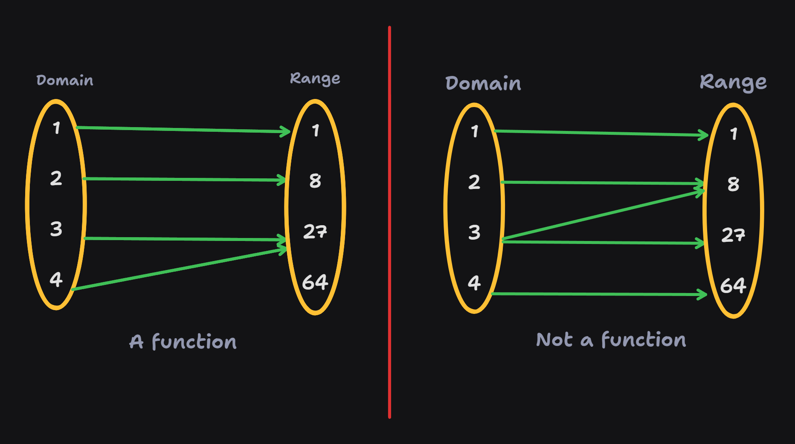
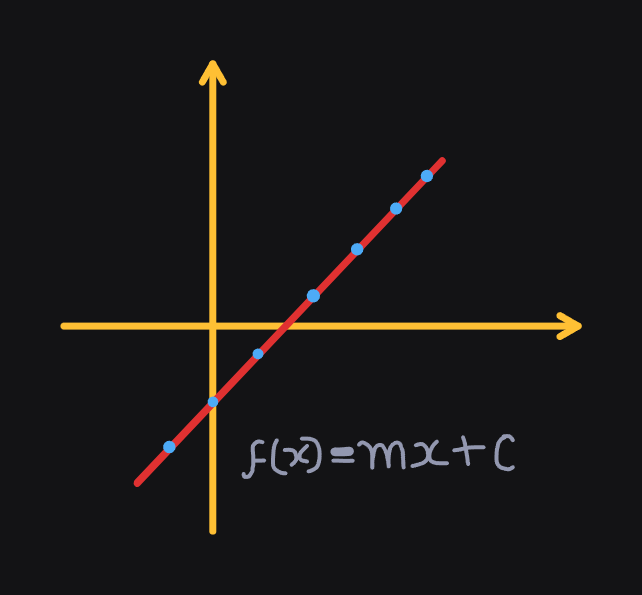

<!-- 
    Author : Kannan Jayachandran
    File : Calculus.md
 -->

<h1 align="center" style="color: orange"> Calculus </h1>

---

$\color{orange}``$**_Calculus is a branch of mathematics that studies continuous change,  using tools like derivatives and integrals._**$\color{orange}"$

---

## Functions

A function is a mathematical relationship between two sets of variables (_independent variable or input and dependent variable or output_). It is usually denote by $\color{orange}f(x)$, where $\color{orange}x$ is the **input** and $\color{orange}f(x)$ is the **output**.   

- Functions are Similar to equations as functions also express relationships between variables. 

- A function may have multiple inputs, but each input yields only one output. Alternatively, multiple inputs can result in the same output, but a single input cannot produce multiple outputs.

- **Domain** of a function is the set of all possible inputs for the function, over which the function is defined (has defined outputs). 

- **Range** of a function is the set of all possible outputs for the function.

### Types of Functions

There are a huge variety of functions, let us look at some of the most common types of functions.

**1. Linear Functions**

 A linear function is a function that can be represented by a straight line when plotted on a graph. It has the form $\color{orange}f(x) = mx + b$, where $\color{orange}m$ is the slope of the line  and $\color{orange}b$ is the y-intercept.

 > **EG:** Consider the cost of a taxi ride, it charges a fixed amount $\color{orange}b$  and an additional cost per mile $\color{orange}m$.
<!--

Introduction to Functions:
Definition of a function.
Understanding domains and ranges.

Types of Functions:
Linear functions.
Quadratic functions.
Exponential functions.
Logarithmic functions.

Operations on Functions:
Addition, subtraction, multiplication, and division of functions.
Composition of functions.

Limits and Continuity:
Understanding limits.
Evaluating limits algebraically.
Continuity of functions.

Derivatives:
Concept of a derivative.
Derivative rules (power rule, product rule, quotient rule).
Applications of derivatives (rate of change, optimization).

Integration:
Indefinite and definite integrals.
Integration rules.
Applications of integration (area under the curve, finding volumes).

Multivariable Calculus:
Partial derivatives.
Multiple integrals.

Differential Equations:
Basics of ordinary differential equations.

Approximations
   a. Taylor approximation
   b. exponential approximation
   c. logarithmic approximation

https://machinelearningmastery.com/calculus-for-machine-learning-7-day-mini-course/

## Other maths topics

[Linear Programming](https://www.youtube.com/watch?v=E72DWgKP_1Y)

Slope is a measure of how steep a line is. It is defined as the change in the `y-coordinate` (vertical change) divided by the change in the `x-coordinate` (horizontal change) between any two points on the line. 
$$Slope = \frac{rise}{run}$$

**In simple terms it tells us how many units the line moves down for every unit we moves to the right**

### Note

- If a system of linear equations has a unique solution; then they are complete and non-singular.

- If a system of linear equation has infinite solutions; it is redundant and singular.

- if the system of linear equation has no solution; it is called Contradictory and singular.

The constants in the system of equation are not important in determining whether the system is singular or not. -->

**Checkout [Probability Theory](./Probability.md)**
