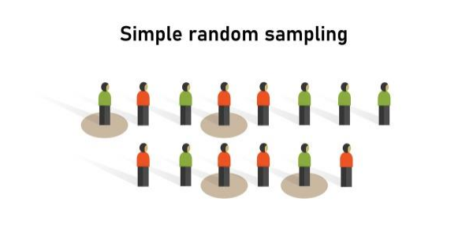
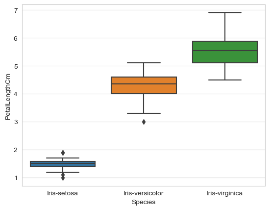
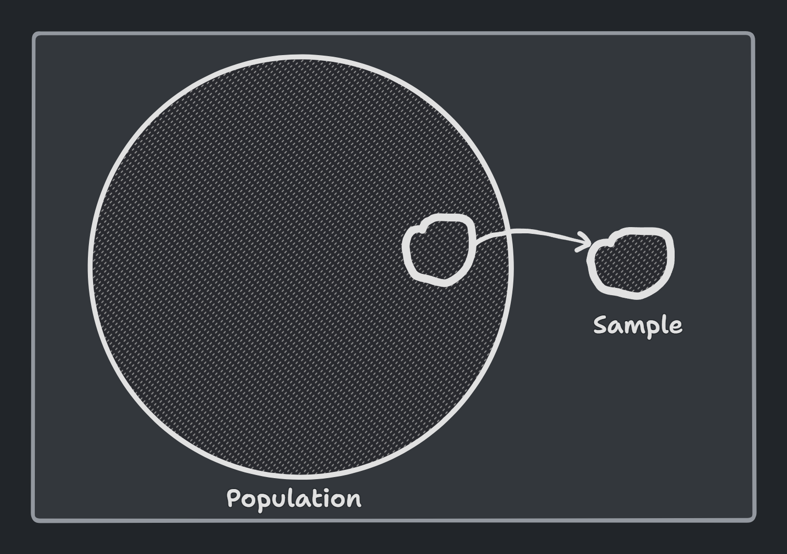
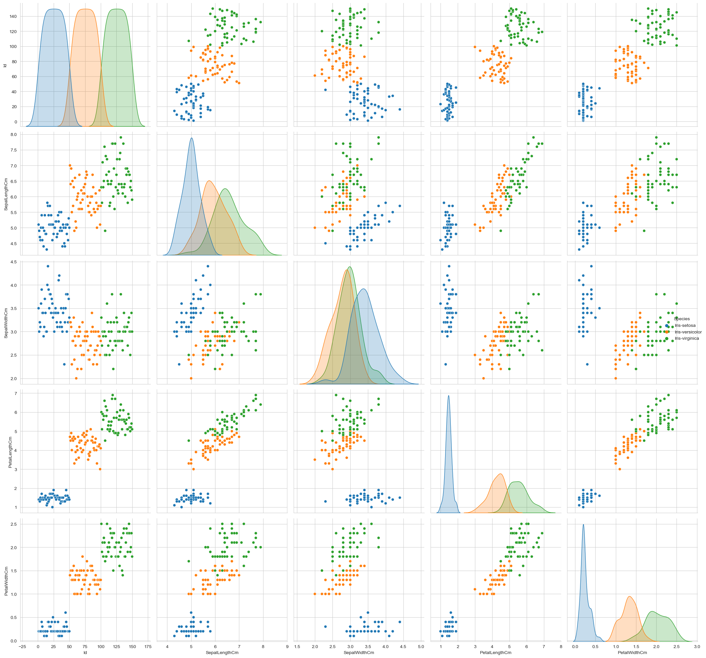
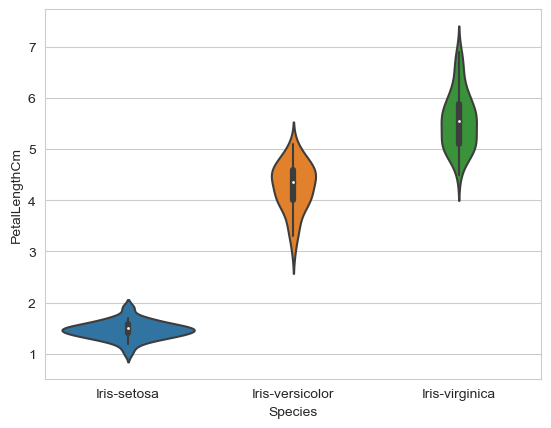

<h1 align="center" style="color: orange"> Data Visualization </h1>

Data visualization is an essential part of the data science process. It is the process of making sense of data through visual representations. Data visualization serves two fundamental purposes:

1. **Exploratory data analysis (EDA)**: The best way to explore data is to visualize it. This helps us to identify patterns, trends, and outliers in the data.

2. **Communicating the results**: After we have built a machine learning model, we need to communicate the results to the stakeholders. The best way to do this is through visualizations, as they are much easier to understand than a table of numbers.

There are numerous plotting techniques available. In this book, we will discuss some of the most common and useful ones. We will be using the following Python libraries for data visualization:

- Matplotlib
- Seaborn
- Plotly

## Line plot

A line plot is a type of plot that shows the data as a collection of points. We use a line plot to present observations collected at regular intervals. **[plt.plot()](https://matplotlib.org/stable/api/_as_gen/matplotlib.pyplot.plot.html)**

```python
x = [x*0.1 for x in range(100)]
y = np.sin(x)

plt.plot(x, y)
plt.show()
```



## Bar chart

A bar plot is a type of plot that shows the relative quantities for multiple categories. This is useful when we have a large number of values and we want to see which ranges most of the values fall into. The bars can be either vertical or horizontal and they can be stacked or grouped. **[sns.barplot()](https://seaborn.pydata.org/generated/seaborn.barplot.html)** or **[plt.bar()](https://matplotlib.org/stable/api/_as_gen/matplotlib.pyplot.bar.html)**


## Histogram

It is used to summarize the distribution of  data. It is a type of bar plot that shows the frequency of each value. The height of the bar represents the frequency of the value. The width of the bar represents the range of values. Histograms are density estimates. **[sns.histplot()](https://seaborn.pydata.org/generated/seaborn.histplot.html) | [sns.displot()](https://seaborn.pydata.org/generated/seaborn.displot.html#seaborn-displot)** or **[plt.hist()](https://matplotlib.org/stable/api/_as_gen/matplotlib.pyplot.hist.html)**


## Box and Whisker plot (Boxplot)

It is also used to summarize the distribution of the data sample. The box represents the inter-quartile range (IQR), which is the range between the 25th and 75th percentile of the data. The line in the middle of the box is the median. The whiskers represent the rest of the distribution. The points outside the whiskers are outliers. **[sns.boxplot()](https://seaborn.pydata.org/generated/seaborn.boxplot.html)** or **[plt.boxplot()](https://matplotlib.org/stable/api/_as_gen/matplotlib.pyplot.boxplot.html)**





## Scatter plot

A scatter plot is a type of plot that shows the data as a collection of points. The position of a point depends on its two-dimensional value, where each value is a position on either the horizontal or vertical dimension. They are useful to show association or correlation between two variables. **[sns.scatterplot()](https://seaborn.pydata.org/generated/seaborn.scatterplot.html)** or **[plt.scatter()](https://matplotlib.org/stable/api/_as_gen/matplotlib.pyplot.scatter.html)**


## Pair plot

A pair plot is a type of plot that shows the distribution of a variable (univariate distribution) and the relationship between multiple variables (multivariate distribution). If we have $x$ features, we will get $x^2$ plots.



It is good to use a pair plot if we are dealing with a small number of features. If we have a large number of features, we can use a correlation matrix to see the correlation between the features. **[sns.pairplot()](https://seaborn.pydata.org/generated/seaborn.pairplot.html)**


## Violin plot

A violin plot is similar to a box plot, except that it also shows the probability density of the data at different values. It is a combination of a box plot and a kernel density plot (a histogram).


