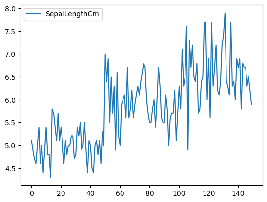

<h1 align="center" style="color: orange"> Data Visualization </h1>

Data visualization is a rudimentary and essential part of data science process. It is the process of making sense of the data through visual representations. It serves two fundamental purposes:

1. **Exploratory data analysis (EDA)**: For any given data problem, the first step after acquiring the data is to explore it. what better way to explore data rather than visualizing it. Only after this we may clean, process, and transform the data to prepare it for the machine learning algorithms.

2. **Communicating the results**: After we have built a machine learning model, we need to communicate the results to the stakeholders. Again the best way to do this is through visualizations. It is much easier to understand a visual representation of the results rather than a bunch of numbers.

Now there are numerous plotting techniques there. We will discuss some of the most common useful ones here.
We would be using the following libraries in python for data visualization:

- Matplotlib
- Seaborn
- Plotly

## Bar plot

A bar plot is a type of plot that shows the frequency or number of values compared to a set of value ranges. This is useful when we have a large number of values and we want to see which ranges most of the values fall into. The bars can be either vertical or horizontal and they can be stacked or grouped. **[sns.barplot()](https://seaborn.pydata.org/generated/seaborn.barplot.html)**

## Histogram

A histogram is a type of bar plot that shows the frequency or number of values compared to a set of value ranges. This is useful when we have a large number of values and we want to see which ranges most of the values fall into. **[sns.histplot()](https://seaborn.pydata.org/generated/seaborn.histplot.html) | [sns.displot()](https://seaborn.pydata.org/generated/seaborn.displot.html#seaborn-displot)**

## Scatter plot

A scatter plot is a type of plot that shows the data as a collection of points. The position of a point depends on its two-dimensional value, where each value is a position on either the horizontal or vertical dimension. 

# Line plot

A line plot is a type of plot that shows the data as a collection of points. The position of a point depends on its two-dimensional value, where each value is a position on either the horizontal or vertical dimension.

## Pair plot

A pair plot is a type of plot that shows the distribution of a variable (univariate distribution) and the relationship between multiple variables (multivariate distribution). If we have $x$ features, we will get $x^2$ plots.

It is good to use a pair plot if we are dealing with a small number of features. If we have a large number of features, we can use a correlation matrix to see the correlation between the features. **[sns.pairplot()](https://seaborn.pydata.org/generated/seaborn.pairplot.html)**

## Boxplot

The box represents the interquartile range (IQR), which is the range between the 25th and 75th percentile of the data. The line in the middle of the box is the median. The whiskers represent the rest of the distribution. The points outside the whiskers are outliers.

## Violin plot

A violin plot is similar to a box plot, except that it also shows the probability density of the data at different values. It is a combination of a box plot and a kernel density plot (a histogram).

