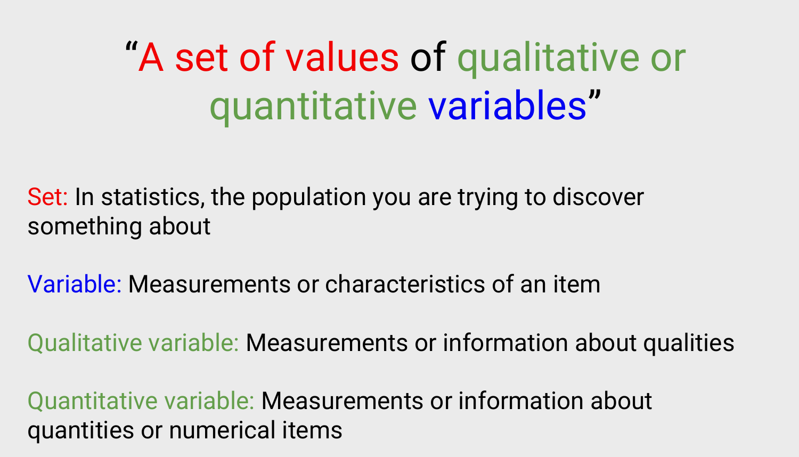
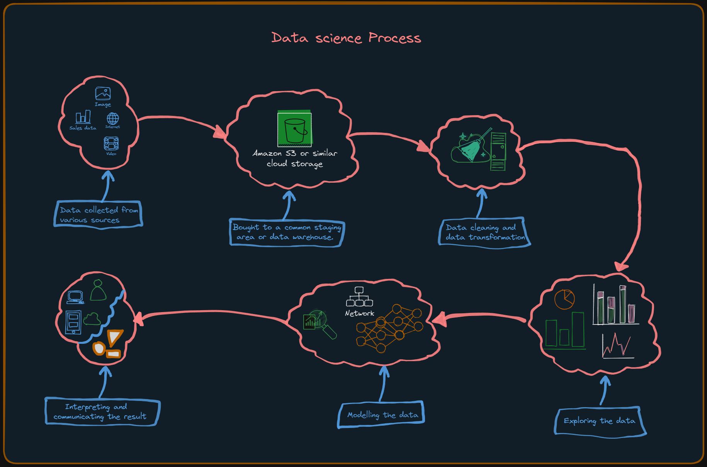

# Data Science and Machine Learning

## Data Science 📈
Data science is a diverse field that utilizes scientific methods, algorithms, and systems to extract valuable insights from both structured and unstructured data. It involves the use of tools such as data mining, machine learning, and big data techniques.

### Why Data Science Matters 🔍
In today's world, data is ubiquitous. It's often referred to as the new oil or electricity, highlighting its importance. Understanding and correctly interpreting data is essential in modern times. Data science provides us with the tools and techniques needed to make sense of data and use it to inform better decision-making.

### Data: The Foundation of Data Science

> This is the most comprehensive definition I could found.

Data, in essence, consists of factual information, encompassing numbers, words, measurements, observations, or descriptive descriptions of various phenomena. It can be categorized into two primary types: qualitative and quantitative. Qualitative data provides descriptive insights, characterizing aspects of a subject, while quantitative data comprises numerical information that can be precisely measured or counted. Data serves as the raw material that can be processed to extract valuable information. Data science is the process of transforming data into powerful insights.

### Evolution of Data Science
The concept of data science has a historical journey marked by evolving meanings and connotations. Initially, in the 1960s, it emerged as an alternative term for statistics. However, it wasn't until the late 1990s that computer science experts formalized this term. A proposed definition of data science recognized it as a distinct field encompassing three key facets: data design, collection, and analysis. It wasn't until a decade later that the term gained prominence beyond academia.

### Applications of Data Science
1. **[Descriptive Analysis](./Descriptive_Analytics.md)** : It involves examining data to gain insights into _past or current events_ within a data environment. This is often achieved through data visualization techniques. 
    > <picture>
    >   <source media="(prefers-color-scheme: light)" srcset="https://raw.githubusercontent.com/Mqxx/GitHub-Markdown/main/blockquotes/badge/light-theme/example.svg">
    >   
    > </picture> 
    >
    > Example: A company { hotel booking } may use descriptive analysis to examine its sales data from the previous year to identify trends and patterns such as spikes, slumps, and high-performing months.

2. **[Diagnostic analysis](./Diagnostic_Analysis.md)** : It goes deeper, aiming to understand _why something happened_. It involves techniques like drill-down, data discovery, data mining, and correlations. Multiple data operations and transformations are applied to uncover unique patterns. 

    > <picture>
    >   <source media="(prefers-color-scheme: light)" srcset="https://raw.githubusercontent.com/Mqxx/GitHub-Markdown/main/blockquotes/badge/light-theme/example.svg">
    >   
    > </picture> 
    >
    > Example: The hotel booking company may use diagnostic analysis to understand why its sales increased in a particular month. It may discover that the increase was due to a marketing campaign that was run during that period or some kind of seasonal trend.

3. **Predictive analysis** : It uses historical data to make accurate _forecasts about future_ data patterns. Techniques include machine learning, forecasting, pattern matching, and predictive modeling. Algorithms learn causality connections from past data. 

    > <picture>
    >   <source media="(prefers-color-scheme: light)" srcset="https://raw.githubusercontent.com/Mqxx/GitHub-Markdown/main/blockquotes/badge/light-theme/example.svg">
    >   
    > </picture> 
    >
    > Example: The hotel booking company may use predictive analysis to forecast its sales for the next year. It may discover that sales are likely to increase by 10% due to a new marketing campaign that will be launched in the coming months.

4. **Prescriptive analysis** : Prescriptive analytics takes predictive data to the next level. It involves _optimizing_ data-driven decisions. It not only predicts outcomes but also suggests optimal responses to those outcomes. It can analyze the implications of different choices and recommend the best course of action. It uses techniques such as simulation, graph analysis, complex event processing, neural networks, recommendation engines, heuristics, and machine learning. It helps to determine the best course of action to achieve a desired outcome. 

    > <picture>
    >   <source media="(prefers-color-scheme: light)" srcset="https://raw.githubusercontent.com/Mqxx/GitHub-Markdown/main/blockquotes/badge/light-theme/example.svg">
    >   
    > </picture> 
    >
    > Example: The hotel booking company may use prescriptive analysis to determine the best way to increase sales by 10%. It may discover that the best course of action is to run a marketing campaign during a particular month.

### The Data Science Process

The data science process is a structured approach to solving business problems through data analysis. It typically begins with a business problem and ends with a data-driven solution. The process involves the following steps:

1. **Collecting Data** : Data can come from various sources, such as internal databases, external data repositories, web server logs, social media, or third-party sources. Data scientists extract, collect, or purchase the data needed for analysis.

2. **Preparing or Cleaning Data** : Data scrubbing, or data cleaning, is essential for preparing the data. This involves standardizing the data format, handling missing data, correcting errors (like spelling mistakes or mathematical inaccuracies), removing any biases if present, and addressing outliers. We make sure that our data is in such a condition that it can be used for analysis.

3. **Exploring Data** :Data exploration is the initial analysis of the dataset. Data scientists use descriptive statistics and data visualization tools to gain a preliminary understanding of the data. They look for interesting patterns and trends that can guide further analysis or action.

4. **Modeling Data** : Modeling is the process of applying mathematical and statistical techniques to extract insights from data. It involves the use of machine learning algorithms to build predictive models. Techniques like association, classification, and clustering are used on the training dataset. Models may be tested against separate test data to assess their accuracy. The model is often fine-tuned to improve results.

5. **Interpreting and Communicating the result** : The final step involves interpreting the results and translating data insights into actionable recommendations. Data scientists work closely with analysts and business stakeholders to create diagrams, graphs, charts, and summaries that represent trends and predictions. These visualizations help stakeholders understand and implement the findings effectively. Ultimately these findings are communicated with the stakeholders.

### Data Science Tools or techniques

We use many statistical and mathematical techniques to analyze data. Some of the most common techniques are:

1. **Classification** : Classification is a fundamental concept in data science that involves organizing data into distinct groups or categories. Computers are trained to identify and categorize data based on patterns and characteristics found in known datasets. Here are a few examples of classification tasks:

    - Sorting products as popular or not popular.
    - Categorizing insurance applications as high risk or low risk.
    - Classifying social media comments into positive, negative, or neutral sentiments.
2. **Regression** : Regression is a key method in data science for establishing a relationship between two data points. This relationship is typically modeled using a mathematical formula and visualized as a graph or curves. The primary purpose of regression is to make predictions: when one data point is known, regression can be used to estimate the value of the other data point. Here are some examples of regression applications:
  
    - Predicting the rate of spread of air-borne diseases based on various factors.

    - Analyzing the relationship between customer satisfaction and the number of employees in a business.

    - Estimating the correlation between the number of fire stations in a particular location and the number of injuries due to fires.

3. **Clustering** : Clustering is a data analysis method used to group closely related data points together, with the primary goal of identifying patterns and anomalies within the data. It differs from sorting because the data is not assigned to fixed categories; instead, it is grouped based on likely relationships. Clustering allows for the discovery of new patterns and relationships within data. Here are some practical examples of clustering:

    - Grouping customers with similar purchase behavior to provide more targeted and personalized customer service.

    - Clustering network traffic data to identify daily usage patterns and detect network attacks more quickly.

    - Categorizing articles into multiple news categories using clustering techniques, which can aid in identifying potentially fake news content.

4. **Association** : Association is a data analysis method that involves identifying relationships between variables in a dataset. It is often used to identify patterns in data and make predictions. Here are some examples of association:

    - Identifying the relationship between the number of hours spent studying and the grades obtained by students.

    - Analyzing the relationship between the number of hours spent exercising and the number of calories burned.

    - Determining the relationship between the number of hours spent studying and the grades obtained by students.

5. **Anomaly Detection** : Anomaly detection is a data analysis method that involves identifying unusual or unexpected data points in a dataset. It is often used to identify patterns in data and make predictions. Here are some examples of anomaly detection:

    - Identifying fraudulent transactions in a credit card dataset.

    - Detecting unusual patterns in network traffic data that may indicate a network attack.

    - Identifying unusual patterns in a patient's vital signs that may indicate a medical emergency.

We employ tools like _machine learning, deep learning, and other statistical methods_ to perform these techniques.
