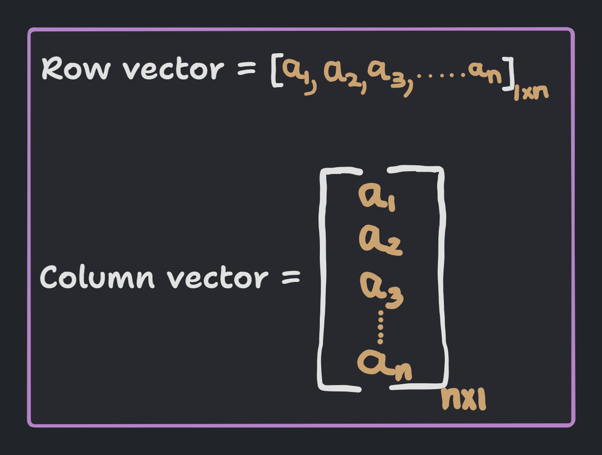

<!-- 
    Author : Kannan Jayachandran
    File : Linear_Algebra.md   

    NOT REVIEWED  
 -->

<h1 align="center"> Linear Algebra </h1>

Linear algebra is the branch of mathematics that deals with linear equations and their representations in vector spaces through matrices. It is a fundamental part of machine learning, deep learning, data science, and artificial intelligence.

## Points/Vectors

A point/Vector is a collection of numbers which is often used to describe the state of a system. 

Similarly we can represent an `n-dimensional` vector as $[x_1, x_2, x_3, ..., x_n]$ when the length of the vector is `n` and $x_i$ is a component of the vector.

> vectors are typically defined in spaces of two dimensions or more. When it comes to one dimensional space we call it a scalar.

- **Distance between origin `o(0, 0)` and a point `p(a, b)`in a 2D plane** : **$d = \sqrt{a^2+b^2}$**

- **Distance between origin `o(0, 0, 0)` and a point `p(a, b, c)`in a 3D plane** : **$d = \sqrt{a^2+b^2+c^2}$**

- **Distance between the origin and a `n-dimensional` point `p(x1, x2, x3, ..., xn)`** : **$d = \sqrt{x_1^2+x_2^2+x_3^2+...+x_n^2}$**

> This sorts of gives us a hint to a basic yet powerful concept in linear algebra, most of the concepts in linear algebra can be extended to `n-dimensional` space from `2D` and `3D` space.

- **Distance between two points p $(x_1, y_1)$ and q $(x_2, y_2)$ in a 2D plane** : **$d = \sqrt{(x_1 - x_2)^2+(y_1 - y_2)^2}$**

- **Distance between two points p $(x_1, y_1, z_1)$ and q $(x_2, y_2, z_2)$ in a 3D plane** : **$d = \sqrt{(x_1 - x_2)^2+(y_1 - y_2)^2+(z_1 - z_2)^2}$**

- **Distance between two points p $(x_1, x_2, x_3, ..., x_n)$ and q $(y_1, y_2, y_3, ..., y_n)$ in a `n-dimensional` plane** : **$d = \sqrt{(x_1 - y_1)^2+(x_2 - y_2)^2+(x_3 - y_3)^2+...+(x_n - y_n)^2}$** or **$d = \sqrt{\sum_{i=1}^{n}(x_i - y_i)^2}$**

> This is called the `Euclidean distance` between two points.

## Row and Column Vectors

A row vector is a vector that has a single row and multiple columns. Similarly, a column vector is a vector that has a single column and multiple rows.

- **Row vector** : $[x_1, x_2, x_3, ..., x_n]$ 

- **Column vector** : $\begin{bmatrix} x_1 \\ x_2 \\ x_3 \\ ... \\ x_n \end{bmatrix}$

## Dot product of two vectors

The dot product of two vectors is a _scalar_ quantity that is equal to the sum of the products of the corresponding entries of the two vectors.

- **Dot product of two vectors** : $a \cdot b = a_1b_1 + a_2b_2 + a_3b_3 + ... + a_nb_n$ 

which can be written as;

$$[a_1, a_2, a_3, ..., a_n] \; . \; \begin{bmatrix} b_1 \\ b_2 \\ b_3 \\ ... \\ b_n \end{bmatrix}$$

$$\implies a.b = a^T.b$$

$$\implies a \cdot b = \sum_{i=1}^{n}a_ib_i$$

where a = $[a_1, a_2, a_3, ..., a_n]$ and b = $[b_1, b_2, b_3, ..., b_n]$ are two vectors.

Now let us see this what $a.b$ means geometrically.

From the above diagram if we have the angle between the two vectors as $\theta$ then we can write the dot product as;

$$a.b = |a||b|cos\theta$$

Hence if the two vectors are perpendicular to each other then the dot product is zero.

If we extrapolate this to `n-dimensional` space then we can write the dot product as;

$$a.b = \sum_{i=1}^{n}a_ib_i = |a||b|cos\theta$$

where $a = [a_1, a_2, a_3, ..., a_n]$ and $b = [b_1, b_2, b_3, ..., b_n]$ are two `n-dimensional`vectors. 
 

## Projection of a vector

The projection of a vector `a` onto another vector `b`, denoted as `proj_b(a)`, is the vector `p` that lies in the direction of `b` and is collinear with `a`.

We can express this mathematically as;

$$d = \frac{a.b}{||b||}$$

where $a$ and $b$ are two vectors and $||b||$ is the magnitude/length of the vector $b$. Or;

$$d = ||a||cos\theta$$

where $\theta$ is the angle between the two vectors.

## Unit vector

A unit vector is a vector that has a magnitude of 1. It is often denoted as $\hat{a}$. The unit vector would have the same direction as the original vector $a$.

## A line

A line is a collection of points that satisfy the equation $\color{#FF9900}ax + by + c = 0$ where $a$ and $b$ are the coefficients of $x$ and $y$ respectively and $c$ is a constant. We can define a line in a 2D plane as;

$$w_{1}x_1 + w_2x_2 + w_0 = 0$$

Now when we want to translate the idea of a line to a `3-Dimensional` space, we actually having something known as a `plane`. A plane is a collection of points that satisfy the equation $\color{#FF9900} ax + by + cz + d = 0$ where $a$, $b$ and $c$ are the coefficients of $x$, $y$ and $z$ respectively and $d$ is a constant. In terms of of our previous equation we can define a plane in a 3D plane as;

$$w_{1}x_1 + w_2x_2 + w_3x_3 + w_0 = 0$$

> It's better to write the expression like this as in the previous one we will eventually run out of alphabets.

Now when we want to translate the idea of a line to a `n-Dimensional` space, we actually having something known as a `hyperplane`. A hyperplane is a collection of points that satisfy the equation $\color{#FF9900} a_1x_1 + a_2x_2 + a_3x_3 + ... + a_nx_n + b = 0$ where $a_1$, $a_2$, $a_3$, ..., $a_n$ are the coefficients of $x_1$, $x_2$, $x_3$, ..., $x_n$ respectively and $b$ is a constant. In terms of of our previous equation we can define a hyperplane in a n-Dimensional plane as;

$$w_{0}x_0 + w_{1}x_1 + w_2x_2 + w_3x_3 + ... + w_nx_n + w_0 = 0$$

> A line in 2D becomes a plane in 3D and that becomes a hyperplane in n-Dimensional space.

The above equation can be written as;

$$w_0 \sum_{i=0}^{n}w_ix_i = 0$$

The equation of a plane in `n-dimensional` space ($\pi_n$) can be written as;

$$w_0 + w^Tx = 0$$

where $w = [w_0, w_1, w_2, w_3, ..., w_n]$ and $x = [x_0, x_1, x_2, x_3, ..., x_n]$ are two vectors.

Equation of a line passing through origin is $\color{#FF9900}w^Tx = 0$
> we can drop the $w_0$ term as it is zero (because since the line is passing through origin, the y-intercept is zero).

## Distance of a point from a plane

Let us consider a plane $\pi_n$ that passes through origin and an `n-dimensional` point $p$. The distance between the point $p$ and the plane $\pi_n$ is given by;

$$d = \frac{w^Tp}{||w||}$$

where $w$ is the normal vector to the plane $\pi_n$ and $||w||$ is the magnitude of the vector $w$.

Similarly we can find the distance between the plane and the point $p^{'}$ as;

$$d^{'} = \frac{w^Tp^{'}}{||w||}$$

> In the above diagram $\color{#FF9900}d$ is positive as the angle between the $\color{#FF9900}w$ and $\color{#FF9900}p$ is less than $\color{#FF9900}90^{\circ}$ and $\color{#FF9900}d^{'}$ is negative as the angle between the $w$ and $\color{#FF9900}p^{'}$ is greater than $\color{#FF9900}90^{\circ}$.

When we want to compute the distance between the point and the plain, we take the absolute value of the distance, as negative distance does not make sense. At the same time, the sign of the distance is important as it tells us on which side of the plane (half-space) the point lies. So, when we need to determine whether something lies on which half-space, we can use the above idea.

## Circle

A circle is a collection of points that satisfy the equation $\color{#FF9900} (x)^2 + (y)^2 = r^2$ where $\color{#FF9900}r$ is the radius of the circle and it's center is at the origin $(0, 0)$. The general equation of a circle with center $(h, k)$ and radius $r$ is given by;

$$(x - h)^2 + (y - k)^2 = r^2$$

Given a point $p(x_1, x_2)$, we can determine whether that point lies inside the circle, on the circle, or outside the circle.

- If $x_1^2 + x_2^2 < r^2$, the point lies inside the circle.

- If $x_1^2 + x_2^2 = r^2$, the point lies on the circle.

- If $x_1^2 + x_2^2 > r^2$, the point lies outside the circle.

In `3D`, we have **sphere** instead of circle. The general equation for a circle with center $(h, k, l)$ and radius $r$ is given by;

$$(x_1 - h)^2 + (x_2 - k)^2 + (x_3 - l)^2 = r^2$$

A higher dimensional sphere or a **Hypersphere** is defined as;

$$(x_1 - h)^2 + (x_2 - k)^2 + (x_3 - l)^2 + ... + (x_n - m)^2 = r^2$$

If the center of the hypersphere is at the origin, then the equation of the hypersphere is given by;

$$x_1^2 + x_2^2 + x_3^2 + ... + x_n^2 = r^2 \implies \sum_{i=0}^{n}x_i^2 = r^2$$

The same idea of a point inside a circle or not using the equation of a circle can be extended to higher dimensions. This again is pretty powerful as we can use this idea to determine whether a point lies inside a hyper-sphere or not.

---

## System of linear equations

A system of linear equations is a collection of linear equations involving the same set of variables. For example; 

$$2x + 3y = 5$$  

$$3x + 4y = 6$$ 

are two linear equations involving the same set of variables $x$ and $y$. A solution to a system of linear equations is a set of values for the variables that satisfies all the equations simultaneously. For example, the values $x = 1$ and $y = 1$ is a solution to the above system of linear equations.

A system can have no solution, a single solution, or infinitely many solutions. A system of linear equations can be represented in `matrix` form as;

$$\begin{bmatrix} 2 & 3 \\ 3 & 4 \end{bmatrix} \begin{bmatrix} x \\ y \end{bmatrix} = \begin{bmatrix} 8 \\ 9 \end{bmatrix}$$

where the matrix on the left is called the `coefficient matrix`, the vector on the right is the `vectors`, and the vector on the left is called the `solution vector`.

## Matrix 

A matrix is a rectangular array of numbers. A matrix with `m` rows and `n` columns is said to have the dimension `m x n`. We can add, subtract, and multiply matrices. We can also multiply a matrix with a scalar. While multiplying matrices we need to ensure that the number of columns in the first matrix is equal to the number of rows in the second matrix.

## Determinant of a matrix

Determinant of a matrix is a special value which tells us whether the matrix has an inverse or not. It is denoted by $$det(X) \;or \;|X|$$ 

It is a scalar value and helps in solving systems of linear equations.

**Calculating the determinant of a 2x2 matrix** : $det(X) = ad-bc$ where; 
$$ X= \begin{bmatrix} a & b \\ c & d\end{bmatrix}$$

> For a larger matrix we can find the determinant using a process called Co-factor expansion; which involves choosing a row or column and calculating the determinants of smaller matrices called co-factors. This process can be recursive, meaning you keep calculating determinants of smaller matrices until you reach a 2x2 matrix that you can solve using the formula above

- All matrices does not have a determinant. Only square matrices have determinant. 

- If the determinant is zero, the matrix is said to be singular, and it does not have an inverse, and the system of linear equations have infinitely many solutions. It also means that the rows or columns of the matrix are linearly dependent and the matrix does not have full rank.

- The magnitude of the determinant indicates how much the matrix scales the volume (or area) spanned by its column vectors. A determinant of 1 indicates that the matrix preserves volume (or area) without scaling it.

The determinant in general encodes information about scaling factors and orientations in linear transformations. 

- Although the co-factor expansion method to find the determinant is intuitive, it is computationally expensive. Generally co-factor expansion requires $\color{#FF9900}O(n!)$ operations. We use other alternatives like, the `LU decomposition` along with `product of pivots` method that requires  roughly $\color{#FF9900}O(n^3)$ operations.

## Rank of a matrix

The rank of a matrix is the maximum number of linearly independent rows or columns in the matrix. The rank of a matrix is denoted by $rank(X)$. We can find the rank of a matrix by reducing it to its `row echelon form` or `reduced row echelon form` and counting the number of non-zero rows.

## Inner product

Inner product is a generalization of the dot product. It is a function that takes in two vectors and returns a scalar. It is denoted by $\langle x, y \rangle$ and is defined as;

$$\langle x, y \rangle = x^Ty = \sum_{i=1}^{N}x_iy_i$$

where $x$ and $y$ are two vectors.

Inner product tells us how the vectors are correlated. If two vectors are correlated
(i.e., nearly parallel), then the inner product will give us a large value. If the vectors are close to perpendicular, then the inner vector would be small. Therefore, the inner product provides a measure of the _closeness/similarity_ between two vectors.

>Geometric interpretation of inner product

## Basic Combinatorics

Let us take a detour from linear algebra and look at some basic combinatorics. `Combinatorics` is the branch of mathematics that deals with counting. It is used in probability theory, statistics, and machine learning. Python has extensive support for combinatorics also through libraries like `itertools`, `SciPy`, `NetworkX`, `SymPy`, and `combinations`.

### Permutations

Permutations are the number of ways in which we can arrange a set of objects. 

> For example, if we have three objects, say `a`, `b`, and `c`, then the number of ways in which we can arrange them is $3! = 3 \times 2 \times 1 = 6$. 

Formally we can define permutations as;

**Number of ordered configurations to arrange $k$ objects from a set of $n$ objects, without replacement and without repetition.**

$$P(n, r) = \frac{n!}{(n-r)!}$$

where $\color{#FF9900}n$ is the number of objects and $\color{#FF9900}r$ is the number of objects we want to arrange.

### Combinations

Combinations are the number of ways in which we can select a subset of objects from a set of objects.

> For example, if we have three objects, say `a`, `b`, and `c`, then the number of ways in which we can select two objects is $3C2 = 3$.

Formally we can define combinations as;

**Number of unordered configurations to select $k$ objects from a set of $n$ objects, without replacement and without repetition.**

$$C(n, r) = \frac{n!}{r!(n-r)!}$$

where $\color{#FF9900}n$ is the number of objects and $\color{#FF9900}r$ is the number of objects we want to select.

### [Jupyter notebook of linear algebra](./Notebooks/Linear_algebra.ipynb)

**Checkout [Calculus](./Calculus.md) and [Probability and Statistics](./Probability_and_statistics_Introduction.md)**
