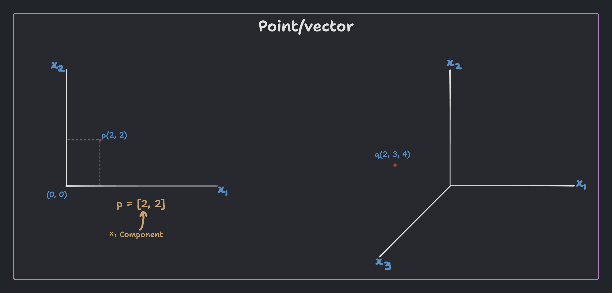
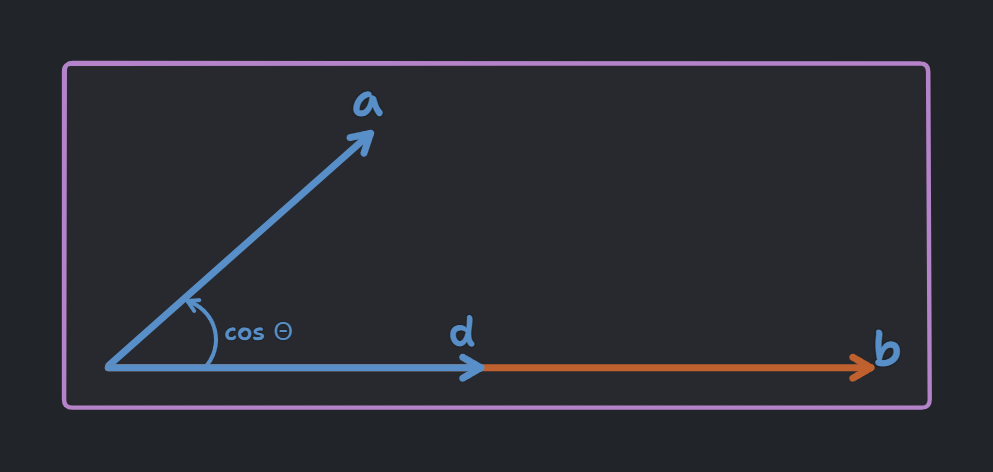
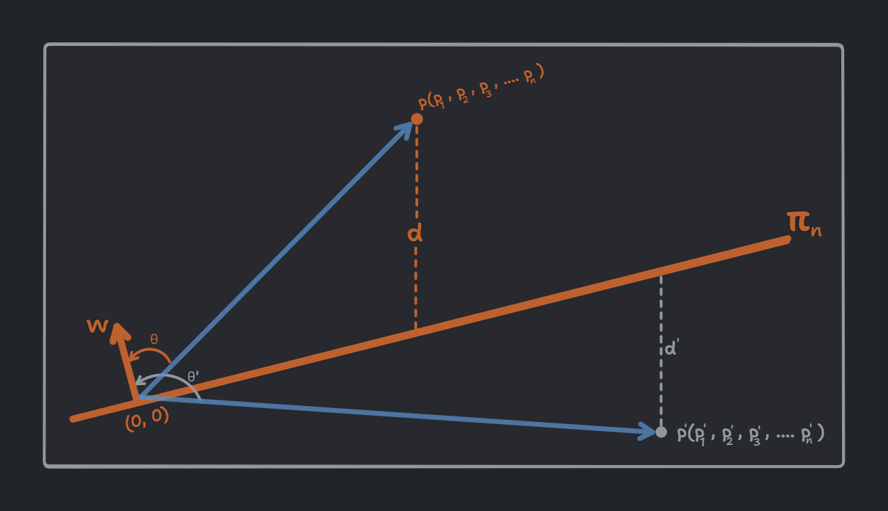

<!-- 
    Author : Kannan Jayachandran
    File : Linear_Algebra.md
 -->

<h1 align="center" style="color: orange"> Linear Algebra </h1>

---

$\color{orange}``$**_Linear algebra is the branch of mathematics that deals with linear equations and their representations in vector spaces through matrices. Linear algebra is also known as the mathematics of data._**$\color{orange}"$

---

## Notations

| Notation | Description |
| --- | :--- |
| $\color{#F99417}a$ | Scalar or Vector |
| $\color{#F99417}A, B, C$ | Matrix |
| $\color{#F99417}A$ of size $\color{#F99417}\text{m X n}$ | Matrix `A` with `m` rows and `n` columns  |
| $\color{#F99417}A_{ij}$ | Element in the `i-th` row and `j-th` column of matrix `A` |
| $\color{#F99417}A^T$ | Transpose of matrix `A` |
| $\color{#F99417}v^T$ | Transpose of vector `v` |
| $\color{#F99417}A^{-1}$ | Inverse of matrix `A` |
| $\color{#F99417}A^*$ | Conjugate transpose of matrix `A` |
| $\color{#F99417}det(A)$ | Determinant of matrix `A` |
| $\color{#F99417}AB$ | Matrix multiplication of matrix `A` and matrix `B`|
| $\color{#F99417}u.v; \langle u, v\rangle$ | Dot product of `u` and `v`|
| $\color{#F99417}u \times v$ | Cross product of `u` and `v`|
| $\color{#F99417}\R$ | Set of real numbers|
| $\color{#F99417}\R^2$ | Set of two dimensional vectors|
| $\color{#F99417}\R^n$ | Set of n-dimensional vectors|
| $\color{#F99417}v\in\R^n$ | Vector `v` is an element of |
| $\color{#F99417}\|v\|_1$ | L1 - Norm of vector `v`|
| $\color{#F99417}\|v\|_2; \|\|v\|\|$ | L2 - Norm of vector `v`|
| $\color{#F99417}\|v\|_\infin$ | L-infinity - Norm of vector `v`|
| $\color{#F99417}T: \R^n \rightarrow \R^m;T(v)=w$ | Transformation `T` of a vector `v` $\in \R^n$ into the vector `w` $\in \R^m$|

## Vector

A point/Vector is a collection of numbers which is often used to describe the state of a system. 

Therefore we can represent an `n-dimensional` vector as $\color{#F99417}[x_1, x_2, x_3, ..., x_n]$. Where the length of the vector is `n` and $\color{#F99417}x_i$ is a component of the vector in the `i-th` dimension.

Some of the common **distance formulas** are;

| Description | Formula |
| --- | :--- |
| Distance between origin $\color{#F99417}o(0, 0)$ and a point $\color{#F99417}P(x_1, x_2)$ in a 2D plane | $d = \sqrt{x_1^2+x_2^2}$ |
| Distance between origin $\color{#F99417}o(0, 0, 0)$ and a point $\color{#F99417}P(x_1, x_2, x_3)$ in a 3D plane | $d = \sqrt{x_1^2+x_2^2+x_3^2}$ |
| Distance between origin $\color{#F99417}o(0, 0, 0, ..., 0)$ and a point $\color{#F99417}p(x_1, x_2, x_3, ..., x_n)$ in a `n-dimensional` plane | $d = \sqrt{x_1^2+x_2^2+x_3^2+...+x_n^2}$ |
| Distance between two points  $\color{#F99417}P (x_1, y_1)$ and $\color{#F99417}Q (x_2, y_2)$ in a 2D plane | $d = \sqrt{(x_2 - x_1)^2+(y_2 - y_1)^2}$ |
| Distance between two points  $\color{#F99417}P (x_1, y_1, z_1)$ and $\color{#F99417}Q (x_2, y_2, z_2)$ in a 3D plane | $d = \sqrt{(x_2 - x_1)^2+(y_2 - y_1)^2+(z_2 - z_1)^2}$ |
| Distance between two points $\color{#F99417} P(x_1, x_2, x_3, ..., x_n)$ and $\color{#F99417}Q (y_1, y_2, y_3, ..., y_n)$ in a `n-dimensional` plane | $d = \sqrt{(x_1-y_1)^2+(x_2 - y_2)^2+(x_3 - y_3)^2+...+(x_n - y_n)^2} \\  \;\;\;\;\;{ or }\\ d = \sqrt{\sum_{i=1}^{n}(x_i - y_i)^2}$ |

> All of these formulas represent the Euclidean distance, providing a way to measure the distance between two points in different-dimensional spaces. We can easily derive all the above formulas using the Pythagoras theorem.

## Row and Column Vectors

Row vectors are vectors that have a single row and one or more columns. Column vectors are vectors that have a single column and one or more rows.
We can use a row vector to represent the weights of a neural network. While we can use a column vector to represent the features of an input.

> Taking transpose of a row vector gives us a column vector and vice versa.

## Dot product

The dot product of two vectors is a _scalar_ quantity that is equal to the sum of the products of the corresponding entries of the two vectors.

- **Dot product of two vectors** : $\color{#F99417}a \cdot b = a_1b_1 + a_2b_2 + a_3b_3 + ... + a_nb_n$ 

which can be written as the product of a row and a column vector as;

$$[a_1, a_2, a_3, ..., a_n] \; \cdot \; \begin{bmatrix} b_1 \\ b_2 \\ b_3 \\ ... \\ b_n \end{bmatrix} \rightarrow a^T.b \rightarrow a \cdot b = \sum_{i=1}^{n}a_ib_i$$

where a = $\color{#F99417}[a_1, a_2, a_3, ..., a_n]$ and b = $\color{#F99417}[b_1, b_2, b_3, ..., b_n]$ are two vectors.

Geometrically interpretation of dot product.

- Hence if the two vectors are perpendicular to each other then the dot product is zero.

If we extrapolate this to `n-dimensional` space then we can write the dot product as;

For an `n-dimensional` space, the dot product of two vectors $\color{#F99417}a$ and $\color{#F99417}b$ is given by;

$$a.b = \sum_{i=1}^{n}a_ib_i = |a||b| \; cos\theta$$

where $\color{#F99417}a = [a_1, a_2, a_3, ..., a_n]$ and $\color{#F99417}b = [b_1, b_2, b_3, ..., b_n]$.

**In machine learning we use `dot` product to calculate the `weighted sum` of the inputs and weights.**

## Inner product

Inner product is a generalization of the dot product. It is a function that takes in two vectors and returns a scalar. It is denoted by $\color{#F99417}\langle x, y \rangle$ and is defined as;

$$\langle x, y \rangle = x^Ty = \sum_{i=1}^{N}x_iy_i$$

where $\color{#F99417}x$ and $\color{#F99417}y$ are two vectors.

Inner product tells us how the vectors are correlated. If two vectors are correlated (i.e., nearly parallel), then the inner product will give us a large value. If the vectors are close to perpendicular, then the inner vector would be small. Therefore, the inner product provides a measure of the _closeness/similarity_ between two vectors.

>Geometric interpretation of inner product

## Vector norm

The norm of a vector is the length of the vector (magnitude of the vector). It is denoted by $\color{#F99417}||a||$ and is given by;

$$||a|| = \sqrt{a_1^2 + a_2^2 + a_3^2 + ... + a_n^2}$$

where $\color{#F99417}a = [a_1, a_2, a_3, ..., a_n]$ is a vector.

> Vector norm is a non-negative value, which describes the extend of the vector space. 

### $L^1$ Norm

$L^1$ Norm or Manhattan norm is the sum of the absolute values of the vector elements. It is denoted by $\color{#F99417}||a||_1$ and is given by;

$$||a||_1 = |a_1| + |a_2| + |a_3| + ... + |a_n|$$

where $\color{#F99417}a = [a_1, a_2, a_3, ..., a_n]$ is a vector.

> It the manhattan distance from the origin of the vector space.

**$\color{#F99417}L^1$ norm is often used in machine learning as a regularization technique (to keep the co-effs of the model small).**

### $L^2$ Norm

$L^2$ Norm or Euclidean norm is the square root of the sum of the squares of the vector elements. It is denoted by $\color{#F99417}||a||_2$ and is given by;

$$||a||_2 = \sqrt{a_1^2 + a_2^2 + a_3^2 + ... + a_n^2}$$

where $\color{#F99417}a = [a_1, a_2, a_3, ..., a_n]$ is a vector.

###  Vector max norm or $L^\infin$ Norm

Vector max norm or $L^\infin$ Norm is the maximum absolute value of the vector elements. It is denoted by $\color{#F99417}||a||_\infin$ and is given by;

$$||a||_\infin = max(|a_1|, |a_2|, |a_3|, ..., |a_n|)$$

where $\color{#F99417}a = [a_1, a_2, a_3, ..., a_n]$ is a vector.

## Projection of a vector

The projection of a vector `a` onto another vector `b`, denoted as `proj_b(a)`, is the vector `p` that lies in the direction of `b` and is collinear with `a`.

We can express this mathematically as;

$$d = \frac{a.b}{||b||} \rightarrow d = ||a||cos\theta$$

where $\color{#F99417}a$ and $\color{#F99417}b$ are two vectors and $\color{#F99417}||b||$ is the magnitude/length of the vector $\color{#F99417}b$.

where $\color{#F99417}\theta$ is the angle between the two vectors.

## Unit vector

A vector with a magnitude of 1. It is often denoted as $\color{#F99417}\hat{a}$. The unit vector would have the same direction as the original vector $\color{#F99417}a$.

## A line

A line is a collection of points that satisfy the equation $\color{#FF9900}ax + by + c = 0$ where $a$ and $b$ are the coefficients of $x$ and $y$ respectively and $c$ is a constant. We can define a line in a `2D plane` as;

$$w_{1}x_1 + w_2x_2 + w_0 = 0$$

In `3D space`, we have a plane instead of a line. A plane is a collection of points that satisfy the equation $\color{#FF9900} ax + by + cz + d = 0$ where $\color{#FF9900}a$, $\color{#FF9900}b$ and $\color{#FF9900}c$ are the coefficients of $\color{#FF9900}x$, $\color{#FF9900}y$ and $\color{#FF9900}z$ respectively and $\color{#FF9900}d$ is a constant. In terms of of our previous equation we can define a plane in a 3D plane as;

$$w_{1}x_1 + w_2x_2 + w_3x_3 + w_0 = 0$$

In `n-dimensional` space we have a `hyperplane` instead of a line or a plane. A hyperplane is a collection of points that satisfy the equation $\color{#FF9900} a_1x_1 + a_2x_2 + a_3x_3 + ... + a_nx_n + b = 0$ where $\color{#FF9900}a_1$, $\color{#FF9900}a_2$, $\color{#FF9900}a_3$, ..., $\color{#FF9900}a_n$ are the coefficients of $\color{#FF9900}x_1$, $\color{#FF9900}x_2$, $\color{#FF9900}x_3$, ..., $\color{#FF9900}x_n$ respectively and $\color{#FF9900}b$ is a constant. which can be written as;

$$w_{0}x_0 + w_{1}x_1 + w_2x_2 + w_3x_3 + ... + w_nx_n + w_0 = 0$$

> A line in 2D becomes a plane in 3D which becomes a hyperplane in n-Dimensional space.

The above equation can be written as;

$$w_0 \sum_{i=0}^{n}w_ix_i = 0$$

**The equation of a plane in `n-dimensional` space ($\color{#FF9900}\pi_n$) can be written as**;

$$w_0 + w^Tx = 0$$

where $\color{#FF9900}w = [w_0, w_1, w_2, w_3, ..., w_n]$ and $\color{#FF9900}x = [x_0, x_1, x_2, x_3, ..., x_n]$ are two vectors.

Equation of a line passing through origin is $\color{#FF9900}w^Tx = 0$

> we can drop the $w_0$ term as it is zero (because since the line is passing through origin, the y-intercept is zero).

## Distance of a point from a plane

Let us consider a plane $\color{#FF9900}\pi_n$ that passes through origin and an `n-dimensional` point $\color{#FF9900}p$. The distance between the point $\color{#FF9900}p$ and the plane $\color{#FF9900}\pi_n$ is given by;

$$d = \frac{w^Tp}{||w||}$$

where $\color{#FF9900}w$ is the normal vector to the plane $\color{#FF9900}\pi_n$ and $\color{#FF9900}||w||$ is the magnitude of the vector $\color{#FF9900}w$.

Similarly we can find the distance between the plane and the point $\color{#FF9900}p^{'}$ as;

$$d^{'} = \frac{w^Tp^{'}}{||w||}$$

> In the above diagram $\color{#FF9900}d$ is positive as the angle between the $\color{#FF9900}w$ and $\color{#FF9900}p$ is less than $\color{#FF9900}90^{\circ}$ and $\color{#FF9900}d^{'}$ is negative as the angle between the $w$ and $\color{#FF9900}p^{'}$ is greater than $\color{#FF9900}90^{\circ}$.

When we want to compute the distance between the point and the plain, we take the absolute value of the distance, as negative distance does not make sense. At the same time, the sign of the distance is important as it tells us on which side of the plane (half-space) the point lies. So, when we need to determine whether something lies on which half-space, we can use the above idea.

## Circle

A circle is a collection of points that satisfy the equation $\color{#FF9900} (x)^2 + (y)^2 = r^2$ where $\color{#FF9900}r$ is the radius of the circle and it's center is at the origin $\color{#FF9900}(0, 0)$. The general equation of a circle with center $\color{#FF9900}(h, k)$ and radius $\color{#FF9900}r$ is given by;

$$(x - h)^2 + (y - k)^2 = r^2$$

Given a point $\color{#FF9900}p(x_1, x_2)$, we can determine whether that point lies inside the circle, on the circle, or outside the circle.

- If $\color{#FF9900}x_1^2 + x_2^2 < r^2$, the point lies inside the circle.

- If $\color{#FF9900}x_1^2 + x_2^2 = r^2$, the point lies on the circle.

- If $\color{#FF9900}x_1^2 + x_2^2 > r^2$, the point lies outside the circle.

In `3D`, we have **sphere** instead of circle. The general equation for a circle with center $\color{#FF9900}(h, k, l)$ and radius $r$ is given by;

$$(x_1 - h)^2 + (x_2 - k)^2 + (x_3 - l)^2 = r^2$$

A higher dimensional sphere or a **Hypersphere** is defined as;

$$(x_1 - h)^2 + (x_2 - k)^2 + (x_3 - l)^2 + ... + (x_n - m)^2 = r^2$$

If the center of the hypersphere is at the origin, then the equation of the hypersphere is given by;

$$x_1^2 + x_2^2 + x_3^2 + ... + x_n^2 = r^2 \implies \sum_{i=0}^{n}x_i^2 = r^2$$

The same idea of a point inside a circle or not using the equation of a circle can be extended to higher dimensions. This again is pretty powerful as we can use this idea to determine whether a point lies inside a hyper-sphere or not.

## Matrix 

A matrix is a 2d array of numbers, with one or more rows and one or more columns. A matrix with `m` rows and `n` columns is said to have the dimension `m x n`. While multiplying matrices we need to ensure that;

$$\color{#FF9900}\text{No. of Col(}m_1\text{) = No. of rows(}m_2)$$

## Types of matrices

- **Square matrix** : A matrix with the same number of rows and columns. For example; $\color{#F99417}X = \begin{bmatrix} 1 & 2 & 3 \\ 4 & 5 & 6 \\ 7 & 8 & 9 \end{bmatrix}$

- **Diagonal matrix** : A square matrix with all the elements outside the main diagonal are zero. For example; $\color{#F99417}X = \begin{bmatrix} 1 & 0 & 0 \\ 0 & 5 & 0 \\ 0 & 0 & 9 \end{bmatrix}$

- **Identity matrix** : A diagonal matrix with all the elements in the main diagonal are one. For example; $\color{#F99417}X = \begin{bmatrix} 1 & 0 & 0 \\ 0 & 1 & 0 \\ 0 & 0 & 1 \end{bmatrix}$

- **Upper triangular matrix** : A square matrix with all the elements below the main diagonal are zero. For example; $\color{#F99417}X = \begin{bmatrix} 1 & 2 & 3 \\ 0 & 5 & 6 \\ 0 & 0 & 9 \end{bmatrix}$

- **Lower triangular matrix** : A square matrix with all the elements above the main diagonal are zero. For example; $\color{#F99417}X = \begin{bmatrix} 1 & 0 & 0 \\ 4 & 5 & 0 \\ 7 & 8 & 9 \end{bmatrix}$

- **Symmetric matrix** : A square matrix that is equal to its transpose. For example; $\color{#F99417}X = \begin{bmatrix} 1 & 2 & 3 \\ 2 & 5 & 6 \\ 3 & 6 & 9 \end{bmatrix}$

- **Skew-symmetric matrix** : A square matrix that is equal to the negative of its transpose. For example; $\color{#F99417}X = \begin{bmatrix} 0 & 2 & 3 \\ -2 & 0 & 6 \\ -3 & -6 & 0 \end{bmatrix}$

- **Orthogonal matrix** : A square matrix whose rows and columns are orthonormal unit vectors. For example; $\color{#F99417}X = \begin{bmatrix} 1 & 0 & 0 \\ 0 & 1 & 0 \\ 0 & 0 & 1 \end{bmatrix}$

    - It is defined as $\color{#F99417}Q^T\cdot Q = I$ where $I$ is the identity matrix. Therefore we can say that a matrix is orthogonal if its transpose is equal to its inverse $\color{#F99417}Q^T = Q^{-1}$.

    > Two vectors are `unit vectors` if their magnitude is one. Two vectors are `orthogonal` if their dot product is zero. If two vectors are orthogonal and unit vectors, then they are called `orthonormal vectors`.

- **Sparse matrix** : A matrix with a large number of zero elements. For example; $\color{#F99417}X = \begin{bmatrix} 1 & 0 & 0 \\ 0 & 0 & 0 \\ 0 & 0 & 9 \end{bmatrix}$

On the other hand a matrix with a large number of non-zero elements is called a `dense matrix`. Sparsity score of a matrix is the ratio of the number of zero elements to the total number of elements in the matrix.

$$\text{Sparsity score} = \frac{\text{No. of zero elements}}{\text{Total no. of elements}}$$

## Transpose of a matrix

The transpose of a matrix is a new matrix whose rows are the columns of the original. It is denoted by $\color{#F99417}X^T$ and is given by;

$$X = \begin{bmatrix} a & b & c \\ d & e & f \end{bmatrix} \implies X^T = \begin{bmatrix} a & d \\ b & e \\ c & f \end{bmatrix}$$

## Inverse of a matrix

The inverse of a matrix is a matrix that when multiplied with the original matrix gives the identity matrix. It is denoted by $\color{#F99417}X^{-1}$ and is given by;

$$X = \begin{bmatrix} a & b \\ c & d \end{bmatrix} \implies X^{-1} = \frac{1}{ad-bc}\begin{bmatrix} d & -b \\ -c & a \end{bmatrix}$$

where $\color{#F99417}ad-bc$ is called the `determinant` of the matrix.

> The inverse of a matrix does not exist if the determinant of the matrix is zero.

- A square matrix is invertible if and only if its determinant is non-zero. An invertible square matrix is called a `non-singular matrix`. A square matrix that is not invertible is called a `singular matrix`.

## Trace of a matrix

The trace of a matrix is the sum of the elements in the main diagonal of the matrix. It is denoted by $\color{#F99417}tr(X)$ and is given by;

$$X = \begin{bmatrix} a & b \\ c & d \end{bmatrix} \implies tr(X) = a + d$$

## Determinant of a matrix

Determinant of a matrix is a special value which gives us a scalar representation of the matrix volume. It is the product of the eigenvalues of the matrix. It is denoted by $\color{#F99417}det(X) \;or \;|X|$ and is given by;

$$X = \begin{bmatrix} a & b \\ c & d \end{bmatrix} \implies det(X) = ad-bc$$

### The intuition behind determinant

The determinant of a matrix is a scalar value that tells us how much the matrix scales the volume (or area) spanned by its column vectors (The area spanned by column vectors means the area of the parallelogram formed by the column vectors.). 
- A determinant of 1 indicates that the matrix preserves volume (or area) without scaling it. 

- A determinant greater than 1 indicates that the matrix expands the volume (or area).

- A determinant less than 1 indicates that the matrix shrinks the volume (or area).

- A negative determinant indicates that the matrix flips the orientation (a reflection) in addition to scaling.

- If the determinant of the matrix is zero, it means that the matrix does not have an inverse and the rows or columns of the matrix are linearly dependent. This also means the matrix squishes the space down to a lower dimension. In the context of linear transformations, it signifies that the transformation is not one-to-one, and thus, it cannot be inverted uniquely. Thus there are infinitely many solutions (inverses) or none at all, depending on the specific case.

## Rank of a matrix

The rank of a matrix is the maximum number of linearly **independent** rows or columns in the matrix. It is denoted by $\color{#F99417}rank(X)$. We can find the rank of a matrix by reducing it to its `row echelon form` or `reduced row echelon form` and counting the number of non-zero rows. We use matrix decomposition techniques to find the rank of a matrix.

### Intuition behind rank of a matrix

The rank of a matrix is the number of dimensions spanned by its column vectors. 

- Rank 0 means that all the vectors span a point (zero dimensions).

- Rank 1 means that all the vectors span a line (one dimension).

- Rank 2 means that all the vectors span a plane (two dimensions).

- Rank 3 means that all the vectors span a volume (three dimensions).

## Tensors

A tensor is a generalization of vectors and matrices and is easily understood as a multidimensional array. A tensor can be represented as a `scalar`, `vector`, `matrix`, or `n-dimensional` array. A tensor with `n` dimensions is said to have a `rank` of `n`.

> $\color{#F99417}Scalar → Vector → Matrix → Tensor$

All the arithmetic operation we can do with matrices can be done with tensors. We can add, subtract, multiply (both `Hadamard` and dot product), and divide tensors. 

### Tensor dot product

The dot product of two tensors is a generalization of the dot product of two vectors. It is denoted by $\color{#F99417}a ⊗ b$ and is given by;

$$a \cdot b = \sum_{i=1}^{n}a_ib_i$$

where $\color{#F99417}a$ and $\color{#F99417}b$ are two tensors.

### [Jupyter notebook of linear algebra](./Notebooks/Linear_algebra.ipynb)

**Checkout [Calculus](./Calculus.md)**
