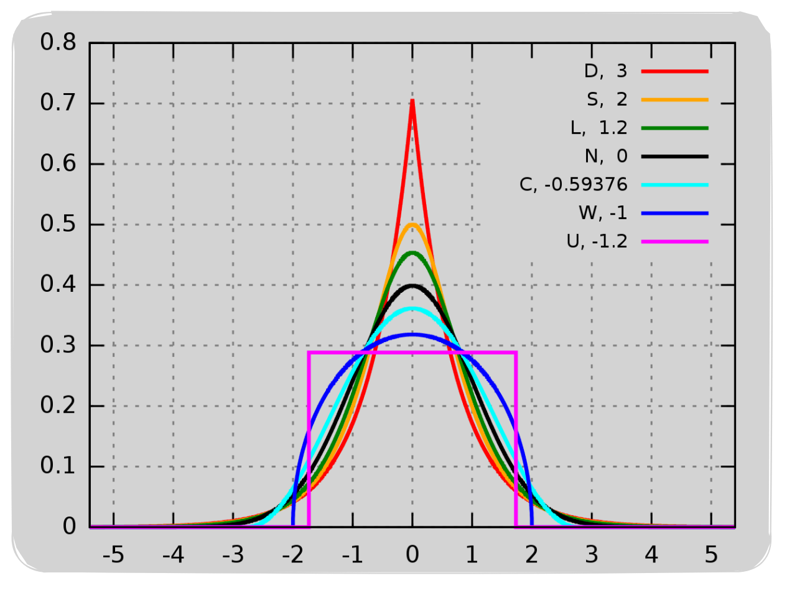
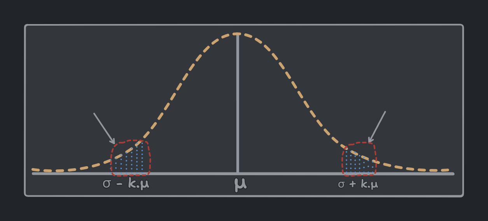

<!-- 

    Author : Kannan Jayachandran
    File : Probability.md
     
 -->


<h1 align="center" style="color: orange"> PROBABILITY </h1>

## Experiment 🧪

An outcome is the result of an experiment. For instance, when we flip a coin, the outcome can be either heads or tails.

## Outcome 🎲

An outcome is the result of an experiment. For example, if we toss a coin, the outcome can be either heads or tails.

## Sample Space (Ω) 📊

The sample space is a set that includes all the possible outcomes of a random experiment. In the case of a coin toss, the sample space is {heads, tails} or when rolling a fair six-sided die, the sample space is {1, 2, 3, 4, 5, 6}.

## Event 📆

An event is a collection of one or more outcomes of an experiment. It is a subset of the sample space. For example, when tossing a coin, the event of getting a head is a subset of the sample space. $\color{#F99417}\{h\}\subset \{h, t\}$. We use the intersection ($\color{#F99417}\cap$) of both events when they both occur, and the union ($\color{#F99417}\cup$) when either of them occurs.


## Event space (F) 📆

The collection of all possible events. It is a subset of the sample space that consists of specific outcomes or combinations of outcomes

For example, if we toss a coin, the event space is {∅, {head}, {tails}, {head, tails}} or the event of getting an even number when rolling the die, the event space would be {2, 4, 6}

## Random Variable (X) 🔢

A random variable is a variable that can assume various values, and the specific value it takes is subject to chance or randomness. They are of two types; `discrete` and `continuous`. **Discrete random variables** can be represented by a **probability distribution table**, while **continuous random variables** can be represented by a **probability density function**.

| Discrete Random Variable | Continuous Random Variable |
| :----------------------: | :------------------------: |
| A random variable which represents outcomes that can be counted or enumerated and are typically associated with countable or distinct values (Typically whole numbers) .| A random variable which represents outcomes that can be measured and can take on any value in a given range (Any real number) . | 
|       Whole number       |         Real number        |
|       Countable set      |       Uncountable set      |
|       Finite set         |         Infinite set       |

## Calculating Probability

Generally we would calculate probability by using the following idea;

$$P(E) = \frac{\texttt {Number of favorable outcomes}}{\texttt{Total number of possible outcomes}}$$

And probability would always turns out to be a number between 0 and 1. Where 0 indicates impossibility and 1 indicates certainty.

<details>

<summary> <b> Example </b> </summary>

_Now consider the following experiment of throwing a fair-six-faced die. {1, 2, 3, 4, 5, 6}. Compute the probability that you get a number that is; less than 5 and an even number._

- `Sample space` : {1, 2, 3, 4, 5, 6}

- `Events` : $\color{#F99417}E_1$ = {1, 2, 3, 4} and $\color{#F99417}E_2$ = {2, 4, 6}

- `Event space` : $\color{#F99417}F$ = {$\color{#F99417}E_1$, $\color{#F99417}E_2$} $\rightarrow$ $\color{#F99417} E_1 \cap E_2$  = {2, 4}

$$P(E) = \frac{2}{6} = \frac{1}{3}$$

</details>

The above equation of P(E) essentially tells us what probability is; **Probability is a measure of the size of a set**. If you understand this, you're sort of done with probability. This is what I would call the essence of probability.

We have a sample space $\color{#F99417}S$ and an event space $\color{#F99417}F$, all probability does is represent the event space relative to the sample space as a ratio. So in turn we are measuring the size of the event space relative to the sample space.


Hence we can define probability as `probability
is a measure of the size of a set`


## Population and Sample  

Population can be any set of objects or events that we are interested in studying. It can be finite or infinite. Often we use the symbol $\color{#F99417}N$ to denote it.

Sample is a subset of the population. We typically denote it using the symbol $\color{#F99417}n$.   


`Sampling` is the process of selecting a subset of individuals from a population to estimate characteristics of the whole population. While taking sample from a population we need to be careful about the following things;

1. The sample should be `representative` of the population.

2. The `sample size` should be large enough to represent the population and small enough to be manageable or practical.

3. The sample should be `selected randomly`.

4. The sample should be selected without replacement. It maintains the `integrity of the sample's ` representativeness.

> These might not always be possible, but we should try to achieve as many as possible.

## Probability Distribution

A probability distribution describes how the values of a random variable are distributed or spread out. It is a mathematical function that gives the probabilities of occurrence of different possible outcomes for an experiment.

> It is important to distinguish between the distribution of the individual data points, known as the `data distribution`, and the distribution of a sample statistic known as the `sampling distribution`.

## Probability Density Function (PDF)

It provides the probability distribution of a continuous random variable within a certain range. Types of PDFs are `Normal`, `Uniform`, `Exponential`, etc. PDF must always satisfy the following two conditions;

1. Always be non-negative $\color{#F99417}f(x) \ge 0$ for all $\color{#F99417}x$

2. The total area under the PDF curve over the entire range of possible values is equal to $\color{#F99417}1$.

For a continuous random variable, the PDF describes the likelihood of the variable taking on a specific value. Which means  the probability of `x` falling within a small interval, say $\color{#F99417}[a, b]$, is given by the integral of the PDF over that interval.

$$P(a\le x \le b) = \int_{a}^{b}f(x)dx$$

> PDF curve represent the count of the data points at each point.


> PDF of Gaussian distribution image 

## Cumulative Distribution Function (CDF)

CDF, denoted as $f(x)$ for a random variable `x`, is a function that describes the probability that `x` will take a value less than or equal to a given number `x`. In other words, it gives you the cumulative probability up to a certain point.


> CDF of Gaussian distribution image

Mathematically we can define CDF as;

$$f(x) = P(X\le x)$$

**_While PDF tells us the count of the data points at each point, CDF tells us the count of the data points at or below each point._**

Some important features of CDF are;

- CDF is a monotonically increasing function. ie., As `x` increases, $f(x)$ can only increase or remain the same.

- As shown in the above diagram, CDF in a normal distribution is a smooth `S` shaped curve 

## Normal or Gaussian Distribution

Gaussian distribution is one of the most common and important distributions. It has a bell-shaped curve and is characterized by two parameters: mean ($\color{#F99417}\mu$) and standard deviation ($\color{#F99417}\sigma$) we use the symbol $\color{#F99417}N(\mu, \sigma)$ to denote a normal distribution and variance ($\color{#F99417}\sigma^2$) is generally used in place of standard deviation for mathematical convenience. Therefore mathematically we can represent a normal distribution as 

$$X\sim N(\mu, \sigma^2)$$

> Read as `X` follows a normal distribution with $\color{#F99417}\mu$ and $\color{#F99417}\sigma^2$ as parameters.

Here we want to look at `probability density` instead of probability because for a range (Continuous distribution), the probability of a discrete value `x` is zero, because there are infinite number of values between any two values. 

$$P(x) = \frac{1}{\sqrt{2\pi}\sigma}exp\{\frac{-(x-\mu^2)}{2\sigma^2}\}$$

where $exp\{\frac{-(x-\mu^2)}{2\sigma^2}\}$ is $\large e^{-\frac{1}{2}(\frac{x-\mu}{\sigma})^2}$

$\large \frac{1}{\sqrt{2\pi}\sigma}$ is the normalization constant 

$P(x)$ is $P(X=x)$ in which $\color{#F99417}X$ is a random variable and $\color{#F99417}x$ is a value of $\color{#F99417}X$.

More generally, we can write the Gaussian distribution as;

$$\huge f(x) = \frac{1}{\sigma\sqrt{2\pi}}e^{-\frac{1}{2}(\frac{x-\mu}{\sigma})^2}$$

This formula can be used to calculate the probability density for a given value `x` in a normal distribution with mean $\color{#F99417}\mu$ and standard deviation $\color{#F99417}\sigma$. Since we represents probability density as a function of `x`, we have written the equation like above.

**Observations**

- As the value of `x` moves away from $\color{#F99417}\mu$, the probability density decreases (y decreases), and it reduces exponential of $\color{#F99417}-x^2$.
> $p(x) = y = exp\{-x^2\}$

- The probability density is symmetric about $\color{#F99417}\mu$.
 
Gaussian distribution is important as many natural phenomena follow this distribution. For example, the height of people, the weight of people, the marks of students in a class, etc.


## Empirical rule or 68–95–99.7 rule


Let's say we have a normal distribution $X \sim N(\mu, \sigma^2)$. From the above diagram we can see that, $\mu = 0$ and $\sigma = 2$. Where $X$ is a random variable. Provided these 3 key information, we can infer a lot of things about the data.

1. Around $68\%$ of the data lies within $\mu \pm \sigma$ $[-1\sigma, 1\sigma]$.

2. Around $95\%$ of the values lie within $\mu \pm 2\sigma$ $[-2\sigma, 2\sigma]$.

3. Around $99.7\%$ of the values lie within $\mu \pm 3\sigma$ $[-3\sigma, 3\sigma]$.


**[1 $\sigma$ = 68%]**

**[2 $\sigma$ = 95%]**

**[3 $\sigma$ = 99.7%]**


It does not matter how many data points we have the above observations always holds true.

`Empirical formula` is used to calculate the percentage of values that lie within a range of standard deviations from the mean in a normal distribution.

## Symmetric Distribution and Skewness

A distribution is said to be **symmetric** if the right half of the distribution is a mirror image of the left half. If number of data points on one half is equal to the number of data points on the other half. For example, the normal distribution is symmetric. 

A distribution is said to be **skewed** if the right half of the distribution is not a mirror image of the left half. If number of data points on one half is not equal to the number of data points on the other half. For example, the exponential distribution is skewed. There are two types of skewness;

1. **Right Skewed or Positive Skewed** : If the right tail is longer than the left tail, the distribution is said to be right skewed. In this case, the **mean** is greater than the **median**. 

2. **Left Skewed or Negative Skewed** : If the left tail is longer than the right tail, the distribution is said to be left skewed. In this case, the **mean** is less than the **median**.


> Skewness is a measure of symmetry, or more precisely, the lack of symmetry. 

## Kurtosis

Kurtosis basically tell us about the peakedness of our distribution. It is a measure of the heaviness of the tails of a distribution. 



From the above image, we can see that higher the kurtois, higher the peakedness of the distribution.

- The normal distribution has a kurtosis of 3. A distribution with a kurtosis of 3 is called a **mesokurtic distribution**. 

- A distribution with a kurtosis of less than 3 is called a **platykurtic distribution**. 

- A distribution with a kurtosis of greater than 3 is called a **leptokurtic distribution**.

## Standard Normal Variate

Standard normal variate is a random variable that has a normal distribution with a mean of zero and a standard deviation of one. It is denoted as $\color{#F99417}Z$. 

$$\large z\sim N(0, 1)$$
> Read as `z` is a random variable which follows a normal distribution with mean 0 and standard deviation 1.

The process of converting a normal distribution to a standard normal distribution is called **standardization**. 

Let us consider the iris dataset, with `PetalLengthCm` as the feature. We can represent this normal distribution with mean $\color{#F99417}\mu$ and standard deviation $\color{#F99417}\sigma$ as; 

$$X \sim N(\mu, \sigma^2)$$ 

where $X$ is a random variable that can take on any value in the range $[x_1, x_2, ..., x_{50}]$. Then we can standardize this distribution as;

$\large x_i$` = $\large \frac{x_i - \mu}{\sigma} \;\;\forall \;i= 1, 2, .., 50$ 

where $\large x_i$` is the standardized value of $\large x_i$.

## Kernel Density Estimation (KDE)

KDE is the application of kernel smoothing to estimate Probability density function of a random variable based on kernel as weights. It is also termed the _Parzen–Rosenblatt window method_.


The image on the left side indicate a histogram which is a discrete representation of the data. The image on the right side indicate a KDE which is a continuous representation of the data. We construct a `kde` by placing a kernel at each data point and then summing up the kernels to get a smooth curve. We are using a Gaussian kernel here. The variance of each kernel is known as the `bandwidth`. The bandwidth is a hyperparameter that controls the smoothness of the curve. Setting a higher bandwidth will result in a smoother curve, while setting a lower bandwidth will result in a more jagged curve.

> Kernels are functions that are used to calculate the weights of the data points.

## Sampling Distribution

Sampling distribution is the probability distribution of a samples; that comes from choosing random samples of a given population. We will get a better idea of what it is by looking at the process of sampling distribution.

- Consider a population with a distribution (can be any distribution), we are drawing samples from this population.

- Select random sample of size `n` from the population.

- Calculate the mean of the sample. (we can also calculate other statistics like median, mode, standard deviation, etc.)

- Repeat the above steps `M` times.

- Develop a frequency distribution of the sample means or the statistics calculated.

- Plot the frequency distribution of the sample statistic.

**If we have `M` sample means $\bar x_i = \bar x_1, \bar x_2, \bar x_3, ...\bar x_n$ then the sampling distribution of the sample means is the probability distribution of these sample means.**

## Central Limit Theorem (CLT)

CLT is one of the most important theorems in statistics. It states that, if we have a population with finite mean $\color{#F99417}\mu$ and variance $\color{#F99417}\sigma^2$ and take sufficiently large random samples from the population of size $\color{#F99417}n$  with replacement $\color{#F99417}m$ times, then the distribution of the sample means (Sampling distribution of sample means) will be approximately normally distributed.

$$OR$$

$$ \bar x_i \sim N(\mu, \frac{\sigma^2}{n})\;\;as\;\; {n\rightarrow \infin}$$ 


where $\color{#F99417}\bar x_i$ is the sampling distribution of the sample means, $\color{#F99417}N$ is the normal distribution with mean $\color{#F99417}\mu$ (which is same as the population mean) and variance $\color{#F99417}\frac{\sigma^2}{n}$ (where $\color{#F99417}\sigma^2$ is the population variance and $\color{#F99417}n$ is the sample size).

> We generally consider CLT to be valid if the sample size ($\color{#F99417}n$) is greater than 30.

## Quantile-Quantile (QQ) Plot

QQ plot is a graphical technique for easily determining whether a random variable is Gaussian or normally distributed. Consider the random variable $\color{#F99417}x$, with samples/observations $\color{#F99417}\bar x_1, \bar x_2, \bar x_3, ...\bar x_n$.

- First sort them in ascending order. $\color{#F99417}\bar x`_1, \bar x`_2, \bar x`_3, ...\bar x`_n$.

- Calculate the percentile. $\color{#F99417}x^{(1)}, x^{(2)}, x^{(3)}, ...x^{(n)}$. We get the first percentile at $\color{#F99417}\bar x`_{\frac{n}{100}}$

> If we have 100 data points, then the first percentile is the first data point. If we have 1000 data points, then the first percentile is the 10th data point.

- Create $Y \sim N(0, 1)$, where $\color{#F99417}Y$ is a random variable that follows a standard Gaussian distribution, with mean $\color{#F99417}\mu = 0$ and standard deviation $\color{#F99417}\sigma = 1$.

- Create $\color{#F99417}n$ observations from the $\color{#F99417}Y$ distribution. Sort them in ascending order and find the percentile. $\color{#F99417}y^{(1)}, y^{(2)}, y^{(3)}, ...y^{(n)}$. These are also called `theoretical quantiles`.

- Now plot the $\color{#F99417}x^{(i)}$ vs $\color{#F99417}y^{(i)}$.

If the plot is a straight line (approx.), then the random variable $\color{#F99417}x$ is normally distributed.

> Q-Q plot can also help us in determining whether we have same distributions; given two random variables $\color{#F99417}x$ and $\color{#F99417}y$.

## Chebyshev's Inequality

Chebyshev's inequality is a fundamental theorem in probability that defines an upper bound on how much of a distribution lies within a given range from the mean. Formally we can define chebyshev's inequality as follows;

Consider the random variable $\color{#F99417}X$, with finite mean $\color{#F99417}\mu$ and standard deviation $\color{#F99417}\sigma$ which is non-zero and finite. We **don't know** the distribution of $\color{#F99417}X$. Then we can write the probability of $\color{#F99417}X$ lying within $k$ standard deviations of the mean as;

$$P(|X-\mu|\ge k\sigma)\le \frac{1}{k^2}$$
    
where $\color{#F99417}k$ is any positive real number.



The above equation simply says that the probability of $\color{#F99417}X$ lying in the marked region is less than or equal to $\color{#F99417}\frac{1}{k^2}$. We can interpret this in another way as well; 

$$P(\mu - k\sigma < X < \mu+k\sigma)\ge 1 -\frac{1}{k^2}$$


> Chebychev's inequality is a very powerful in practical applications because it can be applied to any distribution. Unlike the empirical rule, it does not pin point the exact percentage, instead gives then upper bound of the percentage.

## Uniform Distribution

Uniform distribution is a probability distribution in which all the outcomes are equally likely. It can be of two types; `discrete uniform distribution` and `continuous uniform distribution`.

> _If a random variable is discrete and it follows uniform distribution, then we call it `discrete uniform distribution` and if a random variable is continuous and it follows uniform distribution, then we call it `continuous uniform distribution`_.

In discrete uniform distribution, outcomes are discrete and have same probability. For example if we toss a fair coin, we will get either heads or tails. Both of these outcomes have the same probability of occurring. We wont get any other outcome.

In continuous uniform distribution, outcomes are continuous and infinite. An example for continuous uniform distribution is a random number generator. 

We can write uniform distribution as $\color{#F99417}X \sim U(a, b)$, where $a$ and $b$ are the lower and upper limits of the distribution. They are also called the parameters of the uniform distribution. The probability density function of a uniform distribution is given by;

$$f(x) = \frac{1}{b-a}$$

where $a \le x \le b$.

The number of outcomes in a uniform distribution is defined as $\color{#F99417}n = b-a+1$. The probability of each outcome is $\color{#F99417}\frac{1}{n}$. The mean and median of random variable from a uniform distribution is $\color{#F99417}\frac{a+b}{2}$

<!-- TODO Create a table for mean, median, std.dev, variance. parameters, etc for each distributions - Pdf vs pmf -->

## Bernoulli Distribution

Bernoulli distribution is a type of discrete probability distribution that can have only two possible outcomes. It is a special case of binomial distribution where a single experiment is conducted. It is a discrete distribution with two possible outcomes, `success` and `failure`. It is also called a `two-point distribution` or `two-point random variable`. 

We can write Bernoulli distribution as $\color{#F99417}X \sim Bernoulli(p)$, where $p$ is the probability of success. The probability mass function of a Bernoulli distribution is given by;

$$f(x) = p^x(1-p)^{1-x}$$

where $x \in \{0, 1\}$.

<!-- ## Binomial Distribution

$$\huge \color{red}FILL$$ -->

<!-- Fill this section like above -->


<!--Section: Probability section links -->


<!--Section: Statistics -->


<!-- TODO: Add the following topics

 <details>
<summary> <b> Un-edited </b> </summary>

## Probability Distribution

A probability distribution is a function that describes the likelihood of obtaining the possible values that a random variable can assume. In other words, the values of the variable vary based on the underlying probability distribution.


<h1 align="center" style="color: lightgrey"> STATISTICS </h1>


# PDF

PDF stands for Probability Density Function. It is a function that describes the relative likelihood for this random variable to take on a given value. It gives a smooth curve of the probability density function.
We use KDE to estimate the PDF.

# CDF

CDF stands for Cumulative Distribution Function. It is the probability that the variable takes a value less than or equal to x. It gives a step function of the cumulative distribution function.

While pdf shows the count (actually probability) at each point, cdf shows the count (actually probability) at or below each point. If we differentiate the CDF, we get the PDF and if we integrate PDF, we get the CDF.


# Univariate Analysis

Univariate analysis is the simplest form of analyzing data. “Uni” means “one”, so in other words your data has only one variable. It doesn’t deal with causes or relationships (unlike regression ) and it’s major purpose is to describe; It takes data, summarizes that data and finds patterns in the data.


## Mean $\mu$

The mean is the average of the numbers. In other words it is the sum of all values divided by the number of values.

$$\mu = \sum_{i=0}^{n}\frac{x_i}{n}$$

It can be affected by outliers.

Mean is the best measure of central tendency for symmetric distributions.

## Spread or Variability

Spread simply tells us what is the range of the data. It is the difference between the highest and lowest values in a data set. It shows how each of the data points are spread out from the mean.

we generally use the square of the difference between each data point and the mean. This is because the sum of the differences from the mean is always zero. So we square the differences to get rid of the negative signs.


$$var = \frac{1}{n}\sum_{i=0}^{n}(x_i-\mu)^2$$

Therefore variance is the average of the squared differences from the mean.

if we take the square root of the variance, we get the standard deviation. It is the most commonly used measure of spread. 

$$\sigma = \sqrt{\frac{1}{n}\sum_{i=0}^{n}(x_i-\mu)^2}$$

# Standard deviation

A lower std. dev means the data points tends to be close to the mean. which means the data is less spread out. 

A higher std. dev means the data points tends to be far from the mean. which means the data is more spread out. A higher std.dev is also an indicator of outliers or extreme values.

## Median

The median is the middle value in a data set. It is the value for which 50% of the values are smaller and 50% are bigger. It is not affected by outliers.

$$median = \frac{n+1}{2}^{th} value$$


Usually we sort the data and take the middle value. If the number of values is even, we take the average of the two middle values.

Median can get affected by outliers only if more than 50% of the data is outliers.

## Percentile

Percentile is the value below which a percentage of data falls. For example, the 20th percentile is the value (or score) below which 20% of the observations may be found. ie.; it tells that 20% of the observations are below this value.

50th percentile is the same as median.

25th, 50th, and 75th, 100th percentiles are called Quantiles.

```python

np.percentile(setosa_df['PetalLengthCm'], np.arange(0, 100, 25))

np.percentile(setosa_df['PetalLengthCm'], 99)
```

Median absolute deviation is similar to standard deviation but it is more robust to outliers.

```python
from statsmodels import robust

robust.mad(setosa_df['PetalLengthCm'])
```

## Inter Quartile Range (IQR)

IQR is the difference between the 75th and 25th percentiles. It is the range of the middle 50% of the data. It is not affected by outliers.

```python
Q1 = np.percentile(setosa_df['PetalLengthCm'], 25)

</details>
 -->
