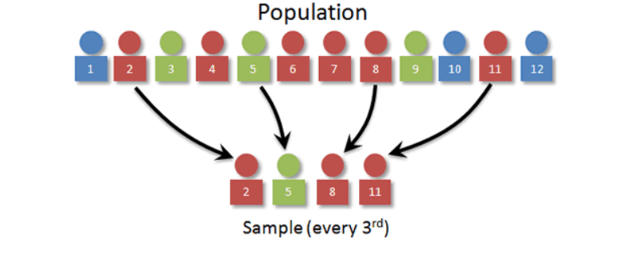

<h1 align="center"> Probability and Statistics </h1>

**Probability** is the mathematical framework used to model _uncertainty_. It provides a way to quantify and reason about uncertainty in various scenarios. It is the likelihood of an event occurring. **Statistics** on the other hand is the field that deals with collecting, analyzing, interpreting, presenting, and organizing data. It's a field that applies probabilistic concepts to real-world data analysis and decision-making. Probability theory is highly abstract and formalized, while statistics is more or less an applied mathematical discipline. 

<h1 align="center" style="color: lightgrey"> PROBABILITY </h1>

## Experiment

An experiment is a process that produces an outcome. For example, tossing a coin, rolling a die, etc.

## Outcome

An outcome is the result of an experiment. For example, if we toss a coin, the outcome can be either heads or tails.

## Sample Space Ω

A sample space is a set containing all possible outcomes of an experiment. For example, if we toss a coin, the sample space is {head, tails}.

## Event

An event is a subset of the sample space. For example, if we toss a coin, the event of getting a head is a subset of the sample space. We take take the intersection $\cap$ of both events, if both of them occur. We take the union $\cup$ of both events, if either of them occur.


## Event space F

The collection of all possible events. For example, if we toss a coin, the event space is {∅, {head}, {tails}, {head, tails}}.

## Random Variable

Random variable is a variable that can take on different values, and the specific value it assumes is subject to chance or randomness. There are two main types of random variables: `discrete` and `continuous`.

| Discrete Random Variable | Continuous Random Variable |
| :----------------------: | :------------------------: |
| A random variable which represents outcomes that can be counted or enumerated and are typically associated with countable or distinct values (Typically whole numbers) .| A random variable which represents outcomes that can be measured and can take on any value in a given range (Any real number) . | 
|       Whole number       |         Real number        |
|       Countable set      |       Uncountable set      |
|       Finite set         |         Infinite set       |


- _Now consider the following `experiment` of throwing a fair die. It has 6 faces : {1, 2, 3, 4, 5, 6}. Compute the probability that you get a number that is; `less than 5` and `an even number`._

    - `Sample space` : {1, 2, 3, 4, 5, 6}

    - `Events` : $E_1$ = {1, 2, 3, 4} and $E_2$ = {2, 4, 6}

    Taking the intersection of these two events, we get `E` : {2, 4}

    $$P(E) = \frac{2}{6} = \frac{1}{3}$$

Which can be interpreted as; **Size of the event `E` relative to sample space `S` is in the ratio 1:3.** Here we are essentially measuring the size of the the event space and the sample space. All the events and the events formed by combining them are subsets of the sample space.

Hence we can define probability as `probability
is a measure of the size of a set`


**Probability is a number between 0 and 1, where, 0 indicates impossibility and 1 indicates certainty.**

## Population and Sample

Population represents the entire set of objects or outcomes about which information is collected. It is large, defined (sometimes theoretical) set of data.


While taking sample from a population we need to be careful about the following things;

1. The sample should be representative of the population.

2. The sample size should be large enough to represent the population and small enough to be manageable or practical.

3. The sample should be selected randomly.

4. The sample should be selected without replacement.

**Types of Sampling**

1. **Simple Random Sampling** : Simple random sampling is the process of sampling in which each member of the population has equal chance of being selected. The sample that results is called a _simple random sample_.


2. **Stratified Sampling** : Stratified sampling is the process in which the population (N) is divided into  non-overlapping groups.


3. **Systematic sampling** : Systematic sampling is a process in which the members are selected from a population at `nth` interval.



4. **Convinience sampling** : The process of taking samples from the population who has expertise in the sector.

5. **Cluster sampling** : Cluster sampling is a process in which the population is divided into clusters and the researcher randomly selects the clusters to form a sample. This is often used when it's impractical to sample individuals.

> When a sample misrepresents the populations we call it a **sample bias** or **sampling bias**.

## Probability Distribution

A probability distribution describes how the values of a random variable are distributed or spread out. It is a mathematical function that gives the probabilities of occurrence of different possible outcomes for an experiment.

> It is important to distinguish between the distribution of the individual data points, known as the `data distribution`, and the distribution of a sample statistic known as the `sampling distribution`.

## Probability Density Function (PDF)

It provides the probability distribution of a continuous random variable within a certain range. Types of PDFs are `Normal`, `Uniform`, `Exponential`, etc. PDF must always satisfy the following two conditions;

1. Always be non-negative $\color{#F99417}f(x) \ge 0$ for all $\color{#F99417}x$

2. The total area under the PDF curve over the entire range of possible values is equal to $\color{#F99417}1$.

For a continuous random variable, the PDF describes the likelihood of the variable taking on a specific value. Which means  the probability of `x` falling within a small interval, say $\color{#F99417}[a, b]$, is given by the integral of the PDF over that interval.

$$P(a\le x \le b) = \int_{a}^{b}f(x)dx$$

> PDF curve represent the count of the data points at each point.


> PDF of Gaussian distribution image 

## Cumulative Distribution Function (CDF)

CDF, denoted as $f(x)$ for a random variable `x`, is a function that describes the probability that `x` will take a value less than or equal to a given number `x`. In other words, it gives you the cumulative probability up to a certain point.


> CDF of Gaussian distribution image

Mathematically we can define CDF as;

$$f(x) = P(X\le x)$$

**_While PDF tells us the count of the data points at each point, CDF tells us the count of the data points at or below each point._**

Some important features of CDF are;

- CDF is a monotonically increasing function. ie., As `x` increases, $f(x)$ can only increase or remain the same.

- As shown in the above diagram, CDF in a normal distribution is a smooth `S` shaped curve 

## Normal or Gaussian Distribution

Gaussian distribution is one of the most common and important distributions. It has a bell-shaped curve and is characterized by two parameters: mean ($\color{#F99417}\mu$) and standard deviation ($\color{#F99417}\sigma$) we use the symbol $\color{#F99417}N(\mu, \sigma)$ to denote a normal distribution and variance ($\color{#F99417}\sigma^2$) is generally used in place of standard deviation for mathematical convenience. Therefore mathematically we can represent a normal distribution as 

$$X\sim N(\mu, \sigma^2)$$

> Read as `X` follows a normal distribution with $\color{#F99417}\mu$ and $\color{#F99417}\sigma^2$ as parameters.

Here we want to look at `probability density` instead of probability because for a range (Continuous distribution), the probability of a discrete value `x` is zero, because there are infinite number of values between any two values. 

$$P(x) = \frac{1}{\sqrt{2\pi}\sigma}exp\{\frac{-(x-\mu^2)}{2\sigma^2}\}$$

where $exp\{\frac{-(x-\mu^2)}{2\sigma^2}\}$ is $\large e^{-\frac{1}{2}(\frac{x-\mu}{\sigma})^2}$

$\large \frac{1}{\sqrt{2\pi}\sigma}$ is the normalization constant 

$P(x)$ is $P(X=x)$ in which $\color{#F99417}X$ is a random variable and $\color{#F99417}x$ is a value of $\color{#F99417}X$.

More generally, we can write the Gaussian distribution as;

$$\huge f(x) = \frac{1}{\sigma\sqrt{2\pi}}e^{-\frac{1}{2}(\frac{x-\mu}{\sigma})^2}$$

This formula can be used to calculate the probability density for a given value `x` in a normal distribution with mean $\color{#F99417}\mu$ and standard deviation $\color{#F99417}\sigma$. Since we represents probability density as a function of `x`, we have written the equation like above.

**Observations**

- As the value of `x` moves away from $\color{#F99417}\mu$, the probability density decreases (y decreases), and it reduces exponential of $\color{#F99417}-x^2$.
> $p(x) = y = exp\{-x^2\}$

- The probability density is symmetric about $\color{#F99417}\mu$.
 
Gaussian distribution is important as many natural phenomena follow this distribution. For example, the height of people, the weight of people, the marks of students in a class, etc.


## Empirical rule or 68–95–99.7 rule


Let's say we have a normal distribution $X \sim N(\mu, \sigma^2)$. From the above diagram we can see that, $\mu = 0$ and $\sigma = 2$. Where $X$ is a random variable. Provided these 3 key information, we can infer a lot of things about the data.

1. Around $68\%$ of the data lies within $\mu \pm \sigma$ $[-1\sigma, 1\sigma]$.

2. Around $95\%$ of the values lie within $\mu \pm 2\sigma$ $[-2\sigma, 2\sigma]$.

3. Around $99.7\%$ of the values lie within $\mu \pm 3\sigma$ $[-3\sigma, 3\sigma]$.


**[1 $\sigma$ = 68%]**

**[2 $\sigma$ = 95%]**

**[3 $\sigma$ = 99.7%]**


It does not matter how many data points we have the above observations always holds true.

`Empirical formula` is used to calculate the percentage of values that lie within a range of standard deviations from the mean in a normal distribution.

## Symmetric Distribution and Skewness

A distribution is said to be **symmetric** if the right half of the distribution is a mirror image of the left half. If number of data points on one half is equal to the number of data points on the other half. For example, the normal distribution is symmetric. 

A distribution is said to be **skewed** if the right half of the distribution is not a mirror image of the left half. If number of data points on one half is not equal to the number of data points on the other half. For example, the exponential distribution is skewed. There are two types of skewness;

1. **Right Skewed or Positive Skewed** : If the right tail is longer than the left tail, the distribution is said to be right skewed. In this case, the **mean** is greater than the **median**. 

2. **Left Skewed or Negative Skewed** : If the left tail is longer than the right tail, the distribution is said to be left skewed. In this case, the **mean** is less than the **median**.


> Skewness is a measure of symmetry, or more precisely, the lack of symmetry. 

## Kurtosis

Kurtosis basically tell us about the peakedness of our distribution. It is a measure of the heaviness of the tails of a distribution. 


From the above image, we can see that higher the kurtois, higher the peakedness of the distribution.

- The normal distribution has a kurtosis of 3. A distribution with a kurtosis of 3 is called a **mesokurtic distribution**. 

- A distribution with a kurtosis of less than 3 is called a **platykurtic distribution**. 

- A distribution with a kurtosis of greater than 3 is called a **leptokurtic distribution**.

## Standard Normal Variate

Standard normal variate is a random variable that has a normal distribution with a mean of zero and a standard deviation of one. It is denoted as $\color{#F99417}Z$. 

$$\large z\sim N(0, 1)$$
> Read as `z` is a random variable which follows a normal distribution with mean 0 and standard deviation 1.

The process of converting a normal distribution to a standard normal distribution is called **standardization**. 

Let us consider the iris dataset, with `PetalLengthCm` as the feature. We can represent this normal distribution with mean $\color{#F99417}\mu$ and standard deviation $\color{#F99417}\sigma$ as; 

$$X \sim N(\mu, \sigma^2)$$ 

where $X$ is a random variable that can take on any value in the range $[x_1, x_2, ..., x_{50}]$. Then we can standardize this distribution as;

$\large x_i$` = $\large \frac{x_i - \mu}{\sigma} \;\;\forall \;i= 1, 2, .., 50$ 


<!-- <details>
<summary> <b> Un-edited </b> </summary>

## Probability Distribution

A probability distribution is a function that describes the likelihood of obtaining the possible values that a random variable can assume. In other words, the values of the variable vary based on the underlying probability distribution.


<h1 align="center" style="color: lightgrey"> STATISTICS </h1>


# PDF

PDF stands for Probability Density Function. It is a function that describes the relative likelihood for this random variable to take on a given value. It gives a smooth curve of the probability density function.
We use KDE to estimate the PDF.

# CDF

CDF stands for Cumulative Distribution Function. It is the probability that the variable takes a value less than or equal to x. It gives a step function of the cumulative distribution function.

While pdf shows the count (actually probability) at each point, cdf shows the count (actually probability) at or below each point. If we differentiate the CDF, we get the PDF and if we integrate PDF, we get the CDF.


# Univariate Analysis

Univariate analysis is the simplest form of analyzing data. “Uni” means “one”, so in other words your data has only one variable. It doesn’t deal with causes or relationships (unlike regression ) and it’s major purpose is to describe; It takes data, summarizes that data and finds patterns in the data.


## Mean $\mu$

The mean is the average of the numbers. In other words it is the sum of all values divided by the number of values.

$$\mu = \sum_{i=0}^{n}\frac{x_i}{n}$$

It can be affected by outliers.

Mean is the best measure of central tendency for symmetric distributions.

## Spread or Variability

Spread simply tells us what is the range of the data. It is the difference between the highest and lowest values in a data set. It shows how each of the data points are spread out from the mean.

we generally use the square of the difference between each data point and the mean. This is because the sum of the differences from the mean is always zero. So we square the differences to get rid of the negative signs.


$$var = \frac{1}{n}\sum_{i=0}^{n}(x_i-\mu)^2$$

Therefore variance is the average of the squared differences from the mean.

if we take the square root of the variance, we get the standard deviation. It is the most commonly used measure of spread. 

$$\sigma = \sqrt{\frac{1}{n}\sum_{i=0}^{n}(x_i-\mu)^2}$$

# Standard deviation

A lower std. dev means the data points tends to be close to the mean. which means the data is less spread out. 

A higher std. dev means the data points tends to be far from the mean. which means the data is more spread out. A higher std.dev is also an indicator of outliers or extreme values.

## Median

The median is the middle value in a data set. It is the value for which 50% of the values are smaller and 50% are bigger. It is not affected by outliers.

$$median = \frac{n+1}{2}^{th} value$$


Usually we sort the data and take the middle value. If the number of values is even, we take the average of the two middle values.

Median can get affected by outliers only if more than 50% of the data is outliers.

## Percentile

Percentile is the value below which a percentage of data falls. For example, the 20th percentile is the value (or score) below which 20% of the observations may be found. ie.; it tells that 20% of the observations are below this value.

50th percentile is the same as median.

25th, 50th, and 75th, 100th percentiles are called Quantiles.

```python

np.percentile(setosa_df['PetalLengthCm'], np.arange(0, 100, 25))

np.percentile(setosa_df['PetalLengthCm'], 99)
```

Median absolute deviation is similar to standard deviation but it is more robust to outliers.

```python
from statsmodels import robust

robust.mad(setosa_df['PetalLengthCm'])
```

## Inter Quartile Range (IQR)

IQR is the difference between the 75th and 25th percentiles. It is the range of the middle 50% of the data. It is not affected by outliers.

```python
Q1 = np.percentile(setosa_df['PetalLengthCm'], 25)

</details>
 -->
