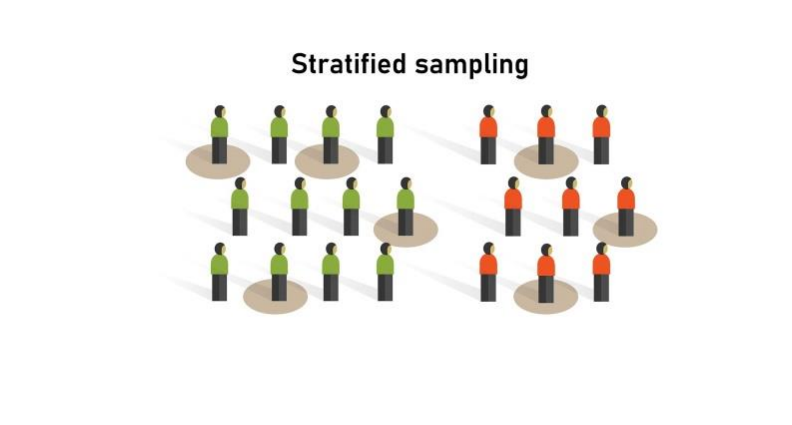

<h1 align="center"> Probability and Statistics </h1>

**Probability** is the mathematical framework used to model _uncertainty_. It provides a way to quantify and reason about uncertainty in various scenarios. It is the likelihood of an event occurring. **Statistics** on the other hand is the field that deals with collecting, analyzing, interpreting, presenting, and organizing data. It's a field that applies probabilistic concepts to real-world data analysis and decision-making. Probability theory is highly abstract and formalized, while statistics is more or less an applied mathematical discipline. 

<h1 align="center" style="color: lightgrey"> PROBABILITY </h1>

## Fundamental terms in Probability

### Experiment

An experiment is a process that produces an outcome. For example, tossing a coin, rolling a die, etc.

### Outcome

An outcome is the result of an experiment. For example, if we toss a coin, the outcome can be either heads or tails.

### Sample Space Ω

A sample space is a set containing all possible outcomes of an experiment. For example, if we toss a coin, the sample space is {head, tails}.

### Event

An event is a subset of the sample space. For example, if we toss a coin, the event of getting a head is a subset of the sample space.

### Event space F

The collection of all possible events. For example, if we toss a coin, the event space is {∅, {head}, {tails}, {head, tails}}.

_Now consider the following `experiment` of throwing a fair die. It has 6 faces : {1, 2, 3, 4, 5, 6}. Compute the probability that you get a number that is; `less than 5` and `an even number`._

- `Sample space` : {1, 2, 3, 4, 5, 6}

- `Events` : $E_1$ = {1, 2, 3, 4} and $E_2$ = {2, 4, 6}

Taking the intersection of these two events, we get `E` : {2, 4}

$$P(E) = \frac{2}{6} = \frac{1}{3}$$

Which can be interpreted as; **Size of the event `E` relative to sample space `S` is in the ratio 1:3.** Here we are essentially measuring the size of the the event and the sample space. Also if we take a look at the two event $E_1$ and $E_2$,  and the event formed by combining them both $E_1 \cap E_2$, all of them are subsets of the sample space.

Hence we can define probability as `probability
is a measure of the size of a set`


**Probability is a number between 0 and 1, where, 0 indicates impossibility and 1 indicates certainty.**

### Population and Sample

Population represents the entire set of objects or outcomes about which information is collected.


While taking sample from a population we need to be careful about the following things;

1. The sample should be representative of the population.

2. The sample size should be large enough to represent the population and small enough to be manageable or practical.

3. The sample should be selected randomly.

4. The sample should be selected without replacement.

**Types of Sampling**

1. **Simple Random Sampling** : Simple random sampling is the process of sampling in which each member of the population has equal chance of being selected. 


2. **Stratified Sampling** : Stratified sampling is the process in which the population (N) is divided into  non-overlapping groups.



3. **Systematic sampling** : Systematic sampling is a process in which the members are selected from a population at `nth` interval.


4. **Convinience sampling** : The process of taking samples from the population who has expertise in the sector.


<!-- <details>
<summary> <b> Un-edited </b> </summary>

## Probability Distribution

A probability distribution is a function that describes the likelihood of obtaining the possible values that a random variable can assume. In other words, the values of the variable vary based on the underlying probability distribution.


<h1 align="center" style="color: lightgrey"> STATISTICS </h1>


# PDF

PDF stands for Probability Density Function. It is a function that describes the relative likelihood for this random variable to take on a given value. It gives a smooth curve of the probability density function.
We use KDE to estimate the PDF.

# CDF

CDF stands for Cumulative Distribution Function. It is the probability that the variable takes a value less than or equal to x. It gives a step function of the cumulative distribution function.

While pdf shows the count (actually probability) at each point, cdf shows the count (actually probability) at or below each point. If we differentiate the CDF, we get the PDF and if we integrate PDF, we get the CDF.


# Univariate Analysis

Univariate analysis is the simplest form of analyzing data. “Uni” means “one”, so in other words your data has only one variable. It doesn’t deal with causes or relationships (unlike regression ) and it’s major purpose is to describe; It takes data, summarizes that data and finds patterns in the data.


## Mean $\mu$

The mean is the average of the numbers. In other words it is the sum of all values divided by the number of values.

$$\mu = \sum_{i=0}^{n}\frac{x_i}{n}$$

It can be affected by outliers.

Mean is the best measure of central tendency for symmetric distributions.

## Spread or Variability

Spread simply tells us what is the range of the data. It is the difference between the highest and lowest values in a data set. It shows how each of the data points are spread out from the mean.

we generally use the square of the difference between each data point and the mean. This is because the sum of the differences from the mean is always zero. So we square the differences to get rid of the negative signs.


$$var = \frac{1}{n}\sum_{i=0}^{n}(x_i-\mu)^2$$

Therefore variance is the average of the squared differences from the mean.

if we take the square root of the variance, we get the standard deviation. It is the most commonly used measure of spread. 

$$\sigma = \sqrt{\frac{1}{n}\sum_{i=0}^{n}(x_i-\mu)^2}$$

# Standard deviation

A lower std. dev means the data points tends to be close to the mean. which means the data is less spread out. 

A higher std. dev means the data points tends to be far from the mean. which means the data is more spread out. A higher std.dev is also an indicator of outliers or extreme values.

## Median

The median is the middle value in a data set. It is the value for which 50% of the values are smaller and 50% are bigger. It is not affected by outliers.

$$median = \frac{n+1}{2}^{th} value$$


Usually we sort the data and take the middle value. If the number of values is even, we take the average of the two middle values.

Median can get affected by outliers only if more than 50% of the data is outliers.

## Percentile

Percentile is the value below which a percentage of data falls. For example, the 20th percentile is the value (or score) below which 20% of the observations may be found. ie.; it tells that 20% of the observations are below this value.

50th percentile is the same as median.

25th, 50th, and 75th, 100th percentiles are called Quantiles.

```python

np.percentile(setosa_df['PetalLengthCm'], np.arange(0, 100, 25))

np.percentile(setosa_df['PetalLengthCm'], 99)
```

Median absolute deviation is similar to standard deviation but it is more robust to outliers.

```python
from statsmodels import robust

robust.mad(setosa_df['PetalLengthCm'])
```

## Inter Quartile Range (IQR)

IQR is the difference between the 75th and 25th percentiles. It is the range of the middle 50% of the data. It is not affected by outliers.

```python
Q1 = np.percentile(setosa_df['PetalLengthCm'], 25)

</details>
 -->
