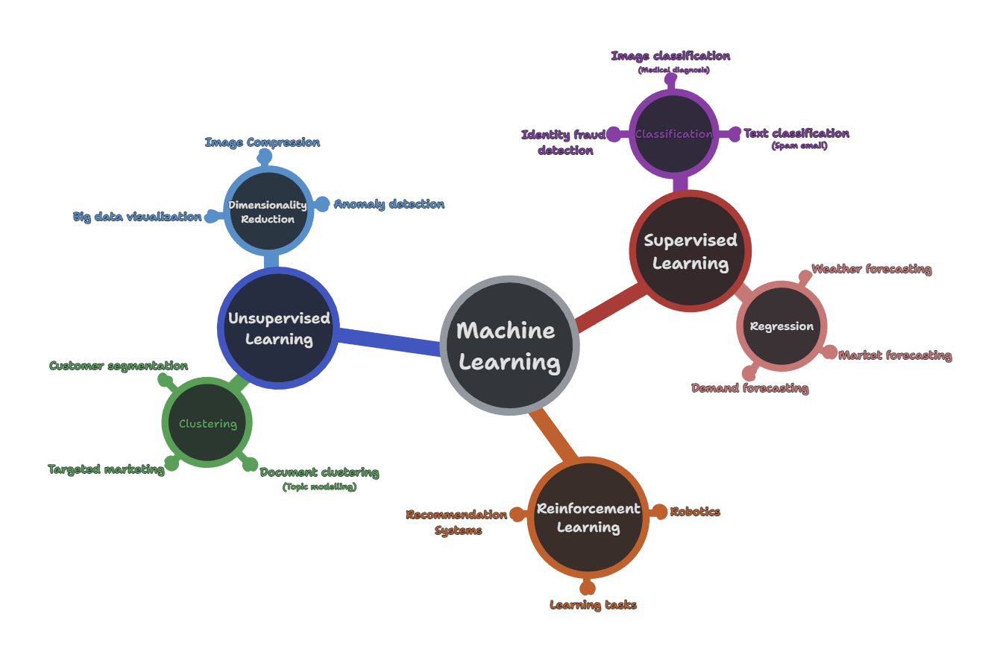

<h1 align="center" style="color: orange"> Data Science - I </h1>

## Table of contents

- [Introduction to Data Science](#introduction-to-data-science)
- [Application of data science](#application-of-data-science)
- [The Data Science Process](#the-data-science-process)
    - [Data](#data)
    - [Qualitative and Quantitative data](#qualitative-and-quantitative-data)
- [Machine learning](#machine-learning)
- [Deep learning](#deep-learning)
- [Generative AI](#generative-ai)

## Introduction to Data Science

We live in a world drowning in data. Websites, social media platforms, IOT devices and smartphones, smart cars, smart cooker (yes it exists) and what not, generates an incomprehensible amount of data every day. This enormous amount of data although seems like a ever growing problem, is a gold mine for businesses and organizations as they contains answers to questions that can help them make better decisions, understand their customers better, and improve their products and services.

Data science is the field that deals with extracting insights from data. It is an interdisciplinary field that combines domain knowledge, programming skills, and statistical and mathematical expertise to extract insights from data.

## Application of data science

- Healthcare
- Banking and Finance
- Transportation and Logistics
- Retail and E-commerce
- Manufacturing
- Education and Research
- Media and Entertainment
- Energy and Utilities
- Government and Public Sector

## The Data Science Process

### Data

 

### Qualitative and Quantitative data

**Quantitative data** is numerical data that can be measured and expressed as numbers. It is further divided into **`discrete`** and **`continuous`** data. 

Discrete data consists of distinct, separate values, while continuous data  can take on an infinite number of values within a given range.

**Qualitative data** deals with qualities and characteristics that cannot be measured in numerical terms. It is further divided into **`nominal`** and **`ordinal`** data. 

Nominal data represents categories or labels with no inherent order or ranking. Ordinal data represents categories with a specific order or ranking but does not have a consistent interval between values. The differences between ordinal values are not meaningful. 

## Machine learning

Machine learning is a subset of artificial intelligence (AI) that deals with developing algorithms and models that enable computers to learn and make predictions or decisions without being explicitly programmed, by consuming data and using statistical analysis to derive insights from it. 

At the core of almost all machine learning model including Neural networks, lies a very simple mathematical idea; 

> **_Fit a given set of data points into an appropriate function; that identifies the important information in the data from noise, then make sure this function performs well on new data_**

## Deep learning

Deep learning is a subset of machine learning that uses artificial neural networks (ANNs) to mimic the working of the human brain. It can learn complex representations of data and is used to solve complex problems such as image classification, speech recognition, natural language processing, etc.

## Generative AI

Generative AI is a subset of deep learning that uses deep learning to generate new data. It can be used for creating text,  images, videos, music, etc. Generative AI contributes to the recent resurgence of AI and is used in a wide variety of applications such as image generation, text generation, music generation, etc.

---

Now that we have a preliminary understanding of data science, let's delve deeper into the foundational concepts that underpin the field. 

- [Linear Algebra for data science and machine learning](./Linear_algebra.md)

- [Probability Theory for data science and machine learning](./Probability.md)

- [Statistics for data science and machine learning](./Statistics.md)

- [Calculus for data science and machine learning](./Calculus.md)

- [Discrete Mathematics for data science and machine learning](./Discrete_Mathematics.md)

- [Data Visualization for data science and machine learning](./Data_visualization.md)
