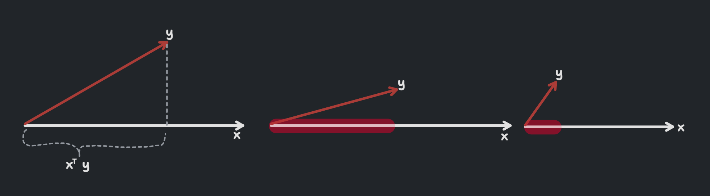

<!-- 
    Author : Kannan Jayachandran
    File : Statistics.md

    NOT REVIEWED

    - Remove code snippets
    - Add diagrams 
 -->

 <h1 align="center" style="color: orange"> STATISTICS </h1>

 ## Population and Sample  

Population can be any set of objects or events that we are interested in studying. It can be finite or infinite. Often we use the symbol $\color{#F99417}N$ to denote it.

Sample is a subset of the population. We typically denote it using the symbol $\color{#F99417}n$.   


## Mean

Mean is the average of the data. It is calculated by adding all the data and dividing it by the number of data points.

$$\mu = \frac{\sum_{i=0}^{n}x_i}{n}$$

## Median

Median is the middle value of the data. It is calculated by sorting the data and taking the middle value. If the number of data points is even, then we take the average of the two middle values.

$$median = \frac{n+1}{2}^{th} value$$

## Mode

Mode is the most frequent value in the data. It is calculated by counting the number of times each value occurs in the data and taking the value with the highest count.

## Variance ($\sigma^2$)

Variance is the average of the squared differences from the mean. It refers to how much on average that observations vary or differ from the mean value. It is the measure of spread of data.

$$var = \frac{1}{n}\sum_{i=0}^{n}(x_i-\mu)^2$$

## Standard Deviation ($\sigma$)

Standard deviation is the square root of the variance. It is the most commonly used measure of spread. We often calculate variance and then find standard deviation as it would be in same units as the data.

$$\sigma = \sqrt{\frac{1}{n}\sum_{i=0}^{n}(x_i-\mu)^2}$$

## Sampling

Sampling is the process of selecting a subset of individuals from a population to estimate characteristics of the whole population. While taking sample from a population we need to be careful about the following things;

1. The sample should be `representative` of the population.

2. The `sample size` should be large enough to represent the population and small enough to be manageable or practical.

3. The sample should be `selected randomly`.

4. The sample should be selected without replacement. It maintains the `integrity of the sample's ` representativeness.

> These might not always be possible, but we should try to achieve as many as possible.

### Types of Sampling

1. **Simple Random Sampling** : Simple random sampling is the process of sampling in which each member of the population has equal chance of being selected. The sample that results is called a _simple random sample_.


2. **Stratified Sampling** : Stratified sampling is the process in which the population (N) is divided into  non-overlapping groups.


3. **Systematic sampling** : Systematic sampling is a process in which the members are selected from a population at `nth` interval.


4. **Convinience sampling** : The process of taking samples from the population who has expertise in the sector.

5. **Cluster sampling** : Cluster sampling is a process in which the population is divided into clusters and the researcher randomly selects the clusters to form a sample. This is often used when it's impractical to sample individuals.

> When a sample misrepresents the populations we call it a **sample bias** or **sampling bias**.

## Mean

## Median 

## Mode

Mean is the average of the data. It is calculated by adding all the data and dividing it by the number of data points.




## Kernel Density Estimation (KDE)

KDE is the application of kernel smoothing to estimate Probability density function of a random variable based on kernel as weights. It is also termed the _Parzen–Rosenblatt window method_.


The image on the left side indicate a histogram which is a discrete representation of the data. The image on the right side indicate a KDE which is a continuous representation of the data. We construct a `kde` by placing a kernel at each data point and then summing up the kernels to get a smooth curve. We are using a Gaussian kernel here. The variance of each kernel is known as the `bandwidth`. The bandwidth is a hyperparameter that controls the smoothness of the curve. Setting a higher bandwidth will result in a smoother curve, while setting a lower bandwidth will result in a more jagged curve.

> Kernels are functions that are used to calculate the weights of the data points.

## Sampling Distribution

Sampling distribution is the probability distribution of a samples; that comes from choosing random samples of a given population. We will get a better idea of what it is by looking at the process of sampling distribution.

- Consider a population with a distribution (can be any distribution), we are drawing samples from this population.

- Select random sample of size `n` from the population.

- Calculate the mean of the sample. (we can also calculate other statistics like median, mode, standard deviation, etc.)

- Repeat the above steps `M` times.

- Develop a frequency distribution of the sample means or the statistics calculated.

- Plot the frequency distribution of the sample statistic.

**If we have `M` sample means $\bar x_i = \bar x_1, \bar x_2, \bar x_3, ...\bar x_n$ then the sampling distribution of the sample means is the probability distribution of these sample means.**

## Central Limit Theorem (CLT)

CLT is one of the most important theorems in statistics. It states that, if we have a population with finite mean $\color{#F99417}\mu$ and variance $\color{#F99417}\sigma^2$ and take sufficiently large random samples from the population of size $\color{#F99417}n$  with replacement $\color{#F99417}m$ times, then the distribution of the sample means (Sampling distribution of sample means) will be approximately normally distributed.

$$OR$$

**As the size of the sample increases, the distribution of the mean across
multiple samples will approximate a Gaussian distribution.**

$$ \bar x_i \sim N(\mu, \frac{\sigma^2}{n})\;\;as\;\; {n\rightarrow \infin}$$ 


where $\color{#F99417}\bar x_i$ is the sampling distribution of the sample means, $\color{#F99417}N$ is the normal distribution with mean $\color{#F99417}\mu$ (which is same as the population mean) and variance $\color{#F99417}\frac{\sigma^2}{n}$ (where $\color{#F99417}\sigma^2$ is the population variance and $\color{#F99417}n$ is the sample size).

> We generally consider CLT to be valid if the sample size ($\color{#F99417}n$) is greater than 30.

**Observations**

- CLT will be true for any distribution of the population.

- It shows that the distribution of errors from estimating the population mean will be normally distributed.

## Quantile-Quantile (QQ) Plot

QQ plot is a graphical technique for easily determining whether a random variable is Gaussian or normally distributed. Consider the random variable $\color{#F99417}x$, with samples/observations $\color{#F99417}\bar x_1, \bar x_2, \bar x_3, ...\bar x_n$.

- First sort them in ascending order. $\color{#F99417}\bar x`_1, \bar x`_2, \bar x`_3, ...\bar x`_n$.

- Calculate the percentile. $\color{#F99417}x^{(1)}, x^{(2)}, x^{(3)}, ...x^{(n)}$. We get the first percentile at $\color{#F99417}\bar x`_{\frac{n}{100}}$

> If we have 100 data points, then the first percentile is the first data point. If we have 1000 data points, then the first percentile is the 10th data point.

- Create $Y \sim N(0, 1)$, where $\color{#F99417}Y$ is a random variable that follows a standard Gaussian distribution, with mean $\color{#F99417}\mu = 0$ and standard deviation $\color{#F99417}\sigma = 1$.

- Create $\color{#F99417}n$ observations from the $\color{#F99417}Y$ distribution. Sort them in ascending order and find the percentile. $\color{#F99417}y^{(1)}, y^{(2)}, y^{(3)}, ...y^{(n)}$. These are also called `theoretical quantiles`.

- Now plot the $\color{#F99417}x^{(i)}$ vs $\color{#F99417}y^{(i)}$.

If the plot is a straight line (approx.), then the random variable $\color{#F99417}x$ is normally distributed.

> Q-Q plot can also help us in determining whether we have same distributions; given two random variables $\color{#F99417}x$ and $\color{#F99417}y$.

## Chebyshev's Inequality

Chebyshev's inequality is a fundamental theorem in probability that defines an upper bound on how much of a distribution lies within a given range from the mean. Formally we can define chebyshev's inequality as follows;

Consider the random variable $\color{#F99417}X$, with finite mean $\color{#F99417}\mu$ and standard deviation $\color{#F99417}\sigma$ which is non-zero and finite. We **don't know** the distribution of $\color{#F99417}X$. Then we can write the probability of $\color{#F99417}X$ lying within $k$ standard deviations of the mean as;

$$P(|X-\mu|\ge k\sigma)\le \frac{1}{k^2}$$
    
where $\color{#F99417}k$ is any positive real number.


The above equation simply says that the probability of $\color{#F99417}X$ lying in the marked region is less than or equal to $\color{#F99417}\frac{1}{k^2}$. We can interpret this in another way as well; 

$$P(\mu - k\sigma < X < \mu+k\sigma)\ge 1 -\frac{1}{k^2}$$


> Chebychev's inequality is a very powerful in practical applications because it can be applied to any distribution. Unlike the empirical rule, it does not pin point the exact percentage, instead gives then upper bound of the percentage.

# Univariate Analysis

Univariate analysis is the simplest form of analyzing data. “Uni” means “one”, so in other words your data has only one variable. It doesn’t deal with causes or relationships (unlike regression ) and it’s major purpose is to describe; It takes data, summarizes that data and finds patterns in the data.


## Mean $\mu$

The mean is the average of the numbers. In other words it is the sum of all values divided by the number of values.

$$\mu = \sum_{i=0}^{n}\frac{x_i}{n}$$

It can be affected by outliers.

Mean is the best measure of central tendency for symmetric distributions.

## Spread or Variability

Spread simply tells us what is the range of the data. It is the difference between the highest and lowest values in a data set. It shows how each of the data points are spread out from the mean.

we generally use the square of the difference between each data point and the mean. This is because the sum of the differences from the mean is always zero. So we square the differences to get rid of the negative signs.

## Correlation


$$var = \frac{1}{n}\sum_{i=0}^{n}(x_i-\mu)^2$$

Therefore variance is the average of the squared differences from the mean.

if we take the square root of the variance, we get the standard deviation. It is the most commonly used measure of spread. 

$$\sigma = \sqrt{\frac{1}{n}\sum_{i=0}^{n}(x_i-\mu)^2}$$

# Standard deviation

A lower std. dev means the data points tends to be close to the mean. which means the data is less spread out. 

A higher std. dev means the data points tends to be far from the mean. which means the data is more spread out. A higher std.dev is also an indicator of outliers or extreme values.

## Median

The median is the middle value in a data set. It is the value for which 50% of the values are smaller and 50% are bigger. It is not affected by outliers.

$$median = \frac{n+1}{2}^{th} value$$


Usually we sort the data and take the middle value. If the number of values is even, we take the average of the two middle values.

Median can get affected by outliers only if more than 50% of the data is outliers.

## Percentile

Percentile is the value below which a percentage of data falls. For example, the 20th percentile is the value (or score) below which 20% of the observations may be found. ie.; it tells that 20% of the observations are below this value.

50th percentile is the same as median.

25th, 50th, and 75th, 100th percentiles are called Quantiles.

```python

np.percentile(setosa_df['PetalLengthCm'], np.arange(0, 100, 25))

np.percentile(setosa_df['PetalLengthCm'], 99)
```

Median absolute deviation is similar to standard deviation but it is more robust to outliers.

```python
from statsmodels import robust

robust.mad(setosa_df['PetalLengthCm'])
```

## Inter Quartile Range (IQR)

IQR is the difference between the 75th and 25th percentiles. It is the range of the middle 50% of the data. It is not affected by outliers.

```python
Q1 = np.percentile(setosa_df['PetalLengthCm'], 25)
Q3 = np.percentile(setosa_df['PetalLengthCm'], 75)
```


## Covariance

- Def, formula, properties, example
- Limitations of covariance

## Pearson Correlation Coefficient

- Def, formula, properties, range
- Limitations of pearson
- Bias towards linear relationships

## Spearman Correlation Coefficient

## Kendall Correlation Coefficient

## point estimate

## Confidence Interval

<!-- Let x_bar represent the sample mean and mu represent the population
mean. Now, if we repeat the sampling multiple times, each time, we get a
different value of sample mean, x_bar. In 95% of the sampling
experiments, mu will be between the endpoints of the C.I calculated using
x_bar, but in 5% of the cases, it will not be. 95% C.I does NOT mean that
mu lies in the interval with a probability of 95%. -->

- Calculating confidence interval given then underlying distribution (Normal, t, etc.)
